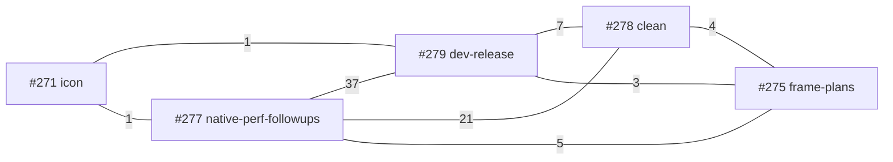

# Branch and PR state as of 2026-09-22

Current queue: **#287 is the sole open PR**, owned by the user's other section to recover the `develop -> main` promotion. #283 merged, then #285 reverted that promotion on `main`; #284 merged into `develop`. #286 was a conflicted plain `develop -> main` retry and closed unmerged. #282 was closed unmerged because PRD-400 Phase 1 acceptance remains open; its branch is fully pushed. #275, #278, #280 and #281 landed; #271, #277 and #279 are closed unmerged.

## Current status

| PR | Branch | State |
| --- | --- | --- |
| #287 | `sync/develop-main-20260923 -> main` | **Open, Ready.** Head `99dd655e4` reverts #285 and merges `origin/develop`; its tree hash equals `eb4dd6c32` (`7962edf47`, verified locally). Exact-head full main CI is pending; the other section owns its merge. |
| #286 | `develop -> main` | **Closed unmerged.** Plain retry could not reapply the reverted #283 merge and was conflicted. |
| #285 | `revert-283-develop` | **Merged into `main`** at `f59758a0d`, reverting #283. Its tree equals pre-promotion `8aadbbf21`, so `main` no longer contains the release cohort. The user is handling this in another section; do not re-promote from this lane. |
| #284 | `ci/native-required-when-native` | **Squash-merged into `develop`** at `eb4dd6c32`. Its checkout under `.claude/worktrees/ci-native-required` was already removed by another actor; path and registration absent. |
| #283 | `develop -> main` | **Merged with a merge commit** at `9356b2994`, second parent `e87b83098` as intended. Subsequently reverted by #285. |
| #282 | `perf/prd-400-ac1` | **Closed unmerged** at pushed head `16bcc50fb`; PRD-400 Phase 1 remains incomplete. Branch and worktree retained. |
| #281 | `ci/native-off-verdict-path` | **Merged into `develop`** at `e1d20bbea`; optional native platform jobs no longer hold `ci-required`. |
| #280 | `release/package-cohort-20260922` | **Merged into `develop`** at `e87b83098`. Full local release checks and exact-head `ci-required` passed. Its worktree was removed after merge audit. |
| #278 | `fix/native-perf-followups-clean` | **Merged into `develop`** at `fac2f7149`. Exact-head CI run `35785938963` passed. Eight packaged-game A/B runs were inconclusive for speedup; PRD performance acceptance remains open. |
| #275 | `perf/compiled-frame-plans-20260917` | **Merged into `develop`** at `2087a883a`. |
| #271 | `codex/prd-375-macos-icon-content` | **Closed unmerged** — PRD-375 still PARTIAL; branch and worktree preserved. |
| #277 | `fix/native-perf-followups` | **Closed unmerged** — PRD-393 acceptance still open; branch and worktree preserved. |
| #279 | `fix/dev-release` | **Closed unmerged** — its PRD remains PARTIAL; branch and worktree preserved. |

Open acceptance: **PRD-375, PRD-393, PRD-399 and PRD-400**. None is complete, so none of their closed PRs was merge-ready.

## Historical reconciliation details (preserved)

### #277 (`fix/native-perf-followups`)
- Earlier #276 targeted `main` and was closed. Local and remote had diverged **63 ahead / 8 behind**; remote-only commits audited for reconciliation:
  - `bd1a6a6c6` overlay ABI fix — unique, not present locally; preserve.
  - `83d4acaf9` CI coverage diagnostic, `c34cf9cb7` formatting, `d493228b0` expectation update — a set; preserve together.
  - `6aaf65664` image decode hardening — carries RAII/overflow logic **absent from #278** and a cancellation overlap that needs review.
  - `4295bded0` tree-specific coverage digest — regenerate for the final tree, do not hand-merge.
  - Two merge commits — structural only.
- Overlapped #278 (3 base commits already here, 10 fix commits not; 21 files shared) and #279 (37 files, no shared commits).
- `performance-basics.md` edit preserved in local commit `953effe9e` (`pnpm check:docs` passed).
- **Local reconciliation `1fe975f0b` remains unpushed** (see worktrees).

### Pairwise file overlap (historical)

## Worktrees

| Path | Branch | State |
| --- | --- | --- |
| `.worktrees/pr277` | `pr277/resolve-conflicts` | Local merge `1fe975f0b` contains both #277 heads; coverage regenerated from combined tree. Clean and unpushed; retained because #277 is closed and its PRD is still PARTIAL. |
| Primary checkout | `develop` | The user's other section has returned the checkout to local `develop=fd913851b` after opening #287; do not alter its branch or checkout from this lane. Local `develop` has two separate PRD-400 commits, while remote `develop` is `eb4dd6c32`; they diverge. Those commits are preserved on remote `perf/prd-400-ac1`. Do not push local `develop` into the release. The former `fix/native-perf-followups` branch remains at `953effe9e`; no unfinished #277 work was squashed into develop. |
| `.worktrees/bonsai-develop` | `archive/develop-unpublished-20260922` | Preserves ten unpublished commits at `2bc80533e`, excluded from release; upstream unset to prevent an accidental push to `develop`. |
| `.worktrees/dev-release` | `fix/dev-release` | #279 closed; branch preserved |
| `.worktrees/auto-lod` | `feat/auto-lod` | No PR; dirty |
| `.worktrees/bonsai-e2e` | `bonsai-e2e-0918-1230` | No PR |

Removed after cleanup audit: `.worktrees/pr278-baseline` (completed A/B), `.worktrees/pr278` (merged #278), and `.worktrees/release-prepare` (merged #280). Untracked in this primary checkout: `.runtime/prd064/` and this file. Do not touch `.runtime/prd064/`.

## Remote branches

197 remote branches; 25 fully merged into `develop` are cleanup candidates pending branch ownership and PR checks. `automation/*` branches: `native-coverage-pr275`, `native-coverage-pr277`, `pr237-reconcile-20260914`.

## Next actions

1. **Leave #287's exact-head full CI and merge to the user's other section.** `origin/main=f59758a0d` and `origin/develop=eb4dd6c32` still diverge. Verify a merge commit and tree equality after it lands; do not claim `main` is synced or a packaged speedup from #278 before then.
2. **Return the queue to zero** after #287 resolves. #282's incomplete PRD-400 L0 work remains on its pushed branch; its Android matrix runner still does not apply CLI-selected axes to an installed APK.
3. **Land #271, #277, #279 only when their PRDs (375, 393/399) are accepted** — they are closed, not merge-ready.
4. **Leave `1fe975f0b` and `archive/develop-unpublished-20260922` unpushed**; they preserve unfinished work.
5. **Cleanup after merges** — audit each eligible worktree and remote branch before removal; retain any checkout with unpreserved data or active ownership.
