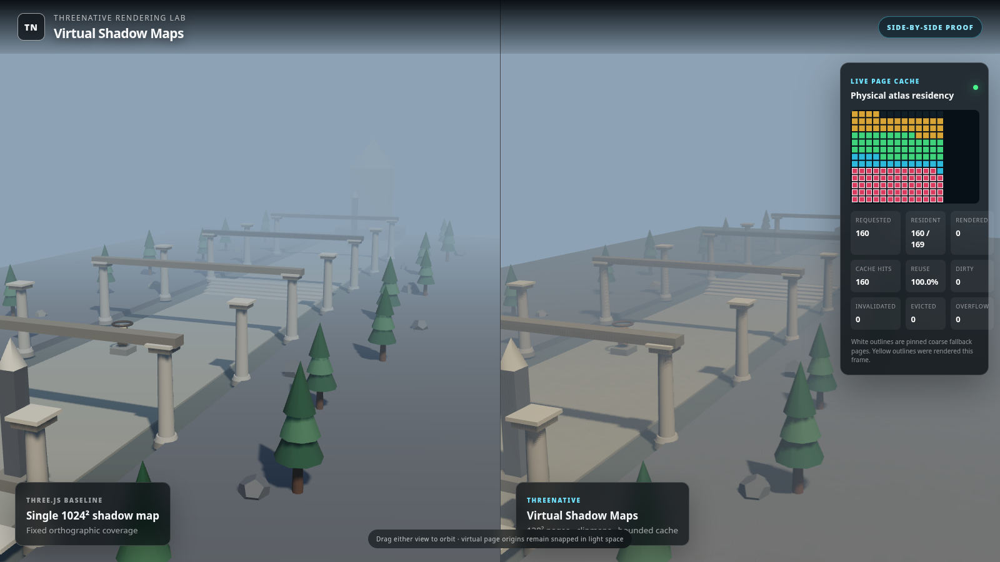
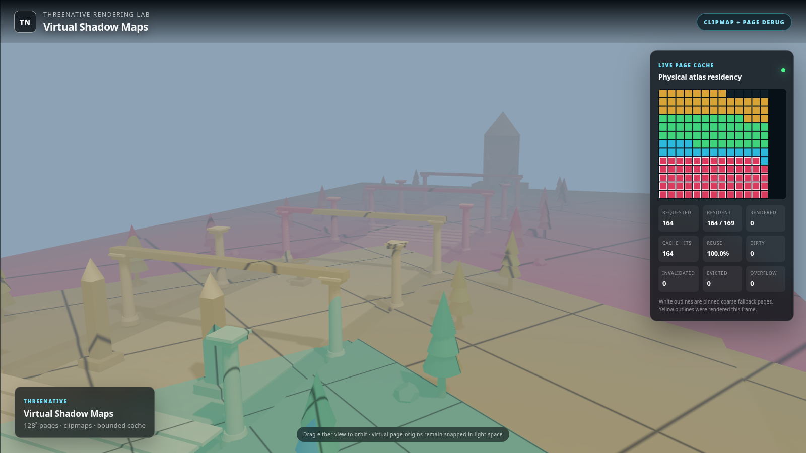
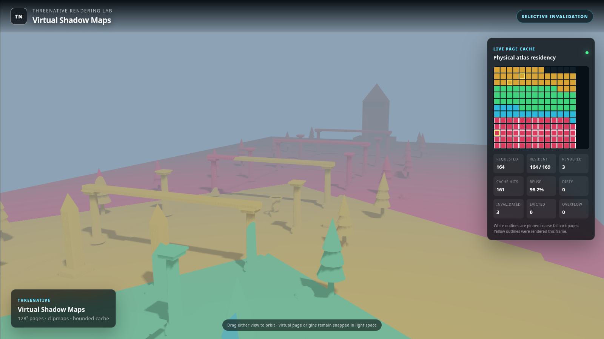

# ThreeNative Virtual Shadow Maps

A runnable Unreal-inspired virtualized directional shadow-map vertical slice for upstream Three.js and ThreeNative.

This is **not** Three.js Variance Shadow Mapping and it is not ordinary cascaded shadow mapping renamed. The implementation uses real 128×128 virtual pages, a bounded physical packed-depth atlas, a GPU page-table texture, camera-centered light-space clipmaps, deterministic LRU residency, selective bounds invalidation, page-safe PCF, and hierarchical coarse fallback.

## Run

The easiest artifact is `standalone.html`; open it in a modern WebGL2 browser. The source-module version can be served from this directory:

```bash
python3 -m http.server 8080
```

Then open `http://localhost:8080`.

Modes:

```text
?mode=comparison    conventional 1024² PCF beside virtual pages
?mode=debug         clip-level colors and virtual page boundaries
?mode=invalidation  moves one tracked caster and proves selective redraw
```

## Commands

```bash
npm test
python3 scripts/build_standalone.py
python3 scripts/capture.py --mode comparison --output report/comparison.png
python3 scripts/capture.py --mode debug --output report/virtual-pages-debug.png
python3 scripts/capture.py --mode invalidation --output report/cache-invalidation.png
python3 scripts/verify_runtime.py

# Playwright from node (no python playwright needed); PLAYWRIGHT_PATH may name an installed package
PLAYWRIGHT_PATH=/path/to/node_modules/playwright node scripts/capture.mjs comparison report/comparison.png
node scripts/capture.mjs probe.html report/probe.png && node scripts/probe-check.mjs report/probe.json
```

`probe.html` is the numeric footprint probe: one sphere over a plane, top-down orthographic view,
the virtual shadow term beside a stock PCF control. `scripts/probe-check.mjs` fails unless the
virtual footprint centroid lands within 0.75 world units of both the analytic centre and the stock
control and the dark-pixel mask differs from the control by at most 1 %. Before the light-space
basis fix it read 11.43 / 11.80 units off (every page mirrored along u); after it reads 0.19 / 0.47.

No package installation is required. Three.js r160 is vendored under its MIT license solely so this sandbox proof is reproducible offline.

## Architecture

- `src/core`: renderer-independent page cache, clipmaps, demand, and invalidation.
- `src/render`: Three.js physical atlas renderer and GLSL virtual lookup material.
- `src/demo`: deterministic comparison scene and proof UI.
- `test`: Node built-in unit and source-contract tests.
- `report`: screenshots and machine-readable runtime proof.

See `THREENATIVE_INTEGRATION.md` for the production service boundary and WebGPU upgrade path. See the design and implementation plan under `docs/superpowers` for exact scope and trade-offs.

## Captured runtime proof

The checked-in browser captures were rendered through Chromium/SwiftShader at 1600×900 and validated by `scripts/verify_runtime.py`:

- `report/comparison.png`: 160 requested/resident pages in a 169-slot atlas, 100% reuse after warm-up, zero overflow.
- `report/virtual-pages-debug.png`: clipmap selection, page boundaries, and 164 of 169 physical slots resident.
- `report/cache-invalidation.png`: one caster move invalidated and rerendered only 3 of 164 pages.
- `report/runtime-proof.json`: machine-readable assertions, counters, image dimensions, and image-variance checks.







## Honest limitation

Unreal uses a GPU depth-buffer/compute marking path for visible page demand. This WebGL2 vertical slice uses screen-space receiver rays plus visible caster/receiver bounds on the CPU. The result still virtualizes storage and rendering; the future WebGPU demand backend can replace that one stage without rewriting residency, invalidation, atlas rendering, page-table sampling, or fallback.
