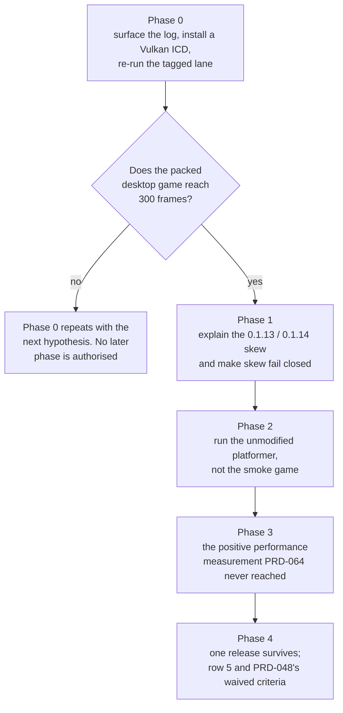

# PRD-078 — Beta row 5: ten releases were built, published, and deleted again, and one line says why

**Status: BLOCKED — requires a green hosted release run, 2026-08-16.**

Phase 1 is executed and verified. Phase 0's tag was pushed, the run was read, and the failure this
PRD was written about is **fixed**: the desktop core gate passed on the runner with 300 frames and
a non-blank screenshot, and the `SDL_CreateWindow` / `VK_KHR_surface` error that killed the
previous ten tags did not recur. `darwin-arm64` and `build-android` succeeded.

It is blocked because three *other* legs fail, and none of them can be fixed from here without
guessing at CI environments:

| Leg | Failure | Why it is not fixable blind |
|---|---|---|
| `linux-x64` | `verify-desktop-physics.mjs:185`, *"missed the completed parity marker"* | The same script exits `0` on this host with all three proofs passing. Not the 120s timeout — `spawnSync` reports that as `exited null` |
| `win32-x64` | `argon2 install: gyp ERR! Could not find any Visual Studio installation` | `argon2` is used only by `hosting/control-plane/`, but `hosting/` is not a workspace package, so it must be a root dependency. The fix is a CI install change that cannot be verified without spending another run |
| `build-ios-simulator` | `xcrun simctl launch … failed (4)` | Needs an Apple runner to iterate against |

`publish` and both `clean-consumer` jobs were skipped, so no release exists and the consumer proof
this PRD exists to turn green has still not run. **Beta bar row 5 stays open.**

**What unblocks it:** one hosted release run in which all five build legs are green. The three
failures above are independent and each has a named next step.

---

**Phase 1's first question is settled by measurement rather than by choosing between three
candidates.** It asked why a `v0.1.14` release's consumer ran a binary reporting `0.1.13`. It is
candidate one, a version constant not bumped with the package, and it is two lines:

```console
$ grep -n version packages/runtime-native/package.json | head -1
3:  "version": "0.1.14",
$ head -2 packages/runtime-native/CMakeLists.txt | tail -1
project(MystralNativeRuntime VERSION 0.1.13 LANGUAGES C CXX)
$ grep -n 'MYSTRAL_VERSION' packages/runtime-native/CMakeLists.txt
1229:    MYSTRAL_VERSION="${PROJECT_VERSION}"
```

`MYSTRAL_VERSION` compiles into `getVersion()`, which `main.cpp:1416` prints as the launch log's
`Version:` line. Two numbers had to be edited together, one was, and **nothing failed when they
diverged** — so the consumer proof reported a skew it could not explain and ten releases were
built and deleted before anyone traced it. Neither a cached artifact nor a manifest resolved from
a different tag is needed to explain it.

`CMakeLists.txt` now reads the version from `package.json` and refuses to configure if it cannot,
with `tests/native-version-stamp.test.mjs` asserting the literal cannot come back.

**Verified.** `which cmake` finds nothing on this host, but the native toolchain vendors one at
`packages/runtime-native/.runtime/tools-venv/bin/cmake` (4.4.2), and with it on `PATH` all three
cases run:

```console
$ export PATH="$PWD/packages/runtime-native/.runtime/tools-venv/bin:$PATH"
$ pnpm --filter @threenative/runtime-native exec vitest run --config vitest.config.ts \
    tests/native-version-stamp.test.mjs
 Test Files  1 passed (1)
      Tests  3 passed (3)
```

`project()` reports the version `package.json` declares, and a version it cannot parse fails
configuration with `TN_NATIVE_VERSION_UNREADABLE` rather than stamping something wrong. The two
configuring cases skip where no CMake exists, so the default gate still does not require one.

**Phase 0's tag was pushed on 2026-08-16 and the run failed. The Vulkan ICD was not the
blocker.** `runtime-native-v0.2.0`, run `31965691750`. The tag was deleted afterwards so `0.2.0`
stays retryable; the run remains in Actions.

**The good news is real: the desktop core gate passed on the runner.**
`desktop core gate passed: 300 frames, 1280x720, artifacts/desktop-core-2026-08-16.png` — the
`SDL_CreateWindow failed: Installed Vulkan doesn't implement the VK_KHR_surface extension` that
killed the previous ten runs did not recur. `validate-tag` passed, and `darwin-arm64` and
`build-android` both **succeeded**.

Three legs failed, for three unrelated reasons, and none is the one this PRD was written about:

| Leg | Failure | Assessment |
|---|---|---|
| `linux-x64` | `verify-desktop-physics.mjs:185` — *"desktop physics proof missed the completed parity marker"* | **Does not reproduce here.** The identical script exits `0` on this host with all three proofs passing. `spawnSync` reports a timeout as `exited null`, so this is not the 120s timeout — the runtime exited cleanly and never emitted `TN_NATIVE_PHYSICS_PARITY:native:`. A real runner-versus-host behavioural difference, undiagnosed |
| `win32-x64` | `argon2 install: gyp ERR! Could not find any Visual Studio installation to use` | **Nothing to do with the native runtime.** `argon2` is a root `package.json` dependency for the hosting control plane, and it needs node-gyp plus Visual Studio. The Windows leg dies during `pnpm install --frozen-lockfile`, before it compiles anything |
| `build-ios-simulator` | `xcrun simctl launch --terminate-running-process … failed (4)` | Simulator launch, not a build failure |

`publish`, `clean-consumer` and `clean-consumer-ios` were all **skipped**, so no release was
created and the clean-consumer proof this PRD exists to turn green **still has not run**. The
`v0.1.14` version skew it was also chasing is fixed and verified separately.

**The cheapest next step is the Windows one**, and it is not a native problem: a hosting
dependency at the workspace root should not be installed by a native release build.

**Superseded, from 2026-08-15:** A tag push builds and
publishes GitHub release binaries — an outward-facing, irreversible action of the same class as
PRD-119 Phase 2, which the owner gated on 2026-08-15. The software Vulkan path therefore remains
unverified and no workflow was triggered. See
[`consumer-handoff-2026-08-12.md`](../../../verification/consumer-handoff-2026-08-12.md).
The original evidence below is a read of
`.github/workflows/native-release.yml` at commit `11bf82d`, of `gh run`/`gh api` output taken
2026-08-11, and of the failure artifact downloaded from run
[`31360511081`](https://github.com/jonit-dev/threenative/actions/runs/31360511081). No new run
has been performed. No mobile-readiness, physical-device or iOS claim is made.

**Beta bar row 5 reads *"a user with no C++ toolchain ships a native game from published
artifacts."* There are no published artifacts.**

```
$ gh api repos/jonit-dev/threenative/releases -q '.[] | .tag_name'
(empty)
```

That is not because the release lane is unbuilt. It is because the release lane is
**correct, complete, and red**, and it deletes its own release when the consumer proof fails.

| Fact | Evidence |
|---|---|
| 10 release tags pushed, `runtime-native-v0.1.5` … `v0.1.14` | `git ls-remote --tags origin` |
| 10 workflow runs, **0 successes** | `gh run list --workflow native-release.yml` |
| Latest: `v0.1.14`, run `31360511081`, 2026-08-10, 21m28s | same |
| In that run `validate-tag`, all three `build` matrix legs, `build-android`, `build-ios-simulator`, `publish` and `clean-consumer-ios` **all succeeded** | `gh run view 31360511081 --json jobs` |
| `clean-consumer` failed at one step: *Launch the packed desktop game for 300 frames* | same |
| `cleanup-failed-release` then succeeded — **the published release was deleted** | same |
| Zero releases exist today | `gh api …/releases` |

**And the step failed in 314 milliseconds**, from `06:20:08.157` to `06:20:08.471`. Nothing
rendered. The failure artifact says exactly why:

```
=== Mystral Native Runtime ===
Version: 0.1.13
Script: .threenative/game.js
Window: 1280x720
[Window] SDL initialized
[Window] SDL_CreateWindow failed: Installed Vulkan doesn't implement the VK_KHR_surface extension
[Mystral] Failed to create window
Error: Failed to create runtime!
```

`clean-consumer-linux-x64/threenative-consumer.log`, run `31360511081`.

**Beta row 5 is blocked on a missing Vulkan ICD on a GitHub runner.** Not on a design
question, not on release credentials, not on hardware, and not on any framework defect. The
`ubuntu-24.04` image under `xvfb` presents a Vulkan loader with no `VK_KHR_surface`
implementation, so SDL cannot create a window, so the binary exits before its first frame.

**Two more things that log says, and they are separate defects.** First, the binary reports
`Version: 0.1.13` while the tag under test was `runtime-native-v0.1.14`. That is unexplained
and this PRD does not guess at it — Phase 0 measures it. Second, **the step redirects the
game's output to a file and only greps it**, so ten red runs produced a diagnostic that no
one saw without downloading an artifact. A gate whose failure output is invisible is a gate
that costs ten runs to read once.

**Complexity: 7 → HIGH mode.** A release lane that must go green end-to-end before anything
downstream is provable; a headless GPU environment question; an unexplained version skew in
the artifact resolution path; a consumer proof that runs the wrong game for the criterion it
is cited against; and a performance measurement that has never been taken.

**Blast radius (candidate, phase-gated).**
Phase 0: `.github/workflows/native-release.yml`, `docs/verification/`.
Phase 1: `.github/workflows/native-release.yml`,
`packages/runtime-native/scripts/install-prebuilt.mjs`,
`packages/runtime-native/src/runtime.cpp` (version stamp only, if Phase 0 implicates it).
Phase 2: `.github/workflows/native-release.yml`,
`packages/create-threenative/templates/platformer/`.
Phase 3: `packages/runtime-native/scripts/profile-production.mjs`, `docs/verification/`.
Phase 4: `docs/strategy/ROADMAP.md`, `docs/strategy/VALUE-PROPOSITION.md`,
`docs/PRDs/done/PRD-048-native-distribution.md`.

**Depends on:** nothing. **Unblocks:** beta bar row 5, [PRD-064](../../native/PRD-064-tier-1-native-reliability.md)
Phase 4's unreached positive measurement, and the four criteria
[PRD-048](../../done/PRD-048-native-distribution.md) closed as *"waived by the owner, not
met"* — the release rerun, the checksum lock, the registry packages, and the clean-machine
build.

---

## 1. Why this exists

### 1.1 The lane is good. That is the point.

`native-release.yml` is not a stub. Read what `clean-consumer` already does:

- Packs `core`, `physics`, `playtest`, `runtime-native` and `create-threenative` to tarballs
  and scaffolds **outside** the workspace (`:278-305`) — the same isolation discipline
  `scripts/make-sandbox.ts:6-11` explains at length.
- Builds a clean Android SDK by symlinking only `build-tools`, `cmdline-tools`, `emulator`,
  `licenses`, `platform-tools`, `platforms` and `system-images`, then **asserts** `ndk` and
  `cmake` are absent (`:312-324`).
- Masks twelve toolchain entry points — `cargo`, `cc`, `clang`, `clang++`, `cmake`, `c++`,
  `g++`, `gcc`, `ndk-build`, `ninja`, `rustc`, `xcodebuild` — with stubs that log their
  invocation and exit `97`, then asserts the log file never appears after every build step
  (`:327-344`, and `test ! -e "$TN_TOOLCHAIN_LOG"` at `:349`, `:365`, `:381`, `:399`).
- Runs the packed Android target on an emulator with **four negative controls**:
  wrong-height, collision-mask, mask-with-control-enabled, and wrong-gravity, each asserting
  a specific `TN_PLAYTEST_*_ASSERTION_FAILED` and exit `1` (`:386-398`).

That is beta row 5's proof, already written, already fail-closed. **It has never run to
completion.** `clean-consumer` dies at `:346-364`, four steps in, and every step after it —
the Android build, the emulator physics run, all four negative controls — has never executed
on a published artifact.

### 1.2 What the failure actually is

`SDL_CreateWindow failed: Installed Vulkan doesn't implement the VK_KHR_surface extension`.

The `ubuntu-24.04` runner image ships a Vulkan *loader* but the ICD available under `xvfb`
does not implement the surface extension SDL needs to attach a swapchain to an X11 window.
The repository's other headless lanes work around the same family of problem with
`sh scripts/xvfb.sh`, which this step already uses — **xvfb is necessary
and not sufficient.** A software Vulkan ICD (`mesa-vulkan-drivers`, lavapipe) is what is
missing, and it is an apt install on the runner, not a code change.

**This PRD treats that as a hypothesis until Phase 0 observes it fixed.** The candidate is
strong and cheap to falsify; it is not yet a measurement.

### 1.3 The proof runs the wrong game for the criterion it is cited against

`clean-consumer` scaffolds `--template minimal` and then overwrites `src/game.ts` with
`examples/native-smoke/src/game.ts` (`:305-311`), and later with
`examples/native-smoke/src/physics.ts` (`:367`). That is the right subject for a *smoke*
contract and the wrong one for **row 5** and for PRD-064's Phase 4, which name *"the
unmodified platformer."*

Two consequences, and both matter:

- Nothing proves a *scaffolded template as generated* survives the toolchain-free path. The
  minimal template is scaffolded and then its entry is replaced, so the template's own game
  code is never the thing that runs.
- **No performance number is taken at all.** PRD-064's ledger is explicit: all three Phase 4
  negative controls are observed red, and *"the positive, unmodified scaffold measurement on
  one host was not reached."* `pnpm profile:production` exists and supports
  `--target desktop`, `desktop-pair`, `web` and a control-only `fixture`
  (`profile-production.mjs:33`, `:126`). It has never been pointed at a consumer build from a
  published artifact.

**Choose the hardest real subject.** The platformer is the biggest template the framework
ships and the one every performance claim in `VALUE-PROPOSITION.md` is measured on. Proving
the consumer path on a smoke game is the toy-proof anti-pattern with a green tick next to it.

## 2. What the code and the runs say, before anything is changed

- `install-prebuilt.mjs:52` builds the manifest URL as
  `…/releases/download/runtime-native-v${packageVersion}/prebuilt-lock.json`, with
  `packageVersion` read from `packages/runtime-native/package.json` (`:9`, currently
  `0.1.14`). With zero releases, every default-path resolution 404s.
- `readRelease` (`:45`) throws *"No prebuilt release manifest exists for '<key>'; this target
  remains OPEN"* when the manifest is missing, and `verifyChecksum` (`:26`) rejects any
  mismatch. **The consumer path fails closed already.** Nothing here is fail-open; it is
  simply unreachable.
- `platformKey` supports exactly `darwin-arm64`, `linux-x64`, `win32-x64` (`:10-14`). The
  publish job's checksum lock covers those three plus five Android artifacts and one iOS
  simulator zip (`native-release.yml:231-249`).
- The publish job runs with `permissions: contents: write` and `GH_TOKEN: ${{ github.token }}`
  (`:221-222`, `:261`). **It needs no external credential**, and it has already succeeded
  once. The `blocked/README.md` row that files release work under *"npm, GitHub and
  platform-signing release credentials"* is right about PRD-060 and wrong about this job —
  the same shape of correction as the `macos-15` discovery.
- `cleanup-failed-release` is the reason no artifact survives. That job is **correct** and
  this PRD does not weaken it: a published runtime no clean consumer can install is worse
  than no runtime.

## 3. Solution



- **Make the failure visible before making it go away.** The step must print the game's log
  on failure. Ten runs produced one readable diagnostic and it took an artifact download.
- **Install a software Vulkan ICD in `clean-consumer`** and re-run the existing lane
  unchanged otherwise. Change one variable.
- **Make version skew fail closed.** A runtime reporting a version other than the tag under
  test must stop the release, not proceed.
- **Swap the subject to the unmodified platformer** for the desktop leg, and keep the
  native-smoke physics leg for what it is good at — the four negative controls.
- **Take the measurement.** `pnpm profile:production --target desktop` against the consumer
  build, with PRD-064's three already-red controls re-run beside it so the positive is not the
  only number in the file.

**Key decisions:**

- [ ] `cleanup-failed-release` stays exactly as it is. Nothing is published that a clean
      consumer cannot use.
- [ ] The Vulkan ICD is installed **only in the CI job**, never bundled into the runtime or
      required of a user. A user has a real GPU; the runner does not.
- [ ] The desktop leg runs the platformer template **as generated**. If it needs an edit to
      run, that is the finding, and it is a template or framework bug — not a licence to edit
      the subject.
- [ ] No criterion of PRD-048 is un-waived without an executed run behind it.

**Data changes:** none. `prebuilt-lock.json` already has its shape
(`native-release.yml:250-258`).

## 4. Integration Ledger

| # | New thing | Live caller (`file:line`, non-test) | Replaces | Old path removed? | Negative control |
|---|---|---|---|---|---|
| 1 | Failure-visible launch step (`cat "$log"` on failure) | `native-release.yml` `clean-consumer`, *Launch the packed desktop game* | a silent redirect that hid ten failures | the bare redirect is deleted | force a launch failure → the runner log contains `SDL_CreateWindow failed`, not just `exit code 1` |
| 2 | Software Vulkan ICD install step | `native-release.yml` `clean-consumer`, before the launch step | nothing — the job had no GPU provisioning | n/a | remove the install → the launch step reproduces `VK_KHR_surface`, observed red |
| 3 | Release-version assertion | `native-release.yml` `clean-consumer`, on the launch log; and `install-prebuilt.mjs` on resolution | an unchecked assumption that the downloaded runtime matches the tag | replaced in place | point the consumer at a `v0.1.13` artifact under a `v0.1.14` tag → red naming both versions |
| 4 | Platformer desktop leg | `native-release.yml` `clean-consumer`, replacing the `native-smoke/src/game.ts` copy for the desktop run | the smoke game as the desktop subject | the copy is deleted for the desktop leg; the physics leg keeps `native-smoke/src/physics.ts` because the four controls depend on it | scaffold the platformer and delete one of its render files → the desktop leg fails rather than falling back |
| 5 | Positive consumer performance measurement | `native-release.yml` `clean-consumer` invoking `pnpm profile:production --target desktop`; recorded in `docs/verification/` | PRD-064 Phase 4's unreached positive | n/a — the position was empty | the three existing PRD-064 controls (`slow-path`, `slow-native`, `slow-startup`) re-run red beside it |
| 6 | One surviving release | `install-prebuilt.mjs:52` default manifest URL resolves; `docs/strategy/ROADMAP.md` row 5 cites it | zero releases | n/a | delete the release → a fresh consumer's `pnpm build --target desktop` fails with *"No prebuilt release manifest exists"* |

**A test is not a caller.** Every row's caller is a step in a workflow that runs on a pushed
tag, and row 6's ultimate caller is a scaffolded user project resolving a manifest URL.

### Reachability

**How is this reached?** `git push origin runtime-native-v<version>` triggers
`native-release.yml`. A user reaches row 6 through `pnpm build --target desktop` in a
scaffolded project, which calls `install-prebuilt.mjs`.
**Pre-existing files edited:** `.github/workflows/native-release.yml`,
`packages/runtime-native/scripts/install-prebuilt.mjs`, `docs/strategy/ROADMAP.md`,
`docs/strategy/VALUE-PROPOSITION.md`, `docs/PRDs/done/PRD-048-native-distribution.md`.
**User-facing?** Yes, at row 6 — a user's `pnpm build --target desktop` either finds a
manifest or does not. Everything before it is the lane that makes that true.
**What does it replace?** A silent redirect, an unprovisioned GPU environment, an unchecked
version assumption, and a smoke game standing in for the platformer.

## 5. Execution phases

**CI-minute discipline.** This repository runs on a free GitHub plan and its own instruction
is to validate locally rather than by pushing to CI. Every phase below therefore reproduces
its step locally first — the `clean-consumer` job is a bash script and a `docker run
ubuntu:24.04` reproduces the Vulkan environment — and spends a tagged CI run only on a
hypothesis already confirmed on this host. **Phase 0 budgets one tagged run.**

### Phase 0 — Make it visible, then make it work

**Outcome:** the packed desktop game reaches 300 frames in `clean-consumer`, and any future
failure prints its reason in the runner log.

**Files (max 5):**

- `.github/workflows/native-release.yml` — EDIT: print the log on failure; install a software
  Vulkan ICD before launch
- `docs/verification/consumer-handoff-2026-08-12.md` — NEW: the reproduction and the result

**Implementation:**

- [ ] Reproduce locally in `ubuntu:24.04` with `xvfb` and no Vulkan ICD; confirm
      `SDL_CreateWindow failed: Installed Vulkan doesn't implement the VK_KHR_surface
      extension` is reproduced verbatim. **This is the observed red for row 2.**
- [ ] Install the ICD in the same container; confirm the same binary reaches 300 frames and
      writes a non-blank screenshot through `inspectScreenshot`.
- [ ] Change the launch step so the log is printed whenever any grep fails — a `trap` or an
      explicit `|| { cat "$log"; exit 1; }`, not a bare redirect.
- [ ] Push **one** tag and read the result.

**Wiring:** both edits land in a job that already runs on every tag; no new trigger.

**Tests required:**

| Gate | Assertion | Negative control (must be observed red) |
|---|---|---|
| Local container reproduction | the exact `VK_KHR_surface` line appears | it is the *starting* state; the control is that installing the ICD makes it disappear |
| Local container, ICD installed | `TN_NATIVE_SMOKE_READY:webgpu`, `TN_NATIVE_SMOKE_300_FRAMES:300`, and `Rendered 300 frames in <n>ms` all present | uninstall the ICD → all three absent |
| Launch-step visibility | a failing launch prints the game log into the job output | revert the `cat` → the job output shows only `exit code 1`, as all ten prior runs did |
| Non-blank screenshot | `inspectScreenshot` reports a non-blank capture | run with `--frames 0` → blank, and the check goes red |

**Revert check:** remove the ICD install step → `clean-consumer` returns to failing at the
same step with the same message. That is the pre-existing flow this phase repairs, and its
breakage is the proof the fix is load-bearing.

**Phase 0 must publish before Phase 1:** whether the ICD was sufficient, and if not, the next
hypothesis with its evidence. **No later phase is authorised by this document without a green
Phase 0.**

**2026-08-12 local result:** the failure-log trap and clean-consumer-scoped Mesa provisioning
are implemented and covered by an observed-red static control. A plain `ubuntu:24.04`
container was not a faithful hosted-runner reproduction: the host binary first failed on a
glibc mismatch, and the exact archived `v0.1.14` Linux runtime then segfaulted during window
creation both before and after Mesa installation. The tagged job is therefore still required;
the ICD outcome and 300-frame outcome are not claimed.

### Phase 1 — The version skew

**Outcome:** a runtime whose reported version differs from the tag under test stops the
release.

**Files (max 5):**

- `.github/workflows/native-release.yml` — EDIT: assert the launch log's `Version:` equals the
  tag's version
- `packages/runtime-native/scripts/install-prebuilt.mjs` — EDIT: record the resolved manifest
  URL and artifact key in the build output so the resolution is auditable
- `packages/runtime-native/src/runtime.cpp` — EDIT **only if** Phase 0's diagnosis implicates
  a stale version stamp
- `packages/runtime-native/tests/install-prebuilt.test.mjs` — EDIT
- `docs/verification/consumer-handoff-2026-08-12.md` — EDIT

**The question Phase 1 answers first:** why did a `v0.1.14` release's consumer run a binary
reporting `0.1.13`? Three candidates — a version constant not bumped with the package, a
cached artifact, or a manifest resolved from a different tag — and this PRD does not choose
between them. Measure, then fix.

**Negative control:** hand a consumer a `prebuilt-lock.json` whose artifact is a different
version and confirm the build stops, naming both versions.

### Phase 2 — Run the game the criterion names

**Outcome:** the desktop leg builds and runs the **unmodified platformer template**, as
scaffolded, with no file replaced.

**Files (max 5):**

- `.github/workflows/native-release.yml` — EDIT: scaffold `--template platformer` for the
  desktop leg; drop the `game.ts` overwrite there
- `packages/create-threenative/templates/platformer/` — EDIT **only** if the template itself
  is what fails, and then it is a template bug fixed in the template
- `docs/verification/consumer-handoff-2026-08-12.md` — EDIT

**Proof subject:** the platformer template as generated — the largest template the framework
ships and the subject of every performance claim in `VALUE-PROPOSITION.md`.
**Requirements the previous subject did not exercise:** the generated `src/render/` layer,
the template's asset staging, `Ctx.startup` and the loading screen shipped by
[PRD-070](../../done/PRD-070-startup-and-hitches.md), and `SceneCollapse`.
**The Android physics leg keeps `native-smoke/src/physics.ts`** because its four negative
controls (`wrong-height`, `mask`, `mask`-with-control, `wrong-gravity`) are written against
that scene. Two subjects, each proving what it is good for, both stated.

**Negative control:** delete one generated file from the scaffolded platformer and confirm
the desktop leg fails rather than silently falling back to a smaller scene.

### Phase 3 — The measurement PRD-064 never reached

**Outcome:** one positive, unmodified-platformer performance and startup number from a
consumer build made without a toolchain, recorded beside the three controls that are already
red.

**Files (max 5):**

- `.github/workflows/native-release.yml` — EDIT: run `pnpm profile:production --target desktop`
  against the consumer build
- `packages/runtime-native/scripts/profile-production.mjs` — EDIT only if the consumer project
  layout is not addressable today
- `docs/verification/consumer-handoff-2026-08-12.md` — EDIT: the number
- `docs/verification/tier-1-<date>.md` — EDIT: PRD-064 Phase 4's positive row, filled

**The three controls are re-run, not cited.** `slow-path`, `slow-native` and `slow-startup`
were observed red on 2026-08-10 against a *fixture*. A positive taken on a different subject
in a different environment does not inherit them.

**This phase makes no comparison claim.** It is one host, one runner, one build. It is not a
device number, not a fleet number, and not comparable to the Pixel 8 figures in
`VALUE-PROPOSITION.md`.

### Phase 4 — One release survives, and the documents that cite it

**Outcome:** a published `runtime-native-v<version>` release exists with its checksum lock,
`cleanup-failed-release` did not fire, and a fresh scaffold resolves it.

**Files (max 5):**

- `docs/verification/consumer-handoff-2026-08-12.md` — EDIT: the surviving release, its tag,
  run id and asset hashes
- `docs/strategy/ROADMAP.md` — EDIT: beta row 5
- `docs/strategy/VALUE-PROPOSITION.md` — EDIT: axis 4 and the "not earned" table
- `docs/PRDs/done/PRD-048-native-distribution.md` — EDIT: un-waive **only** the
  criteria an executed run now meets; the rest keep their waiver and say so

**The final check is a user's, not CI's:** on this host, scaffold a fresh project outside the
repository, run `pnpm build --target desktop`, and watch it fetch the published lock, verify
the checksum, and produce a binary — with `cmake`, `cargo` and `clang` masked exactly as CI
masks them.

## 6. Verification strategy

**Integration proof:**

```sh
# 1. The artifact exists and is resolvable by the shipped code path
gh api repos/jonit-dev/threenative/releases -q '.[] | "\(.tag_name) assets=\(.assets|length)"'
# Expected: one release, 9 assets + prebuilt-lock.json

node -e 'import("./packages/runtime-native/scripts/install-prebuilt.mjs").then(m=>console.log(m.releaseManifestUrl()))' \
  | xargs curl -sfI | head -1
# Expected: HTTP 200, not 404

# 2. Revert check — remove the release, a fresh consumer must fail loudly
# Expected: "No prebuilt release manifest exists for 'linux-x64'; this target remains OPEN."

# 3. Incumbent check — no toolchain was used
# Expected: TN_TOOLCHAIN_LOG absent after every build step (already asserted 4× in the job)

# 4. Subject check — the desktop leg ran the platformer, not the smoke game
grep -n "native-smoke/src/game.ts" .github/workflows/native-release.yml
# Expected: no hit in the desktop leg; the physics leg's native-smoke/src/physics.ts remains
```

**Evidence required:**

- [ ] `pnpm typecheck && pnpm lint && pnpm test` green
- [ ] Local container reproduction of the `VK_KHR_surface` failure, pasted
- [ ] The same container reaching 300 frames after the ICD install, pasted
- [ ] One green `native-release.yml` run, all jobs, with `cleanup-failed-release` **skipped**
- [ ] Every gate has an observed negative control recorded red with its command
- [ ] A fresh out-of-repo scaffold building desktop from the published lock, on this host

## 7. Acceptance criteria

Consumer-scoped.

- [ ] **A person with no CMake, no NDK, no Xcode and no Rust scaffolds a ThreeNative project,
      runs `pnpm build --target desktop`, and gets a binary that renders their game** — proved
      by an executed run, with the toolchain entry points masked and the mask log absent.
- [ ] **That binary is the unmodified platformer template**, not a smoke scene, and no file in
      the scaffolded project was replaced before it ran.
- [ ] **A published release exists and survives**, and `install-prebuilt.mjs`'s default
      manifest URL returns `200` rather than `404`.
- [ ] **The packed Android leg's four negative controls execute and are observed red** — they
      never have, because the job has never reached them.
- [ ] **One positive performance and startup number exists for a consumer build**, recorded
      beside the three controls re-run red on the same subject. PRD-064's Phase 4 positive row
      is no longer empty.
- [ ] **A future failure of this lane prints its reason in the job log**, demonstrated by
      forcing one.
- [ ] `PRD-048`'s waived criteria are individually re-examined; each is un-waived with an
      executed run or keeps its waiver with the reason restated. **None is un-waived by
      argument.**

**What this PRD may not claim:** mobile readiness, physical-device evidence, iOS beyond the
simulator artifacts the lane already builds, or that the desktop performance number is
comparable to a phone. One runner is one runner.
