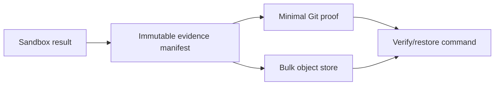

# P2-5 — Separate benchmark evidence retention from the source checkout

Complexity: 10 → HIGH mode

## Context

Most tracked files are benchmark snapshots under `docs/benchmark/sweeps`, and
`scripts/sweep-archive.ts:84-102` intentionally copies complete sandbox shells without a size cap.
That preserves reproducibility but makes clones, searches, and Git history grow rapidly. The
repository has no declared object-storage provider, retention policy, or retrieval credential
contract, so deletion or silent truncation is unsafe.

## Solution

- Define an evidence manifest containing immutable hashes, provenance, scores, selected proof images,
  and a retrieval command.
- Keep the minimal reproducibility source and critical proof in Git; move only bulk artifacts to a
  provider selected by the owner.
- Make archive, verify, and restore commands fail closed when a remote object or hash is missing.
- Do not delete existing evidence until a provider, retention policy, and restore drill are approved.

Data changes: new manifest fields and optional remote-object metadata; no existing evidence is
deleted by this PRD.

## Integration Ledger

| # | New thing | Live caller (`file:line`, non-test) | Replaces | Old path removed? | Negative control |
|---|---|---|---|---|---|
| 1 | Evidence manifest and hash verifier | `scripts/sweep-archive.ts:202` archives a sandbox | implicit directory-only evidence | old archive remains readable; manifest becomes required | alter one archived file; verify must fail |
| 2 | Provider-neutral bulk artifact adapter | `scripts/sweep-archive.ts:202` invokes archive policy | unbounded Git-only bulk retention | only after owner-approved provider | configure a missing object; restore must fail |
| 3 | Restore/retrieval command | `package.json:41` exposes sweep tooling | no reproducible retrieval path | no old command removed | delete the retrieved object; restore must fail closed |

## 4. Execution Phases

### Phase 1: Establish immutable evidence manifests without deleting data

**Files (4):**

- `scripts/sweep-evidence.ts` - NEW: render and verify manifest hashes, provenance, selected proofs, and artifact inventory.
- `scripts/__tests__/sweep-evidence.spec.ts` - NEW: test hash drift, missing files, and malformed manifests.
- `scripts/sweep-archive.ts` - EDIT: emit the manifest while retaining the existing archive contents.
- `scripts/__tests__/sweep-archive.spec.ts` - EDIT: assert archived evidence contains a verifiable manifest.

**Implementation:**

- [ ] Hash every retained file and record size, role, source commit, sweep identity, and generator version.
- [ ] Distinguish critical Git proof from bulk candidates without removing either.
- [ ] Reject path traversal, duplicate identities, missing required proof, and malformed manifests.

**Wiring:**

- [ ] Caller edited: `archiveSandbox` writes the manifest for every new archive.
- [ ] Registration: existing sweep archive command calls the verifier before reporting success.
- [ ] Old path: existing archives remain readable and are not rewritten in place.
- [ ] Ledger rows filled: 1.

**Tests Required:**

| Test File | Test Name | Assertion | Negative control (must be observed red) |
|---|---|---|---|
| `scripts/__tests__/sweep-evidence.spec.ts` | `should reject a changed archived file` | hash verification fails closed | Change one file after manifest creation; `pnpm exec vitest run --config vitest.config.ts scripts/__tests__/sweep-evidence.spec.ts` returns non-zero with `RED observed: evidence hash mismatch` |

**Revert check:** disable manifest generation; archive test must fail because evidence has no
verifiable identity.

**Verification Plan:** run archive unit tests, a fixture archive/restore dry run, and compare the
manifest inventory with the source tree. No bulk deletion is allowed in this phase.

**User Verification:**

- Action: archive a fixture sweep, alter a screenshot, and run verification.
- Expected: verification names the altered path and refuses to report a valid archive.

### Phase 2: Decide and integrate an approved bulk provider

**Files (5):**

- `scripts/evidence-store.ts` - NEW: provider-neutral upload/download interface with hash verification.
- `scripts/__tests__/evidence-store.spec.ts` - NEW: fake-provider upload, missing-object, and restore tests.
- `scripts/sweep-archive.ts` - EDIT: publish only approved bulk artifacts through the adapter.
- `scripts/sweep-restore.ts` - NEW: retrieve a manifest and required objects into a clean directory.
- `package.json` - EDIT: expose explicit archive/verify/restore commands and provider configuration.

**Implementation:**

- [ ] Record the owner-approved provider, credentials source, retention, cost, and restore SLA before implementation.
- [ ] Support a local fake provider in tests and refuse an unconfigured production provider.
- [ ] Upload only artifacts classified bulk; keep selected source/proof in Git.
- [ ] Verify hashes after download and fail closed on partial restore.

**Wiring:**

- [ ] Caller edited: package commands invoke archive, verify, and restore through the adapter.
- [ ] Registration: provider selection is explicit configuration, never inferred from credentials.
- [ ] Old path: Git-only archive remains the fallback until a migration checkpoint approves movement.
- [ ] Ledger rows filled: 1–3.

**Tests Required:**

| Test File | Test Name | Assertion | Negative control (must be observed red) |
|---|---|---|---|
| `scripts/__tests__/evidence-store.spec.ts` | `should restore the exact manifest into a clean directory` | restored hashes equal the manifest | Remove one provider object; test returns non-zero with `RED observed: incomplete evidence restore` |

**Revert check:** point the command at an unconfigured provider; it must refuse rather than silently
fall back to an unverified partial archive.

**Verification Plan:** run fake-provider tests, a real provider dry run only after owner approval,
full test and package checks, then one clean-machine restore drill.

**User Verification:**

- Action: request one historical sweep by manifest identity on a clean checkout.
- Expected: selected proof and bulk artifacts restore with matching hashes and documented provenance.

## Negative Controls

| Gate | Negative control | Expected red | Exact command/result |
|---|---|---|---|
| manifest integrity | alter an archived file | verifier rejects drift | `command: pnpm exec vitest run --config vitest.config.ts scripts/__tests__/sweep-evidence.spec.ts`; result: RED observed: evidence hash mismatch; exit: 1 |
| restore completeness | remove a provider object | restore refuses partial output | `command: pnpm exec vitest run --config vitest.config.ts scripts/__tests__/evidence-store.spec.ts`; result: RED observed: incomplete evidence restore; exit: 1 |

## Acceptance Criteria

- [ ] Every new archive has an immutable, verifiable manifest.
- [ ] Existing evidence is not deleted or silently capped.
- [ ] Bulk storage is provider-neutral in code and explicit in configuration.
- [ ] A clean restore verifies every required hash and reports missing objects.
- [ ] Provider, retention, cost, and restore ownership are approved and recorded before migration.
- [ ] Both negative controls were observed red.

## Checkpoint Protocol

Phase 1 may deliver only with Git-only retention and manifest evidence. Phase 2 requires an owner
checkpoint naming the provider and restore owner; without it the PRD is BLOCKED, not green by
default. Record archive size, retained/bulk classification, hashes, and a clean restore log.
