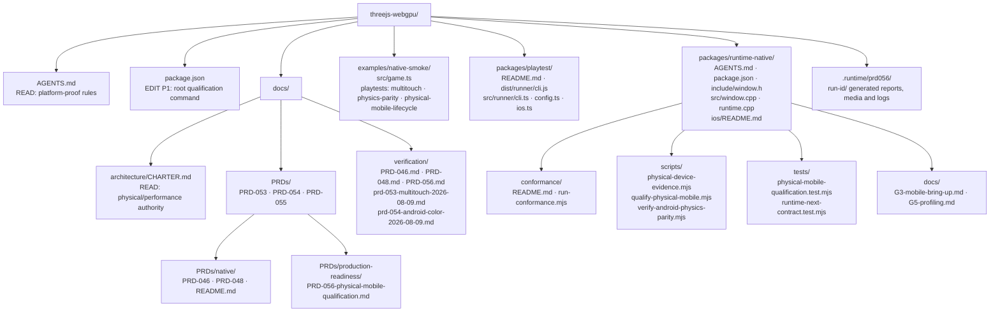

# PRD-056 — Physical mobile production qualification

**Filed under `docs/PRDs/BLOCKED/requires-physical-device/`** — every remaining item needs hardware or a signing identity
this machine does not have. See that folder's README for the rule.

**Status:** PLANNING COMPLETE; EXECUTION BLOCKED. No physical Android device, physical iOS
device, Android production-signed artifact, Apple signing identity, or Apple provisioning
profile was supplied to this author lane. PRD-053 and PRD-054 are also currently blocked in
the dirty worktree. `BLOCKED` means a required dependency, device, credential-owned handoff,
or observation is absent and the qualification command exits 2. `DONE` means both named
physical-device reports pass every functional gate, every required negative control was
observed red, and the evidence rollup is committed; an emulator, simulator, hosted runner,
signed-but-unexecuted artifact, published package, or promoted consumer cannot satisfy it.

Complexity: 10 → HIGH mode.

Blast radius: 17 repository files across root command wiring, `runtime-native`, the
`native-smoke` proof subject, and native verification documentation.

Complexity scoring: 10+ files +3; new qualification/evidence module +2; complex lifecycle and
device state +2; multi-package proof flow +2; Android and Apple device-tool integration +1.

**Depends on:** PRD-053 for multitouch implementation and its physical-device result; PRD-054
for fail-closed visual/behavior parity and host-shim coverage; PRD-046 for the shared native
physics API and its device controls; PRD-048 for local native build/distribution mechanics and
the signed installable artifacts this PRD consumes.

**Feeds:** PRD-058 receives raw physical frame, memory, thermal, and battery measurements. This
PRD does not set, tune, waive, or enforce performance thresholds.

**Authority:** `AGENTS.md` and `packages/runtime-native/AGENTS.md` forbid claims for platforms
that did not execute; the project's device, performance and success rules require real
physical hardware before a mobile-ready claim.

## 1. Context

**Problem:** Android emulator and iOS simulator evidence proves plumbing, but it does not prove
real arm64 code generation, Vulkan/Metal drivers, production-signed installation, lifecycle
continuity, physical multitouch, native physics, or phone resource behavior.

### Evidence identity at plan time

| Evidence class | Identity | What it can prove | What it cannot prove |
|---|---|---|---|
| Dirty worktree | Current checkout on 2026-08-09, with modified and untracked native files | Planning baseline and local observations only | Reproducible release or qualification evidence |
| Committed HEAD | `50f8eb4` | Source identity for the latest committed checkout | Physical execution; the checkout has later dirty changes |
| Older CI SHA | `2c5f7f0`, hosted run `31313092745` | Historical macOS, Windows, and iOS-simulator execution | Current-HEAD execution or physical-device execution |
| Android emulator | API-35 x86_64/SwiftShader evidence in the current ledgers | APK plumbing, QuickJS, and emulator-driver behavior | arm64, real Vulkan, touch hardware, thermal, battery, or phone frame behavior |
| iOS simulator | arm64 simulator evidence on a hosted Apple runner | Simulator build/install/launch and simulator physics | physical Metal, device signing/install, touch hardware, thermal, or battery behavior |
| Hosted runner | GitHub-hosted macOS/Windows/Linux machine | Host build and simulator execution tied to a SHA | Physical phone/tablet execution unless a named device is attached and recorded |
| Physical device | No qualifying device report exists | Only this class may prove real mobile hardware | Distribution or promotion by itself |
| Signed artifact | Not supplied | Signature validity and install handoff when verified | Runtime behavior until installed and executed on the named device |
| Published package | PRD-048 publication remains open | Registry/distribution state once published | Physical execution |
| Promoted consumer | No consumer is promoted by this PRD | Downstream release state after all release owners approve | Qualification if its source/report identity is missing or stale |

### Current behavior

- `packages/runtime-native/conformance/run-conformance.mjs:1004` already selects the
  `android-hardware` target, and `packages/runtime-native/conformance/run-conformance.mjs:782`
  rejects an absent device or emulator; PRD-054 remains its owner.
- `packages/playtest/src/runner/ios.ts:213` already requires a physical `devicectl` identifier
  and installs/launches a signed app; this PRD consumes that path instead of creating another
  iOS transport.
- `packages/runtime-native/scripts/verify-android-physics-parity.mjs:476` selects an attached
  Android device and runs the normal public physics API; PRD-046 remains its owner.
- `packages/runtime-native/src/platform/window.cpp:139` polls input and resize events, while
  `packages/runtime-native/src/runtime.cpp:819` calls it from the live runtime loop. Background
  and foreground state are not yet used to suspend and resume animation work.
- `docs/PRDs/native/README.md:10` and `packages/runtime-native/docs/G5-profiling.md:4` record
  physical hardware and profiling as open. No physical-device evidence schema exists.

### External blockers — do not invent replacements

| Blocker | Required owner-supplied value | Resolution criterion |
|---|---|---|
| Named Android hardware | `ANDROID_SERIAL` for one explicitly recorded physical arm64 Android phone/tablet; no serial or model is currently supplied | `adb` reports `ro.kernel.qemu != 1`, an arm64 ABI, the operator-recorded marketing name/model, OS build, and a non-software Vulkan adapter |
| Android signed artifact | `ANDROID_SIGNED_APK` produced by the PRD-048/release owner; no keystore is created or stored here | `apksigner verify --print-certs` succeeds, signer digest is recorded, `android:debuggable` is false, artifact SHA matches its candidate source SHA, and install succeeds on the named device |
| Named Apple hardware | `IOS_DEVICE_ID` for one explicitly recorded physical iPhone/iPad; no identifier or model is currently supplied | `devicectl` reports a connected physical device with name, model, OS build, arm64, and Metal adapter identity |
| Apple signing/provisioning | `IOS_SIGNED_APP`, valid team-owned signing identity, and device-authorizing provisioning profile; no credentials, team id, certificate, or profile is invented | `codesign --verify --strict` succeeds, the embedded profile is unexpired and includes the named device, entitlements match the application identifier, and `devicectl` installs it |
| Owned prerequisites | DONE evidence from PRD-053, PRD-054, PRD-046, and PRD-048 tied to the same candidate SHA/artifact | Each prerequisite report path and SHA-256 is present in the physical evidence report; a missing, stale, failed, or merely blocked report exits 2 |

## 2. Solution

Add one fail-closed qualification command that orchestrates existing parity, playtest, physics,
and signed-install paths; add lifecycle continuity inside the native host; and emit one
versioned physical-device evidence document per device. The command never builds or signs an
artifact and never changes a performance threshold.

### Approach

- Require the operator to supply a named physical device and an already signed candidate
  artifact; classify absent infrastructure as `blocked`, behavioral divergence as `fail`, and a
  complete result as `pass`.
- Reuse PRD-054's Android hardware parity report, PRD-053's physical multitouch report,
  PRD-046's physical native-physics report, and PRD-048's artifact provenance. Store their
  report hashes; do not reimplement their checks.
- Suspend animation-frame/GPU work when SDL reports background, keep game/physics state
  resident, refresh surface/viewport state on foreground and supported rotation, then verify
  the same session resumes without a giant simulation step.
- Collect raw frame intervals plus memory, thermal, and battery samples with source commands,
  timestamps, units, and availability/error fields. PRD-058 decides thresholds from that data.
- Write raw evidence only under ignored `.runtime/prd056/`; commit a bounded summary to the
  verification ledger after both device runs.

**Data Changes:** no database or user-data migration. A new strict JSON-compatible evidence
format, `physicalDeviceEvidenceV1`, is introduced for ignored qualification artifacts and a
human-readable committed summary.

### Physical-device evidence schema

Unknown keys, missing required observations, non-finite numbers, stale hashes, and
emulator/simulator identities are errors. Optional platform observations use explicit
`available: false` plus a reason; they are never omitted or converted into zero.

| Object | Required fields and assertion semantics |
|---|---|
| `identity` | `schemaVersion: 1`, unique `runId`, UTC start/end, `verdict`, `blockers[]`, and evidence class `physical-device` |
| `source` | repository remote, branch, `headSha`, `worktree: clean|dirty`, artifact source SHA, package version, artifact SHA-256, and nullable release-run/published-package/promoted-consumer ids; qualification requires clean source identity and exact SHA agreement |
| `device` | platform, `kind: physical`, identifier hash, operator-recorded name, manufacturer, model, OS/build, CPU ABI, GPU/driver, and screen modes used; raw serial/UDID is not committed |
| `signing` | platform verification command, signer/team identifier, certificate/profile fingerprint and expiry, entitlements/application id, `debuggable: false`, and install result; private keys and profile contents are forbidden evidence |
| `prerequisites` | PRD-053, PRD-054, PRD-046, and PRD-048 status, report path, SHA-256, candidate SHA, and owning gate ids; every row must be `pass` |
| `execution` | install/launch timestamps, PID/session nonce, ready/first-frame/300-frame markers, nonblank capture hashes, GPU error count, arm64/native-GPU assertions, and process liveness |
| `lifecycle` | ordered background, foreground, supported-rotation, and resume observations; same session nonce/PID where the OS preserves it; frame count paused then advanced; viewport/surface valid; state and native-physics body continuity within the owned functional tolerance |
| `consumption` | referenced PRD-053 physical multitouch result and PRD-046 physical physics result, including their observed-red controls; values are copied by hash/reference, not recomputed here |
| `telemetry` | raw/summary frame intervals, memory samples in bytes, thermal samples with native state/source, and battery start/end samples with unit/source; sample duration and cadence required, thresholds absent |
| `artifacts` | repository-relative ignored artifact names, media/log/report SHA-256, size, producer command, and retention decision |
| `gateEvidence` | every gate id, final result, exact negative-control command, red observation, and nonzero exit code |

## Project Structure

## Scope Limits

1. Qualify one operator-named physical arm64 Android device and one operator-named physical
   iOS device against one signed candidate source/artifact identity.
2. Own native background, foreground, supported rotation, surface recovery, and same-session
   resume behavior needed by that qualification.
3. Consume PRD-053 multitouch, PRD-054 parity/host-shim, PRD-046 physics, and PRD-048 artifact
   outputs without changing their implementations or acceptance wording.
4. Collect physical frame, memory, thermal, and battery data with complete provenance for
   PRD-058; record unavailable platform metrics explicitly.
5. Stop at evidence and support-truth updates. Store submission, package promotion, and public
   mobile-ready messaging are later owner decisions.

## Anti-Scope

- No multitouch implementation, touch injection, gestures, virtual controls, or PRD-053
  acceptance rewrite.
- No new parity metric/tolerance, host shim, screenshot comparison, HUD/text path, or PRD-054/
  PRD-055 acceptance rewrite.
- No physics backend, Rapier ABI, timestep tolerance, or PRD-046 implementation change.
- No CLI packaging, release signing, credential creation, publication, store submission, or
  PRD-048 implementation rewrite; qualification only verifies and installs supplied artifacts.
- No performance budget or optimization. PRD-058 owns threshold design and decisions after it
  receives this PRD's raw device data.

## Integration Ledger

| # | New thing | Live caller (`file:line`, non-test) | Replaces | Old path removed? | Negative control |
|---|---|---|---|---|---|
| 1 | `native:qualify:physical` root/package command | `package.json:23` is the existing native/parity command surface; `packages/runtime-native/package.json:41` is the existing package gate surface, and both are edited to invoke the orchestrator | manual, non-schema device notes | yes; physical qualification claims route through the command | emulator/simulator device identity returns `blocked`, exit 2 |
| 2 | `physicalDeviceEvidenceV1` validator and rollup | `packages/runtime-native/package.json:41` invokes the orchestrator, which must validate before writing; `docs/PRDs/native/README.md:10` consumes only its committed summary | unstructured physical-hardware open rows | yes; new physical evidence uses the versioned document | stale source SHA or missing telemetry makes report validation fail, exit 1 |
| 3 | Internal native lifecycle suspend/resume state | `packages/runtime-native/src/runtime.cpp:819` calls `platform::pollEvents`; `packages/runtime-native/src/platform/window.cpp:139` is the live SDL event switch | unconditional animation/GPU work while backgrounded | yes; the loop delegates to lifecycle state | dropping foreground delivery leaves the resume assertion red, exit 1 |
| 4 | `physical-mobile-lifecycle.playtest.json` | `packages/playtest/src/runner/config.ts:97` loads the positional scenario and `packages/playtest/src/runner/cli.ts:90` dispatches it to Android/iOS | ad hoc marker-only physical checks | yes; lifecycle qualification uses this scenario | relaunching a new session instead of resuming the original fails nonce/state continuity, exit 1 |
| 5 | Physical Android/iOS qualification evidence summary | `docs/PRDs/native/README.md:10` is the support-truth consumer; `packages/runtime-native/docs/G3-mobile-bring-up.md:142` owns the open physical rows | blanket “physical hardware open” text with no schema | only after both reports pass; otherwise it stays OPEN/BLOCKED | a dirty-worktree, wrong-SHA, emulator, simulator, unsigned, or unexecuted input cannot produce DONE |

### Reachability

**How will this feature be reached?** The operator runs the root
`native:qualify:physical` command with `--platform android|ios`, one named device identifier,
one signed app path, prerequisite report paths, and an ignored output directory.

**Is this user-facing?** Yes, to the release/qualification operator. A player-visible result
is the same signed game retaining state and rendering after background, foreground, supported
rotation, and resume on both physical devices.

**Full flow:** supplied signed artifact → signature/provenance verification → physical-device
identity → install/launch → prerequisite parity/touch/physics report consumption → lifecycle
scenario → raw telemetry collection → strict evidence validation → committed summary.

**What does this replace?** Unstructured statements that physical hardware is open. It does
not replace any dependency gate; it makes their physical consumption and provenance one
binary qualification result.

## 4. Execution Phases

Every phase is a vertical slice, edits at least one pre-existing file, has at most five files,
and stops for a HIGH-mode checkpoint before the next phase.

#### Phase 1: Fail-closed qualification contract — an emulator, simulator, stale artifact, or incomplete report cannot masquerade as physical evidence

**Files (5):**

- `package.json` - EDIT: expose the root `native:qualify:physical` command
- `packages/runtime-native/package.json` - EDIT: expose/package the qualification scripts
- `packages/runtime-native/scripts/physical-device-evidence.mjs` - NEW: strict v1 schema, validator, provenance matching, and rollup
- `packages/runtime-native/scripts/qualify-physical-mobile.mjs` - NEW: preflight, exit semantics, command adapter, and evidence writer
- `packages/runtime-native/tests/physical-mobile-qualification.test.mjs` - NEW: contract, identity, provenance, and control tests

**Implementation:**

- [ ] Parse `--platform`, `--device`, signed app, candidate SHA, prerequisite report, output,
      duration, cadence, and explicit control arguments; unknown arguments fail before devices
      are touched.
- [ ] Return exit 0 only for `pass`, exit 1 for observed behavioral/schema failure, and exit 2
      for missing devices, signing, dependencies, tools, or nonphysical identities.
- [ ] Validate exact source/artifact/report SHA agreement, reject dirty-worktree evidence as a
      release candidate, hash device ids in committed output, and preserve raw ids only in the
      ignored local report.
- [ ] Reject unknown schema keys, non-finite timing/resource samples, omitted availability
      states, zero assertions, and green-only gate evidence.

**Wiring (the phase is not done without this):**

- [ ] Caller edited: `package.json:23` invokes the package command.
- [ ] Registration: `packages/runtime-native/package.json:41` exposes the packaged script.
- [ ] Old path: physical qualification statements now require a validated v1 report; historical
      emulator/simulator ledgers remain as bounded evidence.
- [ ] Ledger rows filled: #1 and #2.

**Tests Required:**

| Gate | Test File | Test Name | Assertion | Negative control (must be observed red) |
|---|---|---|---|---|
| `evidence-schema` | `packages/runtime-native/tests/physical-mobile-qualification.test.mjs` | `should reject incomplete or unknown physical evidence fields` | validator returns every missing/unknown path and never coerces absent telemetry to zero | omit `telemetry.memory`; command exits 1 |
| `android-physical-identity` | `packages/runtime-native/tests/physical-mobile-qualification.test.mjs` | `should block Android emulator identity when hardware is required` | `status === "blocked"`, code `TN_QUALIFY_PHYSICAL_DEVICE_REQUIRED`, exit 2 | pass `emulator-5554` |
| `ios-physical-identity` | `packages/runtime-native/tests/physical-mobile-qualification.test.mjs` | `should block iOS simulator identity when hardware is required` | `status === "blocked"`, same code, exit 2 | pass `booted` simulator selector |
| `provenance-consistency` | `packages/runtime-native/tests/physical-mobile-qualification.test.mjs` | `should reject artifact and prerequisite reports from another SHA` | every source/report SHA equals the candidate SHA or validation exits 1 naming the mismatched field | substitute `2c5f7f0` for candidate `50f8eb4` |

**Revert check:** remove the package command or bypass report validation; the command-surface
test or stale-SHA control must fail before install.

**User Verification:** Action: run preflight with no device/artifact values. Expected: a
structured `blocked` report naming every missing external blocker and exit 2, never pass.

#### Phase 2: Native lifecycle continuity — the same game session pauses safely and resumes after background, foreground, and supported rotation

**Files (5):**

- `packages/runtime-native/include/mystral/platform/window.h` - EDIT: lifecycle state/callback contract
- `packages/runtime-native/src/platform/window.cpp` - EDIT: translate SDL background, foreground, restore, focus, and resize events into lifecycle state
- `packages/runtime-native/src/runtime.cpp` - EDIT: suspend animation/GPU frame work in background and recover surface/viewport work before resume
- `packages/runtime-native/tests/runtime-next-contract.test.mjs` - EDIT: lifecycle wiring and no-background-frame contract
- `examples/native-smoke/src/game.ts` - EDIT: same-source session nonce, viewport, frame-gap, state-continuity, and frame-interval observations

**Implementation:**

- [ ] Use SDL lifecycle vocabulary internally; add no public node/class and no target branch to
      game source.
- [ ] Stop animation-frame and GPU begin/end work while backgrounded without destroying JS,
      scene, input, or native-physics state; do not turn the wall-clock background gap into a
      simulation step.
- [ ] On foreground/restore, require a valid surface, dispatch the existing resize path when
      dimensions change, then resume animation frames.
- [ ] Record a process/session nonce, pre-background/post-resume frame counts, maximum frame
      interval, viewport, cube transform, and qualification state for physical observation.

**Wiring (the phase is not done without this):**

- [ ] Caller edited: `packages/runtime-native/src/runtime.cpp:819` consumes lifecycle state
      from the existing `platform::pollEvents` call.
- [ ] Registration: `packages/runtime-native/src/platform/window.cpp:139` handles SDL lifecycle
      events in the live switch.
- [ ] Old path: unconditional background animation/GPU work is removed, not retained beside
      the lifecycle-aware path.
- [ ] Ledger rows filled: #3.

**Tests Required:**

| Gate | Test File | Test Name | Assertion | Negative control (must be observed red) |
|---|---|---|---|---|
| `lifecycle-continuity` | `packages/runtime-native/tests/runtime-next-contract.test.mjs` | `should suspend frame work until foreground restores a valid surface` | background state prevents animation/GPU frame calls; foreground recovery precedes the next frame; resize reuses the existing callback | remove foreground transition or force a new session; physical scenario exits 1 |

**Revert check:** disable the background state branch; the physical lifecycle scenario must
observe frames advancing in background or a giant resume interval and fail.

**User Verification:** Action: background for 10 seconds, return, rotate between both
artifact-supported landscape orientations, then return to the first orientation. Expected:
same process/session and game state, valid nonblank frames after each transition, no GPU error,
and no background-duration simulation jump.

#### Phase 3: Physical Android signed handoff — one named arm64/Vulkan device runs the candidate and consumes owned touch/physics/parity evidence

**Files (5):**

- `packages/runtime-native/scripts/qualify-physical-mobile.mjs` - EDIT: Android signature/device/install/lifecycle/telemetry adapter
- `packages/runtime-native/tests/physical-mobile-qualification.test.mjs` - EDIT: Android command parsing and fail-closed collectors
- `packages/runtime-native/package.json` - EDIT: retain Android qualification script in the packed operator surface
- `examples/native-smoke/playtests/physical-mobile-lifecycle.playtest.json` - NEW: session, pause/resume, viewport, state, liveness, and nonzero-frame assertions
- `packages/runtime-native/docs/G3-mobile-bring-up.md` - EDIT: record the named device result or exact blocker without changing PRD-053/054 status

**Implementation:**

- [ ] Verify the supplied APK signature, certificate digest, non-debuggable manifest, artifact
      hash, candidate SHA, arm64 library presence, and PRD-048 provenance before `adb install`.
- [ ] Require a non-emulator arm64 device and non-software Vulkan adapter; record device
      name/model/OS/build/ABI/GPU without committing its raw serial.
- [ ] Invoke PRD-054 `android-hardware` parity and consume its report; require PRD-053 physical
      multitouch and PRD-046 physical physics reports, including their observed-red controls.
- [ ] Drive launch, HOME/background, foreground, supported rotation, resume, 300+ frames,
      screenshots, logs, and liveness; fail on process replacement where same-session resume is
      expected.
- [ ] Sample frame intervals, `dumpsys meminfo`, thermal service, and battery start/end at the
      declared cadence. Unsupported readings are explicit unavailable observations, not pass.

**Wiring (the phase is not done without this):**

- [ ] Caller edited: root/package `native:qualify:physical --platform android` reaches the
      existing PRD-054 `android-hardware` and PRD-046 verifier entry points.
- [ ] Registration: the generated lifecycle scenario is loaded by
      `packages/playtest/src/runner/config.ts:97`.
- [ ] Old path: marker-only/emulator-only output cannot populate the physical evidence summary.
- [ ] Ledger rows filled: #4 and Android half of #5.

**Tests Required:**

| Gate | Test File | Test Name | Assertion | Negative control (must be observed red) |
|---|---|---|---|---|
| `android-signed-install` | `packages/runtime-native/tests/physical-mobile-qualification.test.mjs` | `should install only a signed non-debuggable arm64 Android artifact on physical hardware` | verified signer/artifact/device facts precede install; install/launch PID and artifact hash enter report | unsigned artifact exits 2 before install |
| `multitouch-consumption` | `packages/runtime-native/tests/physical-mobile-qualification.test.mjs` | `should consume the PRD-053 physical report without recomputing it` | report is same candidate/device class, `maxPointers >= 2`, simultaneous movement+jump passes, one-pointer control is red | one-pointer-only report exits 1 |
| `native-physics-consumption` | `packages/runtime-native/tests/physical-mobile-qualification.test.mjs` | `should consume native physics and its physical negative controls` | normal public API, resting/collision/mask behavior pass; wrong gravity/height/mask controls are red | wrong-gravity report exits 1 |
| `telemetry-completeness` | `packages/runtime-native/tests/physical-mobile-qualification.test.mjs` | `should preserve timestamped Android frame memory thermal and battery observations` | every collector has source, timestamp, unit, availability, and finite samples or explicit error | omitted memory sample exits 1 |
| `lifecycle-continuity` | `examples/native-smoke/playtests/physical-mobile-lifecycle.playtest.json` | `should resume the same Android game session after background and rotation` | nonce stable, frames pause then advance, viewport valid, state/physics continuity retained, capture nonblank | drop foreground action; scenario exits 1 |

**Revert check:** pass the known emulator serial or a debug/unsigned APK; qualification must
exit nonzero before install and write no passing physical report.

**User Verification:** Action: execute the Android command on the owner-supplied named device.
Expected: one validated `physical-device` report tied to the signed APK and candidate SHA, or
an exact `blocked`/`fail` result; never an emulator-derived pass.

#### Phase 4: Physical iOS signed handoff — one named arm64/Metal device runs the same candidate and lifecycle contract

**Files (5):**

- `packages/runtime-native/scripts/qualify-physical-mobile.mjs` - EDIT: Apple signature/profile/device/lifecycle/telemetry adapter using existing playtest device transport
- `packages/runtime-native/tests/physical-mobile-qualification.test.mjs` - EDIT: Apple identity, provisioning, collector, and operator-action controls
- `packages/runtime-native/ios/README.md` - EDIT: exact signed-device qualification procedure and credential boundary
- `packages/runtime-native/docs/G3-mobile-bring-up.md` - EDIT: record named iOS result or exact external blocker
- `docs/verification/PRD-056.md` - NEW: bounded Android/iOS report index with hashes and OPEN/BLOCKED/PASS rows

**Implementation:**

- [ ] Verify `codesign`, application identifier, entitlements, team/profile fingerprint,
      expiration, and named-device authorization without copying private keys or full profiles.
- [ ] Use `packages/playtest/src/runner/ios.ts:213` for `devicectl` install/launch and mailbox
      transport; do not create a second iOS runner or treat `simctl`/`booted` as physical.
- [ ] Require arm64/physical Metal identity, then run the same lifecycle scenario and consume
      the PRD-053/054/046 reports available for the exact candidate/device. A missing owned iOS
      prerequisite remains `blocked`; it is not reimplemented here.
- [ ] Make operator-assisted Home/foreground and supported device rotation a named manual
      checkpoint when Apple tooling exposes no safe automation; record action timestamps and
      pre/post observations, not a bare checkbox.
- [ ] Collect raw frame intervals, task memory, ProcessInfo thermal state, and battery
      start/end through the signed qualification build/host bridge. Explicit unavailable
      observations block completeness until PRD-058 accepts the collector limitation.

**Wiring (the phase is not done without this):**

- [ ] Caller edited: root/package `native:qualify:physical --platform ios` invokes the existing
      playtest physical-device path at `packages/playtest/src/runner/ios.ts:213`.
- [ ] Registration: the same lifecycle scenario is dispatched by
      `packages/playtest/src/runner/cli.ts:93` to the iOS runner.
- [ ] Old path: simulator `booted` and unsigned simulator archives remain historical evidence
      and cannot populate the physical report.
- [ ] Ledger rows filled: iOS half of #5.

**Tests Required:**

| Gate | Test File | Test Name | Assertion | Negative control (must be observed red) |
|---|---|---|---|---|
| `ios-signed-install` | `packages/runtime-native/tests/physical-mobile-qualification.test.mjs` | `should install only a valid signed provisioned app on the named physical iOS device` | codesign/profile/app/device identities agree before `devicectl install`; report records fingerprint, not secret material | unsigned/expired/mismatched profile exits 2 |
| `multitouch-consumption` | `packages/runtime-native/tests/physical-mobile-qualification.test.mjs` | `should require the PRD-053 physical iOS multitouch result` | exact candidate/device report proves two simultaneous physical contacts and its one-contact control is red | simulator or one-contact report exits 1/2 |
| `native-physics-consumption` | `packages/runtime-native/tests/physical-mobile-qualification.test.mjs` | `should require PRD-046 physics on physical iOS arm64` | normal/masked physics pass and wrong-value controls fail on the named device | wrong-gravity report exits 1 |
| `telemetry-completeness` | `packages/runtime-native/tests/physical-mobile-qualification.test.mjs` | `should preserve timestamped iOS frame memory thermal and battery observations` | same evidence semantics and units as Android, with platform source recorded | omitted thermal availability exits 1 |
| `lifecycle-continuity` | `examples/native-smoke/playtests/physical-mobile-lifecycle.playtest.json` | `should resume the same iOS game session after operator background and rotation` | nonce stable, frames/state resume, viewport/surface valid, physics continuity retained, capture nonblank | terminate/relaunch instead of resume exits 1 |

**Revert check:** use `--device booted` or an unsigned simulator app; qualification must report
`TN_QUALIFY_PHYSICAL_DEVICE_REQUIRED`/signing blocker and exit 2 before install.

**User Verification:** Action: the named device/signing owner performs the timestamped Home,
foreground, and rotation actions while the command observes the app. Expected: a validated
physical iOS report tied to the same candidate SHA as Android, or an exact blocker/failure.

#### Phase 5: Evidence cutover — support truth and PRD-058 receive one reproducible physical-device packet

**Files (4):**

- `docs/verification/PRD-056.md` - EDIT: add exact commands, device names/models, report/media hashes, red controls, and binary verdicts
- `docs/PRDs/native/README.md` - EDIT: replace physical OPEN rows only when the matching validated report passes
- `packages/runtime-native/docs/G5-profiling.md` - EDIT: link raw physical data and state that PRD-058 owns threshold interpretation
- `docs/PRDs/production-readiness/PRD-056-physical-mobile-qualification.md` - EDIT: check completed criteria or retain exact BLOCKED/FAIL state

**Implementation:**

- [ ] Revalidate both reports from a clean checkout at their candidate SHA and verify every
      artifact/report hash before summarizing.
- [ ] Record Android and iOS independently; one pass never upgrades the other.
- [ ] Hand PRD-058 raw data plus device/build/sample provenance without declaring performance
      pass/fail.
- [ ] Move this PRD to `done/` only in the later finishing commit after every DONE check is
      checked; this planning lane does not move it.

**Wiring (the phase is not done without this):**

- [ ] Caller edited: `docs/PRDs/native/README.md:10` links the validated report index.
- [ ] Registration: `packages/runtime-native/docs/G5-profiling.md:4` links the raw-data handoff.
- [ ] Old path: OPEN rows become PASS only per device; stale SHA/emulator/simulator statements
      remain historical and labelled.
- [ ] Ledger rows filled: #1–#5 have final file:line callers and zero pending cells.

**Tests Required:**

| Gate | Test File | Test Name | Assertion | Negative control (must be observed red) |
|---|---|---|---|---|
| `qualification-rollup` | `packages/runtime-native/tests/physical-mobile-qualification.test.mjs` | `should mark DONE only when both physical reports and all prerequisites share one candidate identity` | Android+iOS verdicts pass; required report/control hashes present; clean source/artifact SHA equal; no blocker | remove one prerequisite report; exit 2 |
| `repository-collection` | `packages/runtime-native/tests/physical-mobile-qualification.test.mjs` | `should be collected by the package and root test runners` | focused test count is nonzero and deliberate sentinel failure makes both runners nonzero | enable sentinel failure; exit 1 |

**Revert check:** point the rollup at `2c5f7f0`, an emulator/simulator report, or a dirty
worktree report; DONE must be rejected and support truth must remain OPEN/BLOCKED.

**User Verification:** Action: open the committed summary from a clean candidate checkout and
follow each relative hash/path to raw evidence. Expected: both named devices, signed artifact
identity, lifecycle, touch, physics, and telemetry provenance resolve without local absolute
paths or secrets.

## Negative Controls

These are specifications for implementation. They are not claimed as already executed. Each
must be run, observed red, and copied verbatim into the phase checkpoint before PASS.

| Gate | Negative control | Expected red | Exact command/result |
|---|---|---|---|
| `evidence-schema` | omit the required memory collector from an otherwise passing fixture | validator names `telemetry.memory` and exits 1 | `command: pnpm native:qualify:physical --validate-fixture packages/runtime-native/tests/fixtures/prd056-missing-memory.json`; result: RED observed: required during Phase 1, missing telemetry.memory; exit: 1 |
| `android-physical-identity` | pass a known emulator serial to physical mode | blocked before signature/install/device execution, exit 2 | `command: pnpm native:qualify:physical --platform android --device emulator-5554 --android-app "$ANDROID_SIGNED_APK" --control reject-nonphysical`; result: RED observed: required during Phase 1, TN_QUALIFY_PHYSICAL_DEVICE_REQUIRED; exit: 2 |
| `ios-physical-identity` | pass the simulator selector to physical mode | blocked before signature/install/device execution, exit 2 | `command: pnpm native:qualify:physical --platform ios --device booted --ios-app "$IOS_SIGNED_APP" --control reject-nonphysical`; result: RED observed: required during Phase 1, TN_QUALIFY_PHYSICAL_DEVICE_REQUIRED; exit: 2 |
| `provenance-consistency` | claim current candidate while substituting older CI SHA `2c5f7f0` in one prerequisite | report names exact mismatched field and exits 1 | `command: pnpm native:qualify:physical --validate-fixture packages/runtime-native/tests/fixtures/prd056-stale-sha.json`; result: RED observed: required during Phase 1, prerequisite candidate SHA mismatch; exit: 1 |
| `lifecycle-continuity` | omit foreground or terminate/relaunch instead of resume | session/frame/state continuity assertion fails, exit 1 | `command: pnpm native:qualify:physical --platform "$MOBILE_PLATFORM" --device "$MOBILE_DEVICE" --app "$MOBILE_SIGNED_APP" --control break-resume`; result: RED observed: required during Phases 2-4, session continuity lost; exit: 1 |
| `android-signed-install` | provide an unsigned/debuggable APK | blocked before `adb install`, exit 2 | `command: pnpm native:qualify:physical --platform android --device "$ANDROID_SERIAL" --android-app "$ANDROID_UNSIGNED_APK" --control reject-unsigned`; result: RED observed: required during Phase 3, Android signature/production manifest rejected; exit: 2 |
| `ios-signed-install` | provide an unsigned, expired, or device-mismatched app | blocked before `devicectl install`, exit 2 | `command: pnpm native:qualify:physical --platform ios --device "$IOS_DEVICE_ID" --ios-app "$IOS_UNSIGNED_APP" --control reject-unsigned`; result: RED observed: required during Phase 4, Apple signing/provisioning rejected; exit: 2 |
| `multitouch-consumption` | substitute PRD-053's one-pointer control report | qualification reports functional failure, exit 1 | `command: pnpm native:qualify:physical --validate-fixture packages/runtime-native/tests/fixtures/prd056-one-pointer.json`; result: RED observed: required during Phases 3-4, physical multitouch requirement failed; exit: 1 |
| `native-physics-consumption` | substitute PRD-046 wrong-gravity report | qualification reports physics failure, exit 1 | `command: pnpm native:qualify:physical --validate-fixture packages/runtime-native/tests/fixtures/prd056-wrong-gravity.json`; result: RED observed: required during Phases 3-4, native physics control failed; exit: 1 |
| `telemetry-completeness` | omit a collector availability/result row instead of reporting it unavailable | schema rejects incomplete telemetry, exit 1 | `command: pnpm native:qualify:physical --validate-fixture packages/runtime-native/tests/fixtures/prd056-missing-thermal.json`; result: RED observed: required during Phases 3-4, thermal availability missing; exit: 1 |
| `qualification-rollup` | remove one prerequisite report from one physical result | rollup remains BLOCKED, exit 2 | `command: pnpm native:qualify:physical --rollup .runtime/prd056 --control missing-prerequisite`; result: RED observed: required during Phase 5, prerequisite report absent; exit: 2 |
| `repository-collection` | enable the deliberate collection sentinel | focused package/root runner collects a failing test and exits 1 | `command: TN_PRD056_FORCE_SENTINEL_FAILURE=1 pnpm --filter @threenative/runtime-native exec vitest run tests/physical-mobile-qualification.test.mjs`; result: RED observed: required during Phase 5, deliberate collection sentinel; exit: 1 |

## Acceptance Criteria

Every criterion is binary and consumer-scoped. An unchecked item means this PRD is not DONE.

- [ ] A named physical arm64 Android device installs the supplied production-signed candidate,
      runs on a non-software Vulkan adapter, reaches 300+ frames, and produces a validated
      report tied to the exact artifact/source SHA.
- [ ] A named physical iOS device installs the supplied signed/provisioned candidate through
      the existing `devicectl` path, runs on physical Metal, reaches 300+ frames, and produces
      a validated report tied to the same candidate identity.
- [ ] On both devices, background → foreground → supported rotation → resume retains the same
      game session/state, resumes rendering on a valid surface, and does not integrate the
      wall-clock background gap as a physics/frame step.
- [ ] On both devices, PRD-053's physical multitouch output proves two simultaneous contacts
      are consumed by gameplay and its one-contact control is observed red; PRD-056 contains
      no touch implementation.
- [ ] On both devices, PRD-046's normal public native-physics scenario passes and its wrong
      gravity/height/mask controls are observed red; PRD-056 contains no physics backend.
- [ ] PRD-054's exact-candidate physical parity/host-shim outputs and PRD-048's signed artifact
      provenance are referenced by SHA-256; missing, blocked, stale, or wrong-target evidence
      cannot produce pass.
- [ ] Raw frame, memory, thermal, and battery evidence has device/build/duration/cadence/unit/
      availability provenance for both devices and is handed to PRD-058 with no threshold or
      performance verdict invented here.
- [ ] Every gate in `Negative Controls` was observed red with the exact command/nonzero exit,
      then passed normally; green-only evidence is `UNVERIFIED`.
- [ ] Integration Ledger has zero pending/TBD cells, all live callers are non-test
      `file:line`, and removing the qualification/lifecycle path breaks a pre-existing command
      or physical flow.
- [ ] `pnpm typecheck && pnpm lint && pnpm test && pnpm budgets` passes from a clean candidate
      checkout; native LOC over the review trigger is reported with a kill-switch justification.
- [ ] `docs/verification/PRD-056.md`, the native support README, and G3/G5 distinguish dirty
      worktree, committed HEAD, older hosted-runner SHA, emulator, simulator, physical device,
      signed artifact, published package, and promoted consumer without upgrading one class
      into another.
- [ ] All five phase checkpoints pass, both manual device checkpoints are confirmed by their
      named owner, all external blockers are cleared, and this PRD's status is changed to DONE
      only in the finishing commit that moves it to `docs/PRDs/done/`.

## Checkpoint Protocol

HIGH mode requires a checkpoint after every phase. No later phase starts from a failed,
blocked, or green-only checkpoint.

### Automated checkpoint

For each phase, record: exact candidate SHA and worktree state; exact commands and exit codes;
test names/count; Integration Ledger caller census; incumbent/duplicate-path search; revert
check; every observed-red control; normal green rerun; artifact/report hashes; and current
blockers. A gate with no observed red is `UNVERIFIED`, not PASS.

### Manual checkpoint

| Phase | Owner | Action | Expected evidence | Confirmation required |
|---|---|---|---|---|
| 1 | Runtime-native maintainer | Review schema fields, exit taxonomy, secret boundary, and dependency ownership | no PRD-053/054/046/048 implementation duplicated; malformed/nonphysical fixtures fail closed | named maintainer approval in checkpoint packet |
| 2 | Runtime-native maintainer | Observe one native host background/foreground/rotation cycle before hardware qualification | frame/GPU work paused; same state resumes; valid surface precedes next frame | named maintainer approval plus logs |
| 3 | Android device/artifact owner | Supply the named physical device and signed APK, then perform any prompted physical multitouch/rotation action | signer/device/artifact facts plus complete Android report | owner name and UTC confirmation in evidence |
| 4 | Apple device/signing owner | Supply named device, signing/provisioning handoff, then perform prompted Home/foreground/rotation actions | codesign/profile/device facts plus complete iOS report | owner name and UTC confirmation; no credential values |
| 5 | Release evidence owner | Verify hashes from a clean candidate checkout and accept the PRD-058 handoff | both physical reports resolve and support truth remains bounded | named owner approval before DONE/move |

### Delivery block

Delivery is BLOCKED if any dependency is not DONE for the exact candidate, either device or
signed artifact is absent, Apple provisioning does not authorize the named device, any report
is stale/incomplete, any negative control was not observed red, any device is an emulator or
simulator, any GPU is software, or any acceptance item is unchecked. Behavioral divergence is
FAIL, not BLOCKED. Neither state permits a mobile-ready claim.

## Migration / Cutover

**Owner:** runtime-native maintainer owns lifecycle/schema code; Android device/artifact owner
owns the Android handoff; Apple device/signing owner owns the Apple handoff; release evidence
owner owns support-truth cutover.

**From:** unstructured physical-hardware OPEN rows backed by dirty-worktree observations,
committed HEAD `50f8eb4`, older hosted-runner SHA `2c5f7f0`, Android emulator, and iOS simulator
evidence that cannot qualify hardware.

**To:** two validated `physicalDeviceEvidenceV1` reports for one candidate identity, plus one
committed report index that keeps signed artifact, published package, and promoted consumer
states separate.

**Criteria:** all Acceptance Criteria checked, both device/manual checkpoints approved, every
negative control red then green, report/artifact hashes resolve from a clean checkout, and
support rows change independently per platform.

**Recovery:** if a device disconnects, signing expires, telemetry source is unavailable, or a
dependency report is blocked, retain the partial ignored report as diagnostic evidence, emit
BLOCKED with the exact missing item, restore the same candidate artifact/device precondition,
and rerun the affected platform only. Never fill missing observations by hand.

**Rollback:** revert the lifecycle and qualification files from the candidate commit, restore
the prior unconditional runtime behavior only if its existing web/desktop/emulator gates pass,
delete no historical evidence, and return physical Android/iOS plus mobile-ready status to
OPEN/BLOCKED. A published/promoted artifact rollback remains with the PRD-048/release owner.

## Verification Commands

Commands below are implementation/execution gates, not evidence claimed by this planning run.

| Purpose | Exact command | Binary expected result |
|---|---|---|
| Focused qualification contract | `pnpm --filter @threenative/runtime-native exec vitest run tests/physical-mobile-qualification.test.mjs` | exit 0 with nonzero test count; sentinel control separately exits 1 |
| Runtime lifecycle wiring | `pnpm --filter @threenative/runtime-native exec vitest run tests/runtime-next-contract.test.mjs` | exit 0; removing lifecycle wiring exits 1 |
| PRD-054 Android physical parity consumption | `pnpm parity --target android-hardware --device "$ANDROID_SERIAL" --reference "$WEB_REFERENCE" --out .runtime/prd056/android-parity` | exit 0 only for physical target pass; emulator/missing device exits 2; row failure exits 1 |
| PRD-046 Android physical physics consumption | `pnpm --filter @threenative/runtime-native native:physics:parity:device --device "$ANDROID_SERIAL" --skip-build --skip-install` | normal exit 0; wrong controls exit 1 |
| Android qualification | `pnpm native:qualify:physical --platform android --device "$ANDROID_SERIAL" --android-app "$ANDROID_SIGNED_APK" --candidate-sha "$CANDIDATE_SHA" --out .runtime/prd056/android` | exit 0 pass, 1 behavior/evidence fail, 2 blocker |
| iOS qualification | `pnpm native:qualify:physical --platform ios --device "$IOS_DEVICE_ID" --ios-app "$IOS_SIGNED_APP" --candidate-sha "$CANDIDATE_SHA" --out .runtime/prd056/ios` | exit 0 pass, 1 behavior/evidence fail, 2 blocker |
| Evidence rollup | `pnpm native:qualify:physical --rollup .runtime/prd056 --candidate-sha "$CANDIDATE_SHA"` | exit 0 only when both exact-candidate physical reports pass |
| Repository gates | `pnpm typecheck && pnpm lint && pnpm test && pnpm budgets` | exit 0; no native toolchain becomes part of the default gate |
| Patch hygiene | `git diff --check -- docs/PRDs/production-readiness/PRD-056-physical-mobile-qualification.md` | exit 0 |

## Verification Evidence

Contract conformance: prd_contract: v1.

This authoring run executed only the Linchpin contract validator and `git diff --check` on
this PRD. It did not execute code tests, build/sign/install artifacts, access devices, collect
physical telemetry, publish packages, promote consumers, or clear any blocker. Phase evidence
remains `UNVERIFIED` until implementation records exact outputs and observed-red controls.

## Rollback and Kill Conditions

- Kill the lifecycle change if it needs a second public game API, target-specific game source,
  or host-shim expansion owned by PRD-054; keep qualification BLOCKED and return the gap to the
  correct owner.
- Kill the qualifier branch that rebuilds, signs, publishes, or stores credentials. It must
  consume PRD-048/release artifacts and record fingerprints only.
- Kill any multitouch, parity, HUD/text, or physics implementation added under this PRD;
  consume the owner report or remain BLOCKED.
- Kill any telemetry threshold, waiver, optimization, or emulator/simulator performance claim;
  preserve raw physical data for PRD-058.
- Roll back a lifecycle implementation that regresses existing web/desktop/emulator behavior,
  leaks background GPU work, loses state, or costs more surface than direct SDL lifecycle
  handling; mobile qualification remains OPEN.
- Do not move this PRD to DONE if either device class, signing handoff, prerequisite, red
  control, or acceptance item is missing. No amount of documentation converts BLOCKED to DONE.

## Planning Stop

prd-creator stop-at-planning semantics apply. This artifact is the confirmation point. Do not
start a worker, reviewer, branch, worktree, implementation, device run, signing action,
credential request, release, publication, promotion, deployment, or PRD move without a separate
user confirmation. Preserve the dirty checkout.
