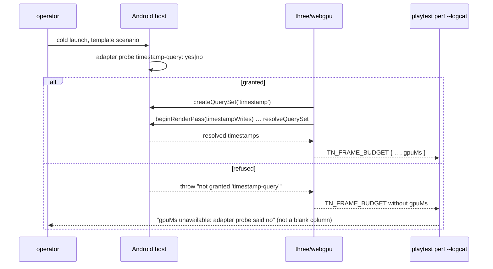

# PRD-305 — The GPU meter reports on Android, or says on the record why it cannot

**Status:** BLOCKED — `requires-physical-device`, filed 2026-08-31 against `2e014460`, probed
2026-09-01. Evidence:
[`gpu-meter-android-probe-2026-09-01`](../../../verification/gpu-meter-android-probe-2026-09-01.md).

**What is missing is a phone, and nothing else.** Every file:line below is a read of this tree, and
no Android run has been executed — that absence is the whole reason this PRD exists, and it stays
unexecuted because no device is attached:

```
$ adb devices -l
List of devices attached

```

`adb` itself is fine (1.0.41 / 37.0.0-14910828, on disk at `~/Android/Sdk/platform-tools/`), and
four emulator images are installed. **The emulator cannot answer this question.** `--target android`
in the conformance runner is the emulator lane and refuses a physical serial, so the two are
different targets by construction; and an emulator's WebGPU adapter is software, so whether *it*
grants `timestamp-query` says nothing about what a Pixel 8's driver grants. A green from there
would be a claim about the wrong hardware — which is the failure mode this PRD was written to end,
not to repeat.

**Unblocked by:** a Pixel 8 (or any physical Android device) attached over `adb`, cool enough to
pass preflight. The run itself is Phase 1 below and is a measurement, not an edit.

**Blocks:** [PRD-308](../../architecture/PRD-308-gpu-time-is-attributed-per-pass-on-the-phone.md)
and through it
[PRD-311](../../architecture/PRD-311-per-pass-gpu-cost-without-owning-a-phone.md). Both stay OPEN in
their batch rather than blocked — a dependency that is not ready is not the same as a missing
capability.

**Outcome:** a `TN_FRAME_BUDGET` line captured from a Pixel 8 carries a real `gpuMs`, and the
repository holds the logcat that proves it. If the device does not grant `timestamp-query`, the
same run produces a recorded, named refusal — the adapter probe line and the reason — rather than
silence that reads identically to "we never tried".

**Depends on:** nothing. Every piece of plumbing already exists; none of it has been executed on a
phone.

**Unblocks:** [PRD-308](../../architecture/PRD-308-gpu-time-is-attributed-per-pass-on-the-phone.md) (per-pass GPU
attribution on the phone) and through it
[PRD-311](../../architecture/PRD-311-per-pass-gpu-cost-without-owning-a-phone.md). Task 2 of Band 1; see
[README](../../architecture/README.md) for the tick-back rule.

**Complexity: 4 → MEDIUM mode.** +1 (1–5 files), +2 (multi-package: `core`, `playtest`, and a
device lane), +1 (a physical-device measurement whose outcome may be "the device says no").

---

## 1. Context

**Problem:** the GPU meter is portable and honest — it reports *nothing* rather than zero when it
cannot measure — and nobody has ever pointed it at an Android device. Every GPU number this
repository holds for a phone came from ablation arithmetic, not from the instrument built to
replace ablation arithmetic.

**Files analysed:**

- `packages/core/src/renderer.ts:143-152` — `gpuFrameMs()`, reading `info.render.timestamp`
- `packages/core/src/renderer.ts:253-261` — `resolveGpuFrame()`, fire-and-forget
  `resolveTimestampsAsync`
- `packages/core/src/game.ts:924` — `readGpuMs: () => renderer.gpuFrameMs()`
- `packages/core/src/game.ts:1010-1023` — the per-frame resolve, and the comment recording the
  2048-query pool exhaustion that made every window after the first report `undefined`
- `packages/core/src/frame-budget.ts:163-168, 443-463` — `gpuMs` validation and emission
- `packages/playtest/src/runner/perf.ts:50-51, 360, 373` — `anyGpu`, the `—` column when absent
- `packages/runtime-native/src/webgpu/context.cpp:405-433` — the **Android** device-creation branch:
  the compression-feature loop, the `timestamp-query` adapter probe, and
  `if (hasTimestampQuery_ && featureCount < 4)`
- `packages/runtime-native/src/webgpu/bindings_commands.cpp:199-232` — `createQuerySet`, which
  throws `this device was not granted 'timestamp-query'`
- `packages/runtime-native/src/webgpu/bindings_frame_stream.cpp:187-192` (render-pass
  `timestampWrites`), `:273` (compute), `:364-367` (`resolveQuerySet`, opcode 34)

**Current behaviour:**

- Web and Linux desktop produce `gpuMs`. Android has never been checked.
- The Android device-creation branch requests `timestamp-query` only when the adapter advertises it,
  and only while fewer than four features are already queued — a cap that is satisfiable today
  (the compression loop can add at most three) but is an unexplained constant sitting in front of
  the one feature this PRD depends on.
- `createQuerySet` refuses loudly without the grant. That refusal has never been read from a phone.
- A `TN_FRAME_BUDGET` line with no `gpuMs` field is indistinguishable, downstream, from a run that
  never enabled the meter.

**Known lane quirks that will bite this run** (from the operator's device notes, not from this
repo): thermal state trips between first-proof launch and preflight — cool to ≤31.5 °C and retry;
the battery floor bites after ~4–6 rungs.

---

## 2. Solution

**Approach:**

- Run first, change second. Phase 1 is a **measurement**, not an edit: build the Android APK, run
  a template scenario on the Pixel 8, and read logcat for three things — the adapter probe line,
  any `createQuerySet` refusal, and whether `TN_FRAME_BUDGET` carries `gpuMs`.
- Whatever the answer, the run is recorded in `docs/verification/`. A "no" is a result: it names
  the driver and the probe output, and it retargets PRD-308 onto a different instrument rather than
  leaving it planned against a meter that cannot run.
- Then make the absence **legible**: `perf --logcat` gains a line that distinguishes *no adapter
  support* from *no run*, sourced from the probe rather than inferred from a missing field.
- The `featureCount < 4` cap on the Android branch is replaced with a bound derived from the array
  size, and a one-line `TN_WEBGPU_FEATURES` report naming every feature actually granted — because
  the device-creation paths in `context.cpp` repeat this list by hand across several functions and
  per-backend branches, and a silent drop there is invisible from JavaScript.

**Architecture:**

```mermaid
flowchart LR
  adapter["Pixel 8 adapter probe<br/>context.cpp:420-426"] --> device["device grant<br/>TN_WEBGPU_FEATURES"]
  device --> qs["createQuerySet<br/>bindings_commands.cpp:199"]
  qs --> pass["timestampWrites<br/>bindings_frame_stream.cpp:187"]
  pass --> resolve["resolveQuerySet (op 34)"]
  resolve --> three["three info.render.timestamp"]
  three --> core["renderer.gpuFrameMs()<br/>renderer.ts:143"]
  core --> budget["TN_FRAME_BUDGET gpuMs<br/>frame-budget.ts:463"]
  budget --> cli["playtest perf --logcat"]
```



**Key decisions:**

- [ ] No new instrument. If `gpuMs` does not arrive, the fix is in the chain above, not a second
      meter beside it.
- [ ] The absence is reported with a reason. "Reports nothing rather than zero" stays true; this
      PRD makes *why* nothing arrived readable without a C++ build.
- [ ] No diagnostic-only build. The same code path must measure on device and in Chrome — that is
      already the stated intent at `context.cpp:421-423` and this PRD does not weaken it.

**Data changes:** none.

---

## 3. Sequence flow



---

## 4. Integration Ledger

| # | New thing | Live caller (`file:line`, non-test) | Replaces | Old path removed? | Negative control |
|---|---|---|---|---|---|
| 1 | `TN_WEBGPU_FEATURES` report line | `packages/runtime-native/src/webgpu/context.cpp` after device creation, every backend branch — TBD | the per-branch `std::cout` probe lines, which report the **adapter**, not the **grant** | probe lines stay; they answer a different question | force `hasTimestampQuery_ = false` in a local build → the line must list one fewer feature |
| 2 | `gpuMs` unavailability reason in `perf` | `packages/playtest/src/runner/perf.ts` — TBD | the bare `—` column at `:373` | `—` stays for "not sampled yet"; the reason is added | feed a log with no probe line → must print "unknown", never "unsupported" |
| 3 | Array-derived feature bound on the Android branch | `context.cpp:426` — TBD | `featureCount < 4` | replaced in place | shrink the array in a local build → compile-time bound moves with it |
| 4 | `docs/verification/android-gpu-meter-<date>.md` | the record `pnpm round:next` and PRD-308 read | nothing | n/a | a record with no pasted logcat fails review |

### Reachability

**How is this reached?** Frame path on a physical device. `game.ts:1023` already calls
`resolveGpuFrame()` every frame; `frame-budget.ts:443` already reads the meter; the playtest CLI
already prints the column. Nothing new is registered — this PRD proves an existing path executes on
a platform it has never executed on, and makes its failure mode readable.

**Pre-existing files edited:** `context.cpp` (the Android device branch), `perf.ts` (the report).

**Is this user-facing?** No — internal instrument. The trigger is a device run and the playtest CLI.

**Full flow:** operator runs the scenario on a cooled Pixel 8 → the host prints the adapter probe
and the granted-feature list → three requests a query set → `resolveQuerySet` returns timestamps →
`TN_FRAME_BUDGET` carries `gpuMs` → `perf --logcat <serial>` prints the GPU column with a number.

**What does this replace?** Nothing is deleted. The ablation arithmetic in
`runtime-perf-state.md` stays as the historical record; this gives later PRDs a direct reading
instead.

---

## 5. Execution phases

#### Phase 1: Point the existing meter at the phone and record what came back

**Files (2):**

- `docs/verification/android-gpu-meter-<date>.md` — NEW: the run record
- `docs/verification/runtime-perf-state.md` — EDIT: the frame ledger gains the device's GPU reading,
  or the recorded refusal (per this repository's consolidation rule for runtime performance records)

**Implementation:**

- [ ] Build and install the APK for a template that renders a real chain, on the physical Pixel 8.
      Verify `pidof` is dead before a cold-launch arm.
- [ ] Preflight the device: cool to ≤31.5 °C, confirm battery headroom, then
      `node packages/playtest/dist/runner/cli.js doctor --device <serial> --text`.
- [ ] Capture logcat across the run and extract, verbatim: the
      `[WebGPU] adapter feature probe timestamp-query:` line, any `createQuerySet` exception, and
      every `TN_FRAME_BUDGET` line.
- [ ] `node packages/playtest/dist/runner/cli.js perf --logcat <serial>` and paste the table.
- [ ] Record the outcome as one of exactly three: **granted and reporting**, **granted but silent**
      (probe yes, no `gpuMs` — a bug in the chain, and Phase 2 becomes the fix), or **refused by the
      adapter** (probe no — PRD-308 is retargeted and this PRD says so).

**Wiring:** none — this phase edits documentation and runs existing binaries. It is the one phase in
this batch that adds no code, and it is first on purpose: the next phase's content depends on its
answer.

**Tests required:** none new. The gate is the pasted logcat.

**Revert check:** n/a for a measurement phase. The record is the artifact; a record with no pasted
device output is rejected at checkpoint.

**User verification:**

- Action: read `docs/verification/android-gpu-meter-<date>.md`
- Expected: a probe line, a `TN_FRAME_BUDGET` line, and a stated verdict — all three pasted, with
  the device serial, the build, and the thermal state at launch.

---

#### Phase 2: The absence has a reason, and the granted feature list is on the record

**Files (5):**

- `packages/runtime-native/src/webgpu/context.cpp` — EDIT: `TN_WEBGPU_FEATURES` after device
  creation on every backend branch; the `featureCount < 4` literal replaced by the array bound
- `packages/playtest/src/runner/perf.ts` — EDIT: unavailability reason beside the GPU column
- `packages/playtest/__tests__/perf.spec.ts` — EDIT: cases for the three log shapes
- `packages/runtime-native/__tests__/` (existing native contract spec) — EDIT: assert the report
  line is emitted
- `docs/verification/android-gpu-meter-<date>.md` — EDIT: the re-run with the new lines

**Implementation:**

- [ ] `TN_WEBGPU_FEATURES <name>,<name>,…` printed once, from the **granted** device, not the
      adapter probe. The existing probe lines stay — adapter-advertises and device-granted are
      different facts and this repository has already been bitten by the device-creation paths
      drifting apart across per-backend branches.
- [ ] Replace `featureCount < 4` with a bound derived from `std::size(requiredFeaturesAndroid)`, so
      adding a feature to the array cannot silently drop this one.
- [ ] `perf` distinguishes: `gpuMs unavailable — adapter reported no timestamp-query`,
      `gpuMs unavailable — feature not granted (TN_WEBGPU_FEATURES)`, and
      `gpuMs not sampled in this window`. Never one blank column for all three.
- [ ] If Phase 1 returned **granted but silent**, this phase also fixes that chain, and the fix is
      the thing the negative control below must break.

**Wiring:**

- [ ] Caller edited: `context.cpp` device-creation branches; `perf.ts` report path
- [ ] Registration: none — both are on paths already executed every run
- [ ] Old path: the bare `—` remains only for the genuinely-not-sampled case
- [ ] Ledger rows filled: #1, #2, #3

**Tests required:**

| Test file | Test name | Assertion | Negative control (must be observed red) |
|---|---|---|---|
| `packages/playtest/__tests__/perf.spec.ts` | `should report the adapter refusal when the probe said no` | reason string names the probe | feed a probe-yes log → must print a different reason |
| same | `should report not-sampled when the log has a probe but no budget window` | distinct reason | collapse the two branches → red |
| same | `should print the gpu column when gpuMs is present` | number printed | strip `gpuMs` from the fixture → red |
| native contract spec | `should print the granted feature list at device creation` | `TN_WEBGPU_FEATURES` present | remove the line → red |

**Revert check:** delete the `TN_WEBGPU_FEATURES` emission → the native contract spec fails. Delete
the reason branch in `perf.ts` → two pre-existing perf cases fail. Paste both.

**User verification:**

- Action: re-run the device lane, then `perf --logcat <serial>`
- Expected: either a `gpuMs` number, or a printed reason naming the probe result. Not a blank.

---

## 6. Verification plan

1. **Device run (the gate):** Pixel 8, cooled, template scenario, logcat pasted in full for the
   three extracted lines.
2. **Unit:** `packages/playtest/__tests__/perf.spec.ts`, four cases above.
3. **Native contract:** the granted-feature line asserted by a bindings test executable — this needs
   no display and is not blocked on X11.
4. **Integration proof:**

```sh
# 1. The meter is on the frame path already — census, not a new caller
grep -n "resolveGpuFrame\|readGpuMs" packages/core/src/game.ts
# Expected: game.ts:924 and game.ts:~1023

# 2. The Android branch requests the feature with a bound tied to the array
grep -n "requiredFeaturesAndroid" packages/runtime-native/src/webgpu/context.cpp
# Expected: no bare literal 4

# 3. Device evidence exists
grep -c "TN_FRAME_BUDGET" docs/verification/android-gpu-meter-*.md
# Expected: at least one
```

5. **Negative controls, each with its observed red:** probe-no fixture; probe-yes-no-window fixture;
   stripped `gpuMs`; removed feature line.

---

## 7. Acceptance criteria

- [ ] A `TN_FRAME_BUDGET` line captured **from a Pixel 8** carries a finite `gpuMs`, pasted in
      `docs/verification/`; **or** the same record pastes the adapter probe saying no, and this
      PRD's outcome is recorded as a retarget of PRD-308 rather than a pass.
- [ ] `perf --logcat` never prints a bare blank GPU column: every absence names its reason.
- [ ] The granted feature list is printed by the host at device creation on every backend branch,
      so a feature silently dropped by one branch is visible without a debugger.
- [ ] Adding a feature to the Android required-feature array cannot drop `timestamp-query` — the
      bound moves with the array.
- [ ] `runtime-perf-state.md` gains the device's GPU reading, or the recorded refusal, in the same
      commit.

**Integration gates:**

- [ ] Integration Ledger has zero `TBD` cells
- [ ] Caller census pasted for the meter and the report
- [ ] Revert check pasted for both edits
- [ ] Every gate has an observed red, pasted
- [ ] Proved on the real subject: a physical Pixel 8 under a real scenario, not an emulator and not
      a desktop adapter
