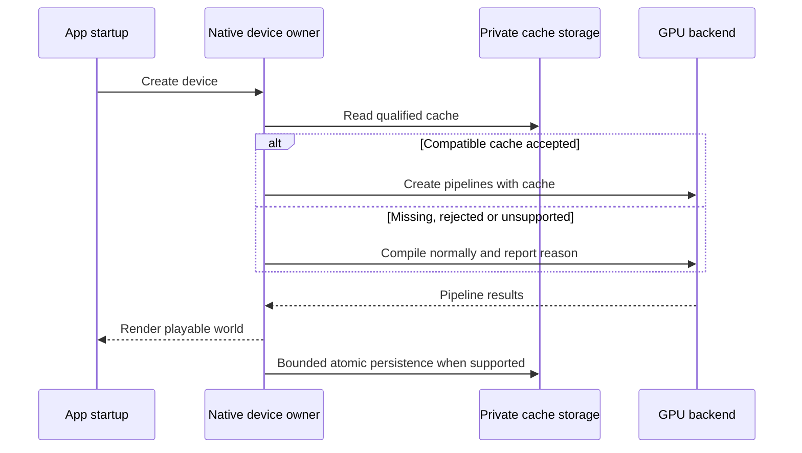

# PRD-368 — Compiled pipelines survive a relaunch

**Status:** BLOCKED — requires-pipeline-cache-api, 2026-09-09. **Layer:** native engine; only the host can persist backend compiler data.
**Complexity:** 3 (10+ files) + 2 (new cache lifecycle) + 2 (concurrency) = **7 → HIGH mode**.
**Depends on:** [367](../../assets/PRD-367-doctor-explains-shader-compilation.md) for measured acceptance and
the [shared execution contract](../../assets/README.md). Dependency feasibility can run first.

The feasibility probe [`prd-368-feasibility-2026-09-09.md`](../../../verification/prd-368-feasibility-2026-09-09.md)
found no supported wgpu-native C API for pipeline-cache creation, serialization, attachment, or
reuse in the pinned or latest inspected artifacts. Phase 1 is therefore not implementable without
an owned extension or fork; no cache lifecycle or cache-hit claim is made.

## Problem and outcome

The source town pays 8,513 ms to create 101 pipelines. A compatible process restart should reuse
compiled native pipeline data automatically. First launch still compiles; a corrupt or incompatible
cache must never prevent a correct launch. This does not change materials or turn on warm-up.

## Integration ledger

| # | New thing | Live caller / existing anchor | Replaces | Old path disposition | Negative control |
| --- | --- | --- | --- | --- | --- |
| C1 | Pinned cache-capable native dependency | `packages/runtime-native/scripts/download-deps.mjs:55`, dependency selection; `packages/runtime-native/CMakeLists.txt:362`, linking | Current wgpu dependency for the selected backend | One selected pin, no alternate shipping runtime | Link against old headers: required API capability check fails |
| C2 | Per-device cache lifecycle | `packages/runtime-native/src/webgpu/bindings_pipelines.cpp:1113` and `:1123` | Compile without a supplied persistent cache | Both existing creation paths use one shared cache when supported | Bypass attaching cache: warm performance control loses benefit |
| C3 | Durable cache storage/status | `packages/runtime-native/src/webgpu/bindings.cpp`, device lifecycle | No persistent native pipeline artifact | One owner; warm-up metadata cache stays separately labeled | Corrupt bytes: launch succeeds with recorded rejection and rebuild |

The current core `warmUpCacheIdentity` and `warmUpStorage` in `warmup.ts` cache warm-up metadata;
they are not proof of serialized GPU compiler reuse. Do not replace or relabel them as native hits.

## Design and feasibility boundary

The inspected downloader pins `v25.0.2.2`. The source's proposal to “bump wgpu-native” does not prove
that any available release exposes a usable C cache handle. Inspect upstream primary API, headers,
license and the exact binary exports at execution. Select the smallest supported dependency update
only after linking and executing cache creation, serialization and reuse. Rust wgpu capability alone
is insufficient. If an owned extension/fork is required, record its maintenance and platform scope
and revise this PRD before implementation; do not quietly introduce another graphics backend.

Identity includes app/build and shader content, adapter/device, driver, backend and cache ABI/version.
Use the existing host app-private storage/config seam; never the asset `public/` directory or a
shared unqualified filename. Validate metadata, length and bounds before backend ingestion. Use
atomic replacement, bounded disk use and serialized writes; a crash leaves either the old valid
file or a miss. Missing, incompatible, corrupt or unwritable storage records a reason and compiles
normally. Device/pool shutdown must complete safely without a use-after-free or blocking flush on
first present. Status means actual backend load/store outcomes, not merely “file exists.”

**Data change:** versioned, disposable per-app native cache; no source asset or database migration.
On unsupported backends report unavailable and preserve normal rendering. Browser caching remains
browser-owned. Do not claim D3D12/Metal/iOS reuse without executing those lanes.

## Phase 1 — A linked host reuses a real town pipeline

Files: EDIT `packages/runtime-native/scripts/download-deps.mjs` (verified pin),
`packages/runtime-native/CMakeLists.txt` (link/capability contract),
`packages/runtime-native/src/webgpu/bindings_pipelines.cpp` (actual cache attachment),
`packages/runtime-native/tests/async_pipeline_thread_test.cpp` (backend reuse assertion),
`packages/runtime-native/scripts/verify-wgpu-version-matrix.mjs` (supported-version proof). C1/C2.

Choose the supported API with recorded header/symbol evidence; prove a pipeline taken from the real
town, then execute its complete bundle on native desktop. Preserve sync/async failure semantics.
Test `should reuse backend compiler data when a compatible cache is supplied`; remove attachment
at actual creation as red. Run `pnpm native:build`, `pnpm native:verify:desktop` and shared gates.
Capture the actual native contract-test command from CMake's registered test target before running.
User verification: the host reports accepted backend cache data and renders the same town.
This phase proves API feasibility, not persistent process restarts or Pixel timing.

## Phase 2 — Process restarts load validated app-private data

Files: EDIT `packages/runtime-native/src/webgpu/bindings.cpp` (device ownership),
`packages/runtime-native/src/webgpu/bindings_pipelines.cpp` (pool lifetime integration),
`packages/runtime-native/CMakeLists.txt` (module/test registration);
NEW `packages/runtime-native/src/webgpu/pipeline_cache.cpp` (bounded storage/lifecycle),
`packages/runtime-native/tests/pipeline_cache_test.cpp` (real filesystem corruption/restart cases).
Ledger C2/C3. Split this phase if declarations or platform storage wiring require additional files.

Wire existing configuration and platform storage before choosing paths. Test `should compile
normally when persisted bytes are corrupt`, `should miss when the driver identity changes`, and
`should preserve a valid cache when a write is interrupted`. Include concurrent completion,
read-only storage, oversized input and process death. Revert control: remove lifecycle load call;
restart integration test must lose the accepted-cache event. Run native/shared gates and real
town restarts. User verification: relaunch, observe hit; replace the exact test cache with corrupt
bytes, relaunch successfully, observe rejection. Never clear unrelated app data for this control.

## Phase 3 — Pixel 8 repeat launches meet the measured bar

Files: EDIT `packages/runtime-native/scripts/measure-cold-start.mjs` (explicit cache-state records),
`packages/playtest/src/runner/perf.ts` (cache outcomes in reports),
`packages/runtime-native/tests/async_pipeline_thread_test.cpp` (regression coverage),
`docs/verification/runtime-perf-state.md` (commands/results);
NEW `packages/playtest/__tests__/pipeline-cache-perf.spec.ts` (fail-closed evaluation). C3.

Use three independent pairs: process-cold/cache-empty launch then process-cold/cache-populated
launch, same APK and qualified thermal conditions. Interleave a cache-disabled control to
distinguish driver warming from application-cache benefit. Retain all samples, medians, complete
pipeline counts and first-playable timestamps. Proposed acceptance: populated-cache compile median
≤25% of matched empty-cache median and populated first-playable median ≤8,000 ms. These are goals,
not predictions. Report first-launch cost and any persistence overhead separately.

Test `should reject a warm-cache claim when only the process was restarted` if cache identity/state
evidence is absent. Run `pnpm exec vitest run packages/playtest/__tests__/pipeline-cache-perf.spec.ts`,
native/shared gates, and the existing measurement script with the resolved game config and
`--launches 3`; record exact commands for cache arms before execution. Human review checks the raw
paired timings and identical rendered result. If API reuse works but the timing bar fails, keep
the PRD partial and record the measured result, without declaring earlier startup PRDs complete.

## Acceptance and verification evidence

- [ ] Cache-capable C API, binary pin and selected platform builds are proven, with no inferred API.
- [ ] Both sync and async creation consume the same qualified cache and teardown is safe.
- [ ] Corrupt/incompatible/missing/unwritable caches preserve launch with honest reason codes.
- [ ] Real Pixel 8 pairs meet the registered compile and playable bars; desktop/browser visuals
  remain correct and unsupported platform claims remain explicitly unverified.
- [ ] Every phase has command/output/artifact, red/green, caller census, independent review and
  manual performance review. All implementation evidence currently UNVERIFIED.
