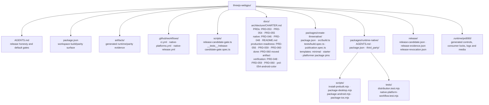

# PRD-060 — Promoted consumer distribution

**Status:** BLOCKED — NOT STARTED. PRD-054 does not have an exact-candidate
three-target parity PASS, PRD-059 is not implemented, no exact-candidate release run has
completed, `create-threenative` and `@threenative/runtime-native` return npm `E404`, and the
required npm, desktop-signing, Android-signing, and Apple signing/notarization credentials were
not supplied to this author lane. Missing credentials or owned prerequisite evidence means
`BLOCKED` with exit 2; it never means skipped or passed.

**Complexity: 10 → HIGH mode.**

**Blast radius: exactly 19 repository paths across release orchestration, signed packaging,
registry-only consumers, compatibility and revocation controls, tests, and release evidence.**

**Complexity scoring:** 10+ files +3; new release-candidate/evidence system +2; complex
promotion, cleanup, and revocation state +2; multi-package release flow +2; npm, GitHub, and
platform-signing integration +1.

**Depends on:** PRD-048 for the existing local CLI, prebuilt installer, checksum transaction,
and no-toolchain packaging mechanics; PRD-054 for exact-candidate fail-closed visual/behavior
parity and host-shim coverage; PRD-059 for locked native inputs, SBOM, license inventory, and
release provenance; and successful exact-candidate `CI` plus `Native platform evidence` runs.

**Existing owners remain authoritative:** PRD-046 owns native physics; PRD-048 owns local native
CLI/distribution mechanics; PRD-053 owns multitouch implementation/device proof; PRD-054 owns
cross-target parity and host-shim coverage; PRD-055 owns generated HUD/text; PRD-056 owns
physical mobile qualification; PRD-059 owns native dependency provenance/SBOM. PRD-060 consumes
their outputs and does not change their implementation or acceptance wording.

## 1. Context

**Problem:** ThreeNative has locally proven packaging mechanics, but a public consumer cannot
currently resolve the complete framework from npm, fetch a completed checksum/provenance-locked
runtime release, obtain store-ready signed/exported artifacts, or rely on a rehearsed promotion,
downgrade, cleanup, and revocation policy.

**Files Analyzed:** The root and native agent rules, Charter, PRD-046, PRD-048, PRD-053,
PRD-054, PRD-055, PRD-056, PRD-057, PRD-059, native status/verification ledgers, all three audit
summaries, package/template manifests, public build entry, runtime packagers/installer/tests, CI,
native-platform, and native-release workflows.

### Evidence identity at plan time

| Evidence class | Current fact | Credit allowed by this PRD |
|---|---|---|
| Dirty worktree | The 2026-08-09 checkout contains many modified and untracked native/parity/template files. | Discovery and planning only; never a release candidate or reproducible publication result. |
| Committed HEAD | `cb754d994910ec982a024ad8da9dc8f855eaf3cf` (`cb754d9`), tagged `runtime-native-v0.1.13`. | Baseline source identity only; the corresponding release run was cancelled and did not finalize. |
| Older CI SHA | `e38439c` passed historical hosted macOS, Windows, and iOS-simulator lanes in run `31313092745`. | Historical runner/simulator evidence only; never exact-candidate CI or release proof. |
| Android emulator | x86_64/SwiftShader plumbing exists, while PRD-053 multitouch and PRD-054 visual parity remain red. | Emulator behavior only; never arm64, physical GPU, signing-to-device, or performance proof. |
| iOS simulator | Historical hosted simulator/no-Xcode-consumer proof exists at `e38439c`. | Simulator packaging/behavior only; never a device-signed export or physical execution claim. |
| Hosted runner | Failed/cancelled release runs include `31314171195` at `b755168`, `31321017005` at `323a57b`, and `31333583703` at `cb754d9`. | Exact job/SHA/artifact facts only; a failed, cancelled, skipped, or older-SHA run cannot promote. |
| Physical hardware | No physical result is produced by this PRD. | None; PRD-056 remains the owner and mobile-ready stays unavailable until its criteria pass. |
| Signed artifact | No current release evidence includes the complete required desktop, Android, and iOS signed/exported set. | Signature/notarization/export validity only after exact artifact verification; signing alone proves no runtime behavior. |
| Published package | The supplied live facts say `create-threenative` and `@threenative/runtime-native` return npm `E404`; local tarballs exist. | Only public registry package/version/integrity evidence counts; tarballs and workspace links do not. |
| Promoted consumer | No completed runtime release and no registry-only consumer-backed finalization exist. | Only a default-tag public scaffold/install/build after finalization counts as promoted consumption. |

### Current behavior

- `.github/workflows/native-release.yml:3-6` starts on a runtime version tag and
  `.github/workflows/native-release.yml:19-30` checks only tag-to-runtime-package version; it
  does not require successful `CI`, PRD-054, or PRD-059 evidence from the same SHA.
- `.github/workflows/native-release.yml:218-269` can create a GitHub prerelease and
  `prebuilt-lock.json`, but the required completed public release does not exist and the lock
  currently has no candidate/version/signature/provenance cohort assertion.
- `.github/workflows/native-release.yml:282-304` and `:421-447` create consumers from local
  tarballs and a checkout. Those are useful PRD-048 contract tests, not registry-only public
  consumer proof.
- `.github/workflows/native-release.yml:551-581` promotes after two clean-consumer jobs and
  deletes a failed GitHub prerelease, but it does not stage/publish npm packages, restore npm
  dist-tags, deprecate failed versions, or prove N-1 recovery.
- `packages/runtime-native/scripts/install-prebuilt.mjs:52-53` already derives the GitHub lock
  URL from the installed runtime package version. That is the correct N/N-1 selection seam, but
  the lock does not yet assert its own version/candidate identity.
- `packages/create-threenative/src/build.ts:137-193` dispatches desktop, Android, and iOS
  packaging. Desktop produces an unsigned executable, Android produces a debug APK, and iOS is
  simulator-only; none is store-ready.
- `packages/create-threenative/templates/minimal/package.json:19-35`,
  `packages/create-threenative/templates/starter/package.json:20-45`, and
  `packages/create-threenative/templates/platformer/package.json:20-44` pin the package cohort
  a public scaffold must resolve. Any one `E404`, local override, or mismatched cohort blocks
  promotion.

## 2. Scope Limits and Anti-Scope

### Scope Limits

1. Produce one exact-candidate release cohort covering every package referenced by the three
   generated templates, all PRD-048 runtime assets, PRD-059 compliance/provenance artifacts, and
   signed/exported platform outputs.
2. Extend the existing `threenative build --target ...` command with a release mode; do not add
   a fifth top-level CLI command. Ordinary web/native local builds retain PRD-048 behavior.
3. Stage repository-owned npm packages under a non-default candidate dist-tag, run consumers
   using registry URLs only, then promote all cohort tags and the GitHub release only after every
   exact-candidate gate succeeds.
4. Prove N-1 exact pins, N-1→N upgrade, N→N-1 downgrade, failed-prerelease cleanup, and
   promoted-version revocation without deleting a previously promoted runtime asset needed by
   pinned consumers.
5. Record an exact release evidence packet. Keep dirty worktree, committed HEAD, older CI,
   emulator, simulator, hosted runner, physical hardware, signed artifact, published package,
   and promoted consumer as separate evidence classes.

### Anti-Scope

- No runtime renderer, host shim, parity metric/tolerance, multitouch, HUD/text, audio, physics,
  navigation, gameplay, or physical-device implementation.
- No rewrite of PRD-048's checksum-first installer transaction, local CLI target semantics, or
  no-toolchain packagers; release mode extends their output/validation and keeps local mode.
- No duplicate dependency lock, SBOM, license inventory, or provenance generator. PRD-059's
  outputs are required release inputs and remain authoritative.
- No App Store, TestFlight, Play Console, Microsoft Store, or Linux-store submission; no paid
  developer-account creation/management; no credential generation, storage, printing, or
  rotation. Store-ready validation ends at signed/notarized/exported artifact checks.
- No physical-device, arm64 phone, real-driver, performance, audible-output, or mobile-ready
  claim. A signed APK/AAB/IPA that was never run remains a signed artifact, not hardware proof.
- No npm unpublish of a promoted version and no deletion of its GitHub runtime assets. Revocation
  restores safe dist-tags and deprecates/marks the bad version while preserving explicit pins.

## 3. Solution

### Approach

- Add one strict `releaseCandidateV1` gate that binds tag, candidate SHA, clean hosted checkout,
  package cohort, exact-candidate `CI`, PRD-054 parity, PRD-059 provenance, signing credential
  availability, and expected release subjects before any publish/sign action.
- Add `--release` as a flag on the existing build command. Desktop release mode emits verified
  signed/notarized distributables, Android emits a production-signed APK plus AAB, and iOS emits
  a signed `.xcarchive` plus exported IPA. Missing credentials/tools return BLOCKED/exit 2 before
  a publishable artifact is written.
- Create the GitHub prerelease and PRD-059 provenance/compliance set first, publish the npm cohort
  to a candidate dist-tag with provenance, and run new jobs with no repository checkout or local
  tarballs. Those jobs scaffold from npm, assert registry integrity/lock purity, mask native
  toolchains, and consume checksum-locked GitHub assets.
- Exercise one prior promoted cohort as N-1, upgrade it to N, downgrade it to N-1, and rehearse
  both unpromoted cleanup and promoted revocation. Keep a snapshot of previous dist-tags so a
  partial promotion can be restored.
- Finalize GitHub and npm only after all signed-artifact, registry-only consumer, compatibility,
  parity, provenance, and negative-control gates pass. Emit one immutable evidence summary with
  artifact/package hashes, run/job ids, signature identities, dist-tags, and consumer locks.

### Key Decisions

- Candidate publication uses an npm non-default dist-tag. A candidate version may occupy an
  immutable npm version, but it is not `latest` until finalization. Failed candidates are removed
  from candidate tags and deprecated with the release/run id; they are never treated as promoted.
- A registry version that already exists is accepted only when its normalized packed file set,
  package metadata, and registry integrity match the candidate. npm immutability is not bypassed.
- macOS evidence requires hardened-runtime signing, notarization acceptance, stapling, strict
  `codesign`, and `spctl` assessment of the final app/package. Windows requires Authenticode and
  `signtool verify /pa`. Linux and every release subject require GitHub OIDC build provenance and
  keyless signature/attestation verification bound to this repository/workflow/candidate SHA.
- Android evidence requires release APK and AAB, non-debuggable manifest, release keystore
  signature, signer digest, `zipalign`/`apksigner` verification, and bundle validation. iOS
  requires device arm64 archive, distribution signing/profile/entitlements verification, and a
  successful non-store export to IPA. Neither substitutes for PRD-056 physical execution.
- Promoted revocation preserves GitHub assets and explicit version installs, publishes a
  machine-readable revocation record, deprecates the bad npm cohort, and restores default tags to
  the last safe cohort. Failed unpromoted cleanup may delete its GitHub prerelease because no
  promoted consumer was allowed to depend on it.

**Data Changes:** No database, game-state, renderer, or public scene schema changes. New strict
ignored/release JSON documents are `releaseCandidateV1`, `releaseEvidenceV1`, and
`releaseRevocationV1`; PRD-048's `prebuilt-lock.json` gains schema version, runtime version,
candidate SHA, and PRD-059 provenance reference fields without changing checksum-first download
semantics.

## Project Structure

## Integration Ledger

| # | New thing | Live caller (`file:line`, non-test) | Replaces | Old path removed? | Negative control |
|---|---|---|---|---|---|
| 1 | `releaseCandidateV1` exact-candidate preflight | `.github/workflows/native-release.yml:3-6` is the tag entry and `:19-30` is the existing validation step edited to invoke `scripts/release-candidate-gate.ts` | tag/version-only validation | yes; no build/publish job can bypass exact SHA, dependency, cohort, or credential preflight | substitute successful older run `e38439c` for candidate `cb754d9`; preflight exits 1 |
| 2 | Desktop release mode and signed/notarized artifacts | `packages/create-threenative/src/build.ts:177-192` dispatches the existing desktop packager; `.github/workflows/native-release.yml:32-124` executes/stages the desktop matrix | unsigned standalone desktop output as release evidence | local unsigned mode remains; release publication delegates only to validated signed output | omit platform signing/notary input; release build reports BLOCKED and exits 2 before staging |
| 3 | Android signed APK/AAB and iOS signed archive/IPA | `packages/create-threenative/src/build.ts:143-174` dispatches the existing mobile packagers; `.github/workflows/native-release.yml:126-216` builds current mobile runtime subjects | debug APK and unsigned simulator archive as store-ready evidence | retained for local/emulator/simulator use, but excluded from release/store-ready subject set | unsigned/debuggable APK or simulator-only iOS app fails release validation, exit 1/2 |
| 4 | npm release cohort and registry-only clean consumers | `.github/workflows/native-release.yml:218-269` is the existing prerelease publication seam and `:271-549` is the consumer seam; both are edited to stage npm then consume without checkout/tarballs | local-tarball clean consumer as public proof | local tarball lane remains PRD-048 evidence but cannot satisfy PRD-060 | inject `file:`/`workspace:` dependency or make runtime npm lookup return `E404`; consumer exits nonzero |
| 5 | N-1 pin/upgrade/downgrade compatibility matrix | `packages/runtime-native/scripts/install-prebuilt.mjs:52-53` selects versioned locks and `.github/workflows/native-release.yml:551-565` is the existing finalization caller | untested assumption that old pins and rollback work | yes; finalization requires the compatibility report | delete N-1 assets or mismatch manifest version; N-1/downgrade gate exits 1 |
| 6 | Failed-candidate cleanup and promoted-release revocation | `.github/workflows/native-release.yml:566-581` is the existing failed-release cleanup caller | GitHub-only prerelease deletion with no npm/tag/revocation state | yes; cleanup/revocation runs one audited state machine with prior-tag snapshot | leave candidate on `latest` after a forced consumer failure; cleanup audit exits 1 |
| 7 | `releaseEvidenceV1` and promoted-consumer status | `docs/PRDs/native/README.md:3-12` is the existing support/release truth consumer; Phase 6 edits it only from the validated evidence report | prose assembled from mixed/stale evidence classes | yes; promoted status requires the exact report and default-tag registry consumer | feed cancelled run `31333583703` or local tarball consumer; evidence audit remains BLOCKED/nonzero |

### Reachability

**How will this feature be reached?** A release operator pushes the existing version-matched
`runtime-native-v*` tag after exact-candidate CI/dependency evidence exists. The tag invokes the
existing native release workflow, which calls the new gate before build, signing, GitHub/npm
candidate publication, registry-only consumption, compatibility, and promotion.

**Is this user-facing?** Yes. The consumer runs `pnpm create threenative@<promoted-version>`,
installs only public registry content, and builds web/native targets without CMake, NDK, Xcode,
or Rust in the ordinary consumer lane. A release operator additionally receives validated
store-ready outputs without submitting them to a store.

**Full flow:** exact candidate tag → same-SHA CI/PRD-054/PRD-059/preflight → signed platform
subjects and checksum/provenance-locked GitHub prerelease → npm candidate cohort →
registry-only no-toolchain consumers → N-1/upgrade/downgrade checks → npm/GitHub promotion →
default-tag promoted consumer → immutable evidence rollup.

**What does this replace?** It replaces release claims based on local tarballs, unsigned runner
artifacts, partially completed workflows, and prose-only cleanup. It does not replace PRD-048's
local mechanics, PRD-054's parity runner, or PRD-059's provenance generator.

## 4. Execution Phases

Every phase is a consumer/operator-visible vertical slice, edits at least one pre-existing file,
has at most five declared files, and stops for a HIGH-mode checkpoint before the next phase.

#### Phase 1: Exact-candidate preflight — a tag cannot build or publish from stale, blocked, incomplete, or credential-less evidence

**Files (4):**

- `.github/workflows/native-release.yml` - EDIT: call preflight before every build and expose only non-secret run/cohort inputs
- `scripts/release-candidate-gate.ts` - NEW: strict releaseCandidateV1 schema, GitHub run/SHA/dependency/cohort/credential preflight, and exit taxonomy
- `scripts/__tests__/release-candidate-gate.spec.ts` - NEW: exact-SHA, blocker, schema, and credential-presence tests
- `packages/runtime-native/tests/native-platform-workflow.test.mjs` - EDIT: assert preflight ordering and that no publish/sign job bypasses it

**Implementation:**

- [ ] Parse repository, tag, candidate SHA, workflow run ids, package cohort, PRD-054 report,
      PRD-059 provenance inputs, expected subjects, and credential-presence booleans; reject
      unknown/missing fields and never serialize secret values.
- [ ] Require successful `CI` and `Native platform evidence` conclusions whose `head_sha` equals
      the tag's peeled commit. Require PRD-054 all-target verdict and PRD-059 release inputs from
      the same SHA. Older, cancelled, failed, skipped, neutral, or dirty-only evidence is non-pass.
- [ ] Require tag/runtime/cohort versions to agree, every candidate version to be publishable or
      byte-identical to the registry version, and the expected GitHub/npm subject set to be exact.
- [ ] Classify absent npm/signing/notarization credentials or hosted platform capability as
      `BLOCKED`, exit 2, before build/publish. Invalid/stale evidence is `FAIL`, exit 1.

**Wiring (the phase is not done without this):**

- [ ] Caller edited: `.github/workflows/native-release.yml:19-30` invokes the new gate from the
      existing tag validation job.
- [ ] Registration: all later workflow jobs `needs` the validated preflight output and compare its
      candidate SHA with `github.sha`.
- [ ] Old path: tag/version-only validation no longer reaches builders alone.
- [ ] Ledger rows filled: #1.

**Tests Required:**

| Gate | Test File | Test Name | Explicit assertion semantics | Negative control |
|---|---|---|---|---|
| `candidate-schema` | `scripts/__tests__/release-candidate-gate.spec.ts` | `should reject unknown missing or secret-bearing release candidate fields` | exact key set; secrets represented only as booleans; missing subject/dependency/run path named; zero subjects rejected | omit PRD-059 provenance subject; validator exits 1 |
| `exact-candidate-ci` | same | `should require successful CI parity and provenance evidence from the tag commit` | peeled tag SHA equals CI/native/report SHA; every required conclusion is `success`; cancelled `31333583703` and older `e38439c` are rejected | substitute `e38439c`; gate exits 1 |
| `credential-preflight` | same | `should block before signing or publication when any required credential is absent` | complete missing-credential list, status `BLOCKED`, no build/publish command invocation, exit 2 | unset npm and Apple signing presence flags |
| `preflight-wiring` | `packages/runtime-native/tests/native-platform-workflow.test.mjs` | `should order exact-candidate preflight before every release side effect` | preflight token precedes build, signing, GitHub release, npm publish, dist-tag, and finalize tokens; every side-effect job depends on it | remove one `needs` edge; focused test exits 1 |

**Revert check:** Remove the preflight call while keeping current tag validation; the structural
gate must fail even though the existing workflow still parses and builds.

**User Verification:** Action: run preflight against `cb754d9` with the cancelled release run and
missing credentials. Expected: one structured BLOCKED/FAIL report, no build/publish side effect,
and nonzero exit.

#### Phase 2: Desktop release artifacts — public consumers receive verifiably signed Linux, Windows, and notarized macOS outputs

**Files (5):**

- `.github/workflows/native-release.yml` - EDIT: build/sign/verify/attest desktop consumer artifacts and upload exact evidence
- `packages/create-threenative/src/build.ts` - EDIT: add bounded `--release` dispatch without a new top-level command
- `packages/runtime-native/scripts/package-desktop.mjs` - EDIT: platform release containers, signing/notarization hooks, validation report, and BLOCKED semantics
- `packages/create-threenative/__tests__/build.spec.ts` - EDIT: release flag parsing, local-mode parity, missing-credential, and command-delegation assertions
- `packages/runtime-native/tests/native-platform-workflow.test.mjs` - EDIT: desktop signature/notary/attestation ordering and artifact-set assertions

**Implementation:**

- [ ] Preserve ordinary desktop output byte behavior when `--release` is absent. Release mode
      writes to a temporary staging root and publishes nothing until all platform checks pass.
- [ ] On macOS, wrap the compiled game as an `.app`, sign nested/final code with hardened runtime
      and timestamp, submit for notarization, staple, then require strict `codesign`, `spctl`, and
      staple validation before archiving.
- [ ] On Windows, sign the final executable/installer with timestamping and require Authenticode
      chain/policy verification. On Linux, produce the deterministic archive and keyless
      repository/workflow/SHA-bound signature/attestation; apply that attestation to every desktop
      release subject.
- [ ] Emit artifact hash, signature/identity fingerprint, timestamp authority, notarization id,
      verification commands/results, candidate SHA, and unsigned source hash without private-key,
      password, profile, or runner-path leakage.
- [ ] Missing credentials, timestamp/notary service, or required hosted capability is BLOCKED
      exit 2. Invalid signature/notarization/output is FAIL exit 1. Neither uploads a release
      subject.

**Wiring (the phase is not done without this):**

- [ ] Caller edited: `packages/create-threenative/src/build.ts:177-192` passes release mode to the
      existing desktop packager; `.github/workflows/native-release.yml:32-124` calls it.
- [ ] Registration: desktop matrix upload accepts only validator-produced signed subject/report
      pairs whose candidate SHA equals preflight.
- [ ] Old path: unsigned source-runner output remains local evidence but cannot enter the release
      subject set.
- [ ] Ledger rows filled: #2.

**Tests Required:**

| Gate | Test File | Test Name | Explicit assertion semantics | Negative control |
|---|---|---|---|---|
| `desktop-release-mode` | `packages/create-threenative/__tests__/build.spec.ts` | `should preserve local desktop behavior and delegate release mode exactly once` | no-release command unchanged; release flag reaches one packager invocation; unknown release args fail before spawn | remove release delegation; test exits 1 |
| `desktop-signing` | same | `should block before output when desktop release credentials are absent` | platform-specific missing names returned, output absent, exit 2; fake signer cannot create pass report | unset platform credential fixture |
| `desktop-release-wiring` | `packages/runtime-native/tests/native-platform-workflow.test.mjs` | `should verify signed desktop subjects before upload and attest them to the candidate SHA` | exact Linux/macOS/Windows subject/report set; verification precedes upload; attestations bind repository/workflow/SHA | move upload before signature/notary verification; test exits 1 |

**Revert check:** Disable signature validation while retaining successful desktop builds; the
workflow structural gate and fake-signer control fail. A runnable unsigned binary is not release
evidence.

**User Verification:** Action: inspect each staged desktop report and independently run its
platform verifier. Expected: Linux identity-bound attestation, Windows trusted Authenticode, and
macOS accepted/stapled notarization, all tied to one candidate SHA.

#### Phase 3: Store-ready mobile artifacts — release mode emits a signed Android APK/AAB and signed/exported iOS archive/IPA without claiming store submission or hardware execution

**Files (5):**

- `.github/workflows/native-release.yml` - EDIT: mobile release signing/export/validation jobs, credential blockers, and exact subject uploads
- `packages/create-threenative/src/build.ts` - EDIT: route Android/iOS release mode and output manifests while keeping ordinary debug/simulator modes
- `packages/runtime-native/scripts/package-android.mjs` - EDIT: production APK/AAB assembly, signing, manifest/alignment/bundle validation, and report
- `packages/runtime-native/scripts/package-ios.mjs` - EDIT: device-host staging, archive signing/profile checks, non-store export, IPA validation, and report
- `packages/runtime-native/tests/distribution.test.mjs` - EDIT: Android/iOS release controls, missing credentials, partial output, and secret-redaction assertions

**Implementation:**

- [ ] Android release mode consumes PRD-048 checksum-verified runtime/SDL payloads, assembles both
      release APK and AAB, requires `debuggable=false`, signs with the supplied release identity,
      records certificate digest, and validates alignment, APK signature, ABI contents, bundle,
      package id/version, and embedded game-bundle hash.
- [ ] iOS release mode consumes the checksum/provenance-locked arm64 device host, stages the exact
      game/assets, requires distribution identity/profile/team/application-id agreement, produces
      `.xcarchive`, exports a non-store IPA, and verifies codesign, entitlements, profile expiry,
      arm64 slice, bundle version, and embedded game-bundle hash.
- [ ] Keep Android debug APK and iOS simulator `.app` behavior unchanged outside `--release`.
      Store-ready outputs use no target-specific game source and do not add a second packager.
- [ ] Never copy keystores, private keys, provisioning profiles, passwords, or profile contents
      into reports/artifacts. Record fingerprints, expiry, team/signer ids, and validation facts.
- [ ] Missing credentials/profile/device-host/export capability is BLOCKED exit 2; malformed,
      unsigned, debug, expired, wrong-ABI, or hash-mismatched output is FAIL exit 1 and not uploaded.

**Wiring (the phase is not done without this):**

- [ ] Caller edited: `packages/create-threenative/src/build.ts:143-174` routes release mode through
      the existing Android/iOS packager paths.
- [ ] Registration: `.github/workflows/native-release.yml:126-216` uploads exact signed subject and
      validation-report pairs only after PRD-059 provenance and candidate identity match.
- [ ] Old path: debug APK/unsigned simulator archive remain development evidence and are excluded
      from store-ready/release sets.
- [ ] Ledger rows filled: #3.

**Tests Required:**

| Gate | Test File | Test Name | Explicit assertion semantics | Negative control |
|---|---|---|---|---|
| `android-store-ready` | `packages/runtime-native/tests/distribution.test.mjs` | `should accept only aligned non-debuggable signed APK and valid AAB from the candidate bundle` | APK/AAB package/version/bundle hash equal; arm64+x86_64 runtime present; signer digest recorded; every verifier exit 0 | substitute unsigned/debuggable APK; validation exits 1 and upload set stays empty |
| `ios-store-ready` | same | `should accept only a distribution-signed arm64 archive and exported IPA with matching profile entitlements and bundle` | archive/IPA application id, version, team, profile, entitlements, arm64, and game hash agree | substitute simulator app or expired profile; BLOCKED/FAIL exit 2/1 |
| `mobile-secret-boundary` | same | `should report signing fingerprints without serializing signing material` | recursive report scan contains no private key, password, keystore/profile bytes, absolute runner path, or raw credential environment value | inject secret marker into report fixture; validator exits 1 |

**Revert check:** Feed current debug APK and unsigned simulator zip to release validators. Both must
remain development evidence and fail to enter the signed/exportable subject set.

**User Verification:** Action: verify the staged APK/AAB/archive/IPA with platform tools. Expected:
all validation facts agree with candidate/cohort; no store upload or physical run is claimed.

#### Phase 4: Public npm and registry-only consumers — every generated template resolves public packages and builds without local tarballs, workspace links, or native toolchains

**Files (5):**

- `.github/workflows/native-release.yml` - EDIT: candidate npm publication with provenance plus checkout-free registry-only consumer matrix
- `packages/create-threenative/templates/minimal/package.json` - EDIT: exact candidate/promoted cohort pins with no unpublished dependency
- `packages/create-threenative/templates/starter/package.json` - EDIT: exact candidate/promoted cohort pins with no unpublished dependency
- `packages/create-threenative/templates/platformer/package.json` - EDIT: exact candidate/promoted cohort pins with no unpublished dependency
- `packages/create-threenative/__tests__/publication.spec.ts` - EDIT: full cohort equality, template dependency resolvability, public-access, and no-local-protocol contract

**Implementation:**

- [ ] Build/pack every repository-owned package, normalize and hash its packed file manifest, then
      publish missing candidate versions with npm provenance/public access under the candidate
      dist-tag. Existing versions must match normalized candidate bytes/metadata or fail.
- [ ] Require `npm view` success for every template dependency, including externally owned MCP
      packages. An `E404` blocks publication; PRD-060 neither publishes an external repository nor
      substitutes a tarball. Publish runtime-native only after its versioned GitHub lock exists;
      publish create-threenative last.
- [ ] Run clean consumer jobs with no checkout and no package tarballs: resolve the exact CLI from
      npm, scaffold all seven templates, install with a fresh store, and assert the lock contains no
      `workspace:`, `link:`, `file:`, localhost, or repository path.
- [ ] Mask/log `cargo`, C/C++, CMake, Ninja, NDK, Rust, and Xcode build entry points in ordinary
      registry consumers. Build/test web, desktop on Linux/macOS/Windows, Android APK on the
      emulator lane, and iOS simulator app on an Apple runner from public npm+GitHub bytes only.
- [ ] Record npm version, dist-tag, registry integrity/tarball URL, normalized file hash,
      provenance, resolved dependency graph, consumer lock hash, toolchain log, target report, and
      GitHub runtime-lock/artifact hashes.

**Wiring (the phase is not done without this):**

- [ ] Caller edited: `.github/workflows/native-release.yml:218-269` stages npm after GitHub assets;
      `:271-549` is converted from local tarballs to checkout-free public registry consumers.
- [ ] Registration: template manifests are the exact cohort source consumed by the public CLI and
      checked by the existing publication test.
- [ ] Old path: local tarball consumer remains PRD-048 local evidence but is removed as a PRD-060
      promotion prerequisite and cannot populate public-consumer evidence.
- [ ] Ledger rows filled: #4.

**Tests Required:**

| Gate | Test File | Test Name | Explicit assertion semantics | Negative control |
|---|---|---|---|---|
| `npm-cohort` | `packages/create-threenative/__tests__/publication.spec.ts` | `should publish one exact resolvable cohort for every generated template dependency` | set equality across template framework pins and candidate manifest; repository packages public; every dependency returns version/integrity; no E404 or local protocol | force runtime lookup to E404; test/gate exits 1 |
| `registry-only-consumer` | `.github/workflows/native-release.yml` | `checkout-free public scaffold consumer` | job has no checkout; CLI/package URLs are registry/GitHub HTTPS; lock has no local protocol/path; all seven scaffolds install/build and target reports match candidate | inject a local tarball override; audit exits 1 |
| `no-toolchain-consumer` | `.github/workflows/native-release.yml` | `public consumer does not invoke native build tools` | masked command log absent after desktop/Android/iOS consumer builds; supported prebuilt assets verified by lock | make packager invoke `cmake`; shim exits 97 and job fails |

**Revert check:** Restore the current local-tarball scaffold steps. The registry-only structural
gate must fail even if every local consumer stays green.

**User Verification:** Action: on a fresh registry-only environment run the exact candidate CLI
and build each supported ordinary target. Expected: public versions/integrities and GitHub asset
hashes resolve; no native toolchain command executes.

#### Phase 5: Compatibility, cleanup, revocation, and promotion — N-1 remains usable and a failed or bad candidate can be removed from defaults without stranding pinned consumers

**Files (5):**

- `.github/workflows/native-release.yml` - EDIT: N-1 matrix, dist-tag snapshot/transaction, default-tag consumer, cleanup, revocation rehearsal, and finalization ordering
- `scripts/release-candidate-gate.ts` - EDIT: compatibility/promotion/cleanup/revocation state validation and releaseEvidenceV1 generation
- `scripts/__tests__/release-candidate-gate.spec.ts` - EDIT: N-1, partial promotion, cleanup, revocation, and default-tag controls
- `packages/runtime-native/scripts/install-prebuilt.mjs` - EDIT: validate lock schema runtime version/candidate identity while preserving version-derived URL selection
- `packages/runtime-native/tests/distribution.test.mjs` - EDIT: version-matched N/N-1 lock, upgrade/downgrade, missing/revoked-state evidence, and retained-asset controls

**Implementation:**

- [ ] Select the immediately previous promoted cohort from recorded npm/GitHub state, never from a
      guessed semver. Freshly install its exact pins, build/run its supported public consumer, then
      upgrade every cohort package to N and downgrade every package back to N-1 with clean stores.
- [ ] Require each installed runtime version to fetch a lock declaring the same runtime version,
      release tag, and candidate SHA. N and N-1 URLs/assets/hashes must be distinct and resolvable;
      caches cannot make a missing asset pass.
- [ ] Snapshot all npm candidate/default tags before promotion. Promote dependency packages, then
      runtime-native, then create-threenative; run a no-version default-tag consumer; only then
      mark GitHub non-prerelease/latest. Any partial failure restores the tag snapshot and keeps
      GitHub prerelease.
- [ ] Failed unpromoted cleanup deletes the GitHub prerelease, removes/restores candidate tags,
      deprecates any immutable candidate npm versions with run id/reason, proves no default tag
      points at them, and retains logs/evidence. It never reports pass from deletion intent alone.
- [ ] Rehearse promoted revocation without deleting assets: attach releaseRevocationV1, deprecate
      N, restore all default tags to N-1, prove a new default scaffold selects N-1, prove exact N-1
      still builds, and prove explicit N remains retrievable with the deprecation/revocation
      warning so existing locked installs are not silently broken.

**Wiring (the phase is not done without this):**

- [ ] Caller edited: `.github/workflows/native-release.yml:551-581` invokes compatibility before
      finalize and the audited cleanup/revocation state machine on failure.
- [ ] Registration: `packages/runtime-native/scripts/install-prebuilt.mjs:52-53` remains the single
      installed-version→GitHub-lock selection path and validates lock identity.
- [ ] Old path: GitHub-only promotion/deletion no longer decides npm/default consumer state.
- [ ] Ledger rows filled: #5 and #6.

**Tests Required:**

| Gate | Test File | Test Name | Explicit assertion semantics | Negative control |
|---|---|---|---|---|
| `n-minus-one` | `packages/runtime-native/tests/distribution.test.mjs` | `should pin upgrade and downgrade between distinct promoted cohorts using version-matched locks` | N-1 pin builds; upgrade selects N bytes; downgrade reselects N-1 bytes; lock version/SHA and artifact hash exact; fresh store prevents stale pass | delete N-1 asset; downgrade exits 1 |
| `promotion-transaction` | `scripts/__tests__/release-candidate-gate.spec.ts` | `should restore prior dist-tags when promotion fails before default consumer validation` | prior tag map byte-exact after injected failure; GitHub stays prerelease; no default tag references N | fail after runtime tag update; audit exits 1 before recovery then passes recovery check |
| `failed-prerelease-cleanup` | same | `should remove failed candidate defaults and record deprecation plus deleted prerelease evidence` | GitHub candidate absent; candidate tags restored/removed; immutable versions deprecated; latest unchanged; cleanup run/reason recorded | leave create-threenative candidate as latest; audit exits 1 |
| `promoted-revocation` | same | `should restore safe defaults while retaining pinned promoted assets during revocation` | revocation report bound to N; latest resolves N-1; explicit N/N-1 assets remain; default scaffold uses N-1; deprecation visible | delete N assets or leave latest on N; audit exits 1 |

**Revert check:** Remove compatibility/cleanup validation while leaving finalize commands. The
workflow structural test and injected partial-promotion control fail; promotion cannot be called
atomic because commands happened to return zero once.

**User Verification:** Action: inspect the compatibility and promotion report. Expected: distinct
N/N-1 hashes, successful pin/upgrade/downgrade/default consumer, prior dist-tag snapshot, and a
rehearsed recovery/revocation result that preserves explicit pins.

#### Phase 6: Evidence cutover — only one exact-candidate promoted consumer packet can change release truth to DONE

**Files (4):**

- `docs/verification/PRD-060.md` - NEW: exact commands/results, run/job ids, hashes, signatures, npm provenance/tags, consumer locks, red controls, compatibility, cleanup, and acceptance audit
- `docs/PRDs/native/README.md` - EDIT: replace published-distribution OPEN rows only from validated releaseEvidenceV1 and retain all hardware/performance limits
- `docs/PRDs/production-readiness/PRD-060-promoted-consumer-distribution.md` - DELETE: moved only when every binary criterion passes
- `docs/PRDs/done/PRD-060-promoted-consumer-distribution.md` - NEW: same artifact moved with checked criteria and evidence link in the finishing commit

**Implementation:**

- [ ] Revalidate releaseEvidenceV1 from a clean checkout at the promoted candidate SHA. Resolve
      every CI/release job, GitHub asset, checksum/provenance/SBOM subject, signature/notary/export
      report, npm package/integrity/provenance/dist-tag, and consumer/compatibility hash.
- [ ] Record dirty author baseline, committed baseline `cb754d9`, older `e38439c`, emulator,
      simulator, hosted runner, signed artifacts, public packages, and promoted consumer separately.
      Record physical hardware as not produced and link PRD-056 without upgrading its status.
- [ ] Paste one observed-red result per Negative Controls gate, its restored green result, caller
      census, incumbent check, revert check, repository gates, native LOC trigger, and scope audit.
- [ ] Change the native README release rows only after the default-tag registry consumer passes.
      Move this PRD with `git mv` only in the same finishing commit; otherwise leave it active and
      mark the exact BLOCKED/FAIL/UNVERIFIED row.

**Wiring (the phase is not done without this):**

- [ ] Caller edited: `docs/PRDs/native/README.md:3-12` links the validated exact-candidate release
      evidence while preserving simulator/physical/performance distinctions.
- [ ] Registration: the final review packet carries this Integration Ledger, Negative Controls,
      Acceptance Criteria, and every checkpoint verbatim.
- [ ] Old path: failed/cancelled/older/local-tarball facts remain historical and cannot populate
      current published/promoted rows.
- [ ] Ledger rows filled: #1-#7 with final implementation `file:line` and zero pending cells.

**Tests Required:**

| Gate | Test File | Test Name | Explicit assertion semantics | Negative control |
|---|---|---|---|---|
| `release-evidence` | `docs/verification/PRD-060.md` | `same-candidate promoted consumer evidence audit` | exact equality across candidate/tag/runs/assets/provenance/signatures/npm/default consumer; every required URL/hash resolves; hardware remains separately labelled | substitute cancelled `31333583703`, older `e38439c`, or local tarball result; audit is BLOCKED/nonzero |
| `repository-collection` | `scripts/__tests__/release-candidate-gate.spec.ts` | `should be collected by root tests and fail on sentinel` | normal root/focused run collects nonzero named tests; deliberate sentinel produces nonzero exit at assertion | enable sentinel; exit 1 |

**Revert check:** Remove the promoted default-tag consumer evidence or replace any run with an older
SHA. DONE and the README cutover must be rejected, and the PRD stays in production-readiness.

**User Verification:** Action: start at the promoted CLI npm page and follow the evidence packet to
the candidate, GitHub runtime lock/provenance, signed artifacts, exact CI jobs, and default consumer.
Expected: every identity agrees and no local path/secret/hardware claim is required.

## Negative Controls

These are implementation specifications, not authoring-time observations. Each command must run
in an isolated execution environment, produce the named nonzero result at the named assertion,
then be restored and rerun green. A green-only result is `UNVERIFIED`.

| Gate | Negative control | Expected red | Exact command/result |
|---|---|---|---|
| `candidate-schema` | omit PRD-059 provenance from the candidate input | schema names the missing subject and exits 1 before side effects | `command: pnpm tsx scripts/release-candidate-gate.ts validate --candidate release/release-candidate.json --control missing-provenance`; result: RED observed: release candidate missing PRD-059 provenance subject; exit: 1 |
| `exact-candidate-ci` | substitute older successful `e38439c` runs for the candidate | SHA equality fails and exits 1 | `command: pnpm tsx scripts/release-candidate-gate.ts validate --candidate release/release-candidate.json --control stale-ci`; result: RED observed: required CI evidence head_sha differs from candidate; exit: 1 |
| `credential-preflight` | remove npm and Apple signing-presence inputs | report is BLOCKED before build/publish and exits 2 | `command: pnpm tsx scripts/release-candidate-gate.ts validate --candidate release/release-candidate.json --control missing-credentials`; result: RED observed: required release credentials unavailable, BLOCKED; exit: 2 |
| `preflight-wiring` | remove one release job's dependency on preflight in an in-memory workflow copy | structural test identifies bypass and exits 1 | `command: pnpm exec vitest run packages/runtime-native/tests/native-platform-workflow.test.mjs -t "should order exact-candidate preflight before every release side effect"`; result: RED observed: release side effect bypasses preflight; exit: 1 |
| `desktop-release-mode` | remove release-mode delegation while leaving local desktop build | focused build test fails and exits 1 | `command: pnpm exec vitest run packages/create-threenative/__tests__/build.spec.ts -t "should preserve local desktop behavior and delegate release mode exactly once"`; result: RED observed: desktop release mode did not reach signed packager; exit: 1 |
| `desktop-signing` | run release validation with the platform credential input absent | no staged output, BLOCKED, exit 2 | `command: pnpm tsx scripts/release-candidate-gate.ts verify-artifacts --platform desktop --input release --control missing-credentials`; result: RED observed: desktop signing or notarization evidence unavailable, BLOCKED; exit: 2 |
| `desktop-release-wiring` | move upload before signature/notary verification in workflow fixture | ordering test exits 1 | `command: pnpm exec vitest run packages/runtime-native/tests/native-platform-workflow.test.mjs -t "should verify signed desktop subjects before upload and attest them to the candidate SHA"`; result: RED observed: unsigned desktop subject can reach upload; exit: 1 |
| `android-store-ready` | validate an unsigned debuggable APK as release output | validator rejects signature/manifest and exits 1 | `command: pnpm exec vitest run packages/runtime-native/tests/distribution.test.mjs -t "should accept only aligned non-debuggable signed APK and valid AAB from the candidate bundle"`; result: RED observed: unsigned or debuggable Android artifact accepted; exit: 1 |
| `ios-store-ready` | validate simulator-only app or expired profile as device export | simulator input is BLOCKED exit 2; expired signed output fails exit 1 | `command: pnpm exec vitest run packages/runtime-native/tests/distribution.test.mjs -t "should accept only a distribution-signed arm64 archive and exported IPA with matching profile entitlements and bundle"`; result: RED observed: simulator or invalid-profile iOS artifact rejected; exit: 2 |
| `mobile-secret-boundary` | inject a credential marker into a mobile report fixture | recursive secret scan exits 1 | `command: pnpm exec vitest run packages/runtime-native/tests/distribution.test.mjs -t "should report signing fingerprints without serializing signing material"`; result: RED observed: signing material leaked into report; exit: 1 |
| `npm-cohort` | make runtime registry lookup return E404 | exact cohort resolution fails and exits 1 | `command: pnpm exec vitest run packages/create-threenative/__tests__/publication.spec.ts -t "should publish one exact resolvable cohort for every generated template dependency"`; result: RED observed: @threenative/runtime-native registry subject unresolved; exit: 1 |
| `registry-only-consumer` | inject a `file:` tarball override into the consumer lock | lock provenance audit exits 1 | `command: pnpm tsx scripts/release-candidate-gate.ts audit-consumer --evidence .runtime/prd060/registry-consumers --control inject-local-protocol`; result: RED observed: public consumer contains local package protocol; exit: 1 |
| `no-toolchain-consumer` | force the registry consumer packager to invoke masked CMake | shim exits 97 and consumer gate is nonzero | `command: TN_PRD060_FORCE_TOOLCHAIN=cmake pnpm tsx scripts/release-candidate-gate.ts audit-consumer --evidence .runtime/prd060/registry-consumers`; result: RED observed: native toolchain invoked by public consumer; exit: 97 |
| `n-minus-one` | remove the N-1 runtime asset from a two-cohort fixture | fresh downgrade cannot fetch the versioned lock/asset and exits 1 | `command: pnpm exec vitest run packages/runtime-native/tests/distribution.test.mjs -t "should pin upgrade and downgrade between distinct promoted cohorts using version-matched locks"`; result: RED observed: N-1 downgrade asset missing; exit: 1 |
| `promotion-transaction` | fail after updating runtime tag but before default consumer | audit rejects partial promotion, then recovery restores prior map; injected run exits 1 | `command: pnpm tsx scripts/release-candidate-gate.ts rehearse-promotion --evidence .runtime/prd060/promotion --control fail-after-runtime-tag`; result: RED observed: partial npm promotion detected before recovery; exit: 1 |
| `failed-prerelease-cleanup` | leave candidate create-threenative on `latest` after forced consumer failure | cleanup audit exits 1 | `command: pnpm tsx scripts/release-candidate-gate.ts audit-cleanup --evidence .runtime/prd060/cleanup --control retain-candidate-latest`; result: RED observed: failed candidate remains on default dist-tag; exit: 1 |
| `promoted-revocation` | leave `latest` on N and delete N assets during revocation input | revocation audit reports both violations and exits 1 | `command: pnpm tsx scripts/release-candidate-gate.ts audit-revocation --evidence .runtime/prd060/revocation --control delete-pinned-assets`; result: RED observed: revoked default not restored or pinned assets deleted; exit: 1 |
| `release-evidence` | feed cancelled `31333583703`, older `e38439c`, or local tarball result | evidence verdict is BLOCKED and exits 1 | `command: pnpm tsx scripts/release-candidate-gate.ts audit-evidence docs/verification/PRD-060.md`; result: RED observed: release evidence is cancelled, stale, or not registry-only; exit: 1 |
| `repository-collection` | enable the deliberate test-collection sentinel | root/focused runner collects the sentinel and exits 1 | `command: TN_PRD060_FORCE_SENTINEL_FAILURE=1 pnpm exec vitest run scripts/__tests__/release-candidate-gate.spec.ts`; result: RED observed: deliberate PRD-060 collection sentinel; exit: 1 |

## Acceptance Criteria

Every criterion is binary and consumer-scoped. An unchecked item means this PRD is not DONE.

- [ ] One clean hosted candidate SHA has successful required `CI`, PRD-054 parity/native-platform,
      PRD-059 provenance/SBOM, and release runs; every run/report SHA equals the peeled release tag
      commit and no failed/cancelled/older/dirty result is substituted.
- [ ] The GitHub prerelease/final release contains the exact PRD-048 runtime asset set plus signed
      desktop/mobile subjects, `prebuilt-lock.json`, and all PRD-059 lock/receipt/SBOM/license/
      provenance subjects; every URL/hash/signature/attestation resolves and agrees.
- [ ] A release consumer can verify Linux identity-bound attestation, Windows Authenticode, and
      macOS hardened-runtime signature/notarization/stapling on the final desktop distributables.
- [ ] The same candidate produces a non-debuggable release-signed Android APK and valid AAB plus a
      distribution-signed arm64 iOS archive and exported IPA whose package ids, versions,
      entitlements/profiles, embedded game hashes, and signer identities validate. No store or
      physical-run claim is inferred.
- [ ] Every repository-owned package used by every template resolves from public npm at its exact
      candidate version with matching integrity/provenance. `create-threenative` and
      `@threenative/runtime-native` no longer return E404, and no external E404 is hidden by a
      tarball.
- [ ] Checkout-free clean consumers scaffold all seven templates from npm and build/test supported
      ordinary web/desktop/Android/iOS-simulator targets from npm+GitHub only; their lockfiles have
      no local protocols/paths and masked native toolchains are never invoked.
- [ ] N-1 exact pins build from retained npm/GitHub assets, N-1→N upgrade consumes distinct N
      bytes, and N→N-1 downgrade reselects distinct N-1 bytes from fresh stores with version/SHA/
      checksum agreement.
- [ ] Forced failed-prerelease cleanup leaves no candidate/default dist-tag, deletes only the
      unpromoted GitHub prerelease, deprecates occupied failed versions, retains evidence, and
      leaves the prior promoted/default consumer unchanged.
- [ ] Promoted revocation rehearsal restores all default tags to the safe N-1 cohort, marks/deprecates
      N with a machine-readable reason, preserves explicit N and N-1 assets, makes a new default
      scaffold select N-1, and proves pinned N-1 still builds.
- [ ] Finalization promotes npm default tags and GitHub release only after all consumer/signature/
      compatibility gates pass, then a no-version public `pnpm create threenative` consumer resolves
      the promoted cohort and passes its release audit.
- [ ] Every Negative Controls command was observed with its exact nonzero exit and named assertion,
      then restored green; every Integration Ledger row has a final real non-test `file:line`, and
      removing the release gate breaks the pre-existing tag workflow.
- [ ] `pnpm typecheck && pnpm lint && pnpm test && pnpm budgets && pnpm sync:agents --check` passes
      from the clean candidate checkout without adding a native toolchain to default gates; native
      LOC over the review trigger is quantified and justified.
- [ ] `docs/verification/PRD-060.md` and the native README distinguish dirty worktree, committed
      HEAD `cb754d9`, older CI `e38439c`, emulator, simulator, hosted runner, physical hardware,
      signed artifact, published package, and promoted consumer; PRD-056 hardware rows are not
      upgraded by distribution evidence.
- [ ] All six HIGH-mode checkpoints and named manual approvals pass, every blocker is cleared, and
      this PRD moves to `docs/PRDs/done/` only in the finishing commit that records the promoted
      evidence.

### Explicit BLOCKED / DONE semantics

- **PLANNING ONLY:** This validated artifact exists; no implementation, credential use, signing,
  publication, release, promotion, cleanup, or revocation action has been performed by its author.
- **IN PROGRESS:** At least one phase has implementation evidence, but a later phase, dependency,
  credential, external action, checkpoint, or acceptance item remains open. The PRD stays here.
- **BLOCKED:** A required credential/account capability, PRD-054/059 output, exact-candidate hosted
  run, registry subject, signing/notary/export service, or N-1 release is unavailable. The command
  exits 2 for missing external preconditions, preserves resumable evidence, and cannot deliver.
- **FAIL:** An executed schema, integrity, behavior, signature, consumer, compatibility, cleanup,
  promotion, or evidence assertion failed. FAIL exits nonzero and cannot be relabelled BLOCKED.
- **UNVERIFIED:** A green result lacks observed-red control, exact source/artifact identity, caller
  census, or complete evidence. UNVERIFIED cannot satisfy acceptance.
- **DONE:** Every acceptance box is checked; exact-candidate public packages and GitHub assets are
  promoted; the no-version registry-only consumer passes; signed/exported artifacts validate; N-1,
  cleanup, and revocation behavior is proven; all red controls/checkpoints pass; and the PRD/evidence
  move is in the finishing commit. Locally green, signed, published, or prereleased alone is not DONE.

## Checkpoint Protocol

HIGH mode requires a checkpoint after every phase. No later phase starts from a failed, blocked,
or green-only checkpoint. The worker records evidence and stops; the manager owns the one fresh
read-only review. Creator planning never launches either process.

| Checkpoint field | Required evidence | Delivery blocker |
|---|---|---|
| Automated gates | Exact command/exit, collected test names/count, candidate/tag/run ids, artifact/package/report hashes, signature/export results, and restored green run. | Nonzero positive gate, zero collection, stale identity, missing subject, or green-only result blocks. |
| Observed-red controls | One actual exact command/result per phase gate copied from Negative Controls, failing at the named assertion, followed by green rerun. | Missing red, exit 0, wrong failure location, or edited/weakened expectation is UNVERIFIED. |
| Caller/revert/incumbent census | Final Integration Ledger `file:line`; `rg`/workflow evidence for every caller; removal of gate breaks tag flow; PRD-048/054/059 paths remain authoritative and no second release/lock/parity implementation exists. | Test-only/definition-only caller, pending cell, bypass path, duplicate incumbent, or owner rewrite blocks. |
| Scope/budget/default gate | Changed-file list, package count, no tracked `third_party`/release/runtime output, secret scan, default toolchain-free gates, and visible native LOC trigger/justification. | Out-of-scope implementation, leaked secret, tracked generated/native dependency, new package/command, hidden trigger, or default toolchain requirement blocks. |
| Exact-candidate checkpoint | Candidate SHA equals tag, CI, PRD-054, PRD-059, release, assets, npm provenance, and consumers; every run conclusion successful. | Dirty-only, cancelled, failed, skipped, older-SHA, missing URL/hash, emulator-for-hardware, or simulator-for-device substitution blocks. |
| Manual release checkpoint | Owner: release maintainer. Review package cohort/order, N-1 selection, dist-tag snapshot, cleanup/revocation recovery, and one complete provenance traversal. | Missing named approval or unsafe destructive/unpublish behavior blocks promotion. |
| Manual signing checkpoint | Owners: Linux/Windows/macOS, Android keystore, and Apple signing maintainers. Verify fingerprints/expiry/identity, artifact reports, secret boundary, notarization/export results. | Missing credential owner, expired/mismatched identity, unverified artifact, or secret exposure blocks; no workaround. |
| Final promotion checkpoint | Owner: manager/release operator. Verify default npm tags, final GitHub state, no-version public consumer, complete releaseEvidenceV1, and README wording. | Prerelease-only, candidate tag, local consumer, partial promotion, unchecked acceptance, or unresolved blocker prevents DONE/move. |

Evidence vocabulary is exact: `PASS`, `RED observed`, `UNVERIFIED`, `BLOCKED`, `FAIL`, `DONE`.
No gate passes from a green-only run.

## Migration / Cutover

| Owner | From | To | Criteria | Recovery | Rollback |
|---|---|---|---|---|---|
| Release automation maintainer | Tag/version-only workflow with local-tarball consumers and GitHub-only finalize/delete | Exact-candidate gated GitHub+npm candidate, signed subjects, registry-only consumers, transactional promotion/cleanup | Phases 1-5 automated/red gates and release-owner checkpoint pass on one candidate | Keep GitHub prerelease and npm candidate versions unpromoted; repair at a new immutable version/tag when package bytes changed; resume exact failed job only when identity remains unchanged | Restore prior npm tag snapshot, keep or delete only the unpromoted GitHub prerelease per cleanup report, deprecate occupied failed versions, and never delete promoted assets |
| Platform signing owners | Unsigned runner binaries, debug APK, simulator-only iOS archive | Verified desktop signed/notarized outputs, Android signed APK/AAB, iOS signed archive/exported IPA | Platform validation reports, identity/expiry review, secret scan, and exact candidate hashes pass | Mark platform BLOCKED, retain non-secret logs/unsigned diagnostic inputs, restore credentials/service, rerun only that exact candidate if bytes remain identical | Remove failed signed subjects from staging/prerelease; leave ordinary local/debug/simulator paths unchanged and restore release status to BLOCKED |
| Package/release maintainer | npm E404/local tarballs and untested version rollback | Public provenance-bearing cohort under candidate then default tags, with N-1 upgrade/downgrade/revocation evidence | Registry-only consumers, compatibility matrix, tag transaction, and default consumer pass | Restore prior dist-tags, deprecate failed immutable versions, keep evidence; publish a new version rather than overwrite different bytes | For bad promoted N, restore latest to N-1, deprecate/mark N revoked, preserve N/N-1 assets and explicit pins; do not unpublish promoted versions |
| PRD manager | Active PRD and OPEN native release rows | One moved DONE PRD, verification ledger, and bounded promoted-consumer README rows | All acceptance boxes checked, final review passes, same finishing commit contains `git mv` | If evidence disappears or is invalidated before finish, keep active path and mark exact BLOCKED/FAIL item | Revert finishing status/move/README commit; restore active PRD with invalid criterion unchecked without deleting historical evidence |

Cutover is all-or-nothing for default tags and promoted status. Candidate npm versions and a GitHub
prerelease may exist while validation runs, but no default `latest`, final GitHub release, native
README PASS, or DONE move occurs until the registry-only default consumer passes.

## Verification Commands

These are implementation/release gates, not evidence claimed by this planning run. Commands that
need credentials or hosted external state return BLOCKED/exit 2 when the named input is absent.

| Purpose | Exact command | Binary expected result |
|---|---|---|
| Candidate schema/preflight | `pnpm tsx scripts/release-candidate-gate.ts validate --candidate release/release-candidate.json` | exit 0 only for same-SHA successful dependencies/cohort/credential presence; invalid evidence exit 1; missing external credential/capability exit 2 |
| Focused release tests | `pnpm exec vitest run scripts/__tests__/release-candidate-gate.spec.ts packages/runtime-native/tests/native-platform-workflow.test.mjs packages/runtime-native/tests/distribution.test.mjs packages/create-threenative/__tests__/build.spec.ts packages/create-threenative/__tests__/publication.spec.ts` | exit 0 with every named test collected; sentinel separately exits 1 |
| PRD-054 exact-candidate parity | `pnpm parity` | exit 0 with required target rows pass; row failure exit 1; blocked row exit 2; candidate SHA/report hash recorded |
| PRD-059 provenance inputs | `pnpm --filter @threenative/runtime-native deps:verify && pnpm --filter @threenative/runtime-native deps:sbom:check` | exit 0 and same-candidate lock/receipt/SBOM/license/provenance set; absence blocks release |
| Desktop signed subjects | `pnpm tsx scripts/release-candidate-gate.ts verify-artifacts --platform desktop --input release` | exit 0 only for exact Linux/macOS/Windows set with signature/notary/attestation PASS; invalid exit 1; missing credential-owned output exit 2 |
| Mobile signed/exported subjects | `pnpm tsx scripts/release-candidate-gate.ts verify-artifacts --platform mobile --input release` | exit 0 only for signed APK/AAB/archive/IPA and matching validation reports; invalid exit 1; missing credential/profile/output exit 2 |
| Public npm cohort | `pnpm tsx scripts/release-candidate-gate.ts verify-registry --candidate release/release-candidate.json` | exit 0 only when every template dependency/version/integrity/provenance resolves with no E404/local protocol |
| Registry-only consumers | `pnpm tsx scripts/release-candidate-gate.ts audit-consumer --evidence .runtime/prd060/registry-consumers` | exit 0 only for checkout-free npm+GitHub consumers and absent toolchain log; consumer fail exit 1; unavailable hosted runner exit 2 |
| N-1/upgrade/downgrade | `pnpm tsx scripts/release-candidate-gate.ts verify-compatibility --evidence .runtime/prd060/compatibility` | exit 0 only when distinct exact N-1/N pins, upgrade, downgrade, locks, assets, and fresh-store results pass |
| Cleanup rehearsal | `pnpm tsx scripts/release-candidate-gate.ts audit-cleanup --evidence .runtime/prd060/cleanup` | exit 0 only after forced failure leaves prior defaults intact and failed candidate unpromoted/deprecated |
| Revocation rehearsal | `pnpm tsx scripts/release-candidate-gate.ts audit-revocation --evidence .runtime/prd060/revocation` | exit 0 only when safe defaults restored and explicit N/N-1 assets/pins retained |
| Final release evidence | `pnpm tsx scripts/release-candidate-gate.ts audit-evidence docs/verification/PRD-060.md` | exit 0 only for promoted same-candidate public default consumer and every acceptance subject |
| Repository gates | `pnpm typecheck && pnpm lint && pnpm test && pnpm budgets && pnpm sync:agents --check` | exit 0 from clean candidate; no default native toolchain; native LOC trigger visible |
| Caller census | `rg -n "release-candidate-gate|--release|prebuilt-lock|npm publish|dist-tag|audit-cleanup|audit-revocation" .github/workflows/native-release.yml scripts packages/create-threenative packages/runtime-native -g '!**/__tests__/**' -g '!**/tests/**'` | every ledger thing has a live non-test caller beyond its definition; no bypass/duplicate release path |
| Generated/tracked/secret invariant | `test -z "$(git ls-files packages/runtime-native/third_party release .runtime artifacts)" && git diff --check` | exit 0; no generated/native payload tracked and no whitespace error; secret scanner separately reports zero credential values |

## Verification Evidence

Contract conformance: prd_contract: v1

This author lane ran only the installed Linchpin contract validator and
`git diff --check -- docs/PRDs/production-readiness/PRD-060-promoted-consumer-distribution.md`.
It did not run implementation tests, CI/parity/provenance/release workflows, use credentials,
sign/notarize/export artifacts, publish packages, create/edit/delete a GitHub release, alter npm
dist-tags, scaffold a public consumer, promote, clean up, revoke, or execute hardware. All phase
evidence is `UNVERIFIED`; external prerequisites remain `BLOCKED` until executed and recorded.

## Rollback and Kill Conditions

- Kill any release path that can publish/sign/promote before exact-candidate CI, PRD-054, and
  PRD-059 evidence passes, or that treats a failed/cancelled/older run as current.
- Kill a signing abstraction that stores/prints credentials, invents identities, accepts unsigned
  or debug/simulator output as store-ready, or needs target-specific game source. Keep the row
  BLOCKED and use the platform's standard verifier directly.
- Kill any registry consumer that checks out this repository, uses tarballs/workspace/file links,
  accepts an E404 dependency, or invokes CMake/NDK/Xcode/Rust in the ordinary prebuilt lane.
- Roll back release-mode packaging if it changes ordinary web/debug/simulator behavior, adds a
  fifth top-level command, ships C++/tracked third-party source, or duplicates PRD-048 mechanics.
- Kill/rewrite promotion if partial npm tag changes cannot be restored from an exact snapshot, or
  if finalization can precede the default-tag consumer.
- Never unpublish a promoted version or delete its runtime assets during revocation. If preserving
  explicit pins conflicts with a security emergency, stop, mark the release revoked/BLOCKED, and
  require a separately authorized incident decision rather than silently destroying availability.
- Stop and mark BLOCKED when credentials, registry ownership, notarization/timestamp service,
  Apple profile/export capability, exact-candidate hosted runner, N-1 cohort, or owner approval is
  absent. Three repeated failures on the same external assumption require naming that doubtful
  assumption and pausing; thresholds/evidence may not be weakened.
- Do not move this PRD to DONE while any acceptance item, observed-red gate, caller, exact-candidate
  identity, signed/exported subject, public package, registry-only consumer, compatibility result,
  cleanup/revocation result, or manual checkpoint is missing.

## Planning Stop

prd-creator stop-at-planning semantics apply. This validated artifact is the confirmation point.
Do not start a worker, reviewer, branch, worktree, implementation, CI dispatch, tag, signing action,
credential use/request, npm publication, GitHub release mutation, consumer promotion, cleanup,
revocation, store action, deployment, commit, push, or PRD move without separate user confirmation.
Preserve the dirty checkout.
