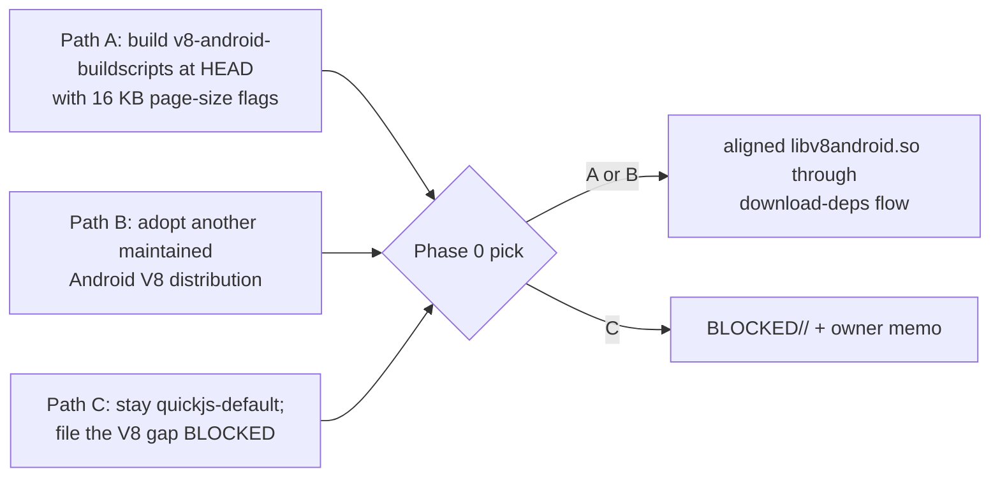

# PRD-221 — The Android V8 library is 16 KB-clean

**Status:** **BLOCKED** — 2026-08-25 — `requires-v8-source-toolchain`. See the [Phase 0 memo](../../../verification/prd-221-2026-08-25.md).
**Complexity:** +2 platform/toolchain, +1 external dependency decision = **3 → MEDIUM/HIGH,
strictly time-boxed**; ending `BLOCKED` with a named obstacle is a legitimate outcome.

## Context

Measured on 2026-08-24: every library this repository controls — runtime, SDL — is 16 KB-page
aligned, but **`libv8android.so` is 4 KB-only**, and its upstream (`Kudo/v8-android-buildscripts`)
has no release newer than `v11.1000.4` (2023) carrying 16 KB support. Google Play requires
16 KB alignment, so the V8 default cannot ride a store submission until this closes; the
quickjs flag ships no V8 and is a workaround, not a fix. Nobody owns the decision between the
three ways out, and an unowned blocker becomes a silent one.

## Solution

- **Decide before building.** Phase 0 produces a written comparison of the three paths and
  picks one; the pick is recorded even if the build then fails.
- **Time-boxed attempt.** One lane-night on the chosen path. Success = a 16 KB-aligned
  `libv8android.so` produced by the repository's own dependency flow; failure = a BLOCKED
  filing that names the exact failing step, so the next attempt starts past it.
- No renderer or JS-semantics change rides along; conformance parity numbers are the existing
  suite's, rerun, not reinterpreted.

**Data changes:** none.

## Integration Ledger

| # | New thing | Live caller | Replaces | Old path removed? | Negative control |
|---|-----------|-------------|----------|-------------------|------------------|
| 1 | 16 KB-aligned V8 artifact in the dependency flow (paths A/B) | `packages/runtime-native/scripts/download-deps.mjs` consumers; Android Gradle packaging | the stale 4 KB-only prebuilt | replaced in place | revert to the old `.so` → the alignment check goes red (paste both outputs) |
| 2 | Alignment proof step in the Android build check | whatever script verified runtime/SDL alignment on 2026-08-24, extended to V8 | manual one-off inspection | n/a | point the check at any 4 KB-aligned `.so` → it fails, naming the file |

## Phases

#### Phase 0: the decision memo (mandatory, do first)

- [ ] One page in `docs/verification/prd-221-<date>.md`: each path's effort estimate, risk,
      maintenance story (who patches the next V8?), licence check, and the recommended pick
      with reasons. Path C is chosen *only* with the owner's standing quickjs default as the
      recorded interim state.

#### Phase 1: execute the pick, time-boxed to ~half the night

- [ ] Path A: build at HEAD with 16 KB page-size NDK flags; Path B: integrate the candidate
      distribution through the same download-deps flow.
- [ ] Prove alignment with the same tooling that proved runtime/SDL clean
      (`llvm-objdump -p … \| grep LOAD`, load segment alignment `0x4000`), output pasted.
- [ ] Boot the emulator once on the rebuilt host and rerun the V8 conformance row from the
      2026-08-17 attempt (dialog-dismissed, clean run) — green means the artifact behaves.

#### Phase 2: land or file honestly

- [ ] On success: the artifact lands with its negative control (revert → alignment red).
- [ ] On failure: `git mv` this PRD to `docs/PRDs/BLOCKED/<named-reason>/` with the memo and
      the exact failing command attached; the owner memo names what would change the answer.

## Acceptance criteria

1. **Either** a 16 KB-aligned `libv8android.so` flows from the repo's own dependency flow with
   the alignment check gating it (red-green pasted), **or** the PRD sits in `BLOCKED/` under a
   reason folder whose name is the concrete obstacle, with the Phase 0 memo attached.
2. **No unowned interim state:** whichever way it ends, the record states what the Android V8
   default is *today* and what store submission may claim.
3. **House gates stay green** on any landed change.
