# PRD-057 — Native audio parity

**Status:** BLOCKED — implementation review cap reached after two reviews; physical audible
output is also unverified. The isolated lane is committed at `f9e9e95` with manager gates, but
five new defects require a specification reopen before another repair. See the lane review
packet and verification evidence in the execution worktree.

**Owner:** Native audio lane.

**Depends on:** PRD-054 for the fail-closed same-source parity report and PRD-056 for
physical Android/iOS selection, signed install-to-device execution, and physical-device
evidence envelopes.

**Planning boundary:** STOP after this document. Authoring this PRD does not authorize code
changes, device runs, workflow dispatches, signing, publication, promotion, or delivery. A
manager must explicitly confirm execution under the Linchpin coordinator.

**Problem:** The native host can emit audio graph markers through SDL's dummy driver, but a
consumer cannot yet rely on decoded assets, sample-correct playback, lifecycle behavior,
timely `onended`, positional output, or audible speakers across the claimed targets.

**Outcome:** The generated starter's existing `AudioBus` and `pickup.ogg` become the
production subject for a bounded Web Audio subset with deterministic buffer tests,
fail-loud exclusions, lifecycle routing, and separately labelled virtual-driver and physical
audible-output evidence.

**Blast radius: 25 implementation files across 3 packages and 2 repository-level areas.**

**Complexity: 8 → HIGH mode.**

The score is +3 for more than ten files, +2 for audio-thread/main-thread lifecycle and
completion state, +2 for changes spanning runtime-native, core, and a generated consumer,
and +1 for physical audio-device integration. HIGH mode requires an automated checkpoint
after every phase and manual evidence for every real-output target.

## Integration Ledger

| # | New thing | Live caller (`file:line`, non-test) | Replaces | Old path removed? | Negative control |
|---|-----------|-------------------------------------|----------|-------------------|------------------|
| 1 | Native WAV/Ogg decoder and sample-rate-correct `AudioBuffer` playback | `packages/runtime-native/src/audio/audio_bindings.cpp:486` calls the decoder; `packages/create-threenative/templates/starter/src/scenes/Play.ts:57,136` loads and plays the real Ogg asset | WAV-only `SDL_LoadWAV_IO` path that returns `undefined` on failure | same `decodeAudioFile` seam becomes strict; no parallel decoder | corrupt Ogg, unsupported MP3, and a deleted codec lock each make the decode gate exit nonzero |
| 2 | Promise-correct bounded Web Audio surface | `packages/runtime-native/src/runtime.cpp:498-501` installs `AudioContext` into every SDL-backed host | synchronous `decodeAudioData` plus stale string `state` and non-Promise lifecycle calls | old binding methods are replaced in Phase 2 | a forced synchronous return and a swallowed decode error make the binding contract exit nonzero |
| 3 | Sample-accurate source, panner, and exactly-once `onended` semantics consumed by `AudioBus` | `packages/core/src/audio.ts:83-100,137-152` creates positional voices and releases them on `onended`; starter caller is `packages/create-threenative/templates/starter/src/scenes/Play.ts:56-57,136` | marker-only 256-frame smoke with no decode or output-content assertion | smoke delegates to the same decoder/mixer and starter asset | early `onended`, duplicate `onended`, swapped channels, or a one-quantum scheduling shift makes the contract exit nonzero |
| 4 | SDL lifecycle/interruption routing for every live `AudioContext` | `packages/runtime-native/src/runtime.cpp:816-845` calls `platform::pollEvents()` and then main-thread audio event dispatch; `packages/runtime-native/src/platform/window.cpp:139-193` owns SDL event routing | no audio handling for background, foreground, or device removal | n/a, new behavior at the existing event switch | background without suspension, foreground without conditional resume, and unplug without a blocked/recovered state each exit nonzero |
| 5 | Audio evidence inside the PRD-054 parity verdict | root `package.json:23` calls `packages/runtime-native/conformance/run-conformance.mjs`; registry row `packages/runtime-native/conformance/registry.json:825-835` is the incumbent audio row | row 94's constructor/gain marker, which proves neither decode nor rendered samples | row 94 is strengthened; no second parity runner | missing observations, dummy-driver evidence labelled audible, or a target row omitted from the matrix exits nonzero |
| 6 | Target-aware audible-output analyzer and evidence packet | `packages/runtime-native/package.json:41` is the existing package parity entry that Phase 5 extends to invoke the analyzer through the PRD-054 runner | manual claims based on graph markers | marker-only claims remain historical and cannot satisfy audible rows | silence, channel swap, clipped capture, excess onset latency, or emulator-as-hardware input exits nonzero |

## 1. Context

### Evidence baseline

| Evidence identity | What actually ran | Audio credit allowed by this PRD |
|---|---|---|
| Dirty worktree on 2026-08-09 | Linux V8/Dawn/SDL dummy-driver graph and Android x86_64 emulator graph reached `AudioBus.voices === 0` after `onended` | graph/binding evidence only; it is uncommitted worktree evidence and proves no decoder, speaker, latency, HRTF, arm64, iOS, or physical driver |
| Committed HEAD `cb754d9` | Repository identity and release tag baseline | no new audio pass may be inferred from dirty files or from a later local marker |
| Older CI SHA `e38439c` | hosted macOS, Windows, and iOS simulator core/physics execution | historical target execution only; those jobs did not run this audio contract and are not current-HEAD audio evidence |
| Hosted runner | can prove compile, deterministic render, logs, and virtual audio routing | cannot prove an audible speaker or physical output driver unless a named real output device and captured signal are present |
| Android emulator | x86_64 callback/graph marker exists in dirty evidence | virtual-device contract only; never arm64, speaker-quality, or phone-latency evidence |
| iOS simulator | older core/physics execution exists at `e38439c` | no audio execution is recorded; simulator output can close only the simulator contract row |
| Physical Android hardware | no qualifying audio run exists | BLOCKED until PRD-056 selects a non-emulator device and supplies a signed install/run envelope plus capture handoff |
| Physical iOS hardware | no qualifying audio run exists | BLOCKED until PRD-056 supplies a named device, valid signing/provisioning, install/run envelope, and capture handoff |
| Signed artifact | no signed physical-device audio artifact is evidenced | an ad hoc signed PRD-056 install proves only that device run; it is not a release claim |
| Published package | PRD-048 records published consumer distribution as open | this PRD does not publish and cannot label local tarballs as registry packages |
| Promoted consumer | none | PRD-057 DONE is a prerequisite for promotion, not proof that promotion happened |

### Current behavior

- The native decoder calls `SDL_LoadWAV_IO`, while the starter's production asset is Ogg
  Vorbis; the starter catches and discards that load/play failure.
- `decodeAudioData`, `resume`, `suspend`, and `close` do not provide the browser Promise/state
  contract, and failed decode returns `undefined` instead of rejecting.
- Programmatic buffers advance one source sample per output frame, so a buffer whose sample
  rate differs from the 44.1 kHz context has the wrong pitch and duration.
- The mixer has equal-power stereo positioning and main-thread `onended`, but only a
  synthetic constant buffer and dummy driver have exercised them.
- Window polling routes input and resize events but not app background/foreground or audio
  device loss/recovery into the audio subsystem.

### Incumbent census and ownership boundaries

- `AudioBus`, voice ownership, and the generated starter consumer already exist; this PRD
  repairs their native substrate rather than adding a second public audio API.
- PRD-054 remains the owner of report states, target orchestration, fail-closed row selection,
  and general host-shim parity. This PRD contributes audio observations and validation only.
- PRD-056 remains the owner of physical-device identity, signed install handoff, and physical
  Android/iOS execution. This PRD supplies the audio probe, capture requirements, and verdict.
- PRD-053 multitouch, PRD-055 HUD/text, PRD-046 physics, and PRD-048 CLI/distribution are
  consumed only as target/consumer prerequisites; none of their implementation is changed.

### Reachability

**Entry point:** A generated starter enters `Play`, loads `pickup.ogg`, creates `AudioBus`,
and plays the buffer when the player collects the pickup.

**Pre-existing caller edited:** The starter scene stops swallowing decode failure and emits
measured audio state; the native runtime keeps installing Web Audio at its existing startup
seam and processing completion at its existing event-loop seam.

**Registration/wiring:** PRD-054 row 94 and the supplemental audio report consume the same
bundle on web, desktop, Android, and iOS target executors. PRD-056 supplies physical device
identity and signed execution without moving audio logic into its lane.

**Full flow:** Player collects the starter pickup → `AudioBus.play()` starts the decoded Ogg
buffer → the native mixer renders it through the device → `onended` releases the voice → the
target report records rendered-buffer observations and, where physical output exists, a
captured audible signal.

**What this replaces:** The marker-only row and swallowed starter decode failure become one
strict consumer path. No public class, renderer, physics path, input path, HUD path, CLI, or
distribution implementation is replaced.

## 2. Project Structure

```mermaid
flowchart TD
    root["threejs-webgpu/"]
    workflow[".github/workflows/native-platforms.yml<br/>hosted deterministic/simulator audio lanes"]
    package["package.json<br/>root parity command"]
    artifacts["artifacts/<br/>generated conformance and audio evidence"]
    docs["docs/<br/>architecture/CHARTER.md"]
    prds["PRDs/<br/>PRD-053 · PRD-054 · PRD-055<br/>native: PRD-046 · PRD-048 · README.md<br/>production-readiness: PRD-056 · PRD-057"]
    verification["verification/<br/>PRD-014.md · PRD-057.md"]
    core["packages/core/<br/>src/audio.ts · __tests__/audio.spec.ts"]
    starter["create-threenative/templates/starter/<br/>public/pickup.ogg · src/scenes/Play.ts"]
    playtest["packages/playtest/dist/runner/cli.js"]
    runtime["packages/runtime-native/<br/>CMakeLists.txt · package.json · artifacts · build · third_party"]
    conformance["conformance/<br/>README.md · registry.json · run-conformance.mjs<br/>scenes/shared/audio-context.js"]
    runtimeDocs["docs/G4-threading-native-systems.md"]
    include["include/mystral/audio/audio_context.h"]
    scripts["scripts/<br/>download-deps.mjs · verify-ios-simulator.mjs<br/>verify-audio-output.mjs"]
    source["src/<br/>audio/audio_bindings.cpp · audio_context.cpp<br/>platform/window.cpp · runtime.cpp"]
    tests["tests/<br/>audio.playtest.json · audio-play-at-smoke.ts<br/>audio-output-probe.ts · audio-output-verifier.test.mjs<br/>audio_graph_test.cpp · conformance-runner.test.mjs"]

    root --> workflow
    root --> package
    root --> artifacts
    root --> docs
    root --> core
    root --> starter
    root --> playtest
    root --> runtime
    docs --> prds
    docs --> verification
    runtime --> conformance
    runtime --> runtimeDocs
    runtime --> include
    runtime --> scripts
    runtime --> source
    runtime --> tests
```

## 3. Solution

### Approach

1. Keep the existing SDL mixer and Web Audio names. Add only the decoder/resampler and state
   semantics necessary for the already-public `AudioBus` and upstream Three.js audio classes.
2. Make the first proof subject the generated starter's real Ogg pickup, then use generated
   impulse/tone buffers for exact sample, scheduling, channel, and panner assertions.
3. Extend PRD-054's report with audio observations; a missing observation, unsupported format,
   dead callback, or wrong evidence tier is `fail`/`blocked`, never a skipped pass.
4. Separate deterministic output-buffer proof from audible physical-output proof. Emulator,
   simulator, dummy driver, and hosted virtual sinks cannot satisfy a speaker row.
5. Consume PRD-056's physical target envelope. The app never records microphone input; an
   operator-provided loopback or external capture is evidence equipment, not a product API.

### Bounded Web Audio contract

| Surface | Required semantics |
|---|---|
| `AudioContext` lifecycle | `resume()`, `suspend()`, and `close()` return Promises; `state` is a live getter; `statechange` is emitted once per real transition |
| `decodeAudioData` | returns a Promise, supports success and optional legacy callbacks used by Three.js, copies input bytes before asynchronous completion, and rejects rather than returning `undefined` |
| `AudioBuffer` | mono/stereo channel data, finite sample rate, duration `length / sampleRate`, and source playback resampled to context time without changing pitch/duration |
| `AudioBufferSourceNode` | honors `when`, `offset`, `duration`, loop bounds, and stop time in output-sample time; invalid or repeated starts throw instead of no-oping |
| `GainNode` | finite gain and scheduled/linear/target automation sampled per output frame |
| `PannerNode` | listener-relative equal-power stereo plus inverse/linear/exponential distance; position/listener changes affect the next render quantum |
| `onended` | fires exactly once on the JavaScript main thread after the final rendered sample or explicit stop, never for a still-looping source |
| HRTF/cones | not implemented in this PRD; assigning `panningModel = "HRTF"` or a non-default directional cone throws `NotSupportedError` with a stable diagnostic |

### Supported format matrix

| Input | Channels/rates | Required result |
|---|---|---|
| WAV PCM16 | mono and stereo; 44.1 and 48 kHz | decode PASS; sample count, duration, channel samples, and resampled render hash match the fixture |
| WAV float32 | mono and stereo; 44.1 and 48 kHz | decode PASS with finite normalized samples and the same duration tolerance |
| Ogg Vorbis | mono and stereo; 44.1 and 48 kHz | decode PASS; the starter's mono 44.1 kHz `pickup.ogg` is mandatory |
| corrupt/truncated/empty bytes | any | Promise rejects `EncodingError`; no buffer or success callback |
| MP3, FLAC, more than two channels | any | Promise rejects `NotSupportedError` and includes the detected format/channel count; never silent fallback |

The matrix is deliberately smaller than browser codec support. A format outside it is an
explicit exclusion, not native support. Adding another codec later needs evidence and must not
grow a second audio engine.

### Deterministic and physical evidence

The deterministic report contains target, host/engine, context sample rate, decoded format,
channel count, source-frame count, rendered-frame count, first/last nonzero frame, per-channel
SHA-256, panner energy, scheduled start/stop frames, `onended` count/thread, lifecycle
transitions, driver name, and whether the driver is virtual.

An audible capture passes only when all are true: signal RMS is at least 15 dB above the
captured pre-roll noise floor; normalized correlation with the known probe is at least 0.90;
left/right sweep separation is at least 6 dB in the expected halves; duration is within 30 ms;
no silence gap exceeds 20 ms; clipped samples are at most 0.1%; and onset from the emitted
stimulus marker is at most 250 ms on desktop or 350 ms on physical mobile. A missing capture
is BLOCKED. Silence or a malformed capture is FAIL.

### Data Changes

No database or public scene schema changes. PRD-054's report gains a versioned
`supplemental.audio` object containing the deterministic observation, evidence tier, capture
metrics where applicable, target identity, artifact/source hashes, and `pass | fail | blocked`.
The report validator rejects unknown keys, non-finite metrics, missing target rows, and a
physical claim whose target identity says emulator/simulator/virtual driver.

### Error handling

- Stable prefixes: `TN_AUDIO_DECODE_UNSUPPORTED`, `TN_AUDIO_DECODE_FAILED`,
  `TN_AUDIO_DEVICE_UNAVAILABLE`, `TN_AUDIO_INTERRUPTED`, `TN_AUDIO_EVIDENCE_MISSING`, and
  `TN_AUDIO_PHYSICAL_DEVICE_REQUIRED`.
- Unsupported API/format input rejects or throws at the public call. Logging and returning
  `undefined` is forbidden.
- Device loss moves contexts to `suspended`, records the reason, and attempts bounded recovery
  only after an add/foreground event. It never fabricates continuing playback.
- Audio-thread code performs no allocation, JS call, logging, or unbounded work. JS callbacks
  remain queued to the existing main-thread event loop.

## 4. Execution Phases

### Phase 1: Real asset decode and deterministic buffer timing — The starter's Ogg asset decodes and renders at the correct duration through the existing mixer.

**Proof subject:** the generated starter's mono 44.1 kHz `pickup.ogg`, followed by mono/stereo
WAV and Ogg fixtures generated in the native contract test. This closes the actual consumer
before convenience formats.

**Files (5):**

- `packages/runtime-native/scripts/download-deps.mjs` - EDIT: acquire the bounded Ogg decoder at a pinned version and expected digest into untracked dependency storage.
- `packages/runtime-native/CMakeLists.txt` - EDIT: compile the decoder into the existing runtime and audio contract target without a new library/package surface.
- `packages/runtime-native/include/mystral/audio/audio_context.h` - EDIT: declare fractional source position, resampling, strict decode result, and supported-format metadata.
- `packages/runtime-native/src/audio/audio_context.cpp` - EDIT: decode WAV/Ogg, resample buffer time to context time, validate inputs, and emit strict failures.
- `packages/runtime-native/tests/audio_graph_test.cpp` - EDIT: assert fixture samples, render hashes, scheduling frames, channel order, looping, stop, and unsupported-format failures.

**Implementation:**

- [ ] Preserve `AudioBuffer.sampleRate`, `length`, channel data, and duration; render with a
  fractional phase so 48 kHz input lasts the same wall time in a 44.1 kHz context.
- [ ] Decode the complete supported-format matrix and the shipped starter Ogg; do not infer a
  format from the extension alone.
- [ ] Reject invalid channel counts, sample rates, sizes, corrupt bytes, and unsupported codecs
  with stable diagnostics before registering a source.
- [ ] Keep downloaded codec source untracked and retain the repository's `third_party/` hard
  invariant.

**Wiring (the phase is not done without this):**

- [ ] Caller edited: `packages/runtime-native/src/audio/audio_context.cpp:452-453` keeps the
  one decode seam consumed by bindings.
- [ ] Registration: existing runtime target includes the decoder; no new package or public
  native loader exists.
- [ ] Old path: the WAV-only function becomes the strict dispatcher; there is no second decode
  implementation.
- [ ] Ledger rows filled: #1 and #3.

**Tests Required:**

| Gate | Test File | Test Name | Assertion | Negative control (must be observed red) |
|---|---|---|---|---|
| `audio-buffer-contract` | `packages/runtime-native/tests/audio_graph_test.cpp` | `should preserve pitch and duration when source and context sample rates differ` | exact first/last nonzero frame and per-channel hash for 44.1↔48 kHz render | `--control shift-one-quantum` changes the start frame and exits 1 |
| `decode-matrix` | `packages/runtime-native/tests/audio_graph_test.cpp` | `should decode the supported matrix and reject every unsupported or corrupt subject` | channels, rate, frames, duration, samples, and error code equal the table for every subject including starter Ogg | `--control swallow-decode-error` resolves corrupt bytes and exits 1 |

**Revert check:** Restoring `SDL_LoadWAV_IO`-only behavior makes the starter Ogg row and Ogg
matrix fail before any graph marker.

**User Verification:** Run the native graph target with SDL's dummy driver. Expected: the
starter Ogg and all deterministic matrix assertions pass; the output states it is not audible
evidence.

### Phase 2: Browser-shaped Web Audio and live `AudioBus` consumer — Collecting the starter pickup uses decoded Ogg and releases exactly one voice.

**Files (5):**

- `packages/runtime-native/src/audio/audio_bindings.cpp` - EDIT: Promise/callback decode contract, live state/events, strict setters, and exactly-once completion dispatch.
- `packages/runtime-native/tests/audio-play-at-smoke.ts` - EDIT: fetch/decode the starter Ogg and exercise `AudioBus.play`, `playAt`, fade, and completion rather than only `createBuffer`.
- `packages/core/src/audio.ts` - EDIT: preserve prior `onended`, release stopped/ended voices once, and surface backend failures without swallowing them.
- `packages/core/__tests__/audio.spec.ts` - EDIT: assert consumer-visible Promise, error, queue, stop, panner exclusion, and completion semantics.
- `packages/create-threenative/templates/starter/src/scenes/Play.ts` - EDIT: load the pickup sound as part of the scene's declared assets and report decode/play failure instead of discarding it.

**Implementation:**

- [ ] Match the bounded browser contract table and support the callback form Three.js invokes.
- [ ] Keep JS object lifetimes protected through completion, then unprotect and remove each
  source exactly once.
- [ ] Make unsupported HRTF/cone use fail at assignment/configuration; keep equal-power as the
  portable default.
- [ ] Make starter load failure visible as `TN_AUDIO_DECODE_*`; do not make a missing user
  gesture a decode failure.

**Wiring (the phase is not done without this):**

- [ ] Caller edited: `packages/create-threenative/templates/starter/src/scenes/Play.ts:56-57,136`
  remains the real `AudioBus` consumer.
- [ ] Registration: `packages/runtime-native/src/runtime.cpp:498-501` continues installing the
  only host `AudioContext` binding.
- [ ] Old path: the synthetic smoke delegates to actual decoder/mixer behavior and no longer
  stands in for decode.
- [ ] Ledger rows filled: #1, #2, and #3.

**Tests Required:**

| Gate | Test File | Test Name | Assertion | Negative control (must be observed red) |
|---|---|---|---|---|
| `web-audio-contract` | `packages/core/__tests__/audio.spec.ts` | `should expose Promise lifecycle and reject unsupported native audio without a false state` | Promise settlement, live `state`, one `statechange`, and stable rejection code | `TN_AUDIO_CONTROL=sync-decode` makes the Promise assertion exit 1 |
| `audiobus-consumer` | `packages/runtime-native/tests/audio-play-at-smoke.ts` | `should play the starter pickup and release one voice after the final sample` | decoded duration is finite, voices move 0→1→0, and `onended` count is exactly 1 after the final rendered frame | `TN_AUDIO_CONTROL=early-ended` fires before the final frame and exits 1 |

**Revert check:** Restoring the starter's `.catch(() => undefined)` or the direct-buffer smoke
makes the consumer gate fail because no successful decoded-asset observation exists.

**User Verification:** Collect the starter pickup on web and native. Expected: one pickup
sound is scheduled, the score changes, the voice count returns to zero, and an unsupported
format reports its diagnostic instead of silently continuing.

### Phase 3: Fail-closed parity report — One parity row distinguishes buffer correctness, virtual-driver execution, and audible output.

**Files (5):**

- `packages/runtime-native/conformance/registry.json` - EDIT: strengthen row 94 with required audio observation fields and target-tier policy.
- `packages/runtime-native/conformance/scenes/shared/audio-context.js` - EDIT: execute decode, buffer timing, panner, unsupported cases, lifecycle state, and completion from one source.
- `packages/runtime-native/conformance/run-conformance.mjs` - EDIT: collect and validate `supplemental.audio`, preserve blocked rows, and choose exit 0/1/2 fail-closed.
- `packages/runtime-native/tests/conformance-runner.test.mjs` - EDIT: cover missing/stale/malformed/tier-mislabeled audio evidence and target matrix completeness.
- `packages/runtime-native/conformance/README.md` - EDIT: document audio observation schema, status meanings, and commands.

**Implementation:**

- [ ] Hash the built bundle and audio asset in every report so a stale packaged sound cannot
  satisfy the gate.
- [ ] Require browser reference plus target observation; compare timing/sample metrics, not
  screenshot pixels.
- [ ] Label driver `dummy`, virtual, emulator, simulator, hosted-real-device, or physical and
  validate which acceptance rows it may satisfy.
- [ ] Keep PRD-054's report/exit vocabulary. Do not add an audio-only fourth verdict.

**Wiring (the phase is not done without this):**

- [ ] Caller edited: root `package.json:23` still reaches this report through `pnpm parity`.
- [ ] Registration: incumbent row `94-audio-context` is mandatory and supplies the audio
  supplemental object.
- [ ] Old path: constructor/gain-only row 94 is replaced in place.
- [ ] Ledger rows filled: #5.

**Tests Required:**

| Gate | Test File | Test Name | Assertion | Negative control (must be observed red) |
|---|---|---|---|---|
| `audio-parity-report` | `packages/runtime-native/tests/conformance-runner.test.mjs` | `should fail closed when any required audio observation is missing or mislabeled` | exact target rows, finite metrics, differing artifact identities, allowed evidence tier, and status/exit agreement | `--fixture audio-dummy-claimed-audible` exits 1 with `TN_AUDIO_EVIDENCE_MISSING` |
| `android-emulator-contract` | `packages/runtime-native/conformance/scenes/shared/audio-context.js` | `should execute decoded AudioBus timing on Android emulator without claiming a speaker` | x86_64 emulator has decoded/rendered hashes and exactly-once completion; `audible=false`, `physical=false` | `TN_AUDIO_CONTROL=omit-onended` makes Android target exit 1 |

**Revert check:** Running the strengthened row against the pre-change constructor/gain scene
exits nonzero because decode, rendered hash, completion, and tier fields are absent.

**User Verification:** Run row 94 on web, Linux desktop, and Android emulator. Expected: each
executed deterministic row passes or fails; audible fields remain blocked where no physical
capture exists.

### Phase 4: Lifecycle, interruption, and device recovery — Backgrounding suspends audio and foreground/device recovery resumes only previously running contexts.

**Files (5):**

- `packages/runtime-native/include/mystral/audio/audio_context.h` - EDIT: declare interruption reason/state, prior-running intent, device reopen, and lifecycle entry points.
- `packages/runtime-native/src/audio/audio_context.cpp` - EDIT: suspend/resume/reopen devices without audio-thread allocation or fabricated progress.
- `packages/runtime-native/src/audio/audio_bindings.cpp` - EDIT: reflect transitions to JS and dispatch `statechange`/completion on the main thread.
- `packages/runtime-native/src/platform/window.cpp` - EDIT: route SDL background, foreground, audio-device-removed, and audio-device-added events to the audio subsystem.
- `packages/runtime-native/tests/audio_graph_test.cpp` - EDIT: simulate transition sequences, scheduled source continuity, device loss, and failed recovery.

**Implementation:**

- [ ] On background/interruption, pause the stream, freeze context time/source position, and
  remember whether the context was running.
- [ ] On foreground, resume only a context that was running before interruption; a user-
  suspended or closed context stays suspended/closed.
- [ ] On output-device removal, suspend and record `TN_AUDIO_DEVICE_UNAVAILABLE`; on device add,
  reopen the default route and resume conditionally or remain fail-loudly suspended.
- [ ] Never fire `onended` because time spent backgrounded elapsed on wall clock.

**Wiring (the phase is not done without this):**

- [ ] Caller edited: `packages/runtime-native/src/platform/window.cpp:139-193` is the existing
  SDL event switch reached by `packages/runtime-native/src/runtime.cpp:816-845`.
- [ ] Registration: all live contexts are already held by the audio binding owner and receive
  lifecycle events through that owner.
- [ ] Old path: n/a; the event switch gains behavior rather than a second platform loop.
- [ ] Ledger rows filled: #3 and #4.

**Tests Required:**

| Gate | Test File | Test Name | Assertion | Negative control (must be observed red) |
|---|---|---|---|---|
| `lifecycle-interruption` | `packages/runtime-native/tests/audio_graph_test.cpp` | `should freeze source time while interrupted and conditionally recover the output device` | exact state sequence, unchanged source frame during suspension, no early `onended`, one state event per transition, and correct recovery/closed behavior | `--control advance-while-backgrounded` changes the source frame and exits 1 |
| `panner-onended-timing` | `packages/runtime-native/tests/audio_graph_test.cpp` | `should apply panner changes next quantum and dispatch onended once after final output` | left/right energy changes in the next quantum; completion frame and count are exact; callback is main-thread | `--control duplicate-ended` yields count 2 and exits 1 |

**Revert check:** Removing the SDL event cases makes the lifecycle sequence retain `running`
and advance samples during the simulated background interval, failing the pre-existing target
loop flow.

**User Verification:** Start a looping starter sound, background and foreground the app, then
disconnect/reconnect the selected output where the target supports it. Expected: no background
progress, no burst, one state transition per edge, and bounded recovery or a stable error.

### Phase 5: Audible-output analyzer — An operator can turn a captured output signal into a binary, target-labelled verdict.

**Files (5):**

- `packages/runtime-native/scripts/verify-audio-output.mjs` - NEW: validate target identity, capture WAV, marker timing, hashes, signal quality, and evidence tier; emit JSON and exit 0/1/2.
- `packages/runtime-native/tests/audio.playtest.json` - NEW: drive the probe through Android/iOS device transport and assert marker/order/completion observations.
- `packages/runtime-native/tests/audio-output-probe.ts` - NEW: same-source decoded pickup plus known left/right impulse, sweep, silence, and completion markers.
- `packages/runtime-native/tests/audio-output-verifier.test.mjs` - NEW: synthetic good/silent/swapped/clipped/late/malformed captures and emulator-as-hardware controls.
- `packages/runtime-native/package.json` - EDIT: expose the analyzer through the existing verification surface without adding a top-level CLI command.

**Implementation:**

- [ ] Generate a probe with identifiable pre-roll, left/right segments, the decoded starter
  pickup, and an end marker; record monotonic stimulus timestamps.
- [ ] Accept a capture produced by an OS loopback, cable, or external calibrated recorder and
  hash it before analysis.
- [ ] Require target kind, device/host identity, artifact/source SHA, driver/route, sample rate,
  and capture method. Refuse a physical claim from emulator/simulator/virtual driver.
- [ ] Keep capture acquisition outside the game runtime. No microphone permission or capture
  API is added to ThreeNative.

**Wiring (the phase is not done without this):**

- [ ] Caller edited: `packages/runtime-native/package.json:41` remains the package-level parity
  entry and calls the analyzer only when the target envelope supplies a capture.
- [ ] Registration: PRD-054 supplemental audio consumes analyzer JSON; PRD-056 supplies
  physical device/run metadata.
- [ ] Old path: graph markers remain diagnostic input but cannot set `audible=true`.
- [ ] Ledger rows filled: #6.

**Tests Required:**

| Gate | Test File | Test Name | Assertion | Negative control (must be observed red) |
|---|---|---|---|---|
| `audio-output-analyzer` | `packages/runtime-native/tests/audio-output-verifier.test.mjs` | `should accept only correlated timely unclipped stereo output from the declared tier` | all signal thresholds and target metadata equal the solution table; output JSON is complete and finite | `--fixture silence` exits 1; `--fixture emulator-claimed-physical` exits 1 |
| `audible-probe-source` | `packages/runtime-native/tests/audio-output-probe.ts` | `should emit deterministic segment and completion markers around real AudioBus playback` | marker order, source/artifact hashes, channel segment plan, and completion count equal 1 | `TN_AUDIO_CONTROL=swap-channel-plan` makes analyzer exit 1 |

**Revert check:** Removing the analyzer call leaves only graph markers; the parity report marks
every audible row BLOCKED and PRD-057 cannot become DONE.

**User Verification:** Provide a captured WAV and target envelope. Expected: good capture exits
0, bad signal exits 1, and missing external capture/device access exits 2 as BLOCKED.

### Phase 6: Execute virtual and physical target tiers — Every platform row reports PASS, FAIL, or BLOCKED without borrowing another tier's evidence.

**Files (5):**

- `.github/workflows/native-platforms.yml` - EDIT: run deterministic audio on macOS/Windows and iOS simulator; retain artifacts and label hosted/virtual output honestly.
- `packages/runtime-native/conformance/run-conformance.mjs` - EDIT: invoke target analyzer, consume PRD-056 physical envelopes, and aggregate every audio tier.
- `packages/runtime-native/tests/conformance-runner.test.mjs` - EDIT: assert complete Linux/Windows/macOS/Android-emulator/Android-physical/iOS-simulator/iOS-physical matrix behavior.
- `docs/verification/PRD-057.md` - NEW: record exact SHA, dirty/clean state, target kind, hardware/runner, artifact, command, pass/red evidence, and open blockers.
- `packages/runtime-native/docs/G4-threading-native-systems.md` - EDIT: point to the binding ledger and state only target rows actually executed.

**Implementation:**

- [ ] Run deterministic contracts on Linux, hosted Windows/macOS, Android emulator, and iOS
  simulator. Hosted virtual output cannot close physical audible rows.
- [ ] Run audible capture on a named real-output Linux, Windows, and macOS host.
- [ ] After PRD-056 is DONE for the selected devices, install its exact signed artifacts on a
  physical Android arm64 device and physical iOS device, then run background/foreground,
  interruption/route recovery, pickup Ogg, panner, completion, and audible capture.
- [ ] Record iOS simulator and physical iOS separately; record Android emulator and physical
  Android separately. A row not run remains BLOCKED with a resumable command.

**Wiring (the phase is not done without this):**

- [ ] Caller edited: root parity reaches the target aggregator; physical rows consume but do
  not modify PRD-056's envelope.
- [ ] Registration: path-filtered hosted jobs retain deterministic logs/reports; manual
  physical evidence is appended only after exact artifact/SHA validation.
- [ ] Old path: older `e38439c` target runs remain historical and cannot satisfy current
  audio rows.
- [ ] Ledger rows filled: #4, #5, and #6.

**Tests Required:**

| Gate | Test File | Test Name | Assertion | Negative control (must be observed red) |
|---|---|---|---|---|
| `desktop-audible-output` | `packages/runtime-native/tests/audio-output-verifier.test.mjs` | `should require independent real-output evidence for Linux Windows and macOS` | three distinct target identities and captures each meet the audible thresholds | replace any capture with silence; its target command exits 1 |
| `android-hardware-output` | `packages/runtime-native/tests/conformance-runner.test.mjs` | `should reject emulator evidence for the Android physical row` | non-emulator arm64 identity, signed artifact hash, lifecycle results, deterministic report, and capture all exist | pass `emulator-5554` to physical mode; exits 2 with `TN_AUDIO_PHYSICAL_DEVICE_REQUIRED` |
| `ios-simulator-contract` | `packages/runtime-native/tests/conformance-runner.test.mjs` | `should keep iOS simulator deterministic evidence separate from physical output` | simulator identity and deterministic audio pass; physical/audible flags remain false | remove simulator audio observation; exits 2 because the row is blocked |
| `ios-hardware-output` | `packages/runtime-native/tests/conformance-runner.test.mjs` | `should require a signed physical iOS run and captured output` | physical UDID class, signed artifact hash, lifecycle/interruption result, deterministic report, and capture all exist | pass a simulator UDID to physical mode; exits 2 with `TN_AUDIO_PHYSICAL_DEVICE_REQUIRED` |

**Revert check:** Deleting any target artifact or relabelling a virtual driver as physical
makes the aggregate exit nonzero; no earlier tier is promoted to fill the hole.

**User Verification:** Read the matrix. Expected: exactly eight rows—web reference, three
desktop OSes, Android emulator, Android physical, iOS simulator, iOS physical—with current
SHA/artifact identity and no inferred pass.

### Phase 7: Support truth and consumer cutover — Operators and consumers see the supported subset and every remaining blocker.

**Files (4):**

- `docs/PRDs/native/README.md` - EDIT: publish the exact audio support matrix beside existing native target truth.
- `packages/runtime-native/conformance/README.md` - EDIT: publish row 94 semantics, tier labels, thresholds, and commands.
- `docs/verification/PRD-057.md` - EDIT: finalize checkpoint packets, observed-red evidence, and binary acceptance audit.
- `packages/runtime-native/docs/G4-threading-native-systems.md` - EDIT: replace bounded smoke wording only for rows actually closed and retain every exclusion.

**Implementation:**

- [ ] Document supported codecs, channels/rates, equal-power panner, lifecycle semantics,
  HRTF/cone exclusion, capture thresholds, and target evidence date/SHA.
- [ ] State that PRD-057 does not sign a release, publish packages, or promote a consumer.
- [ ] Run the caller census, incumbent check, negative controls, budgets, and repository gates.
- [ ] Mark DONE only under the terminal semantics below; otherwise name the exact BLOCKED row
  and resumable command.

**Wiring (the phase is not done without this):**

- [ ] Caller edited: native README is the support matrix consumed by release planning; G4 is
  the binding subsystem evidence ledger.
- [ ] Registration: verification ledger links every target report and negative-control packet.
- [ ] Old path: no statement may retain “audio works” without its target/evidence tier.
- [ ] Ledger rows filled: #1 through #6 have real post-change caller lines and zero pending cells.

**Tests Required:**

| Gate | Test File | Test Name | Assertion | Negative control (must be observed red) |
|---|---|---|---|---|
| `support-matrix` | `packages/runtime-native/tests/conformance-runner.test.mjs` | `should reject a support claim whose evidence SHA target tier or artifact is absent` | every claimed cell resolves to a current evidence record and exclusions have an owner/reason | validate a fixture claiming physical output from simulator evidence; exits 1 |
| `repository-gates` | repository gate | `should retain default gates and native budget honesty` | typecheck, lint, tests, budgets, agent-doc check, and diff check pass; native LOC trigger is reported, not silenced | temporarily feed the gate a tracked `third_party` fixture; budgets exits nonzero |

**Revert check:** Removing the evidence link or reintroducing a broad target claim makes the
support-matrix check fail even if deterministic tests remain green.

**User Verification:** Open the native support matrix. Expected: consumers can tell exactly
which codec/API/target combination is supported, blocked, or excluded without reading this PRD.

## Negative Controls

These commands are specifications for implementation checkpoints. Each must be observed
nonzero and copied exactly into the review packet before its gate can pass.

| Gate | Negative control | Expected red | Exact command/result |
|---|---|---|---|
| `audio-buffer-contract` | shift scheduled output by one render quantum | graph contract exits nonzero and names the expected/actual start frame | `command: SDL_AUDIO_DRIVER=dummy packages/runtime-native/build/tn-linux/threenative-audio-graph-test --control shift-one-quantum`; result: RED observed: start frame differs by one quantum; exit: 1 |
| `decode-matrix` | make corrupt bytes resolve as a buffer | decoder gate exits nonzero with missing `EncodingError` | `command: SDL_AUDIO_DRIVER=dummy packages/runtime-native/build/tn-linux/threenative-audio-graph-test --control swallow-decode-error`; result: RED observed: corrupt Ogg resolved instead of rejecting; exit: 1 |
| `web-audio-contract` | return a decoded buffer synchronously | focused core test exits nonzero because no Promise is returned | `command: TN_AUDIO_CONTROL=sync-decode pnpm exec vitest run packages/core/__tests__/audio.spec.ts -t 'should expose Promise lifecycle and reject unsupported native audio without a false state'`; result: RED observed: decodeAudioData was synchronous; exit: 1 |
| `audiobus-consumer` | dispatch `onended` before the last rendered frame | smoke exits nonzero and retains an active/falsely ended voice observation | `command: TN_AUDIO_CONTROL=early-ended pnpm --filter @threenative/runtime-native exec tsx tests/audio-play-at-smoke.ts`; result: RED observed: onended preceded final rendered sample; exit: 1 |
| `audio-parity-report` | label SDL dummy-driver evidence audible | validator rejects the tier mismatch | `command: node packages/runtime-native/conformance/run-conformance.mjs --self-test-audio-control dummy-claimed-audible`; result: RED observed: virtual driver cannot satisfy audible output; exit: 1 |
| `android-emulator-contract` | suppress the completion callback | Android row reaches assertions and fails | `command: TN_AUDIO_CONTROL=omit-onended node packages/runtime-native/conformance/run-conformance.mjs --target android --device emulator-5554 --only-tests 94-audio-context --reference artifacts/conformance/web --out artifacts/conformance/android-audio-negative`; result: RED observed: required onended count 1 was absent; exit: 1 |
| `lifecycle-interruption` | advance source time while backgrounded | lifecycle contract exits nonzero on frame drift | `command: SDL_AUDIO_DRIVER=dummy packages/runtime-native/build/tn-linux/threenative-audio-graph-test --control advance-while-backgrounded`; result: RED observed: source advanced during suspended interval; exit: 1 |
| `panner-onended-timing` | enqueue completion twice | graph contract exits nonzero on callback count 2 | `command: SDL_AUDIO_DRIVER=dummy packages/runtime-native/build/tn-linux/threenative-audio-graph-test --control duplicate-ended`; result: RED observed: onended count was 2; exit: 1 |
| `audio-output-analyzer` | analyze a silent capture | analyzer exits nonzero on signal/noise and correlation | `command: node packages/runtime-native/scripts/verify-audio-output.mjs --fixture silence --target linux --evidence-tier physical-output`; result: RED observed: captured signal was silent; exit: 1 |
| `audible-probe-source` | swap the declared channel plan | analyzer exits nonzero on reversed energy halves | `command: TN_AUDIO_CONTROL=swap-channel-plan node packages/runtime-native/scripts/verify-audio-output.mjs --fixture known-good --target linux --evidence-tier physical-output`; result: RED observed: left and right segments were reversed; exit: 1 |
| `desktop-audible-output` | replace one desktop capture with silence | that OS row fails and aggregate exits nonzero | `command: node packages/runtime-native/scripts/verify-audio-output.mjs --fixture silence --target windows --evidence-tier physical-output`; result: RED observed: Windows audible capture failed correlation; exit: 1 |
| `android-hardware-output` | pass an emulator serial to the physical row | target is BLOCKED/nonzero, never pass | `command: node packages/runtime-native/conformance/run-conformance.mjs --target android-hardware --device emulator-5554 --only-tests 94-audio-context --out artifacts/conformance/android-hardware-audio-negative`; result: RED observed: TN_AUDIO_PHYSICAL_DEVICE_REQUIRED; exit: 2 |
| `ios-simulator-contract` | remove the simulator audio observation | simulator row is blocked and aggregate exits nonzero | `command: node packages/runtime-native/conformance/run-conformance.mjs --self-test-audio-control ios-simulator-audio-missing`; result: RED observed: iOS simulator audio observation is missing; exit: 2 |
| `ios-hardware-output` | pass a simulator identity to the physical iOS row | target is BLOCKED/nonzero, never pass | `command: node packages/runtime-native/scripts/verify-audio-output.mjs --fixture known-good --target ios --device-kind simulator --evidence-tier physical-output`; result: RED observed: TN_AUDIO_PHYSICAL_DEVICE_REQUIRED; exit: 2 |
| `support-matrix` | claim physical output using simulator evidence | support validator rejects the claim | `command: node packages/runtime-native/conformance/run-conformance.mjs --self-test-audio-control simulator-as-physical`; result: RED observed: support claim has the wrong evidence tier; exit: 1 |
| `repository-gates` | expose a tracked third-party codec fixture to the budget checker | hard invariant exits nonzero | `command: TN_BUDGET_CONTROL=tracked-third-party pnpm budgets`; result: RED observed: tracked runtime-native third_party file rejected; exit: 1 |

## 5. Migration / Cutover

| Owner | From | To | Criteria | Recovery | Rollback |
|---|---|---|---|---|---|
| PRD-057 decoder owner | WAV-only decode returning a direct buffer or `undefined` | Promise-based WAV/Ogg matrix with resampling and stable rejection | starter Ogg plus full format matrix and controls pass | leave the target row FAIL/BLOCKED, retain the prior documented exclusion, and resume at Phase 1 | revert decoder/binding together; restore explicit unsupported Ogg and remove any portable-audio claim—never restore swallowed errors |
| PRD-057 `AudioBus` owner | starter loads Ogg in a Promise whose rejection is discarded | scene load owns the decoded buffer and pickup playback emits measurable completion | pickup play is reached through the generated starter on every executed tier | keep starter native audio support BLOCKED and show `TN_AUDIO_DECODE_*` | revert starter consumer and core changes as one unit; no partial consumer using an unproved binding |
| PRD-057 lifecycle owner | SDL app/device events do not reach audio | existing platform event switch suspends, conditionally resumes, and recovers/reports device loss | transition sequence and real background/foreground evidence pass per target | leave context suspended with `TN_AUDIO_DEVICE_UNAVAILABLE`; user can retry after route return | remove lifecycle routing and mark mobile lifecycle unsupported; do not keep time advancement or auto-resume lies |
| PRD-054 parity owner consuming PRD-057 output | row 94 proves constructor/gain only | row 94 plus `supplemental.audio` proves deterministic contract and carries tiered output evidence | report schema/control tests pass and the old report fails validation | report the row BLOCKED with its missing observation; all other parity rows remain usable | revert schema and row atomically; restore old row as bounded smoke, not parity |
| PRD-056 physical execution owner consuming PRD-057 probe | physical target run has no audio payload | signed exact artifact runs the audio probe and returns identity/log/capture handles | non-emulator/non-simulator identity, artifact hash, lifecycle results, and capture handoff are complete | preserve PRD-056 run envelope and mark only audio BLOCKED; resume with the same device/artifact command | remove audio step from the device campaign and retain physical audio as open; do not relabel simulator evidence |
| Native support owner | G4 marker prose can be mistaken for broad support | target × API × codec × evidence-tier matrix links immutable reports | every claimed cell resolves to evidence at the named SHA and every exclusion has reason/owner | keep stale rows historical and current rows BLOCKED | revert support text to the last truthful narrower statement; never roll back evidence files to create a pass |

Cutover is phase-gated. The decoder may land without physical hardware, but no portable-audio
support claim cuts over until the consumer, parity schema, target matrix, and negative controls
all close. Published packages and promoted consumers remain owned by PRD-048/release work.

## 6. Verification Commands

Run from repository root unless the command explicitly selects a target. Commands requiring
hardware, signing, or external capture are BLOCKED until their named precondition exists.

| Purpose | Command | Binary expected result |
|---|---|---|
| Native deterministic build/test | `pnpm --filter @threenative/runtime-native native:build && cmake --build packages/runtime-native/build/tn-linux --target threenative-audio-graph-test && SDL_AUDIO_DRIVER=dummy packages/runtime-native/build/tn-linux/threenative-audio-graph-test` | exit 0; output labels dummy driver non-audible |
| Core consumer contract | `pnpm exec vitest run packages/core/__tests__/audio.spec.ts` | exit 0 with all named assertions collected |
| Native verifier contracts | `pnpm exec vitest run packages/runtime-native/tests/audio-output-verifier.test.mjs packages/runtime-native/tests/conformance-runner.test.mjs` | exit 0; malformed/tier controls are collected |
| Web reference | `pnpm parity --target web --only-tests 94-audio-context --out artifacts/conformance/web-audio` | exit 0 and complete deterministic audio observation |
| Linux desktop | `pnpm parity --target desktop --only-tests 94-audio-context --reference artifacts/conformance/web-audio --out artifacts/conformance/linux-audio` | exit 0 for deterministic row; audible row requires separate real capture |
| Android emulator | `node packages/runtime-native/conformance/run-conformance.mjs --target android --device "$ANDROID_SERIAL" --only-tests 94-audio-context --reference artifacts/conformance/web-audio --out artifacts/conformance/android-emulator-audio` | exit 0 for emulator contract; physical/audible flags false |
| Android physical via PRD-056 | `node packages/runtime-native/conformance/run-conformance.mjs --target android-hardware --device "$ANDROID_SERIAL" --only-tests 94-audio-context --reference artifacts/conformance/web-audio --out artifacts/conformance/android-physical-audio` | exit 0 only for non-emulator arm64 identity plus required audio evidence; missing device/capture exits 2 |
| iOS simulator | `node packages/runtime-native/scripts/verify-ios-simulator.mjs --audio` | exit 0 for simulator deterministic contract; no physical claim |
| iOS physical via PRD-056 | `node packages/playtest/dist/runner/cli.js packages/runtime-native/tests/audio.playtest.json --target ios --device "$IOS_UDID" --ios-transport device --artifacts artifacts/audio/ios-physical` | exit 0 only for signed physical-device run; simulator/missing signing exits 2 |
| Audible capture | `node packages/runtime-native/scripts/verify-audio-output.mjs --target "$TN_AUDIO_TARGET" --capture "$TN_AUDIO_CAPTURE" --markers "$TN_AUDIO_MARKERS" --evidence-tier physical-output --out artifacts/audio/output-report.json` | exit 0 only when every threshold passes; bad capture exits 1; missing external input exits 2 |
| Repository gate | `pnpm typecheck && pnpm lint && pnpm test && pnpm budgets && pnpm sync:agents --check` | exit 0; native LOC review trigger remains visible |
| Caller census | `rg -n "decodeAudioFile|supplemental\.audio|verify-audio-output|processAudioEvents|AudioBus" packages/runtime-native packages/core packages/create-threenative -g '!**/__tests__/**' -g '!**/tests/**'` | every ledger thing has a non-test caller beyond its definition |
| Incumbent check | `rg -n "catch\(\(\) => undefined\)|return g_jsEngine->newUndefined\(\).*decodeAudioData|SDL_LoadWAV_IO" packages/create-threenative/templates/starter/src/scenes/Play.ts packages/runtime-native/src/audio` | no swallowed starter error or fail-open decode; `SDL_LoadWAV_IO` appears only inside the strict format dispatcher |
| PRD contract | `"$LINCHPIN_PLUGIN_ROOT/scripts/linchpin.sh" contract docs/PRDs/production-readiness/PRD-057-native-audio-parity.md` | exit 0 |
| PRD whitespace | `git diff --check -- docs/PRDs/production-readiness/PRD-057-native-audio-parity.md` | exit 0 |

### Evidence packet required per target

Each packet records repository SHA, dirty/clean state, source and packaged bundle/audio hashes,
runtime/Three version, target kind, OS/device/runner, CPU ABI, physical versus virtual driver,
signed/unsigned artifact status, published/local package status, promoted/unpromoted consumer
status, exact command/exit, deterministic report, capture hash/metrics where required, logs,
and every observed-red control. A report from `e38439c` stays historical when the candidate is
`cb754d9` or later.

Contract conformance: prd_contract: v1

Implementation verification evidence at authoring time: UNVERIFIED — this is a plan and no
implementation, hardware, release, or publication command was run by the author lane.

## Acceptance Criteria

- [ ] The generated starter's unchanged `pickup.ogg` loads through `ctx.assets.audio`, plays
  through `AudioBus` on every executed target, and produces one post-final-sample `onended`
  that returns voices to zero.
- [ ] WAV PCM16, WAV float32, and Ogg Vorbis meet the exact channel/rate matrix; corrupt,
  MP3, FLAC, and more-than-stereo input reject with the specified error and never resolve
  `undefined` or a fake buffer.
- [ ] Programmatic and decoded buffers preserve duration/pitch across 44.1/48 kHz contexts;
  scheduled start/stop/offset/duration/loop and gain automation match exact rendered frames.
- [ ] Equal-power panner direction/distance and next-quantum timing pass; HRTF and non-default
  cones fail loudly and are documented rather than silently accepted.
- [ ] Background/foreground and device interruption freeze/resume the correct contexts,
  preserve source time, avoid burst/early completion, and recover or expose a stable error.
- [ ] Web, Linux, Windows, macOS, Android emulator, Android physical, iOS simulator, and iOS
  physical each have an explicit current-SHA PASS/FAIL/BLOCKED row; no tier borrows another.
- [ ] Real-output Linux, Windows, macOS, physical Android, and physical iOS captures meet all
  audible/latency/channel/dropout/clipping thresholds. Virtual/dummy/emulator/simulator output
  never satisfies those rows.
- [ ] PRD-054 aggregate validation fails on missing/malformed/stale/tier-mislabeled audio
  evidence and all Negative Controls have observed nonzero results copied into checkpoints.
- [ ] Caller census, revert check, incumbent check, typecheck, lint, test, budgets, agent-doc
  sync, and diff check pass; native LOC over the review trigger is quantified and justified.
- [ ] Support docs state exact codecs, API subset, HRTF/cone exclusion, platform tier, evidence
  SHA/date, and distinguish signed artifact, published package, and promoted consumer status.
- [ ] No package, public audio engine, native GLTF path, microphone API, recording permission,
  gameplay system, HUD, input implementation, physics implementation, release publication, or
  promotion is added by this PRD.

### Binary terminal semantics

**DONE** means every checkbox above is checked; Integration Ledger has zero pending/TBD cells;
all eight target rows exist; all required physical audible rows pass; every gate has observed-
red evidence; and the verification ledger names the exact source/artifact identity. DONE does
not mean signed release, published package, or promoted consumer.

**BLOCKED** means implementation that can run locally is complete but a named external input is
absent: PRD-056 not DONE, no qualifying physical device, Apple signing/provisioning absent,
real-output capture unavailable, or a required hosted runner unavailable. Record the exact row,
owner, preserved evidence, and resumable command. BLOCKED is nonzero and is never DONE.

**FAIL** means an executed assertion or physical-output threshold failed. A failed row cannot be
relabelled BLOCKED, weakened, or replaced by emulator/simulator/hosted evidence.

**UNVERIFIED** means a green run lacks its observed-red control, caller census, or exact artifact
identity. UNVERIFIED cannot satisfy acceptance.

## 7. Scope Limits

### In scope

- The existing native Web Audio subset required by upstream Three.js `Audio`,
  `PositionalAudio`, `AudioListener`, `AudioLoader`, and ThreeNative `AudioBus`.
- Deterministic decode/buffer/resampling/scheduling/gain/panner/completion semantics.
- WAV/Ogg support matrix and explicit unsupported/corrupt failures.
- SDL-backed lifecycle, output interruption/device loss, and bounded recovery.
- Target-aware deterministic and audible evidence, consuming PRD-054 and PRD-056.

### Anti-scope

- No new audio engine, package, mixer vocabulary, AudioWorklet, synthesizer, bus/ducking system,
  effects graph, streaming music engine, or custom spatial-audio/HRTF implementation.
- No microphone capture, recording API, permission, voice chat, speech input, or app-owned
  acoustic measurement. External capture equipment is test evidence only.
- No generated HUD/text, multitouch implementation, physics behavior, CLI/distribution rewrite,
  signing credential creation, package publication, release promotion, or store submission.
- No claim that every browser codec/Web Audio node is supported. Unsupported surfaces fail
  loudly and remain in the matrix.
- No performance optimization beyond correctness/latency floors; broader frame, thermal,
  battery, and profiling policy remains outside this PRD.

## 8. Rollback / Kill Conditions

- Kill a codec path if it requires a second runtime audio engine, tracked `third_party/`, a new
  workspace package, or source compilation by consumers. Keep the format unsupported and loud.
- Roll back buffer/resampler changes if the starter or exact render hashes diverge on web, or
  if the audio callback allocates, logs, calls JS, or performs unbounded decode work.
- Kill HRTF/cone implementation attempts in this PRD. The accepted result is a stable
  `NotSupportedError`, not an unmeasured approximation labelled HRTF.
- Roll back lifecycle auto-resume if a user-suspended/closed context resumes, background time
  advances, a burst occurs, or `onended` fires early/duplicate.
- Delete any evidence adapter that can label dummy/virtual/emulator/simulator output audible,
  accept a missing capture, reuse a stale artifact, or manufacture a literal `pass`.
- If native audio additions cannot justify the native LOC increase against the Charter's
  50,000-line review trigger and the consumer/revert checks, delete them and retain an explicit
  unsupported target rather than routing around the budget.
- If three repair attempts fail on the same physical driver/lifecycle assumption, stop, name
  the doubtful assumption and target, preserve the failed evidence, and mark that row BLOCKED
  or FAIL. Do not continue changing thresholds.

## Checkpoint Protocol

After each phase, the worker stops and gives the manager one evidence packet. The manager owns
the single independent read-only review specified by Linchpin; the author/worker does not spawn
or chain it.

### Automated checkpoint after every phase

1. Run every phase test command and record command, exit code, collected test names/count, and
   raw relevant output.
2. Run each gate's exact Negative Controls command and record the specified nonzero result.
   A green-only gate is UNVERIFIED.
3. Run caller census, revert check, and incumbent check. Paste actual non-test `file:line`
   callers into the Integration Ledger; a pending/TBD caller fails the phase.
4. Run typecheck, lint, relevant package tests, budgets, agent-doc check, and diff check. Report
   the native LOC number and review-trigger delta without hiding it.
5. Update the verification ledger with exact SHA/worktree state, target/evidence tier, source
   and artifact hashes, and remaining blockers. Do not edit target status based on intent.

### Manual checkpoint for external/physical phases

| Phase | Owner | Exact action | Expected result | Confirmation required |
|---|---|---|---|---|
| 5 | Audio evidence operator | capture the known probe from a named real output route and run the analyzer | thresholds pass with capture/marker hashes and target identity | operator confirms route/capture method; reviewer confirms analyzer did not consume its own expected bytes |
| 6 desktop | platform operator | run exact candidate artifact on real-output Linux, Windows, and macOS hosts | three independent audible PASS packets | platform owner confirms host/driver; hosted virtual sink is insufficient |
| 6 Android | PRD-056 owner + audio operator | install exact signed artifact on named physical arm64 device, run lifecycle/interruption/probe, capture output | physical Android deterministic and audible rows PASS | non-emulator identity, signing/artifact hash, device route, and capture confirmed |
| 6 iOS | PRD-056 owner + audio operator | install exact signed artifact on named physical iOS device, run lifecycle/interruption/probe, capture output | physical iOS deterministic and audible rows PASS | physical UDID class, provisioning/artifact hash, route, and capture confirmed |

### Delivery blocker

Delivery is blocked when any required target is absent, any physical row uses virtual evidence,
any gate lacks observed-red evidence, any caller is test-only, the starter Ogg is not the first
consumer subject, the support matrix overclaims a target/API/codec, or a required repository
gate is red. The resumable command and external owner must be written beside the blocker.

### Final checkpoint

The final review compares this artifact verbatim against the Integration Ledger, Negative
Controls, Acceptance Criteria, and terminal semantics. Only all checked binary criteria may
produce DONE. Creator output stops at planning; execution begins only after explicit manager
confirmation.
