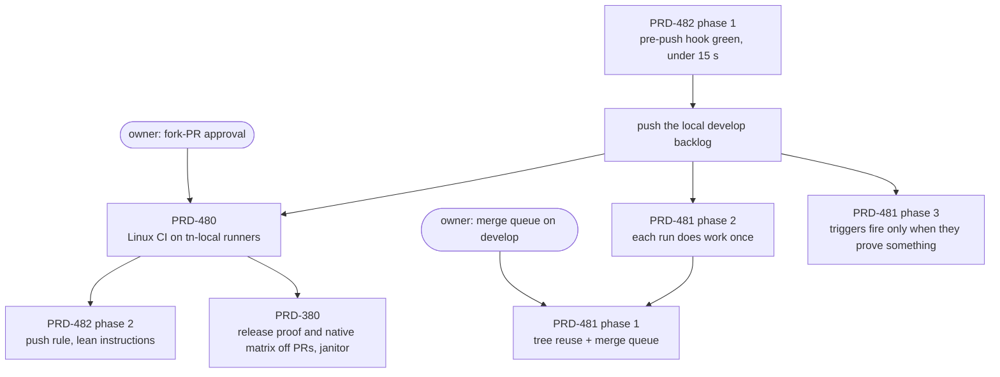

# CI PRDs — execution order

Updated 2026-10-02. Goal: CI fast and reliable, with as much of the work as possible on the owner's
machine.

Baseline, measured over 2026-09-18 to 10-02: 115.5k runner-min, about 58k a week. On run 37043413533,
jobs spent 239 min waiting for a runner against 146 min of work. The full audit is in
[PRD-481](PRD-481-ci-does-each-piece-of-work-once.md).

## Order

| # | Work | State (2026-10-03) | Blocked on |
|---|---|---|---|
| 1 | [PRD-482](../tooling/PRD-482-the-local-agent-loop-costs-only-what-it-catches.md) phase 1 | Done in #403: hook green, 9 s | — |
| 2 | [PRD-480](PRD-480-linux-ci-runs-on-the-owner-machine.md) phases 1–2 | Done in #404: AC-1 green, run 37070815769 (33 jobs on `tn-local`, 5 on the light lane) | — |
| 2 | PRD-481 phases 2–3 | Merged (#405): dist built once, shards under 6 min, one `integration.yml` | native cache box: `develop` must warm the new key |
| 3 | PRD-481 phase 1 | Merged (#405): reuse only for an identical tree whose validation profile covers this run; merge queue on | live reuse and merge-group proofs |
| 3 | [PRD-380](PRD-380-a-pull-request-never-starves-the-runner-pool.md) phases 1 and 3 | #406 in the merge queue | phase 2 (reduced PR native matrix) not started |
| 3 | PRD-480 phase 3 | In #404: Linux native legs routed; the Android emulator stays hosted (CPU-bound SwiftShader overran its 45 min) | a green `native-platforms` run |
| 4 | PRD-482 phase 2 | Done in #403: push rule, ponytail once per session, playtest AGENTS.md 1,113 words | — |
| 5 | Flaky template lanes | NEW. `tower-defense` (SwiftShader `DEVICE_LOST`, timeouts) and `rain` (`CAPTURE_PROVENANCE_MISSING`) fail about half the time on hosted and local. They have bounced the merge queue three times. Needs a fix in the template or the playtest bridge, not a quarantine | an owner for the lane |

Each PRD's 7-day runner-minute acceptance (PRD-380, 481, 482 AC-1) can only be measured a week after its phases land.
PRD-480 AC-2 (summed queue wait < 60 min) is measured and not met: 317 min, with 42 min wall against 39 hosted.
It needs an owner call: more slots, or overflow part of the board to hosted runners.

Rows with the same number can run as parallel lanes. Before parallel lanes edit `ci.yml`, they agree on
which jobs each one touches.

## Owner actions

- ~~**Runner token**~~ — done 2026-10-02; it lives in the operator's untracked runner env file, never
  in the repository.
- ~~**Fork-PR approval**~~ — done 2026-10-02: `all_external_contributors`, applied with the owner's approval.
- **Merge queue:** the owner approved enabling it on `develop` (2026-10-02). It waits until `ci.yml`'s
  `merge_group` trigger is on `develop`, since the ruleset requires `ci-required` and a queue whose
  check never reports stalls every merge. Start with a build concurrency of 2 and raise it only on measured
  queue time.

## Working this file as a goal

- **Done when:** PRD-380, PRD-480, PRD-481 and PRD-482 are all in `docs/PRDs/done/`, each with its
  acceptance boxes ticked from real runs.
- **Pick work:** take the lowest-numbered row whose blocker is clear. When a row is blocked on an owner
  action, record that under the PRD's `## Blocked on`, move on to the next independent row, and ask the
  owner once.
- **Rules:** one draft PR per PRD, branched from `origin/develop` (root `AGENTS.md`). Tick a box only on
  a green proof. Update this table's sizes and blockers as rows land.

## Review by Astra (2026-10-02), adopted

- **Same tree is not same validation.** A reduced PR matrix (PRD-380 phase 2) passing on tree T must not
  satisfy a promotion PR on T, whose full native matrix never ran. PRD-481's reuse now needs an identical
  tree *and* a source run whose validation profile covers the current one: the full board, every
  currently required check and matrix leg passed, the same target tier and the same runner profile.
  Tests prove that a reduced pass cannot satisfy a promotion, and that a profile change refuses reuse.
- **Light lane.** `scope`, `ci-required` and the summaries get a reserved runner (PRD-480), so a join never
  queues behind a 20-minute build.
- **Build once before reusing verdicts.** PRD-481 phase 2 (artifact sharing, cache warming, shards) runs
  ahead of phase 1. That was already the order.
- **Not now:** narrower affected-check selection (a follow-up PRD, once the planner's exemptions are
  proven one at a time), a remote compiler cache, more machines, Nx/Bazel/ARC. Measure first.

## Triage of the older CI PRDs (2026-10-02)

| PRD | Verdict | Action taken |
|---|---|---|
| PRD-303 CI closes its regression doors | Done by other work. All five doors are closed on `develop`, though no box was ever ticked | Moved to [`done/PRD-303.md`](../done/PRD-303.md) with a superseded note; its cache-key item went to PRD-481 phase 2 |
| PRD-364 remove gate bloat | Junk. A stale draft copy that a merge (`e8ee4770f`) brought back; the real one is COMPLETE in [`done/`](../done/PRD-364-remove-development-gate-bloat.md) (PRs #129 and #131) | Deleted the `CI/` copy and repointed its one inbound link |
| PRD-379 native release follows CI completion | Finished. Its last phase was observed on `main`: CI 36134527157 → native-release 36140281930 and 36142531873, `gates` 39 s | Ticked with that evidence and moved to [`done/`](../done/PRD-379-native-release-follows-ci-completion.md) |
| PRD-380 a PR never starves the runner pool | Still valid: 12.0k runner-min per 14 days | Reshaped to current PRD rules (3 phases, a proof on every box); runs after PRD-480 |
