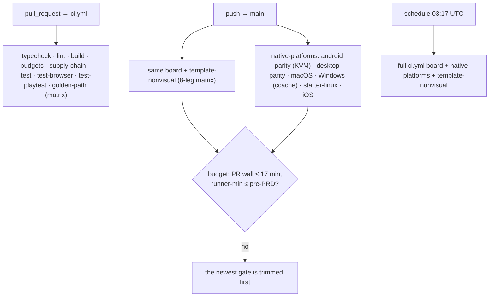

# PRD-303 — CI closes its regression doors, and pays for the added coverage from measured minutes

**Status:** OPEN, filed 2026-08-31 against `1c2f1550`. Planning only. Every number in §1 is a read
of the workflow files or of two GitHub Actions runs of that same day — `33440190780` (green `ci.yml`
push run on `main`) and `33440190473` (`native-platforms`, red per PRD-295). No workflow was edited
while gathering them.

**Outcome:** a regression in a template's scenario, in a desktop conformance row, in a dependency
manifest, or in anything that only nightly frequency can catch, is **red on CI instead of
invisible** — and the added coverage is paid for from measured waste in the existing board, so the
PR wall clock does not grow. Today the board answers "does main work on a Linux runner with no GPU"
thoroughly, and is structurally blind to five classes of regression named below.

**Depends on:** nothing. Every job it edits is live today; `scripts/non-visual-scenarios.mjs`,
`scripts/verify-template-playtests.ts`, `packages/runtime-native/conformance/run-conformance.mjs`
and `check-lane-blocks.mjs` already exist.

**Unblocks:** the required-check promotion of `native-platforms` in
[PRD-295](../native/PRD-295-the-native-platform-lane-has-never-been-green.md) — this PRD leaves
that lane advisory but adds the desktop-parity leg and the nightly that make its promotion
meaningful once PRD-295 lands. Also the future canary channel deferred by
PRD-302 (the release-candidate channel, drafted but not yet filed): a `schedule:` lane is a
prerequisite shape it already anticipated.

**Complexity: 6 → HIGH mode.** +1 (5+ files), +2 (tooling across the whole CI surface: two
workflows plus a new composite action), +1 (an unattended scheduled lane), +1 (a wall-clock budget
that must not regress — the constraint is a measured budget, not a boolean), +1 (every new job must
be proven to *execute* its gate, not skip it — this board's own history is gates that were green
because they never ran).

**Blast radius (phase-gated).**
Phase 1: `.github/workflows/ci.yml`, `scripts/__tests__/ci-structure.spec.ts`.
Phase 2: `.github/workflows/native-platforms.yml`, `scripts/__tests__/ci-structure.spec.ts`.
Phase 3: `.github/workflows/ci.yml`, `.github/workflows/native-platforms.yml`,
`scripts/__tests__/ci-structure.spec.ts`.
Phase 4: `.github/actions/scaffold-from-tarballs/action.yml` (new), the three workflow files that
carry the duplicated block, `AGENTS.md` (+ `pnpm sync:agents`), `CLAUDE.md` mirror.
Phase 5: `docs/verification/` only.

---

## 1. Context

### The problem, stated once

The CI board is thorough about the one machine type it runs on and structurally blind about four
others: template scenarios that only ever ran when a human remembered to run them on hardware, the
desktop half of the conformance matrix, everything that no human push happens to exercise, and the
supply chain of a repository that accepts pull requests. Meanwhile the board spends ~110
runner-minutes per push on work it repeats from scratch every time. The goal this PRD is filed
under: **make it as difficult as possible to slip a regression through, while maintaining dev
speed** — which makes the added gates and the trims one budget, not two PRDs.

### The measured board, 2026-08-31

`ci.yml` run `33440190780` (green main push), per-job wall:

| Job | Min | Where it goes |
|---|---|---|
| golden-path | 15 | starter scaffold 4.9 · platformer scaffold 4.0 · verify:golden-path 4.6 · pack 0.7 |
| test | 13 | `pnpm test` 5.9 · native host build 3.7 · V8 contract targets 1.9 · QuickJS variant 0.9 |
| test-browser | 7 | playwright run 5.0 · workspace build 0.9 |
| test-playtest | 4 | — |
| typecheck / benchmark / build / lint / budgets | 2 / 2 / 1 / <1 / <1 | cheap |

`native-platforms.yml` run `33440190473`, per-lane wall:

| Lane | Min | Where it goes |
|---|---|---|
| iOS simulator | 17.8 | `verify-ios-simulator.mjs` **15.7 as a single step** |
| Windows desktop | 16.3 | MSVC verify 7.6 · MSVC build 4.7 · vcpkg 1.4 |
| Android emulator parity | 15.3 | emulator run 8.6 · web references 3.5 |
| macOS desktop | 9.5 | — |
| starter-linux | 5.7 | pack+build 4.6 |

Total ≈ **110 runner-minutes per main push, the same again per PR** (`native-platforms` fires on
both). Variance across the two last green runs is ±1 minute; these numbers are stable, not
anecdotes. The repository is public, so the cost is wall-clock and queueing, not money.

### The five doors regressions slip through

1. **`pnpm test:templates` never runs on CI.** `ci.yml:179` pins golden-path to
   `TN_GOLDEN_PATH_TEMPLATES: starter`, and `ci.yml:224` runs only each scaffold's *non-visual*
   scenarios (`scripts/non-visual-scenarios.mjs`). The shooter, action-rpg, defense, racing and
   sailing templates — six of the eight in `packages/create-threenative/templates/` — have no CI
   lane at all. Their scenario suites execute only when a human runs `pnpm test:templates` on
   hardware, and the repository's own memory of that gate is that it aborts at the first failing
   template, so even locally the later templates go unproven. Severity: a template scenario that
   starts lying ships to main with nothing red.
2. **Desktop web↔native parity never runs on CI.** `run-conformance.mjs:162` accepts
   `--target web|desktop|android|ios|all`; the only CI caller
   (`native-platforms.yml:72-107`) captures web references and compares the **Android emulator**
   against them. The desktop lane — a claimed platform per ROADMAP — has no conformance leg on CI.
   A desktop conformance row can rot on main with nothing reporting it. Severity: silent.
3. **No `schedule:` exists anywhere.** `grep -rl 'schedule:' .github/workflows/` returns nothing.
   Dependency rot, runner-image drift (the emulator boot that took 474s), and flake accumulation
   are caught only when a human pushes. Severity: every "it failed for no reason" incident is
   discovered at merge time instead of the night before.
4. **No supply-chain review on PRs.** No `actions/dependency-review-action`, no `pnpm audit`, no
   CodeQL in any workflow. A PR that adds a dependency with a known CVE installs it into every
   consumer's scaffold. Severity: silent until someone looks.
5. **`native-platforms` is advisory.** Its result does not decide any PR or release, by
   PRD-295's own explicit decision — correct while it has never been green, and a standing door
   until it is. This PRD does not fix that lane and must not deepen the dependency on it: the
   gates it adds must run (or be filed) independently of it.

### The measured waste that pays for the coverage

1. **The Android parity lane boots its emulator without KVM.** `native-release.yml:477-483`
   installs the `/dev/kvm` udev rule before using `android-emulator-runner`; `native-platforms.yml:86-102`
   does not, and boots with `-accel auto`. The same lane is 8.6 min on the emulator step. The fix
   is copying four lines from this repository's own release workflow.
2. **Every native job re-downloads ~700 MB of third_party and recompiles from scratch.** The
   Windows MSVC build (4.7 min), the `test` job's native host (3.7), and starter-linux's pack step
   (4.6) all rebuild from a cold tree, every run, in every job. `scripts/download-deps.mjs`
   re-pulls what it already pulled the run before.
3. **golden-path serializes two scaffolds** — starter 4.9 + platformer 4.0 in one job; wall 15
   where a 2-way matrix puts ~11.
4. **The workspace is built ~10× per run** (0.7–4.6 min each, ≈12 runner-min) and the
   pack-scaffold block — `case "$package_name" in ... --threenative-*-package` — is copy-pasted
   **6×** across ci.yml (2), native-platforms (2), and native-release (2). It is fail-closed (an
   unknown package exits 1), but a new workspace package means editing six places or breaking six
   jobs.

### Files analysed

- `.github/workflows/ci.yml:139-292` — golden-path; `:179` the template narrowing; `:224` and
  `:285` the non-visual split; `:291-292` `verify:golden-path`
- `.github/workflows/ci.yml:317-330` — why visuals is not a job here, and must not be reopened
- `.github/workflows/native-platforms.yml:22-28` — triggers; `:72-83` web reference capture;
  `:86-107` the emulator step, no KVM provision
- `.github/workflows/native-release.yml:477-483` — the KVM udev rule the parity lane lacks
- `packages/runtime-native/conformance/run-conformance.mjs:162,2193-2210` — `--target desktop`
  exists, fail-closed on unknown targets
- `scripts/non-visual-scenarios.mjs` — the visual/non-visual split is derived from the scenario
  files; a project with no scenarios exits 1
- `scripts/verify-golden-path.ts:140-159` — `TN_GOLDEN_PATH_TEMPLATES` narrows per template;
  `GOLDEN_PATH_STEPS` is asserted, not assumed
- `scripts/verify-template-playtests.ts` — the full template gate; needs captures, hence hardware
- `scripts/__tests__/ci-structure.spec.ts` — the spec that parses workflow YAML; the home for the
  new assertions
- `scripts/run-test-suite.sh` — `pnpm test` phases: docs → build → package-test → unit
- root `package.json` — `test:templates`, `test:playtest:ci`, `visuals`

### The keep-list — what this PRD must not trim

- **The V8 contract-target discovery and the QuickJS build variant** in the `test` job
  (`ci.yml:86-108`). That is the fail-closed native coverage; removing it re-opens the
  four-permanently-failing-tests hole the comment at `:69-72` describes.
- **budgets, lint, build** (<2 min combined) — the drift gate.
- **The platformer scaffold in golden-path** — until Phase 1 lands, it is the only CI lane that
  exercises platformer scenarios; afterwards it stays as the PR-side proof.
- **Fail-closed contract discovery** — the `grep` of `CMakeLists.txt` for contract targets
  (`ci.yml:83-96`) rather than a hand-list. Any "optimisation" that replaces it with a list is
  rejected on sight.

---

## 2. Solution

### 2.1 Two parts, one budget

**Part A — close the doors:**

| # | Gate | Where | Runs on |
|---|---|---|---|
| A1 | Per-template **non-visual** scenario matrix | new `template-nonvisual` job, `ci.yml` | main pushes + nightly |
| A2 | Desktop parity lane (`--target desktop` vs web references) | new `desktop-parity` job in `native-platforms.yml` | main pushes + PRs (advisory, like its siblings) |
| A3 | `schedule:` nightly on both workflows | trigger addition | 03:17 UTC daily |
| A4 | `actions/dependency-review-action` | new `supply-chain` job in `ci.yml`, PRs only | every PR |

**Part B — the measured trims that pay for it:**

| # | Trim | Saves (measured) |
|---|---|---|
| B1 | KVM udev rule copied from `native-release.yml:477-483` into the Android parity job | part of the 8.6-min emulator step |
| B2 | Cache `third_party` (keyed on the download-deps manifest hash) + `ccache` for every native job | up to ~5 min/job on Windows, `test`, starter-linux |
| B3 | golden-path 2-way matrix (starter \| platformer) | ~4 min wall on every PR |
| B4 | One composite action for the 6× duplicated pack-scaffold block | drift, not minutes |

**The budget rule, stated as an invariant:** after Phase 3, the per-PR runner-minutes of `ci.yml`
plus `native-platforms` must be ≤ their pre-PRD values, and the PR wall clock must be ≤ 17 min
(today ≈16). A1 is deliberately placed on **main pushes only** so the PR wall never carries it;
nightly catches what main-push cadence misses. Phase 5 pastes before/after runs and the ledger
either balances or the excess gate is trimmed — the budget is the acceptance criterion, not a hope.

**Why A1 covers only non-visual scenarios, and why that is enough.** `non-visual-scenarios.mjs`
already computes the split from the scenario files, and `golden-path` established the pattern that
a GPU-less runner serves exactly that subset. The visual half of the template gate stays
local-hardware — `ci.yml:317-330` records what happens when a software rasteriser is asked to
composite a WebGPU canvas, and that verdict stands. *Full `test:templates` on CI* was considered
and rejected: it needs captures, and this runner has no GPU.

**Why A2 lives in native-platforms, not ci.yml.** It needs the native host; `native-platforms`
already owns the Android parity lane, the web-reference capture, and the `check-lane-blocks`
fail-closed pattern (`native-platforms.yml:72-83`). The desktop job reuses the same capture, swaps
the target, and is equally advisory while the lane is red (PRD-295). Blocked rows are decided by
`check-lane-blocks.mjs`, exactly as the web reference lane already does — a SwiftShader-only row
that refuses is *blocked*, reported and gated, never a silent pass.

**Why a nightly and not more per-PR work.** The nightly is the only trigger that catches what no
individual PR contains: dependency rot, image drift, flake accumulation. It runs the full ci.yml
board plus `native-platforms`, unattended. Cron `17 3 * * *` (UTC), on main only.

### 2.2 Flow after this PRD

### 2.3 Key decisions

- [ ] `template-nonvisual` scaffolds **all eight templates** in a matrix, runs only their
      non-visual scenarios, and runs on `push` to main only — not PRs. Six of eight templates have
      no CI lane today; the non-visual subset is the part that is provable without a GPU.
- [ ] `desktop-parity` captures its own web references (as the Android job already does) and runs
      `run-conformance.mjs --target desktop` against them; `check-lane-blocks.mjs` decides, never
      a skip.
- [ ] `schedule:` is added to `ci.yml` and `native-platforms.yml`; the nightly is the same board,
      not a new lane — a lane that only exists at 3am is a lane nobody fixed when it went red.
- [ ] `dependency-review-action` fails on new moderate-and-up vulnerabilities, `allow-licenses`
      unset (MIT repo, but the gate reports rather than assumes).
- [ ] Every cache key derives from a **content hash of the thing cached** (`hashFiles` on the
      deps manifest, compiler + CMakeLists for ccache). A constant key is the stale-tarball trap
      with a cache logo on it.
- [ ] The KVM step is asserted textually against `native-release.yml`'s — parity of provisions
      between the two emulator lanes, so neither can silently lose the rule again.
- [ ] The pack-scaffold block becomes `.github/actions/scaffold-from-tarballs/action.yml`; the
      `case "$package_name" in` count across workflows goes to zero. A new workspace package then
      has one place to be added, not six.
- [ ] The `AGENTS.md` sentence "CI chains install → typecheck → lint → test → scaffold-smoke →
      visuals" is updated in the same commit the jobs change, then `pnpm sync:agents`.
- [ ] Nothing in the keep-list is touched. The acceptance criteria assert they survive.

---

## 3. Integration Ledger

| # | New thing | Live caller (`file:line`, non-test) | Replaces | Old path removed? | Negative control |
|---|---|---|---|---|---|
| 1 | `template-nonvisual` matrix job | `ci.yml` jobs — TBD line | nothing (no CI lane for 6 of 8 templates) | n/a | remove the job → the `ci-structure.spec.ts` assertion names it red |
| 2 | `desktop-parity` job | `native-platforms.yml` jobs — TBD | nothing | n/a | same spec, red |
| 3 | `schedule:` trigger on both workflows | `ci.yml` / `native-platforms.yml` `on:` blocks | nothing | n/a | spec asserts the cron exists; delete → red |
| 4 | `supply-chain` job (dependency-review) | `ci.yml`, `pull_request` | nothing | n/a | same spec, red |
| 5 | KVM udev step in the Android parity job | `native-platforms.yml` emulator job — TBD | an unaccelerated emulator boot | n/a (adds a provision `native-release.yml:477-483` already has) | spec asserts the step text matches `native-release.yml`'s; remove either → red |
| 6 | `third_party` + `ccache` cache steps | native build steps in `ci.yml`, `native-platforms.yml` | cold rebuild + ~700 MB re-download per job | nothing removed | spec asserts cache keys hash a manifest, not a constant; a constant key → red |
| 7 | `.github/actions/scaffold-from-tarballs` composite action | `ci.yml`, `native-platforms.yml`, `native-release.yml` scaffold steps | 6 copies of the `case "$package_name" in` block | **all 6 copies deleted in Phase 4** | spec counts occurrences; >0 → red |

### Reachability

**How is this reached?** Every gate fires on existing triggers (`push` main, `pull_request`,
`schedule`) — there is no new command and no new user-facing surface. The templates' scenario
suites gain an execution venue; nothing about how a game is written changes.

**Pre-existing files edited to call it:** the three workflow files and `ci-structure.spec.ts`
(already the CI-structure spec, already in `ci:fast`'s drift set).

**Is this user-facing?** No. It is entirely the repository's own verification surface.

**What does this replace?** Nothing user-visible. B4 replaces six copies of a block with one
action; the old copies are deleted in the same commit.

---

## 4. Execution phases

#### Phase 0: Red first — measure the board and paste the doors

**Files (1):** `docs/verification/ci-audit-2026-08-31.md` — NEW

**Implementation:**

- [ ] Paste the job/step tables from runs `33440190780` and `33440190473` (the source of every
      number in §1), each as command + output
- [ ] Paste: `grep -rl 'schedule:' .github/workflows/` → empty
- [ ] Paste: `grep -rn 'test:templates' .github/` → comment-only hits
- [ ] Paste: the KVM udev block in `native-release.yml` and its absence in `native-platforms.yml`
- [ ] Run `scripts/non-visual-scenarios.mjs` against a scaffold of each of the eight templates;
      record which templates have scenario suites and how many scenarios each — the matrix in
      Phase 1 is sized from this, not guessed
- [ ] Record what `verify-golden-path.ts` validates per template, so the golden-path matrix in
      Phase 3 splits without orphaning `verify:golden-path`
- [ ] No repository code changes in this phase

**User verification:** the file exists; every claim is a pasted command and its output.

---

#### Phase 1: The gates that need no GPU

**Files (2):** `.github/workflows/ci.yml` — EDIT; `scripts/__tests__/ci-structure.spec.ts` — EDIT

**Implementation:**

- [ ] `template-nonvisual` job: 8-leg matrix over `packages/create-threenative/templates/`,
      each leg packing the framework, scaffolding one template, deriving its non-visual split with
      `non-visual-scenarios.mjs`, and running those scenarios with
      `TN_PLAYTEST_ALLOW_SOFTWARE: "1"` — the same acceptance golden-path states out loud.
      Gated on `push` to main only; concurrency-cancelled like its siblings
- [ ] `supply-chain` job: `actions/dependency-review-action` on `pull_request`,
      `fail-on-severity: moderate`
- [ ] `schedule: '17 3 * * *'` added to both `ci.yml` and `native-platforms.yml` (main-branch
      semantics only; `pull_request` untouched)
- [ ] A template with **no** scenario suite fails its leg loudly via
      `non-visual-scenarios.mjs`'s own exit 1 — a silent empty leg is a pass that proves nothing

**Wiring:**

- [ ] Registration: `ci.yml` triggers only; `ci-structure.spec.ts` asserts all three
- [ ] Ledger rows filled: #1, #2, #4

**Tests required:**

| Test file | Test name | Assertion | Negative control (must be observed red) |
|---|---|---|---|
| `ci-structure.spec.ts` | `every template's non-visual scenarios run on main pushes` | the job's matrix lists all 8 template directories, and the job condition is `push`-only | drop one template leg: red |
| `ci-structure.spec.ts` | `both PR lanes carry a dependency review` | ci.yml has a dependency-review step scoped to `pull_request` | delete the step: red |
| `ci-structure.spec.ts` | `a nightly run exists on both gated workflows` | `schedule:` with a cron in both workflows | delete the trigger: red |
| `ci-structure.spec.ts` | `existing structure assertions still hold` | the pre-existing assertions pass unchanged | — |

**Revert check:** delete the `template-nonvisual` job → the spec goes red; paste it.

**User verification:** push to a branch → the new jobs do not run (PR wall unchanged); merge →
they run on main; paste the run URL.

---

#### Phase 2: Desktop parity reaches CI

**Files (2):** `.github/workflows/native-platforms.yml` — EDIT; `scripts/__tests__/ci-structure.spec.ts` — EDIT

**Implementation:**

- [ ] `desktop-parity` job on ubuntu-24.04: apt deps (the same set `test` installs), `native:build`,
      web reference capture under `scripts/xvfb.sh`, then
      `run-conformance.mjs --target desktop --reference <web> --out <desktop>`
- [ ] Software-adapter reality is handled the way the web lane already is: exit 0/2 semantics plus
      `check-lane-blocks.mjs` — a blocked row that is not an admitted `requiresHardwareAdapter`
      block fails the job
- [ ] The ledger step and artifact upload mirror the Android parity job's shape (including the
      ENOENT-naming pattern at `native-platforms.yml:117-123`)
- [ ] Phase 0's record names which conformance rows can execute under the software adapter; rows
      that refuse are **blocked**, printed, and counted — never silently skipped

**Wiring:**

- [ ] Ledger rows filled: #2
- [ ] `ci-structure.spec.ts`: `browser reference capture` assertion (line 107) extended to cover
      the desktop lane's reference step

**Tests required:**

| Test file | Test name | Assertion | Negative control |
|---|---|---|---|
| `ci-structure.spec.ts` | `desktop parity runs against a captured web reference` | the job's `--target desktop` step names a `--reference` path produced by an earlier step in the same job | delete the capture step: the reference is dangling, red |
| `ci-structure.spec.ts` | `desktop parity fails closed on blocked rows` | `check-lane-blocks.mjs` invoked in both the web and desktop legs | remove it: a fully-blocked lane passes, red |

**Revert check:** remove the desktop-parity job → its structure assertion goes red.

**User verification:** run the same lane locally on this machine
(`pnpm parity --target web` then `--target desktop`), paste both reports — CI's outcome must match
the local one row for row.

---

#### Phase 3: The trims that pay

**Files (3):** `.github/workflows/native-platforms.yml` — EDIT; `.github/workflows/ci.yml` — EDIT;
`scripts/__tests__/ci-structure.spec.ts` — EDIT

**Implementation:**

- [ ] B1: the KVM udev step from `native-release.yml:477-483`, copied verbatim, into the Android
      parity job before the emulator action. The two emulator lanes must never diverge on
      provisioning again — the spec asserts both contain the rule
- [ ] B2: cache steps keyed on `hashFiles` of the deps manifest (`third_party`) and on the
      compiler id + `CMakeLists.txt` hash (ccache), in: `test`, `starter-linux`, both desktop
      matrix legs. A cache miss must behave exactly like today — no lane depends on a hit
- [ ] B3: golden-path becomes a 2-way matrix (starter | platformer). Phase 0's record decides
      whether `verify:golden-path` runs on the starter leg or as a short shared after-step; the
      `TN_GOLDEN_PATH_TEMPLATES` mechanism already supports the split
- [ ] Paste before/after step timings for each trimmed step in the Phase 5 file

**Wiring:**

- [ ] Ledger rows filled: #5, #6
- [ ] No lane loses a gate: the acceptance criteria assert the keep-list survived

**Tests required:**

| Test file | Test name | Assertion | Negative control |
|---|---|---|---|
| `ci-structure.spec.ts` | `both emulator lanes provision KVM identically` | the udev rule text in `native-platforms.yml` matches `native-release.yml`'s | remove one → red |
| `ci-structure.spec.ts` | `native cache keys hash their inputs` | every `actions/cache` in the native jobs keys on `hashFiles(...)`, not a literal | replace a key with a constant: red |
| `ci-structure.spec.ts` | `golden-path still exercises both templates` | matrix contains starter and platformer, and `verify:golden-path` runs in the matrix | drop platformer: red |

**Revert check:** revert the KVM step → the parity-of-provisions test goes red; paste it.

**User verification:** one `native-platforms` run after this phase, with the emulator step's
duration pasted next to Phase 0's 8.6 min.

---

#### Phase 4: One scaffold block, honest docs

**Files (5):** `.github/actions/scaffold-from-tarballs/action.yml` — NEW; `ci.yml`,
`native-platforms.yml`, `native-release.yml` — EDIT (call the action);
`AGENTS.md` — EDIT (the CI-chain sentence), then `pnpm sync:agents`.

**Implementation:**

- [ ] The composite action takes the packed-archives path as an input and emits `--*-package`
      args; all six copies are replaced, and the count drops to zero (Ledger #7)
- [ ] The `AGENTS.md` CI sentence is updated to name the jobs that now exist — the prose follows
      the executables (rule 6), and `ci-structure.spec.ts` gains an assertion that keeps the two
      in step
- [ ] No behavioural change: each migrated job's step list is diffed against its pre-migration
      expansion in the verification record

**Tests required:**

| Test file | Test name | Assertion | Negative control |
|---|---|---|---|
| `ci-structure.spec.ts` | `the scaffold block exists exactly once` | count of `case "$package_name" in` across `.github/workflows/` is 0 after the action exists | reintroduce a copy: red |

**User verification:** add a fictional workspace package to a scratch branch and confirm exactly
one place needs updating — the action — by `grep -rn 'unsupported workspace package' .github/`.

---

#### Phase 5: The budget is paid, in public

**Files (1):** `docs/verification/ci-board-after-<date>.md` — NEW

**Implementation:**

- [ ] Paste the post-change green-run tables beside §1's tables, job by job and step by step
- [ ] The budget arithmetic, shown: minutes added by A1/A2/A4 against minutes saved by B1/B2/B3,
      with the resulting wall clocks. The rule: PR wall ≤ 17 min and native-platforms wall ≤ 20;
      if a gate cost more than its trim earned, the gate is the thing that gets another look
- [ ] Record the first nightly run: what executed, what was skipped, what was blocked — the
      nightly's first night is evidence, not a green tick

**User verification:** `gh run view <after-run-id> --json jobs …` pasted next to §1's table.

---

## 5. Risks

| Risk | Why it bites here | Mitigation |
|---|---|---|
| A nightly lane goes red and nobody reads it | A lane nobody reads is worse than no lane — it manufactures confidence | The nightly runs the same jobs as the PR lanes; its reds are triaged by the same PRD/verification discipline, not a separate inbox |
| Caches go stale or poisoned | The stale-tarball trap is a recorded failure mode of this repository | Keys hash the inputs (`hashFiles`); a miss is today's behaviour; the spec rejects a constant key |
| Desktop conformance blocks everything under a software adapter | The web lane needed the status 0/2 + `check-lane-blocks` contract for exactly this | Same mechanism, fail-closed; Phase 0 records which rows refuse, and blocked ≠ pass |
| The template matrix is 8 scaffolds wide | Each leg pays install + typecheck; 8 × ~5 min of runner-minutes per main push | Main-push-only gating keeps the PR wall untouched; legs are ~5 min in parallel; Phase 0 measures the real per-leg cost before the job is written |
| Trims erode gates under time pressure | Every trim here has a keep-list entry naming what must survive | Acceptance criterion 8 asserts the keep-list by grep, so a "small cleanup" that removes the QuickJS build goes red |
| A1 proves scenarios that golden-path already proves | Duplicate work, not coverage | golden-path proves the stranger chain on starter only; A1 covers the other seven templates' own assertions — Phase 0 records the overlap |

---

## 6. Acceptance criteria

1. **A template scenario that starts lying goes red on CI.** Mutation: revert one non-visual
   assertion in a template's scenario file → the `template-nonvisual` leg for that template is
   red; paste both. (Today: green, because no such lane exists.)
2. **A desktop conformance regression is red on CI.** Mutation: revert a conformance case's
   expectation → the `desktop-parity` job fails; paste both.
3. **The nightly exists and is asserted.** `schedule:` present in both workflows;
   `ci-structure.spec.ts` fails when either is removed; paste the red.
4. **A PR adding a moderate-or-worse vulnerable dependency fails `supply-chain`.** Config asserted
   by spec; the live red is recorded on the first real PR that trips it, in the verification file.
5. **The Android parity lane boots with KVM.** The udev step is present and identical to
   `native-release.yml`'s (spec-asserted), and the emulator step's timing is pasted before/after.
6. **The budget holds.** Post-change: PR wall ≤ 17 min, per-PR runner-minutes ≤ pre-PRD, both
   pasted from real runs. If not, the newest gate is trimmed until it is — the budget wins over
   any individual gate.
7. **The scaffold block exists exactly once.** `grep -c 'case "$package_name" in' .github/workflows/*.yml`
   sums to 0 after Phase 4; a reintroduced copy turns the spec red; paste both.
8. **The keep-list survived.** The CMakeLists-driven contract-target discovery and the QuickJS
   variant build are still in `ci.yml`'s `test` job (spec-asserted); `pnpm budgets`, `lint`,
   `build` jobs unchanged. Mutation: delete the QuickJS step → the spec goes red; paste it.

**Not claimed by this PRD:** making `native-platforms` green or a required check (PRD-295's lane,
unaffected); GPU lanes on CI — `visuals` stays local-hardware per `ci.yml:317-330`; Windows/macOS
JS unit suites and a Node-version matrix (real gaps, deliberately deferred); a merge queue
(repository settings, its own decision); the canary channel (PRD-302 deferred it, on purpose);
any change to what `pnpm test` runs locally.
