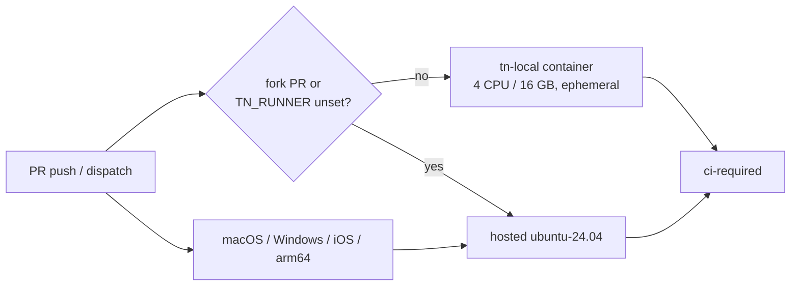

# PRD-480 — Linux CI runs on the owner's machine

**Status:** NOT STARTED
**Complexity:** 5 (HIGH)
**Owner:** CI tooling
**Depends on:** None

Complexity: 5 → MEDIUM (about 8 files +2, new system +2, GitHub runner API +1); risk override → HIGH because a
public repository gains a code-execution path onto a private machine.

## Context

CI's critical path is the queue, not the work. On 2026-10-02 the runs were:

| Run | Job work | Waiting for a runner | Longest wait for one job |
|---|---|---|---|
| 37043413533 (PRD-475 PR) | 146 min | 239 min | 19.3 min |
| 37047989282 (`develop` PR) | 266 min | 127 min | 17.6 min |

`ThreeNativeHQ/threenative-engine` is public and has 0 self-hosted runners. Every job therefore shares
the org's hosted concurrency cap with every other open PR. A full board is about 45 jobs. The branch-local
`integration-*.yml` workflows (decals, exposure, exposure cold boot, …) started 124 runs since
2026-10-01, against 72 `CI` runs, and they draw on the same pool.

Job setup is already cheap (install 4 s, `workspace-dist` 81 s), so trimming jobs moves little. The
pool size is the lever. [PRD-380](PRD-380-a-pull-request-never-starves-the-runner-pool.md) narrows what a
PR spends runners on. This PRD adds runners.

Files inspected: `.github/workflows/ci.yml` (19 Linux `runs-on`), `.github/workflows/native-platforms.yml`
(Linux jobs plus `macos-15`, `windows-2025`, `ubuntu-24.04-arm`), `.github/workflows/integration-*.yml`,
`.github/actions/playwright-chromium/action.yml` (`--with-deps` runs apt), `scripts/ci-local.sh`,
`scripts/__tests__/ci-structure.spec.ts`.

## Solution

Ephemeral GitHub Actions runners run in Ubuntu 24.04 containers on the owner's machine, registered
**to this repository only** with the label `tn-local`. Every Linux job that can move picks its runner
from one expression:

```yaml
runs-on: ${{ (github.event.pull_request.head.repo.fork || !vars.TN_RUNNER) && 'ubuntu-24.04' || vars.TN_RUNNER }}
```

- **Kill switch:** delete the `TN_RUNNER` repository variable and every job goes back to hosted
  runners. `scripts/ci-runners.sh up` sets `TN_RUNNER` after the runners come online, and `down` clears it
  before they stop. After a crash or power loss, recover with `gh variable delete TN_RUNNER`.
- **Fork guard:** a PR from a fork always runs on hosted runners and never reaches the machine.
- **Same verdicts, no caching:** the job still runs inside the workflow, on a fresh checkout of the
  candidate SHA, and `ci-required` is unchanged. The rule "Never cache test verdicts" stands.
- **Comparable timing:** each container is capped at 4 CPUs and 16 GB, the shape of a hosted
  `ubuntu-24.04` runner, so operation budgets and timeouts keep meaning what they meant.
- **Ephemeral:** each container takes one job, exits and is recreated (`--ephemeral`, compose
  `restart: always`). No `/tmp`, port, Xvfb display or workspace state crosses jobs.

**Stays hosted:** `native-platforms` macOS, Windows, iOS and `linux-arm64` legs; the `supply-chain`
job (its gitleaks step needs `docker run`, and mounting the Docker socket would give jobs root on the
host); release workflows; `site-docs`.



**Image:** `ghcr.io/actions/actions-runner` (Ubuntu 24.04 base with passwordless sudo) plus what the
moving jobs take from the hosted image: build-essential, cmake, ninja, ccache, clang, xvfb, and the
Playwright Chromium system dependencies. Phase 3 adds JDK 17, the Android SDK and emulator, with
`/dev/kvm` passed through.

**Credential:** ephemeral runners re-register for every job, so the stack mints registration
tokens with an owner-supplied fine-grained token (this repository, "Administration: read & write").
The token lives in an untracked env file outside the repo and is never printed.

**Risks:** a timing-shaped test that passes or fails only under the 4-CPU cap. Shared host disk filling
from container layers (see the btrfs and tmpfs notes in the owner's memory). The machine sleeping
while `TN_RUNNER` is set: jobs queue until the switch is cleared.

## Acceptance Criteria

- [ ] AC-1 [shared]: proof: CI run id plus `runner_name` per job from `gh api …/runs/<id>/jobs`. A non-draft
  PR's `CI` run executes every Linux job except `supply-chain` on a `tn-local` runner, and `ci-required`
  passes. Evidence: pending.
- [ ] AC-2 [shared]: proof: per-job `started_at − created_at` summed with the baseline's script. Total time
  jobs spent waiting for a runner on a full-board PR drops below 60 min (baseline 239 min, run
  37043413533). Evidence: pending.

## Blocked on

- Fine-grained token with "Administration: read & write" on `ThreeNativeHQ/threenative-engine`,
  written to the runner env file — unblocked by João.
- Repository setting "Require approval for all outside collaborators" for fork PR workflows
  confirmed on — unblocked by João.

## Integration Ledger

| Capability | Reachable consumer/trigger | Replaces / disposition | Evidence |
|---|---|---|---|
| Linux CI job runs on the owner's machine | PR push → `ci.yml` job `runs-on` expression → `tn-local` container; fill `file:line` | Hosted `ubuntu-*` stays as the fallback branch of the same expression | AC-1 |
| Runner lifecycle and kill switch | `scripts/ci-runners.sh up/down` → compose stack + `TN_RUNNER` variable | New | Phase 1 |

## Decisions

- 2026-10-02 (João): self-hosted runners rather than local runs vouching for a commit. A self-hosted
  runner gives the same offload with no forgeable status and no stale merge-ref verdict, and it keeps
  "Never cache test verdicts".
- 2026-10-02 (João): the cost is accepted. Actions minutes on public repositories stay free on
  self-hosted runners; GitHub's announced $0.002/min self-hosted charge is postponed and exempted
  public repos.

## Execution Phases

#### Phase 1: The runner stack comes up and takes jobs

**Status:** NOT STARTED
**Files:** NEW `tools/ci-runners/Dockerfile`, NEW `tools/ci-runners/compose.yml`, NEW
`scripts/ci-runners.sh` (`up [N]`, `down`, `status`; default N = 4, read from the env file).
**Implementation:** Ubuntu 24.04 runner image with the tool set above. Compose service with
`replicas: N`, `cpus: 4`, `mem_limit: 16g`, `restart: always`, and ephemeral repo-scoped registration
with labels `tn-local`. `up` waits for N online runners via `gh api repos/{owner}/{repo}/actions/runners`
before `gh variable set TN_RUNNER --body tn-local`. `down` deletes the variable first, then stops the
stack. The script fails closed when the env file or token is missing.

- [ ] `scripts/ci-runners.sh up` brings 4 runners online with label `tn-local`. proof:
  `scripts/ci-runners.sh status` lists 4 online runners.
- [ ] A runner container recreates itself after its job and keeps no state from it. proof: two
  consecutive dispatched jobs report different container hostnames and an empty `/tmp`.

#### Phase 2: `ci.yml` and the integration workflows route through the switch

**Status:** NOT STARTED
**Files:** EDIT `.github/workflows/ci.yml`, `.github/workflows/integration-*.yml`,
`scripts/__tests__/ci-structure.spec.ts`; the `integration-*.yml` template wherever agents copy it from.
**Implementation:** Replace each movable Linux `runs-on` with the routing expression. `supply-chain` keeps
`ubuntu-latest`. Extend `ci-structure.spec.ts` so every Linux job in these workflows either uses the
exact expression or is on a named hosted allow-list (`supply-chain`), and no macOS, Windows or arm64
job ever does.

- [ ] Structure spec enforces the routing. proof: `pnpm exec vitest run scripts/__tests__/ci-structure.spec.ts`
  passes, and it fails on a job left at a bare `ubuntu-latest`.
- [ ] With `TN_RUNNER` set, a PR run lands its Linux jobs on `tn-local`. proof: AC-1 run.
- [ ] With `TN_RUNNER` unset, the same workflow runs fully hosted. proof: `workflow_dispatch` run id with
  every `runner_name` hosted.

#### Phase 3: The Linux `native-platforms` legs move too

**Status:** NOT STARTED
**Files:** EDIT `.github/workflows/native-platforms.yml`, `tools/ci-runners/Dockerfile` (JDK 17, Android
SDK, emulator, `/dev/kvm`), `scripts/__tests__/ci-structure.spec.ts`.
**Implementation:** Route `web-reference`, `desktop-parity`, `android-emulator-parity`, `release-reports`,
the remaining `ubuntu-24.04` jobs and the `linux-x64` rows of the `desktop` and `starter-linux` matrices.
Keep `macos-15`, `windows-2025`, `ubuntu-24.04-arm` and `ios-simulator` hosted. The `android-emulator-runner`
action needs `/dev/kvm` access inside the container.

- [ ] A `native-platforms` run passes with its Linux legs on `tn-local`. proof: run id plus per-job
  `runner_name`.
- [ ] Waiting time meets AC-2. proof: the AC-2 measurement on a full-board PR after this phase.
