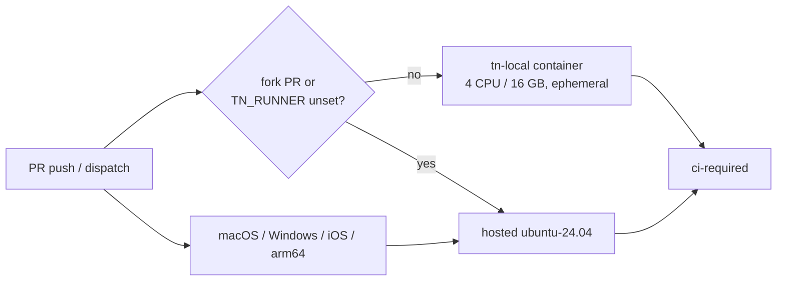

# PRD-480 — Linux CI runs on the owner's machine

**Status:** NOT STARTED
**Complexity:** 5 (HIGH)
**Owner:** CI tooling
**Depends on:** None

Complexity: 5 → MEDIUM (about 8 files +2, new system +2, GitHub runner API +1); risk override → HIGH because a
public repository gains a code-execution path onto a private machine.

## Context

CI's critical path is the queue, not the work. On 2026-10-02 the runs were:

| Run | Job work | Waiting for a runner | Longest wait for one job |
|---|---|---|---|
| 37043413533 (PRD-475 PR) | 146 min | 239 min | 19.3 min |
| 37047989282 (`develop` PR) | 266 min | 127 min | 17.6 min |

`ThreeNativeHQ/threenative` is public and has 0 self-hosted runners. Every job therefore shares
the org's hosted concurrency cap with every other open PR. A full board is about 45 jobs. The branch-local
`integration-*.yml` workflows (decals, exposure, exposure cold boot, …) started 124 runs since
2026-10-01, against 72 `CI` runs, and they draw on the same pool.

Job setup is already cheap (install 4 s, `workspace-dist` 81 s), so trimming jobs moves little. The
pool size is the lever. [PRD-380](PRD-380-a-pull-request-never-starves-the-runner-pool.md) narrows what a
PR spends runners on. This PRD adds runners.

Files inspected: `.github/workflows/ci.yml` (19 Linux `runs-on`), `.github/workflows/native-platforms.yml`
(Linux jobs plus `macos-15`, `windows-2025`, `ubuntu-24.04-arm`), `.github/workflows/integration-*.yml`,
`.github/actions/playwright-chromium/action.yml` (`--with-deps` runs apt), `scripts/ci-local.sh`,
`scripts/__tests__/ci-structure.spec.ts`.

## Solution

Ephemeral GitHub Actions runners run in Ubuntu 24.04 containers on the owner's machine, registered
**to this repository only** with the label `tn-local`. Every Linux job that can move picks its runner
from one expression:

```yaml
runs-on: ${{ (github.event.pull_request.head.repo.fork || !vars.TN_RUNNER) && 'ubuntu-24.04' || vars.TN_RUNNER }}
```

- **Kill switch:** delete the `TN_RUNNER` repository variable and every job goes back to hosted
  runners. `scripts/ci-runners.sh up` sets `TN_RUNNER` after the runners come online, and `down` clears it
  before they stop. After a crash or power loss, recover with `gh variable delete TN_RUNNER`.
- **Fork guard:** a PR from a fork always runs on hosted runners and never reaches the machine.
- **Same verdicts, no caching:** the job still runs inside the workflow, on a fresh checkout of the
  candidate SHA, and `ci-required` is unchanged. The rule "Never cache test verdicts" stands.
- **One full run per candidate:** while `TN_RUNNER` is set, agents run only the focused checks for what
  they changed (the touched spec, the affected playtest), then push. The full board runs once, on
  `tn-local`. Today the agent runs `pnpm test` or `pnpm ci:local --full` here, then CI repeats the same
  board, so this removes the duplicate. With `TN_RUNNER` unset, CI is hosted and slow again, and the
  local full run before pushing comes back.
- **Comparable timing:** each container is pinned (`--cpuset-cpus`) to two whole cores, four threads,
  the CPU shape of a hosted `ubuntu-24.04` runner, so `nproc` reads 4 and every worker pool sizes itself
  to that. A `--cpus 4` quota is not enough: `nproc` still reads every host CPU and vitest ran 8 workers
  in a 4-core budget. This is a controlled starting point, not a promise of identical timing.
- **Host stays stable:** five slots by default, and two cores are never given to a slot. Each slot gets
  `--memory 12g --memory-swap 12g --oom-score-adj 800`, so under memory pressure the kernel kills a CI
  job before the owner's processes.
- **Light lane:** `scope`, `ci-required`, `run-summary` and other small joins run on one more,
  unpinned `tn-local-light` runner (`--cpus 1`, 2 GB) that heavy jobs never select. Otherwise a 20-minute
  build on every heavy slot holds a 10-second join in the queue.
- **Ephemeral:** each container takes one job, exits and is recreated by a host-side `docker run --rm`
  loop. No `/tmp`, port, Xvfb display or workspace state crosses jobs.

**Stays hosted:** `native-platforms` macOS, Windows, iOS and `linux-arm64` legs; the `supply-chain`
job (its gitleaks step needs `docker run`, and mounting the Docker socket would give jobs root on the
host); release workflows; `site-docs`.



**Image:** `ghcr.io/actions/actions-runner` (Ubuntu 24.04 base with passwordless sudo) plus what the
moving jobs take from the hosted image: build-essential, cmake, ninja, ccache, clang, xvfb, and the
Playwright Chromium system dependencies. Phase 3 adds JDK 17, the Android SDK and emulator, with
`/dev/kvm` passed through.

**Credential:** ephemeral runners re-register for every job, so the stack mints registration
tokens with an owner-supplied fine-grained token (this repository, "Administration: read & write").
The token lives in an untracked env file outside the repo and is never printed.

**Risks:** a timing-shaped test that passes or fails only under the 4-CPU cap. Shared host disk filling
from container layers (see the btrfs and tmpfs notes in the owner's memory). The machine sleeping
while `TN_RUNNER` is set: jobs queue until the switch is cleared.

## Acceptance Criteria

- [ ] AC-1 [shared]: proof: CI run id plus `runner_name` per job from `gh api …/runs/<id>/jobs`. A non-draft
  PR's `CI` run executes every Linux job except `supply-chain` on a `tn-local` runner, and `ci-required`
  passes. Evidence: pending.
- [ ] AC-2 [shared]: proof: per-job `started_at − created_at` summed with the baseline's script. Total time
  jobs spent waiting for a runner on a full-board PR drops below 60 min (baseline 239 min, run
  37043413533). Evidence: pending.

## Blocked on

- Fork PR workflow approval set to "Require approval for all outside collaborators" (the API reads
  `first_time_contributors` on 2026-10-02; it must read `all_external_contributors`) — unblocked by João.

## Integration Ledger

| Capability | Reachable consumer/trigger | Replaces / disposition | Evidence |
|---|---|---|---|
| Linux CI job runs on the owner's machine | PR push → `ci.yml` job `runs-on` expression → `tn-local` container; fill `file:line` | Hosted `ubuntu-*` stays as the fallback branch of the same expression | AC-1 |
| Runner lifecycle and kill switch | `scripts/ci-runners.sh up/down` → compose stack + `TN_RUNNER` variable | New | Phase 1 |

## Decisions

- 2026-10-02 (João, during the first live runs): use more of the machine, but never at the cost of
  desktop stability. Five pinned slots of two cores each, two cores reserved for the host, 12 GB caps
  with CI as the OOM victim, and a reserved light lane (review by Astra the same day).

- 2026-10-02 (João): the runner registration token exists. It is a fine-grained token on
  `ThreeNativeHQ/threenative` only, with Administration read & write, stored in the operator's untracked
  runner env file. Verified by listing the repository's runners (0).

- 2026-10-02 (João): self-hosted runners rather than local runs vouching for a commit. A self-hosted
  runner gives the same offload with no forgeable status and no stale merge-ref verdict, and it keeps
  "Never cache test verdicts".
- 2026-10-02 (João): the cost is accepted. Actions minutes on public repositories stay free on
  self-hosted runners; GitHub's announced $0.002/min self-hosted charge is postponed and exempted
  public repos.
- 2026-10-02 (João): the runner must also remove the duplicate run, not only the queue. Agents stop
  running the full board locally while `TN_RUNNER` is set. Skipping a CI job because an identical tree
  already passed it would break "Never cache test verdicts", so it is out of scope; it would be its own PRD.

## Execution Phases

#### Phase 1: The runner stack comes up and takes jobs
**Status:** IN PROGRESS — stack files built, runners not yet brought up
**Files:** NEW `tools/ci-runners/Dockerfile`, NEW `tools/ci-runners/entrypoint.sh`, NEW
`scripts/ci-runners.sh` (`up [N]`, `down`, `status`; default N = 4, read from the env file).

Deviation from the plan below, owner-approved 2026-10-02: **no compose.yml.** A host-side loop of
`docker run --rm` replaces the compose service, because `restart: always` restarts the *same*
container — same filesystem, same hostname — and the ephemeral claim here is a fresh one of both
per job.

**Implementation:** Ubuntu 24.04 runner image with the tool set above. One loop per slot
(`setsid nohup`), `cpus 4`, `memory 16g`, and ephemeral repo-scoped registration with labels
`tn-local`. `up` waits for N online runners via `gh api repos/{owner}/{repo}/actions/runners`
before `gh variable set TN_RUNNER --body tn-local`. `down` deletes the variable first, then stops
the stack. The script fails closed when the env file or token is missing.


- [x] `scripts/ci-runners.sh up` brings 4 runners online with label `tn-local`. proof:
  `scripts/ci-runners.sh status` lists 4 online runners. Evidence: 2026-10-02, `up` printed "4 online;
  TN_RUNNER=tn-local" and `status` listed tn-23e70acfd553, tn-365ab3636a2e, tn-4d83d32a4c75 and
  tn-6071a30e949e, all online. The first `up` timed out with 0 online (wrong WORKDIR), cleared the
  variable and stopped the pool, which is the fail-closed path working. Not started: `status` reports
  `TN_RUNNER=unset`, 0 containers, 0 online runners on 2026-10-02.
- [ ] A runner container recreates itself after its job and keeps no state from it. proof: two
  consecutive dispatched jobs report different container hostnames and an empty `/tmp`.
  Not started: the image's `/tmp` is empty in a fresh container (`ls -A /tmp | wc -l` → 0), which
  is one container's worth of the claim.

#### Phase 2: `ci.yml` and the integration workflows route through the switch

**Status:** IN PROGRESS
**Files:** EDIT `.github/workflows/ci.yml`, `.github/workflows/integration-*.yml`,
`scripts/__tests__/ci-structure.spec.ts`; the `integration-*.yml` template wherever agents copy it from;
`AGENTS.md` ("Nearest lane first, CI last") plus its regenerated `CLAUDE.md` mirror.
**Implementation:** Replace each movable Linux `runs-on` with the routing expression. `supply-chain` keeps
`ubuntu-latest`. Extend `ci-structure.spec.ts` so every Linux job in these workflows either uses the
exact expression or is on a named hosted allow-list (`supply-chain`), and no macOS, Windows or arm64
job ever does. 23 lines routed (18 in `ci.yml`, one each in five `integration-*.yml`); `supply-chain`
and `integration-decals.yml`'s `ubuntu-24.04-arm` job are the only Linux `runs-on` left hosted, and
`native-platforms.yml` is untouched until Phase 3.

- [x] Structure spec enforces the routing. proof: `pnpm exec vitest run scripts/__tests__/ci-structure.spec.ts scripts/__tests__/ci-needs.spec.ts`
   — 142 passed, 0 failed. Red first: with no workflow edited the new test failed on
   `.github/workflows/ci.yml scope runs on 'runs-on: ubuntu-latest'`; after routing, setting `budgets`
   (ci.yml:1051) back to `ubuntu-latest` failed it again on that job and it was restored. Also green:
   `pnpm lint` (exit 0), `pnpm check:docs` (2496 links), `pnpm sync:agents --check` (22 mirrors).
   One pre-existing assertion had to be narrowed: `template-nonvisual` forbade the substring
   `pull_request` anywhere in the job, which the routing expression mentions without gating on it.

- [ ] With `TN_RUNNER` set, a PR run lands its Linux jobs on `tn-local`. proof: AC-1 run.
- [ ] `AGENTS.md` says focused checks then push, not the full board, while `TN_RUNNER` is set. proof:
  `pnpm sync:agents --check` and `pnpm exec vitest run scripts/__tests__/sync-agent-docs.spec.ts` pass.
  Land it only after the AC-1 run is green.
- [ ] Light jobs never wait behind heavy ones: `scope`, `ci-required` and `run-summary` route to
  `tn-local-light` and no heavy job can. proof: `ci-structure.spec.ts` case, plus a full-board run whose
  `ci-required` starts within 60 s of its last `needs` finishing.
- [ ] With `TN_RUNNER` unset, the same workflow runs fully hosted. proof: `workflow_dispatch` run id with
  every `runner_name` hosted.

#### Phase 3: The Linux `native-platforms` legs move too

**Status:** NOT STARTED
**Files:** EDIT `.github/workflows/native-platforms.yml`, `tools/ci-runners/Dockerfile` (JDK 17, Android
SDK, emulator, `/dev/kvm`), `scripts/__tests__/ci-structure.spec.ts`.
**Implementation:** Route `web-reference`, `desktop-parity`, `android-emulator-parity`, `release-reports`,
the remaining `ubuntu-24.04` jobs and the `linux-x64` rows of the `desktop` and `starter-linux` matrices.
Keep `macos-15`, `windows-2025`, `ubuntu-24.04-arm` and `ios-simulator` hosted. The `android-emulator-runner`
action needs `/dev/kvm` access inside the container.

- [ ] A `native-platforms` run passes with its Linux legs on `tn-local`. proof: run id plus per-job
  `runner_name`.
- [ ] Waiting time meets AC-2. proof: the AC-2 measurement on a full-board PR after this phase.
