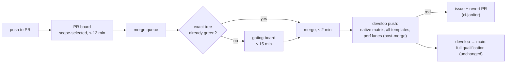

# PRD-550 — A change merges within 30 minutes of its last push

**Status:** NOT STARTED
**Priority:** P1 — AC-1 to AC-3 are open: a green code PR takes 2 to 15 hours to merge, which blocks every lane in the repository.
**Complexity:** 5 (MEDIUM) — 6–10 files (2), merge-queue concurrency (+2), GitHub API (+1); risk override → HIGH, because a wrong gate lets a red tree land on `develop`.
**Owner:** João (decisions), agent (implementation)
**Depends on:** PRD-480 (runner pool), PRD-481 (tree reuse, merge queue)

## Context

Measured from 253 workflow runs created 2026-10-08T04:30Z to 2026-10-09T04:30Z (`gh run list` and
`gh api .../runs/<id>/jobs`, 88 completed `CI` runs, 1,794 jobs, 10,825 runner-minutes).

**End-to-end time today.** A code PR runs the board twice in sequence: once as `pull_request`, once as
`merge_group`. Each successful board takes 52–86 min of wall time (merge group median 75 min, PR median 76 min).

| Merged PR | Enqueue → merge | Merge-queue attempts |
|---|---|---|
| #461 | 104 min | fail, success |
| #462 | 243 min | fail ×3, cancelled ×2 |
| #457 | 433 min | success, fail ×2, success |
| #449 | 594 min | success, fail ×5, cancelled |
| #455 | 627 min | success, fail, success |
| #456 | 892 min | cancelled, fail ×7, cancelled |
| #465 (docs only) | 132 min | fail, cancelled ×2 |

**Four causes, in order of cost.**

1. **Merge groups fail 62% of the time** (23 of 37). Each failure costs a full 75 min re-run. With
   `max_entries_to_build: 2`, a failure ahead also restarts the entry behind it, so one red group
   costs two boards. First failing job per red group: `integration / auto-exposure` 7, `test` 3,
   `test-unit` 5, `macOS desktop core` 2, others 1 each. The signatures that repeat across
   unrelated PRs are load-sensitive, not code-sensitive:
   - `integration / auto-exposure`: `Resource wait for 'state.sampleFrames' timed out after 60011 ms … last observation 178`
     (178 of 180 frames). The frame budget is a wall-clock wait on a loaded software-GPU runner.
   - `integration / velocity`: `TN_PLAYTEST_RESOURCE_ASSERTION_FAILED … 'p95NoiseExcessMs'`. A
     frame-time noise gate runs on a shared runner (`examples/abyss-framework/playtests/velocity-cost.playtest.json`).
   - `test-unit`: `Test timed out in 60000ms` (7×, e.g. `template-assets-compile-1.spec.ts > rts assets`),
     plus repeated reds in `world-gpu-scene.spec.ts` (9), `check-capability-docs.spec.ts` (8) and
     `create-threenative/__tests__/build.spec.ts` (8). Phase 1 separates real reds from load reds.
2. **Jobs wait for a runner longer than they run.** Hosted queue wait: median 5.5 min, p75 20 min,
   p90 41 min. In successful merge groups, template legs waited 40–62 min to run for 2–17 min. A
   full board is 350–390 runner-minutes but gets only 4.3–5.9 effective slots (work ÷ wall). The
   organization is on the GitHub **free** plan (20 concurrent hosted jobs, shared by every run).
   At 2026-10-09T04:30Z `TN_RUNNER` was unset, so the five heavy `tn-local` slots took no heavy jobs.
3. **Merge groups run the exhaustive board, including docs-only PRs.** `scripts/ci-change-scope.mjs:571`
   lists `test-unit`, `integration`, `template-nonvisual`, `golden-path-template` and `native-platforms`
   in `UNPROVEN_REUSE_BOARDS`. `test-unit` is required on every run, so tree reuse never fires: every
   merge group logs `tree reuse unavailable: required matrix/reusable board test-unit has no authoritative complete expansion and routing`.
   Merge groups used 5,837 of the 10,825 runner-minutes.
4. **Slow native legs sit on the merge path.** Median run time: Windows desktop core 42.4 min, Android
   emulator visual parity 30.8, iOS simulator 23.6, macOS desktop core 20.4, desktop web/native parity
   17.2, `template-nonvisual (shooter)` 17.0. Windows alone is longer than the 30 min goal.

**What fits in 30 min.** The gating core is short. Median run times: scope 0.9, `build-artifacts` 2.3,
`test-unit` shards 3.5–6.2, `test-browser` 5.1, `test` 3.9, `test-playtest` 3.4, `golden-path-template`
2.3–4.1, `typecheck` 0.9, `lint` 0.6, `budgets` 1.1. Its critical path is about 12 min and its total
work is about 45 runner-minutes.

## Solution

Gate the merge on one short board, run it once, and keep it green. Move exhaustive qualification
to the place that already owns it: the `develop → main` promotion and the nightly run.

Time budget for AC-1: PR board ≤ 12 min, queue entry and scope ≤ 3 min, gating board ≤ 15 min.

**Phase 1 — no load reds in the gate.** Make the three load-sensitive gates count frames, not wall
time, or move them off the gating board. A frame-time noise threshold (`velocity`) needs a quiet
machine, so it moves to the hardware performance lane (`performance-regression.yml`). Classify every
repeated `test-unit` red from the window as code or load; fix the load reds at their timeout source.

**Phase 2 — one gating board, run once.** Split the board into **gating** (the core above plus the
affected template and Linux native contract legs that `scope` selects) and **qualifying** (native
platform legs, all 13 templates, perf integration lanes). Merge groups run only gating. Develop pushes,
the nightly run and `develop → main` run qualifying. A red qualifying run on `develop` opens an issue
and a revert PR through the existing `ci-janitor.yml`. Prove `test-unit` shard expansion so it leaves
`UNPROVEN_REUSE_BOARDS`; then an exact-tree merge group reuses the PR verdict (PRD-481's mechanism).

**Phase 3 — capacity for the gating board.** The gating board needs about 10 free slots for 15 min.
Route gating jobs to the heavy `tn-local` pool first (PRD-480) and leave the hosted pool to the
qualifying legs. Add a small latency audit (`scripts/ci-merge-latency.mjs`) that prints, for merged
PRs in a window: last push → merge, enqueue → merge, attempts, and first failing job. It replaces the
ad-hoc `gh` queries used for this Context.

Risks: a qualifying red lands on `develop` before it is seen. The revert PR bounds that window to one
qualifying run. A PR can still opt in to qualifying on the merge path with a label for native-only changes.

## Acceptance Criteria

- [ ] AC-1 [shared]: Over 10 consecutive code PRs merged after this PRD lands, median last push → merge ≤ 30 min and p90 ≤ 45 min. proof: `node scripts/ci-merge-latency.mjs --since <date>` — Evidence: pending.
- [ ] AC-2 [shared]: Over 20 consecutive merge groups, ≥ 90% succeed on the first attempt. proof: `node scripts/ci-merge-latency.mjs --since <date>` attempts column — Evidence: pending.
- [ ] AC-3 [shared]: A merge group whose tree already passed on the PR merges in ≤ 2 min with `selection: reused`. proof: CI run id — Evidence: pending.

## Blocked on

- Moving native, all-template and perf legs off the merge path changes the rule in root `AGENTS.md` ("Merge groups … use fresh exhaustive qualification") — unblocked by João's decision.
- Heavy `tn-local` slots for gating jobs need `TN_RUNNER` set (unset at 2026-10-09T04:30Z), or a paid GitHub plan for more hosted concurrency — unblocked by João's decision.

## Integration Ledger

| Capability | Reachable consumer/trigger | Replaces / disposition | Evidence |
|---|---|---|---|
| Gating board on merge groups | `merge_group` event → `.github/workflows/ci.yml` → `scope` job → `scripts/ci-change-scope.mjs` | Replaces the exhaustive merge-group board | AC-1, AC-2 |
| Exact-tree reuse in the queue | `scope` job → `currentRun`/`coverageMiss` (`scripts/ci-change-scope.mjs:584`) | `test-unit` leaves `UNPROVEN_REUSE_BOARDS` | AC-3 |
| Post-merge qualification | `push` to `develop`, `schedule` → `ci.yml`; red → `ci-janitor.yml` | Takes the legs removed from merge groups | Phase 2 box |
| Merge latency audit | `node scripts/ci-merge-latency.mjs` | Replaces ad-hoc `gh` queries | AC-1, AC-2 |

## Execution Phases

#### Phase 1: No load reds in the gate
**Status:** NOT STARTED
**Files:** `packages/create-threenative/__tests__/fixtures/auto-exposure/proof.ts`, `.github/workflows/integration.yml`, `.github/workflows/performance-regression.yml`, the `test-unit` specs that phase 1 classifies as load reds.
**Implementation:** Wait on rendered updates with a timeout scaled to the measured frame rate, not a fixed 60 s. Move `velocity` from `integration.yml` to `performance-regression.yml`. For each repeated `test-unit` red, read three failing logs; a red that also fails on an idle `tn-local` run is a code red and leaves this PRD.
- [ ] `integration / auto-exposure` passes 10 of 10 runs on a `tn-local` slot under a parallel full board. proof: CI run ids.
- [ ] `velocity` runs on the hardware lane and is absent from `merge_group` jobs. proof: `performance-regression.yml` run id plus a merge-group job list.
- [ ] No `test-unit` spec times out in 10 consecutive merge groups. proof: `node scripts/ci-merge-latency.mjs` first-failing-job column.

#### Phase 2: One gating board, run once
**Status:** NOT STARTED
**Files:** `.github/workflows/ci.yml`, `scripts/ci-change-scope.mjs`, `scripts/ci-required.mjs`, `.github/workflows/ci-janitor.yml`, root `AGENTS.md` (+ `pnpm sync:agents`), `scripts/__tests__/ci-structure.spec.ts`.
**Implementation:** Add a `gating` scope for `merge_group`; keep `full` for develop push, schedule, `workflow_dispatch` and `main`. Prove `test-unit` shard expansion from the run's job list and drop it from `UNPROVEN_REUSE_BOARDS`. Extend `ci-janitor.yml` to open an issue and a revert PR on a red qualifying `develop` run.
- [ ] A merge group runs only gating jobs and finishes in ≤ 15 min wall. proof: CI run id.
- [ ] A red qualifying run on `develop` opens an issue and a revert PR. proof: `ci-janitor.yml` run id on a seeded red branch.

#### Phase 3: Capacity and the latency audit
**Status:** IN PROGRESS
**Files:** `scripts/ci-merge-latency.mjs` (new), `scripts/ci-speed-loop.mjs` (new), `docs/ci-speed/` (ledger and HTML dashboard), `.claude/skills/ci-speed-loop/`, `.github/workflows/ci.yml` `runs-on` expressions, `docs/PRDs/CI/EXECUTION-ORDER.md`.
**Implementation:** Route gating jobs to `vars.TN_RUNNER` with hosted fallback; route qualifying jobs to hosted. Write the audit script with `gh api` and no new dependency. `scripts/ci-speed-loop.mjs` records each audit window in `docs/ci-speed/ledger.json` and renders `docs/ci-speed/index.html`, a dashboard of every metric against its goal (skill: `ci-speed-loop`).
- [x] The audit and the dashboard exist, reproduce this PRD's own table, and hold the baseline. proof: `pnpm exec vitest run scripts/__tests__/ci-speed-loop.spec.ts` 14 of 14; `node scripts/ci-merge-latency.mjs --since 2026-10-08` gives #461 104.2, #462 242.9, #457 432.7, #449 593.9, #455 626.9, #456 892.1, #465 131.9 min enqueue → merge (this PRD's table) and 8 `auto-exposure` first failures; ledger iteration #1 = baseline.
- [ ] Gating jobs in a merge group wait ≤ 3 min p90 for a runner. proof: `node scripts/ci-merge-latency.mjs` queue column.
