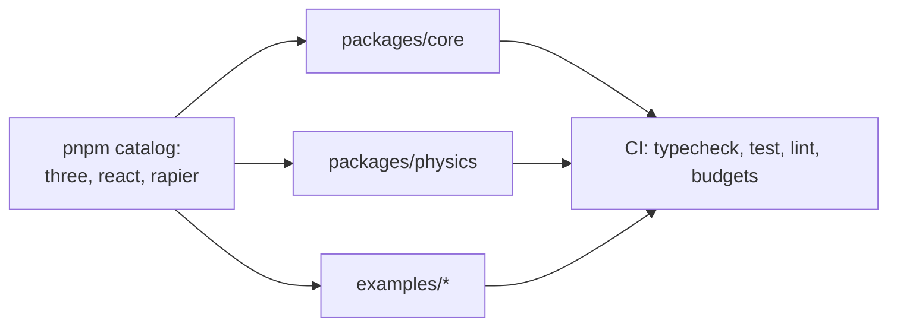

# PRD-001 — Monorepo Foundation

**Complexity: 7 → HIGH mode**
(10+ files +3, new system from scratch +2, multi-package +2)

**Depends on:** nothing. **Blocks:** PRD-002, 003, 004, 005.
**Charter authority:** `CHARTER.md` §9a, §9c, §10, §11.

---

## 1. Context

**Problem:** There is no repository. Every other PRD needs a workspace whose
toolchain enforces `CHARTER.md`'s budgets mechanically rather than by intention.

**Files analyzed:** `CHARTER.md`; `package.json`, `vite.config.js`, `src/main.js`
(the existing vanilla Abyss control, which becomes `examples/abyss-vanilla/` in
PRD-005).

**Current behavior:**
- Repo root holds a loose Vite project with `three@0.185.1` installed via npm.
- No workspace, no packages, no CI, no lint, no test runner.
- `src/main.js` is a working ~400-line game and is the benchmark control. **It must
  survive this PRD unchanged in behavior.**

**Incumbent census:** the root `package.json` and `vite.config.js` are the only
existing build config. They are *replaced* by the workspace root, and the game they
build moves to `examples/abyss-vanilla/`. Nothing else is incumbent.

---

## 2. Solution

**Approach:**
- pnpm workspace with a `catalog:` block as the single owner of shared dep versions.
- Every package built by `tsup` to ESM only; `tsc --noEmit` for typecheck.
- Vitest for unit tests, Biome for lint+format, Changesets for release.
- **Budget enforcement is a CI gate, not a guideline** — a script fails the build when
  `CHARTER.md` §10 caps are exceeded.

**Key decisions:**
- [ ] `catalog:` over per-package version strings — TSL churns between three releases;
      a bump must be one line and one CI run (§9a).
- [ ] ESM-only, Node 20+, `moduleResolution: "bundler"`. No CJS build.
- [ ] Biome over ESLint+Prettier — one tool, one config. Flagged in §9c as the one
      low-confidence call; reversible in an afternoon.
- [ ] `packages/*` and `examples/*` only. No `apps/`, no `tools/`, no `libs/`.

**Data changes:** none.



---

## 3. Integration Ledger

| # | New thing | Live caller (`file:line`, non-test) | Replaces | Old path removed? | Negative control |
|---|-----------|-------------------------------------|----------|-------------------|------------------|
| 1 | `pnpm-workspace.yaml` catalog | `packages/*/package.json` declare `three: 'catalog:'` | root `package.json` deps | yes, Phase 1 | change catalog `three` to a bogus version → install fails |
| 2 | `scripts/check-budgets.ts` | `.github/workflows/ci.yml` job `budgets` | nothing | n/a | add a 9th package → CI goes red |
| 3 | `biome.json` | `.github/workflows/ci.yml` job `lint`; `pnpm lint` | nothing | n/a | introduce an unused import → CI goes red |
| 4 | `tsconfig.base.json` | every `packages/*/tsconfig.json` extends it | root `tsconfig` (none exists) | n/a | remove `strict` → a deliberate `any` leak stops erroring |
| 5 | `examples/abyss-vanilla/` | `pnpm --filter abyss-vanilla dev` | root `src/main.js` + `vite.config.js` | yes, Phase 3 | delete `main.js` → example build fails |

---

## 4. Reachability

**How is this reached?**
- Entry point: `pnpm install`, `pnpm -r build`, `pnpm test`, `pnpm lint`, and CI on push.
- Pre-existing files EDITED: root `package.json` (→ workspace root),
  `vite.config.js` (→ moves under `examples/abyss-vanilla/`).
- Registration: `.github/workflows/ci.yml` runs every gate.

**User-facing?** No — internal. Trigger is CI and local commands.

**Full flow:**
1. Developer runs `pnpm install` at the root.
2. pnpm resolves `catalog:` specifiers into every workspace package.
3. `pnpm -r build` compiles each package with tsup.
4. CI runs typecheck, test, lint, and the budget gate.
5. Observable in: green CI, and `examples/abyss-vanilla` still running via `pnpm dev`.

> **Phase-1 exemption, declared:** this is a greenfield repo, so Phase 1 cannot edit a
> file that predates the PRD *other than* the root `package.json` and `vite.config.js`.
> It edits both. Phases 2–4 have no exemption.

---

## 5. Execution Phases

### Phase 1 — Workspace root: `pnpm install` resolves a catalog

**Files (max 5):**
- `pnpm-workspace.yaml` — NEW: workspace globs + `catalog:` block
- `package.json` — **EDIT**: becomes the workspace root; deps move to the catalog
- `.npmrc` — NEW: `strict-peer-dependencies=true`, `save-exact=true`
- `tsconfig.base.json` — NEW: strict, ESM, `moduleResolution: bundler`
- `.gitignore` — NEW

**Implementation:**
- [ ] `packages: ['packages/*', 'examples/*']`
- [ ] Catalog pins per §9c: `three 0.185.1`, `@dimforge/rapier3d-compat 0.19.3`,
      `react 19.2.0`, `typescript 5.9.3`, `vite 8.2.0`, `zustand 5.x`
- [ ] Root `package.json` is `private: true`, holds only scripts and devDeps

**Wiring:**
- [ ] Caller edited: root `package.json` no longer declares `three` directly
- [ ] Registration: n/a (workspace is the registration)
- [ ] Old path: root direct deps deleted
- [ ] Ledger rows filled: #1, #4

**Tests required:**

| Test file | Test name | Assertion | Negative control (observe red) |
|---|---|---|---|
| `scripts/__tests__/catalog.spec.ts` | `should resolve three from the catalog in every package` | every `packages/*/package.json` with a `three` dep declares `'catalog:'`, never a literal | add a literal `"three": "0.185.1"` to a package → test fails |

**Revert check:** delete the `catalog:` block → `pnpm install` fails to resolve.

**User verification:** `pnpm install` completes; `pnpm why three` reports one version.

---

### Phase 2 — Build + typecheck: an empty package compiles and publishes shape

**Files:**
- `packages/core/package.json` — NEW (stub, real content in PRD-002)
- `packages/core/tsconfig.json` — NEW: extends base
- `packages/core/tsup.config.ts` — NEW
- `packages/core/src/index.ts` — NEW: `export const version = ...`
- `pnpm-workspace.yaml` — **EDIT**: confirm glob picks up the new package

**Implementation:**
- [ ] tsup: ESM only, `dts: true`, `target: 'es2022'`, `sourcemap: true`
- [ ] `exports` map with subpath support (§9a: modularity via subpaths, not packages)
- [ ] `publint` run as part of build

**Wiring:**
- [ ] Caller edited: `pnpm-workspace.yaml`, root `package.json` scripts gain `build`
- [ ] Ledger rows filled: #4

**Tests required:**

| Test file | Test name | Assertion | Negative control |
|---|---|---|---|
| `packages/core/__tests__/build.spec.ts` | `should emit ESM and types for every export` | `dist/index.js` and `dist/index.d.ts` exist and import cleanly | delete an export from `src/index.ts` → the `.d.ts` assertion fails |

**Revert check:** rename `src/index.ts` → `pnpm -r build` fails.

---

### Phase 3 — The vanilla control moves in and still runs

**Files:**
- `examples/abyss-vanilla/package.json` — NEW
- `examples/abyss-vanilla/vite.config.js` — **EDIT** (moved from root)
- `examples/abyss-vanilla/src/main.js` — **EDIT** (moved from root; import paths only)
- `examples/abyss-vanilla/index.html` — **EDIT** (moved)
- `examples/abyss-vanilla/src/style.css` — **EDIT** (moved)

**Implementation:**
- [ ] Declares `three: 'catalog:'`
- [ ] **No behavioural change to the game.** Only paths move.

**Wiring:**
- [ ] Caller edited: all five files relocated; root copies deleted
- [ ] Old path: root `src/`, `index.html`, `vite.config.js` deleted
- [ ] Ledger rows filled: #5

**Tests required:**

| Test file | Test name | Assertion | Negative control |
|---|---|---|---|
| `examples/abyss-vanilla/__tests__/boot.spec.ts` | `should reach a non-black frame within 5s` | Playwright screenshot mean luminance > 0.02 | stub `renderer.render` to a no-op → frame stays black, test fails |

**Revert check:** delete `examples/abyss-vanilla/src/main.js` → the boot test fails.

**User verification:** `pnpm --filter abyss-vanilla dev`, open the page, the game plays
exactly as it did before this PRD.

---

### Phase 4 — CI that can go red, including the budget gate

**Files:**
- `.github/workflows/ci.yml` — NEW
- `scripts/check-budgets.ts` — NEW
- `biome.json` — NEW
- `vitest.config.ts` — NEW
- `package.json` — **EDIT**: `lint`, `test`, `typecheck`, `budgets` scripts

**Implementation:**
- [ ] Jobs: `install → typecheck → lint → test → build → budgets`
- [ ] `check-budgets.ts` enforces §10: ≤8 workspace packages, ≤15,000 LOC across
      `packages/*/src` excluding salvage, ≤10 files in
      `docs/PRDs/`
- [ ] Budget failure prints which cap was exceeded and by how much

**Wiring:**
- [ ] Caller edited: root `package.json` scripts; CI invokes each
- [ ] Ledger rows filled: #2, #3

**Tests required:**

| Test file | Test name | Assertion | Negative control |
|---|---|---|---|
| `scripts/__tests__/budgets.spec.ts` | `should fail when package count exceeds 8` | given a fixture tree of 9 packages, exits non-zero with the cap named | run against the real 3-package tree → must exit 0, proving it is not always-red |
| `scripts/__tests__/budgets.spec.ts` | `should fail when framework LOC exceeds 15000` | fixture at 15,001 LOC exits non-zero | fixture at 14,999 exits 0 |

**Revert check:** remove the `budgets` job from `ci.yml` → the budget spec still
passes locally but the caller census (Ledger #2) has no non-test consumer → FAIL.

**Manual checkpoint (HIGH):** push a branch that adds a 9th package and confirm CI
goes red for that reason and no other.

---

## 6. Acceptance Criteria

Consumer-scoped. Each is falsifiable.

- [ ] A developer clones the repo, runs `pnpm install && pnpm -r build && pnpm test`,
      and all three succeed on a clean machine with Node 20.
- [ ] `pnpm --filter abyss-vanilla dev` serves the Abyss game and it is
      **indistinguishable from the pre-move version** to someone playing it.
- [ ] Bumping `three` in the catalog changes the resolved version in every package and
      example, verified by `pnpm why three` reporting exactly one version.
- [ ] Adding a 9th workspace package turns CI red, naming the package cap.
- [ ] Adding 200 lines of unused code to `packages/core/src` that pushes past 15,000
      turns CI red, naming the LOC cap.
- [ ] Every gate in §5 has been observed failing at least once, recorded in
      Verification Evidence.

**This PRD fails if:** the budget gate cannot be made to fail on demand, or the moved
Abyss control changes behaviour.

---

## 7. Verification Evidence

*(filled during implementation — a pass with no observed red is recorded UNVERIFIED)*

| Gate | Result | Negative control observed red? |
|---|---|---|
| catalog resolution | | |
| package build + publint | | |
| abyss-vanilla boot | | |
| budgets: package cap | | |
| budgets: LOC cap | | |

**Integration proof (paste raw output, do not summarize):**

```bash
# 1. Caller census — check-budgets has a non-test consumer
grep -rn "check-budgets" --include=*.yml --include=*.json | grep -v __tests__

# 2. Revert check — remove the catalog block, install must fail
# 3. Incumbent check — no root-level game files remain
ls src/ index.html vite.config.js 2>&1   # expected: No such file or directory
```
