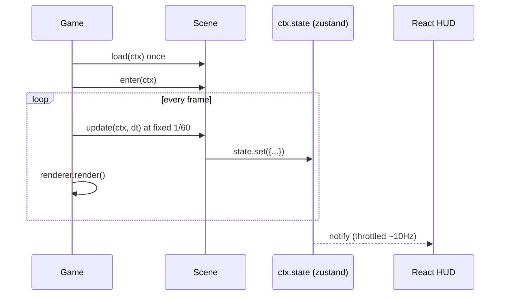

# PRD-002 — `@threenative/core`

**Complexity: 7 → HIGH mode**
(10+ files +3, new system from scratch +2, complex state/loop logic +2)

**Depends on:** PRD-001. **Blocks:** PRD-003, 004, 005.
**Charter authority:** `CHARTER.md` §3, §5, §5b, §6, §6b, §11.

---

## 1. Context

**Problem:** ~42% of every Three.js game is identical plumbing (`CHARTER.md` §3: ~170
of Abyss's ~400 lines). `core` is that 170 lines, written once, so an AI agent spends
its budget on gameplay instead.

**Files analyzed:** `CHARTER.md`; `examples/abyss-vanilla/src/main.js` — the control,
and the precise specification of what `core` must absorb.

**Current behavior:** every game hand-writes renderer init, WebGPU capability guard,
resize, dt clamping, input listeners with pointer capture and blur handling, a state
machine, and HUD synchronisation.

**Incumbent census:** the ~170 plumbing lines inside
`examples/abyss-vanilla/src/main.js`. They are **not deleted** — that file is the
frozen benchmark control (PRD-005). The framework port in PRD-005 is where the
incumbent is replaced.

---

## 2. Solution

**Approach:**
- `defineGame(config)` returns a `Game` with `start()` / `stop()`. That is the surface.
- `Scene` is a class with three optional methods: `load`, `enter`, `update`. No more.
- Fixed-timestep accumulator for `update`, decoupled from render frames.
- Renderer bootstrap is ~40 lines: construct `WebGPURenderer`, fall back to WebGL2,
  handle resize. **No visual options of any kind** (§5b).
- `ctx.state` is a zustand store; UI subscribes via `useSyncExternalStore` (PRD-004).

**Key decisions:**
- [ ] Fixed timestep at 1/60 with a max of 5 catch-up steps, then clamp. Deterministic
      `update`, interpolation left to the game.
- [ ] Input is a **mapping**, not an abstraction: `ctx.input.vector('move')` returns a
      `THREE.Vector2`. Raw events remain available on `ctx.input.raw`.
- [ ] Asset loading wraps three's existing loaders for caching and pathing only. It
      does not invent a manifest format.
- [ ] State writes are coalesced and flushed at ~10Hz so React never re-renders on the
      game loop (§6b).

**Explicitly NOT in this package** (§5b — the framework never owns the look):
materials, lighting, tonemapping, exposure, post-processing, shaders, TSL helpers,
camera framing presets. Any PR adding these is rejected on sight.

**Data changes:** none.



---

## 3. Integration Ledger

| # | New thing | Live caller (`file:line`, non-test) | Replaces | Old path removed? | Negative control |
|---|-----------|-------------------------------------|----------|-------------------|------------------|
| 1 | `defineGame()` | `examples/abyss-framework/src/main.ts` (PRD-005) | hand-rolled bootstrap in `abyss-vanilla/src/main.js` | no — control is frozen by design | return a Game whose `start()` no-ops → the example renders nothing |
| 2 | `Scene` base class | `examples/abyss-framework/src/scenes/Play.ts` | inline state machine in the control | no (as above) | make `update()` never dispatch → the example freezes |
| 3 | `createRenderer()` | `packages/core/src/game.ts` (`Game.start`) | ~30 lines of renderer init in the control | no (as above) | force `navigator.gpu = undefined` → WebGL2 path must engage, not crash |
| 4 | `InputMap` | `packages/core/src/game.ts` loop; example `Play.update` | ~30 lines of listeners in the control | no (as above) | detach listeners → `vector('move')` stays zero under synthetic keydown |
| 5 | `createGameStore()` | `packages/core/src/game.ts`; `@threenative/ui` (PRD-004) | ~70 lines of HUD sync in the control | no (as above) | stop the flush timer → HUD numbers freeze while the game runs |

---

## 4. Reachability

**How is this reached?**
- Entry point: the browser. `main.ts` calls `defineGame(...).start()`; `requestAnimationFrame` drives everything after.
- Pre-existing file EDITED per phase: `packages/core/src/index.ts` (the PRD-001 stub) gains each export; `examples/abyss-framework/` grows from Phase 2 onward.
- Registration: the render loop is the registration. A scene registered in `scenes` but never reachable via `start` or a transition is dead — the caller census must show the transition.

**User-facing?** Yes, transitively — the HUD in PRD-004 reads `ctx.state`.

**Full flow:**
1. Page loads, `main.ts` runs `defineGame({...}).start()`.
2. `Game.start()` builds the renderer, mounts the canvas, enters the start scene.
3. `requestAnimationFrame` drives the accumulator; `Scene.update(ctx, dt)` runs at 1/60.
4. `Scene.update` writes `ctx.state.set({...})`.
5. Observable in: pixels on the canvas, and HUD numbers changing.

---

## 5. Execution Phases

Each phase is a vertical slice ending in something visible in a browser.

### Phase 1 — A cube spins: `defineGame` + `Scene` + loop

**Files:**
- `packages/core/src/game.ts` — NEW: `defineGame`, `Game`, accumulator loop
- `packages/core/src/scene.ts` — NEW: `Scene`, `Ctx`
- `packages/core/src/renderer.ts` — NEW: `createRenderer()` (~40 lines, no visual opts)
- `packages/core/src/index.ts` — **EDIT**: export the above
- `examples/abyss-framework/src/main.ts` — NEW: minimal `defineGame` with one scene

**Implementation:**
- [ ] Accumulator: `acc += dt; while (acc >= STEP && n++ < 5) { scene.update(ctx, STEP); acc -= STEP; }`
- [ ] `createRenderer`: try `WebGPURenderer` + `await init()`; on failure construct the
      WebGL2 path; attach a resize observer. **Nothing else.**
- [ ] `Ctx` exposes `renderer`, `scene`, `camera`, `add`, `input`, `assets`, `state`,
      `physics` (undefined until PRD-003 registers it)

**Wiring:**
- [ ] Caller edited: `packages/core/src/index.ts`
- [ ] Registration: `main.ts` calls `.start()`
- [ ] Ledger rows: #1, #2, #3

**Tests required:**

| Test file | Test name | Assertion | Negative control (observe red) |
|---|---|---|---|
| `packages/core/__tests__/loop.spec.ts` | `should call update exactly 60 times per simulated second` | count === 60 ± 1 for a 1s virtual clock | change STEP to 1/30 → count becomes 30, test fails |
| `packages/core/__tests__/loop.spec.ts` | `should clamp catch-up to 5 steps after a long stall` | a 10s stall yields ≤5 update calls | remove the clamp → 600 calls, test fails |
| `packages/core/__tests__/renderer.spec.ts` | `should fall back to WebGL2 when navigator.gpu is absent` | returns a renderer, no throw | delete the fallback branch → throws, test fails |

**Revert check:** rename `Game.start` → the abyss-framework example fails to boot.

**User verification:** `pnpm --filter abyss-framework dev` → a spinning cube.

---

### Phase 2 — The cube responds: `InputMap`

**Files:**
- `packages/core/src/input.ts` — NEW: `InputMap`, `input()` plugin
- `packages/core/src/game.ts` — **EDIT**: construct and tick the input map
- `packages/core/src/index.ts` — **EDIT**: export
- `examples/abyss-framework/src/scenes/Play.ts` — **EDIT**: move the cube with `move`
- `packages/core/__tests__/input.spec.ts` — NEW

**Implementation:**
- [ ] Sources: `WASD`, `arrows`, `pointerDown`, `pointerPosition`, gamepad axes/buttons
- [ ] `vector(name)` → `THREE.Vector2`; `pressed(name)` → boolean; `raw` → the events
- [ ] Pointer capture on down, release on up, clear all on `blur`

**Wiring:**
- [ ] Caller edited: `game.ts` ticks it each frame; `Play.ts` reads it
- [ ] Ledger rows: #4

**Tests required:**

| Test file | Test name | Assertion | Negative control |
|---|---|---|---|
| `input.spec.ts` | `should report (−1,0) when KeyA is held` | `vector('move')` equals `(-1,0)` | detach the keydown listener → `(0,0)`, test fails |
| `input.spec.ts` | `should clear held keys on window blur` | after blur, `vector('move')` is `(0,0)` | remove the blur handler → stays `(-1,0)`, test fails |

**Revert check:** disable the input tick → the Play scene's movement E2E fails.

**User verification:** press A/D, the cube moves; alt-tab away and back, it stops.

---

### Phase 3 — Assets load: `ctx.assets`

**Files:**
- `packages/core/src/assets.ts` — NEW: `model()`, `texture()`, `audio()`, cache
- `packages/core/src/game.ts` — **EDIT**: construct and expose on `Ctx`
- `packages/core/src/index.ts` — **EDIT**
- `examples/abyss-framework/src/scenes/Play.ts` — **EDIT**: `await ctx.assets.model(...)`
- `packages/core/__tests__/assets.spec.ts` — NEW

**Implementation:**
- [ ] Thin wrapper over `GLTFLoader`, `TextureLoader`. Caching + base-path resolution
      only. **No manifest format, no descriptor, no registry** (§2, §11.4)
- [ ] `Scene.load()` awaited before `enter()`

**Wiring:** caller edited: `game.ts` awaits `scene.load(ctx)` before `enter`.

**Tests required:**

| Test file | Test name | Assertion | Negative control |
|---|---|---|---|
| `assets.spec.ts` | `should return the same object for a repeated model request` | two `model('a.glb')` calls share one cache entry, one network request | disable the cache → 2 requests, test fails |
| `assets.spec.ts` | `should enter the scene only after load resolves` | `enter` timestamp > `load` resolution | remove the await → order inverts, test fails |

**Revert check:** make `assets` undefined → the example's `load()` throws at boot.

---

### Phase 4 — The HUD updates: `ctx.state`

**Files:**
- `packages/core/src/state.ts` — NEW: `createGameStore`, throttled flush
- `packages/core/src/game.ts` — **EDIT**: construct, expose, flush on a timer
- `packages/core/src/index.ts` — **EDIT**
- `examples/abyss-framework/src/scenes/Play.ts` — **EDIT**: `ctx.state.set({score})`
- `packages/core/__tests__/state.spec.ts` — NEW

**Implementation:**
- [ ] zustand vanilla store; `set()` merges into a pending object
- [ ] Flush coalesces and notifies subscribers at ~10Hz, not per frame
- [ ] `subscribe` shaped for `useSyncExternalStore`

**Wiring:**
- [ ] Caller edited: `game.ts` owns the flush timer; `Play.ts` writes to it
- [ ] Ledger rows: #5

**Tests required:**

| Test file | Test name | Assertion | Negative control |
|---|---|---|---|
| `state.spec.ts` | `should notify at most 11 times when set is called 600 times in one second` | listener call count ≤ 11 | remove throttling → ~600 calls, test fails |
| `state.spec.ts` | `should deliver the latest value, not an intermediate one` | after 600 sets ending at 599, subscriber sees 599 | flush the first pending value instead of the last → sees 0, test fails |

**Revert check:** stop the flush timer → the PRD-004 HUD E2E (numbers change) fails.

**Manual checkpoint (HIGH):** watch the HUD in a browser while the score climbs; it
must update smoothly without the frame rate dropping.

---

## 6. Acceptance Criteria

Consumer-scoped, per the skill's litmus. Each could be checked green only by a build
a player could tell apart from the previous one.

- [ ] A player opens `examples/abyss-framework`, presses A/D, and the object moves.
- [ ] On a browser with WebGPU disabled, the same page still renders — it does not show
      an error or a black screen.
- [ ] The HUD score visibly changes during play, and a profiler shows React
      re-rendering ≤11 times per second while the game runs at 60fps.
- [ ] A 3-second tab stall does not cause a burst of catch-up frames on return; the
      object does not teleport.
- [ ] **`packages/core/src` contains zero references to `Material`, `Light`,
      `toneMapping`, `PostProcessing`, or `.wgsl`** — enforced by a CI grep (§5b).
- [ ] `packages/core/src` is under 2,500 LOC.
- [ ] The public API of `core` fits on one printed page (§10).

**This PRD fails if:** the core's plumbing turns out longer than the ~170 lines it
replaces in the control (kill switch, §3), or any visual concern lands in the package.

---

## 7. Verification Evidence

*(filled during implementation)*

| Gate | Result | Negative control observed red? |
|---|---|---|
| loop: 60 updates/s | | |
| loop: catch-up clamp | | |
| renderer: WebGL2 fallback | | |
| input: keydown → vector | | |
| input: blur clears | | |
| assets: cache + load order | | |
| state: throttle ≤11Hz | | |
| **grep: no visual concerns in core** | | |

**Integration proof:**

```bash
# 1. Caller census — every export has a non-test consumer
grep -rn "defineGame\|createRenderer\|InputMap\|createGameStore" \
  packages examples --include=*.ts | grep -v __tests__ | grep -v ".spec."

# 2. §5b enforcement — must return nothing
grep -rniE "material|light|tonemapping|postprocessing|\.wgsl" packages/core/src

# 3. Revert check — rename Game.start, run the example E2E
```
