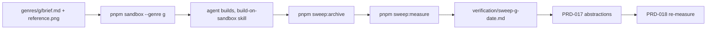

# PRD-016 — The genre sweep: measuring whether the framework gets reached for

**Complexity: 5 → MEDIUM mode** (1-5 files +1, new system +2, tooling across repo +2)

**Depends on:** PRD-013 (templates), PRD-015 (starter). **Blocks:** PRD-017, PRD-018.
**Charter authority:** `CHARTER.md` §12 (the decisive experiment was specified three times
and never run); `AGENTS.md` "Verification honesty", rule 6.

## 1. Context

**Problem:** the only measurement this project has of its own value — does an agent building
a game reach for the framework? — is anecdotal, and the evidence is deleted on every run.

**Files analyzed:** `scripts/make-sandbox.ts`, `.claude/skills/build-on-sandbox/SKILL.md`,
`docs/benchmark/PROTOCOL.md`, `docs/benchmark/RESULTS-2026-08-02.md`,
`scripts/count-loc.ts`, `docs/PRDs/PRD-013-platformer-kit.md` §1.

**Current behavior:**

| Fact | Evidence |
|---|---|
| `pnpm sandbox` **wipes** the target before every run | `make-sandbox.ts:65` — `fs.rmSync(out, { recursive: true })` |
| Nothing is copied back into the repo when a build finishes | no writer anywhere in `make-sandbox.ts` |
| The one measured build result lives in an assistant memory file, not the repo | `sandbox-build-friction-findings` — four framework blockers, none on disk |
| The skill asks for numbers, nothing computes or stores them | `SKILL.md` step 5: "report the numbers when done" |
| Genre coverage is one image | `examples/REFERENCE.png`; `ROADMAP.md` Phase 1 asks for three |
| The AI head-to-head is **VOID** | `CHARTER.md` §12; `RESULTS-2026-08-02.md` |

The fox-game measurement — 1,850 lines, **zero** `@threenative/*` imports — is the number
this PRD makes repeatable. PRD-013 was written to move it. Nobody has re-measured since,
and with the current tooling nobody can: the tree that would carry the answer is deleted.

## 2. Solution

Three small pieces, none of them a package:

- **A genre set.** `docs/benchmark/genres/<genre>/{brief.md,reference.png}` for four
  genres: `platformer` (the control — a template exists), `topdown-action`,
  `endless-runner`, `exploration`. The last three are `ROADMAP.md` Phase 1's reference
  games. A brief is sealed the same way `PROTOCOL.md` seals `game-01.md`: hashed, and the
  hash copied into the run record before the build starts.
- **Archive on the way out.** `pnpm sandbox --genre <g>` writes a `sweep.json` manifest
  into the sandbox, and `pnpm sweep:archive` copies `src/`, `playtests/`, `package.json`
  and the manifest into `docs/benchmark/sweeps/<genre>-<date>/`. Source only — no
  `node_modules`, no build output. This is what stops the evidence evaporating.
- **A deterministic measurer.** `scripts/measure-sandbox.ts` reads an archived (or live)
  sandbox and reports: user source LOC, files importing `@threenative/*`, files importing
  bare `three`, the framework reach rate, and — from the shipped `.d.ts` files — which
  exported symbols were used and which were never touched. It **fails closed**: no `src/`,
  zero source files, or no `node_modules/@threenative` is a throw, never a zero.

**The friction ledger** is the human half, and it is mandatory. Each run writes
`docs/verification/sweep-<genre>-<date>.md` from a template whose required fields are
enforced by a test — a blank field is a red run, not a run with a gap.



### The instrument must be able to say no

A measurement that cannot report "the framework did not help" is not a measurement. Two
rules protect that:

1. `measure-sandbox.ts` never substitutes a default for a missing input. Absent tree,
   empty tree, or absent framework install each throw with the reason.
2. A reach rate of 0 is a valid, publishable result and the ledger template has a row for
   it. The fox-game run scored 0 and that number is why PRD-013 exists.

### Explicitly rejected

| Proposed | Why not |
|---|---|
| Score "code quality" of the sweep builds | Unmeasurable, and `PROTOCOL.md` already owns blind human scoring |
| A new `@threenative/bench` package | Two scripts. Rule 1, and the package cap is 8 |
| Auto-detect "hand-rolled plumbing" | Fuzzy heuristics that pass silently; the friction ledger is written by the builder and gated on completeness instead |
| Fold this into `docs/benchmark/PROTOCOL.md` | That protocol is sealed for the framework-vs-vanilla head-to-head. This measures a different thing and must not perturb the void result |

## 3. Integration Ledger

| # | New thing | Live caller (non-test) | Replaces | Old path removed? | Negative control |
|---|---|---|---|---|---|
| 1 | `--genre` + `sweep.json` | `scripts/make-sandbox.ts` main path; `package.json` `sandbox` script | `--reference <path>` ad-hoc flag | reference flag now derives from the genre | unknown genre → throws; today it silently copies nothing |
| 2 | `pnpm sweep:archive` | `package.json` scripts; run by the `build-on-sandbox` skill step 6 | nothing (evidence was lost) | n/a | archive a sandbox with no `src/` → throws, does not write an empty folder |
| 3 | `scripts/measure-sandbox.ts` | `package.json` `sweep:measure`; `sweep-ledger.spec.ts` reads its output shape | the "report the numbers" prose in `SKILL.md` | prose replaced by the command | empty `src/` → throws; a tree with 0 `@threenative` imports → reports `0`, not an error |
| 4 | `docs/verification/SWEEP-TEMPLATE.md` + schema test | `scripts/__tests__/sweep-ledger.spec.ts` over `docs/verification/sweep-*.md` | freeform notes | n/a | blank a required field → test red |
| 5 | `docs/benchmark/genres/**` | `make-sandbox.ts` resolves brief + reference from here | `examples/REFERENCE.png` as the only subject | still used, as the platformer genre's reference | delete a `brief.md` → the sandbox run throws before the agent starts |
| 6 | `.claude/skills/build-on-sandbox/SKILL.md` steps 1 and 5 | the skill itself, invoked per sweep | untracked, unmeasured runs | yes | skill run without archiving → no ledger file → the day's sweep has no record and phase 4 cannot close |

**Reachability:** operator runs `pnpm sandbox --genre topdown-action` → agent builds under
the skill → `pnpm sweep:archive && pnpm sweep:measure` → a committed ledger with a reach
rate, a list of untouched framework exports, and every API that blocked the build.

## 4. Phases

#### Phase 1: a sweep run is a named, sealed thing

**Files:** `docs/benchmark/genres/platformer/brief.md` NEW ·
`docs/benchmark/genres/topdown-action/brief.md` NEW · `scripts/make-sandbox.ts` EDIT ·
`scripts/__tests__/make-sandbox.spec.ts` EDIT/NEW · `package.json` EDIT.

`--genre <g>` resolves `docs/benchmark/genres/<g>/{brief.md,reference.png}`, copies both
into the sandbox, and writes `sweep.json`: genre, brief SHA-256, template, ISO date,
framework version, and the `sourceLines` leak number the script already computes.

| Test | Assertion | Negative control |
|---|---|---|
| `should write a sweep manifest naming the genre and brief hash` | `sweep.json` hash equals `sha256sum brief.md` | edit the brief → hash changes; a stale manifest fails |
| `should throw when the genre folder has no brief` | throws, sandbox not created | return a default brief → an unsealed run reports as sealed |
| `should throw when the genre folder has no reference image` | throws | skip the check → the agent builds against nothing and the run is unfalsifiable |

The two remaining genre folders land in Phase 4 with their reference images; a genre
without an image cannot be run, and that is the point of the second control.

#### Phase 2: the evidence survives the wipe

**Files:** `scripts/sweep-archive.ts` NEW · `scripts/make-sandbox.ts` EDIT (refuses to wipe
an unarchived sandbox) · `package.json` EDIT · `scripts/__tests__/sweep-archive.spec.ts` NEW.

`pnpm sandbox` gains a pre-wipe guard: if the target holds a `sweep.json` with no matching
folder under `docs/benchmark/sweeps/`, it throws and names the archive command. That guard
is what makes the loss impossible rather than merely discouraged.

| Test | Assertion | Negative control |
|---|---|---|
| `should copy src, playtests and the manifest into the sweep folder` | files present, `node_modules` absent | copy everything → the archive is 300MB and unreviewable in a diff |
| `should throw when the sandbox has no src directory` | throws | write an empty folder → an unbuilt run archives as a real one |
| `should refuse to wipe a sandbox that was never archived` | `pnpm sandbox` throws, tree intact | remove the guard → a second sweep deletes the first one's only copy |

#### Phase 3: the numbers, computed the same way every time

**Files:** `scripts/measure-sandbox.ts` NEW · `package.json` EDIT ·
`scripts/__tests__/measure-sandbox.spec.ts` NEW · `docs/verification/SWEEP-TEMPLATE.md` NEW ·
`scripts/__tests__/sweep-ledger.spec.ts` NEW.

Reported per run: `userLoc`, `sourceFiles`, `frameworkFiles`, `threeOnlyFiles`,
`reachRate = frameworkFiles / sourceFiles`, `usedExports[]`, `unusedExports[]`.
`unusedExports` is the interesting column — it names the surface that shipped and was never
found. The export list is read from `node_modules/@threenative/*/dist/*.d.ts` in the
archived `package.json`'s resolved versions, so it measures the surface the builder
actually had.

| Test | Assertion | Negative control |
|---|---|---|
| `should report a zero reach rate for a tree with no framework imports` | `reachRate === 0`, exit 0 | treat 0 as an error → the fox-game result becomes unrecordable |
| `should throw when the sandbox tree has no source files` | throws | report `0/0` → a run that never happened reads as a run that used nothing |
| `should list an export that the build never called` | a known-unused export appears in `unusedExports` | call it in the fixture → it moves to `usedExports`; both lists must move |
| `should fail a ledger with an unfilled required field` | red on `TBD` or empty | allow blanks → a sweep with no friction record passes as complete |

#### Phase 4: two real sweeps, one of them hard

**Files:** `docs/benchmark/genres/{endless-runner,exploration}/brief.md` NEW ·
`.claude/skills/build-on-sandbox/SKILL.md` EDIT · `docs/README.md` EDIT ·
`docs/verification/sweep-platformer-<date>.md` NEW ·
`docs/verification/sweep-topdown-action-<date>.md` NEW.

**Proof subject:** `topdown-action` — no template exists for it, so every line the agent
writes is a choice between a framework export and plain Three.js. **Control subject:**
`platformer`, where `templates/platformer` exists; the two numbers side by side say whether
the template is doing the work or the packages are.

**Requirements this pair does not exercise:** long-session scene churn (`exploration`) and
procedural streaming (`endless-runner`). Both briefs land in this phase and both are run in
PRD-018 §Phase 2.

| Test | Assertion | Negative control |
|---|---|---|
| Both ledgers exist and pass the schema test | `pnpm test` green with two `sweep-*.md` files | delete a field → red |
| Each ledger's numbers match a re-run of `sweep:measure` on the archive | recomputed values equal recorded ones | hand-edit a number → mismatch is caught |
| `SKILL.md` step 1 uses `--genre`, step 5 names the two commands | grep | — |

## 5. Verification

```sh
pnpm typecheck && pnpm lint && pnpm test && pnpm budgets

# fail-closed proof, pasted into the verification record, not summarised
pnpm sandbox --genre nope                       # expect: throw naming the missing brief
pnpm tsx scripts/measure-sandbox.ts /tmp/empty  # expect: throw, not 0/0

# a real sweep, end to end
pnpm sandbox --genre topdown-action
#   ... agent builds under .claude/skills/build-on-sandbox ...
pnpm sweep:archive && pnpm sweep:measure docs/benchmark/sweeps/topdown-action-<date>

# the wipe guard: create a fresh target, then reuse it before archiving
pnpm sandbox --bare --genre platformer --out ../threenative-unarchived-sweep
# expect: throw, previous sweep unarchived
pnpm sandbox --bare --genre platformer --out ../threenative-unarchived-sweep
```

## 6. Acceptance (consumer-scoped)

- [ ] An operator can run `pnpm sandbox --genre <g>`, hand the folder to an agent, and end
      with a committed ledger that states the reach rate and every API that blocked the build.
- [ ] A sweep's evidence is in the repository after the sandbox is destroyed, and a second
      sweep cannot delete the first one's copy.
- [ ] The measurer reports a reach rate of 0 as a result and a missing tree as an error,
      and both behaviours were observed.
- [ ] Two sweeps are recorded — one genre with a template, one without — and their
      `unusedExports` lists name the framework surface neither build found.
- [ ] `docs/README.md` tells the next reader where sweeps live and what a ledger must contain.
