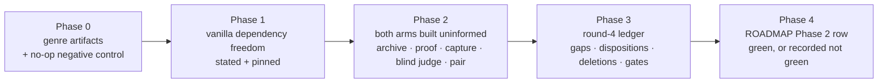

# PRD-061 — round 4: the paired proof Phase 2 has been missing

**Status: COMPLETE, 2026-08-11 — round 4 executed; Phase 2 remains not green; this PRD is not a new runnable round.** The block that
held this PRD since 2026-08-09 is resolved: round 3 stopped on `budget`, and the owner has now
granted one completed round 4. Nothing else blocks it — no device, no credential, no toolchain
beyond what `pnpm test` already requires.

**What the grant does and does not license.** It authorises **one** completed round 4 on the
`physics-puzzle` genre defined in §3, end to end, with its ledger. It does not authorise a
second round, a re-run of a losing arm, or a framework line that no gap row earned.

**Phase 0's first deliverable is clearing the tool gate honestly.** `pnpm round:next` still
prints `stop round 3 / Stop condition recorded: budget`, because it reads the newest round
ledger and round 3's stop condition is a true historical record. **Do not edit round 3's
ledger to clear it** — round 3 did stop on budget, and rewriting that falsifies the evidence
record this project runs on. Clear the gate the intended way: create
`docs/verification/round-4-<date>.md` recording this grant in its `Budget:` field with
`Stop condition met: none yet`, and let `round:next` advance because round 4 is now the latest
round. That ledger is fail-closed — it needs real Arms, Dispositions, Gates and Firewall tables
— so it is written **as round 4 produces each result**, never pre-filled with placeholders to
make a command go green. A ledger authored ahead of its evidence is the exact failure mode this
repository's verification rules exist to prevent.

**Superseded status — NOT STARTED, 2026-08-09, blocked on an owner round-budget grant.** A
2026-08-10 batch run hit this gate and correctly produced a BLOCKED ledger,
`docs/verification/prd-061-round-4-2026-08-10.md`, creating no artifact. That record stands as
the account of the blocked attempt; it is not a round-4 ledger and does not satisfy any
criterion here.

**Complexity: 5 → MEDIUM mode.** One new sealed genre (3 artifacts), one instrument-text
change with a pinned test, one round executed end to end, one ledger.

**Blast radius: 8 repository paths.** `docs/benchmark/genres/physics-puzzle/` (brief,
reference, sealed proof), `scripts/make-sandbox.ts` and its test, `docs/verification/round-4-<date>.md`,
`docs/strategy/ROADMAP.md`. **No package source changes.** A framework line is written only if
a gap row earns one, and only through the ordinary 20-line rule.

**Depends on:** PRD-019 (arms, sealed proof, pair), PRD-020 (capture, blind judge), PRD-021
(round ledger, `pnpm round:next`, `pnpm round:deletions`). All three are shipped.

**The framework's kill switch applies, gameplay is permanently the user's to write, and the
20-line rule applies.** `docs/benchmark/PROTOCOL.md` owns the instrument.

## 1. Why this exists

`ROADMAP.md` lists five beta requirements. Row 3 — *a paired result the vanilla arm cannot
match* — is the Phase 2 exit gate, and **no PRD points at it.** Every other open or planned
PRD (053, 054, 055, 056–060) is native plumbing, distribution or device qualification. The
gate that decides whether anyone should use this framework instead of vanilla Three.js has no
owner. This PRD is that owner.

Phase 2's stated gate: *a capability ships with consumer-scoped proof the paired vanilla arm
cannot match inside the same brief.* Round 3 was the instrument chosen to prove it and the
framework arm lost visual and cost while tying functionally
(`docs/verification/round-3-2026-08-09.md`).

## 2. Why round 3 lost, and what that says about genre choice

Round 3 ran `open-world`. Read the brief: continuous terrain, streaming chunks, a readable
third-person camera, landmarks. **Every one of those is user-space because the framework never
owns the look** — terrain,
camera and look ship as generated source in `src/render/`, not as package code. The framework
arm therefore had nothing 0→1 to spend on that brief, and the comparison collapsed into whose
camera code framed the world better. Vanilla's did.

`OPPORTUNITY-AREAS.md` already states the rule the genre choice broke:

> Abstracting a mature Three.js surface sets a ceiling. Abstracting something Three.js does
> not ship is 0→1.

**The selection rule this PRD adds:** a paired genre is diagnostic only when the sealed proof
**cannot pass without a capability `three` does not ship.** A genre whose proof a competent
developer can satisfy with `three` alone measures authorship, not the framework.

By that rule the shipped 0→1 surface is physics — `RigidBody3D`, `CharacterBody3D`,
`CollisionShape3D`, collision layers (PRD-040), and deterministic fixed-step replay (PRD-036).
That is what round 4 must be built around.

## 3. The genre — `physics-puzzle`

New sealed genre at `docs/benchmark/genres/physics-puzzle/`, same three artifacts every
existing genre has: `brief.md`, `reference.png`, `proof/physics-puzzle.playtest.json`.

The brief demands, in the operator's words, a small playable puzzle where:

| Brief requirement | Framework surface it exercises | What vanilla must obtain or write |
|---|---|---|
| ≥ 30 dynamic bodies that stack, topple and come to rest under contact | `RigidBody3D`, `CollisionShape3D` | a physics backend plus its glue |
| a player who pushes bodies and cannot walk through them | `CharacterBody3D.moveAndSlide` | a character controller against dynamic bodies |
| one body class the player passes through, one it collides with | collision layers (PRD-040) | layer/mask plumbing |
| a goal reached only through simulated contact, never a scripted trigger | `Area3D` + contact signals | contact detection and its event surface |
| the same input sequence reaches the same final state twice in one run | fixed-step + deterministic replay (PRD-036) | a fixed-step loop the render loop cannot perturb |

Each row is a capability the framework ships and a competent developer cannot write in under
20 lines — which is exactly why they are framework rows and not template rows.

**The reference image ships with the brief and is generated for this PRD**, matching the
existing genres' shape; it is a target, not an asset either arm may load.

## 4. The fairness decision that makes the result mean something

**The vanilla arm may install any npm package it chooses, including a physics engine.** The
vanilla scaffold's `AGENTS.md` currently says "Use plain Three.js for rendering and gameplay",
which is ambiguous about dependencies. This PRD makes it explicit rather than changing it.

The reason is the point of the whole exercise: a win produced by forbidding the competitor a
dependency proves nothing about whether anyone should use ThreeNative. If `three` plus 300
lines of Rapier glue matches the framework arm, that is the finding, and it must be recorded
as a loss rather than engineered away. `scripts/make-sandbox.ts` is the only code touched, and
`scripts/__tests__/` pins the wording so a later edit cannot silently re-forbid it.

## 5. What the sealed proof asserts

One scenario, supplied to both arms at test time, never copied into either project. It uses
assertion kinds that already exist in `packages/playtest/src/scenario.ts`:

- `contacts` — the player-to-body and body-to-goal contacts, with `minCount` on the goal.
- `settled` — `minBodies` at rest with a bounded `minMeanPoseDistance` between two steps, so a
  scene that never simulates cannot pass.
- `world.seed` — a fixed seed, so the run is reproducible.
- `states` — the goal state, reached only after the contact step.
- `movement` — the player's own displacement under held input.
- `diagnostics` — zero console, network and runtime diagnostics.

**Fail-closed check, run before either arm is built:** a stub build whose physics step is a
no-op must fail this proof. If it passes, the proof is not measuring physics and the genre is
not ready.

## 6. Phases

**Round 3's stop condition must be cleared first.** `pnpm round:next` currently prints
`stop round 3 — Stop condition recorded: budget`. Round 4 does not start until that resolves.

Phase 2 runs under the PRD-021 firewall: neither arm sees the other, and the ledger carries
the firewall attestation, one brief hash and one proof hash shared by both arms.

## 7. Acceptance criteria

1. `docs/benchmark/genres/physics-puzzle/` holds a brief, a reference and a sealed proof, and
   a no-op-physics build **was observed failing** that proof.
2. The vanilla scaffold states its dependency freedom, and a test in `scripts/__tests__/` fails
   if that sentence is removed.
3. Both arms were built uninformed from the same brief hash and scored against the same proof
   hash, with the firewall attestation recorded.
4. Sealed proof results are recorded for both arms, and the framework arm is **at least equal**
   functionally.
5. Blind polish was scored before reveal, from a critic input containing no arm identifier.
6. `docs/verification/round-4-<date>.md` is complete, its schema test passes, and its gates
   table shows `pnpm typecheck`, `pnpm lint`, `pnpm test` and `pnpm budgets` as actually run.
7. `ROADMAP.md`'s Phase 2 row states the measured outcome — including "still not green" if
   that is what happened, with the evidence path.

**Authored LOC is not an acceptance criterion.** `pnpm sweep:pair` reports it and the ledger
schema requires the cell, so it is recorded as context. It does not gate this PRD and it does
not decide the Phase 2 verdict. Phase 2 asks whether the framework does something the vanilla
arm cannot — not whether it does it in fewer lines. A cost loss here is a fact for the roadmap
score table, not a reason to hold the gate open.

## 8. What this deliberately does not do

- **Ships no framework code by default.** A gap row earns package code only after the 20-line
  rule and a named live caller, exactly as rounds 1–3 handled their dispositions.
- **Touches nothing native.** Round 4 is web-arm only; native parity is PRD-054's gate.
- **Changes no existing genre, archive or published number.** Round 3's losing result stays on
  disk exactly as recorded.
- **Reopens no closed framework questions.**

## 9. Kill switch — the outcome this PRD must be willing to reach

If the framework arm ties or loses on a genre built specifically around its only 0→1
capability, that is the strongest evidence obtainable that Phase 2 cannot be won as currently
scoped. The required response is to record it and reopen the win criteria — **not** to run a
fifth genre, and a sixth, until one wins. **Round 4 runs at most two genres.** Selecting genres
until one produces a win is the failure mode this whole instrument exists to prevent.
