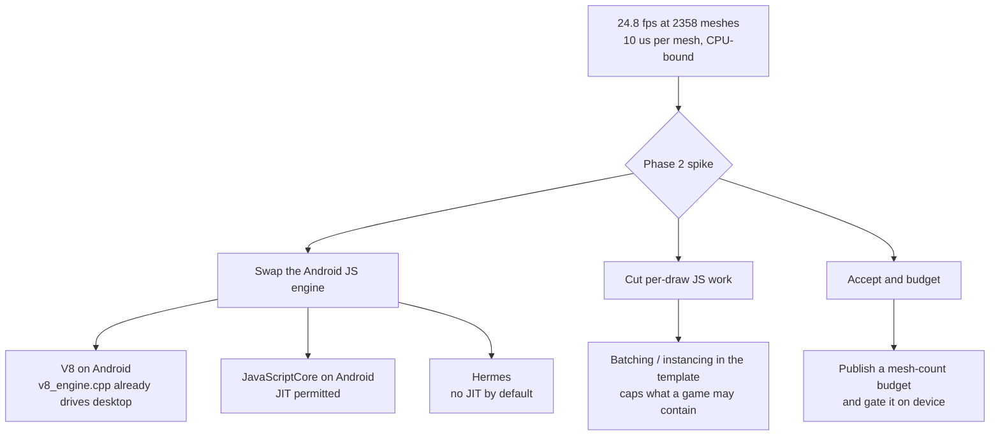

# PRD-066 — Android device frame rate: the debug APK ships an unoptimized interpreter, and QuickJS has no JIT

**Status: ROOT CAUSE MEASURED ON PHYSICAL HARDWARE, 2026-08-10. PHASE 1 LANDED; PHASES 2–5
OPEN.** First physical Android device ever attached to this repository: a Pixel 8 (`shiba`,
serial `37251FDJH0037Z`, arm64-v8a, Android 17, 1080×2400, Mali-G715). Every number below was
executed on it. Nothing here is emulator-derived and nothing here licenses an iOS claim.

**Complexity: 7 → MEDIUM-HIGH mode.** One landed build-flag fix, one engine decision that
needs a spike before it can be scoped, one device frame-rate gate that does not exist yet.

**Blast radius: ~9 repository paths.** `packages/runtime-native/android/app/build.gradle.kts`,
`packages/runtime-native/CMakeLists.txt`, `packages/runtime-native/scripts/`,
`packages/runtime-native/tests/`, `packages/runtime-native/docs/G3-mobile-bring-up.md`,
`packages/runtime-native/docs/G5-profiling.md`, `packages/core/src/` (renderer handle),
`docs/product/PERFORMANCE-BUDGETS.md`, `docs/verification/`.

**Depends on:** PRD-064 deferred device frame rate to Tier 2 and named it device-gated. This
PRD is that Tier 2 measurement, now that a device exists. PRD-058 owns performance thresholds;
this PRD supplies raw device numbers and does not set, tune or waive a threshold.

**Related, deliberately not folded in:** PRD-067 (the game's app config file, orientation included) and the 16 KB
page-alignment row in §7. They were found on the same device in the same session but they are
not frame rate.

## 1. Why this exists

A real game — `~/projects/fox-native`, the 1,950-line Three.js platformer ported in the
2026-08-09 cross-platform probe — was installed on the Pixel 8 and ran at **4.5 frames per
second**. The same source in Chrome on the same machine is fine. The Android emulator lane
never surfaced this because no emulator run ever measured frame rate.

### What was measured

Subject: `fox-native`, 2,755 scene objects of which **2,358 are meshes**. Probe: wall-clock
milliseconds per 30 frames logged from the scene's own frame callback, plus a visibility
ladder that hides a fraction of meshes while leaving traversal and game logic identical, so
the delta is draw submission alone.

| Build | 100% meshes | 50% | 25% | 0% | game logic |
|---|---|---|---|---|---|
| Debug APK as shipped (`-O0`) | **223 ms — 4.5 fps** | — | — | 36.6 ms — 27 fps | 2.9 ms |
| Same APK, native runtime at `-O2` | **40.3 ms — 24.8 fps** | 23.4 ms — 42.7 fps | 17.5 ms — 57 fps | 16.7 ms — 60 fps (vsync floor) | 0.43 ms |

Three consecutive 30-frame samples at 100% meshes on the `-O2` build: 1203 ms, 1211 ms,
1212 ms. Per-mesh cost fell from **79 µs to 10 µs per mesh per frame**.

### What that rules in and out

- **Not the GPU.** During the slow frames `SDLThread` sits at 106–120% CPU in state `R` while
  every `mali-*` thread reads 0.0%. The Mali-G715 is idle. Both builds are CPU-bound on the
  single JS/render thread.
- **Not the host's fixed per-frame cost.** `examples/native-smoke` — one mesh — held 61 fps on
  this device (300 frames in 4.92 s) even in the `-O0` build.
- **Not the game's own code.** Its per-frame callback costs 2.9 ms of the 223 ms, and 0.43 ms
  of the 40.3 ms.
- **Not Three.js, and not the scene.** The identical scene runs acceptably in the browser,
  where the engine is V8.
- **It is the JavaScript engine.** Android is the only target running **QuickJS**; desktop
  runs V8 and the browser runs V8. QuickJS-ng 0.11.0 is compiled from source by this
  repository's own `CMakeLists.txt`, so the APK's build type lands directly on the interpreter
  loop in `quickjs.c`.

### The build-type defect, exactly

`packages/runtime-native/android/app/build.gradle.kts` declared no optimization for the debug
variant, so AGP configured the native build as `CMAKE_BUILD_TYPE=Debug` — `-O0` for QuickJS,
for the WebGPU bindings, and for the whole runtime:

```
android/app/.cxx/Debug/x31201jd/arm64-v8a/CMakeCache.txt
CMAKE_BUILD_TYPE:STRING=Debug
```

**Passing `-DCMAKE_BUILD_TYPE=RelWithDebInfo` through `externalNativeBuild.cmake.arguments`
does not work** — this was tried and rebuilt, and AGP still emitted `CMAKE_BUILD_TYPE=Debug`.
AGP appends its own value last. The mechanism that does work is `cFlags`/`cppFlags`, which
land after the build-type flags:

```kotlin
debug {
    if (!usePrebuiltRuntime) externalNativeBuild {
        cmake {
            cFlags.add("-O2")
            cppFlags.add("-O2")
        }
    }
}
```

Verified reaching the compiler: a fresh CMake config directory with 285 ninja lines carrying
`-O2`, and the APK shrinking from 247,453,337 to 235,740,585 bytes.

**This is Phase 1 and it has landed.** It is the only change in the working tree from this
investigation.

## 2. What is still wrong after Phase 1

24.8 fps is not 60 fps. Roughly 24 ms of every 40 ms frame is still CPU on the JS thread, at
10 µs per mesh. A browser does the same per-mesh work in the low single-digit microseconds.
The remaining gap is QuickJS having no JIT at all.

This is a fork in the road, and **the PRD does not pick the branch — Phase 2 is a spike whose
job is to pick it with numbers.**



**Android permits JIT in-app; iOS does not.** Any engine swap fixes Android and leaves iOS on
an interpreter. Phase 2 must say so plainly rather than implying a shared fix.

`v8_engine.cpp` (1,207 lines) already exists and drives the desktop host, so the V8 branch is
a build-and-port problem rather than a new integration. That is a reason to price it, not a
reason to assume it wins.

## 3. Execution phases

### Phase 1 — build the Android native runtime optimized (LANDED)

- `packages/runtime-native/android/app/build.gradle.kts` — DONE: `-O2` on the debug variant's
  `cFlags`/`cppFlags`, with the comment explaining why the `arguments` route does not work.
- **Still owed by this phase:**
  - A test that fails when the debug variant's native build carries no optimization flag.
    Assert on the generated `build.ninja` or on the configured flags, not on frame rate.
  - Confirm the release variant is genuinely `-O2` or better and say so with a cache dump.
  - Decide whether `usePrebuiltRuntime` prebuilts are optimized. **Unknown and unverified.**
    If the published prebuilt `.so` files were produced by a debug build, every scaffolded
    consumer inherits the 4.5 fps and Phase 1 has not actually shipped.

### Phase 2 — spike: price the three branches on this device

Deliverable is a decision document with measured numbers, not an implementation.

- Measure per-mesh JS cost under each candidate engine on the Pixel 8 with the same
  `fox-native` subject and the same visibility ladder.
- Report arm64 `.so` size delta, build time delta, and third-party dependency footprint.
- State the iOS consequence of each branch explicitly.
- Recommend one branch and name what would falsify the recommendation.

### Phase 3 — implement the chosen branch

Scope is set by Phase 2's output and is deliberately unspecified here.

### Phase 4 — a device frame-rate gate that fails closed

No gate in this repository measures frames per second on hardware, which is why a 50× regression
shipped unnoticed.

- Extend the existing device playtest path so a scenario can assert a frame-rate floor over a
  named frame window on a named physical serial.
- An emulator serial must be **blocked**, never passed — matching how the physics and
  multitouch device paths already refuse to substitute an emulator for hardware.
- A missing or malformed frame observation is a failure, not a skip.
- Negative control: an obviously unreachable floor must exit non-zero, and the control must be
  observed red and recorded.

### Phase 5 — record it

- `packages/runtime-native/docs/G3-mobile-bring-up.md` — the open physical-hardware row gains
  the first real device result: what passed, at what frame rate, on what device.
- `packages/runtime-native/docs/G5-profiling.md` — the numbers in §1.
- `docs/product/PERFORMANCE-BUDGETS.md` — PRD-058 owns the thresholds; this PRD hands over raw
  numbers and must not edit a threshold.
- `docs/verification/` — one dated device evidence file.

## 4. Integration ledger

| # | Thing built | Caller edited so it is reached | What it replaces | When it may claim green | Negative control |
|---|---|---|---|---|---|
| 1 | `-O2` on the debug native build | `build.gradle.kts:171` buildTypes block | an `-O0` QuickJS shipped to every debug install | ninja shows the flag **and** a device run shows the frame time | strip the flag → the Phase 1 test fails |
| 2 | Prebuilt-runtime optimization audit | `scripts/install-prebuilt.mjs` consumers | an assumption nobody checked | a published `.so` is shown optimized | a debug-built prebuilt must fail the audit |
| 3 | Engine decision | Phase 3 scope | "Android is slow" with no owner | Phase 2 numbers exist for every branch | a branch with no measured number cannot be recommended |
| 4 | Device frame-rate assertion | device playtest scenario + runner | no fps gate anywhere | it fails on an emulator serial and on a missing observation | unreachable floor exits non-zero, observed red |
| 5 | Evidence rows | G3, G5, verification ledger | "physical hardware open" with no number | after a device run on a recorded serial | an emulator or simulator input cannot satisfy it |

## 5. Acceptance criteria

- [ ] Phase 1's flag is asserted by a test that fails when the flag is removed.
- [ ] The prebuilt runtime's optimization level is established with evidence, either way.
- [ ] Phase 2 reports a per-mesh microsecond cost on the Pixel 8 for every branch it prices.
- [ ] Phase 2 states, in one sentence each, what its recommendation does for iOS.
- [ ] A device frame-rate assertion exists, is exercised on serial `37251FDJH0037Z`, and its
      negative control was observed red with its exit code recorded.
- [ ] An emulator serial passed to the frame-rate gate exits blocked, not passed.
- [ ] G3 and G5 carry the device numbers; no file says mobile-ready.
- [ ] `pnpm typecheck && pnpm lint && pnpm test && pnpm budgets` passes, and no native
      toolchain becomes part of the default gate.

## 6. Negative controls

| Control | Change | Expected | Status |
|---|---|---|---|
| `no-optimization` | remove `-O2` from the debug variant | Phase 1 test fails; device frame time returns to ~223 ms | **the 223 ms half is already observed** |
| `emulator-serial` | pass `emulator-5554` to the frame-rate gate | blocked, exit 2, before any measurement | not built |
| `unreachable-floor` | assert 240 fps | exit non-zero naming the measured value | not built |
| `missing-frames` | remove the frame observation | failure, never skip | not built |
| `debug-prebuilt` | feed a debug-built `.so` to the audit | audit fails and names the artifact | not built |

## 7. Out of scope, and why

- **Orientation.** The same session found `ctx.viewport.size` reporting **2400×1080 on a
  1080×2400 display**, because the framework's `AndroidManifest.xml` hard-codes
  `android:screenOrientation="landscape"` and a game has no way to declare its own. Camera
  aspect and every pixel-space HUD coordinate are wrong as a result. **PRD-067** owns it.
- **16 KB page alignment.** Android 17 on the Pixel 8 raises a system compatibility dialog
  over the app at launch: `lib/arm64-v8a/libSDL3.so` and `lib/arm64-v8a/libmystral-runtime.so`
  both fail ELF and APK alignment checks. The app runs anyway on this device. Unowned; needs
  its own PRD before a device with 16 KB pages enforced makes it fatal.
- **`renderer.info` is unreachable from game code.** `ctx.renderer` is a framework wrapper
  exposing `domElement, kind, raw, compute, dispose, render, setOutputNode, setSize`; the real
  `WebGPURenderer` is behind `.raw`, so a game cannot read its own draw-call count to diagnose
  a frame-rate problem. Diagnosability, not frame rate. Unowned.
- **Performance thresholds.** PRD-058 owns them.
- **iOS.** No Apple hardware is attached. Nothing here is an iOS result.

## 8. Verification commands

| What | Command | Expected |
|---|---|---|
| Optimization reached the compiler | `grep -c '\-O2' packages/runtime-native/android/app/.cxx/Debug/*/arm64-v8a/build.ninja` | non-zero |
| Device smoke still green | `node packages/runtime-native/scripts/verify-android-first-proof.mjs --device 37251FDJH0037Z` | exit 0, 300 frames, non-blank screenshot |
| Device physics parity still green | `node packages/runtime-native/scripts/verify-android-physics-parity.mjs --device 37251FDJH0037Z` | exit 0, zero-delta comparison |
| Repository gates | `pnpm typecheck && pnpm lint && pnpm test && pnpm budgets` | exit 0 |

## 9. Evidence produced by this investigation

Executed 2026-08-10 on Pixel 8 `37251FDJH0037Z`:

- `packages/runtime-native/artifacts/android/hw-pixel8/first-proof-report.json` — first
  physical-hardware core smoke: 300 frames, markers `TN_NATIVE_SMOKE_THREE:0.185.1`,
  `READY:webgpu`, `FIRST_FRAME`, `300_FRAMES:300`, clean log scan, PID alive through the
  3,000 ms stability window, 1080×2400 screenshot SHA-256
  `66a1269eb610f3ebbb73c2d29f8de5c49147684cc630d04254e72241e64fe8ae`.
- `packages/runtime-native/artifacts/android/physics-parity/normal/` — physical-hardware
  Rapier parity: `pass: true`, `restingPositionMaxAxisDelta: 0`,
  `characterDisplacementDelta: 0`, against the browser WASM reference.
- Frame-rate ladder logcat, both builds, in §1.

**One caveat on the parity run, recorded rather than swept up.** Its first attempt failed a
`diagnostics` assertion on a single log line — `E/InputDispatcher(1622): channel ...
MystralActivity ... Channel is unrecoverably broken` — emitted by `system_server`, not by the
app. `parseAndroidConsole` in `packages/playtest/src/runner/android.ts:228` matches any logcat
line containing `Mystral`, so a system process's error about the app counts as the app's
error. Two later runs passed and the line did not recur, so this is a one-observation
attribution weakness, not a reproducible failure. It is **not** fixed here: narrowing that
filter is exactly the kind of assertion-dropping change the playtest package forbids on a
single observation, and it needs its own evidence before anyone touches it.
