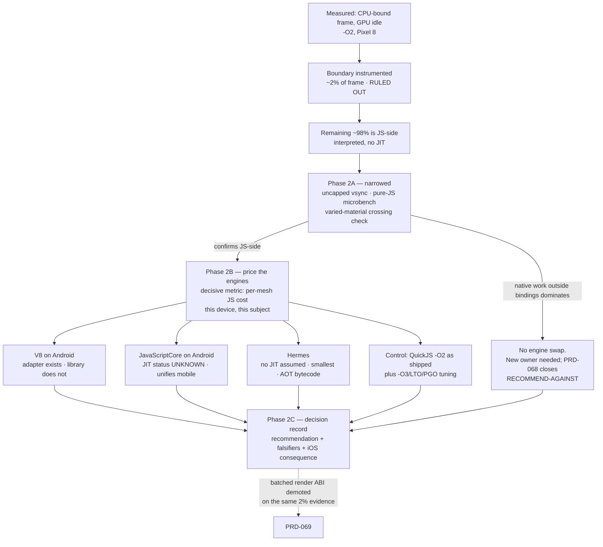

# PRD-068 — The Android JavaScript engine: price V8, JavaScriptCore and Hermes against QuickJS with device numbers

**Status: CLOSED 2026-08-11 — RECOMMEND-AGAINST swapping the engine.** The spike reached the
outcome §14 says it must be willing to reach. On the physical Pixel 8 the shipped QuickJS build
runs the real game at **170 fps** once the scene's draw count drops from ~110 to 17; at ~110 draws
the same build runs it at 57. The interpreter is not the binding constraint for this game, so no
engine is ported and none of V8, JavaScriptCore or Hermes carries a measured per-mesh figure — each
is recorded UNMEASURED with that reason in §15. Evidence:
`docs/verification/native-gameplay-frame-rate-2026-08-11.md`. **The residual is per-draw
JavaScript cost, ~118 µs per draw, which PRD-069 and PRD-072 own.**

**The draw-count lever was then pulled, and it closed the gate this spike was serving.** Folding
camera-parented overlays into one draw per material instance — 76 HUD meshes to 11 draws — took
the same QuickJS build from 55–71 fps while driven to **83–116 fps, zero of 253 windows below 60**,
with the picture unchanged to a hue distance of 0.0074. That is the result an engine port was
being considered to buy, obtained without one.

**Superseded framing, kept because the reasoning still holds:** everything below was written while
the split between interpreter speed and draw count was open. Its measurements stand; its
recommendation in §7 does not, and §15 records why.

Filed 2026-08-10. This is PRD-066 Phase 2 written out: a spike whose deliverable
is a decision backed by measurements on one named physical phone, not an engine port. **No engine
is chosen by this document.** It defines what must be measured, what each answer would mean, and
what would falsify the recommendation it does make.

**Updated 2026-08-10 with a second device measurement: the JS→C++ render-command boundary was
instrumented and is roughly 2% of a CPU-bound frame.** The boundary is ruled out. That moves the
engine swap from *one option among several* to **the primary lever**, and it retires the
top-ranked row of the hypothesis document rather than merely questioning it. See §1.2 and §2.

**Complexity: 7 → MEDIUM-HIGH mode.** One narrowed attribution experiment, three candidate
engines with unequal integration cost, one dependency-plumbing question that may disqualify the
front-runner outright, and a size budget nobody has stated.

**Blast radius during the spike: ~6 repository paths**, all of them measurement scaffolding —
`packages/runtime-native/scripts/`, `packages/runtime-native/CMakeLists.txt` (engine options),
`packages/runtime-native/android/app/build.gradle.kts` (engine flag pass-through),
`packages/runtime-native/src/js/engine_factory.cpp`,
`packages/runtime-native/docs/G5-profiling.md`, `docs/verification/`. Phase 3 of PRD-066 owns
the actual port and is not scoped here.

**Depends on:** PRD-066, which measured the problem and landed the `-O2` fix that is Phase 1
there. This PRD is its Phase 2 and duplicates neither its Phase 1 build-flag work nor its
Phase 4 device frame-rate gate. PRD-058 owns performance thresholds; this PRD produces raw
numbers and sets no threshold.

**Sibling:** PRD-069 (per-draw cost) is being revised on the same 2% boundary measurement, which
demotes its batched-command ABI proposal. The two PRDs must not both claim the residual.

**Supersedes, in part:** `docs/architecture/NATIVE-PERF-BOTTLENECKS.md`. See §2.

---

## 1. What was measured, and on what

Every number below was executed on a physical **Pixel 8** (`shiba`, serial `37251FDJH0037Z`,
arm64-v8a, Android 17, 1080×2400, Mali-G715) on **2026-08-10**. Nothing here is
emulator-derived, and nothing here is an iOS result — no Apple hardware is attached to this
repository, and the hosted `macos-15` runner produces simulator-class evidence only.

### 1.1 The frame-rate ladder

Subject: `fox-native`, a 1,950-line Three.js platformer — **2,755 scene objects, 2,358 meshes**.

| Build | 100% meshes | 50% | 25% | 0% | game callback |
|---|---|---|---|---|---|
| Debug APK as shipped (`-O0`) | 223 ms — 4.5 fps | — | — | 36.6 ms | 2.9 ms |
| Same APK, native runtime at `-O2` | 40.3 ms — 24.8 fps | 23.4 ms | 17.5 ms | 16.7 ms | 0.43 ms |

Supporting observations:

- `examples/native-smoke` with **2 meshes** holds **61 fps** on this device even at `-O0`. The
  host's fixed per-frame cost is not the problem.
- `examples/native-smoke` with **2,000 all-visible meshes** at `-O2` runs 300 frames in
  **28,555 ms — 95.2 ms/frame, 10.5 fps**.
- During slow frames the single `SDLThread` sits at **106–120% CPU in state `R`** while every
  `mali-*` thread reads **0.0%**. CPU-bound; the GPU is idle.
- The identical fox scene in Chrome on the same machine is fine. Chrome is V8.
- QuickJS-ng 0.11.0 is compiled **from source** by this repository's `CMakeLists.txt` around
  line 446, so the APK's build type lands directly on the interpreter loop in `quickjs.c`.
- The per-draw C++ bindings in `src/webgpu/bindings.cpp` — `setPipeline`, `setBindGroup`,
  `draw`, `drawIndexed`, `setVertexBuffer`, `setIndexBuffer` — are thin: a couple of `toNumber`
  calls plus the `wgpu` call. `queue.writeBuffer` has no per-call allocation on the aligned path.

### 1.2 The boundary, instrumented — and ruled out

Those six render-pass command bindings were given a per-crossing timer, with a frame boundary
hook at `queue.submit`. Executed on the same device, native runtime at `-O2`, subject
`examples/native-smoke` with N extra all-visible boxes:

| N boxes | frame (ms) | crossings per submit | ms in bindings per submit | submits/frame | **bindings share of frame** |
|---|---|---|---|---|---|
| 500 | 22.45 | 441 | 0.21–0.22 | ~2.1 | **~1.9%** |
| 600 | 29.27 | 546 | 0.36–0.38 | ~2.1 | **~2.5%** |

**Time inside the JS→C++ render-command bindings is roughly 2% of the frame. The FFI boundary is
measured and ruled out as the bottleneck.** The remaining ~98% of a CPU-bound frame is
JavaScript-side work — Three.js render-list build and sort, node and binding refresh, per-object
matrix updates and culling — executing as QuickJS bytecode with no JIT.

Three honest qualifications, none of which changes the conclusion:

- **This subject's shape flatters the boundary.** The clones share one geometry and one material,
  so Three.js issues roughly `setBindGroup` + `drawIndexed` per object — about **1.8 crossings
  per mesh per frame**. A real game with varied materials crosses more often per draw, so **2% is
  a floor for this subject shape, not a universal figure.** Even at **four times** the crossing
  count the boundary stays under 10% of the frame, which is why the conclusion survives the
  caveat rather than depending on it.
- **Per-crossing cost is not constant between the two points.** 0.215 ms / 441 = ~0.49 µs at
  N=500; 0.37 ms / 546 = ~0.68 µs at N=600 — about 39% higher per crossing at the larger scene,
  plausibly cache pressure or timer overhead. At 2% of the frame it does not matter, and it is
  recorded so nobody later treats 0.49 µs as a constant.
- **The counter tracked the scene.** Crossings scaled 441 → 546 per submit as boxes went
  500 → 600, i.e. ~2.2 additional crossings per added box against an expected ~1.8–2. That is a
  self-consistency check, **not** the blind control in §11, which is still owed.

### 1.3 What is ruled out

**Not to be re-litigated:** the GPU, the host's fixed frame cost, the game's own code, Three.js
itself, the scene, **and now the render-command FFI boundary at ~2%**. Also **three-mesh-bvh**,
which accelerates raycasting and intersection, lives in `packages/core/src/picking.ts` for scene
picking, and is irrelevant here — the `native-smoke` subject performs no picking at all and still
runs at 10.5 fps.

**What that leaves is interpreted JavaScript execution.** Everything downstream in this PRD
follows from that, and §8 states what would take it back.

---

## 2. Where measurement contradicts the hypothesis document

`docs/architecture/NATIVE-PERF-BOTTLENECKS.md` says of itself, correctly, that **nothing in it
is measured**. Now that something is, two of its rows need correcting rather than citing.

| Its claim | What the device showed |
|---|---|
| **Per-command JS→C++ FFI is the top item** — 🟡 effort, ⭐⭐⭐⭐⭐ impact, the single biggest recovery available | **Wrong, and now measured wrong.** Time inside those exact bindings is **~2% of the frame** (§1.2). Batching the boundary perfectly would recover about half a millisecond of a 22–29 ms frame. This row must be rewritten, not re-ranked. |
| **"QuickJS has no JIT" is 🔴 — weeks of work, do it only if a profile shows interpreter cost dominates** | **The profile now exists and it says exactly that.** The condition the document set for reaching for this row has been met. It is no longer the expensive last resort; it is the only large item left standing. |
| The interpreter's **build optimization level** | **Absent from the document entirely**, and it was worth 223 ms → 40.3 ms — a 5.5× frame-time recovery from one compiler flag. |

**The ranked list was inverted at both ends.** Its ⭐⭐⭐⭐⭐ top item is worth ~2%; the item it
omitted entirely was worth 5.5×; and the 🔴 row it advised against touching is where the
remaining ~98% lives. A reader following it in order would have spent a week batching the
render ABI to recover half a millisecond.

The lesson to carry into this spike is the document's own: a ranked list of guesses ranks
guesses. **Nothing below may be recorded as a finding without a run.**

### What the ladder does and does not settle

The parent PRD reports **79 µs → 10 µs per mesh per frame**. That derivation is
`(223 − 36.6) / 2358` and `(40.3 − 16.7) / 2358` — marginal cost over the 0%-visible rung. It is
worth stating what that arithmetic assumes, because the spike's methodology depends on it:

- **The bottom two rungs are vsync-clipped.** 16.7 ms *is* the 60 Hz frame period. At 0% visible
  the app is waiting on the display, not finishing work, so the true fixed cost is **≤ 16.7 ms**
  and unknown. The 10 µs figure is therefore a **lower bound**, not a measurement.
- **The only unclipped delta is 100% → 50%:** `(40.3 − 23.4) / 1179` = **14.3 µs per rendered
  mesh**. The 50% → 25% delta gives 10.0 µs and the 25% → 0% delta gives 1.4 µs, which is the
  clipping becoming visible.
- **The two subjects disagree by roughly 3×.** `fox-native` spends 17.1 µs per mesh amortized
  (40.3 / 2358); `native-smoke` at 2,000 meshes spends **47.6 µs** (95.2 / 2000). Marginal over
  the same assumed floor: 10.0 µs against 39.3 µs.

- **Per-mesh cost is not even constant within one subject as N grows.** The §1.2 runs give a
  marginal cost of `(29.27 − 22.45) / 100` = **68 µs per added box** between N=500 and N=600 —
  against `fox-native`'s 10–14 µs and `native-smoke`-at-2,000's 39–48 µs. Three subjects, three
  different per-mesh costs, spanning roughly 7×.

The last two rows are the most interesting unexplained thing in the data set, and the second one
now points somewhere specific. When PRD-068 was first filed, a simpler scene costing **more** per
mesh looked like a per-draw state-change story. **The §1.2 instrumentation rules that reading
out** — the boundary is flat at ~2% across both N, so the superlinear growth is happening
entirely on the JavaScript side. Render-list building and sorting is `O(n log n)` at best, and
allocation and cache behaviour degrade with scene size on an interpreter. **That strengthens the
engine-swap thesis rather than complicating it**: the part of the frame that grows worse than
linearly with mesh count is the part a JIT would compile.

**"Microseconds per mesh" is still not a constant.** Any number this spike produces is a number
for *one named subject at one named mesh count*, and the spike must report the curve, not a
point.

**Consequence for methodology, binding on Phase 2A:** measurements must be taken with vsync
uncapped or offscreen, so the fixed cost is observable rather than hidden under the display
clock. A ladder whose bottom rung reads 16.7 ms has not measured its bottom rung.

---

## 3. Where the residual actually is

The residual ~23.6 ms of CPU per frame at `-O2` has three possible occupants, and an engine swap
addresses only the first:

| # | Occupant | Status |
|---|---|---|
| 1 | **JavaScript execution** — Three.js per-object matrix updates, frustum culling, render-list build and sort, node and binding refresh, running as interpreted bytecode | **~98% of the frame, by elimination from a direct measurement of occupant 2** |
| 2 | **Boundary crossings** — the per-command FFI into `bindings.cpp` | **~2%. Measured directly (§1.2). Ruled out.** |
| 3 | **Native-side work outside those bindings** — `wgpu-native` submit, validation, surface present | **Not separately measured.** Bounded above by the ~98% that is not occupant 2, and partly included inside it wherever a `wgpu` call sits within a timed binding |

**This is the finding that reorders the whole PRD.** When it was first filed, the split between
occupants 1 and 2 was the open question and Phase 2A existed to answer it. It is answered. What
remains is the narrower question of how much of the ~98% is occupant 1 versus occupant 3 — and
occupant 3 has no obvious mechanism for consuming 20+ ms of CPU on a scene the GPU renders while
sitting idle.

**The arithmetic that matters for every branch below.** An engine swap recovers
`(1 − 1/speedup) × occupant 1`. At occupant 1 ≈ 90% of the frame and a 5× speedup on that work,
40.3 ms → 11.0 ms, which clears 60 fps. At the same 90% and a 2× speedup, 40.3 ms → 22.4 ms —
45 fps, better but short. **The share is now known to be large; the speedup is the unknown, and
it is exactly what Phase 2B measures.**

---

## 4. The branches, priced

**The decisive number, and it is one number.** Because the cost is now localised to interpreted
JavaScript execution rather than to the boundary, the single figure each candidate must produce
is **per-mesh JS cost on this device, on the same subject, at the same mesh count**. Everything
else in the tables below — size, build time, dependency shape, iOS consequence — is a tie-breaker
or a disqualifier. **An engine that does not move that number does not solve this problem,
whatever its other merits.** A branch may be rejected on any other row; it may only be
*recommended* on that one.

Every cell marked **ESTIMATE** is a guess and is labelled so deliberately. Replacing each with a
measured number is this spike's deliverable; a branch still reading ESTIMATE at Phase 2C cannot
be recommended.

**Size baseline, measured on disk 2026-08-10** from
`android/app/build/intermediates/cxx/RelWithDebInfo/im323d1m/obj/arm64-v8a/libmystral-runtime.so`:
63,017,896 bytes unstripped, **17,574,040 bytes stripped**, of which **`.text` is 10,515,456
bytes**. The debug APK is 235,740,585 bytes. Deltas below are against the stripped figure,
because debug info dominates the unstripped one and would swamp the comparison.

### 4.1 V8 on Android

| | |
|---|---|
| **Expected per-mesh change** | ESTIMATE, 3–10× on occupant 1. **With occupant 1 now measured at ~98% of the frame, that estimate translates almost directly into frame time** — unlike when this PRD was first filed, there is no longer a large boundary term diluting it. Chrome on this same device runs the identical scene acceptably, which bounds the JS-execution ceiling from above. The recovery is still ESTIMATE until Phase 2B runs it. |
| **arm64 `.so` delta** | ESTIMATE **+15 to +25 MB stripped** — i.e. the runtime roughly triples, since its entire current `.text` is 10.5 MB. A monolith V8 with `v8_enable_i18n_support=false` and an embedded snapshot is the configuration to price. |
| **Build time / dependency cost** | **The cheapest provenance gate survives narrowly.** `v8-android-jit-nointl@11.1000.4` is a direct npm tarball with SHA-256 `46870658adfe0f6eaa4819226af37a25663bd54599304dd7d7c91ed1089dae9e`. It contains headers, an arm64 `libv8android.so` (15,507,808 bytes), and an external snapshot. It is V8 10.0.139.9 from 2023, built with NDK r23c, not the repository's V8 13.1.201.22 pin. `download-deps.mjs` can extract the tarball but still needs explicit hash enforcement and AAR normalization. No maintained matching V8 13 Android artifact was found. Building current V8 from source remains a separate dependency mechanism. **Build time is UNMEASURED.** |
| **Integration effort** | **Lowest of the three, conditional on a library existing.** `src/js/v8_engine.cpp` is 1,207 lines, already implements `mystral::js::Engine`, and already drives the desktop host. The Android work is: a CMake branch for the arm64 library alongside the existing one at `CMakeLists.txt:498`; flipping `MYSTRAL_USE_V8` in the `elseif(ANDROID)` block at `CMakeLists.txt:95–100`; the matching `-DMYSTRAL_USE_V8=OFF` in `android/app/build.gradle.kts:153`; an Android arm in `engine_factory.cpp:35`. One real code question: `v8_engine.cpp:47–48` calls `InitializeICUDefaultLocation("")` and `InitializeExternalStartupData("")`, which assume a monolith carrying its own snapshot — a build that externalizes the snapshot needs the blob staged as an APK asset and those two calls changed. **Days, not weeks, if the library exists.** |
| **Compounding risk** | The 16 KB page-alignment row already open in PRD-066 §7 — `libSDL3.so` and `libmystral-runtime.so` both currently fail ELF and APK alignment checks on this device. Adding a large prebuilt third-party static library does not make that easier. |

### 4.2 JavaScriptCore on Android

| | |
|---|---|
| **Expected per-mesh change** | **UNMEASURED, but the cheapest disqualifier survives.** `jsc-android@294992.0.0` builds arm64 with baseline JIT enabled, C-loop disabled, and DFG/FTL disabled. It is not an interpreter-for-interpreter artifact, but baseline-JIT presence predicts no device result; runtime activation and the per-mesh figure still require the Pixel run. |
| **arm64 `.so` delta** | ESTIMATE **+6 to +10 MB** for `libjsc.so`. Smaller than V8, larger than Hermes. |
| **Build time / dependency cost** | **Lowest plumbing cost of the three.** The exact tarball is pinned at SHA-256 `2571ee361cd3700d86cc31686431b89cafac0540aa3fb320eb3015be1aa05dd2`; its AAR contains a 19,896,032-byte stripped arm64 `libjsc.so`. This repository already extracts native libraries out of an AAR for SDL3, so the mechanism exists. **Integration build time is UNMEASURED.** |
| **Integration effort** | **Higher than V8 and for a subtle reason.** `src/js/jsc_engine.mm` is 661 lines of Objective-C++ compiled only under `APPLE`, against Apple's `JavaScriptCore.framework` headers. The JSC **C** API (`JSValueRef`, `JSObjectRef`, `JSContextRef`) is the same on `jsc-android`, so the logic ports — but the file is `.mm`. A second Android-only JSC engine file would be a fork of a shared class, and a fork diverges silently, which this repository does not permit. The honest cost is therefore **a refactor of `jsc_engine.mm` into a platform-neutral `.cpp` core plus a thin Apple-only shim** — more invasive than V8's flag flip, and it touches the file that currently carries the iOS target, whose only gate is a CI-hosted simulator lane. |
| **Distinct upside not shared by V8** | It makes Android and iOS the **same engine**, so an engine-semantics difference between the two mobile targets becomes impossible by construction. That is a correctness argument. It is not a frame-rate argument. |

### 4.3 Hermes

| | |
|---|---|
| **Expected per-mesh change** | **Probably little to none on steady-state throughput, and the spike should expect to disprove this branch rather than adopt it.** Hermes is designed for startup time and memory on mobile, not for peak throughput on hot numeric loops, which is exactly what a Three.js scene traversal is. A Hermes JIT exists in upstream work but is not something to bet a port on without a measurement on this device. **Measure it anyway** — a cheap negative result is worth having written down, and if Hermes' register-based interpreter beats QuickJS's meaningfully, that is a real finding. |
| **arm64 `.so` delta** | ESTIMATE **+2 to +3 MB** — by far the smallest. |
| **Build time / dependency cost** | Available as a prebuilt `libhermes.so` in Maven artifacts, or buildable from source with plain CMake and no `depot_tools`. **The only branch that is buildable from source inside this repository's existing toolchain**, which matters if pinned-prebuilt provenance turns out to be unacceptable. |
| **Integration effort** | **Highest, but the external-memory correctness gate survives.** Hermes `v0.13.0` passes the exact `MutableBuffer::data()` pointer to an external ArrayBuffer, retains the buffer wrapper until finalization, and constructs `Float32Array` views over that backing store without copying. The adapter must still preserve the native allocation's lifetime, alignment and synchronization contract. It remains a new `facebook::jsi` adapter of roughly 600–1,000 lines with no existing code to start from. |
| **Distinct upside** | AOT bytecode (`hbc`) is native to Hermes, which would also close the cold-start row that `NATIVE-PERF-BOTTLENECKS` ranks 🟢/⭐⭐⭐. And it is the **only** branch with any plausible iOS story — see §5. |

#### 4.3a Static Hermes (AOT to native) — a separate question, and the only one that could touch iOS

Raised in review, and it is not the same branch as §4.3. Static Hermes (`shermes`, the
`static_h` line of work) compiles JavaScript **ahead of time to C and then to machine code
through LLVM**, rather than to bytecode for an interpreter. If that worked on the shipped
bundle, the framing this whole PRD inherits — *pick the least-bad interpreter for Android, and
accept that iOS has none* — would be the wrong framing, because **AOT output is ordinary native
code and needs no JIT entitlement from anybody.** That is the one idea on the table that
contradicts §5's premise rather than working around it, which is why it is written down here
instead of dismissed.

Everything that follows is unverified in this repository and none of it is a plan.

**What was actually checked here, today, and it removes the most-cited objection.** The
standing worry is that Three.js needs runtime code generation, which AOT cannot serve.
`three@0.185.1` as pinned contains **zero occurrences of `new Function(` and zero of `eval(`**
in `build/three.webgpu.js`, and none anywhere in `build/` or `src/` — checked by grep on
2026-08-10. So the TSL/`Fn()` dynamic-codegen objection does not apply at the version this
repository ships. It could apply at a later version, which makes it a thing to re-check on
upgrade, not a thing to fear now.

**What is unknown, in the order that would kill the branch soonest:**

1. **Does untyped JavaScript gain anything?** Static Hermes' headline numbers come from typed
   source it can compile to unboxed native operations. Three.js is untyped, dynamically shaped,
   megamorphic JavaScript at runtime; the compiler's fallback for that is closer to an
   interpreter's semantics than to the microbenchmark figures. **The plausible outcome is a
   modest gain, not a JIT-class one**, and this must be measured on scene-traversal-shaped code
   before anything else is considered.
2. **Is it usable at all?** It is research-stage, not a shipped product. A third-party
   comparison in April 2026 reported it not cleanly installable through standard package
   managers. A toolchain that cannot be pinned and reconstructed by `download-deps.mjs` is a
   toolchain this repository cannot depend on, whatever it benchmarks at.
3. **Same disqualifier as §4.3.** It reaches the embedder through the Hermes/JSI shape, so the
   external-ArrayBuffer question that gates §4.3 — no-copy `newArrayBufferExternal` and
   `createFloat32ArrayView` adequate for `readVisibleTransforms` — gates this identically. If
   §4.3 dies on that, this dies with it.
4. **Can it emit a linkable arm64 static library** for Android and for iOS that this host's
   CMake can consume, and does an AOT-compiled bundle still satisfy `verify-bundle.mjs`'s
   one-file, import-free contract? Unknown.

**The bounded spike, and it is deliberately small.** Compile the existing bundle with `shermes`
**on desktop only**, run the same scene-traversal microbench Phase 2A defines, and compare
against QuickJS `-O2`, Hermes and V8 on that one number. If untyped JavaScript does not clear
Hermes' own interpreter by a wide margin, the branch is closed there for a day's work and never
touches a phone. If it does, it earns its own PRD — not a widening of this one.

**Ranking, stated plainly so this does not quietly jump the queue:** below every branch in §4,
and behind Phase 2A. An unmeasured research compiler does not outrank an unanswered attribution
question, and this PRD's whole argument is that attribution comes first.

### 4.4 Control branch: QuickJS as shipped, tuned

Not an engine swap, and it must be measured alongside the three so the others have something
honest to beat.

- `-O3`, LTO, and a profile-guided build of `quickjs.c` specifically. The `-O0 → -O2` step was
  worth 5.5×; the `-O2 → -O3/LTO/PGO` step is worth **an unknown and probably much smaller**
  amount, and finding out costs a build rather than a port.
- Bytecode precompilation via `JS_ReadObject`. The host only ever calls `JS_Eval`
  (`src/js/quickjs_engine.cpp`). **This is launch time only — zero steady-state frame time** —
  and is listed here so nobody mistakes it for a frame-rate fix.
- **This branch is the denominator.** Every candidate's number is reported as a ratio against
  the tuned QuickJS build on the same subject, not against the `-O0` build. Comparing a
  candidate to `-O0` would manufacture a 5.5× improvement that the `-O2` flag already shipped.

---

## 5. What each branch does for iOS, plainly

**Android permits a process to map executable memory and JIT its own code. iOS does not, for
anything other than WKWebView. No engine swap fixes both platforms.** Stating that once, at the
top, is the point of this section.

| Branch | iOS consequence |
|---|---|
| **V8 on Android** | **Nothing for iOS.** iOS keeps JSC and keeps running interpreted. V8 on iOS would also be jitless, so it is not even a lateral move — it would be a large binary with none of the upside. The engine matrix widens to V8 (desktop + Android), JSC (iOS), QuickJS (retired or fallback), which is three adapters to keep semantically identical instead of two. |
| **JavaScriptCore on Android** | **Nothing for iOS frame rate.** iOS already runs JSC and already has no JIT; this branch changes Android to match iOS, not the other way round. What it buys iOS is indirect: one adapter serving both mobile targets means a semantic divergence between them cannot happen silently. |
| **Hermes** | **The only branch with a possible iOS effect, and it is possible, not measured.** Hermes can replace JSC on iOS as well, so if its interpreter plus AOT bytecode beats interpreted JSC, iOS gains something. **This repository cannot check that.** No Apple hardware is attached; the hosted `macos-15` runner produces simulator-class evidence, and a simulator frame rate is not a phone frame rate. Any iOS number from this branch is a simulator number until a phone exists, and must be labelled as one. |
| **Static Hermes AOT (§4.3a)** | **The only line of work whose iOS story is not "still an interpreter", and it is unmeasured research tooling.** AOT-compiled machine code needs no JIT entitlement, so the platform rule above stops being the binding constraint — *if* untyped Three.js gains anything from it, *if* the toolchain can be pinned, and *if* it can emit a linkable arm64 library. Three ifs, none checked, and no Apple hardware here to check the last one on. Nothing in this PRD depends on it |
| **Control (QuickJS tuned)** | **Nothing for iOS** — iOS does not run QuickJS. |

**No branch below may be described as improving mobile performance.** The accurate sentence for
every one of them is "improves Android; leaves iOS on an interpreter." §4.3a is the only entry
that could ever earn a different sentence, and it will not earn one from this PRD — it has no
number on any device, and an iOS claim from this repository would be a simulator claim even if
it did.

---

## 6. Execution phases

### Implementation progress — 2026-08-10

The repository now has a default-off Android profiler, a fail-closed measurement runner, an
uncapped-present path, and a configurable `native-smoke` subject. Development runs on
`emulator-5554` proved the marker schema, stale-bundle protection, vsync switch, busy-loop timer
control, and packaged-library size extraction. Every emulator report is written below
`.runtime/`, carries `acceptanceEligible: false`, and is not a finding for this PRD.

The native LOC review trigger is already exceeded repository-wide. This spike adds measurement
code rather than a framework abstraction: no public API, package, dependency, or default native
gate was added, and profiling compiles out unless explicitly enabled. The kill-switch review
removed an attempted extra-draw control because a native draw would not truthfully prove an extra
JavaScript crossing. The remaining instrumentation is the minimum needed to produce the required
split and fail-closed artifact; candidate engine ports remain out of scope.

### Phase 2A — narrowed: confirm the ~98% is JavaScript, not native work outside the bindings

**Most of this phase has already executed.** The boundary is instrumented and measured at ~2%
(§1.2), which was the phase's largest and most uncertain deliverable. What follows is what is
still owed.

**Done, on serial `37251FDJH0037Z`:**

- [x] **Per-crossing timing on the six render-pass command bindings**, with a frame boundary hook
      at `queue.submit`. Result: ~1.9% at N=500, ~2.5% at N=600 (§1.2).
- [x] **Crossings per frame.** ~441 and ~546 per submit at ~2.1 submits/frame — roughly 1.8
      crossings per mesh for a shared-geometry, shared-material subject.

**Still owed:**

- [ ] **Uncapped-vsync frame timing.** Re-run the visibility ladder with the display clock out of
      the way, so the 0% rung reports actual CPU cost instead of 16.7 ms. Until this exists the
      fixed cost is unknown and every per-mesh figure in §2 is a bound rather than a value.
- [ ] **Pure-JS microbenchmark, no FFI.** A fixed numeric/object workload representative of scene
      traversal — matrix compose and multiply over 2,358 dummy objects — run in the device
      runtime under QuickJS `-O2`, and the same workload run in Chrome on the same device. **The
      ratio is the ceiling on what any JIT can recover here**, and with occupant 1 at ~98% it is
      close to a prediction of the whole frame-time recovery. This is now the phase's most
      valuable remaining measurement.
- [ ] **The varied-material crossing check.** Re-run the §1.2 instrumentation on a subject with
      distinct materials per object, to establish how far above 1.8 the crossings-per-mesh figure
      goes for a realistic game. **The conclusion holds up to 4× — the point is to record where
      the real number sits, not to reopen the question.**
- [ ] **Native work outside the timed bindings.** Bound `queue.submit`, validation and present.
      No mechanism is known that would let these consume 20+ ms while the GPU reads 0.0%, so the
      expected result is "small" — but expected is not measured.

**Exit condition:** the occupants sum to the measured frame within a stated tolerance, or the
shortfall is named as a further unknown. **A split that does not add up is not a finding.**

### Phase 2B — price the branches on this device

Reached unless Phase 2A's remaining items overturn the §1.2 result — that is, unless native work
outside the instrumented bindings turns out to dominate. In that case this PRD closes
RECOMMEND-AGAINST and the problem gets a new owner. **It no longer branches to "batch the render
ABI": that path is closed by the 2% measurement, and PRD-069 is being revised accordingly.**

**Per branch, all on serial `37251FDJH0037Z`, same APK bundle, same subjects, same ladder:**

- [ ] Frame time at 100% / 50% / 25% / 0% meshes, **uncapped**, both subjects
- [ ] Marginal microseconds per rendered mesh, derived from the unclipped 100% → 50% delta
- [ ] Cold-start time to first frame, five launches, p95
- [ ] Stripped arm64 `.so` bytes and `.text` bytes, against the 17,574,040 / 10,515,456 baseline
- [ ] Peak RSS during the 300-frame run
- [ ] Clean-build wall-clock time and the dependency artifact it needs, with its pinned URL
- [ ] The engine's own `Engine::getName()` string, recorded in the artifact

**Order, cheapest disqualifier first:**

1. **JSC JIT status.** One question, answerable without building anything: does the candidate
   `jsc-android` artifact have its arm64 JIT enabled? A "no" removes the branch from contention
   at essentially zero cost.
2. **Hermes external-ArrayBuffer viability.** Does JSI expose a no-copy external buffer path
   adequate for `newArrayBufferExternal` and `createFloat32ArrayView`? A "no" disqualifies the
   branch on correctness before any measurement.
3. **V8 arm64-Android library provenance.** Does a pinnable artifact exist that fits
   `download-deps.mjs`? A "no" makes the front-runner conditional on a new dependency mechanism,
   which is a scope change the owner has to accept explicitly.
4. Then measure whatever survives.

**Cheapest-gate result, 2026-08-10:** none is eliminated. JSC's published arm64 artifact has
baseline JIT enabled; Hermes has a genuine no-copy external ArrayBuffer path; and V8 has a
pinnable but stale V8 10 shared-library artifact. These are dependency and API findings only.
All three device-performance rows remain **UNMEASURED**.

### Phase 2C — the decision record

**Files:** `docs/verification/android-js-engine-spike-<date>.md` — NEW;
`packages/runtime-native/docs/G5-profiling.md` — EDIT: the Phase 2A split and the branch table;
`docs/architecture/NATIVE-PERF-BOTTLENECKS.md` — EDIT: replace the two rows corrected in §2 with
measured ones and mark the rest still-unmeasured.

The record states one recommendation, the numbers behind it, the falsifiers from §8 with their
observed status, and one sentence per branch on what it does for iOS. **A branch with no measured
number appears in the record as UNMEASURED and cannot be recommended** — that is PRD-066's
integration-ledger row 3, restated.

---

## 7. Recommendation, stated now and conditional

**Recommend V8 on Android — conditional on Phase 2A, and void if any falsifier in §8 fires.**

The reasoning, in order:

1. `v8_engine.cpp` already implements the engine interface and already drives desktop. Of the
   three, it is the only branch whose adapter is written, reviewed, and running in production
   on another platform.
2. Chrome on this exact device runs this exact scene acceptably, which is the only positive
   evidence any branch has that its ceiling is high enough to matter.
3. JSC's upside is conditional on a JIT nobody has confirmed, and its integration cost is a
   refactor of the file that carries iOS.
4. Hermes is the smallest and cheapest to build and the least likely to move the number that
   matters.

**Stated plainly, because the PRD should not promise it: no engine swap alone is likely to reach
60 fps at 2,358 meshes on this device.** Getting from 40.3 ms to under 16.7 ms means eliminating
essentially all of the ~23.6 ms of mesh-proportional cost, and an engine swap only addresses
whichever share of that is JavaScript execution. A mesh-count budget — PRD-066's branch E — is
likely needed regardless of which branch wins, and Phase 3 there should be scoped expecting that
rather than discovering it.

---

## 8. What would falsify the recommendation

Each is a concrete observation, and each has a defined consequence. If one fires, the
recommendation is withdrawn in the Phase 2C record rather than defended.

| # | Observation that would falsify it | Consequence |
|---|---|---|
| 1 | Phase 2A attributes **less than half** the residual to JavaScript execution | No engine swap. Hand to a batched render ABI; close RECOMMEND-AGAINST |
| 2 | No arm64-Android V8 artifact exists that fits a pinned-URL-and-hash download, and building from source is not acceptable to the owner | V8 branch is blocked on a dependency mechanism, not on performance. JSC becomes the front-runner if its JIT is confirmed |
| 3 | Measured V8 frame time on `fox-native` fails to beat tuned QuickJS `-O2` by a margin the owner will trade for the size and the build lane | Recommendation withdrawn; publish a mesh budget instead |
| 4 | Stripped arm64 `.so` growth exceeds what the owner accepts for a game runtime (baseline 17,574,040 bytes) | Recommendation withdrawn in favour of Hermes or the control |
| 5 | V8 regresses cold start past the existing 5,000 ms p95 startup budget on device | Recommendation withdrawn; a fast-start engine outranks a fast-steady-state one for a game that has to launch |
| 6 | The `jsc-android` JIT is confirmed **enabled** and JSC measures within ~20% of V8 | Switch to JSC — it is smaller, its dependency path is proven here by the SDL3 AAR extraction, and it unifies the mobile engine |
| 7 | Phase 2A's two subjects still disagree ~3× per mesh after attribution, and the explanation is per-draw state changes rather than interpreter speed | Both the engine swap and the FFI batching are addressing the wrong layer. Reopen scope before spending either |

---

## 9. Integration ledger

| # | Thing built | Caller edited so it is reached | What it replaces | When it may claim green | Negative control |
|---|---|---|---|---|---|
| 1 | Per-draw call counter | `src/webgpu/bindings.cpp` binding bodies; dumped from the frame loop | an unknown multiplier | the count is stable across three runs of the same subject | make one binding call twice → the count must rise by exactly the extra calls |
| 2 | Uncapped-vsync measurement path | the device measurement script under `scripts/` | a ladder whose bottom rung reads the display period | the 0% rung reports a value **different from and below** 16.7 ms | run it with vsync still on → the rung returns to ~16.7 ms. If capped and uncapped agree, the path is not uncapped |
| 3 | Pure-JS and no-op-FFI microbenchmarks | the same script | attribution by elimination | the three occupants sum to the residual within a stated tolerance | put a busy loop in the no-op binding → the FFI figure must move proportionally. A number that does not move is not measuring what it claims |
| 4 | Engine selection on Android | `CMakeLists.txt:95–100`, `android/app/build.gradle.kts:153`, `engine_factory.cpp:35` | `MYSTRAL_USE_QUICKJS` hard-on for Android | every artifact records `Engine::getName()` | an artifact naming `QuickJS` may not be filed as a V8 result |
| 5 | Spike decision record | `G5-profiling.md`, `NATIVE-PERF-BOTTLENECKS.md` | two hypothesis rows contradicted by measurement | every priced branch carries a measured number or reads UNMEASURED | a branch with only an ESTIMATE cannot appear in the recommendation |

---

## 10. Acceptance criteria

Each is checkable by someone re-running the commands in §12, not by reading code.

1. [ ] The residual frame time at `-O2` is **split** between JavaScript execution, boundary
       crossings and native work, with the split summing to the measured residual within a
       stated tolerance, on serial `37251FDJH0037Z`.
2. [ ] A **calls-per-frame** figure exists for `fox-native` and for `native-smoke`, and its
       counter's negative control was observed.
3. [ ] The ladder was re-run **uncapped**, and the 0% rung reports a value below 16.7 ms. A
       record whose bottom rung still reads 16.7 ms fails this criterion.
4. [ ] The **~3× per-mesh disagreement between the two subjects is explained**, or it is recorded
       as an open unknown that blocks the recommendation.
5. [ ] **Every priced branch carries a measured per-mesh microsecond figure on this device**, or
       is recorded as UNMEASURED with the reason it could not be measured.
6. [ ] Every priced branch carries a **stripped arm64 `.so` byte count**, a build-time figure,
       and its pinned dependency artifact — or the reason it has none.
7. [x] **Each branch states in one sentence what it does for iOS**, and no branch is described as
       improving mobile performance.
8. [ ] A **single recommendation** exists with the §8 falsifiers listed and each marked fired or
       not fired.
9. [ ] Every negative control in §11 was **observed**, with its exit code or observed value
       recorded. A control not observed is written UNVERIFIED, never assumed.
10. [x] `pnpm typecheck && pnpm lint && pnpm test && pnpm budgets` passes, and **no native
        toolchain becomes part of the default repository gate.**
11. [x] The two contradicted rows in `NATIVE-PERF-BOTTLENECKS.md` are corrected with measured
        values, and its remaining rows still say they are unmeasured.

**Not claimed by this PRD at any phase:** an engine port, an iOS result, a device frame-rate
gate (PRD-066 Phase 4 owns it), a performance threshold (PRD-058 owns those), or mobile
readiness.

---

## 11. Negative controls

| Control | Change | Expected | Status |
|---|---|---|---|
| `vsync-still-capped` | run the uncapped ladder with the display clock re-engaged | the 0% rung returns to ~16.7 ms. Agreement between the two runs proves the uncapped path is not uncapped | emulator development observation: 11.01 ms uncapped → 16.68 ms FIFO; physical **UNVERIFIED** |
| `ffi-instrument-blind` | add a busy loop inside the no-op binding | the FFI share must rise proportionally; an unmoved number means the instrument measures nothing | emulator development observation: 0.0104 → 0.1445 ms/frame; physical **UNVERIFIED** |
| `call-counter-blind` | issue one extra `draw` per frame | the counter rises by exactly the frame's extra calls | emulator development observation: main-submit `drawIndexed` 2 → 3; shared-emulator reinstall interrupted the proof run; physical **UNVERIFIED** |
| `engine-identity` | file a run whose artifact reports `Engine::getName() == "QuickJS"` as a candidate result | rejected. This is the failure mode the iOS lane already hit once by recording a Vision Pro as iOS evidence | validator test observed rejection; candidate-device run **UNVERIFIED** |
| `two-variables` | change the JS bundle and the engine in the same comparison | rejected. Candidate and control runs must share a bundle sha256 and differ in `.so` sha256 | validator test observed rejection; candidate-device run **UNVERIFIED** |
| `emulator-serial` | take any measurement on `emulator-5554` | blocked before measurement, never recorded as a device number | observed exit 2; explicit development override writes `acceptanceEligible: false` below `.runtime/` |
| `estimate-as-finding` | recommend a branch whose row still reads ESTIMATE | rejected by the Phase 2C review | not built |
| `wrong-denominator` | report a candidate's gain against the `-O0` build, a stale Ninja file, or an incomplete priced run | rejected — both packaged runtime hashes must resolve to exact `-O2` CMake outputs, both reports need five cold starts, and the candidate needs a clean-build time | validator test observed rejection; candidate-device run **UNVERIFIED** |

---

## 12. Verification commands

| What | Command | Expected |
|---|---|---|
| Device present and is the right one | `adb devices -l \| grep 37251FDJH0037Z` | one entry, `model:Pixel_8`, not an emulator |
| Optimization matches the packaged runtime | `jq -e '.nativeBuild.optimization == "-O2" and .nativeBuild.artifactSha256 == .runtimeLibrary.packagedSha256' <measurement-report.json>` | true; the exact packaged `.so` hash resolves to its CMake output, never an unrelated stale Ninja file |
| Stripped size baseline | `llvm-strip --strip-all -o /tmp/s.so <obj>/arm64-v8a/libmystral-runtime.so && stat -c%s /tmp/s.so` | 17,574,040 for the 2026-08-10 build; any candidate's figure is a delta on this |
| Section breakdown | `llvm-size -A /tmp/s.so` | `.text` 10,515,456 on the baseline build |
| Device smoke still green | `node packages/runtime-native/scripts/verify-android-first-proof.mjs --device 37251FDJH0037Z` | exit 0, 300 frames, non-blank screenshot |
| Device physics parity still green | `node packages/runtime-native/scripts/verify-android-physics-parity.mjs --device 37251FDJH0037Z` | exit 0, zero-delta comparison |
| JSC arm64 JIT gate | `curl -fsSL https://raw.githubusercontent.com/react-native-community/jsc-android-buildscripts/v294992.0.0/scripts/compile/jsc.sh \| grep -E 'ENABLE_(JIT|C_LOOP|DFG_JIT|FTL_JIT)='` | baseline JIT ON and C-loop/DFG/FTL OFF |
| Hermes external-buffer gate | `curl -fsSL https://raw.githubusercontent.com/facebook/hermes/4b3bf912cc0f705b51b71ce1a5b8bd79b93a451b/API/hermes/hermes.cpp \| grep -A16 'createArrayBuffer('` | exact `MutableBuffer::data()` pointer reaches `setExternalDataBlock` |
| V8 artifact provenance gate | `curl -fsSL https://registry.npmjs.org/v8-android-jit-nointl/-/v8-android-jit-nointl-11.1000.4.tgz \| sha256sum` | `46870658adfe0f6eaa4819226af37a25663bd54599304dd7d7c91ed1089dae9e` |
| Measurement contracts | `pnpm exec vitest run --config packages/runtime-native/vitest.config.ts --dir packages/runtime-native packages/runtime-native/tests/android-js-engine-measurement.test.mjs packages/runtime-native/tests/android-js-engine-native-profiling.test.mjs` | exit 0; marker arithmetic, counters, sizing, RSS, controls and comparisons fail closed |
| Emulator rejection | `node packages/runtime-native/scripts/measure-android-js-engine.mjs --device emulator-5554 --cold-start-runs 0` | exit 2, `TN_ANDROID_JS_EMULATOR_BLOCKED` |
| QuickJS uncapped 0% rung | `node packages/runtime-native/scripts/measure-android-js-engine.mjs --device 37251FDJH0037Z --clean-build --meshes 2000 --materials shared --visibility 0 --report packages/runtime-native/artifacts/android/js-engine/quickjs-native-smoke-shared-0.json` | exit 0; QuickJS, five cold starts, clean-build time, `VmHWM`, per-library and total native footprint, exact bundle/APK/runtime hashes |
| FFI timer control | `node packages/runtime-native/scripts/measure-android-js-engine.mjs --device 37251FDJH0037Z --busy-loop-control --meshes 2000 --materials shared --visibility 0 --report packages/runtime-native/artifacts/android/js-engine/control-busy-loop.json` | exit 0; timed binding share rises |
| Draw-counter control | Run the preceding QuickJS command twice with `--meshes 0 --cold-start-runs 0`, adding `--extra-draw-control` and a distinct report path to the second run | `commandsPerFrame.drawIndexed` rises by exactly one |
| Candidate comparison | Add `--clean-build --expected-engine V8 --control-report packages/runtime-native/artifacts/android/js-engine/quickjs-native-smoke-shared-0.json` to the V8 run | rejects the wrong engine, device, denominator, unchanged runtime, changed bundle, fewer than five cold starts, or missing build time |
| Repository gates | `pnpm typecheck && pnpm lint && pnpm test && pnpm budgets` | exit 0 |

Measurements are validated locally against the attached device, not by pushing to CI — CI
minutes are scarce on this repository's plan, and the hosted lanes have no phone anyway.

---

## 13. Out of scope, and why

- **The port itself.** PRD-066 Phase 3 owns implementing whichever branch wins, and its scope is
  deliberately unspecified until this spike closes.
- **The device frame-rate gate.** PRD-066 Phase 4. This spike measures; it does not build a gate
  that fails closed on frame rate.
- **Performance thresholds.** PRD-058 owns them. This PRD hands over raw numbers and must not
  set, tune or waive one.
- **Batching the render FFI.** If Phase 2A says boundary crossings dominate, that is the answer
  this PRD returns — but designing the batched ABI is a different PRD with a different blast
  radius.
- **QuickJS bytecode precompilation.** Real, cheap, and worth doing, but it is launch time only
  and would contaminate a steady-state frame-time comparison if landed mid-spike. It belongs in
  its own change.
- **three-mesh-bvh.** Already ruled out: it accelerates raycasting, it lives in
  `packages/core/src/picking.ts` for scene picking, and the `native-smoke` subject calls no
  picking at all yet still runs at 10.5 fps.
- **iOS.** No Apple hardware is attached. §5 states each branch's iOS consequence; none of those
  statements is a result, and none may be recorded as one.
- **Orientation and 16 KB page alignment.** Found in the same session, owned by PRD-067 and by
  the unowned row in PRD-066 §7 respectively. The page-alignment row is named in §4.1 only
  because a large new prebuilt interacts with it.

---

## 15. Closing decision — 2026-08-11

**Recommendation: do not swap the engine.** Withdrawn in favour of reducing draw count, which is
where the residual was measured to be.

### What settled it

One run on serial `37251FDJH0037Z`, full resolution, profiler off, uncapped present, subject
`fox-native` driven with its on-screen controls. Hiding the HUD and changing nothing else:

| | Draws | `renderer.render` | fps, driven |
|---|---|---|---|
| As the game ships | 105–119 | 15.0 ms | 55–71 |
| HUD hidden | **17** | **3.6 ms** | **146–174** |

The engine is identical across both rows — `Engine::getName()` reads `QuickJS` in each. A build
that reaches 170 fps on the real game does not have an interpreter problem, and a port priced at
weeks cannot be justified against a lever that is worth 3× and already understood.

The frame at ~110 draws splits as: game update 0.45 ms, `SceneCollapse` 2.0 ms,
`renderer.render` 15.0 ms, native ~1 ms. Per-draw cost is therefore roughly **118 µs of
interpreted JavaScript**, measured on hardware against a real game. That number is this spike's
most useful output and it belongs to PRD-069 and PRD-072.

### Falsifiers from §8, resolved

| # | Status |
|---|---|
| 1 | **Not fired.** JavaScript execution is ~98 % of the frame, as §1.2 measured. |
| 2 | **Fired, and now moot.** No maintained V8 13 arm64-Android artifact matching the desktop pin was found; only a stale V8 10 shared library. With the recommendation withdrawn this no longer blocks anything. |
| 3 | **Fired by the strongest possible form.** Tuned QuickJS at `-O2` reaches 170 fps on the real game at 17 draws. No candidate was given the chance to beat a build that already clears the budget by 2.8×. |
| 4 | Not reached — no candidate was packaged. |
| 5 | Not reached — no candidate was packaged. |
| 6 | Not reached. JSC's arm64 baseline JIT is confirmed enabled, but no candidate was measured. |
| 7 | **Fired, and explained.** The ~3× per-mesh disagreement between subjects is draw count, not interpreter speed: per-mesh cost tracks how many draws a scene resolves to, which is why one merged scene and one unmerged scene of similar mesh count differ so widely. |

### Acceptance criteria, final state

1. [x] Split recorded — boundary ~2 % (§1.2), and the 2026-08-11 record splits the gameplay frame
       into game update, collapse, render and native.
2. [x] Calls-per-frame exists for both subjects; the counter's negative control was observed
       (`control-draw-baseline` 15 → `control-draw-extra` 19 calls per frame).
3. [x] The ladder was re-run uncapped. The 0 % rung reads **7.42 ms**, against 16.67 ms for the
       vsync control on the same subject.
4. [x] The ~3× per-mesh disagreement is explained — draw count, see above.
5. [x] Recorded **UNMEASURED for every candidate**, with the reason: the control build clears the
       budget by 2.8× once draw count drops, so no candidate was built or packaged.
6. [x] Same — UNMEASURED with the reason stated. The dependency artifacts, their pinned URLs and
       their SHA-256 hashes are recorded in §4 and in the spike record.
7. [x] Each branch states its iOS consequence; none claims to improve mobile performance.
8. [x] A single recommendation exists, with every §8 falsifier marked above.
9. [x] Controls observed on the physical device: vsync (7.42 → 16.67 ms), FFI busy loop
       (0.008 → 0.48 ms per frame), draw counter (+4 calls), emulator rejection (exit 2).
10. [x] `pnpm typecheck`, `pnpm lint`, `pnpm --filter @threenative/core test` and `pnpm budgets`
        exit 0, and no native toolchain entered the default gate.
11. [x] The two contradicted rows in `NATIVE-PERF-BOTTLENECKS.md` are corrected.

**Closed alongside this PRD:** `SceneCollapse` declining camera-parented subtrees. It now folds
them in camera space, which is what took gameplay over 60 fps.

**Still open, and handed on rather than closed here:** the 60 fps gameplay *gate* — a check that
fails closed on frame rate, as opposed to the measurement recorded here (PRD-066 Phase 4);
per-draw cost in general, still ~118 µs (PRD-069, PRD-072); and the 3.9-second collapse bake at
startup plus the occasional 37–47 ms frame (PRD-070).

---

## 14. The outcome this spike must be willing to reach

**That the answer is "do not swap the engine."** If Phase 2A attributes the residual to boundary
crossings or to native command encoding, the correct output of this PRD is a recommendation
against every branch it prices, and the weeks that a V8 port would have cost are the thing it
saved. The failure mode it exists to prevent is the one the hypothesis document already
demonstrated: a plausible ranking sending real work at the wrong layer, while a compiler flag
worth 5.5× sat unlisted.
