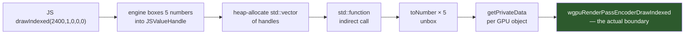
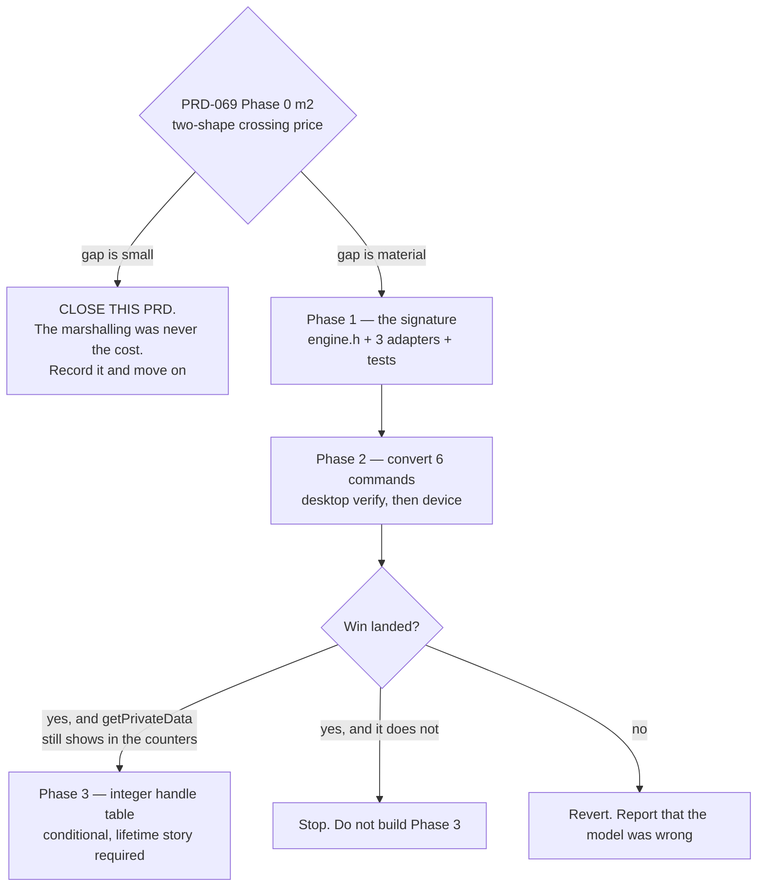

# PRD-072 — Fixed-arity hot bindings: stop billing our own marshalling to "the boundary"

**Status: CLOSED UNIMPLEMENTED, 2026-08-10, on the measurement it asked for.** This PRD was
filed the same day with one authorising gate: price a crossing as currently marshalled against
the same crossing with fixed-arity arguments, and proceed only if the gap is material. PRD-068
§1.2 then instrumented the six render-command bindings on the physical Pixel 8 and found that
**all time inside them is roughly 2% of a CPU-bound frame** — 0.21–0.38 ms of a 22–29 ms frame.

Fixed-arity marshalling can only recover a *slice* of that 2%; the `wgpu` call itself and the
crossing proper are inside the measured figure and stay. **So the ceiling on this entire PRD is
a few tenths of a millisecond, bought with a second calling convention across three engine
adapters.** That is the wrong trade, and this PRD says so rather than shrinking its scope until
it survives.

**The file stays as the record of why**, and §11 names the one measurement that would reopen it.
Everything below §1 is preserved as filed and describes work that is **not authorised**.

**Complexity: 5 → MEDIUM mode.** The change itself is mechanical. The reason it is not LOW is
that it adds a second calling convention to an interface with three implementations, and a
second way to do something is how a codebase forks quietly.

**Blast radius: ~7 repository paths.** `packages/runtime-native/include/mystral/js/engine.h`,
`src/js/quickjs_engine.cpp`, `src/js/v8_engine.cpp`, `src/js/jsc_engine.mm`,
`src/webgpu/bindings.cpp`, `packages/runtime-native/tests/`, `docs/verification/`.

**Depends on:** PRD-069, which owns per-draw cost and whose §3.4 is this PRD in one section.
**Complements, does not replace:** PRD-069 §3.2, the batched command ABI. This PRD makes each
crossing cheaper; that one makes crossings fewer. **They compete for the same win, and the whole
point of doing this one first is that it changes what that one is worth.**

**Does not depend on:** PRD-068. Every win here survives an engine swap and is worth more on any
target that never gets a JIT, which is every iOS device.

---

## 1. The defect, stated as what the code does

Every native function in this host has one signature:

```cpp
// packages/runtime-native/include/mystral/js/engine.h:32
using NativeFunction =
    std::function<JSValueHandle(void* ctx, const std::vector<JSValueHandle>& args)>;
```

So a single `drawIndexed` crossing pays, before `wgpu-native` is reached at all:



**Only the green box is the boundary. Everything before it is a convenience layer of our own,
sitting in the hottest loop in the system.** `bindings.cpp:3096–3230` is that shape for
`setPipeline`, `setBindGroup`, `draw` and `drawIndexed`.

This is not an argument that the layer is expensive. It is an argument that **nobody currently
knows how the cost splits**, and that PRD-069 Phase 0 measurement 2 — as originally written —
would have priced only the whole stack and reported it as "the FFI costs X". That number would
then have justified a month of batched ABI, when the fix might have been an afternoon of
signatures.

---

## 2. What must be true before this is implemented

| Gate | Source | This PRD proceeds only if |
|---|---|---|
| Two-shape crossing price | PRD-069 Phase 0 m2 | the fixed-arity no-op is **materially** cheaper than the vector-marshalled no-op on the Pixel 8 |
| Crossings are a real linear term | PRD-069 Phase 0 m3 | replacing the command functions with no-op JS moves the frame measurably. If it does not, crossings are not where the time is and neither this PRD nor §3.2 is worth building |
| The threshold is not the whole story | PRD-069 Phase 0 m1 | if the ~20 ms step owns essentially all of the fox-relevant frame, this PRD is worth single-digit milliseconds at best and should wait behind whatever fixes the step |

**"Materially" is deliberately not given a number here.** PRD-058 owns thresholds; inventing one
in this PRD would be setting a budget it does not own. The decision record in PRD-069 Phase 0
names the split, and this PRD is authorised or closed against it.

---

## 3. The change

### 3.1 A second, narrow calling convention — enumerated, not general

Add to `mystral::js::Engine` a fixed-arity native function form for a **closed list** of
arities, taking scalars rather than handles. Implement it in all three adapters —
`quickjs_engine.cpp`, `v8_engine.cpp`, `jsc_engine.mm` — because a form implemented in one is a
fork, and a fork diverges silently until a game breaks on one platform only.

**The constraint that keeps this from becoming a second general mechanism:** the fixed-arity
path is available to an enumerated list of bindings named in one place, and the list is short.
It is not a new default and it is not offered to bindings that are not on a hot path. A general
second mechanism is two ways to write every binding, and the next person writes the wrong one.

### 3.2 Convert the hot commands, and nothing else

`setPipeline`, `setBindGroup`, `setVertexBuffer`, `setIndexBuffer`, `draw`, `drawIndexed`. That
is the list. `writeBuffer` is a candidate only if Phase 0 measurement 5's counters show it in the
same traffic class — it carries data rather than scalars, so it is a different problem and gets a
separate decision.

Resource creation stays exactly as it is. Those calls happen once per resource, return values,
and are nowhere near a hot loop; converting them would be churn with no argument behind it.

### 3.3 Integer handles for GPU objects — **only if measured, and phased separately**

`getPrivateData` on a boxed object is a lookup per GPU object per command. Replacing it with an
integer handle table removes the lookup, and it also introduces a lifetime problem: a stale
integer is a use-after-free where a stale object reference is merely wrong.

**This is Phase 3 and it is conditional.** If the Phase 2 numbers land most of the available win
without it, it is not built. A use-after-free surface is not worth buying for a percent.

---

## 4. Phases



### Phase 1 — the signature, with the adapters honest

The interface addition plus all three implementations, plus unit tests per adapter asserting a
fixed-arity binding receives the same values the vector form would have received, including the
argument-count edge cases the current bindings handle by checking `args.size()`. **Default
arguments are where this will break** — `draw(vertexCount)` with three defaults is currently
expressed as `args.size() > 1 ? … : 1`, and a fixed-arity form has to represent "absent" without
inventing a sentinel that collides with a legal value.

### Phase 2 — convert the six, verify, then measure

`pnpm native:build && pnpm native:verify:desktop` first — a non-blank screenshot is the cheapest
proof that argument order survived the conversion. Then the device: re-run the sweep rows that
PRD-069 recorded (500, 1,000, 2,000 draws) on serial `37251FDJH0037Z`, 300-frame windows, `-O2`,
and report the deltas against 20.09 / 58.28 / 95.18 ms.

**Report the shape of the change, not just the size.** If this lever works, it should reduce the
*linear* term and leave the knee where it is. A result that also moves the knee means the
threshold was allocation-related — which would be a bigger finding than the optimisation, and it
belongs back in PRD-069 §2.4 as evidence for hypothesis 1.

### Phase 3 — integer handles, only on evidence

Conditional per §3.3. Its entry price is a written lifetime story: who allocates a handle, who
frees it, what happens when JS drops the last reference to a GPU object whose handle is still in
a command stream. Without that written down first, this phase does not start.

---

## 5. What this cannot do, stated before anyone hopes otherwise

- **It cannot touch the ~20 ms step.** A cheaper per-call cost is still a per-call cost, and
  PRD-069 §2.3(b) shows the knee is not made of per-call costs.
- **It cannot make iOS fast.** It makes iOS *less slow* by the same proportion as everywhere
  else. iOS has no JIT and this PRD does not change that.
- **It does not remove the case for a batched ABI** — it lowers its ceiling. After this lands,
  PRD-069 §3.2 is competing against the fixed-arity number, not against today's number, and it
  should be re-argued against that floor rather than against the figure that justified it first.

---

## 6. Integration ledger

| Surface | Change | Parity risk |
|---|---|---|
| `mystral::js::Engine` | additive: a new function form; the vector form stays and stays the default | An adapter that implements the new form incorrectly diverges from the others — hence per-adapter unit tests, not one shared test |
| `bindings.cpp` hot commands | same JS-visible behaviour, different C++ entry | Argument order or default handling silently wrong. Desktop verify catches gross errors; the per-adapter tests catch the defaults |
| Native LOC | net change should be near zero — fixed-arity bodies replace lambda bodies | The review trigger stood at 61,617 against 50,000 as of PRD-064. **A net increase here needs its justification written into this PRD, not waived** |

**Web is unaffected.** This is host-side only; the browser path does not go through
`bindings.cpp` at all. That asymmetry is fine precisely because no JS-visible behaviour changes
— and the way that is checked rather than asserted is that the existing conformance and playtest
rows keep passing unchanged on both targets.

---

## 7. Acceptance criteria

- [ ] PRD-069 Phase 0 measurement 2 is recorded with **both** shapes, and this PRD's authorising
      decision cites those two numbers.
- [ ] The fixed-arity form exists in `engine.h` and in all three adapters, with per-adapter unit
      tests including default-argument and wrong-arity cases.
- [ ] Wrong arity fails loudly. A binding called with fewer arguments than its fixed arity must
      throw, never read uninitialised memory and never silently substitute a default that the
      vector form would not have substituted.
- [ ] `pnpm native:build && pnpm native:verify:desktop` passes with a non-blank screenshot.
- [ ] The three device rows are re-run on serial `37251FDJH0037Z` and reported as deltas against
      PRD-069's recorded values, with target, serial, subject, build type and sample duration.
- [ ] The report states whether the **knee moved**, separately from whether the linear term moved.
- [ ] Native LOC delta is stated. If positive, its justification is written here.
- [ ] Phase 3 is either not started, or started with a written handle-lifetime story.

---

## 8. Negative controls

| Control | What it does | Expected | Status |
|---|---|---|---|
| `arity-short` | call a fixed-arity binding with too few arguments | **throws**, names the binding. If it renders anyway, the gate is asserting nothing | not built |
| `arity-swap` | swap two arguments in one converted command | desktop verify **fails** — wrong or blank screenshot | not built |
| `adapter-skew` | implement the new form in QuickJS only, leave V8 and JSC on the vector form | a per-adapter test **fails**. This control exists because the fork it simulates is the exact failure this repository forbids | not built |
| `revert-linear` | revert the conversion, keep the measurement harness | the linear term returns to its recorded value. If it does not, the win was never this change and the whole result is confounded | not built |

---

## 9. Verification commands

```sh
pnpm native:build && pnpm native:verify:desktop
# device rows, serial 37251FDJH0037Z, 300-frame windows, -O2, subject examples/native-smoke
# at 500 / 1,000 / 2,000 extra all-visible meshes, compared against PRD-069 §2.2
```

## 10. The outcome this PRD must be willing to reach

**Closing unimplemented.** If PRD-069's two-shape measurement shows the vector marshalling costs
little, then this PRD's entire premise — that our convenience layer is a meaningful share of the
crossing — was wrong. Recording that in one line and deleting the plan is cheaper than any other
outcome on the list, and it makes the batched-ABI decision cleaner rather than muddier: the
boundary really would be the boundary, and PRD-069 §3.2 would be the only lever left on that
term.

## 11. What actually happened, and what would reopen this

**It reached the outcome in §10 within a day, by a shorter route than the one it planned.** The
gate asked for a two-shape crossing price. PRD-068 §1.2 supplied something stronger: the total
share of the frame spent inside all six bindings, on the device, on a real subject. At ~2%,
the split between "the boundary" and "our marshalling" stopped mattering — **the whole quantity
being split is too small to fund the change.**

Recorded honestly, because the premise was half right: the marshalling *is* generic, it *does*
allocate per call, and `engine.h:32` really is one universal signature carrying the hottest path
in the system. Being real is not the same as being worth fixing. It is a cleanup to make if that
file is opened for another reason, not a PRD to schedule.

**One measurement reopens this, and only one.** PRD-068 §1.2's subject shares one geometry and
one material — about 1.8 crossings per mesh per frame — and that shape flatters the boundary.
If a **varied-material subject** on the same device shows the six bindings above **~10% of the
frame**, the arithmetic changes and this PRD is reopened against that number. Below 10% it stays
closed regardless of how attractive the change looks in isolation.

**What does not reopen it:** a desktop number, an emulator number, a microbenchmark of the
binding in isolation, or an argument. A per-call microbenchmark can make any binding look
expensive; only its share of a real frame decides.
