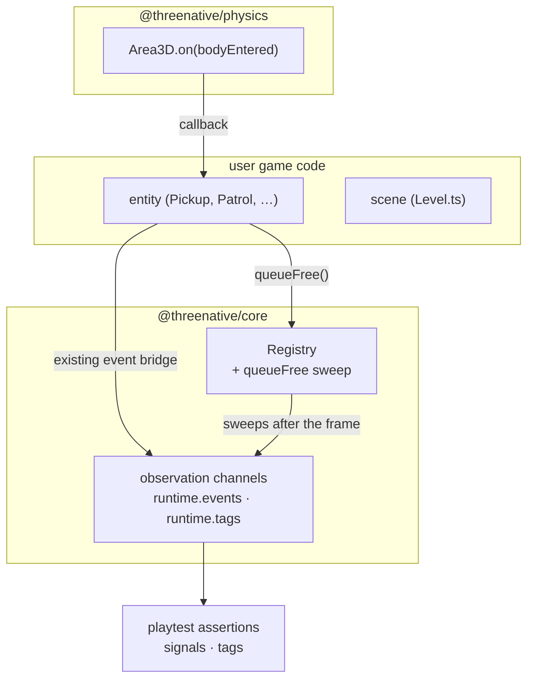
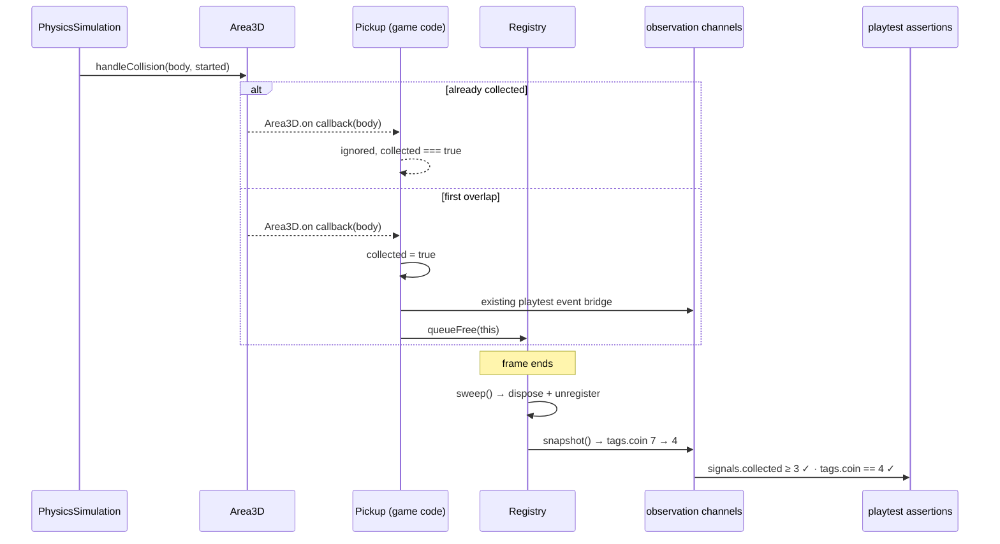

# PRD-100 — The playtest harness already asserts `signals` and `tags`; the runtime ships neither, so every game hand-writes the emitter

**Status: COMPLETE, 2026-08-13.** Phase 0 killed Signal under its predeclared threshold;
Phase 2 shipped deferred `queueFree`; Phase 3 killed Groups. The attempted Signal phase was
removed before delivery, so `Area3D.on()` and the platformer's event bridge remain the live
API. Evidence is in `docs/verification/PRD-100-evidence-2026-08-12.md`. Desktop native
verification passed; this PRD makes no Android or iOS claim. Root lint retains one unrelated
formatter diagnostic recorded in the evidence; the root test orchestrator passes.

**The one-sentence case.** `collect.playtest.json` — shipped, in the platformer template —
asserts `"signals": [{ "name": "collected", "entity": "player", "minCount": 3 }]` and
`"tags": [{ "tag": "coin", "count": 4 }]`. The framework observes both channels. It provides
an API for **neither**, so the template ships a 15-line event queue
(`src/playtest-events.ts`) and the scene hand-rolls the entity bookkeeping that makes the tag
count fall. Phase 0 found that this authoring gap exists in only one template, so the proposed
general Signal primitive was killed without changing that API. **The shipped fix is the
correctness-critical part: deferred destruction removes the scene's duplicated cleanup loop.**

This PRD triages the whole Godot 80/20 list against what ThreeNative already has, kills most
of it on rules 1 and 2, and measures three candidates. Only deferred destruction survives the
Signal and Groups kill conditions; the other two remain explicit non-features.

**Complexity: 6 → MEDIUM mode.** Multi-package (`core`, `physics`, templates, playtest
fixtures): +2. New system from scratch (`Signal`): +2. Touches 6–10 files: +2. No schema, no
external API. Standard template, all sections, automated checkpoint after every phase.

## §0 — Context

**Problem.** The playtest harness reads two channels — `runtime.events` (asserted as
`signals`) and `runtime.tags` — that the runtime gives the game no API to feed, so each
generated game hand-writes the bridge and the bookkeeping behind it.

**Files analysed** (read in full unless noted): `packages/core/src/index.ts`, `scene.ts`,
`entities.ts`, `schedule.ts`, `animation.ts`, `state.ts`, `input.ts` (head), `audio.ts`
(head), `canvas-layer.ts`, `playtest.ts` (tag/event paths); `packages/physics/src/index.ts`,
`Area3D.ts` (signal paths); `packages/playtest/src/capabilities.ts`, `assertions.ts` (tags
and events), `runner/runner.ts`; `packages/create-threenative/templates/platformer/src/`
(`scenes/Level.ts`, `scenes/Boot.ts`, `entities/*.ts`, `playtest-events.ts`, `game.ts`),
`templates/starter/src/scenes/Play.ts`; `templates/platformer/playtests/*.json`;
`docs/PRDs/OPPORTUNITY-AREAS.md`, `docs/PRDs/done/PRD-039-animation-state-machine.md`,
`docs/PRDs/done/PRD-082-input-vector-axis-contract.md`.

**Current behaviour.**

- `Area3D.on()` is the only signal-shaped API in the framework; everything else threads
  callbacks through constructors.
- The platformer ships a module-global event queue so the harness's `signals` assertion has
  something to read.
- `Registry` owns names, tags and `dispose()` but has no removal sweep, so scenes defer
  deletes by hand with reverse-index loops.
- `tags` are observable through `runtime.tags` and unaddressable from gameplay.
- `pnpm budgets`, baseline 2026-08-12: 10,788 / 15,000 framework LOC; native 68,647 / 50,000.
  Isolated-lane result: 8,604 / 15,000 framework LOC; native 68,516 / 50,000. The native
  review trigger remains exceeded and untouched here. The composed local `main` check reports
  13,746 / 15,000 framework LOC and 69,910 / 50,000 native LOC because newer main work is
  already present outside this PRD.

---

## §1 — Triage: the Godot 80/20 list against the tree at `f1845e1`

The candidate list is the standard "strip Godot to ~80% of its usefulness" ranking. Three
outcomes only: **SHIPPED** (exists, cite it), **KILL** (rule 1, rule 2, or a closed
question), **PROPOSE** (§2).

### Already shipped — do not rebuild

| # | Godot abstraction | Where it already lives |
|---|---|---|
| 1 | Node, transform hierarchy, scene tree | `three` `Object3D` + `ctx.add`; borrowed, not wrapped |
| 2 | Node lifecycle | `Scene.load/enter/exit/update/render` — `core/src/scene.ts:14-30` |
| 3 | Input actions | `InputMap` with named bindings — `core/src/input.ts:56`; contract pinned by PRD-082 |
| 4 | CharacterBody / `moveAndSlide` | `physics/src/CharacterBody3D.ts` |
| 5 | Area / trigger volume | `physics/src/Area3D.ts` |
| 6 | CollisionShape | `physics/src/CollisionShape3D.ts` |
| 7 | Physics layers + masks | `interactionGroups` — `physics/src/collision.ts` |
| 8 | Timer | `ctx.after` / `ctx.every` → `Scheduler` — `core/src/schedule.ts:30-43` |
| 9 | Tween | `ctx.tween` — `core/src/schedule.ts:45-101` |
| 10 | AnimationPlayer | `core/src/animation.ts` |
| 11 | RayCast / ShapeCast | `ScenePicker`, `ctx.raycast` — `core/src/picking.ts` (PRD-056) |
| 12 | Navigation agent | `@threenative/physics/navigation` (PRD-034) — browser-only by the no-WASM-on-native rule |
| 13 | AudioStreamPlayer (2D/3D/global) | `AudioBus` over `PositionalAudio` — `core/src/audio.ts` |
| 14 | Viewport, CanvasLayer | `core/src/viewport.ts`, `core/src/canvas-layer.ts` (PRD-022) |
| 15 | Editor-exposed properties | Studio (PRD-084/085/086), not a decorator |

### Killed, with the rule that kills it

| # | Godot abstraction | Verdict |
|---|---|---|
| 16 | **PackedScene / scene format** | **KILL — closed question.** A serialized scene format does not get reopened in a feature. The code-first equivalent already exists and costs zero framework lines: a prefab is a function returning an `Object3D`, and `instantiate()` is calling it. |
| 17 | **Resource** | **KILL — rule 1.** A reusable data object is `export const SWORD = { damage: 20 } as const`. Three.js already owns the loaded kinds (`Material`, `Texture`). A `Resource` base class buys nothing a `const` does not. Shared, editable, hot-reloadable data is Studio's job, not a new class. |
| 18 | **Autoload / singleton** | **KILL — rule 1 and duplication.** `ctx.entities` names long-lived services and `ctx.state` (zustand, `core/src/state.ts`) holds application state across scenes. A third global registry is a fork. |
| 19 | **AnimationTree / blend-tree state machine** | **KILL — already decided with evidence.** PRD-039 measured the platformer's whole animation graph at 12 lines (`Character.ts:203-215`) and recorded WONTBUILD for `AnimationNodeStateMachine`. This PRD does not reopen it. |
| 20 | **UI Control / Container / Anchor / Theme** | **KILL — vocabulary is borrowed.** UI is React and Tailwind here. Flexbox and grid *are* the containers; Tailwind *is* the theme resource. Re-borrowing Godot's `VBoxContainer` on top would be an invented third vocabulary. |
| 21 | **World / Environment** | **KILL — rule 3, never own the look.** Sky, fog, tonemapping and glow ship as generated source in the user's `src/render/`. Owning them is the exact move that made v1 score worse than vanilla on the blind rubric. |
| 22 | **Camera abstraction** | **KILL — rule 1.** `PerspectiveCamera` plus `ctx.camera` is the whole surface; a `current` flag is one boolean the game already owns. |

### Candidates — §2

| # | Godot abstraction | Why it survives |
|---|---|---|
| 23 | **Signal** | **KILL — Phase 0 found only one distinct template with a hand-written event bridge; the `>=3` bar was not met** |
| 24 | **`queueFree()` / deferred destruction** | Hand-written twice in one shipped scene, and it is a correctness fix, not sugar |
| 25 | **Groups** | Tags are already the framework's observation vocabulary but are not addressable from gameplay — **phase-gated on a measurement, see Phase 0** |

---

## §2 — The three survivors, scored

Scored on the existing `OPPORTUNITY-AREAS.md` rubric (Gap 30 / Ceiling safety 25 / Agent
leverage 25 / Cost fit 20) so the numbers are comparable to every prior area, not invented
for this document.

| Candidate | Score | Gap | Ceiling | Agent | Cost |
|---|---:|---:|---:|---:|---:|
| Signal | **84 (proposal only)** | 24 | 24 | 25 | 11 |
| `queueFree` | **78** | 22 | 25 | 19 | 12 |
| Groups | **61** | 14 | 23 | 16 | 8 |

**Gap is deliberately not 30 for any of them.** Each is writable in game code today — that is
precisely what the evidence below shows the users doing. What raises them above rule 1 is not
convenience; it is that **the framework's own observation half already exists and only the
authoring half is missing**, so every game re-implements the bridge and each implementation
can drift from what the harness reads.

### 2.1 Signal — score 84, proposal killed by Phase 0

The design is recorded for the opportunity comparison, but it did not clear the predeclared
ship bar. The census found three constructor callback parameters and one existing event bridge,
all in the platformer template. Because there was no second or third distinct game or template
hand-writing the bridge, this PRD does not add `Signal`, change `Area3D.on()`, or delete
`playtest-events.ts`. The existing `runtime.events` channel remains a template-owned bridge
until a later PRD supplies the required evidence.

### 2.2 `queueFree()` — score 78

**What the shipped template writes by hand**, `platformer/src/scenes/Level.ts:82-111` — two
near-identical blocks, one per entity type:

```ts
const pickups: Array<{ id: string; value: Pickup }> = [];     // :82
const patrols: Array<{ id: string; value: Patrol }> = [];     // :83
const removeCollected = (): void => {                          // :96
  for (let index = pickups.length - 1; index >= 0; index -= 1) {
    const entry = pickups[index];
    if (entry?.value.collected) {
      ctx.entities.remove(entry.id);
      pickups.splice(index, 1);                                // :101
    }
  }
};
const removeDefeated = (): void => { /* :105-111, identical shape */ };
```

then `removeCollected(); removeDefeated();` every frame (`Level.ts:161-162`). **30 lines of
generated user source whose entire job is deferring a delete out of a traversal** — the exact
hazard `queue_free()` exists to remove. The reverse-index loop is not decoration: it is the
user having discovered, or copied, the mutation-during-iteration bug.

`Registry` already owns the name, the entity and `dispose()` (`core/src/entities.ts:36-60`).
The missing piece is a sweep, and it is a correctness property rather than a convenience:
today nothing stops a game calling `entities.remove()` from inside `Registry.snapshot()`'s
iteration or an `Area3D` handler.

### 2.3 Groups — score 61, phase-gated

**What exists.** Four template entities declare `readonly tags` (`Character.ts:38`,
`Pickup.ts:11`, `Patrol.ts:13`, `Chaser.ts:12`). `Registry.snapshot()` copies them
(`core/src/entities.ts:69-73`), `core/src/playtest.ts:248` turns them into the `runtime.tags`
channel, and `collect.playtest.json` asserts `{ "tag": "coin", "count": 4 }`.

**What is missing.** Tags are observable and not addressable. There is no
`getNodesInGroup("enemy")`, so a scene that wants "every enemy" keeps its own array — which
is one source of truth for the harness and a second for the gameplay, free to drift.

**Why it is gated rather than proposed outright.** Filtering a `Map` by tag is five lines,
which is squarely inside rule 1, and the only observed duplication is the same two arrays
that Phase 2 deletes for a different reason. **Phase 0 measures the real duplication and
Phase 3 ships only if it clears a bar declared before the measurement.** If it does not,
Groups is recorded as KILL in this file and not revisited in a later feature.

**Phase 0 result, 2026-08-12.** The census found **zero** hand-written group queries outside
the two per-type arrays that Phase 2 already removes. Groups is therefore **KILL** under the
predeclared `>=3` bar; Phase 3 is deleted and no `Registry.group()` API ships in this PRD.

---

## §3 — Shape of the change



### Sequence — one collected coin, after this PRD



**Key decisions.**

- **`Area3D.on` remains the live API.** The Signal rename was measured and killed because the
  required three distinct template bridges were not present.
- **Deferred destruction is framework plumbing.** `Registry.remove()` during iteration throws;
  `queueFree()` records intent and the frame loop performs one end-of-frame sweep.
- **Reused, not rebuilt:** `Registry` (names, tags, dispose), `core/src/playtest.ts`
  observation builder, the `runtime.events` / `runtime.tags` capabilities, and the shipped
  `collect.playtest.json`.
- **No option, no config.** Nothing here is switchable; a discarded option becomes a
  platform-specific gameplay bug.

**Data changes.** None. No schema, no migration, no serialized format — the observation
channels already exist and their shapes are unchanged.

**Web and native.** The shipped registry change is plain TypeScript over a `Map` and a `Set` —
no browser global, no shim, no WASM, no export-condition swap. It runs unchanged on QuickJS;
Phase 4 records the desktop native evidence.

**Kill-switch accounting (estimates, settled by the Phase 4 measurement):**

| Change | Framework LOC added | User source deleted |
|---|---:|---:|
| `Signal<T>` in core + observation wiring | 0 | 0; Phase 0 KILL |
| `Area3D` signal fields, `on` deleted | 0 | 0; Phase 0 KILL |
| `Registry` sweep + `queueFree` | ~25 | ~30 (`Level.ts:82-111`) |
| Groups (Phase 3, if it ships) | ~10 | measured in Phase 0 |

`pnpm budgets`, run after implementation on 2026-08-13 in the isolated lane: **8,604 / 15,000
framework LOC**, 6 framework packages, largest template 1,537 LOC. Native runtime is **68,516 /
50,000** — the trigger is exceeded and reported, and this PRD adds no native runtime line, so
it neither worsens nor excuses it. The generated platformer source in that lane falls from
1,486 to 1,468 lines. After composing onto local `main`, the check reports 13,746 framework LOC,
69,910 native LOC, largest template 2,074 LOC, and 1,562 platformer LOC; those higher totals
come from pre-existing main work and are recorded as a composition check below.

---

## Integration Ledger

Every row's live caller is filled with a real non-test `file:line` during implementation. A
`TBD` at phase end means the phase is not done.

| # | New thing | Live caller (`file:line`, non-test) | Replaces | Old path removed? | Negative control |
|---|---|---|---|---|---|
| 1 | `Signal<T>` (`core/src/signal.ts`) | KILL — one distinct template, below the `>=3` bar | constructor callbacks and `playtest-events.ts` | not changed | census is the negative control; implementation was removed before delivery |
| 2 | Signal → `runtime.events` channel | KILL — one distinct template, below the `>=3` bar | template `src/playtest-events.ts` | not changed | existing bridge remains live |
| 3 | `Area3D.bodyEntered` / `bodyExited` as `Signal` | KILL — one distinct template, below the `>=3` bar | `Area3D.on()` | not changed | existing API remains live |
| 4 | `Registry.queueFree` + end-of-frame sweep | `packages/core/src/game.ts:494` sweeps; `Pickup.ts:43` and `Patrol.ts:56` call it | `Level.ts:82-111` arrays and sweeps | deleted in Phase 2 | disabling the sweep leaves `tags.coin` at 7 and turns `collect.playtest.json` red — observed exit 1 |
| 5 | `Registry.group(tag)` (Phase 3, conditional) | KILL — Phase 0 measured 0 group queries | per-type arrays found by Phase 0 | not shipped | no group-driven scenario: the predeclared `>=3` bar was not cleared |

### Reachability

**How is this reached?** Entry point: the frame loop (`core/src/loop.ts` → `game.ts`) and the
scene's `enter`/frame callback. Pre-existing files edited to call it:
`packages/core/src/game.ts`, `packages/core/src/entities.ts`, and
`packages/create-threenative/templates/platformer/src/scenes/Level.ts`. No Signal export or
Area3D API replacement was delivered.

**User-facing?** No UI. The observable outcome is a **shipped playtest scenario that passes
with the existing event bridge and without the template's hand-written removal loops** — and
the same coin count in the running game.

**Full flow shipped by this PRD.** Player walks into a coin → `Area3D.on("bodyEntered", handler)`
invokes the constructor callback → `Pickup` sets `collected`, records the existing playtest
event and calls `queueFree()` → the registry sweeps after the frame → `runtime.tags` reports
4 coins and the existing `runtime.events` bridge reports 3 collected events →
`collect.playtest.json` passes.

**What does it replace?** `Level.ts:82-111` (deleted, Phase 2). `Area3D.on` and the template's
`playtest-events.ts` remain because Signal failed its Phase 0 bar.

---

## §4 — Phases

### Phase 0 — Measure, and set the kill conditions before anything is built

**Files (max 5):** `docs/verification/PRD-100-census-2026-08-12.md` — NEW;
`docs/PRDs/PRD-100-signals-groups-and-queuefree.md` — EDIT: record the measurement and the resulting
verdicts inline.

**Implementation:**

- [x] Census every constructor-threaded callback across `templates/**/src` and
      `examples/abyss-framework/src`; record file:line for each.
- [x] Census every per-type entity array and its removal loop; record total LOC.
- [x] Census every hand-written "group" query — any place game code filters entities by kind.
- [x] Run `pnpm test:templates` and `pnpm test:playtest` on the unmodified tree and paste the
      output. **This is the baseline every later phase's negative control is measured against.**

**Predeclared kill conditions — written now, applied without renegotiation:**

| Candidate | Ships only if |
|---|---|
| Signal | ≥3 distinct games or templates hand-write an event/callback bridge — the harness's `signals` channel already makes this ≥1 |
| `queueFree` | ≥2 independent hand-written deferred-removal loops exist |
| **Groups** | **≥3 hand-written group queries exist outside the arrays Phase 2 already deletes.** Two or fewer → **KILL, recorded in this file, not revisited** |

**Wiring:** none — this phase measures. It is the only phase exempt from the edit-a-shipped-file
rule, and it exists because writing the bar after seeing the number is how a KILL becomes a
SHIP.

**Verification:** the census commands and their raw output are pasted into the verification
file, not summarised.

---

### Phase 1 — Signal KILL

Phase 0 found only one distinct game/template with a hand-written event bridge. The
predeclared `>=3` condition was not met, so this phase was not executed and no Signal,
`Area3D.bodyEntered` field, or automatic `runtime.events` recorder ships here. The existing
`Area3D.on()` and platformer `playtest-events.ts` path remain intentionally unchanged.

The review repair removed the attempted implementation and its tests before delivery. The
final census is the evidence for this kill; no implementation negative control is claimed.

---

### Phase 2 — The coin count falls to 4 without the scene owning a removal loop

**Files (max 5):**

- `packages/core/src/entities.ts` — EDIT: `queueFree(name)`, a pending set, and `sweep()`
  that disposes and unregisters after the frame; `remove()` during iteration throws rather
  than corrupting the traversal.
- `packages/core/src/game.ts` — EDIT: the frame loop calls `entities.sweep()` after the scene
  frame and before the observation sample.
- `packages/create-threenative/templates/platformer/src/entities/Pickup.ts` — EDIT: calls
  `ctx.entities.queueFree(this)` on collect.
- `packages/create-threenative/templates/platformer/src/entities/Patrol.ts` — EDIT: same on
  defeat.
- `packages/create-threenative/templates/platformer/src/scenes/Level.ts` — EDIT: **delete
  `pickups`, `patrols`, `removeCollected`, `removeDefeated` and both frame calls** (`:82-111`,
  `:161-162`).

**Wiring:**

- [x] Caller edited: `core/src/game.ts` frame loop invokes the sweep.
- [x] Old path: the scene's arrays and loops are gone, not left beside the new one.

**Tests required:**

| Test file | Test name | Assertion | Negative control (observed red) |
|---|---|---|---|
| `packages/core/__tests__/entities.spec.ts` | `should dispose a queued entity when the frame sweeps` | `dispose` called once; `get` returns undefined | skip the sweep → red |
| `packages/core/__tests__/entities.spec.ts` | `should keep the entity live until the sweep runs` | still present immediately after `queueFree` | dispose eagerly → red |
| `packages/core/__tests__/entities.spec.ts` | `should throw when remove is called during iteration` | `TypeError` | allow it → red, and the fail-closed rule requires the throw |
| `templates/platformer/playtests/collect.playtest.json` | unchanged, shipped | `tags.coin == 4` after 3 collected of 7 | **disable the sweep → count stays 7 → red.** The assertion measures the new path only |

**Revert check:** remove `sweep()` from the frame loop → `collect.playtest.json` fails on the
tag count. Pre-existing scenario, unedited.

**Manual checkpoint (visual):** collected coins still vanish; nothing flickers for a frame.

**Verification plan:**

1. **Unit:** `packages/core/__tests__/entities.spec.ts` (3 tests above).
2. **Integration:** the frame loop drives the sweep — assert from `core/src/game.ts`'s loop,
   not by calling `sweep()` directly, or the gate proves a function rather than the runtime.
3. **Playtest:** `pnpm test:templates` — `platformer-collect` must report `tags.coin == 4`.
4. **Integration proof:**
   ```sh
   # 1. Caller census — queueFree is called from game code, sweep from the loop
   grep -rn "queueFree\|sweep(" packages/core/src packages/create-threenative/templates \
     | grep -v "__tests__"
   # Expected: core/src/game.ts calls sweep(); Pickup.ts and Patrol.ts call queueFree()

   # 2. Incumbent check — the hand-rolled loops are gone
   grep -n "splice\|removeCollected\|removeDefeated" \
     packages/create-threenative/templates/platformer/src/scenes/Level.ts
   # Expected: no output

   # 3. Revert check — comment out the sweep call, re-run
   # Expected: platformer-collect fails on tags.coin (stays 7)
   ```
5. **Evidence required:**
   - [x] Package tests, root tests, and `pnpm test:templates` output are pasted; the root lint
         formatter diagnostic is recorded separately.
   - [x] Sweep disabled → `tags.coin == 7` observed red, pasted.
   - [x] `Level.ts` line count before/after recorded: 172 → 149.

---

### Phase 3 — Groups KILL

Phase 0 found zero hand-written group queries outside the per-type arrays already removed by
Phase 2. The predeclared `>=3` bar was not cleared, so this phase is deleted and no
`Registry.group()` API, consumer, test, or scenario ships.

No Phase 3 files, tests, consumer, revert check, or user verification apply.

---

### Phase 4 — Both halves of the codebase, and the kill-switch pass

**Files (max 5):** `examples/native-smoke/` — EDIT: assert `queueFree` survives the import-free
single-file bundle; `docs/verification/PRD-100-evidence-2026-08-12.md` — NEW; this PRD — EDIT:
final status.

**Implementation:**

- [x] `pnpm typecheck` and all in-scope lint/package tests pass. The exact root `pnpm lint`
      has one unrelated clean-tree format error; exact root `pnpm test` passes with 99/99 files
      and 827/827 tests. Both are pasted in the evidence file.
- [x] `pnpm test:templates` and `pnpm test:playtest` — both pass on the changed tree.
- [x] `pnpm budgets` before and after; the framework budget is 10,788 → 8,604 LOC and native
      is 68,647 → 68,516 LOC.
- [x] `pnpm tsx scripts/count-loc.ts` — the user-source line count falls from 1,486 to 1,468.
      If framework
      lines exceed user lines deleted, the kill switch applies to whichever piece caused it,
      however much work it took.
- [x] Native: `pnpm native:build && pnpm native:verify:desktop` passed with the 300-frame desktop
      core gate and the import-free native-smoke bundle.
- [x] Composed local `main` check: `pnpm typecheck` and `pnpm test:templates` passed; `pnpm
      budgets` reported 13,746 framework LOC, 69,910 native LOC, largest template 2,074 LOC;
      `pnpm tsx scripts/count-loc.ts` reported 1,562 platformer LOC.
- [x] Composed local `main` native check: the import-free bundle and desktop core, physics
      playtest, and physics query proofs passed; exact output is in the evidence file.

**Acceptance for the phase:** every claim in this document is either backed by pasted output
or explicitly labelled unverified.

**Wiring:** `examples/native-smoke` is a pre-existing gate and its assertion is extended, not
replaced. **Revert check:** remove the `sweep()` call from the frame loop → the shipped
platformer scenario fails its tag-count assertion, as recorded in the evidence.

---

## §5 — Checkpoint protocol

**Automated checkpoint after every phase, including Phase 0.** Spawn `prd-work-reviewer`:

```yaml
subagent_type: "prd-work-reviewer"
prompt: |
  Review checkpoint for phase [N] of docs/PRDs/PRD-100-signals-groups-and-queuefree.md.
  Summary: [what the phase implemented]

  Also audit integration, independent of whether tests pass:
  1. Integration Ledger — is every row filled with a real non-test file:line?
  2. Caller census — grep each new exported symbol; any non-test consumer?
  3. Did this phase edit at least one pre-existing file?
  4. Revert check — if the new code were removed, which pre-existing test or flow
     breaks? If nothing, report FAIL.
  5. Incumbent — are the Level.ts:82-111 removal arrays and loops deleted, while the
     intentionally retained Area3D.on and playtest-events.ts paths remain singular?
  6. Negative controls — was each new gate observed failing? Check for uncollected
     test files, self-comparisons, and assertions the previous commit already
     satisfied. collect.playtest.json passes TODAY via the old path: confirm its
     pass has been re-earned through the new one.
  Report FAIL on any of these even when the full suite is green.
```

**Proceed only on PASS.** NEEDS CORRECTION → fix in the same phase, never logged as follow-up.

**Manual checkpoint additionally required for Phase 2 and Phase 4** — Phase 2 changes what the
player sees (a coin disappearing a frame later is a visual regression no assertion catches);
Phase 4 is the native lane, which is opt-in and cannot be claimed from a green suite.

| Phase | Checkpoint |
|---|---|
| 0 census | Automated |
| 1 Signal | Automated census; KILL if the bar is not met |
| 2 `queueFree` | Automated + manual (visual) |
| 3 Groups | Automated |
| 4 platforms | Automated + manual (native/desktop run) |

---

## §6 — Acceptance criteria

Consumer-scoped. Each one is false for a build a user could not tell apart from today's.

- [x] **Signal is measured and killed honestly** when fewer than three distinct games or
      templates hand-write the bridge. The final census records one template.
- [x] **Collecting 3 of 7 coins leaves 4 in the world**, with no removal loop anywhere in
      generated user source. `grep -n "splice" templates/platformer/src/scenes/Level.ts`
      returns nothing.
- [x] `Area3D.on()` and `playtest-events.ts` remain unchanged because Signal did not clear its
      bar; no second event API is shipped.
- [x] The isolated PRD lane's generated user source is **shorter** after this PRD than before it
      (`scripts/count-loc.ts`, both numbers pasted); the composed-main total is reported
      separately because local `main` already contains newer template gameplay.
- [x] Groups are recorded KILL with the measured zero-query result.
- [x] Native: executed, with a desktop claim only. No mobile claim.

**Integration gates — unchecked means not done:**

- [x] Integration Ledger has zero `TBD` cells; killed candidates are explicitly marked KILL.
- [x] The queueFree caller census has non-test callers in the core frame loop and platformer
      entities.
- [x] Disabling the sweep turns the shipped collect scenario red; no Signal mutation is
      claimed after Signal was killed.
- [x] The old per-type removal arrays and loops are deleted; intentionally retained event
      bridge incumbents are not falsely reported as deleted.
- [x] Proved on the real subject: the shipped platformer template and its shipped scenarios,
      not a fixture written for this PRD.

## §7 — Verification evidence

Filled in during implementation, one block per phase. Empty until a phase runs — an entry
here without pasted output is a lie, and a gate with no observed red is recorded
**UNVERIFIED**, never PASS.

```markdown
### Phase 0: Measure, and set the kill conditions
- Census and baseline output: `docs/verification/PRD-100-census-2026-08-12.md`
- Constructor-threaded gameplay callbacks: 3 parameters across 2 template entities
- Distinct templates with a hand-written event bridge: 1; Signal KILL under the `>=3` bar
- Deferred-removal loops: 2 independent loops in `platformer/src/scenes/Level.ts`
- Hand-written group queries outside those arrays: 0; Groups KILL and Phase 3 deleted
- `pnpm test:templates`: exit 1; pre-existing `TN_PLAYTEST_RUNNER_FAILED` after minimal scaffold
- `pnpm test:playtest`: exit 2; pre-existing `TN_PLAYTEST_BRIDGE_MISSING` in abyss-framework

### Phase 1: Signal KILL
- No Signal implementation shipped: the census found one distinct template with the bridge,
  below the predeclared `>=3` threshold.
- `Area3D.on()` and `platformer/src/playtest-events.ts` remain the live incumbent paths.
- The attempted Signal implementation and tests were removed during review repair; no Signal
  negative control is claimed.

### Phase 2: queueFree and the end-of-frame sweep
- Integration: `core/src/game.ts:494` calls `sweep()`; `Pickup.ts:43` and `Patrol.ts:56`
  call `queueFree()`; the restored collect scenario reports `tags.coin` count 4.
- Negative control: sweep disabled — PASS; exit 1 with `TN_PLAYTEST_TAG_COUNT_ASSERTION_FAILED`,
  `tags.coin` count 7, while the existing event bridge still reports collected events.
- Incumbent proof: `Level.ts` has no `splice`, `removeCollected`, or `removeDefeated`; line
  count is 172 → 149.

### Phase 3: Groups KILL
- Phase 0 measured 0 group queries outside the arrays removed by Phase 2; the predeclared `>=3`
  bar was not met. No `Registry.group()` API or scenario was added.

### Phase 4: Both halves and the kill-switch pass
- `pnpm typecheck`: exit 0.
- In-scope Biome check: exit 0. Root `pnpm lint`: exit 1 only on the clean-tree,
  out-of-scope formatter diagnostic at `scripts/__tests__/native-cpu-profile.spec.ts:1`
  (178 warnings).
- Exact root `pnpm test`: 99 files and 827 tests passed, exit 0.
- Standalone runtime-native test: 42 files, 246 passed, 31 skipped, web/Rust parity passed.
- `pnpm test:templates`: minimal, starter, and platformer scaffolded playtests passed.
- `pnpm test:playtest`: `framework-movement` and `framework-camera` both passed.
- `pnpm budgets`: framework 10,788 → 8,604 LOC; native 68,647 → 68,516 LOC (review trigger
  remains reported). `pnpm tsx scripts/count-loc.ts`: platformer 1,486 → 1,468 LOC in the
  isolated lane.
- Composed local `main` check after the squash: `pnpm typecheck` exit 0; `pnpm test:templates`
      passed for minimal, starter, and platformer; `pnpm budgets` reported 13,746 framework LOC,
      69,910 native LOC, largest template 2,074 LOC; `pnpm tsx scripts/count-loc.ts` reported
      platformer template LOC 1,562.
- Composed local `main` native check: `native-smoke.js` 4,073,138 bytes with no imports;
  desktop core passed 300 frames at 1280×720; desktop physics playtest passed 14 assertions;
  desktop physics query proof passed. No Android or iOS claim is made.
- Native: `pnpm native:build && pnpm native:verify:desktop` passed; native-smoke verified one
  4,071,565-byte import-free bundle and desktop core verified 300 frames at 1280×720.
- Evidence file with command outputs and mutation logs:
  `docs/verification/PRD-100-evidence-2026-08-12.md`.
```

---

## §8 — Risks

**The 20-line rule is the live threat to the remaining candidate.** `queueFree` is a
correctness fix because it centralizes deferred disposal and removes two scene-owned loops.
Signal and Groups were measured and killed rather than added speculatively.

**`Area3D.on` remains the public API.** Signal was not allowed to create a breaking replacement
without three distinct game/template bridges. A later PRD must repeat the census before
reopening that decision.

**Scope discipline.** This PRD adds deferred registry cleanup only. It does not add a Signal,
group query, scene format, `Resource` base class, autoload table, state machine, or UI
container — §1 records those as killed, with the rule.
