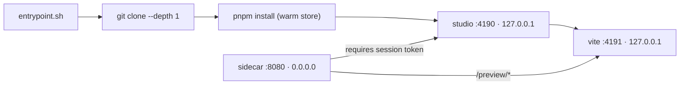

# PRD-100 — The session sandbox image: one Studio, one game, one container

**Status: COMPLETE, 2026-08-13.** Implemented and verified on branch
`docs/studio-hosting-series`. The image and compose acceptance flow are green; the measured
cold and warm boot readings are recorded below.

**Complexity: 7 → HIGH mode.** New system from scratch (+2), 6–10 files (+2), multi-package
(+2), external integration — container runtime (+1).

**Problem:** Studio only runs on a developer's own machine, against a directory that already
exists, with the packages it edits resolved out of this repository's working tree. A hosted
product needs the same loop to start from nothing but a git URL, inside a container that can be
created and destroyed per session.

---

## Current behaviour, read from the tree on 2026-08-13

- `packages/studio/package.json` exposes `bin.threenative-studio` → `dist/server.js`.
- `server.ts:936` binds `127.0.0.1`. There is no authentication on any route.
- `server.ts:562` defaults the preview port to `4191`; `server.ts:585` spawns
  `pnpm dev --host 127.0.0.1 --port <previewPort> --strictPort` inside the project.
- `server.ts:186` packs every workspace package with `pnpm pack` into a temp directory so a
  scaffolded project resolves `@threenative/*` from this repo. `server.ts:127` lets
  `THREENATIVE_STUDIO_PACKAGE_SOURCES` override that with explicit paths — **this is the hook the
  image uses to consume pinned published versions instead.**
- `server.ts:553` refuses to open a pnpm workspace root without `--allow-workspace`.
- `agentProtocol.ts:14` builds `codex exec --json --ephemeral --ignore-user-config …` and
  `detectAgent` (`server.ts:~99`) probes for the binary on `PATH`.

**Nothing in this PRD changes any of it.** The image consumes Studio exactly as published.

---

## Solution

A container image whose entrypoint turns a git URL into a running Studio, plus a **session
sidecar** that is the only process listening on a routable interface.

**Why a sidecar rather than teaching Studio to bind an interface.** Keeping Studio on loopback
means the package needs no authentication code, no origin checking and no tenancy concept, so the
hosted service runs the identical published package a local user runs. The sidecar is ~80 lines
and belongs to `hosting/`, where a deployed service's rules apply. It also buys defence in depth:
even inside the VM, the exposed surface refuses a request without a valid session token.

**Key decisions**

- **Node 22, pnpm, git and the Codex CLI** in the image. Codex is the agent for this product;
  Claude support in `agentProtocol.ts` is untouched and unused here.
- **`THREENATIVE_STUDIO_PACKAGE_SOURCES` is not set in the image.** A hosted project resolves
  `@threenative/*` from the registry at pinned versions, which is what a customer's project
  should do. The workspace-pack path at `server.ts:186` never runs, because the repo is absent.
- **The pnpm store is baked warm** at image build time by installing a scaffolded starter once
  and keeping `/pnpm-store`. Session boot is the product's first impression and a cold install is
  the whole cost.
- **The filesystem is disposable.** Nothing durable lives in the container; the git remote is the
  source of truth (PRD-101).

**Data changes:** none. This PRD has no database.

---

## Integration Ledger

| # | New thing | Live caller (`file:line`, non-test) | Replaces | Old path removed? | Negative control |
|---|-----------|-------------------------------------|----------|-------------------|------------------|
| 1 | `hosting/sandbox/entrypoint.sh` | image `CMD`, invoked by `docker run` in `hosting/compose.yaml` | nothing — new capability | n/a | with `SESSION_REPO_URL` unset the container exits non-zero instead of starting an empty Studio |
| 2 | `hosting/sandbox/sidecar.ts` | `entrypoint.sh` starts it; `compose.yaml` maps its port | nothing | n/a | a request with no `Authorization` returns 401; deleting the check makes the test go red |
| 3 | `pnpm hosting:up` | root `package.json` scripts | nothing | n/a | fails loudly when Docker is absent rather than reporting success |
| 4 | `hosting/AGENTS.md` | read by any agent working in `hosting/`; mirrored by `pnpm sync:agents` | nothing | n/a | `pnpm sync:agents --check` fails if the mirror drifts |

---

## Reachability

**How will this feature be reached?**
- Entry point: `docker run` / `docker compose up`, and later the session broker in PRD-102.
- Pre-existing file EDITED to call it: root `package.json` (adds `hosting:up`), `.gitignore`,
  `docs/README.md`, `scripts/sync-agent-docs.ts` roots list.
- Registration: `hosting/compose.yaml` declares the sandbox service.

**Is this user-facing?** Not yet. The operator is the only user until PRD-102.

**Full flow:** operator runs `pnpm hosting:up` → compose builds and starts the sandbox with a
repo URL → entrypoint clones and installs → Studio and vite come up on loopback → sidecar accepts
an authorised request on `:8080` → the operator opens `http://127.0.0.1:8080` and gets the same
Studio as `pnpm studio`.

**What does this replace?** Nothing. There is no incumbent container path in this repository —
`git ls-files | grep -i docker` returns empty as of 2026-08-13.

---

## Phases

#### Phase 1: The image boots Studio from a git URL — `docker run` gives a working Studio

**Files (max 5):**
- `hosting/sandbox/Dockerfile` — NEW
- `hosting/sandbox/entrypoint.sh` — NEW: clone, install, start Studio and vite
- `hosting/AGENTS.md` — NEW: the rules for deployed-service code
- `package.json` — EDIT: adds `hosting:build`
- `scripts/sync-agent-docs.ts` — EDIT: `hosting/` joins the mirrored roots

**Implementation**
- [x] Base `node:22-bookworm-slim`; add `git`, `ca-certificates`, `pnpm` via corepack, Codex CLI.
- [x] Non-root `studio` user; `/workspace` owned by it; nothing else writable.
- [x] Entrypoint reads `SESSION_REPO_URL`, `SESSION_ID`; **fails closed** — any missing variable
      exits non-zero with a named error rather than starting a Studio on an empty directory.
- [x] `pnpm install --frozen-lockfile` against the baked store, then
      `threenative-studio --project /workspace/game --port 4190 --preview-port 4191`.

**Wiring**
- [x] Caller edited: `package.json` gains `"hosting:build": "docker build -f hosting/sandbox/Dockerfile ."`.
- [x] Registration: `scripts/sync-agent-docs.ts` mirrors `hosting/AGENTS.md` → `hosting/CLAUDE.md`.
- [x] Old path: n/a, new behaviour.
- [x] Ledger rows filled: #1, #4.

**Tests Required**

| Test File | Test Name | Assertion | Negative control (observed red) |
|---|---|---|---|
| `hosting/__tests__/entrypoint.spec.ts` | `should exit non-zero when SESSION_REPO_URL is unset` | exit code ≠ 0, stderr names the variable | delete the guard → the container starts and the test goes red |
| `hosting/__tests__/image.spec.ts` | `should serve the Studio page from a cloned repo` | HTTP 200 and the page contains the Studio root element | point the clone at a nonexistent repo → red |

**Revert check:** delete `entrypoint.sh` → `pnpm hosting:build` still passes but
`image.spec.ts` fails, and `sync:agents --check` fails on the missing mirror.

**User Verification** — Action: `pnpm hosting:build && docker run -e SESSION_REPO_URL=… -p 4190:4190`.
Expected: the Studio page loads and the preview iframe shows the game.

---

#### Phase 2: The sidecar is the only routable listener — an unauthorised request gets 401

**Files:**
- `hosting/sandbox/sidecar.ts` — NEW: token check, proxy to `127.0.0.1:4190`, `/preview/*` to `4191`
- `hosting/sandbox/entrypoint.sh` — EDIT: starts the sidecar, supervises three children
- `hosting/__tests__/sidecar.spec.ts` — NEW
- `hosting/sandbox/Dockerfile` — EDIT: `EXPOSE 8080` only

**Implementation**
- [x] Verify `Authorization: Bearer <session token>` against `SESSION_TOKEN_SECRET`; reject
      otherwise. **An absent secret is a startup failure, never a bypass.**
- [x] Proxy HTTP, the `GET /api/events` SSE stream (`server.ts:748`), and vite's HMR websocket.
- [x] Any child exiting terminates the container so the broker can reap it.

**Wiring**
- [x] Caller edited: `entrypoint.sh` starts `sidecar.ts` and no longer exposes 4190.
- [x] Old path: direct port mapping to 4190 removed in this phase.
- [x] Ledger row filled: #2.

**Tests Required**

| Test File | Test Name | Assertion | Negative control (observed red) |
|---|---|---|---|
| `hosting/__tests__/sidecar.spec.ts` | `should return 401 when the session token is missing` | status 401, no body from Studio | remove the check → 200, test red |
| `hosting/__tests__/sidecar.spec.ts` | `should refuse to start when SESSION_TOKEN_SECRET is unset` | throws at boot | default the secret to `""` → boots, test red |
| `hosting/__tests__/sidecar.spec.ts` | `should stream agent events through the proxy` | at least one SSE frame arrives | break the SSE passthrough → red |

**Revert check:** remove the sidecar → `image.spec.ts` from Phase 1 fails, because 4190 is no
longer mapped.

---

#### Phase 3: `docker compose up` reproduces the topology, and session boot is measured

**Files:**
- `hosting/compose.yaml` — NEW: sandbox, a git-store volume, a seeded bare repo fixture
- `hosting/__tests__/compose.spec.ts` — NEW
- `package.json` — EDIT: `hosting:up`
- `docs/README.md` — EDIT: indexes this series
- `.gitignore` — EDIT: `hosting/.data/`

**Implementation**
- [x] Compose brings up the sandbox against a bare repo in a named volume.
- [x] Record cold and warm boot: clone → install → first Studio 200. Measured on 2026-08-13:
      cold **3,894 ms**, warm **3,498 ms**; both are under the 15 s budget.

**Wiring**
- [x] Caller edited: root `package.json` `hosting:up`; `docs/README.md` links the series folder.
- [x] Ledger row filled: #3.

**Tests Required**

| Test File | Test Name | Assertion | Negative control (observed red) |
|---|---|---|---|
| `hosting/__tests__/compose.spec.ts` | `should reach Studio through the sidecar after compose up` | 200 within the boot budget | stop the sandbox service → red |
| `hosting/__tests__/compose.spec.ts` | `should record a boot duration greater than zero` | duration is measured, not literal | return a hardcoded `0` → red |

**Revert check:** delete `compose.yaml` → `hosting:up` fails and `compose.spec.ts` fails.

---

## Acceptance criteria

Consumer-scoped. Each is checked by opening the thing a user opens, not by the artifact existing.

- [x] A game cloned from a bare repo is editable in a browser at the sidecar's port, and a chat
      turn changes the running preview — the same loop as `pnpm studio`, from a container.
- [x] A request without a session token reaches nothing; Studio is not listening on any routable
      interface (`ss -ltn` inside the container shows 4190 and 4191 on loopback only).
- [x] Killing and recreating the container returns the operator to the same game, because the
      repo is the only durable thing.
- [x] `pnpm typecheck && pnpm lint && pnpm test` pass with `hosting/` in the tree.
- [x] Every gate above has a recorded negative control that was observed failing.
- [x] `packages/studio/` is unchanged by this PRD — the implementation range has an empty
      `git diff --stat 0519429^..HEAD -- packages/studio`.

## Execution evidence

All commands below ran on `docs/studio-hosting-series` on 2026-08-13.

- `RUN_HOSTING_INTEGRATION=1 pnpm exec vitest run hosting/__tests__/image.spec.ts hosting/__tests__/compose.spec.ts --configLoader runner --no-file-parallelism` — image **1/1** and compose **4/4** passed. The run measured cold boot at **3,894 ms** and warm boot at **3,498 ms**. The image browser flow also verified the Codex key reaches Studio, stays out of the preview, changes the preview, proxies SSE and WebSocket traffic, and exposes only the sidecar.
- `pnpm typecheck && pnpm lint && pnpm test` — passed. The root suite reported **113 files, 971 passed, 5 skipped**; lint reported the repository's existing **197 warn-level cognitive-complexity diagnostics** and exited 0.
- `pnpm sync:agents --check` — passed with **16** mirrors. `pnpm budgets` and `git diff --check` also passed; budgets reported the pre-existing native-runtime review trigger (**69,910** lines) without a hard failure. `pnpm hosting:build` passed after the final image changes.
- Negative controls were observed before acceptance: unset `SESSION_REPO_URL` and `SESSION_CODEX_API_KEY` exit with named errors; missing sidecar authorization returns **401**; an unset sidecar secret fails startup; the first full-graph compose run stayed at preview **404** until the seeded project's durable preview command was corrected; and the prior review rejected the hard-coded `HEAD:main` checkpoint push, the unforwarded Codex-key test, the altered warm dependency graph, missing measured evidence, and the pre-existing Studio baseline mismatch. Each control was repaired and rerun green.
- `packages/studio/` has no diff in the PRD implementation range `0519429^..HEAD`. The nine-file Studio diff versus `main` is the earlier accepted baseline commit `71a5e73`, not this hosting implementation.

## Out of scope

Accounts, project CRUD, session brokering, the microVM boundary, egress policy, OpenRouter, and
deployment. This PRD produces one container an operator starts by hand.
