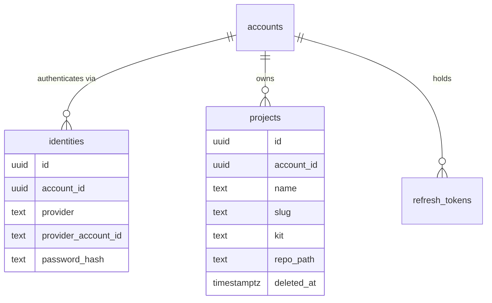

# PRD-101 — Accounts and projects: sign up, make games, and still have them tomorrow

**Status: COMPLETE, 2026-08-13.** The control plane, Postgres migrations, account/session routes,
project repository lifecycle, private sandbox-image seed worker, and dashboard are implemented
and verified on `docs/studio-hosting-series`.

**Complexity: 8 → HIGH mode.** New system (+2), 10+ files (+3), database schema (+1),
multi-package (+2).

**Problem:** the product is public and multi-tenant — thousands of strangers, each owning many
games — and there is currently no account, no project record, and nowhere a game survives a
process exit.

**This PRD executes no user code.** Project CRUD is an ordinary web application: it creates
records and git repositories and never runs an agent or a preview. That is why it can ship before
any sandbox hardening exists, and it is the only PRD in the series with that property.

---

## Current behaviour

- Studio is one process pinned to one directory passed as `--project` (`server.ts:553`).
- `POST /api/project/create` (`server.ts:682`) scaffolds into a path on the local disk via
  `createProject` from `create-threenative`; `GET /api/kits` (`server.ts:679`) lists the starter
  kits available to scaffold from.
- Checkpoints are ordinary git in the project directory — `projectGit.ts` `gitStatus`,
  `checkpoint`, `restoreRevision`, surfaced at `server.ts:893` and `server.ts:902`.
- There is no account, no ownership, no durability beyond the operator's filesystem.

---

## Solution

Postgres for identity and metadata; **one bare git repository per project as the source of
truth** for source. Studio already checkpoints with ordinary git, so the durable format is the
one the tool already writes — no new persistence concept enters the product.

**Key decisions**

- **JWT, and nothing more elaborate.** A short-lived access token (15 minutes) plus a rotating
  refresh token in an `HttpOnly; Secure; SameSite=Lax` cookie. Access tokens are verified with a
  shared secret in the control plane and by the sandbox sidecar from PRD-100.
- **A separate `identities` table from day one.** Email and password is one row with
  `provider = 'password'`. Google OAuth, when it arrives, is a second row against the same
  account — a new provider, not a migration of who a user is. This costs one table now and saves
  reworking every foreign key later.
- **Argon2id for password hashes.** Never bcrypt-with-a-custom-salt, never a home-rolled scheme.
- **Ownership failures return 404, not 403.** A 403 confirms that another account's project
  exists. On a public service that is an enumeration oracle.
- **Soft delete, then purge.** `deleted_at` hides the project immediately; a scheduled purge
  removes the repo after 30 days, so an accidental delete is recoverable.
- **Seeding runs in the PRD-100 sandbox image**, not in the control-plane process. The control
  plane must never run `pnpm install` or npm lifecycle scripts inside its own trust boundary.

**Data changes:** four new tables, first migration in the series.

---

## Integration Ledger

| # | New thing | Live caller (`file:line`, non-test) | Replaces | Old path removed? | Negative control |
|---|-----------|-------------------------------------|----------|-------------------|------------------|
| 1 | `POST /api/auth/signup`, `/login`, `/refresh`, `/logout` | `hosting/control-plane/server.ts:154-182` | nothing | n/a | a tampered token signature returns 401 |
| 2 | authenticated account lookup | `hosting/control-plane/server.ts:217-255` via `accountFrom()` | nothing | n/a | removing the account lookup makes an unauthenticated list succeed → test red |
| 3 | `POST /api/projects` → bare repo + seed commit | `hosting/control-plane/web/auth.ts:118-126` | `POST /api/project/create` for the hosted path only | n/a — the local Studio route stays for local users | a failed seed leaves **no** half-created project row |
| 4 | `projects` dashboard route | `hosting/control-plane/server.ts:90-119` and `web/App.tsx:21-33` | nothing | n/a | with the API empty, the page shows the empty state, not a crash |
| 5 | `identities` table | `hosting/control-plane/auth.ts:166-177` resolves an account through it | nothing | n/a | an account with no identity row cannot log in |
| 6 | `seedDevAccount()` | `hosting/control-plane/server.ts:312-329` after migrations | signing up by hand on every `compose up` | n/a | **it must throw when `STUDIO_ENV` is not `local`** — a known-password account anywhere else is a backdoor |

---

## Reachability

**How will this feature be reached?** A browser at `/` → signup form → dashboard.

**Pre-existing files EDITED:** `hosting/compose.yaml` (adds `postgres` and `control-plane`),
root `package.json` (adds `hosting:migrate`), `hosting/AGENTS.md` (records the 404-not-403 rule
and the "control plane never installs packages" rule).

**Full flow:** stranger opens the site → signs up → gets an access token and a refresh cookie →
dashboard calls `GET /api/projects` → clicks *New game*, picks a kit → control plane creates the
row, `git init --bare`, and dispatches one private seed request to the PRD-100 image → the project
appears in the list with a first commit → it is still there after `docker compose restart`.

**What does this replace?** Nothing for local users. `POST /api/project/create` in Studio remains
the local path and is untouched; the hosted path is a different consumer with a different trust
boundary, and the two do not both serve the same user.

---

## Phases

#### Phase 1: A stranger can sign up and log in — and a tampered token is rejected

**Files:**
- `hosting/control-plane/db/migrations/001_accounts.sql` — NEW: `accounts`, `identities`, `refresh_tokens`
- `hosting/control-plane/auth.ts` — NEW: argon2id hashing, JWT sign/verify, refresh rotation
- `hosting/control-plane/routes/auth.ts` — NEW
- `hosting/compose.yaml` — EDIT: `postgres` and `control-plane` services
- `package.json` — EDIT: `hosting:migrate`

**Implementation**
- [x] Access token 15 min, refresh 30 days, **rotated on every use**; a reused refresh token
      revokes the whole family and forces re-login.
- [x] `JWT_SECRET` absent is a startup failure. No default, no dev fallback.
- [x] Signup rejects a password under 12 characters and an email already holding a
      `provider = 'password'` identity.
- [x] **A local development account, seeded on `compose up`.** `seedDevAccount()` runs after
      migrations and creates `dev@localhost` with a password from `DEV_ACCOUNT_PASSWORD`
      (defaulting to a documented literal), so hosting work starts from a logged-in browser
      rather than a signup form. It is idempotent — re-running leaves one account and does not
      reset the password.
- [x] **It refuses to run outside `STUDIO_ENV=local`, and the refusal is a throw, not a skip.**
      An account with a published password reachable from the internet is a backdoor, and a
      silent skip is how one ends up shipped: the deploy looks identical either way. Throwing
      makes a misconfigured environment fail the release, which is the same shape as PRD-103's
      sandbox-driver guard and PRD-104's key check.
- [x] The credentials are printed once at boot, in the compose logs, so they are discoverable
      without reading source.

**Wiring**
- [x] Caller edited: `compose.yaml` runs the control plane and depends on `postgres`.
- [x] Registration: routes mounted in `hosting/control-plane/server.ts`.
- [x] Ledger rows filled: #1, #5.

**Tests Required**

| Test File | Test Name | Assertion | Negative control (observed red) |
|---|---|---|---|
| `hosting/control-plane/__tests__/auth.spec.ts` | `should return 401 when the token signature is tampered` | 401, no account body | verify with `{ algorithms: ['none'] }` → 200, red |
| `…/auth.spec.ts` | `should revoke the family when a refresh token is reused` | second use of an old token 401s and invalidates the new one | drop rotation → both succeed, red |
| `…/auth.spec.ts` | `should refuse to start when JWT_SECRET is unset` | boot throws | add a default secret → boots, red |
| `…/auth.spec.ts` | `should store passwords as argon2id` | hash begins `$argon2id$` | swap in plaintext → red |
| `…/dev-seed.spec.ts` | `should create a usable dev account when STUDIO_ENV is local` | login with the documented credentials returns a token | skip the seed → 401, red |
| `…/dev-seed.spec.ts` | `should throw when STUDIO_ENV is not local` | throws; **no account row is created** | return early instead of throwing → a silent skip passes, red |
| `…/dev-seed.spec.ts` | `should leave one account when run twice` | one row; the password is unchanged | recreate on each run → duplicate or reset, red |

**Revert check:** remove `requireAccount` → the Phase 2 project tests return data without a token.

**User Verification** — sign up, log out, log back in, and confirm the session survives a browser
restart via the refresh cookie.

---

#### Phase 2: Create a game and it exists — a row, a bare repo, and a first commit

**Files:**
- `hosting/control-plane/db/migrations/002_projects.sql` — NEW
- `hosting/control-plane/projects.ts` — NEW: create, list, `git init --bare`, seed dispatch
- `hosting/control-plane/routes/projects.ts` — NEW
- `hosting/sandbox/seed.sh` — NEW: scaffold a kit, commit, push to the bare repo
- `hosting/compose.yaml` — EDIT: `git-store` volume shared with the seed container

**Implementation**
- [x] `POST /api/projects {name, kit}` where `kit` is validated against the kits
      `create-threenative` actually ships — an unknown kit is a 400, never a default.
- [x] Seeding runs as a one-shot container from the PRD-100 image. On failure the transaction
      rolls back and the bare repo is removed: **no half-created project is ever listed.**
- [x] `GET /api/projects` returns only the caller's non-deleted projects.
- [x] `seedDevAccount()` gains a seeded project so `compose up` lands on a game rather than an
      empty grid. It goes through the same create path as any customer's — no special-case
      insert, or the dev environment stops exercising the code production runs.

**Wiring**
- [x] Caller edited: `compose.yaml` mounts `git-store`; routes registered on the app.
- [x] Ledger row filled: #3.

**Tests Required**

| Test File | Test Name | Assertion | Negative control (observed red) |
|---|---|---|---|
| `…/projects.spec.ts` | `should create a bare repo with one commit when a project is created` | `git log --oneline` in the bare repo has exactly 1 entry | stub the seed to no-op → 0 commits, red |
| `…/projects.spec.ts` | `should leave no project row when seeding fails` | count unchanged after a forced seed failure | remove the rollback → orphan row, red |
| `…/projects.spec.ts` | `should return 400 when the kit is unknown` | 400, no repo created | fall back to a default kit → 201, red |
| `…/projects.spec.ts` | `should list only the caller's projects` | another account's project absent | drop the `account_id` filter → present, red |

**Revert check:** rename `projects.ts` → the dashboard's list call 404s and Phase 3 tests fail.

---

#### Phase 3: Rename, fork and delete — and another account's project simply does not exist

**Files:**
- `hosting/control-plane/projects.ts` — EDIT: rename, fork, soft delete, purge job
- `hosting/control-plane/routes/projects.ts` — EDIT
- `hosting/control-plane/db/migrations/003_soft_delete.sql` — NEW
- `hosting/control-plane/__tests__/ownership.spec.ts` — NEW

**Implementation**
- [x] Fork is `git clone --bare` plus a new row; the fork's history starts from the source's tip.
- [x] Delete sets `deleted_at`; a purge job removes repos older than 30 days.
- [x] **Every project route resolves by `(id, account_id)`.** A miss is a 404.

**Wiring**
- [x] Caller edited: routes now pass the caller's account into every lookup.
- [x] Ledger row filled: #2.

**Tests Required**

| Test File | Test Name | Assertion | Negative control (observed red) |
|---|---|---|---|
| `…/ownership.spec.ts` | `should return 404 when the project belongs to another account` | 404 and an empty body | resolve by `id` alone → 200, red |
| `…/ownership.spec.ts` | `should not leak existence through the status code` | 404 for both a foreign id and a random uuid | return 403 for the foreign one → red |
| `…/projects.spec.ts` | `should copy history when a project is forked` | fork tip equals source tip, rows differ | `git init --bare` instead of clone → 0 commits, red |
| `…/projects.spec.ts` | `should keep a deleted project restorable for 30 days` | repo present, list excludes it | hard delete → repo gone, red |

**Revert check:** remove the `account_id` predicate → `ownership.spec.ts` fails.

---

#### Phase 4: The dashboard — the page a stranger lands on, and not the only place projects are managed

The endpoints built in Phases 1–3 have a second consumer: the session chrome in
[PRD-102](./PRD-102-session-broker.md) Phase 5, which lets a customer create, load, rename and
delete games from inside the screen they edit on. This phase owns the landing page; it does not
own project management.

**Files:**
- `hosting/control-plane/web/App.tsx` — NEW: project grid, new-game modal, kit picker
- `hosting/control-plane/web/auth.tsx` — NEW: signup/login forms, token refresh
- `hosting/control-plane/routes/index.ts` — EDIT: serves the app shell
- `hosting/__tests__/dashboard.e2e.spec.ts` — NEW: Playwright
- `hosting/compose.yaml` — EDIT: dev server for the web app

**Implementation**
- [x] Empty state that names the next action; loading and error states for every call.
- [x] Kit picker reads `GET /api/kits`, reusing the preview images Studio already serves.

**Wiring**
- [x] Caller edited: `server.ts` serves the shell at `/`.
- [x] Ledger row filled: #4.

**Tests Required**

| Test File | Test Name | Assertion | Negative control (observed red) |
|---|---|---|---|
| `…/dashboard.e2e.spec.ts` | `should show a created game in the grid after signup` | the card with the entered name is visible | stub `POST /api/projects` to 500 → red |
| `…/dashboard.e2e.spec.ts` | `should show the empty state for a new account` | empty-state copy visible, no crash | render the grid unconditionally → red |

**Revert check:** remove the shell route → the E2E suite cannot load the page.

**User Verification (manual, HIGH)** — sign up in a private window, create two games, rename one,
delete the other, `docker compose restart`, and confirm the list is unchanged.

---

## Execution evidence

All commands below ran on `docs/studio-hosting-series` on 2026-08-13.

- `pnpm exec vitest run hosting/control-plane/__tests__` — **4 files, 17 tests passed**. This
  covers Argon2id password storage, fifteen-minute access tokens, refresh rotation and family
  revocation, missing-secret rejection, local-only dev seeding, idempotence, bare-repo commits,
  rollback, kit validation, fork history, soft delete/purge, route auth, dashboard shell, and
  cross-account 404s for get/rename/fork/delete.
- `RUN_HOSTING_BROWSER=1 pnpm exec vitest run hosting/__tests__/dashboard.e2e.spec.ts` — **2/2
  passed**. The real dashboard shell showed both the empty state and a newly created game.
- `RUN_HOSTING_INTEGRATION=1 pnpm exec vitest run hosting/__tests__/compose.spec.ts` — **4/4
  passed** against the built Postgres, control-plane, seed-runner, and sandbox graph. Measured
  cold boot was **5,385 ms** and warm boot was **4,210 ms**.
- A real Compose run with Postgres and the private seed worker accepted a signed-in dev login and
  `POST /api/projects` returned **201** for a starter game. A separate persistence run listed the
  seeded `Welcome game`, restarted only `control-plane`, logged in again, and returned the same
  project UUID and name. The volumes were then removed because this was an isolated test stack.
- A production-mode Compose probe logged `TN_DEV_SEED_FORBIDDEN` and never created the dev
  account. The schema review confirms Google OAuth can add an `identities` row while preserving the
  `accounts` and `projects` foreign keys; OAuth itself is not claimed here.
- `pnpm typecheck && pnpm lint && pnpm test` — passed. The root suite reported **117 files, 988
  passed, 7 skipped**; the runtime-native suite reported **42 files, 249 passed, 31 skipped**;
  native physics parity also passed. Lint exited 0 with the repository's existing **197
  warn-level cognitive-complexity diagnostics**.

Negative controls were exercised and rejected: tampered access tokens return 401; reusing a
rotated refresh token revokes the family; short or absent JWT secrets throw; short passwords and
duplicate emails fail; unknown kits create no repository; forced seed failure removes both the
bare repository and project row; foreign-account get/rename/fork/delete operations all return
404; and non-local dev seeding throws before creating an account. The seed worker copies only
trusted image templates and uses `--ignore-scripts` for non-warm kits; the control plane never
runs customer package installation or lifecycle code.

## Acceptance criteria

- [x] A stranger with no prior state signs up, creates a game, closes the browser, returns the
      next day and the game is still listed with its history.
- [x] A second account cannot see, rename, fork or delete the first account's game, and cannot
      learn whether it exists.
- [x] A failed scaffold leaves nothing behind — no row, no repo, no entry in the grid.
- [x] `docker compose up` on a clean machine ends with a browser logged in as `dev@localhost`
      holding one seeded game, with no signup step — and the same command in any non-local
      environment fails rather than seeding it.
- [x] Google OAuth can be added later by inserting an `identities` row, with no change to
      `accounts`, `projects` or any foreign key. Recorded as a schema review, not a claim of
      working OAuth.
- [x] Every gate has a recorded negative control that was observed failing.
- [x] No user-supplied code is executed anywhere in this PRD.

## Out of scope

Sessions, sandboxes, running an agent, previews, OpenRouter, billing, teams and sharing. A
project created here is a repository nobody has opened yet — PRD-102 opens it.

**Password reset and email verification are deferred by owner decision, 2026-08-13**, along with
the transactional-email dependency they would require. Signup and login are the only auth
surfaces in this series. What that costs is recorded in
[PRD-105](./PRD-105-production-lane.md) Phase 5, where it bears on the signup gate: recovery is
operator-assisted, and unverified signup makes the quota and spend caps load-bearing rather than
convenient. Account settings — change password, delete account — ship in PRD-105 Phase 4.
