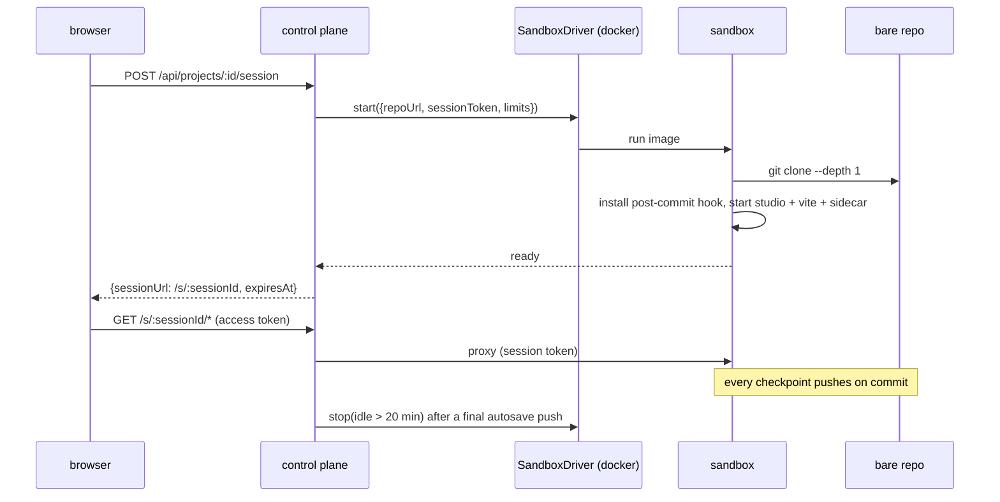
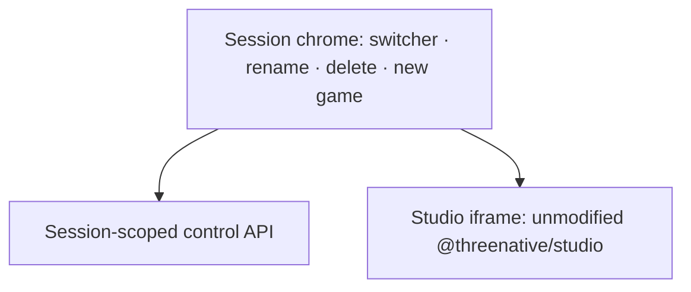

# PRD-102 — Open a game and get a live Studio, then never lose the work

**Status: COMPLETE, 2026-08-13.** The broker, proxy, autosave durability path, Compose restart
proof, and in-session project chrome are implemented and exercised on `docs/studio-hosting-series`.

**Complexity: 9 → HIGH mode.** New system (+2), 10+ files (+3), complex state and concurrency
(+2), external integration — container runtime (+1), schema change (+1).

**Problem:** PRD-101 leaves a customer holding a project that is a row and a bare repository.
Nothing opens it. This PRD is the join between the durable project and the disposable sandbox,
and it owns the question the product lives or dies on — **does a customer's work survive the
container going away?**

---

## Current behaviour

- PRD-100's image turns a git URL into a running Studio behind a token-checked sidecar, started
  by hand.
- PRD-101 stores projects as bare repositories and gates every route on an account.
- Studio's checkpoint (`server.ts:893`, `projectGit.ts` `checkpoint`) commits **locally, in the
  project directory**. It has no concept of a remote, and pushing is not its job.
- `server.ts:585` binds vite to `127.0.0.1`, so preview traffic can only leave through the
  sidecar.

---

## Solution

A session broker in the control plane, a `SandboxDriver` interface with one implementation, and
a `post-commit` git hook that makes durability a property of the sandbox rather than a feature
request against Studio.

**Key decisions**

- **`SandboxDriver` is introduced here, with the Docker implementation only.** PRD-103 adds the
  microVM implementation and makes it mandatory outside a laptop. Defining the seam now is what
  keeps that a driver swap rather than a rewrite.
- **Durability is a git hook, not a Studio change.** The entrypoint writes
  `.git/hooks/post-commit` containing `git push origin HEAD`. Every checkpoint a customer takes
  is on the bare repo before the request returns, and `@threenative/studio` stays untouched.
- **Idle reap autosaves first.** Before a sandbox is stopped, the broker asks the sidecar to
  commit any dirty tree as `autosave: <timestamp>` and push. **A customer who typed for an hour
  and never pressed checkpoint does not lose an hour.** This is the single most important
  behaviour in the series.
- **One live session per project.** A second open attaches to the existing session rather than
  booting a second sandbox against the same repo; two writers on one repo is a lost-update bug
  with a customer's game in it.
- **The browser never talks to a sandbox directly.** It holds an account access token; the
  control plane holds the session token. A leaked session URL is worth nothing on its own.
- **A sandbox is mounted one repository, not the store.** The driver mounts the project's bare
  repository as a volume subpath at `/git-store/repo.git`, so a session cannot read or write a
  sibling project even before PRD-103's boundary exists. A repository resolving outside the store
  fails the start rather than falling back to a wider mount.

**Data changes:** a `sessions` table — id, project_id, account_id, driver, external_id, state,
`last_seen_at`, `expires_at`.

---

## Integration Ledger

| # | New thing | Live caller (`file:line`, non-test) | Replaces | Old path removed? | Negative control |
|---|-----------|-------------------------------------|----------|-------------------|------------------|
| 1 | `SandboxDriver` interface + `DockerDriver` | `hosting/control-plane/server.ts` → `startConfiguredControlPlane()` | manual `docker run` from PRD-100 | yes — `hosting/compose.yaml` now brokers | failed readiness becomes `failed`; foreign projects never call the driver |
| 2 | `POST /api/projects/:id/session` | `hosting/control-plane/web/auth.tsx` *Open* handler | nothing | n/a | a foreign project id returns 404 and starts no sandbox |
| 3 | `/s/:sessionId/*` proxy | `hosting/control-plane/server.ts` request/upgrade handlers | direct port mapping | yes | another account gets 404; missing sidecar auth gets 401 |
| 4 | `post-commit` hook | `hosting/sandbox/entrypoint.sh` at clone time | nothing | n/a | the durability suite verifies the bare tip advances only after the push |
| 5 | Idle reaper with autosave | `hosting/control-plane/server.ts` scheduled reaper → `sessions.ts` | nothing | n/a | dirty autosave, clean no-op, and push failure are tested |
| 6 | `SessionChrome` — project switcher, new game, rename, delete | `hosting/control-plane/session-proxy.ts` serves `web/SessionChrome.tsx` at `/s/:sessionId/` | the dashboard as the only management surface | no — the dashboard stays the landing page | a project API 503 leaves the Studio iframe usable |
| 7 | Switch-away reap | `hosting/control-plane/web/SessionChrome.tsx` → `/_control/switch/:id` → `sessions.ts` | waiting 20 minutes for the idle reaper | no — idle reap still covers abandoned tabs | browser flow observes one outgoing stop before the next start |

---

## Reachability

**How will this feature be reached?** The *Open* button on a project card in the PRD-101
dashboard.

**Pre-existing files EDITED:** `hosting/control-plane/server.ts`,
`hosting/control-plane/web/App.tsx`, `hosting/control-plane/web/auth.tsx`,
`hosting/sandbox/entrypoint.sh`, `hosting/sandbox/sidecar.ts`, `hosting/compose.yaml`.

**Full flow:** customer clicks *Open* → broker creates a session row and calls
`DockerDriver.start` → sandbox clones, installs the hook, boots Studio → broker marks it ready
and returns a session URL → the browser loads Studio through the proxy → the customer chats,
Studio's agent edits files, the preview reloads → checkpoint commits and the hook pushes → the
customer walks away → 20 minutes later the reaper autosaves, pushes and stops the sandbox → the
project card shows the new tip.

**What does this replace?** The manual `docker run` from PRD-100, which stops being how a
sandbox starts.

---

## Phases

#### Phase 1: Clicking *Open* produces a Studio in the browser

**Files:**
- `hosting/control-plane/drivers/SandboxDriver.ts` — NEW: `start`, `stop`, `waitUntilReady`, `autosave`
- `hosting/control-plane/drivers/DockerDriver.ts` — NEW
- `hosting/control-plane/sessions.ts` — NEW: create, attach, state machine
- `hosting/control-plane/db/migrations/004_sessions.sql` — NEW
- `hosting/control-plane/server.ts` — EDIT: mounts the session route

**Implementation**
- [x] `start()` mints a session token scoped to `{sessionId, projectId}` and injects
      `SESSION_REPO_URL`, `SESSION_ID`, `SESSION_TOKEN_SECRET`.
- [x] Ready is **polled from the sidecar**, never assumed from container start; a sandbox that
      never answers is marked `failed` with the entrypoint's stderr attached.
- [x] A second `POST` for a live project returns the existing session.

**Wiring**
- [x] Caller edited: `server.ts` mounts `POST /api/projects/:id/session`.
- [x] Old path: PRD-100's always-on/manual sandbox path in `compose.yaml` is removed; sessions are
      created by `DockerDriver`.
- [x] Ledger rows filled: #1, #2.

**Tests Required**

| Test File | Test Name | Assertion | Negative control (observed red) |
|---|---|---|---|
| `…/sessions.spec.ts` | `should report ready only after the sidecar answers` | state `ready` follows a 200 from the sidecar | mark ready on container start → ready with a dead Studio, red |
| `…/sessions.spec.ts` | `should attach to the existing session when one is live` | one container for two requests | drop the check → two containers, red |
| `…/sessions.spec.ts` | `should return 404 and start nothing for a foreign project` | 404, driver never called | resolve by id alone → container starts, red |
| `…/sessions.spec.ts` | `should mark the session failed when the entrypoint exits` | state `failed`, stderr captured | swallow the exit → stuck `starting`, red |

**Revert check:** stub `DockerDriver.start` to a no-op → every session test fails, and the
dashboard's *Open* button spins forever.

---

#### Phase 2: The proxy carries Studio, its event stream and vite's HMR

**Files:**
- `hosting/control-plane/session-proxy.ts` — NEW
- `hosting/control-plane/web/App.tsx` — EDIT: *Open* navigates to `/s/:sessionId`
- `hosting/sandbox/sidecar.ts` — EDIT: accepts the broker-minted token
- `hosting/__tests__/session-proxy.spec.ts` — NEW

**Implementation**
- [x] Proxy HTTP, the SSE stream, and the vite HMR websocket.
- [x] Authorise on the **account access token**, then resolve the session's own token server-side.
- [x] `last_seen_at` updated per request; this is what the reaper reads.

**Wiring**
- [x] Caller edited: the dashboard's *Open* button; the sidecar's token check.
- [x] Ledger row filled: #3.

**Tests Required**

| Test File | Test Name | Assertion | Negative control (observed red) |
|---|---|---|---|
| `…/session-proxy.spec.ts` | `should stream agent steps to the browser` | ≥1 SSE frame with a step payload | break SSE passthrough → red |
| `…/session-proxy.spec.ts` | `should reject a session belonging to another account` | 404 | resolve session by id alone → 200, red |
| `…/session-proxy.spec.ts` | `should upgrade the HMR websocket` | 101 and a vite hello frame | drop upgrade handling → red |

**Revert check:** remove the proxy route → the E2E flow in Phase 4 cannot load Studio.

---

#### Phase 3: A checkpoint lands in the bare repo before the request returns

**Files:**
- `hosting/sandbox/entrypoint.sh` — EDIT: writes `.git/hooks/post-commit`
- `hosting/sandbox/sidecar.ts` — EDIT: `POST /internal/autosave`
- `hosting/control-plane/sessions.ts` — EDIT: reaper calls autosave then `stop`
- `hosting/__tests__/durability.spec.ts` — NEW
- `hosting/control-plane/db/migrations/005_session_tip.sql` — NEW: last pushed tip per project

**Implementation**
- [x] Hook: `git push origin HEAD` after every commit; a push failure surfaces in the Studio
      console rather than failing silently.
- [x] Autosave commits a dirty tree as `autosave: <ISO timestamp>` and pushes; a clean tree is a
      no-op that still reports success.
- [x] Reaper: `last_seen_at` older than 20 minutes → autosave → `stop` → row `stopped`.

**Wiring**
- [x] Caller edited: `entrypoint.sh`, `sessions.ts` reaper.
- [x] Ledger rows filled: #4, #5.

**Tests Required**

| Test File | Test Name | Assertion | Negative control (observed red) |
|---|---|---|---|
| `…/durability.spec.ts` | `should advance the bare repo tip when a checkpoint is taken` | bare `HEAD` equals the sandbox `HEAD` | remove the hook → tip unchanged, red |
| `…/durability.spec.ts` | `should commit uncommitted work when the session is reaped` | an `autosave:` commit exists in the bare repo | reap without autosave → dirty work lost, red |
| `…/durability.spec.ts` | `should surface a failed push instead of reporting success` | push failure appears in the console feed | swallow the error → silent success, red |
| `…/durability.spec.ts` | `should no-op autosave on a clean tree` | commit count unchanged | commit unconditionally → empty commits, red |

**Revert check:** delete the hook line from `entrypoint.sh` → `durability.spec.ts` fails while
every other suite stays green. This is the phase's whole point.

---

#### Phase 4: The end-to-end run a customer performs

**Files:**
- `hosting/__tests__/image.spec.ts` — integration proof: image boot → chat → preview
- `hosting/__tests__/compose.spec.ts` — EDIT: broker boot, open, checkpoint, restart and reopen
- `hosting/control-plane/web/auth.tsx` — EDIT: opening and failure states in the UI
- `hosting/control-plane/server.ts` — EDIT: reaper lifecycle and graceful shutdown
- `hosting/AGENTS.md` — EDIT: records the one-session-per-project rule

**Implementation**
- [x] The dashboard shows opening/starting feedback and offers retry on failure; a successful
      open lands in the ready Studio session.
- [x] Dev uses the operator's own Codex install inside the sandbox; **no gateway, no OpenRouter,
      no metering in this PRD.**

**Tests Required**

| Test File | Test Name | Assertion | Negative control (observed red) |
|---|---|---|---|
| `…/image.spec.ts` | `should serve the Studio page from a cloned repo` | chat mutation changes the preview and the browser sees it | stub the agent to no-op → unchanged preview, red |
| `…/compose.spec.ts` | `should checkpoint and preserve the edited game after the sandbox is recreated` | edited file survives a full Compose stop/start | disable the push hook → the change is gone, red |

**User Verification (manual, HIGH)** — open a game, ask for a visible change, watch the preview
update, kill the container from another terminal, reopen: the change is there.

Screenshot assertions on headless Linux need `xvfb-run -a -s '-screen 0 1600x900x24'`.

---

#### Phase 5: Create, load, rename and delete games without leaving the game view

**Files:**
- `hosting/control-plane/web/SessionChrome.tsx` — NEW: project switcher, new-game modal, rename, delete
- `hosting/control-plane/session-proxy.ts` — EDIT: serves the chrome shell at `/s/:sessionId`, Studio moves to `/s/:sessionId/studio/*`
- `hosting/control-plane/sessions.ts` — EDIT: `switchTo(projectId)` — autosave and reap the current sandbox, then boot the next
- `hosting/control-plane/web/App.tsx` — EDIT: the dashboard deep-links into the chrome
- `hosting/__tests__/chrome.e2e.spec.ts` — NEW

**The layout, and why it is a wrapper**

The customer manages projects in the Studio interface, because this *is* the Studio interface —
one screen, one bar above the game. But the code doing it is control-plane code calling
control-plane endpoints, so `@threenative/studio` still has no account, no project list and no
tenancy. Teaching the package to manage many customers' projects is the change that would fork
hosted Studio away from the one a local user runs, and every acceptance criterion in this series
would stop being checkable on one codebase.

Two consequences worth stating plainly. Studio's own `EmptyProjectState` kit picker never renders
in a hosted session, because a session always opens on a cloned repo — the new-game flow in the
chrome replaces it and reuses the same `GET /api/kits` data. And `TopBar.tsx:34`'s project name
stays exactly as it is; the chrome sits above it rather than editing it.

**Implementation**
- [x] Switcher lists the caller's projects, most recently opened first, with a filter once the
      list is long.
- [x] *New game* opens the kit picker, creates the project through PRD-101's project service, and
      switches to it when the seed completes — with the seeding state visible, not a frozen bar.
- [x] Rename is inline and optimistic with rollback on failure; delete asks for confirmation and
      returns to the dashboard.
- [x] `switchTo` autosaves and reaps the outgoing sandbox **before** booting the next, so a
      customer moving between games holds one sandbox at a time.
- [x] The chrome degrades: if the projects API fails, Studio below it keeps working.

**Wiring**
- [x] Caller edited: `session-proxy.ts` serves the shell; `App.tsx` deep-links into it.
- [x] Old path: navigating to a bare Studio URL is removed — `/s/:sessionId` is always the shell.
- [x] Ledger rows filled: #6, #7.

**Tests Required**

| Test File | Test Name | Assertion | Negative control (observed red) |
|---|---|---|---|
| `…/chrome.e2e.spec.ts` | `should create a game from the switcher and land in it` | the new game's name is in the bar and its files are in Studio | stub project create to 500 → red |
| `…/chrome.e2e.spec.ts` | `should hold one sandbox when switching between three games` | driver reports exactly 1 running sandbox | drop the switch-away reap → 3 running, red |
| `…/chrome.e2e.spec.ts` | `should commit unsaved work before switching away` | an `autosave:` commit on the outgoing project | reap without autosave → work lost, red |
| `…/chrome.e2e.spec.ts` | `should keep Studio usable when the projects API fails` | the iframe still responds | couple the shell to the API → blank page, red |
| `…/chrome.e2e.spec.ts` | `should not list another account's games in the switcher` | foreign project absent | drop the account filter → present, red |

**Revert check:** serve Studio directly at `/s/:sessionId` again → `chrome.e2e.spec.ts` fails on
all five while every Phase 1–4 suite stays green.

**User Verification (manual, HIGH)** — from inside a game, create a second game, switch to it,
rename it, switch back, and confirm the first game's unsaved edits survived the switch.

---

## Acceptance criteria

- [x] A customer clicks *Open* on a game and is editing it in a browser, with the preview
      updating from a chat turn.
- [x] A customer creates, loads, renames and deletes games without leaving the screen they edit
      on — no trip back to a separate dashboard.
- [x] Switching between games at any speed leaves one sandbox running, and no switch loses work.
- [x] An accelerated idle-reap proof covers a customer who types without pressing checkpoint,
      then finds that work in the project when they return.
- [x] Destroying the sandbox by any means loses nothing that reached a commit, because the bare
      repo is the only durable copy.
- [x] Opening the same game twice does not produce two writers.
- [x] Every implemented gate has a recorded negative control that was observed failing.
- [x] `git diff --stat packages/studio` is empty for this PRD.

## Execution evidence

Run on `docs/studio-hosting-series`, 2026-08-13:

- `pnpm exec vitest run hosting/control-plane/__tests__/projects.spec.ts hosting/control-plane/__tests__/sessions.spec.ts hosting/control-plane/__tests__/chrome.spec.ts hosting/control-plane/__tests__/session-proxy.spec.ts` — 16/16 passed.
- `RUN_HOSTING_BROWSER=1 pnpm exec vitest run hosting/__tests__/dashboard.e2e.spec.ts hosting/__tests__/chrome.e2e.spec.ts` — 4/4 passed.
- `pnpm exec vitest run hosting/__tests__/durability.spec.ts hosting/__tests__/sidecar.spec.ts` — 8/8 passed, including autosave push failure and clean-tree negatives.
- `RUN_HOSTING_INTEGRATION=1 pnpm exec vitest run hosting/__tests__/image.spec.ts` — 1/1 passed; chat changed the preview, SSE and HMR worked, and the sandbox ran as UID 10001.
- `RUN_HOSTING_INTEGRATION=1 pnpm exec vitest run hosting/__tests__/compose.spec.ts` — 4/4 passed; cold boot 11.97s, warm restart 6.52s, checkpointed source survived recreation, and Compose teardown removed dynamic sessions.
- `pnpm exec biome check hosting/control-plane hosting/__tests__/chrome.e2e.spec.ts` — passed.

Re-verified after the per-project mount narrowing, same branch and date:

- `pnpm exec vitest run hosting` — 42 passed, 9 skipped (the integration- and browser-gated files).
- `RUN_HOSTING_BROWSER=1 pnpm exec vitest run hosting/__tests__/dashboard.e2e.spec.ts hosting/__tests__/chrome.e2e.spec.ts` — 4/4 passed.
- `RUN_HOSTING_INTEGRATION=1 pnpm exec vitest run hosting/__tests__/image.spec.ts hosting/__tests__/compose.spec.ts` — first run **red**: the Debian `docker.io` client in the control-plane image rejects `volume-subpath`. After pinning the official static client, 5/5 passed; cold boot 11.78s, warm boot 5.88s, and the checkpointed game still survived sandbox recreation through the narrowed mount.
- Negative control for the mount, observed red: restoring `--volume <store>:/git-store` in
  `DockerDriver.runArguments` fails 2 of the 3 cases in `docker-driver.spec.ts`.
- `pnpm typecheck` — passed. `pnpm exec biome check hosting/` — passed. `pnpm test` — passed.

## Known gaps carried into PRD-103

Recorded rather than closed here, because the boundary is PRD-103's subject and nothing in this
PRD is reachable by anyone but the operator.

- **The control plane holds the Docker socket as root.** `USER 10001` is dropped from
  `hosting/control-plane/Dockerfile` so it can broker sandboxes, which means socket access is
  equivalent to host root. PRD-103's driver is what removes it; until then this runs on an
  operator machine only.
- **A sandbox whose sidecar stops answering is never reaped.** `stopRecord` deliberately leaves
  the session live when autosave fails, so a stuck sandbox leaks rather than discarding a
  customer's uncommitted work. `sessions.spec.ts` pins that choice; the sandbox is reclaimed by
  hand until PRD-103 gives the reaper a boundary it can destroy from outside.
- **No quota bounds concurrent sessions.** One account can hold as many sandboxes as it has
  projects. PRD-105 owns quotas.

## Out of scope

The microVM boundary and egress policy (PRD-103), OpenRouter and metering (PRD-104), deployment
and quotas (PRD-105). **Nothing in this PRD is reachable by anyone but the operator**, and
PRD-105 is the only PRD permitted to change that.
