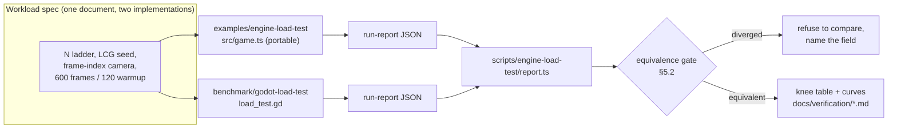

# PRD-117 — The engine load test: what ThreeNative and Godot each cost per object, on the browser and on one Android phone

**Status: EXECUTED, 2026-08-15. Web and desktop closed; the phone arm is running.** The
plan below was written before any of it ran, so tables in later sections may still show the
shape rather than the result — `docs/verification/engine-load-test-summary-2026-08-15.md`
is the record of what was actually measured, and it wins over any number here.

Two comparisons now pass `checkEquivalence`: **web L2** (ThreeNative 3.9× faster at 16 384,
knee 16 384 against no Godot knee on the ladder) and **desktop L2** (3.0× faster at 16 384,
knee 65 536 against 16 384). Both arms uncapped, same display, triangle counts identical.

**One fair comparison is lost and stays lost: web L1**, one `Mesh` per cube with no batching
on either side — knee 1 024 against Godot's 4 096. Profiling puts the whole gap inside
three.js's WebGPU per-object submission path (~11.3 µs/object against Godot's ~5.3 µs), which
is upstream of this framework. An earlier revision of the summary claimed wins on all three
platforms by pairing ThreeNative's L3 against Godot's L1 and by quoting web L2 alone; those
claims were withdrawn on 2026-08-15 and the gate now runs on every published pair.

**Complexity: 6 → MEDIUM mode.** A new example, a new Godot project, a new scorer, and one
external toolchain (Godot export templates) plus one device lane. No package changes, no
framework surface, no new public API.

**Blast radius.** `examples/engine-load-test/` (new), `benchmark/godot-load-test/` (new),
`scripts/engine-load-test/` (new), `scripts/__tests__/` (new spec), root `package.json`
(new `bench:engines` scripts), `docs/verification/engine-load-test-<date>.md` (new).
`packages/**` is not touched by this PRD. If a fix to the framework is implied by a result,
it is a different PRD.

**Depends on and does not overlap:**

- **PRD-066** measured the Pixel 8 at 4.5 fps on a debug APK and 24.8 fps once the native
  runtime was compiled `-O2`. That build-type trap is the single largest unfairness risk in
  this document, and §4.4 makes the release build a precondition rather than a footnote.
- **PRD-068** closed with per-draw JavaScript cost (~118 µs/draw) as the residual, not the
  interpreter. This PRD does not attribute cost to a layer; it measures where each engine's
  knee is. Attribution stays with PRD-069 and PRD-072.
- **PRD-073** owns what a framework game gets for free, and built the frame-cost
  observation channel this PRD's ThreeNative arm reuses rather than reinventing.
- **PRD-058** owns performance thresholds. **This PRD sets no threshold, tunes none, and
  waives none.** It produces two curves and a comparison document.

Godot is named ~30 times in this repository, always as the source of node vocabulary. This
is the first time it is used as a performance control.

---

## 1. Why this exists

The framework's pitch is that the same source runs on web and native. The question a game
developer actually asks before adopting it is the one nobody here has answered: **how much
does it cost me, compared to the engine I would otherwise use?**

Today the honest answer is "unknown". The repository has real numbers — 10 µs per mesh per
frame on a Pixel 8, ~118 µs per draw — but no external reference. A number with no control
is a number nobody can act on: 24.8 fps at 2,358 meshes could be excellent or embarrassing,
and this repo cannot say which.

Godot is the right control, and not only because it is already the vocabulary source. It is
free, scriptable from the command line, exports to the browser and to Android from one
project, and is the engine a solo developer building a small 3D game would most plausibly
pick instead. Comparing against it answers the adoption question directly.

**What this PRD is not.** It is not a marketing benchmark, and it is not a graphics-API
microbenchmark. Godot's browser export runs a different rendering backend than its Android
export, and both differ from what ThreeNative ships. Normalising that away would produce a
comparison of nothing. **The comparison is product-to-product: what each engine actually
ships to a browser tab, and what each engine actually ships to a phone.** §4 states that
framing once, and §8 forbids restating any result as an API-level claim.

---

## 2. What is measured, in one sentence

> The **knee**: the largest object count at which the 95th-percentile wall-clock frame
> interval stays at or below **20 ms**, on a display pinned to 60 Hz.

Everything else in this document exists to make that one number fair.

### 2.1 Why the knee, and not frames per second

A browser cannot present faster than vsync. Chrome's `requestAnimationFrame` is
vsync-locked, so on a 60 Hz display every unloaded web arm reports ~16.7 ms and every
comparison of "fps" between a web arm and a native arm is a comparison of the monitor.

The knee is immune to this. Below the knee both engines read ~16.7 ms and the reading is
uninformative — that is fine, because the knee is defined by the *first ladder step that
crosses the line*, not by how far below the line an arm sits. The 20 ms threshold (50 fps)
leaves headroom so a 60 Hz vsync tick plus jitter does not trip the knee at zero load.

Secondary, reported and never used for a verdict: CPU work per frame, draw calls per frame,
triangles per frame, and the raw sample series. Each engine defines "CPU work" differently;
that is exactly why it cannot decide anything here.

---

## 3. The workload

Primitives, deliberately. A cube ladder is not a proxy for a game's art, but it is an exact
proxy for a game's **per-object cost**, which is what both engines actually charge for and
what PRD-066 found the phone could not pay.

### 3.1 The scene, identical on both engines

| Property | Value | Why it is pinned |
|---|---|---|
| Viewport | 1280×720, windowed, no resize | Resolution changes fill rate; fill rate is not what this measures |
| Ground | one 200×200 plane, static, lit | Gives the camera something to frame; costs one draw on both |
| Load objects | `N` unit cubes, seeded lattice + jitter | The whole load axis |
| Material | one shared lit material, no textures, no per-object colour | Two shaders is two experiments |
| Lighting | one `DirectionalLight`, no shadows, no ambient | Shadow maps are a second load axis; out of scope |
| Post / AA / tonemap | none, none, whatever each engine defaults to | Post is a third load axis; the tonemap difference is visual, not measurable at this cost |
| Per-frame churn | every cube rotates by a fixed delta and bobs on Y | 100% dirty transforms — the honest worst case, and what a game with moving actors pays |
| Camera | scripted orbit, **a pure function of frame index** | See §3.3. This is the control most benchmarks get wrong |
| Off-screen fraction | ~35% of cubes outside the frustum at all times | Culling is per-object work and both engines do it |

### 3.2 The ladder and the modes

```
N ∈ { 256, 1024, 4096, 16384 }
```

Two render modes, run at every rung:

- **L1 — per-object.** One node per cube: `Mesh` on ThreeNative, `MeshInstance3D` on Godot.
  This is how a game is written before anyone optimises it, and it is the mode where PRD-066
  found the phone's ceiling.
- **L2 — batched.** One batched node for all cubes: `InstancedMesh` on ThreeNative,
  `MultiMeshInstance3D` on Godot. This is the mode a developer moves to after hitting L1,
  and it separates "per-object CPU cost" from "the GPU can't draw this many boxes".

L1 and L2 at the same `N` are the same picture. That is the point: the gap between the two
curves is each engine's per-object overhead, isolated.

Each rung runs **600 frames**, of which the **first 120 are discarded** as warm-up (shader
compilation, allocator warm-up, JIT tiers, texture upload). Three repeats per rung; the
report carries all three and the verdict uses the median.

### 3.3 Determinism, and the trap it avoids

**The camera is driven by frame index, never by wall-clock time.**

If the camera advances on elapsed time, a slow engine sees a *different scene* than a fast
one: it skips ahead, frames a different fraction of the cubes, and culls a different number
of them. The slower arm then gets measured on an easier or harder scene than the faster arm,
and the result is noise dressed as a finding. Driving on frame index means frame 317 shows
byte-identical framing on every arm, on every platform, on every run.

The cube positions come from an integer LCG specified once and implemented identically in
TypeScript and GDScript:

```
state = 1337
next():  state = (state * 1664525 + 1013904223) mod 2^32;  return state / 2^32
```

`Math.random()` is forbidden in both arms. The equivalence gate in §5.2 hashes the first
eight cube positions from each arm and refuses to publish a comparison when they differ.

---

## 4. Fairness, stated as rules

Every rule here is a rule because breaking it silently produces a publishable number that
is wrong.

### 4.1 Both sides run a release build

ThreeNative Android must be built with the `-O2` native runtime PRD-066 landed. Godot
Android and web must be exported with **release** export templates, not debug. A debug-vs-
release comparison is not a comparison; PRD-066 measured that exact mistake costing a 5.5×
frame-time difference on the same phone with the same source.

The report carries the build type for both arms. **The scorer refuses to compare a
release arm against a debug arm** and says so rather than printing a ratio.

### 4.2 Both sides get the same display

60 Hz, pinned. The Pixel 8 is variable-refresh; the run script sets a fixed 60 Hz mode and
records what it got. The scorer refuses to compare two arms whose recorded refresh rates
differ.

### 4.3 Both sides get the same device state

For the Android arms: battery ≥ 50% and on the same power state for every run, airplane
mode on, brightness fixed, screen on, no other app foregrounded, and a **5-minute cool-down
between rungs**. Thermal throttling is the largest source of phone-benchmark nonsense and it
biases whichever arm ran second. The three repeats therefore alternate arms
(`TN, Godot, TN, Godot, TN, Godot`) rather than running all of one arm then all of the other.

### 4.4 Neither side gets a hand-tuned scene

No engine-specific optimisation that the other cannot express. No occlusion culling on one
side only, no LOD on one side only, no shadow atlas tuning, no manual batching beyond the L2
mode both engines have a first-class node for. If an engine's default is different (Godot's
Mobile renderer versus its Forward+ renderer), the default that ships is what is measured,
and the report records which one ran.

### 4.5 The comparison is product-to-product, and the report says so on every page

| Arm | What actually runs | Recorded in the report |
|---|---|---|
| `tn-web` | Chrome, WebGPU, V8 | browser build, GPU adapter string |
| `godot-web` | Godot's web export — Compatibility/WebGL2 unless 4.7.1 reports otherwise | rendering driver string, exactly as the engine reports it |
| `tn-android` | Own C++ runtime, QuickJS, WebGPU bindings | runtime build type, JS engine, adapter |
| `godot-android` | Godot's Android export, Mobile renderer unless it reports otherwise | rendering driver string |

The rendering driver is read from the engine at runtime and written into the report — never
assumed from documentation. **A report missing its driver line is not comparable and the
scorer drops it**, because a Godot web arm that silently fell back to a different backend
would otherwise be published as a Godot result.

### 4.6 What this PRD does not measure, and why

| Not measured | Why not, in one line |
|---|---|
| Physics | Rapier versus Jolt at equal configuration is not equal quality; it needs its own equivalence gate and its own PRD |
| Shadows, post, AA | Each is a separate load axis and would confound the per-object curve this PRD exists to draw |
| Load time, binary size, memory | Real adoption questions, different instrument, different PRD |
| iOS | No Apple hardware here; the hosted runner is simulator-class and a simulator frame rate is not a device frame rate |
| Desktop native | Optional diagnostic only — see Phase 5, run only if the Android result needs attribution |

---

## 5. Architecture



### 5.1 The run-report contract

One JSON shape, written by both arms, validated fail-closed. Missing field, wrong type, or
empty sample array is an error — never a default, never a skip. This repository's most
expensive past failure was a harness that dropped malformed assertions and reported pass;
the scorer is written to the opposite rule.

```jsonc
{
  "arm": "tn-web" | "tn-android" | "godot-web" | "godot-android",
  "engine": { "name": "threenative" | "godot", "version": "..." },
  "build": { "type": "release" | "debug", "notes": "..." },
  "display": { "refreshHz": 60, "width": 1280, "height": 720 },
  "driver": { "renderer": "...", "adapter": "..." },   // read from the engine, never assumed
  "device": { "label": "Pixel 8 shiba 37251FDJH0037Z" | "desktop-chrome-linux", "battery": 87 },
  "rungs": [{
    "mode": "L1" | "L2",
    "objectCount": 4096,
    "repeat": 0,
    "positionHash": "…",          // first 8 cube positions, §3.3
    "frameMs": [ /* 480 samples, warm-up already dropped */ ],
    "drawCalls": 4098,
    "triangles": 49176,
    "visibleObjects": 2661
  }]
}
```

### 5.2 The equivalence gate

The gate is the reason this is a fair test rather than two unrelated numbers printed side by
side. Before any comparison is produced, both reports must agree on:

1. **`positionHash`** — identical, or the two scenes are not the same scene.
2. **`objectCount`, `mode`, sample count** — identical per rung.
3. **`drawCalls`** — within tolerance for the mode. L1 must be ≈ `N` on both engines
   (±2 for the ground and any engine-internal pass); L2 must be small and comparable. An arm
   reporting 1 draw where the other reports 4,096 has silently auto-batched and **is not
   running L1** — that is the single most likely way this comparison gets published wrong.
4. **`triangles`** — within 5%.
5. **`display.refreshHz` and `build.type`** — identical across arms.

Any failure prints the diverging field and **exits non-zero without emitting a comparison**.
Refusing to publish is the success case for this gate.

---

## 6. Integration Ledger

Filled with real `file:line` during implementation. A `TBD` at phase end means the phase is
incomplete.

| # | New thing | Live caller (`file:line`, non-test) | Replaces | Old path removed? | Negative control |
|---|---|---|---|---|---|
| 1 | `examples/engine-load-test` workload | root `package.json` → `bench:engines` script | nothing — no engine control exists today | n/a | `N=0` rung reports floor cost; a 4× `N` step must raise p95 |
| 2 | `scripts/engine-load-test/report.ts` | root `package.json` → `bench:engines:report`; invoked by `bench:engines` | nothing | n/a | a report with an empty `frameMs` array exits non-zero |
| 3 | equivalence gate (§5.2) | `report.ts` main path | nothing | n/a | hand-edit one `positionHash` → comparison refused, field named |
| 4 | `benchmark/godot-load-test/` | `bench:engines --arm godot-web` | nothing | n/a | Godot arm with auto-batched L1 (`drawCalls == 1`) is rejected |
| 5 | `docs/verification/engine-load-test-<date>.md` | linked from `docs/README.md` | nothing | n/a | doc generation fails when any arm is missing its driver line |

**Reachability.** Entry point is a pnpm script a human runs. Pre-existing file edited: root
`package.json`. Not user-facing — this is an instrument, and its consumer is the verification
document in `docs/verification/`. Nothing here is reachable from a scaffolded game, and
nothing here may become a default gate: **`pnpm test` must not require Godot**, exactly as it
must not require CMake or an NDK.

---

## 7. Phases

Each phase edits at least one pre-existing file and ends with something a human can run.

### Phase 1 — One arm, one curve: ThreeNative in a browser

**Outcome:** `pnpm bench:engines --arm tn-web` runs the full ladder in Chrome and prints a
knee.

**Files (6 — one over the guideline, because the example cannot boot without its own
`index.html` and `package.json`):**

- `examples/engine-load-test/src/game.ts` — NEW: the portable workload (§3), default export
  so the native arms in Phase 4 reuse it unchanged
- `examples/engine-load-test/src/main.ts` — NEW: web entry, drives the ladder, POSTs/downloads
  the run report
- `examples/engine-load-test/index.html`, `package.json` — NEW: scaffold
- `scripts/engine-load-test/report.ts` — NEW: schema validation, knee computation, markdown
- `package.json` — EDIT: `bench:engines`, `bench:engines:report`

**Implementation:**

- [ ] LCG, lattice, frame-index camera, per-frame churn — exactly §3
- [ ] Ladder driver: 4 rungs × 2 modes × 3 repeats, 600 frames each, 120 discarded
- [ ] Sample `renderer.info` for draw calls and triangles per rung (the channel PRD-073 built)
- [ ] Write `artifacts/engine-load-test/tn-web.json` in the §5.1 shape
- [ ] `report.ts`: parse fail-closed, compute p50/p95, compute the knee, emit a markdown table

**Tests:**

| Test file | Test name | Assertion | Negative control (must be observed red) |
|---|---|---|---|
| `scripts/__tests__/engine-load-test.spec.ts` | `should reject a rung with an empty frame series` | throws `TN_BENCH_EMPTY_SERIES` | delete the guard → test goes green-to-red as expected |
| same | `should compute the knee as the largest rung at or below 20 ms p95` | knee === 4096 on a crafted series | shift the fixture 1 ms up → knee drops a rung |
| same | `should reject a report missing its driver line` | exits non-zero | remove the check → the fixture passes, proving the check is what caught it |

**Verification:**

- [ ] `pnpm typecheck && pnpm lint && pnpm test` green
- [ ] `N=0` rung runs and reports floor cost (the harness itself is not the load)
- [ ] Each 4× ladder step raises p95 on at least one mode — if it does not, the load is not
      reaching the renderer and the phase is not done
- [ ] `pnpm budgets` still green (a new example must not trip a hard invariant)

---

### Phase 2 — The Godot project, same ladder, same JSON

**Outcome:** `pnpm bench:engines --arm godot-web` produces a report in the identical shape.

**Files:**

- `benchmark/godot-load-test/project.godot`, `load_test.gd`, `export_presets.cfg` — NEW
- `scripts/engine-load-test/run-godot.ts` — NEW: headless export, static serve with the
  cross-origin-isolation headers a Godot web export requires, drive, collect
- `scripts/engine-load-test/report.ts` — EDIT: accept `godot-*` arms

**Implementation:**

- [ ] GDScript port of §3, LCG included, verified against the TS implementation by hash
- [ ] Vsync off, `Engine.max_fps = 0`, fixed 1280×720 window
- [ ] Read draw calls and triangles from `RenderingServer.get_rendering_info(...)`, and the
      driver string from the engine — record whatever names 4.7.1 actually exposes, do not
      assume the enum spelling from memory
- [ ] Document the export-template install as an opt-in step; it is never part of `pnpm test`

**Verification:**

- [ ] Both arms' `positionHash` match — the scenes are the same scene
- [ ] L1 `drawCalls` ≈ `N` on the Godot arm; if Godot auto-batches, **the mode is renamed and
      the finding is recorded**, not quietly compared against ThreeNative's `N` draws
- [ ] Godot report carries a real driver string

---

### Phase 3 — The first comparison: two browsers-worth of curve

**Outcome:** `pnpm bench:engines --compare` prints the knee table for `tn-web` vs
`godot-web`, or refuses and names the field.

**Files:** `scripts/engine-load-test/report.ts` — EDIT (equivalence gate §5.2);
`scripts/__tests__/engine-load-test.spec.ts` — EDIT; `docs/verification/engine-load-test-<date>.md` — NEW.

**Verification:**

- [ ] Gate observed red: hand-edit one `positionHash`, one `refreshHz`, one `build.type`, and
      one L1 `drawCalls` — four separate refusals, each naming its field, each pasted into the
      PRD
- [ ] Comparison document states the product-to-product framing of §4.5 and carries every
      driver string

---

### Phase 4 — The phone (device-gated) — **RUN 2026-08-15, provisional**

`scripts/engine-load-test/run-android.ts` exists and `pnpm bench:engines --arm tn-android` drives
the installed APK and collects its report from logcat. The battery precondition is enforced in code,
not by discipline: below 50% the run refuses and names the override. Both arms have been measured on
a Pixel 8 — see `docs/verification/engine-load-test-summary-2026-08-15.md`. The result is
**provisional**: the device sat at 21–25%, so the criterion below is not yet formally satisfied.

The ThreeNative arm now runs V8 rather than QuickJS (PRD-118), which is what made it competitive.


**Outcome:** the same table for `tn-android` vs `godot-android` on one named physical device.

**Preconditions, all hard:** a physical Android device attached; the ThreeNative APK built
from the `-O2` runtime; the Godot APK exported with release templates; 60 Hz pinned; §4.3
device state honoured.

**Files:** `scripts/engine-load-test/run-android.ts` — NEW; `scripts/engine-load-test/report.ts` — EDIT;
the verification doc — EDIT.

**Verification:**

- [ ] Build type of both APKs recorded and asserted `release`
- [ ] Arms alternated per repeat (§4.3); the report shows the interleave
- [ ] Thermal check: repeat 3 within 15% of repeat 1 on the same arm, or the run is discarded
      and rerun after cool-down
- [ ] The document names the device (model, serial, OS, GPU) and claims nothing about any
      other phone, any other chip, or iOS

---

### Phase 5 — Desktop native control (optional, diagnostic only)

Run **only if** the Android result needs attribution: ThreeNative desktop (V8, own runtime)
against Godot desktop (Forward+). It separates "the phone is slow" from "the engine is slow",
which is the question a reader will ask first if the Android arms diverge. Skip it entirely
if they do not.

---

## 8. Acceptance criteria

Consumer-scoped. Each one is only satisfiable by something that ran.

- [ ] A reader can state the largest cube count each engine sustains at 50 fps in a browser
      tab, in both L1 and L2, from a table in `docs/verification/`
- [ ] The same statement exists for one named physical Android device, or the Android section
      says **UNMEASURED — no device** and the PRD stays open
- [ ] Feeding the scorer two reports that disagree on scene, display, or build type produces
      a refusal naming the field, and that refusal is pasted into the PRD
- [ ] Every published number carries the rendering driver each engine reported for itself
- [ ] `pnpm test`, `pnpm typecheck`, `pnpm lint`, `pnpm budgets` are green **without Godot
      installed** — the whole benchmark is opt-in
- [ ] No sentence in the output compares graphics APIs, claims mobile-readiness, claims iOS,
      or generalises beyond the one device that ran

Explicitly **not** an acceptance criterion: that ThreeNative wins, ties, or comes within any
factor of Godot. A result showing the framework 5× slower at L1 is a successful execution of
this PRD, and would be the most valuable thing it could produce.

---

## 9. Risks

| # | Risk | Mitigation |
|---|---|---|
| 1 | Vsync flattens every reading | The knee only needs to detect crossing 20 ms; §2.1 |
| 2 | One arm silently auto-batches L1 | Draw-call equivalence gate refuses the comparison; §5.2 |
| 3 | A debug build is compared to a release build | Build type in the report, asserted; PRD-066 is the precedent |
| 4 | Phone thermal drift biases the second arm | Alternating repeats + cool-down + a 15% drift check; §4.3 |
| 5 | The benchmark creeps into the default gate | Godot is opt-in; the acceptance criteria require green gates on a machine without it |

**Failure mode this PRD is most likely to hit:** publishing a comparison of two scenes that
were not the same scene. Every gate in §5.2 exists for that one risk.
