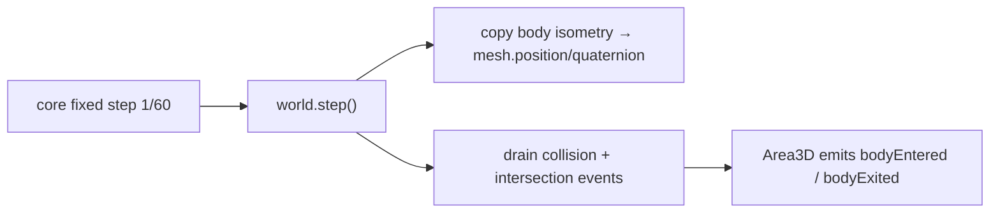

# PRD-003 — `@threenative/physics`

**Complexity: 5 → MEDIUM mode**
(6-10 files +2, new module +2, external library integration +1)

**Depends on:** PRD-002. **Blocks:** PRD-004, 005.
**Design authority:** `DESIGN.md` §5, §7, §11.1, §11.4, §11.5.

---

## 1. Context

**Problem:** Binding Rapier to a Three.js scene graph is the same 150 lines in every
game: create a world, step it at a fixed rate, and copy body transforms onto meshes.

**Files analyzed:** `DESIGN.md` §5 (the API sketch and the 20-line rule);
`packages/core/src/game.ts` (the fixed-timestep loop this must hook into).

**Current behavior:** none. `ctx.physics` is `undefined` after PRD-002.

**Incumbent census:** none in this repo. Externally, `@react-three/rapier` occupies the
same niche for R3F — noted in `DESIGN.md` §4 as a real strength of the road not taken.
This package is its non-React equivalent.

---

## 2. Solution

**Approach:**
- `rapier()` is a plugin. `defineGame({ plugins: [rapier({...})] })` populates
  `ctx.physics`.
- Four classes, all Godot names, all thin: `RigidBody3D`, `CharacterBody3D`, `Area3D`,
  `CollisionShape3D`.
- The world steps inside `core`'s existing fixed-timestep loop — **not on its own
  clock.** One accumulator, not two.
- Transform sync is one direction by default: physics → mesh. Kinematic bodies opt into
  mesh → physics.

**Key decisions:**
- [ ] `@dimforge/rapier3d-compat` over `rapier3d` — inlined WASM avoids per-bundler
      configuration for users (§9c).
- [ ] **Every wrapper exposes its raw objects.** `body.body` is a Rapier `RigidBody`;
      `body.mesh` is a `THREE.Mesh`; `ctx.physics.world` is a Rapier `World`. There is
      nothing to unwrap (§5).
- [ ] `CollisionShape3D.fromMesh()` supports box/sphere/capsule/trimesh/convex hull —
      no more. Anything else, the user builds a Rapier collider directly and passes it.

**The 20-line rule applies hardest here.** Each class is justified below, and any that
cannot beat 20 lines of user code is deleted before merge:

| Class | Why it survives the rule |
|---|---|
| `RigidBody3D` | body + collider + per-step transform copy + disposal ≈ 80 lines |
| `CharacterBody3D` | wraps Rapier's `KinematicCharacterController` incl. slopes/steps ≈ 90 lines |
| `Area3D` | intersection queries → enter/exit events with pair bookkeeping ≈ 60 lines |
| `CollisionShape3D` | geometry → collider desc across 5 shape kinds ≈ 70 lines |

**Data changes:** none.



---

## 3. Integration Ledger

| # | New thing | Live caller (`file:line`, non-test) | Replaces | Old path removed? | Negative control |
|---|-----------|-------------------------------------|----------|-------------------|------------------|
| 1 | `rapier()` plugin | `examples/abyss-framework/src/main.ts` plugins array | nothing | n/a | remove from plugins → `ctx.physics` undefined, scene throws |
| 2 | world step hook | `packages/core/src/game.ts` fixed-step block | nothing | n/a | skip the step call → bodies never fall |
| 3 | `RigidBody3D` | `examples/abyss-framework/src/entities/Crate.ts` | nothing | n/a | stop the transform copy → mesh stays at origin while the body falls |
| 4 | `Area3D` | `examples/abyss-framework/src/scenes/Play.ts` (pickup trigger) | nothing | n/a | never drain events → `bodyEntered` never fires, score stays 0 |
| 5 | `CollisionShape3D.fromMesh` | `Crate.ts`, `Play.ts` | nothing | n/a | return a unit box for every input → a large mesh falls through the floor |

---

## 4. Reachability

**How is this reached?**
- Entry point: `core`'s fixed-timestep block, which calls `physics.step(STEP)` each
  simulation tick.
- Pre-existing file EDITED: `packages/core/src/game.ts` gains the plugin step hook —
  **this is the wiring, and without it the package is dead code.**
- Registration: the `plugins` array in `defineGame`.

**User-facing?** Yes — objects fall, collide, and trigger pickups on screen.

**Full flow:**
1. `defineGame({ plugins: [rapier({gravity})] })` constructs a Rapier `World`.
2. `Game.start()` registers the plugin's `step` on the fixed-timestep hook.
3. Each 1/60 tick: `world.step()`, then every `RigidBody3D` copies its isometry to its mesh.
4. `Area3D` drains intersection events and emits `bodyEntered` / `bodyExited`.
5. Observable in: a crate visibly falls and lands; touching a pickup increments the HUD score.

---

## 5. Execution Phases

### Phase 1 — A crate falls and lands

**Files:**
- `packages/physics/src/plugin.ts` — NEW: `rapier()`, world construction, step
- `packages/physics/src/RigidBody3D.ts` — NEW
- `packages/physics/src/CollisionShape3D.ts` — NEW
- `packages/core/src/game.ts` — **EDIT**: call plugin `step(dt)` inside the fixed block
- `examples/abyss-framework/src/entities/Crate.ts` — NEW: a crate on a static floor

**Implementation:**
- [ ] Await `RAPIER.init()` during `Game.start()` before the first frame
- [ ] `RigidBody3D({ mesh, shape, mass, type })`; `type` ∈ dynamic/fixed/kinematic
- [ ] After `world.step()`, copy `body.translation()` / `body.rotation()` onto the mesh
- [ ] `CollisionShape3D.box|sphere|capsule|fromMesh`

**Wiring:**
- [ ] Caller edited: `packages/core/src/game.ts` — the step hook
- [ ] Registration: `plugins: [rapier(...)]` in the example's `main.ts`
- [ ] Ledger rows: #1, #2, #3, #5

**Tests required:**

| Test file | Test name | Assertion | Negative control (observe red) |
|---|---|---|---|
| `physics/__tests__/rigidbody.spec.ts` | `should move the mesh downward when the body falls` | after 60 steps under −9.81, `mesh.position.y` decreased by 1.3–1.7 | disable the transform copy → mesh stays at y=0, test fails |
| `physics/__tests__/rigidbody.spec.ts` | `should rest on a fixed floor rather than pass through` | after 300 steps, `y` within 0.05 of the floor top | replace `fromMesh` with a unit box for a 4-unit crate → sinks, test fails |
| `physics/__tests__/plugin.spec.ts` | `should step exactly once per fixed tick` | 60 sim ticks → 60 `world.step` calls | step in `requestAnimationFrame` instead → count drifts with refresh rate, test fails |

**Revert check:** delete the step hook in `game.ts` → the falling-crate test fails.

**User verification:** `pnpm --filter abyss-framework dev` — a crate falls and rests.

---

### Phase 2 — Touching a pickup scores: `Area3D`

**Files:**
- `packages/physics/src/Area3D.ts` — NEW
- `packages/physics/src/plugin.ts` — **EDIT**: drain the event queue each step
- `packages/physics/src/index.ts` — **EDIT**: export
- `examples/abyss-framework/src/scenes/Play.ts` — **EDIT**: pickup trigger → `state.set`
- `packages/physics/__tests__/area.spec.ts` — NEW

**Implementation:**
- [ ] Sensor collider; `EventQueue` drained once per step
- [ ] Pair bookkeeping so `bodyEntered` fires once on entry and `bodyExited` once on exit
- [ ] Handler receives the other `RigidBody3D`, or the raw Rapier collider if unwrapped

**Wiring:**
- [ ] Caller edited: `plugin.ts` drains events; `Play.ts` subscribes and writes score
- [ ] Ledger rows: #4

**Tests required:**

| Test file | Test name | Assertion | Negative control |
|---|---|---|---|
| `area.spec.ts` | `should fire bodyEntered exactly once while a body remains inside` | 1 call across 100 overlapping steps | remove pair bookkeeping → 100 calls, test fails |
| `area.spec.ts` | `should fire bodyExited when the body leaves` | exit fires once after separation | never drain the queue → no events at all, both tests fail |

**Revert check:** stop draining the event queue → the score E2E stays at 0.

**User verification:** drive the crate into the pickup; the HUD score increments once.

---

### Phase 3 — A controlled character walks up a step: `CharacterBody3D`

**Files:**
- `packages/physics/src/CharacterBody3D.ts` — NEW
- `packages/physics/src/index.ts` — **EDIT**
- `examples/abyss-framework/src/entities/Player.ts` — **EDIT**: use it with `input`
- `packages/physics/__tests__/character.spec.ts` — NEW

**Implementation:**
- [ ] Wrap `KinematicCharacterController`: `maxSlopeClimbAngle`, `autostep`, `snapToGround`
- [ ] `move(desiredTranslation)` → `computedMovement()` applied to body and mesh
- [ ] Expose `.controller` (raw Rapier) and `.grounded`

**Tests required:**

| Test file | Test name | Assertion | Negative control |
|---|---|---|---|
| `character.spec.ts` | `should climb a 0.3-unit step without stopping` | ends past the step, `y` raised ≈0.3 | disable autostep → blocked at the step face, test fails |
| `character.spec.ts` | `should not climb a 60° slope` | horizontal progress ≈0 | set `maxSlopeClimbAngle` to 89° → climbs, test fails |

**Revert check:** remove `CharacterBody3D` from `Player.ts` → the movement E2E fails.

---

## 6. Acceptance Criteria

Consumer-scoped. Each requires code that runs, not code that exists.

- [ ] A player opens `examples/abyss-framework` and watches a crate fall and come to
      rest on the floor — not sink, not jitter, not hover.
- [ ] Driving the player into a pickup increments the HUD score **exactly once** per
      pickup, verified by eye and by E2E.
- [ ] The player walks up a low step and is stopped by a steep slope.
- [ ] `ctx.physics.world` is a real Rapier `World`: a user can call
      `world.createRigidBody(...)` directly, bypassing every wrapper, and it works.
- [ ] Physics remains deterministic across frame rates: the same input sequence at 30fps
      and 144fps produces final positions within 0.01 units.
- [ ] **Each of the four classes is measured against a hand-written vanilla equivalent
      in `examples/abyss-framework`. Any class that does not beat 20 lines of user code
      is deleted before this PRD closes** (§11.1, §11.2). Record the measurement.
- [ ] `packages/physics/src` is under 1,500 LOC and contains zero visual concerns.

**This PRD fails if:** the 20-line measurement kills more than one of the four classes
(that would mean the package itself is not carrying its weight), or if physics differs
between frame rates.

---

## 7. Verification Evidence

*(filled during implementation)*

| Gate | Result | Negative control observed red? |
|---|---|---|
| crate falls (mesh follows body) | | |
| crate rests on floor (shape fidelity) | | |
| one world.step per fixed tick | | |
| bodyEntered fires once | | |
| bodyExited fires on separation | | |
| character autostep | | |
| character slope limit | | |
| determinism 30fps vs 144fps | | |

**20-line rule measurement** *(fill before closing)*

| Class | Framework LOC | Hand-written vanilla equivalent LOC | Verdict |
|---|---:|---:|---|
| `RigidBody3D` | | | keep / delete |
| `CharacterBody3D` | | | keep / delete |
| `Area3D` | | | keep / delete |
| `CollisionShape3D` | | | keep / delete |

**Integration proof:**

```bash
# 1. Caller census
grep -rn "RigidBody3D\|Area3D\|CharacterBody3D\|CollisionShape3D" \
  packages examples --include=*.ts | grep -v __tests__ | grep -v ".spec."

# 2. The step hook exists in core and is not test-only
grep -n "step" packages/core/src/game.ts

# 3. Raw escape hatch is real
grep -rn "physics.world\|\.body\b\|\.controller" examples --include=*.ts
```
