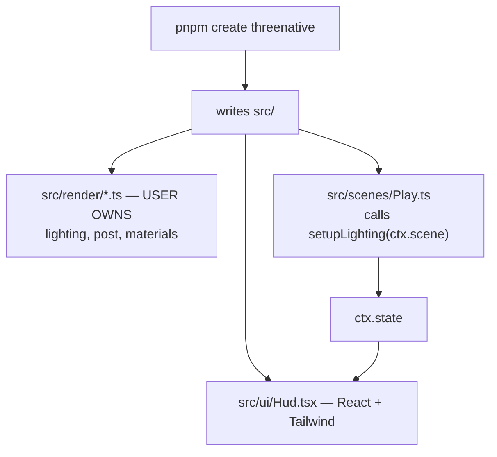

# PRD-004 — `create-threenative` and `@threenative/ui`

**Complexity: 7 → HIGH mode**
(10+ files +3, new system from scratch +2, multi-package +2)

**Depends on:** PRD-001, 002, 003. **Blocks:** PRD-005.
**Design authority:** `DESIGN.md` §1, §5b, §6b, §9b, §11.3.

---

## 1. Context

**Problem:** Two of the project's three promises live entirely in this PRD.
**"Looks good by default"** and **"the scaffold is the documentation"** are delivered by
generated files, not by framework code. If this PRD is weak, ThreeNative is a worse
vanilla Three.js.

**Files analyzed:** `DESIGN.md` §5b (the ownership boundary), §9b (the target tree),
§6b (React/Tailwind UI and the 60fps problem); `examples/abyss-vanilla/src/style.css`
(a working reference for HUD styling under a dark game canvas).

**Current behavior:** none. There is no scaffolder.

**Incumbent census:** none internally. Externally the incumbent is *"ask the model to
write a Three.js game from scratch"* — which is precisely the control in PRD-005.

---

## 2. Solution

**Approach:**
- `pnpm create threenative my-game` writes the tree in `DESIGN.md` §9b and nothing more.
- **`src/render/` is generated source, not framework config.** `lighting.ts`,
  `postprocessing.ts`, `materials.ts` are ordinary `three/webgpu` code in the user's
  repo. This is the entire mechanism by which "looks good by default" coexists with
  "never owns the look" (§5b).
- `@threenative/ui` is small: a `<GameCanvas>` mount and a `useGameState` hook over
  `core`'s store. React renders the HUD; it never touches the scene graph.
- The scaffold ships a **playable game**, not a hello-world: a character, a floor,
  pickups, a scoring HUD, and one green playtest scenario.

**Key decisions:**
- [ ] Generated visual code is deliberately readable and deliberately deletable. It
      carries a header comment saying so.
- [ ] `useGameState` uses `useSyncExternalStore` against `core`'s throttled store —
      React re-renders at ~10Hz, never at 60 (§6b).
- [ ] Tailwind 4 with the CSS-first config. HUD is `pointer-events-none` by default.
- [ ] Two templates only: `minimal` and `starter`. No genre presets — v1 shipped 7 and
      **0 ever reproduced their genre** (§2).

**Data changes:** none.



---

## 3. Integration Ledger

| # | New thing | Live caller (`file:line`, non-test) | Replaces | Old path removed? | Negative control |
|---|-----------|-------------------------------------|----------|-------------------|------------------|
| 1 | `create-threenative` CLI | `pnpm create threenative`; CI job `scaffold-smoke` | nothing | n/a | generate into a temp dir and delete a template file → smoke test fails |
| 2 | `src/render/lighting.ts` (generated) | generated `src/scenes/Play.ts` calls `setupLighting(ctx.scene)` | nothing | n/a | comment out the call → the scaffold screenshot goes dark, gate fails |
| 3 | `src/render/postprocessing.ts` (generated) | generated `Play.ts` calls `setupPost(...)` | nothing | n/a | remove the call → bloom absent, screenshot diff exceeds threshold |
| 4 | `@threenative/ui` `useGameState` | generated `src/ui/Hud.tsx` | nothing | n/a | freeze the store subscription → HUD numbers stop while play continues |
| 5 | `<GameCanvas>` | generated `src/ui/App.tsx` | nothing | n/a | unmount it → canvas absent, boot test fails |
| 6 | generated `tests/play.playtest.ts` | CI job `scaffold-smoke` runs it | nothing | n/a | break player movement in the template → the scenario must go red |

---

## 4. Reachability

**How is this reached?**
- Entry point: `pnpm create threenative my-game`, then `pnpm dev` inside it.
- Pre-existing files EDITED: `packages/core/src/index.ts` (re-export nothing new but
  bump the version contract), `.github/workflows/ci.yml` (**gains the `scaffold-smoke`
  job — this is the wiring that makes the templates non-dead**).
- Registration: the CI job is the registration. A template file no job renders is dead.

**User-facing?** Maximally. The generated game *is* the user-facing surface.

**Full flow:**
1. User runs `pnpm create threenative my-game`.
2. CLI writes the §9b tree, installs deps, prints next steps.
3. `pnpm dev` boots the game: lit scene, character, pickups, HUD.
4. `pnpm test` runs the generated playtest scenario, green.
5. Observable in: a screenshot a stranger would call a game, not a demo.

---

## 5. Execution Phases

### Phase 1 — `pnpm create threenative` produces a booting game

**Files:**
- `packages/create-threenative/src/index.ts` — NEW: CLI, prompts, file writer
- `packages/create-threenative/templates/starter/src/main.ts` — NEW
- `packages/create-threenative/templates/starter/src/scenes/Play.ts` — NEW
- `packages/create-threenative/templates/starter/package.json.hbs` — NEW
- `.github/workflows/ci.yml` — **EDIT**: add `scaffold-smoke` job

**Implementation:**
- [ ] Args: target dir, `--template minimal|starter`, `--no-install`
- [ ] Templates use `catalog:`-free literal versions (users are outside the workspace)
- [ ] `scaffold-smoke` generates into a temp dir, installs, builds, boots headless

**Wiring:**
- [ ] Caller edited: `.github/workflows/ci.yml`
- [ ] Ledger rows: #1

**Tests required:**

| Test file | Test name | Assertion | Negative control (observe red) |
|---|---|---|---|
| `create-threenative/__tests__/scaffold.spec.ts` | `should produce a tree matching DESIGN §9b` | every path in §9b exists | delete `src/render/lighting.ts` from the template → fails |
| CI `scaffold-smoke` | `should boot a generated project headlessly` | Playwright reaches a non-black frame in <5s | template `main.ts` missing `.start()` → black frame, fails |

**Revert check:** delete the `scaffold-smoke` job → Ledger #1 has no non-test caller → phase FAILS.

---

### Phase 2 — It looks good: generated `src/render/`

**This is the phase the project's second promise rests on. Proof subject is the real
target, not a toy: the full starter scene under its own lighting and post stack.**

**Files:**
- `templates/starter/src/render/lighting.ts` — NEW: key/fill/rim + shadow config
- `templates/starter/src/render/postprocessing.ts` — NEW: bloom + ACES tonemapping
- `templates/starter/src/render/materials.ts` — NEW: palette + shared material defaults
- `templates/starter/src/scenes/Play.ts` — **EDIT**: call all three in `enter()`
- `packages/create-threenative/__tests__/looks.spec.ts` — NEW

**Implementation:**
- [ ] Plain `three/webgpu`. **Zero imports from any `@threenative/*` package.**
- [ ] Header on each file: *"Generated for you. This is ordinary Three.js — edit or
      delete it freely. ThreeNative does not read these files."*
- [ ] Tonemapping ACES, considered exposure, a real 3-point rig, contact shadows

**Wiring:**
- [ ] Caller edited: generated `Play.ts` — these files are dead unless it calls them
- [ ] Ledger rows: #2, #3

**Tests required:**

| Test file | Test name | Assertion | Negative control |
|---|---|---|---|
| `looks.spec.ts` | `should render a scene with usable dynamic range` | luminance histogram: p5 > 0.02 and p95 < 0.98, ≥40 distinct buckets | comment out `setupLighting` → flat/dark histogram, fails |
| `looks.spec.ts` | `should differ measurably from the same scene with defaults stripped` | SSIM vs a no-render/ setup baseline < 0.9 | make `setupPost` a no-op → SSIM ≈1.0, fails |
| `looks.spec.ts` | `should keep src/render free of framework imports` | zero `@threenative/` imports under `src/render/` | add one → fails |

**Revert check:** remove the three `setup*` calls from `Play.ts` → both image gates fail.

**Manual checkpoint (HIGH, visual):** *the automated histogram cannot judge taste.*
Open the generated game and answer honestly: **would a stranger call this good-looking,
or would they call it a programmer-art demo?** If the latter, this phase is not done —
metrics passing is not sufficient. v1 shipped 6 genre presets that produced
indistinguishable arenas while all 6 automated metrics passed them.

---

### Phase 3 — The HUD reads game state: `@threenative/ui`

**Files:**
- `packages/ui/src/GameCanvas.tsx` — NEW
- `packages/ui/src/useGameState.ts` — NEW: `useSyncExternalStore` over core's store
- `packages/ui/src/index.ts` — NEW
- `templates/starter/src/ui/Hud.tsx` — NEW: React 19 + Tailwind 4
- `templates/starter/src/ui/App.tsx` — NEW: mounts `<GameCanvas>` + `<Hud>`

**Implementation:**
- [ ] `<GameCanvas game={game} />` owns mount/unmount and canvas sizing
- [ ] `useGameState(selector?)` — selector-based to avoid over-notifying
- [ ] HUD is absolutely positioned, `pointer-events-none`, `tabular-nums`

**Wiring:**
- [ ] Caller edited: generated `App.tsx`; `main.ts` renders it
- [ ] Ledger rows: #4, #5

**Tests required:**

| Test file | Test name | Assertion | Negative control |
|---|---|---|---|
| `ui/__tests__/useGameState.spec.tsx` | `should re-render at most 11 times per second under 600 store writes` | render count ≤11 | subscribe without the throttle → ~600, fails |
| `ui/__tests__/useGameState.spec.tsx` | `should not re-render when an unselected key changes` | count unchanged | drop the selector → re-renders, fails |
| E2E `scaffold-smoke` | `should show the score increasing after a pickup` | HUD text changes within 3s of a pickup | freeze the store flush → text static, fails |

**Revert check:** unmount `<Hud>` → the score E2E fails.

---

### Phase 4 — The scaffold proves itself: generated playtest

**Files:**
- `templates/starter/tests/play.playtest.ts` — NEW
- `templates/starter/package.json.hbs` — **EDIT**: `test` script
- `.github/workflows/ci.yml` — **EDIT**: `scaffold-smoke` runs the generated test
- `packages/create-threenative/__tests__/playtest.spec.ts` — NEW

**Implementation:**
- [ ] Scenario: press W for 1s → player displaced > 1 unit; touch pickup → score > 0;
      no console errors; non-black frame
- [ ] Uses the salvaged `@threenative/playtest` (`DESIGN.md` §8) **after** its validator
      fix lands — a scenario that silently drops assertions is worse than none

**Tests required:**

| Test file | Test name | Assertion | Negative control |
|---|---|---|---|
| `playtest.spec.ts` | `should go red when the template's player movement is broken` | mutate the template to ignore input → scenario fails | if it still passes, the scenario asserts nothing → phase FAILS |
| `playtest.spec.ts` | `should go red on a misspelled assertion key` | typo'd key throws `TN_PLAYTEST_SCENARIO_INVALID` | if it passes silently, the salvage fix is not in |

**Revert check:** break player movement in the template → CI goes red.

---

## 6. Acceptance Criteria

Consumer-scoped. Every one of these is checkable by a person looking at a screen.

- [ ] `pnpm create threenative my-game && cd my-game && pnpm dev` yields **a playable
      game** — move, collide, collect, see the score rise — with zero edits.
- [ ] **A stranger shown a screenshot of the unmodified scaffold calls it a game, not a
      demo.** Recorded verbatim, not paraphrased. (Manual, Phase 2.)
- [ ] Deleting all of `src/render/` and stubbing the three `setup*` calls leaves the
      game **running but ugly** — proving the framework never depended on those files
      (§5b).
- [ ] A user rewrites `src/render/postprocessing.ts` to use a custom TSL node and it
      works, with no framework change and no config flag.
- [ ] The HUD updates during play while React re-renders ≤11×/second at 60fps.
- [ ] Breaking player movement in the template turns CI red via the generated playtest.
- [ ] `packages/ui/src` is under 400 LOC; `create-threenative` source (excluding
      templates) is under 800 LOC.
- [ ] Zero `@threenative/*` imports anywhere under a generated `src/render/`.

**This PRD fails if:** the manual taste check in Phase 2 says "programmer-art demo", or
if the generated project cannot survive the deletion of `src/render/`.

---

## 7. Verification Evidence

*(filled during implementation)*

| Gate | Result | Negative control observed red? |
|---|---|---|
| scaffold tree matches §9b | | |
| generated project boots headlessly | | |
| luminance histogram (dynamic range) | | |
| SSIM vs stripped-defaults baseline | | |
| src/render has no framework imports | | |
| useGameState ≤11 renders/s | | |
| selector prevents extra renders | | |
| score visible after pickup (E2E) | | |
| playtest goes red on broken movement | | |
| playtest goes red on typo'd assertion | | |
| **manual: stranger calls it a game** | | n/a — human judgement |

**Integration proof:**

```bash
# 1. Caller census — generated render files are actually called
grep -rn "setupLighting\|setupPost\|setupMaterials" \
  packages/create-threenative/templates --include=*.ts | grep -v "/render/"

# 2. §5b enforcement — generated visual code must not import the framework
grep -rn "@threenative/" packages/create-threenative/templates/*/src/render/
# expected: no output

# 3. The scaffold job exists and is not test-only
grep -n "scaffold-smoke" .github/workflows/ci.yml
```
