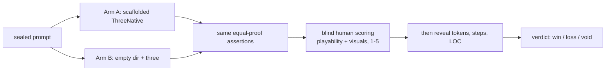

# PRD-005 — The Benchmark: ThreeNative vs Vanilla, Judged by an AI Build

**Complexity: 6 → MEDIUM mode**
(6-10 files +2, new system from scratch +2, multi-package +2)

**Depends on:** PRD-001, 002, 003, 004.
**Design authority:** `DESIGN.md` §3 (win condition + kill switch), §5b, §12.

---

## 1. Context

**Problem:** v1 died because it optimized a number it could not win and never scored the
one it lost. Its own audits recorded the decisive finding late:

> ThreeNative candidates were clear, basic implementations (manual playability **2**,
> visual **2**); vanilla candidates were generally more polished (**3**, **3**).
> **The unconstrained agent produced better-looking, more playable games. The
> abstraction is currently costing quality, not merely cost.**

And its decisive experiment was specified three times and **never run**.

This PRD builds the apparatus that runs it, and makes losing a legitimate outcome.

**Files analyzed:** `DESIGN.md` §3, §12; `examples/abyss-vanilla/src/main.js` (the
frozen ~400-line control); v1's `mcp-and-value-proposition-2026-07-25.md` (14x / 8.27x
measurement) and `OFF-RECIPE-EFFICIENCY-RERUN.md` (the quality scores above).

**Current behavior:** no benchmark exists. PRD-001 moved the control into
`examples/abyss-vanilla/` unchanged.

**Incumbent census:** the plumbing inside `abyss-vanilla/src/main.js`. The framework
port replaces it *as a demonstration*; the control itself stays frozen forever, since a
control that drifts is not a control.

---

## 2. Solution

**Approach — two independent measurements. Do not conflate them.**

**A. The static comparison (deterministic, runs in CI).**
Port Abyss to the framework by hand. Publish both line counts, split into plumbing and
game. This tests the kill switch (§3), not the product.

**B. The AI head-to-head (the real experiment, run manually).**
Give the same agent the same game prompt twice — once with a scaffolded ThreeNative
project, once with an empty directory and vanilla `three`. Measure cost **and quality**.

**Key decisions:**
- [ ] **Quality is scored by a human, blind, before any cost number is revealed.** v1's
      failure was invisible to every automated metric it had.
- [ ] Equal-proof contract: both arms must satisfy the *same* acceptance assertions, or
      the run is void. An arm that "finished" without meeting them scores zero, not fast.
- [ ] The prompt is written **before** the scaffold is built, sealed, and not tuned.
      v1's paved-road wins came from prompts that matched recipes built for them.
- [ ] Three repeats per arm. One run is an anecdote.
- [ ] Token counts come from the provider's authoritative final usage event only.

**Data changes:** none. Results land in `docs/benchmark/RESULTS-<date>.md`.



---

## 3. Integration Ledger

| # | New thing | Live caller (`file:line`, non-test) | Replaces | Old path removed? | Negative control |
|---|-----------|-------------------------------------|----------|-------------------|------------------|
| 1 | `examples/abyss-framework/` | `.github/workflows/ci.yml` job `benchmark` | the plumbing in `abyss-vanilla` (as demonstration only) | no — control frozen | break the port's input → its playtest goes red |
| 2 | `scripts/count-loc.ts` | `ci.yml` job `benchmark`; writes `README.md` table | nothing | n/a | classify all lines as "game" → the table shows 0 plumbing, gate fails |
| 3 | `README.md` comparison table | generated by CI on every push to main | nothing | n/a | stale table not regenerated → CI diff check fails |
| 4 | `docs/benchmark/PROTOCOL.md` + sealed prompt | the manual run; `RESULTS-<date>.md` cites it | nothing | n/a | edit the prompt after a run → hash mismatch voids the result |
| 5 | `scripts/score-blind.ts` | the manual run (shuffles + strips arm labels) | nothing | n/a | leave labels in the artifacts → scorer is unblinded, run void |

---

## 4. Reachability

**How is this reached?**
- Entry points: CI job `benchmark` (part A, every push) and a documented manual
  procedure (part B).
- Pre-existing files EDITED: `.github/workflows/ci.yml` gains the `benchmark` job;
  `README.md` gains the generated table.
- Registration: CI job + the protocol document.

**User-facing?** The README table is the public claim. It must be generated, never typed.

**Full flow (part B):**
1. Operator seals the prompt and records its hash.
2. Arm A: `pnpm create threenative`, hand the agent the prompt.
3. Arm B: empty dir with `three` installed, same prompt, same proof contract.
4. Both artifacts stripped of identifying marks and shuffled by `score-blind.ts`.
5. Human plays both, scores playability and visuals 1–5, **before** seeing cost.
6. Costs revealed; `RESULTS-<date>.md` written; verdict recorded.

---

## 5. Execution Phases

### Phase 1 — The framework port exists and plays identically

**Files:**
- `examples/abyss-framework/src/main.ts` — NEW: `defineGame`
- `examples/abyss-framework/src/scenes/Play.ts` — NEW: the TSL compute + gameplay
- `examples/abyss-framework/src/render/*.ts` — NEW: lighting/post, copied from control
- `examples/abyss-framework/tests/play.playtest.ts` — NEW
- `.github/workflows/ci.yml` — **EDIT**: `benchmark` job builds and tests both examples

**Implementation:**
- [ ] **The ~230 game lines are ported verbatim where possible.** Only plumbing changes.
- [ ] The TSL compute shader is copied unchanged — it is game code, and the framework
      must not touch it (§5b)
- [ ] Both examples must satisfy the *same* playtest scenario

**Wiring:** caller edited: `.github/workflows/ci.yml`. Ledger row #1.

**Tests required:**

| Test file | Test name | Assertion | Negative control (observe red) |
|---|---|---|---|
| `abyss-framework/tests/play.playtest.ts` | `should pass the same scenario as the vanilla control` | identical assertions green on both | break input in the port → red on the port only |
| `benchmark/__tests__/parity.spec.ts` | `should reach comparable particle counts and frame time` | port within 15% of control's median frame time | render 900 particles instead of 90,000 → fails |

**Revert check:** delete the port → the `benchmark` CI job fails.

**User verification:** play both builds back to back. They should feel the same.

---

### Phase 2 — The line-count table is generated, not asserted

**Files:**
- `scripts/count-loc.ts` — NEW: classifies each line plumbing vs game
- `README.md` — **EDIT**: generated comparison table between markers
- `.github/workflows/ci.yml` — **EDIT**: regenerate and fail on diff
- `scripts/__tests__/count-loc.spec.ts` — NEW

**Implementation:**
- [ ] Classification rules are explicit and committed, not heuristic-by-vibe
- [ ] Table columns: file, plumbing LOC, game LOC, total — for both arms
- [ ] **The table also states which rows vanilla wins.** §3's kill switch requires the
      loss to be visible, not summarized away.

**Tests required:**

| Test file | Test name | Assertion | Negative control |
|---|---|---|---|
| `count-loc.spec.ts` | `should classify a known fixture exactly` | fixture with 10 plumbing / 20 game lines reports 10/20 | classify everything as game → 0/30, fails |
| CI | `should fail when README table is stale` | regenerate → `git diff --exit-code` clean | hand-edit one number → CI red |

**Revert check:** hand-edit the README table → CI goes red.

---

### Phase 3 — The sealed protocol and blind scoring harness

**Files:**
- `docs/benchmark/PROTOCOL.md` — NEW: procedure, equal-proof contract, void conditions
- `docs/benchmark/prompts/game-01.md` — NEW: the sealed prompt
- `scripts/score-blind.ts` — NEW: strips labels, shuffles, collects scores
- `docs/benchmark/RESULTS-TEMPLATE.md` — NEW
- `scripts/__tests__/score-blind.spec.ts` — NEW

**Implementation:**
- [ ] Prompt hash recorded in every result file; mismatch voids the result
- [ ] Void conditions, stated up front: unequal proof, prompt edited after sealing,
      scorer unblinded, fewer than 3 repeats, missing authoritative usage event
- [ ] Scoring rubric copied from v1's so the numbers are comparable: playability 1–5,
      visuals 1–5, plus "would you play it again? y/n"

**Tests required:**

| Test file | Test name | Assertion | Negative control |
|---|---|---|---|
| `score-blind.spec.ts` | `should remove every arm identifier from artifacts` | no `threenative`/`vanilla` token in the scoring bundle | leave a `package.json` name in → fails |
| `score-blind.spec.ts` | `should void a result whose prompt hash differs` | mismatched hash → void | accept it silently → fails |

---

### Phase 4 — Run it, and publish whatever it says

**Files:**
- `docs/benchmark/RESULTS-<date>.md` — NEW
- `README.md` — **EDIT**: headline verdict, win or lose
- `DESIGN.md` — **EDIT**: §12 outcome recorded

**Implementation:**
- [ ] 3 repeats per arm, both arms same agent and same model
- [ ] Blind quality scored first, costs revealed second
- [ ] **If ThreeNative loses, the result is published unchanged and §12's abandon path
      is executed.** No retry with a tuned prompt — that is exactly how v1 manufactured
      its passing rounds.

**Manual checkpoint (HIGH):** the operator confirms in writing that scoring happened
before cost was revealed.

---

## 6. Acceptance Criteria

Consumer-scoped, and deliberately able to fail.

- [ ] A reader of `README.md` sees a generated table of both line counts, including any
      row where vanilla wins.
- [ ] Someone plays both Abyss builds and cannot tell which is which by feel.
- [ ] Breaking input in the framework port turns CI red; breaking it in the control
      turns CI red independently.
- [ ] `docs/benchmark/RESULTS-<date>.md` exists, cites a prompt hash, records 3 repeats
      per arm, and reports blind quality scores collected before costs.
- [ ] The result is published whichever way it goes, and `DESIGN.md` §12 is updated to
      match.

**This PRD succeeds when the experiment RUNS, not when ThreeNative wins.**

**The experiment is VOID (not a loss) if:** proof contracts differ, the prompt changed
after sealing, the scorer was unblinded, fewer than 3 repeats completed, or an arm has
no authoritative usage event.

**ThreeNative LOSES if:** vanilla scores higher on blind quality, or the framework arm
costs more than vanilla without a quality gain. §12's abandon path then executes —
ship `playtest` and `asset-mcp` standalone and stop.

---

## 7. Verification Evidence

*(filled during implementation)*

| Gate | Result | Negative control observed red? |
|---|---|---|
| port passes the control's scenario | | |
| port frame-time within 15% | | |
| LOC classifier on fixture | | |
| README table staleness check | | |
| blind bundle has no arm identifiers | | |
| prompt-hash mismatch voids | | |

### Result table *(the actual experiment)*

| Arm | Repeat | Playability 1–5 | Visuals 1–5 | Replay? | Raw tokens | Tool steps | LOC | Proof |
|---|---|---|---|---|---|---|---|---|
| ThreeNative | 1 | | | | | | | |
| ThreeNative | 2 | | | | | | | |
| ThreeNative | 3 | | | | | | | |
| Vanilla | 1 | | | | | | | |
| Vanilla | 2 | | | | | | | |
| Vanilla | 3 | | | | | | | |

**Verdict:** win / loss / void — and the action taken.

**Integration proof:**

```bash
# 1. Both examples are exercised by a real CI job
grep -n "abyss-vanilla\|abyss-framework" .github/workflows/ci.yml

# 2. The README table is generated, not typed
pnpm tsx scripts/count-loc.ts && git diff --exit-code README.md

# 3. The control is unchanged since PRD-001
git log --oneline -- examples/abyss-vanilla/src/main.js   # expected: the move commit only
```
