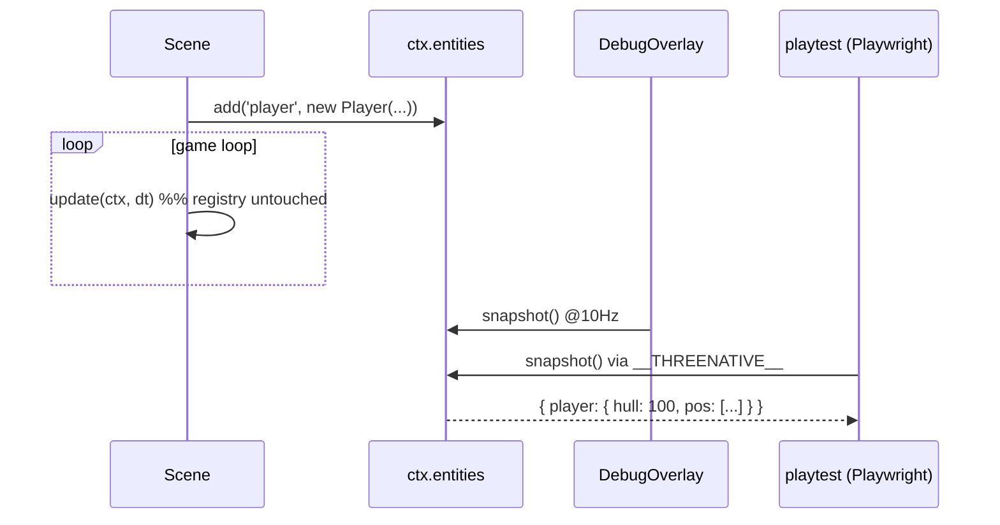

# PRD-006 — The Entity Registry (`ctx.entities`)

**Complexity: 3 → LOW mode**
(2-5 files +1, new system from scratch +2)

**Depends on:** PRD-002. **Blocks:** the `playtest` lift (`DESIGN.md` §8).
**Design authority:** `DESIGN.md` §2 (no ECS), §5 (20-line rule), §8 (scenario
`states` contract), §11.1, §11.5.

---

## 1. Context

**Problem:** entity state exists — it is in class fields, `THREE.Object3D`
transforms, and Rapier bodies — but it is **not addressable**. Nothing can enumerate
it, and nothing can resolve a name to it.

This is the one thing an ECS gives that plain classes do not, and it is why the ECS
question keeps reopening. `DESIGN.md` §2 rejects the ECS; this PRD is the 1%-cost
substitute that closes the same gap.

**Files analyzed:** `DESIGN.md` §2, §6, §6b, §8; `docs/PRDs/PRD-002-core.md` (§4
`Ctx` shape); `examples/abyss-vanilla/src/main.js` (entity state held as closure
locals — the shape that is invisible today).

**Current behavior:** the framework has no way to answer "what entities exist and
what are their values." Three consumers need that answer:

| Consumer | Needs | Today |
|---|---|---|
| `playtest` scenarios | resolve `entity: "player"` to state | **impossible** |
| Dev overlay | live table of entity values | does not exist |
| The model, mid-debug | one console call, not a breakpoint hunt | `console.log` per field |

The first is not a nice-to-have. `DESIGN.md` §8 commits to lifting a harness whose
assertion format is:

```json
"assert": { "states": [{ "entity": "player", "equals": true }] }
```

Without a name→state resolver, that assertion type cannot be implemented at all —
and §8's whole point is that silently-inert assertions are how a suite reports green
while asserting nothing.

**Incumbent census:** none. This is new surface, not a replacement.

---

## 2. Solution

**Approach:** a per-scene registry with three methods, and an optional `debug()`
convention on entities. Entities remain plain classes (§2). Nothing iterates them but
their own scene.

```ts
// packages/core/src/entities.ts
export interface Debuggable { debug(): Record<string, unknown> }

export class Registry {
  #named = new Map<string, object>()

  add<T extends object>(name: string, e: T): T {
    if (this.#named.has(name)) throw new Error(`entity "${name}" already registered`)
    this.#named.set(name, e)
    return e
  }
  get(name: string) { return this.#named.get(name) }
  remove(name: string) { this.#named.delete(name) }
  clear() { this.#named.clear() }

  snapshot(): Record<string, Record<string, unknown>> {
    const out: Record<string, Record<string, unknown>> = {}
    for (const [k, e] of this.#named)
      out[k] = 'debug' in e ? (e as Debuggable).debug() : autoFields(e)
    return out
  }
}
```

Entities opt in to detail, and get a usable default for free:

```ts
export class Player {
  hull = 100
  constructor(public body: RigidBody3D) {}
  debug() { return { hull: this.hull, pos: this.body.mesh.position.toArray() } }
}

// in Play.enter:
this.player = ctx.entities.add('player', new Player(body))
```

**Key decisions:**
- [ ] **Registration is explicit and by name.** No base class, no auto-registration.
      An `Entity` superclass everything must extend is the ECS-shaped mistake wearing
      a different hat — and it would break §3's "framework wins even when ignored."
- [ ] **Duplicate names throw.** Silent overwrite means a playtest asserts against the
      wrong object and reports green. That is precisely the §8 bug class.
- [ ] **`autoFields(e)`** is depth-1 only: own enumerable `number | string | boolean`,
      plus anything exposing `.toArray()` (`Vector3`, `Quaternion`, `Euler`). Capped at
      24 keys. It must never walk into a `THREE.Mesh` and serialize a scene graph.
- [ ] **`snapshot()` is pull-based.** Never called from `update`. The overlay and the
      playtest runner pull it; the game loop never pushes to it.
- [ ] **The registry is per-scene and cleared on exit.** It holds strong references; a
      process-wide registry is a leak with a tidy API.
- [ ] **Dev-only global.** `window.__THREENATIVE__ = { snapshot }` under
      `import.meta.env.DEV`. This is the Playwright and console entry point.

**The 20-line rule needs answering here** (§11.1), because a reviewer will raise it:
the registry is ~45 lines, and a competent dev could write the `Map` part in five.
It ships anyway because **name resolution is a framework contract, not game code** —
`playtest` scenarios are authored against `entity: "player"` and must resolve
identically in every game. A per-game convention resolves differently in every game,
which is the same as not having one. This is wiring, not work.

**Explicitly NOT in this package:** queries, filters, archetypes, systems, iteration
helpers, component types, serialization, time-travel. Any PR adding one is an ECS
arriving by increments and is rejected on sight (§2).

**Data changes:** none.



---

## 3. Integration Ledger

| # | New thing | Live caller (`file:line`, non-test) | Replaces | Old path removed? | Negative control |
|---|-----------|-------------------------------------|----------|-------------------|------------------|
| 1 | `Registry` on `Ctx` | `packages/core/src/game.ts` (`Ctx` construction) | nothing — new surface | n/a | omit from `Ctx` → example's `entities.add` is a TypeError at boot |
| 2 | `ctx.entities.add()` | `examples/abyss-framework/src/scenes/Play.ts` | nothing | n/a | make `add()` a no-op → `snapshot()` returns `{}`, overlay empty |
| 3 | `snapshot()` | `packages/ui/src/DebugOverlay.tsx`; playtest runner | nothing | n/a | return `{}` unconditionally → every state assertion fails red |
| 4 | `debug()` convention | scaffold `src/entities/Player.ts` (PRD-004) | nothing | n/a | delete `debug()` → falls back to `autoFields`, still non-empty |
| 5 | `__THREENATIVE__` dev global | playtest scenario runner | nothing | n/a | gate it behind `false` → Playwright `page.evaluate` returns undefined |

---

## 4. Reachability

**How is this reached?**
- Entry point: `Scene.enter(ctx)` calls `ctx.entities.add(...)`. Nothing is registered
  implicitly — if a scene never calls `add`, `snapshot()` is `{}` and the cost is zero.
- Pre-existing files EDITED: `packages/core/src/game.ts` (build the registry per
  scene, `clear()` on exit), `packages/core/src/index.ts` (export),
  `packages/ui/src/index.ts` (export the overlay).
- Registration: `Ctx` construction is the registration. An unexported `Registry` is dead.

**User-facing?** In dev, yes — the overlay is a visible panel. In production, no: it is
stripped.

**Full flow:**
1. `Play.enter(ctx)` runs `ctx.entities.add('player', new Player(body))`.
2. The game loop runs untouched; the registry is not read per frame.
3. Dev overlay pulls `snapshot()` on a 10Hz timer and renders a table.
4. A playtest scenario evaluates `__THREENATIVE__.snapshot()` and asserts on `player.hull`.
5. Observable in: the overlay panel, and a scenario that goes red when the value is wrong.

---

## 5. Execution Phases

### Phase 1 — State becomes visible: `Registry` + `snapshot()` + dev global

**Files:**
- `packages/core/src/entities.ts` — NEW: `Registry`, `Debuggable`, `autoFields`
- `packages/core/src/game.ts` — **EDIT**: construct per scene, expose on `Ctx`,
  `clear()` on exit, install `__THREENATIVE__` under DEV
- `packages/core/src/index.ts` — **EDIT**: export
- `examples/abyss-framework/src/scenes/Play.ts` — **EDIT**: register the player
- `packages/core/__tests__/entities.spec.ts` — NEW

**Implementation:**
- [ ] `add` throws on duplicate names
- [ ] `autoFields`: depth-1, `.toArray()` support, 24-key cap, no prototype walk
- [ ] `clear()` on scene exit, before the next scene's `enter`
- [ ] `__THREENATIVE__` installed only under `import.meta.env.DEV`

**Wiring:**
- [ ] Caller edited: `packages/core/src/game.ts`, `.../index.ts`, `Play.ts`
- [ ] Ledger rows: #1, #2, #3, #5

**Tests required:**

| Test file | Test name | Assertion | Negative control (observe red) |
|---|---|---|---|
| `entities.spec.ts` | `should resolve a registered entity by name` | `get('player')` is the same object instance | make `add` skip the `Map.set` → undefined, test fails |
| `entities.spec.ts` | `should throw when a name is registered twice` | second `add('player', …)` throws | drop the `has` guard → silent overwrite, test fails |
| `entities.spec.ts` | `should prefer debug() over autoFields` | snapshot equals the `debug()` object exactly | remove the `'debug' in e` branch → extra auto keys appear, test fails |
| `entities.spec.ts` | `should not serialize a THREE.Mesh into the snapshot` | registering a bare `Mesh` yields ≤24 keys and no nested `geometry` | remove the cap/type filter → snapshot explodes, test fails |
| `entities.spec.ts` | `should empty the registry when a scene exits` | after a transition, `snapshot()` is `{}` | remove `clear()` → prior scene's entities persist, test fails |

**Revert check:** delete the `entities` field from `Ctx` → `abyss-framework` fails to boot.

**User verification:** `pnpm --filter abyss-framework dev`, then in the console:
`__THREENATIVE__.snapshot()` → live `hull` and `pos`, changing between calls.

---

### Phase 2 — State becomes glanceable: `<DebugOverlay/>`

**Files:**
- `packages/ui/src/DebugOverlay.tsx` — NEW
- `packages/ui/src/index.ts` — **EDIT**: export
- `examples/abyss-framework/src/ui/App.tsx` — **EDIT**: mount under DEV, toggle on backtick
- `packages/ui/__tests__/overlay.spec.tsx` — NEW

**Implementation:**
- [ ] Pulls `snapshot()` on a 10Hz `setInterval` — **not** `requestAnimationFrame`
- [ ] Renders a `<table>`: entity name, key, value. Tailwind, monospace, `pointer-events-none`
- [ ] Backtick toggles; default hidden
- [ ] Whole component wrapped in `import.meta.env.DEV` so it tree-shakes out

**Wiring:**
- [ ] Caller edited: `examples/abyss-framework/src/ui/App.tsx`
- [ ] Ledger rows: #3, #4

**Tests required:**

| Test file | Test name | Assertion | Negative control |
|---|---|---|---|
| `overlay.spec.tsx` | `should render one row per registered entity field` | 2 entities × 2 fields → 4 rows | return `{}` from snapshot → 0 rows, test fails |
| `overlay.spec.tsx` | `should poll at most 11 times per second` | interval callback count ≤ 11 over 1s of fake timers | switch to rAF → ~60, test fails |

**Revert check:** unmount the overlay → the dev-overlay E2E (row text changes) fails.

**Manual checkpoint:** open the overlay while playing; frame rate must not move.

---

## 6. Acceptance Criteria

- [ ] A playtest scenario asserting `{ entity: "player", equals: … }` goes **green for
      a true value and red for a false one** — both directions demonstrated.
- [ ] In dev, pressing backtick shows a live table of entity values that updates while
      playing, with no visible frame-rate change.
- [ ] A production build contains no reference to `DebugOverlay` or `__THREENATIVE__`
      (grep `dist/`).
- [ ] A game that never calls `entities.add` runs identically to one built without this
      PRD; `snapshot()` returns `{}`.
- [ ] `packages/core/src/entities.ts` is **under 60 LOC**.
- [ ] `packages/core/src` contains no `query`, `archetype`, `System`, or `Component`
      identifier — CI grep, the §2 anti-ECS guard.

**This PRD fails if:** `entities.ts` passes 60 LOC; registration becomes mandatory or
automatic; `snapshot()` is called from the game loop; or any iteration/query helper
lands — at which point this is an ECS and §2 already decided against it.

---

## 7. Verification Evidence

*(filled during implementation)*

| Gate | Result | Negative control observed red? |
|---|---|---|
| resolve by name | | |
| duplicate name throws | | |
| `debug()` beats `autoFields` | | |
| Mesh does not explode the snapshot | | |
| scene exit clears | | |
| overlay ≤11Hz | | |
| **grep: no ECS vocabulary in core** | | |
| **playtest state assertion red↔green** | | |

**Integration proof:**

```bash
# 1. Caller census — every export has a non-test consumer
grep -rn "entities\.add\|snapshot()\|DebugOverlay" \
  packages examples --include=*.ts --include=*.tsx | grep -v __tests__ | grep -v ".spec."

# 2. §2 enforcement — must return nothing
grep -rnE "\b(archetype|createQuery|defineComponent|System)\b" packages/core/src

# 3. Production strip — must return nothing
grep -rn "DebugOverlay\|__THREENATIVE__" examples/abyss-framework/dist

# 4. LOC budget
wc -l packages/core/src/entities.ts   # < 60
```
