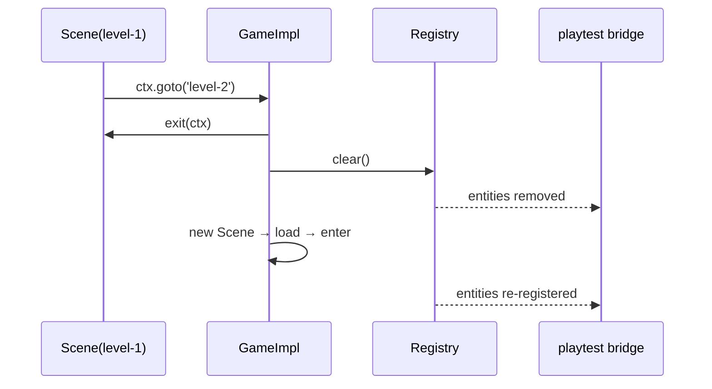

# PRD-008 — Loop foundations: scene transitions, input edges, timestep

**Complexity: 5 → MEDIUM mode** (1-5 files +1, complex state +2, multi-package +2)

**Depends on:** PRD-007. **Blocks:** PRD-009, PRD-010.
**Design authority:** `DESIGN.md` §6; `packages/core/AGENTS.md` (the closed list).

## 1. Context

**Problem:** four holes in PRD-002's foundation make a platformer impossible to write, and
one of them is a live bug in shipped code.

**Files analyzed:** `packages/core/src/game.ts:110-176`, `src/input.ts:86-126`,
`src/loop.ts`, `templates/starter/src/{main.ts,scenes/Boot.ts,entities/Player.ts}`.

**Current behavior:**

| Hole | Evidence | Consequence |
|---|---|---|
| `GameConfig.scenes` read once at `start()`, never again | `game.ts:112`, `game.ts:145` | no level→level, no respawn, no results screen; `templates/starter/src/scenes/Boot.ts` is unreachable dead code |
| No edge detection — `pressed()` is held-state only | `input.ts:102-113` | jump and dash cannot be written at all |
| **Bug:** `this.#gamepadButtons.some(Boolean)` ignores the binding | `input.ts:111` | any gamepad button makes **every** action report pressed |
| `FixedStepLoop` built with no options | `game.ts:161` | 60 Hz unconfigurable; `step`/`maxSteps` unreachable from `defineGame` |

The gamepad line is not a design gap. It is wrong today, in the starter users scaffold.

## 2. Solution

- `ctx.goto(name)` — swap scenes through the existing lifecycle: `exit` → registry
  `clear()` → `load` → `enter`. No sixth `Scene` method; `core/AGENTS.md` forbids one.
- `InputMap.justPressed(name)` / `justReleased(name)`, edges computed in the existing
  `tick()` against the previous frame's held set.
- `InputAction.buttons?: readonly number[]` — gamepad buttons bound per action, replacing
  the unconditional `some(Boolean)`.
- `GameConfig.step` / `maxSteps` forwarded to `FixedStepLoop`.

**Key decisions:** no new exports beyond these — `goto` rides on `Ctx`, edges ride on
`InputMap`. The transition clears `ctx.entities`, so PRD-007's bridge re-syncs; that
interaction is the one thing that can silently rot, so it gets its own test.

**Data changes:** none.



## 3. Integration Ledger

| # | New thing | Live caller (non-test) | Replaces | Old path removed? | Negative control |
|---|---|---|---|---|---|
| 1 | `ctx.goto(name)` | `templates/starter/src/scenes/Boot.ts` → `play` | unreachable `Boot` | Boot becomes reachable | delete the call → Boot never exits, scenario times out |
| 2 | `justPressed` / `justReleased` | `templates/starter/src/entities/Player.ts` jump | hardcoded `y: 0` | deleted | hold jump 60 frames → exactly one jump, not 60 |
| 3 | `InputAction.buttons` | `templates/starter/src/main.ts` bindings | `some(Boolean)` at `input.ts:111` | **line deleted** | bind button 0 to `jump`, press button 1 → `jump` false |
| 4 | `GameConfig.step` | `core/src/game.ts:161` | implicit default | default preserved | `step: 1/30` → half the updates per second |

**Reachability:** frame loop → `Player.update`. User-facing: the starter gains a visible jump.

## 4. Phases

#### Phase 1: the starter's player can jump — one press, one jump

**Files:** `core/src/input.ts` EDIT · `core/src/game.ts` EDIT · `core/src/scene.ts` EDIT ·
`templates/starter/src/entities/Player.ts` EDIT · `core/__tests__/input.spec.ts` EDIT.

**Wiring:** `y: 0` in `Player.move()` is replaced by a velocity term driven by
`justPressed('jump')`. `input.ts:111` is deleted in this phase, not deprecated.

| Test | Assertion | Negative control (observe red) |
|---|---|---|
| `should report justPressed only on the transition frame` | true once across 3 held ticks | return held state → 3 trues, fails |
| `should not report a bound action when an unbound gamepad button is down` | `pressed('jump') === false` | restore `some(Boolean)` → true, fails |
| `should report justReleased on the release frame` | true once | — |
| `should honor a configured step` | `step: 1/30` → half the `onUpdate` calls | — |

**Revert check:** restoring `input.ts:111` turns the gamepad test red.

#### Phase 2: `ctx.goto` — Boot reaches Play, and playtest sees the swap

**Files:** `core/src/game.ts` EDIT · `templates/starter/src/scenes/Boot.ts` EDIT ·
`templates/starter/src/main.ts` EDIT · `core/__tests__/game.spec.ts` EDIT ·
`templates/starter/playtest/boot-to-play.json` NEW.

| Test | Assertion | Negative control |
|---|---|---|
| `should run exit, clear, load, enter in order on goto` | recorded call order | drop `clear()` → stale id survives, duplicate-id throw |
| `should throw on an unknown scene name` | throws, not a silent no-op | return undefined → fails |
| `should re-register entities with the bridge after goto` | `sample().entities` holds level-2 ids only | skip re-sync → level-1 ids linger, fails |
| `boot-to-play.json` | `assert.movement` on an entity that exists only in `play` | remove `goto` → never observed, fails |

**User verification:** `pnpm --filter starter dev` → boot advances to play, `Space` jumps.

## 5. Verification

```sh
pnpm typecheck && pnpm lint && pnpm test && pnpm budgets && pnpm test:playtest

# Caller census
grep -rn "justPressed\|ctx.goto\|buttons:" packages/create-threenative/templates --include=*.ts

# The bug is gone, not shadowed
grep -rn "gamepadButtons.some" packages/core/src        # expected: no output

# Revert check: restore input.ts:111, re-run
# Expected: core/__tests__/input.spec.ts fails on the unbound-button case
```

## 6. Acceptance (consumer-scoped)

- [ ] In the scaffolded starter, a player holding jump leaves the ground exactly once per
      press, and that jump is observable in a playtest scenario.
- [ ] A gamepad button not bound to an action does not trigger it — proved by a test that
      fails against the previous commit.
- [ ] `Boot` runs and hands off to `Play` in the shipped starter; no unreachable scene
      remains in `templates/`.
- [ ] Every gate observed red once, recorded in `docs/verification/PRD-008.md`.
