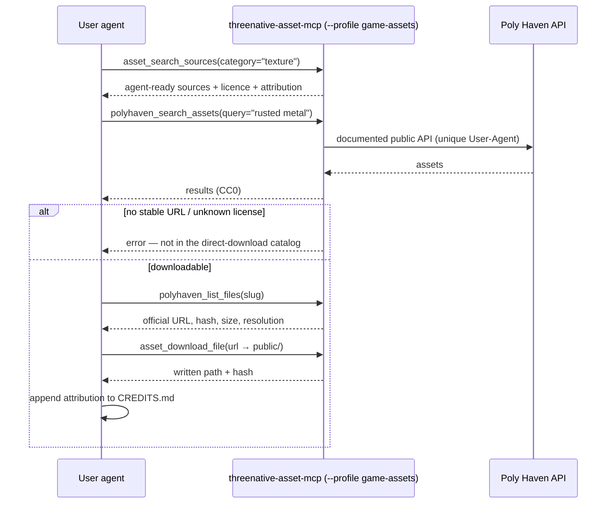

# PRD-032 — Asset discovery: the scaffold hands the agent a licensed-asset tool

**Status:** open, **not started, and not startable.** Gated on **Gate 0** of
`docs/strategy/ROADMAP.md` — round 2 must run to completion on both arms and exit on the
"the framework arm wins" branch. Two of five roadmap axes read `0` because they have never
been measured. Building capability onto an unmeasured product is the mechanism that took v1
to 790k lines, and this PRD is the first item that would do it.

**Complexity: 6 → MEDIUM mode** (touches 10+ files +3, new mechanism from scratch — the
upstream tool-profile selector +2, external API integration +1).

**Depends on:** Gate 0 exit; and one out-of-tree prerequisite (Phase 1) that may void this
PRD outright. **Blocks:** nothing.

**Charter authority:** `CHARTER.md` §2 (models are worst at discovering novel API
surfaces — the founding constraint, and the reason this PRD ships 8 tools rather than 32),
§5b (never own the look), §8 (`asset-mcp` is salvage on its own release lane), §9b (the
scaffold is the documentation), §10 (8 packages, 15,000 framework LOC).
`AGENTS.md` rules 1, 3, 5, 6.

---

## 1. Context

**Problem:** an agent building a ThreeNative game has no way to find a 3D model, a texture,
an HDRI or a sound effect. It writes `BoxGeometry` because that is what is reachable, and
the game looks like programmer art regardless of how good the render layer is.
`CHARTER.md` §3's visual column is scored on what a stranger sees, and a well-lit grey box
is still a grey box. The legacy tree solved this and the solution was left behind.

**Files analyzed:**
`packages/create-threenative/src/index.ts` (the whole scaffolder, 172 lines) ·
`packages/create-threenative/package.json` · `packages/create-threenative/templates/*/` ·
`packages/create-threenative/__tests__/{scaffold,template}.spec.ts` ·
`packages/core/src/assets.ts` · `scripts/check-budgets.ts:40-90` · `scripts/catalog.ts` ·
`scripts/__tests__/catalog.spec.ts` · `.github/workflows/ci.yml:61-144` (scaffold smoke) ·
`docs/product/ASSET-PIPELINE.md` · `docs/strategy/ROADMAP.md` ·
`docs/strategy/OPPORTUNITY-AREAS.md` · `docs/architecture/CHARTER.md` §2/§5b/§8/§9b/§10 ·
`../threejs-to-bevy/packages/asset-mcp/{package.json,README.md,src/server.ts,src/config.ts,src/tools/source-directory.ts,src/polyhaven/client.ts}`.

**Current behavior — every row was checked against the source, not the docs:**

| Fact | Evidence |
|---|---|
| The scaffolder writes no MCP configuration at all | `packages/create-threenative/src/index.ts` — no `.mcp.json`, no `mcpServers` key anywhere under `packages/create-threenative/` |
| Framework-side asset support is a ~90-line cached loader | `packages/core/src/assets.ts` — `model`, `texture`, `audio`, injectable per-kind loaders |
| A working asset MCP already exists, outside this repo | `../threejs-to-bevy/packages/asset-mcp` — `threenative-asset-mcp`, MIT, ~10.8k LOC of TypeScript |
| **The registry's latest is `0.4.0`, not `0.5.0`** | `npm view threenative-asset-mcp versions` → `'0.4.0'`; the local tree's `package.json` says `0.5.0` and is **unpublished**. `ROADMAP.md:129` and `CHARTER.md` §8 both cite 0.5.0 — they describe a working tree, not something a generated project can install |
| **It registers 32 tools, unconditionally** | `src/server.ts:178-717` — 32 `server.registerTool(...)` calls inside `createServer`. `ROADMAP.md:129` says "25+"; `CHARTER.md` §8 says 32. 32 is correct |
| **There is no way to expose fewer** | no env var, flag or option gates registration — `grep -rn "TOOLS\|enabledTools\|toolFilter" src` finds only `ASSET_MCP_VERSION`/`ASSET_MCP_USER_AGENT` in `src/package-info.ts`. `src/config.ts` reads 12 `FAB_*` variables and none of them touch the tool list |
| **The server already computes which sources an agent can actually finish a download from** | `src/tools/source-directory.ts:73-100` — `agentReady = disposition === "supported" && downloadTool && downloadSupport !== "provider-page" && downloadSupport !== "authenticated-url"`, described in schema as "True only when an agent can complete the download through this MCP without browser, login, checkout, or paywall interaction" |
| Of 30 catalogued sources, **7** are agent-ready | running `ASSET_SOURCES` from `dist/`: `polyhaven`, `ambientcg`, `smithsonian`, `kenney`, `kenney-particle-pack`, `game-icons`, `sonniss`. Fab and Sketchfab both compute `experimental`; quaternius/kaykit/tallbeard/brackeys likewise |
| `playwright` is a **runtime** dependency of the server | its `package.json` dependencies: `@gltf-transform/core`, `@modelcontextprotocol/server`, `@zip.js/zip.js`, `playwright`, `zod`. Its README: "Playwright does not download Chromium as part of a normal package install. Run `playwright install chromium` once on the MCP host before relying on the browser fallback." Only Fab needs it |
| The legacy scaffold launched the local install, not `npx -y` | its README install block — `node ./node_modules/threenative-asset-mcp/dist/index.js` |
| The budget script counts only workspace `packages/*/src` and workspace members | `check-budgets.ts:52-69` — `filesUnder(packages/<name>/src)`; `check-budgets.ts:40-52` — `workspacePackageCount` counts directories under `packages/` and `examples/` that contain a `package.json` |
| The catalog governs `three` only | `scripts/catalog.ts` + `scripts/__tests__/catalog.spec.ts` — a catalog entry for a dependency no workspace package consumes would be dead configuration |
| The scaffold smoke job already installs and boots a generated project | `.github/workflows/ci.yml:84-144` — packs local tarballs, scaffolds, `pnpm install`, `pnpm test`, boots the dev server, drives headless Chromium, greps `! grep -R "catalog:" "$target/package.json"` |

### The `ASSET-PIPELINE.md` deferral does not apply here, and this is the point worth being precise about

`docs/product/ASSET-PIPELINE.md` defers a *build-time optimization pipeline* — glTF
Transform, Meshopt/Draco, KTX2/Basis, LOD and collider generation — explicitly on
`CHARTER.md` §10 grounds: "starting it now would consume the 15,000 LOC cap." Asset
*discovery and licensing* is a different problem, solved by a process that runs beside the
agent rather than inside the build, and it consumes **zero** framework LOC and **zero**
workspace package slots (§9 below shows the arithmetic against the actual script). Its
trigger conditions are therefore not the ones this PRD must clear.

The deferral does bind this PRD in one direction, and Phase 1 honours it: the framework
cannot decimate a 200k-triangle photogrammetry scan, so the profile does not ship a tool
that returns one. See §2's cut list.

If a reviewer disagrees that discovery is separable from the pipeline, that is a charter
question and it blocks this PRD rather than being argued inside it.

---

## 2. Solution

- **The MCP server is never vendored into this workspace.** It stays the externally
  published `threenative-asset-mcp`, outside the `@threenative/*` scope. Copying ~10.8k
  lines into `packages/` would consume 72% of the 15,000 LOC cap and a ninth package slot
  against a cap of eight — both of which `CHARTER.md` §10 says are not raised.
- **It ships a bounded tool profile — 8 of 32 — and that is the load-bearing decision of
  this PRD.** See below.
- **The scaffolder writes `.mcp.json`** into the generated project, declaring the server by
  its local install path exactly as the legacy tree did, with the profile selected on the
  command line. No `npx -y`: an asset tool that silently fetches and executes an unpinned
  package is a supply-chain hole in every game built with it.
- **`threenative-asset-mcp` is a dependency of the generated project, never of a
  `@threenative/*` package.** `core` must not inherit it; a test asserts this, and CI greps
  for it.
- **The generated `AGENTS.md` documents the tools the agent actually has**, per §9b (the
  scaffold is the documentation): search sources before searching a provider, read the
  license off `*_list_files` before downloading, and write the attribution into
  `CREDITS.md` in the same turn as the download.
- **Licensing is surfaced, never asserted.** The generated docs carry each provider's
  attribution requirement — Poly Haven must be visibly credited and requires a unique
  User-Agent; ambientCG is CC0 per asset page; the audio catalog is per-pack.

**Fails closed, in three places:**

1. `createProject` throws if the generated tree has no `.mcp.json`, or if its `args[0]`
   does not point at a path the project's own `package.json` could install. A scaffold that
   silently produces a project with no asset tool is the failure this PRD exists to
   prevent, and it is invisible without this check.
2. An unknown `--profile` value makes the server **exit non-zero**. It must never fall back
   to registering all 32; a typo that silently restores the full surface would defeat the
   entire decision below, while every gate stayed green.
3. A generated `package.json` lacking the dependency its `.mcp.json` points at fails the
   scaffold smoke gate.

### The tool subset — 8 of 32

`CHARTER.md` §2: *"An LLM's greatest strength is writing code in languages already in its
weights. Its greatest weakness is discovering bespoke API surfaces. **This is the founding
constraint.**"* 32 tool schemas in every turn's context is a bespoke API surface. v1 died
of 178 command forms and a 2,477-word root help; shipping 32 tool names into the user's
agent is the same mistake at a smaller scale, and `OPPORTUNITY-AREAS.md`'s own note on this
area says so: *"25 tools is a discovery cost of its own. Ship the subset that the paired arm
actually reaches for."*

The selection rule is not taste. **The server already computes it**: a source is
`agentReady` when an agent can finish a download without a browser, a login, a checkout or
a paywall (`source-directory.ts:93-99`). Ship the tools reachable from agent-ready sources,
minus the ones this project cannot consume, plus the one directory tool that keeps
everything else discoverable as *data* instead of as *schema*.

**Profile `game-assets` — 8 tools:**

| # | Tool | Why it is in the loop |
|---|---|---|
| 1 | `asset_search_sources` | The entry point. Defaults to `agentReadyOnly=true`, and returns `licenseSummary`, `licenseTags`, `attribution`, `browseUrls` and `caution` per source. This is how the other 23 sources stay reachable without 24 more schemas |
| 2 | `polyhaven_search_assets` | CC0, documented public API, and the only agent-ready source covering all three of HDRI / texture / model (`polyhaven/client.ts:6`) |
| 3 | `polyhaven_list_files` | Official URLs, hashes, sizes, resolution/format filters — the license-and-provenance payload the download must be justified by |
| 4 | `ambientcg_search_assets` | CC0 materials and textures; the second agent-ready surface, so one provider outage is not a dead loop |
| 5 | `ambientcg_list_files` | same role as (3) |
| 6 | `audio_search_assets` | The agent-ready audio path (Kenney, Sonniss). A game with no sound reads as broken to a blind visual/play judge |
| 7 | `audio_download_asset` | The guarded audio download — only packs with stable official URLs and known license metadata are in the direct catalog |
| 8 | `asset_download_file` | The generic verified downloader every non-audio agent-ready source routes through |

**What is cut, and why — all 24:**

| Cut | Count | Reason |
|---|---:|---|
| `fab_*` — search, get, list_filters, list_limited_time_free, download_free_asset | 5 | The server's own policy computes Fab as `experimental`. Its `/i/*` JSON routes are undocumented and may restrict automated access; browser verification needs a Chromium the MCP host has not installed. **Cutting Fab is what makes the profile Chromium-free**, which removes the single largest silent-failure mode for a user who ran nothing but `pnpm install` |
| `sketchfab_*` — search_models, get_model, list_categories, get_downloads | 4 | `downloadSupport: authenticated-url` — downloads need a user API token, so an agent cannot finish the loop. Licenses also vary per model |
| `smithsonian_*` — search, get, list_files | 3 | Agent-ready, but museum photogrammetry at scan resolution is not game geometry, and the decimation pipeline that would fix it is deferred in `ASSET-PIPELINE.md` behind two triggers that have not fired. A tool whose output the project cannot process is discovery cost with no payoff. **Re-add when the pipeline starts** |
| `itch_*` + `asset_*_bundle_*` — list_downloads, download_asset, list/download bundle entry, list/download bundle animation | 6 | Quaternius, KayKit, Tallbeard and Brackeys all compute `experimental`. **This is the painful cut** — they are the best free *character and animation* sources on the board. It is deliberate, not an oversight, and it is the first thing to promote: see §4 Phase 6 |
| `asset_list_sources` | 1 | Subsumed by `asset_search_sources` with an empty query. Two tools for one job is exactly the discovery cost being removed |
| `polyhaven_get_asset`, `ambientcg_get_asset` | 2 | Search results already carry enough to choose; `*_list_files` carries the license, URL and hash the download is justified by |
| `polyhaven_list_categories`, `ambientcg_list_categories`, `audio_list_sources` | 3 | Category enumeration is a browse affordance for a human scrolling a site. An agent arrives with a text query |

8 kept + 24 cut = 32. ✓

**The subset is a shipping decision, not a deletion.** All 32 tools remain in the published
package and any host that wants them can launch without `--profile`. What ships into a
generated ThreeNative project is 8.

### §5b compliance — discovery is not the look

| Framework may own (§5b) | This PRD |
|---|---|
| asset loading | the agent downloads into `public/`, loads through the existing `ctx.assets.model()` |
| — | the agent writes its own material, light rig and camera around whatever it found |
| **must never own: anything a screenshot shows** | the framework ships **no asset**, **picks no asset**, and the scaffold **downloads nothing** |

The directory tool returns URLs and license prose — including for the shader-source entries
(`threejs-shader-materials`, `godot-shaders`, `unity-shader-graph-samples`) — never code.
Handing an agent a link is what a web search does; it sets no ceiling. The one design that
*would* violate §5b — auto-downloading a starter asset pack during scaffold — is rejected
below.

### Explicitly rejected

| Proposed | Why not |
|---|---|
| Vendor `asset-mcp` into `packages/` | ~10.8k LOC against a 15,000 cap and a ninth package against a cap of eight. §10: exceeding a cap is not a signal to raise the cap |
| Wrap the MCP in a `@threenative/assets` package | A package exists only when it carries a dependency the others must not inherit (§11.5). The MCP is a separate process; there is nothing to wrap and nothing to inherit |
| Add asset search to `packages/core/src/assets.ts` | That file loads assets at runtime. Discovery happens at authoring time, in the agent's tool loop, and never ships in the game |
| `npx -y threenative-asset-mcp` in the config | Executes an unpinned remote package in every generated project. The legacy tree already rejected this and launched the local install |
| Ship all 32 tools and document only 8 in `AGENTS.md` | **The discovery cost is the `tools/list` response, not the prose.** Prose does not remove 24 schemas from the model's context. This is the tempting zero-work option and it does not solve the problem |
| Add the profile as a `.mcp.json` comment or a wrapper script in the template | A wrapper is framework code in the user's repo that exists only to hide tools; the 20-line rule says write it once upstream instead. JSON has no comments |
| Auto-download a starter asset pack during scaffold | Picks the look for the user (rule 3) and licenses assets on their behalf, which is worse |
| A catalog entry for `threenative-asset-mcp` in `pnpm-workspace.yaml` | `scripts/catalog.ts` governs `three`, and no workspace package consumes the MCP. The version of record is the three template `package.json` files, kept identical by a test |
| Start the build-time optimization pipeline in the same PRD | `ASSET-PIPELINE.md` defers it behind two measured triggers. Discovery does not unlock it |
| Ship it before Gate 0 closes | `ROADMAP.md` — Phase 2 does not start until the round-2 pair says the framework wins |

### Flow

```mermaid
flowchart LR
    A["pnpm create threenative my-game"] --> B[".mcp.json + dependency<br/>in the generated project"]
    B --> C["user's agent starts<br/>tools/list → 8 tools"]
    C --> D["asset_search_sources<br/>license + attribution"]
    D --> E["polyhaven_search_assets<br/>/ audio_search_assets"]
    E --> F["polyhaven_list_files<br/>URL · hash · size"]
    F --> G["asset_download_file<br/>→ public/"]
    G --> H["agent writes CREDITS.md<br/>+ its own material"]
    H --> I["ctx.assets.model()<br/>renders in the game"]
```





---

## 3. Integration Ledger

Filled with real `file:line` during implementation. A row still reading `TBD` at phase end
means the phase is incomplete.

| # | New thing | Live caller (`file:line`, non-test) | Replaces | Old path removed? | Negative control |
|---|---|---|---|---|---|
| 1 | `--profile game-assets` selector (upstream, `../threejs-to-bevy`) | `templates/*/.mcp.json` `args`, launched by the user's MCP host | the all-32 default surface | n/a — the default stays for other hosts | pass `--profile nonsense` → server exits non-zero; CI asserts the exit code, not just that it started |
| 2 | `templates/starter/.mcp.json` | `packages/create-threenative/src/index.ts:TBD` (`cp` copies it; the new assertion reads it) | nothing — no generated project has ever had MCP config | n/a | delete the file from the template → `createProject` throws; `scaffold.spec.ts` records the throw |
| 3 | `.mcp.json` integrity assertion in `createProject` | `packages/create-threenative/src/index.ts:TBD`, called from `createProject` (the only scaffold entry point) | silent production of a tool-less project | n/a | point `args[0]` at a package the template does not depend on → scaffold smoke fails |
| 4 | `threenative-asset-mcp` in each template's `package.json` | the three generated `package.json` files, consumed by `pnpm install` in the generated project | agents writing `BoxGeometry` because nothing else is reachable | n/a | add it to any `@threenative/*` package → new test fails: no workspace package may depend on it |
| 5 | `tools/list` = the 8 profile names | `.github/workflows/ci.yml:TBD`, scaffold-smoke job, against the installed server in the generated project | an unverified claim about the tool surface | n/a | drop `--profile` from the `.mcp.json` → the job sees 32 and fails |
| 6 | Asset-tool section in each template's `AGENTS.md` | generated `AGENTS.md`, mirrored `CLAUDE.md` | undocumented tools the agent never calls | n/a | `pnpm sync:agents --check` fails on drift |
| 7 | Externality assertion in the budget script | `scripts/check-budgets.ts:TBD` | an unstated assumption | n/a | move the package into `packages/` → `pnpm budgets` fails on both the LOC and package caps |

### Reachability

**How will this feature be reached?**
- Entry point: **the user's MCP host reading `.mcp.json` in the generated project root**,
  and before that, the CLI command `pnpm create threenative my-game`.
- Pre-existing files EDITED to make it reachable: `packages/create-threenative/src/index.ts`,
  `packages/create-threenative/templates/*/package.json`,
  `packages/create-threenative/templates/*/AGENTS.md`, `.github/workflows/ci.yml`,
  `scripts/check-budgets.ts`.
- Registration/wiring: `.mcp.json` `mcpServers.threenative-assets`, plus the dependency in
  the generated `package.json` that makes `args[0]` resolve after `pnpm install`.

**Is this user-facing?** YES, but the user is an agent, and its UI is the tool list. There
is no React component. The observable surface is the `tools/list` response and the files
that appear in `public/` and `CREDITS.md`.

**Full flow:**
1. A user runs `pnpm create threenative my-game`, then `pnpm install`.
2. Their agent starts in the project directory and its host reads `.mcp.json`.
3. It reaches the new feature via `mcpServers.threenative-assets.args` →
   `./node_modules/threenative-asset-mcp/dist/index.js --profile game-assets`.
4. The outcome shows up as: 8 tools in the agent's tool list, a real file in `public/`, an
   attribution line in `CREDITS.md`, and the asset visible in the captured frame.

**What does this replace?** Nothing — genuinely new behavior. No incumbent exists: no
generated ThreeNative project has ever contained MCP configuration of any kind
(`grep -rn "mcpServers" packages/create-threenative` returns nothing today, which is the
baseline every gate below must be run against).

---

## 4. Phases

Every phase edits at least one pre-existing file. Max 5 files each.

#### Phase 1: the prerequisite — a publishable server with a bounded surface

**Outcome:** `npm view threenative-asset-mcp version` returns a version that exposes
exactly 8 tools under `--profile game-assets`, or this PRD is void in writing.

**Files:** work happens in `../threejs-to-bevy/packages/asset-mcp` (out of tree, its own
license and third-party-notice review). In tree: `docs/strategy/ROADMAP.md` EDIT (line 129
currently claims "v0.5.0 … 25+ tools"; both numbers are wrong against the registry and the
source) · this PRD EDIT (record the published version and the finding).

**Implementation:**
- [ ] Add a profile selector to `createServer` — `--profile <name>` and
      `THREENATIVE_ASSET_MCP_PROFILE`, with `game-assets` naming the 8 tools in §2.
- [ ] Unknown profile → write the error to stderr and `process.exit(1)`. **Never** fall
      back to all 32.
- [ ] Re-verify every provider's terms before publishing. The README's own status note
      calls Fab's routes undocumented and subject to restriction; Poly Haven requires a
      unique User-Agent and visible credit. **A stale claim about someone else's licensing
      is the one failure mode of this PRD that a patch cannot recover.**
- [ ] Publish. Record the exact version string in this PRD.

**Wiring:** Ledger row 1. Nothing in this repo consumes it yet — that is Phase 2, and this
phase does not close as "done", it closes as "the prerequisite exists".

**Tests (upstream):**

| Test | Assertion | Negative control (must be observed red) |
|---|---|---|
| `should advertise exactly the profile tools` | `tools/list` names === the 8 in §2, sorted | run with no `--profile` → 32; the test must fail if it accepts 32 |
| `should exit non-zero on an unknown profile` | exit code `1`, stderr names the bad value | delete the exit call → the test must go red, not "pass because the server started" |

**Revert check:** none available in this repo — that is precisely why this phase is a
prerequisite and not a deliverable.

**Exit:** a resolvable published version, **or** a written finding here that it is not
publishable, in which case **this PRD is void** and `ROADMAP.md` Phase 2's asset bullet is
deleted rather than left as a promise.

---

#### Phase 2: a scaffolded starter project hands its agent 8 asset tools

**Outcome:** `pnpm create threenative my-game --template starter && pnpm install`, and the
agent's tool list contains `polyhaven_search_assets` and 7 siblings — and nothing else.

**Files (5, three pre-existing):**
- `packages/create-threenative/templates/starter/.mcp.json` — NEW: `mcpServers.threenative-assets`, `command: "node"`, `args: ["./node_modules/threenative-asset-mcp/dist/index.js", "--profile", "game-assets"]`
- `packages/create-threenative/templates/starter/package.json` — EDIT: add the literal pinned version to `dependencies` (templates ship real versions; CI already asserts no `catalog:` survives)
- `packages/create-threenative/src/index.ts` — EDIT: after `renderTemplate`, assert the generated `.mcp.json` parses, and that every `args[0]` under `mcpServers` names a package listed in the generated `package.json`. Throw otherwise.
- `packages/create-threenative/__tests__/scaffold.spec.ts` — EDIT: add `.mcp.json` to `STARTER_PATHS` and add the cases below
- `.github/workflows/ci.yml` — EDIT: in `scaffold-smoke`, after `pnpm --dir "$target" install`, spawn the installed server over stdio, send `tools/list`, and assert the returned names equal the 8

**Wiring:**
- [ ] Caller edited: `packages/create-threenative/src/index.ts` — `createProject` now reads and validates `.mcp.json`
- [ ] Registration: the `mcpServers` key is the registration; the dependency is what makes it resolve
- [ ] Old path: n/a, new behavior
- [ ] Ledger rows filled: #2, #3, #5

**Tests Required:**

| Test File | Test Name | Assertion | Negative control (observed red) |
|---|---|---|---|
| `__tests__/scaffold.spec.ts` | `should write .mcp.json when the starter is scaffolded` | file exists, `mcpServers["threenative-assets"].args` contains `--profile` and `game-assets` | run at `HEAD~1` → fails, because no template had `.mcp.json` |
| `__tests__/scaffold.spec.ts` | `should throw when .mcp.json names a package the project does not depend on` | `createProject` rejects; message names the package | remove the assertion from `index.ts` → the test goes red |
| `__tests__/scaffold.spec.ts` | `should throw when .mcp.json is missing from the template` | `createProject` rejects | as above |
| `__tests__/scaffold.spec.ts` | `should launch the server from the project's own node_modules` | `command === "node"`, `args[0]` starts `./node_modules/`, no `npx` anywhere in the file | change `args` to `npx -y …` → red |
| CI `scaffold-smoke` | `tools/list` names equal the 8 | exact set equality, sorted, **not** `length >= 1` | remove `--profile` from `.mcp.json` → the job must fail on 32, not pass on "some tools" |

**Revert check:** rename `.mcp.json` in the starter template → `scaffold.spec.ts`'s
`STARTER_PATHS` loop and the new `createProject` assertion both fail, and `scaffold-smoke`
fails before it ever boots the dev server.

**Named risk, with its check:** `create-threenative` is `private: true` with
`files: ["dist","templates"]`. Dotfiles inside a packed directory are normally preserved,
but npm rewrites some (`.gitignore` → `.npmignore`). If `.mcp.json` is ever lost at pack
time, the `createProject` assertion turns that into a loud scaffold failure instead of a
silent tool-less project. Before this package is ever published, run
`pnpm --filter create-threenative pack` and confirm `templates/starter/.mcp.json` is inside
the tarball.

**User Verification:** scaffold a starter, `pnpm install`, open the project with an MCP
host, and read the tool list. Expected: 8 names, all from §2.

---

#### Phase 3: every template, and the externality is enforced

**Outcome:** `minimal` and `platformer` behave identically to `starter`, and moving the MCP
into `packages/` becomes a CI failure rather than a code review opinion.

**Files (5, four pre-existing):**
- `packages/create-threenative/templates/minimal/.mcp.json` — NEW
- `packages/create-threenative/templates/platformer/.mcp.json` — NEW
- `packages/create-threenative/templates/{minimal,platformer}/package.json` — EDIT: same literal pinned version
- `packages/create-threenative/__tests__/template.spec.ts` — EDIT: the three templates pin the *same* version; no `packages/*/package.json` lists `threenative-asset-mcp` in any dependency field
- `scripts/check-budgets.ts` — EDIT: report `threenative-asset-mcp` as external and fail if a `packages/*/package.json` depends on it

**Wiring:**
- [ ] Caller edited: `scripts/check-budgets.ts`, run by `pnpm budgets` in CI
- [ ] Ledger rows filled: #4, #7

**Tests Required:**

| Test File | Test Name | Assertion | Negative control (observed red) |
|---|---|---|---|
| `__tests__/template.spec.ts` | `should pin the same asset MCP version in every template` | three strings equal | bump one template only → red |
| `__tests__/template.spec.ts` | `should keep the asset MCP out of every workspace package` | no `packages/*/package.json` mentions it | add it to `packages/core/package.json` → red |
| `scripts/__tests__/budgets.spec.ts` | `should fail when the asset MCP is vendored into packages` | fixture workspace with `packages/asset-mcp/package.json` → non-empty errors | run the assertion against today's tree → it must pass, and against the fixture → it must fail. **Both directions required**, or the gate is satisfied by a repo that never had the package |

**Revert check:** delete the externality assertion → `budgets.spec.ts` goes red.

**User Verification:** `pnpm create threenative m --template minimal`; the agent's tool
list is the same 8.

---

#### Phase 4: the agent knows how to use them, and records the license

**Outcome:** an agent reading the generated `AGENTS.md` searches sources before providers,
reads the license before downloading, and writes `CREDITS.md` in the same turn.

**Files (5, all pre-existing; three `CLAUDE.md` mirrors are regenerated):**
- `packages/create-threenative/templates/{minimal,starter,platformer}/AGENTS.md` — EDIT
- `docs/product/ASSET-PIPELINE.md` — EDIT
- `docs/README.md` — EDIT

**Implementation:**
- [ ] One section per template `AGENTS.md`: the 8 tools, the order
      (`asset_search_sources` → provider search → `*_list_files` → download), the rule that
      **no license or attribution claim is made without a tool result to back it**, the
      per-provider attribution requirements, and "append the source, license and URL to
      `CREDITS.md` before the turn ends".
- [ ] Say plainly what the profile does **not** cover, so the agent does not hallucinate a
      Fab or Sketchfab tool: those sources appear in `asset_search_sources` output with a
      browse URL, and downloading from them is a manual step for the human.
- [ ] `ASSET-PIPELINE.md`: a paragraph separating discovery (shipped here, zero LOC) from
      the build-time pipeline (still deferred behind its two triggers), and noting that
      `smithsonian_*` is the tool the pipeline's arrival unlocks.
- [ ] `docs/README.md`: one line pointing at this PRD from the Product section.
- [ ] Run `pnpm sync:agents`.

**Wiring:** Ledger row 6.

**Tests Required:**

| Test File | Test Name | Assertion | Negative control (observed red) |
|---|---|---|---|
| `__tests__/scaffold.spec.ts` | `should document every tool the profile advertises` | the generated `AGENTS.md` mentions all 8 names, **and mentions no tool name absent from the profile** | add `fab_search_assets` to the prose → red. This is the assertion that catches documentation drifting ahead of the profile |
| `scripts/__tests__/sync-agent-docs.spec.ts` (existing) | mirrors in sync | `pnpm sync:agents --check` clean | edit `AGENTS.md` without regenerating → red |

**Revert check:** delete the asset section from `templates/starter/AGENTS.md` → the new
scaffold test fails.

---

#### Phase 5: the exit gate — a real agent, a real asset, a rendered frame

**Outcome:** this is `ROADMAP.md` Phase 2's exit gate, and the only phase whose result
decides whether the feature is real.

**Files:** `docs/strategy/ROADMAP.md` EDIT (record the run and its result) · this PRD EDIT
(Verification Evidence).

**The run, start to finish, in one scratch directory outside the repo:**
1. `pnpm create threenative asset-proof --template starter`, `pnpm install`.
2. Start an agent in that directory with **no additional instructions about assets** beyond
   the generated `AGENTS.md`, and a brief that needs one: *"give the crate a real material
   and a pickup sound."*
3. The agent must, unaided: call `asset_search_sources`, pick an agent-ready source,
   download one CC0 texture or model and one audio file into `public/`, write `CREDITS.md`,
   and write its own material in `src/render/materials.ts` around what it found.
4. `pnpm visuals` — headed WebGPU under `xvfb-run` (this is why the root script is
   `xvfb-run -a -s '-screen 0 1600x900x24' tsx scripts/visual-gate.ts`; a plain headless
   capture renders a blank canvas and proves nothing).
5. Gates: `pnpm typecheck && pnpm lint && pnpm test && pnpm budgets`, plus `scaffold-smoke`.

**Pass condition — all four, and any one missing is a fail:**
- [ ] The downloaded file exists in `public/` and its hash matches what `*_list_files`
      reported.
- [ ] `CREDITS.md` names the source, the license and the URL, and every claim in it traces
      to a tool result.
- [ ] The captured frame is **visibly different from the same scaffold's baseline capture**
      — put both in front of a person. `OPPORTUNITY-AREAS.md` records six genre presets that
      passed all six automated metrics and produced indistinguishable arenas; an automated
      pixel-delta alone repeats that mistake.
- [ ] The agent reached the asset **without leaving the project** — no browser, no manual
      download, no human paste. If a human touched a download, the gate failed regardless of
      how the frame looks.

**Negative control for the gate itself:** run the identical brief in a scaffold with
`.mcp.json` removed. The agent must fall back to `BoxGeometry` and the capture must be
indistinguishable from the baseline. **If that run also produces a good frame, this PRD's
premise is wrong and the whole feature should be deleted** — that is the kill switch (rule
2) applied to this PRD.

**Revert check:** the negative control above *is* the revert check.

---

#### Phase 6 (conditional): promote the bundle tools

**Gate to start:** the round-2 ledger names characters or animation as a measured gap.
**Do not start it because it would be nice.**

Promote `asset_list_bundle_entries` / `asset_download_bundle_entry` (and the animation
pair) into the profile once KayKit and Quaternius compute `agentReady` upstream — that is
an upstream fix to their `disposition`, not a change to the selection rule. 8 → 10 tools,
and the justification must be a ledger row, not this paragraph.

---

## 5. Verification Strategy

The dangerous failure here is a gate that reports green while the generated project has no
working asset tool. Three mechanisms would do it, and each has a control:

| Silent-pass mechanism | Control |
|---|---|
| `.mcp.json` ships but the dependency is missing, so `args[0]` never resolves and the host silently lists no tools | `scaffold-smoke` spawns the **installed** server and asserts the tool names. A host that lists zero tools fails set-equality; it cannot pass by being empty |
| The assertion is `tools.length > 0` or `tools.includes("polyhaven_search_assets")` | **Set equality against the sorted 8.** Any other shape is rejected in review — the whole point is that 32 must fail |
| The new scaffold test passes at the previous commit | Every new test in Phases 2–4 is run at `HEAD~1` before it is recorded as passing. Today's tree has no `.mcp.json` anywhere, so each must be red there |
| `pnpm sync:agents` never runs and the mirrors drift | existing `--check` in CI |
| The Phase 5 frame "looks different" because of lighting noise | Compare against the same scaffold's own baseline capture, and have a person look at both |

**Integration proof commands (paste the output, do not summarize):**

```sh
# 1. Baseline — must return nothing before Phase 2, and this is what makes the new tests real
grep -rn "mcpServers\|threenative-asset-mcp" packages/ scripts/ .github/ | grep -v node_modules

# 2. Caller census — the config is referenced by the scaffolder, not only by tests
grep -rn "\.mcp\.json" packages/create-threenative/src packages/create-threenative/templates

# 3. Externality — no workspace package may depend on it
grep -rn "threenative-asset-mcp" packages/*/package.json

# 4. The tool surface a model actually sees, from the generated project
cd "$TARGET" && node -e '…send tools/list over stdio…' | jq -r '.result.tools[].name' | sort

# 5. Budgets unmoved
pnpm budgets
```

---

## 6. Acceptance Criteria — consumer-scoped

| Rejected (artifact-scoped) | Required (consumer-scoped) |
|---|---|
| "the MCP server exposes 8 tools" | "an agent scaffolds a game, finds and licenses a real asset without leaving the project, and the asset is visible in the captured frame" |
| "`.mcp.json` is written by the scaffolder" | "a user's agent, given only the generated `AGENTS.md`, downloads a CC0 asset into `public/` and records its license in `CREDITS.md`" |
| "the profile reduces the tool count" | "the agent's tool list in a scaffolded project contains no tool it cannot complete a download with" |
| "documentation describes the tools" | "the same brief run without `.mcp.json` produces a visibly worse frame" |
| "the server is external" | "`pnpm budgets` reports the same package count and framework LOC as before this PRD" |

**Done checks:**
- [ ] All phases complete (Phase 6 is conditional and does not block)
- [ ] All specified tests pass
- [ ] `pnpm typecheck && pnpm lint && pnpm test` passes
- [ ] `pnpm budgets` passes with **no cap raised** and **no cap moved**
- [ ] `scaffold-smoke` green, including the `tools/list` set-equality step
- [ ] All automated checkpoint reviews passed (`prd-work-reviewer` after each phase)

**Integration gates — any unchecked box means NOT done:**
- [ ] Integration Ledger has zero `TBD` cells; every live caller is a real non-test `file:line`
- [ ] Caller census pasted (proof command 2)
- [ ] Revert check passed: removing `.mcp.json` from a template breaks `scaffold.spec.ts` and `scaffold-smoke`
- [ ] Every gate has a negative control that was **observed failing** — in particular, every Phase 2–4 test was run at `HEAD~1` and seen red
- [ ] The capability was proved on the real subject: a live agent run against real providers, not a mocked `tools/list`
- [ ] Phase 5's negative control ran, and the no-MCP arm produced the worse frame

---

## 7. Budget accounting — why this costs 0 and 0

Checked against `scripts/check-budgets.ts`, not against intent.

| Budget | Counter | This PRD's contribution |
|---|---|---|
| **8 workspace packages** | `workspacePackageCount` (`check-budgets.ts:40-52`) counts directories under `packages/` and `examples/` containing a `package.json` | **0.** `threenative-asset-mcp` is an npm dependency of the *generated user project*. It creates no directory under `packages/` or `examples/` |
| **15,000 framework LOC** | `collectBudgets` (`check-budgets.ts:52-69`) sums lines of `.ts/.tsx/.js/.jsx` under `packages/<name>/src`, skipping salvage | **0 from the server.** Its ~10.8k lines live in another repository and are never copied here. The only new lines under a `packages/*/src` path are the `.mcp.json` integrity check in `create-threenative/src/index.ts` — under 20 lines, and required by the fail-closed rule |
| **10 files in `docs/PRDs/`** | `.md` files directly in `docs/PRDs/` | **0.** This PRD is amended in place. No new PRD file |
| **4 CLI commands** | — | **0.** No new command; `.mcp.json` is configuration the host reads |

New template files (`.mcp.json` × 3) are under `packages/create-threenative/templates/`,
which no budget counts — the same reason `src/render/` template code has never counted.

**The one place this could go wrong:** if a future change vendors the server, both caps
break at once. Phase 3's `check-budgets.ts` edit turns that from a review opinion into a
red CI job.

---

## 8. Verification Evidence

*(Filled during implementation. A phase with no evidence here is UNVERIFIED, not PASS.)*

| Phase | Gate | Result | Negative control observed red? |
|---|---|---|---|
| 1 | published version resolves; `tools/list` = 8 | — | — |
| 2 | starter scaffolds with `.mcp.json`; smoke `tools/list` = 8 | — | — |
| 3 | all three templates; `pnpm budgets` externality | — | — |
| 4 | `AGENTS.md` documents exactly the 8; mirrors in sync | — | — |
| 5 | live agent run; frame capture; no-MCP control | — | — |
