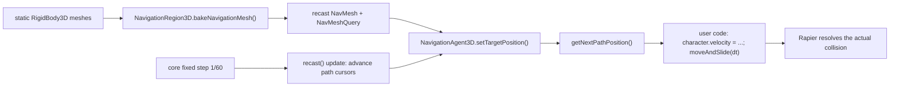

# PRD-034 — Navigation & pathfinding

**Status: ready after the Phase 1 exit; implementation in progress.** Gate 0 is closed and
the corpus decision keeps navigation **inside** `@threenative/physics` (see §2), rather
than creating a separate package.

**Complexity: 10 → HIGH mode.**
(10+ files +3, new module from scratch +2, complex state logic +2, multi-package +2,
external library integration +1.) HIGH mode means an automated checkpoint after **every**
phase, plus a manual checkpoint on the phases that change what a screenshot shows.

**Depends on:** PRD-003 (physics), PRD-013 (platformer kit), PRD-007 (playtest bridge).
**Charter authority:** `CHARTER.md` §5 (borrowed vocabulary), §5b (never own the look),
§9a (when a package may exist), §10 (budgets), §11.1 (the 20-line rule), §11.5 (packages).
**Strategy source:** [`OPPORTUNITY-AREAS.md`](./OPPORTUNITY-AREAS.md) area #3,
score 86 (Gap 30 / Ceiling 22 / Agent 22 / Cost 12).

---

## 1. Context

**Problem:** Three.js ships nothing for navigation. Every brief with an enemy, an NPC or a
follower needs it, and what a model writes without it is an ad-hoc A\* over a grid it
invented — the same "hundreds of lines nobody wants to write" shape that made Rapier worth
binding.

**Files analyzed (read, not guessed):**

- `packages/physics/src/{plugin,CollisionShape3D,CharacterBody3D,RigidBody3D,Area3D,index}.ts`
  — the binding this must imitate exactly.
- `packages/physics/package.json`, `packages/physics/tsup.config.ts`, `pnpm-workspace.yaml`.
- `packages/core/src/game.ts` (`GamePluginHooks`: `setup` / `update` / `sceneExit` /
  `dispose`), `packages/core/src/scene.ts` (`Ctx`, whose only plugin slot is
  `physics: TPhysics`).
- `scripts/check-budgets.ts` — `workspacePackageCount()` walks `packages/*` **and**
  `examples/*` and counts every directory containing a `package.json`.
- `docs/architecture/CHARTER.md` §5, §5b, §7, §9a, §10.
- `docs/PRDs/done/PRD-003-physics.md` — the precedent for a WASM-dep binding.
- `packages/create-threenative/templates/platformer/**` — the proving subject.
- `packages/playtest/src/{scenario,assertions,capabilities}.ts` — which assertions exist.

**Current behavior:**

- `ctx.physics` is a `PhysicsContext` holding a Rapier `World`. Nothing pathfinds.
- The platformer's only mobile enemy is `templates/platformer/src/entities/Patrol.ts`: a
  92-line ping-pong along x between two hardcoded points. It has no concept of geometry —
  give it bad endpoints and it walks off the platform.
- Nothing anywhere in `packages/` or `examples/` mentions navmesh, pathfinding or A\*
  (verified: `grep -rniE "pathfind|a-star|astar|navmesh|navigation|steer" packages/ examples/`
  returns two unrelated hits — a playtest doc example and a comment in `Abyss.ts`).

**Incumbent census:** **none.** There is no existing implementation of pathfinding to
replace, in this repo or in a vendored dependency. `Patrol.ts` is *not* an incumbent — a
scripted two-waypoint patrol is gameplay a model writes correctly in 15 lines, and it stays
(§4, the 20-line ledger). The distinction between the two is documented, not resolved by
deletion.

---

## 2. THE CENTRAL DECISION — where navigation lives

### The number, verified

```
$ pnpm budgets
budgets ok: 7 packages, 2988 framework LOC, 2 PRD files
```

`workspacePackageCount()` (`scripts/check-budgets.ts:41-53`) counts directories with a
`package.json` under `packages/` **and** `examples/`:

| Group | Entries | Count |
|---|---|---:|
| `packages/` | core, physics, ui, playtest, create-threenative | 5 |
| `examples/` | abyss-vanilla, abyss-framework | 2 |
| **Total** | | **7 / 8** |

**One slot remains, and `CHARTER.md` §10 ends with "Exceeding a cap is not a signal to
raise the cap."** Recast ships as WASM, so §9a ("a package exists only when it carries a
dependency the others must not inherit") means it cannot live in `core`. Two options.

### Option (a) — a new `@threenative/navigation` package

| | |
|---|---|
| **Cost** | The 8th and last workspace slot, permanently. Count goes 7 → 8, cap reached. |
| **Buys** | A clean dependency boundary: a game that installs physics never installs recast. |
| **Fits §9a?** | Literally yes — recast is a dep others must not inherit. |

**Why this is wrong, in one fact.** The last slot is already spoken for.
`CHARTER.md` §7 is **RESOLVED**, and its resolution is:

> **A JSI native binding to Rapier's Rust, shipped as `@threenative/physics-native`.**
> […] Since nobody else ships this, it is **the single most valuable artifact in the repo
> and the strongest reason ThreeNative exists at all.**

`packages/physics/AGENTS.md` repeats it as planned, and §9a's own layout lists
`physics-native` and `native` as future entries. Spending the last slot on navigation means
the charter's stated crown jewel can never be created without breaking a cap the charter
says is not raisable. Trading the single most valuable planned artifact for the #3 scored
opportunity is a bad trade at any exchange rate.

Two secondary marks against it:

- A `@threenative/navigation` package would peer-depend on `@threenative/physics` anyway
  (§4 shows why: the bake input is collider geometry, the path output is consumed by
  `CharacterBody3D.moveAndSlide`). A package that cannot be used without another package
  is a boundary drawn on paper.
- If Gate 0 exits on its **second** outcome — narrow to `physics` + `playtest`, delete the
  rest — a separate navigation package is deleted with the rest. Inside `physics`, it
  survives.

### Option (b) — inside `@threenative/physics`, behind a `./navigation` subpath export

| | |
|---|---|
| **Cost** | The package carries a second WASM dep. Every `pnpm install` of `@threenative/physics` downloads recast (~1.5 MB on disk) whether the game navigates or not. |
| **Buys** | Zero package slots. `physics-native` keeps its slot. Survives Gate 0's second outcome. |
| **Fits §9a?** | Yes, by §9a's own sentence: *"Modularity comes from subpath exports, not from more `package.json` files."* |

**The brief's objection, priced honestly.**

> *"…makes that package carry two unrelated deps and forces navigation on every physics user."*

*Unrelated?* No — and this is the load-bearing part of the decision. The coupling is
concrete and directional:

1. **The bake input is collision geometry.** Godot's `NavigationRegion3D` bakes from the
   same static bodies that `CollisionShape3D` describes. `CollisionShape3D.ts:6-27` already
   contains `geometryVertices()` and `geometryIndices()` — the exact
   `Float32Array` / `Uint32Array` pair `generateSoloNavMesh` takes. Navigation in a separate
   package would import or duplicate them.
2. **The path output is consumed by a physics node.** `NavigationAgent3D` computes a next
   waypoint; nothing moves until the user feeds it to `CharacterBody3D.moveAndSlide`
   (`CharacterBody3D.ts:83`). Rapier resolves the collision the navmesh only approximated.
3. Rapier and Recast are both WASM, both `init()`-once, both stepped inside `core`'s single
   fixed accumulator. The plugin plumbing is the same plumbing.

*Forces navigation on every physics user?* At **bundle** level, no — that is what the
subpath export is for, and Phase 3 makes it a gate, not a claim: the `minimal` template
imports `@threenative/physics` and never `@threenative/physics/navigation`, so its `vite
build` output must contain no recast artifact. At **install** level, yes: an extra ~1.5 MB
in `node_modules`. That is the real, stated price of option (b), and it is smaller than the
price of option (a).

### Decision

> **Option (b). Navigation ships inside `@threenative/physics` as the `./navigation`
> subpath export. The last workspace slot is reserved for `@threenative/physics-native`.**

Consequence to record in `packages/physics/AGENTS.md` (Phase 5): the package's one-line
justification changes from *"the Rapier WASM dependency"* to *"the WASM dependencies —
Rapier and Recast — that games without physics or navigation must not inherit."* The
package name stays `physics`; renaming it is scope creep, and Godot too ships navigation
next to physics in one engine.

**Budget after this PRD (projected, re-verified at Phase 5):**

| Budget | Before | After | Cap |
|---|---:|---:|---:|
| Workspace packages | 7 | **7** | 8 |
| Framework LOC | 2,988 | **~3,280** | 15,000 |
| PRD files in `docs/PRDs/` | 2 | 3 | 10 |

Template code is **free**: `collectBudgets()` walks `packages/<name>/src` only, and the
templates live at `packages/create-threenative/templates/`. This is a fact about the
counter, not a loophole to exploit — §4 governs what may go there.

---

## 3. Solution

**Approach:**

- `recast(options?)` is a `GamePluginHooks`, exactly like `rapier()`. It memoizes the WASM
  `init()`, populates `ctx.physics.navigation`, and steps agents inside `core`'s existing
  fixed accumulator. **One accumulator, not two** — same rule PRD-003 set.
- Three nodes, all Godot names, all thin: `NavigationRegion3D` (bake),
  `NavigationAgent3D` (query + path cursor), `NavigationObstacle3D` (local avoidance).
- **The agent computes; it never moves anything.** This mirrors Godot exactly: the engine's
  `NavigationAgent3D` does not move its parent either — you read `get_next_path_position()`
  and call `move_and_slide()`. Preserving that boundary is what keeps navigation out of
  gameplay and out of §5b.
- Every wrapper exposes its raw recast object. `region.navigationMesh` is a recast
  `NavMesh`, `navigation.query` is a `NavMeshQuery`, `navigation.crowd` is a `Crowd`. There
  is nothing to unwrap (§5).
- **Fail closed.** A bake that returns `success: false` throws. An agent constructed with no
  baked region throws. `recast()` with no `rapier()` ahead of it in the plugins array
  throws. A missing observation is a failure, never a silent `undefined`.

**Key decisions:**

- [ ] `recast-navigation` `0.43.1` (meta-package; pulls `@recast-navigation/core` +
      `@recast-navigation/generators`), pinned in `pnpm-workspace.yaml`'s catalog like every
      other dep. Not `@recast-navigation/three` — its helpers duplicate the geometry
      extraction `CollisionShape3D` already owns, and it would be a third package to track.
- [ ] Plugin named `recast()`, not `navigationServer()`. The convention this repo already
      set is *substrate-named plugin function, Godot-named nodes* — `rapier()` +
      `RigidBody3D`. Consistency with the existing surface beats a fourth Godot name.
- [ ] Solo navmesh (`generateSoloNavMesh`), not tiled. Tiled + `TileCache` is what dynamic
      re-baking needs; nothing in the roadmap asks for it, and YAGNI.
- [ ] Local avoidance (`Crowd`) is **Phase 4 and carries a kill condition** — if it cannot
      beat 20 lines of user code or cannot be proved by a playtest, it does not ship.
- [ ] Error strategy: throw with the node name in the message, matching
      `"CharacterBody3D requires a physics context or world."`

**Data changes:** `PhysicsContext` gains one optional field, `navigation?: NavigationContext`.
The root entry (`src/index.ts`) declares the type but **never imports recast**, which is
what keeps the root bundle recast-free.



```mermaid
sequenceDiagram
  participant Scene as Level.enter()
  participant Region as NavigationRegion3D
  participant Nav as ctx.physics.navigation
  participant Agent as NavigationAgent3D
  participant Char as CharacterBody3D
  Scene->>Region: new NavigationRegion3D({ navigation, meshes })
  Region->>Nav: bakeNavigationMesh()
  alt bake fails
    Nav-->>Region: { success: false, error }
    Region-->>Scene: throw "NavigationRegion3D could not bake…"
  else bake succeeds
    Nav-->>Region: NavMesh
  end
  Scene->>Agent: new NavigationAgent3D({ navigation, object })
  loop every fixed step
    Scene->>Agent: setTargetPosition(player.position)
    Agent->>Nav: query.computePath(from, to)
    Scene->>Agent: getNextPathPosition()
    Agent-->>Scene: Vector3
    Scene->>Char: velocity = dir * speed; moveAndSlide(dt)
  end
```

---

## 4. The 20-line rule, applied honestly

The rule is the reason most of "navigation" is **not** in this PRD.

### Framework — plumbing that beats 20 lines

| Thing | Why it survives | Est. LOC |
|---|---|---:|
| `recast()` plugin | memoized WASM `init()`, context install, per-step crowd/cursor advance, `sceneExit` teardown of navmesh + query + crowd handles | ~70 |
| `NavigationRegion3D` | world-matrix-applied triangle collection across an `Object3D` tree, recast config translation (cell size/height, agent radius/height/climb/slope), `generateSoloNavMesh`, fail-closed error path, handle disposal | ~85 |
| `NavigationAgent3D` | `computePath`, waypoint cursor with `pathDesiredDistance` advance, `targetDesiredDistance` arrival, reachability via `findClosestPoint` polygon-ref comparison, off-navmesh recovery, three signals | ~70 |
| `NavigationObstacle3D` | crowd obstacle registration, `ObstacleAvoidanceParams`, per-step position sync, disposal | ~55 |
| barrel + types | | ~12 |
| **Total** | | **~292** |

Each of these is unwritable in 20 lines by anyone who does not already know recast's
config units (cells, not metres) and its handle lifetimes. That is the same test
`RigidBody3D` passed.

### Gameplay — the user's agent writes this, in the template or nowhere

| Thing | Where it goes | Why |
|---|---|---|
| Steering weights, acceleration, turn rate | `templates/platformer/src/entities/Chaser.ts` | 5 lines of lerp. A model writes it right the first time. |
| Aggro radius, line-of-sight, give-up distance | template | Game design, not plumbing. |
| Re-path cadence ("re-target every 0.25 s") | template | One `ctx.every` call. Owning it would decide the game's CPU budget. |
| Patrol routes / waypoint lists | template (`Patrol.ts`, unchanged) | Already 15 lines of user code and correct. |
| Enemy state machine (idle → chase → attack) | template | This is the game. |
| Formation, flocking, squad logic | **nowhere** | Not asked for. |

**`Patrol.ts` is deliberately not deleted or rewritten.** A scripted two-point patrol and a
navmesh chase are different behaviours with different costs, and having both in the template
is the documentation for when to reach for each (Phase 5 writes that sentence into
`templates/platformer/AGENTS.md`).

### Never owns the look (§5b)

Navigation touches no material, light, shader, or camera. The one visual artifact it could
produce — a navmesh debug overlay — is **not in this PRD**. If it is ever wanted it is
generated `src/render/` source in the user's repo, never package code.

---

## 5. Reachability

**How will this feature be reached?**

- Entry point: `core`'s fixed-step frame loop, via the `plugins` array in
  `templates/platformer/src/main.ts`.
- Pre-existing files EDITED to call it: `templates/platformer/src/main.ts` (adds `recast()`),
  `templates/platformer/src/scenes/Level.ts` (bakes the region, spawns the chaser).
- Registration: `defineGame({ plugins: [rapier(...), recast(...)] })`, plus the
  `./navigation` entry in `packages/physics/package.json` and `tsup.config.ts`.

**Is this user-facing?** YES, but with no UI of its own — it is visible as enemy behaviour
in the running game. The observable outcome is the chaser reaching the player. No HUD
element is added; the existing `hearts` counter already reacts when an enemy touches the
player.

**Full flow:**

1. Player loads the scaffolded platformer and stands still on the first platform.
2. `Level.enter()` bakes a `NavigationRegion3D` from the platform meshes and the blocker
   wall, and spawns a `Chaser` on the far side of the wall.
3. The frame loop calls the chaser's `update`, which calls `agent.getNextPathPosition()`
   and feeds the direction into `CharacterBody3D.moveAndSlide`.
4. Result observable in: the chaser walking **around** the wall and reaching the player —
   and in `playtests/chase.playtest.json` asserting it arrived.

**What does this replace?** Nothing. Verified by grep (§1, Incumbent census). Every ledger
row below therefore has an empty `Replaces`, and that emptiness is a finding, not an
omission.

---

## 6. Integration Ledger

`file:line` cells read `TBD` until the implementing phase fills them with a real, non-test
location. A `TBD` at phase end means the phase is incomplete.

| # | New thing | Live caller (`file:line`, non-test) | Replaces | Old path removed? | Negative control |
|---|---|---|---|---|---|
| 1 | `recast()` plugin | `templates/platformer/src/main.ts:TBD` (plugins array) | nothing — no incumbent | n/a | remove it from `plugins` → `ctx.physics.navigation` is `undefined`, `Level.enter()` throws `"NavigationRegion3D requires a navigation context"`, `chase.playtest.json` fails |
| 2 | `NavigationRegion3D` | `templates/platformer/src/scenes/Level.ts:TBD` | nothing | n/a | bake the platforms but **exclude the blocker wall** → the path goes straight through the wall, the chaser jams against the Rapier collider, `movement.reachesPositionWithin` fails |
| 3 | `NavigationAgent3D` | `templates/platformer/src/entities/Chaser.ts:TBD` | nothing | n/a | pin `getNextPathPosition()` to the agent's own position → the chaser never moves, `movement.pathLength` fails |
| 4 | agent cursor advance in `recast().update` | `packages/physics/src/navigation/index.ts:TBD`, driven by `packages/core/src/game.ts:319-321` | nothing | n/a | skip the update hook → the cursor never advances past waypoint 0, chaser stalls at the first corner |
| 5 | `./navigation` subpath export | `packages/physics/package.json` `exports` map | nothing | n/a | delete the export entry → the template's `vite build` fails to resolve `@threenative/physics/navigation` |
| 6 | `NavigationObstacle3D` | `templates/platformer/src/scenes/Level.ts:TBD` (Phase 4) | nothing | n/a | set `avoidanceEnabled: false` → two chasers converge to the same point and overlap; the overlap assertion fails |
| 7 | `chase.playtest.json` | `templates/platformer/package.json` `test:playtest` chain | nothing | n/a | run the scenario against the pre-Phase-2 commit → must fail (`TN_PLAYTEST_*`), proving it is not satisfied by the baseline |

---

## 7. Execution phases

### Proof-subject declaration (prd-creator: hardest real subject first)

**Proof subject, from Phase 1 onward:** the platformer template's real `Level`
(`templates/platformer/src/scenes/Level.ts:42-45`) — four `createPlatform` calls producing:

- a main slab spanning x ≈ −9…9 at y = 0, depth 7;
- a second slab x ≈ 9…19, a third x ≈ 21…29 — **a genuine 2 m gap at x 19…21**, so the
  navmesh is two disconnected islands and `isTargetReachable()` must return `false` across
  it;
- a **one-way platform at y = 2.6 directly above the first slab** — an overhang, so the
  bake must produce two walkable layers at the same (x, z) and not merge them.

Phase 1 adds one more piece of real geometry: a static blocker wall on the first slab,
spanning most of its depth, so that the straight line from the chaser spawn to the player
spawn is blocked and any correct path must detour in z.

**This is not a flat plane.** Disconnected islands, an overhang, and a blocker are the three
things a solo navmesh bake most commonly gets wrong. There is no simpler subject in this
phase plan and therefore no debt block to declare.

---

#### Phase 1 — The platformer's real level bakes into a navmesh, and the gap at x 19…21 is provably a gap

**Files (6; the first three are one indivisible packaging change — splitting them across
phases leaves the build broken):**

- `pnpm-workspace.yaml` — EDIT: `catalog: recast-navigation: 0.43.1`
- `packages/physics/package.json` — EDIT: dependency `recast-navigation: "catalog:"`, and
  an `"./navigation"` entry in `exports`
- `packages/physics/tsup.config.ts` — EDIT: `entry: ["src/index.ts", "src/navigation/index.ts"]`
- `packages/physics/src/navigation/index.ts` — NEW: `recast()`, `NavigationContext`,
  memoized `init()`, re-exports
- `packages/physics/src/navigation/NavigationRegion3D.ts` — NEW
- `packages/physics/__tests__/navigation-region.spec.ts` — NEW

**Implementation:**

- [ ] `recast()` returns `GamePluginHooks<Record<string, unknown>, PhysicsContext>`, matching
      `rapier()`'s shape (`plugin.ts:34`). `setup` awaits a module-level memoized `init()`
      promise (same pattern as `plugin.ts:27-32`), then asserts `ctx.physics !== undefined`
      and throws `"recast() requires rapier() earlier in the plugins array."` if not.
- [ ] `setup` assigns `ctx.physics.navigation = { query, regions, crowd: undefined }`.
      `PhysicsContext` in `src/plugin.ts` gains `navigation?: NavigationContext`, typed via
      `import type` only — **`src/index.ts` must not import recast at runtime.**
- [ ] `NavigationRegion3D({ navigation, meshes, cellSize?, cellHeight?, agentRadius?,
      agentHeight?, agentMaxClimb?, agentMaxSlope? })`. Godot property/method names:
      `.navigationMesh` (raw recast `NavMesh`), `.enabled`, `.bakeNavigationMesh()`,
      `.dispose()`.
- [ ] Triangle collection traverses each `Object3D`, applies `updateWorldMatrix` +
      `matrixWorld` to every position (the world-space step `CollisionShape3D.ts:6-17` does
      not need and therefore does not do), and concatenates into one
      `Float32Array` / `Uint32Array` pair.
- [ ] Fail closed: `generateSoloNavMesh` returning `{ success: false }` throws
      `"NavigationRegion3D could not bake a navmesh: <error>"`. Zero input triangles throws.
      A non-finite `cellSize` throws.
- [ ] `dispose()` destroys the recast navmesh handle and removes the region from the context.
      `sceneExit` disposes every registered region — the contract `packages/physics/AGENTS.md`
      already states for physics nodes.

**Wiring:**

- [ ] Caller edited: `packages/physics/package.json` `exports` gains `./navigation`
      (ledger #5); `tsup.config.ts` gains the second entry.
- [ ] Registration: n/a this phase — the plugin is registered in Phase 2. **This phase
      deliberately has no game-facing caller, and that is the debt Phase 2 closes.**
- [ ] Old path: n/a, new behaviour.
- [ ] Ledger rows filled: #5 (and #2's `Replaces`/`Old path` columns confirmed empty).

**Tests required:**

| Test file | Test name | Assertion | Negative control (must be observed red) |
|---|---|---|---|
| `packages/physics/__tests__/navigation-region.spec.ts` | `should bake a walkable navmesh from the platformer level geometry` | `region.navigationMesh.getParams().maxTiles > 0` and a `NavMeshQuery.findClosestPoint([0, 0.75, 0])` lands within 0.3 of the player spawn | pass an empty mesh list → throws; **run at the previous commit → the import does not resolve** |
| same | `should report the third platform unreachable across the x 19…21 gap` | `query.computePath([0,0.75,0], [25,0.75,0])` returns `success: false` **or** a path whose last point is more than 2 m from the target | widen the second platform to close the gap → the assertion goes green, proving it measures the gap and not a constant |
| same | `should keep the one-way platform at y 2.6 as a separate walkable layer` | `findClosestPoint([0, 2.6, 0])` returns y ≈ 2.6, not y ≈ 0 | set `cellHeight` to 4 (taller than the 2.6 m clearance) → the layers merge and the assertion goes red |
| same | `should throw when the bake fails` | `expect(() => new NavigationRegion3D({ meshes: [] })).toThrow(/could not bake\|requires/)` | delete the throw → red |

The level dimensions in the spec file are imported from a single exported constant shared
with `Level.ts` where practical, or duplicated with a comment naming `Level.ts:42-45` as the
owner. **Twin constants with nothing tying them are an anti-pattern** — if duplication is
unavoidable, the spec asserts the two agree.

**Revert check:** remove `"./navigation"` from `packages/physics/package.json` → the new
spec file fails to resolve its import and the pre-existing `pnpm --filter @threenative/physics
test` (which runs `publint`) reports the broken export map.

**Verification plan:**

```sh
pnpm typecheck && pnpm lint && pnpm test
pnpm --filter @threenative/physics test          # build + publint: export map must be valid
pnpm budgets                                     # expect: 7 packages — MUST NOT be 8
```

```sh
# Negative control for "test never collected": add `expect(true).toBe(false)` to the spec,
# confirm vitest reports 1 failure and names the file. Then remove it.
# Negative control for the baseline: git stash the src/navigation/ directory and re-run —
# the spec must fail to import, not silently skip.
```

**Automated checkpoint:** spawn `prd-work-reviewer` with the integration audit prompt,
explicitly including: *"Phase 1 has no game-facing caller by design; confirm Phase 2 is the
declared closer and that ledger row #5 is filled."*

---

#### Phase 2 — A chaser walks around a wall and reaches the player in the running platformer

**Files (5):**

- `packages/physics/src/navigation/NavigationAgent3D.ts` — NEW
- `packages/physics/src/navigation/index.ts` — EDIT: export the agent; `update` advances
  every registered agent's path cursor (ledger #4)
- `packages/create-threenative/templates/platformer/src/entities/Chaser.ts` — NEW
- `packages/create-threenative/templates/platformer/src/scenes/Level.ts` — EDIT: blocker
  wall, `NavigationRegion3D` bake, `Chaser` spawn + per-frame update + `ctx.entities.add("chaser", …)`
- `packages/create-threenative/templates/platformer/src/main.ts` — EDIT: `recast()` in `plugins`

**Implementation:**

- [ ] `NavigationAgent3D({ navigation, object, radius?, height?, maxSpeed?,
      pathDesiredDistance?, targetDesiredDistance? })`. Godot methods, camelCase:
      `setTargetPosition(v)`, `getNextPathPosition()`, `isNavigationFinished()`,
      `isTargetReachable()`, `getFinalPosition()`, `distanceToTarget()`, `dispose()`.
      Signals via `on("targetReached" | "navigationFinished" | "pathChanged", fn)` returning
      an unsubscribe function — the same contract `Area3D.on` (`Area3D.ts:56-59`) already sets.
- [ ] `getNextPathPosition()` throws if no target has been set. `isTargetReachable()`
      compares the polygon reference of the agent's closest point with the target's; it
      returns `false` across the x 19…21 gap. **It never returns `undefined`.**
- [ ] The agent moves nothing. `Chaser.update` reads the waypoint, builds a horizontal
      direction, writes `character.velocity.x/z`, and calls `moveAndSlide(dt)` — the
      existing `CharacterBody3D` path, gravity and all.
- [ ] `Chaser` is ~70 template lines: `CharacterBody3D` + `NavigationAgent3D` + a re-target
      every 0.25 s via `ctx.every`, a `debug()` returning `{ position, targetReachable,
      navigationFinished }` for `Registry.snapshot()`, and `dispose()`.
- [ ] `Level.ts`: add a fixed blocker wall via `createPlatform`-style `RigidBody3D` at
      x ≈ 3.4 spanning z ≈ −2.6…2.6 (the slab is depth 7, so ~0.9 m of clearance remains at
      each edge); bake the region from the platform visuals **and** the wall; spawn the
      chaser at (7.5, 0.66, 0). Player spawn stays (0, 0.75, 0), straight-line distance ≈ 7.5,
      shortest legal path ≈ 9.5.

**Wiring:**

- [ ] Callers edited: `main.ts` (ledger #1), `Level.ts` (ledger #2), `Chaser.ts` (ledger #3),
      `navigation/index.ts` `update` (ledger #4).
- [ ] Registration: `recast()` in the `plugins` array; `ctx.entities.add("chaser", chaser)`
      so playtest can observe it.
- [ ] Old path: n/a. `Patrol.ts` is untouched and stays live (§4).
- [ ] Ledger rows filled: #1, #2, #3, #4.

**Tests required:**

| Test file | Test name | Assertion | Negative control (must be observed red) |
|---|---|---|---|
| `packages/physics/__tests__/navigation-agent.spec.ts` | `should route around a blocker instead of through it` | path length from (7.5,·,0) to (0,·,0) ≥ 9.0 while straight-line is 7.5, and every waypoint's \|z\| clears the wall | omit the wall from the bake → the path is straight, length ≈ 7.5, assertion red |
| same | `should report the far platform unreachable and the near one reachable` | `isTargetReachable([25,·,0]) === false`, `isTargetReachable([-6,·,0]) === true` | make `isTargetReachable` return a constant `true` → the first case goes red |
| same | `should throw when getNextPathPosition is called before a target is set` | `.toThrow()` | replace the throw with `return object.position` → red |
| `packages/create-threenative/__tests__/platformer.spec.ts` | `should register a chaser entity and the recast plugin in the platformer template` | the generated `main.ts` contains `recast(`, `Level.ts` registers `"chaser"` | run at the previous commit → red |

**Revert check:** delete `recast()` from `templates/platformer/src/main.ts` → the
pre-existing `packages/create-threenative/__tests__/platformer.spec.ts` scaffold assertions
fail and the template's `Level.enter()` throws at runtime.

**Verification plan:**

```sh
pnpm typecheck && pnpm lint && pnpm test

# Caller census — every new exported symbol has a non-test consumer
grep -rn "NavigationAgent3D\|NavigationRegion3D\|recast(" \
  packages/create-threenative/templates packages/physics/src \
  --include=*.ts | grep -v "__tests__" | grep -v "\.spec\."
# Expected: hits in templates/platformer/src/{main.ts,scenes/Level.ts,entities/Chaser.ts}
#           that are not the definitions themselves.
```

**Manual checkpoint (HIGH, and this phase changes what a screenshot shows):**

```
## PHASE 2 COMPLETE — CHECKPOINT
1. [ ] pnpm --filter <scaffolded platformer> dev, stand still on the first platform
2. [ ] Expected: the chaser leaves its spawn, tracks out in +z or -z around the wall,
       comes back to the player's x, and reaches them. It does NOT jam against the wall
       and does NOT clip through it.
Reply "continue" or report issues.
```

---

#### Phase 3 — The playtest proves it arrived, and recast stays out of the bundle of games that do not navigate

**Files (4):**

- `packages/create-threenative/templates/platformer/playtests/chase.playtest.json` — NEW
- `packages/create-threenative/templates/platformer/package.json` — EDIT: append the
  scenario to the `test:playtest` chain
- `packages/create-threenative/__tests__/playtest.spec.ts` — EDIT: assert the chain runs
  `chase.playtest.json`
- `packages/create-threenative/__tests__/scaffold.spec.ts` — EDIT: the bundle-isolation gate

**The scenario (mandatory per `CLAUDE.md` — any change with runtime behaviour gets one):**

```json
{
  "name": "platformer-chase",
  "schemaVersion": 1,
  "target": "web",
  "viewport": { "width": 1280, "height": 720 },
  "warmupFrames": 10,
  "subject": "chaser",
  "steps": [{ "kind": "wait", "waitTicks": 300, "release": true }],
  "assert": {
    "diagnostics": { "noConsoleErrors": true, "runtimeReady": true },
    "movement": {
      "entity": "chaser",
      "reachesPositionWithin": { "position": [0, 0.66, 0], "maxDistance": 1.2 },
      "pathLength": 9.0
    }
  }
}
```

Both assertion fields exist today: `IPlaytestMovementAssertion.reachesPositionWithin` and
`.pathLength` (`packages/playtest/src/scenario.ts:40-65`), evaluated at
`packages/playtest/src/assertions.ts:734-780`, requiring only the `entity.observe`
capability that the framework bridge already installs. **No new assertion kind is
introduced by this PRD.**

Why these two together: `reachesPositionWithin` alone is satisfiable by a chaser that
teleports or that clips through the wall; `pathLength ≥ 9.0` against a straight-line
distance of 7.5 is only satisfiable by a detour. Neither alone is a proof; both together are.

**Implementation:**

- [ ] Append the scenario to `test:playtest` in the template's `package.json`, in the same
      form as the ten existing scenarios.
- [ ] Bundle-isolation gate in `scaffold.spec.ts`: scaffold the **`minimal`** template
      (which imports `@threenative/physics` at `src/main.ts:3` and never imports
      `@threenative/physics/navigation`), run its `vite build`, and assert **no recast
      artifact** appears in `dist/` — no `.wasm` from `@recast-navigation`, no
      `recast-navigation` chunk. This is the gate that turns §2's bundle-isolation claim
      into a fact.

**Wiring:**

- [ ] Caller edited: `templates/platformer/package.json` `test:playtest` (ledger #7).
- [ ] Ledger rows filled: #7.

**Tests required:**

| Test file | Test name | Assertion | Negative control (must be observed red) |
|---|---|---|---|
| `playtests/chase.playtest.json` (run by the template's `test:playtest`) | scenario `platformer-chase` | `movement.reachesPositionWithin` + `movement.pathLength` both pass | **run the scenario at the pre-Phase-2 commit — there is no `chaser` entity, so it must fail `TN_PLAYTEST_*`, not skip.** Then, on the current commit, exclude the wall from the bake → the chaser jams and `reachesPositionWithin` goes red |
| `packages/create-threenative/__tests__/scaffold.spec.ts` | `should not ship recast in a build that never imports the navigation entry` | `dist/` contains no `recast` artifact | add `import "@threenative/physics/navigation"` to the minimal template's `main.ts` → the assertion goes red, proving it detects the artifact rather than always passing |
| `packages/create-threenative/__tests__/playtest.spec.ts` | `should run the chase scenario in the platformer test chain` | the `test:playtest` string includes `chase.playtest.json` | run at the previous commit → red |

**Revert check:** remove `chase.playtest.json` from the chain → the pre-existing
`playtest.spec.ts` assertion fails.

**Verification plan:**

```sh
pnpm typecheck && pnpm lint && pnpm test
pnpm --filter @threenative/playtest build
# In a scaffolded platformer:
npx @threenative/playtest --scenario playtests/chase.playtest.json \
  --url http://127.0.0.1:4173 \
  --server-command "pnpm dev --host 127.0.0.1 --port 4173 --strictPort"
```

Evidence required: the runner's **raw assertion list** pasted, not the verdict line. The
report must name `movement.reachesPositionWithin` and `movement.pathLength` with their
measured values. A verdict without the per-assertion rows is recorded as UNVERIFIED.

> **Local note:** headless Chromium renders WebGPU as a blank canvas on this machine —
> screenshot-bearing runs need `xvfb-run`. `chase.playtest.json` asserts no `visual` block
> precisely so it does not depend on a captured frame.

---

#### Phase 4 — Local avoidance, or `NavigationObstacle3D` is deleted

**Kill condition, stated before the code is written (§11.2 — the kill switch):** if, at the
end of this phase, `NavigationObstacle3D` + crowd avoidance costs the framework more lines
than the equivalent user-space code, or if no playtest can distinguish avoidance-on from
avoidance-off, **the node and the `Crowd` are deleted and Phase 4 is recorded as a
deliberate non-ship.** That is the kill switch working, not a failed phase.

**Files (4):**

- `packages/physics/src/navigation/NavigationObstacle3D.ts` — NEW
- `packages/physics/src/navigation/index.ts` — EDIT: lazily create the `Crowd`, step it
- `packages/create-threenative/templates/platformer/src/scenes/Level.ts` — EDIT: a second
  chaser, plus a moving obstacle
- `packages/create-threenative/templates/platformer/playtests/avoidance.playtest.json` — NEW

**Implementation:**

- [ ] `NavigationObstacle3D({ navigation, object, radius?, height?, avoidanceEnabled? })` —
      Godot's property names. It registers a crowd obstacle and syncs its position each step.
- [ ] Solo navmesh means obstacles are **local avoidance only, never a re-bake.** Say so in
      the doc comment and in `packages/physics/AGENTS.md`: geometry that changes shape needs
      a re-bake and is out of scope.

**Tests required:**

| Test file | Test name | Assertion | Negative control |
|---|---|---|---|
| `packages/physics/__tests__/navigation-obstacle.spec.ts` | `should keep two agents from occupying the same point` | minimum inter-agent distance over 120 steps ≥ sum of radii × 0.8 | set `avoidanceEnabled: false` → the agents converge and the assertion goes red |
| `playtests/avoidance.playtest.json` | `platformer-avoidance` | both chasers reach the player and neither's `movement.maxDistance` shows it shoved off the platform | disable avoidance → red |

**Revert check:** delete `NavigationObstacle3D` → `Level.ts` fails to compile and the
avoidance playtest fails.

**Automated checkpoint prompt addition:** *"Report whether the kill condition fired. If it
did, confirm the node, the Crowd, the spec and the playtest were all deleted — not left
behind as dead code."*

---

#### Phase 5 — Documented, budgeted, filed

**Files (5):**

- `packages/physics/AGENTS.md` — EDIT: "Why this package exists" now names **two** WASM deps
  and states the §2 decision and its reason; a "Navigation" section with the node list, the
  agent-computes-character-moves boundary, and the solo-navmesh/no-re-bake limit
- `packages/create-threenative/templates/platformer/AGENTS.md` — EDIT: when to use `Patrol`
  (scripted route) vs `Chaser` (navmesh pursuit), and that steering/aggro/re-path cadence are
  the user's to write
- `docs/PRDs/OPPORTUNITY-AREAS.md` — EDIT: mark area #3 shipped and record that the slot
  was **not** spent
- `docs/strategy/ROADMAP.md` — EDIT: add PRD-034 to the "Which roadmap items have PRDs" table
- `docs/verification/` — NEW: dated gate results for this PRD, per the folder's convention

**Implementation:**

- [ ] Run `pnpm sync:agents` — every `CLAUDE.md` in this repo is generated, and CI fails on
      drift. Hand-editing a `CLAUDE.md` is reverted.
- [ ] Run `pnpm budgets` and paste the output. Packages **must** still read 7.
- [ ] Move this PRD to `docs/PRDs/done/` only when §9's boxes are all checked.

**Verification plan:**

```sh
pnpm sync:agents --check
pnpm budgets      # expect: 7 packages, ~3280 framework LOC, N PRD files
pnpm typecheck && pnpm lint && pnpm test
```

---

## 8. Risks

| Risk | Signal it is happening | Response |
|---|---|---|
| Recast's WASM `init()` breaks under vitest's node environment | `navigation-region.spec.ts` cannot load the module | recast ships an emscripten build that runs in node; if it does not, the region spec moves to the playtest layer and the PRD says so out loud rather than deleting the assertion |
| Bake units confusion (recast configures in **cells**, not metres) | navmesh has zero polys, or one poly covering everything | the three Phase 1 assertions (reachability across the gap, the y = 2.6 layer, the spawn point) each fail in a different way for a different unit error — that is why there are three |
| Navigation grows steering, aggro and formation code | a `NavigationAgent3D` option nobody asked for | §4's table is the boundary; anything on the right-hand side goes to the template or nowhere |
| The `physics` package becomes a junk drawer | a third unrelated dep proposed | the §2 decision licenses **recast specifically**, on the coupling argument in §2 — it is not a general licence |
| Bundle isolation silently regresses | recast appears in a non-navigating game's `dist/` | Phase 3's gate, with its own negative control |
| Gate 0 exits on outcome 2 | the framework narrows to `physics` + `playtest` | navigation is already inside `physics` and survives — this was priced in §2 |

---

## 9. Acceptance criteria — consumer-scoped

Every criterion below describes something a user or a runner can observe. None of them is
satisfiable by code that merely exists.

- [ ] **An enemy in the scaffolded platformer template walks around the blocker wall and
      reaches the player**, and `playtests/chase.playtest.json` asserts it arrived
      (`reachesPositionWithin` within 1.2 m) by a route longer than the straight line
      (`pathLength ≥ 9.0` vs 7.5).
- [ ] **A target across the x 19…21 gap is reported unreachable** rather than producing a
      path the chaser then walks off a ledge following.
- [ ] **The chaser on the one-way platform at y = 2.6 paths on that layer**, not on the slab
      below it.
- [ ] **A scaffolded game that uses physics but never imports `@threenative/physics/navigation`
      ships no recast artifact in its `dist/`.**
- [ ] **`pnpm budgets` still reports 7 workspace packages.** The 8th slot is unspent and
      reserved for `@threenative/physics-native`.
- [ ] Deleting `recast()` from the template's `plugins` array breaks the running game and a
      pre-existing test — not just a new one.
- [ ] `pnpm typecheck && pnpm lint && pnpm test` green, and `pnpm sync:agents --check` clean.

**Integration gates — this PRD is NOT done with any of these unchecked:**

- [ ] Integration Ledger has zero `TBD` cells; every live caller is a real non-test `file:line`
- [ ] Every new exported symbol has at least one non-test consumer (caller census pasted, not summarized)
- [ ] Revert check passed in every phase: disabling the new code breaks a pre-existing test or flow
- [ ] Every `Replaces` cell is empty **and** the grep proving no incumbent exists is pasted
- [ ] Every gate has a negative control that was **observed failing**, recorded in the form
      `<gate> — PASS; goes red when <mutation>`
- [ ] The capability was proved on the real platformer level (islands, overhang, blocker) — no
      flat-plane fixture appears anywhere in this PRD's tests
- [ ] Phase 4's kill condition was evaluated and its outcome recorded either way
- [ ] All automated checkpoint reviews passed; the Phase 2 manual checkpoint passed

**Never claim a green gate you did not run (§11.6).** "Unverified" is an acceptable entry in
the evidence section below. "Verified" without a pasted run is not.

---

## 10. Verification evidence

*(filled in during implementation — a phase with an empty row is not complete)*

### Phase 1
- Unit tests: —
- Negative controls observed red: —
- `pnpm budgets`: —

### Phase 2
- Unit tests: —
- Caller census: —
- Manual checkpoint: —

### Phase 3
- `chase.playtest.json` raw assertion rows: —
- Baseline-commit run (must fail): —
- Bundle-isolation gate: —

### Phase 4
- Kill condition fired? —

### Phase 5
- `pnpm budgets`: —
- `pnpm sync:agents --check`: —
