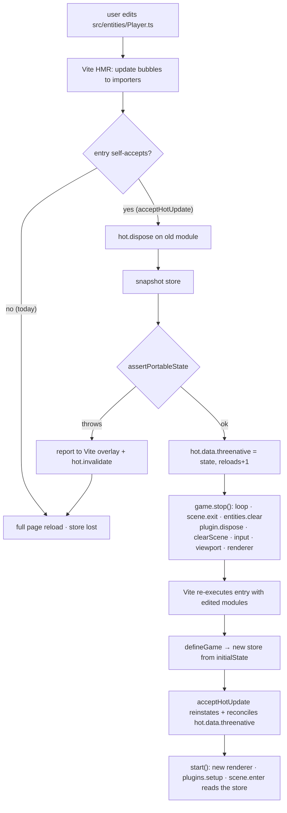

# PRD-035 — Hot reload with state preservation

**Status: IMPLEMENTATION DELIVERED; supported-browser consumer and manual jump/fall probes
pass; full release evidence remains.**
Roadmap Gate 0 and Phase 1 exited on 2026-08-08. The implementation is on
`docs/opportunity-areas-prds` in commits `3b27b8a` and `90baf3a`; the implementation
checkpoint gates pass. The real starter HMR gate now passes on an isolated Brave/WebGPU/X11
runner, including zero console errors, and a manual jump/fall probe shows the edited
`JUMP_SPEED` taking effect while the player lands cleanly. The full browser suite and
remaining manual/negative-control evidence are still open.

**Complexity: 10 → HIGH mode.** (10+ files +3, new module +2, concurrency/lifecycle state
+2, multi-package +2, external API — Vite's HMR contract +1.) HIGH means an automated
checkpoint after **every** phase, plus a manual checkpoint on the two phases with browser
behaviour.

**Depends on:** PRD-031 (scene-owned lifecycle — the teardown contract this reload path
rides on), PRD-022 (viewport lifecycle and disposal), PRD-028 (`static initialState`, the
store as the single state declaration), PRD-027 (particle release contract).
**Blocks:** nothing.
**Charter authority:** `AGENTS.md` rules 1 (20-line), 2 (kill switch), 4 (borrowed
vocabulary), 5 (no new package), and verification honesty. `CHARTER.md` §5b is satisfied
trivially: nothing here is on screen. **`packages/core/AGENTS.md` says the core's contents
list "is closed. Adding to it needs a PRD and a line in `CHARTER.md`."** This is that PRD;
Phase 5 adds that line. If `CHARTER.md` refuses the line, this PRD dies there — that is the
correct outcome, not a blocker to route around.

**Area:** `OPPORTUNITY-AREAS.md` #4, score **80** (Gap 28 · Ceiling 24 · **Agent leverage
12** · Cost 16).

---

## 0. Score this honestly before reading further

**This is a human-adoption win. It is not a benchmark win, and it must not be sold as
one.** The opportunity doc scores agent leverage at 12/25 and the reason is sound: an agent
restarts the dev server for free. It does not feel the twenty seconds of re-walking to the
bug that a human feels forty times an hour. Expect this to move:

| Roadmap axis | Expected movement | Why |
|---|---|---|
| Ships working (`sweep:pair`) | **0** | An agent's proof runs are cold starts. Reload never executes in a sealed proof. |
| Looks good (`sweep:judge`) | **0** | Nothing here is visible. §5b-safe by construction. |
| Costs less (`count-loc`) | **≈0, possibly slightly negative** | The framework arm gains ~115 lines; the user arm saves 1 line per entry (`acceptHotUpdate(game, import.meta.hot)`). Against the *vanilla* control this is a small loss on the LOC ratio, because the vanilla control never wrote the reload path at all. |
| Does what vanilla can't | **+small** | Genuinely 0→1 for a *user*: no vanilla Three.js project preserves game state across a Vite update without hand-writing this. |
| Survives the platform | 0 | — |

The one number that would justify it is not on the roadmap's axes: **time-to-next-attempt
for a human iterating on feel** (jump height, camera damping, spring constants) — the
values you can only tune by feeling them, where a full reload costs the re-setup of the
exact situation you were tuning. If that is not a problem the project wants to solve, the
correct disposition of this PRD is **reject**, and rule 2 says say so rather than build it.

---

## 1. Context

**Problem:** Vite reloads modules; nothing reloads the *game*. Editing any file under
`src/` today ends in a full page reload, which drops the store, the scene, the physics
world and the player's position back to `initialState`.

### Files analyzed

`packages/core/src/game.ts` (whole file — `GameImpl.start`/`stop`/`#goto`/`clearScene`,
`installDevTools`), `packages/core/src/scene.ts`, `packages/core/src/state.ts`,
`packages/core/src/loop.ts`, `packages/core/src/viewport.ts`,
`packages/core/src/import-meta.d.ts`, `packages/core/src/audio.ts`,
`packages/core/src/entities.ts`, `packages/core/src/renderer.ts`,
`packages/core/src/playtest.ts`, `packages/core/src/index.ts`,
`packages/core/package.json`, `packages/core/tsup.config.ts`,
`packages/core/__tests__/constraints.spec.ts`, `packages/physics/src/plugin.ts`,
`packages/ui/src/GameCanvas.tsx`, `packages/create-threenative/templates/{minimal,starter,
platformer}/{vite.config.ts,src/main.ts,src/scenes/*}`,
`examples/abyss-framework/src/main.tsx`, `playwright.config.ts`,
`packages/playtest/src/scenario.ts`, `scripts/check-budgets.ts`.

### Current behaviour — established by reading, not assumed

| Fact | Evidence |
|---|---|
| **No HMR awareness exists anywhere in the repo.** `import.meta.hot` has zero occurrences in `packages/` or `examples/`. | `grep -rn "import\.meta" packages examples` returns only `env.DEV` reads, `import.meta.url` in Node scripts, and build output |
| **`src/import-meta.d.ts` is not an HMR shim.** It is 5 lines declaring `ImportMeta.env.DEV` only, because core does not pull in `vite/client` types and two call sites need the dev flag | `packages/core/src/import-meta.d.ts:1-5`; consumed at `game.ts:32` (`installDevTools`) and mirrored in `packages/ui/src/DebugOverlay.tsx:9` |
| **`stop()` already is the teardown contract.** Loop stopped → `scene.exit` → scheduler cleared → `entities.clear()` (which disposes every registered disposable, PRD-031) → plugin `dispose()` → cleanups drained → `clearScene` (particles detached, `scene.clear()`, background/environment/fog nulled) → input disposed → store stopped → viewport disposed → renderer disposed | `game.ts:350-377`; `entities.ts:53-59`; `game.ts:134-141` |
| **`stop()` is not safe against an in-flight `start()`.** `#started` is set at `game.ts:338`, *after* `await createRenderer(...)`, `await plugin.setup(...)` and `await scene.load(...)`. `stop()` returns immediately when `!#started` (`game.ts:351`) | `game.ts:234-340` vs `game.ts:350-351` |
| The store is created in the **constructor**, before `start()`, and is a plain zustand vanilla store over `Record<string, unknown>` | `game.ts:185`, `state.ts:12-43` |
| The store is already asserted JSON-safe on the playtest path — precedent for a portability contract that fails closed | `playtest.ts:212-224` (`assertJsonSafe(state)`) |
| `installDevTools` **overwrites** `window.__THREENATIVE__` rather than merging | `game.ts:35` |
| `AudioBus` instances live in a module-level `Set` and `dispose()` removes them; `audioRuntimeSnapshot()` already reports live voices/queued across all buses | `audio.ts:19,44,127-129,150-159` |
| The rapier plugin already frees the world and event queue on `dispose()`, and disposes bodies/areas on both `sceneExit` and `dispose` | `physics/src/plugin.ts:129-141` |
| `RAPIER.init()` is memoized at module scope, so it is paid once per page, not once per reload | `physics/src/plugin.ts:33-38` |
| `GameCanvas` starts the game in an effect keyed on `[game]` and calls `game.stop()` in the effect cleanup — a **new** `Game` object re-runs the effect and re-mounts the new canvas with no UI change needed | `ui/src/GameCanvas.tsx:18-44` |
| `@threenative/core`'s export map already has a `./*` wildcard, so a new `src/hot.ts` is reachable as `@threenative/core/hot` with **no `package.json` edit** | `packages/core/package.json` exports |
| Core source is 1,996 lines against a hard test cap of 2,500 | `wc -l packages/core/src/*.ts`; `constraints.spec.ts:24-36` |
| Budgets today: 7/8 packages, 2,988/15,000 framework LOC, 2/10 PRD files | `pnpm budgets` |

---

## 2. The boundary — what survives a reload, and what cannot

This is the load-bearing section. A PRD that says "state is preserved" without naming this
line ships a lie, and the lie is worse than no reload: a resurrected `Object3D` in a fresh
scene, or a Rapier handle indexing into a freed world, produces a game that looks alive and
is wrong.

**The contract, in one sentence: the framework preserves the store. It does not preserve
the world. The scene rebuilds the world from the store — which is what `enter()` already
is.**

| Thing | Survives? | Why |
|---|:--:|---|
| `ctx.state` — the game store declared once by `static initialState` (PRD-028) | **yes** | Plain JSON-shaped data. Captured, validated, reinstated. |
| Player position, score, level seed, HUD values — **if the game declares them in the store** | **yes, transitively** | They survive *because they are store fields*, and the scene reads them in `enter()`. Nothing is teleported. |
| `ctx.random` seed | **yes** | `config.seed` is re-read from the new module. Same seed → same stream from the top. **Stream *position* is not preserved** — see limitations. |
| `THREE.Object3D` graph, meshes, geometries, materials | **no** | Disposed by `clearScene` + registry disposal. Re-created by the new `enter()`. |
| GPU resources: WebGPU device/pipelines, textures, `GPUParticles3D` buffers | **no** | `renderer.dispose()` and `particle.detach()`. A new renderer is built. |
| Rapier world, bodies, colliders, areas, contact state | **no** | `plugin.dispose()` frees the world. Handles into a freed world are the exact failure this contract exists to prevent. |
| `AudioBus` voices and queued sounds | **no** | Stopped and detached by `dispose()`. |
| The `AudioContext` itself | **yes, deliberately** | It is a module-level singleton inside `three` (`three/src/audio/AudioContext.js`), and `three` is not re-executed by an HMR update. Closing it would demand a fresh user gesture to unlock audio after every save. Not closing it is the correct behaviour, and it is stated here so nobody "fixes" it. |
| Anything else the user stashed at module scope in their own `src/**` | **no** | Their module is re-executed. That is Vite's contract, not ours. |

### How a violation fails

`assertPortableState(state)` walks the captured store and **throws** on anything that is
not JSON-shaped: functions, class instances (non-plain prototypes — this catches `Object3D`,
`Vector3`, `RigidBody3D`), `Map`, `Set`, `undefined` values, cycles, and non-finite numbers.
The message names the **key path** (`state.player.mesh`), because the user's next action is
to move that field out of the store.

On a violation, `acceptHotUpdate`:

1. does **not** preserve anything,
2. rethrows so the error lands in the Vite error overlay where the user is looking,
3. calls `hot.invalidate()` — which degrades to Vite's default full page reload.

**Fail-closed, and degrade to vanilla.** The one outcome that is never allowed is a rebuilt
game seeded from a store containing a stale object. `game.stop()` runs in a `finally`, so a
capture failure never leaks the old game either.

### Named limitations (stated, not hidden)

- **RNG stream position is not preserved.** `createRandom(seed)` restarts. A game whose
  world depends on how many draws have happened will differ after a reload. Preserving the
  stream position needs `Random` to expose and accept its cursor — that belongs to the
  save/load PRD (opportunity area #5), not here.
- **Scene *identity* is not preserved across a reload that changes `config.start`.** The
  rebuilt game enters `config.start`. If the player had navigated to another scene, they
  land back at the start scene. Preserving the current scene name is one extra store field
  the *user* can declare and act on in three lines; the framework does not own scene
  navigation state. Called out because it is the first thing a user will notice.
- **Elapsed/animation time is not preserved.** Loop accumulator, tweens, `ctx.after`
  timers, and `AnimationPlayer` positions all restart. Anything mid-tween snaps.
- **Physics settling restarts.** A stack of crates mid-collapse re-spawns at the positions
  the scene rebuilds it at, not where it was.

---

## 3. Solution

### Shape

```ts
// packages/core/src/hot.ts — shipped as @threenative/core/hot, never from index.ts
export function acceptHotUpdate<TState extends Record<string, unknown>, TPhysics>(
  game: Game<TState, TPhysics>,
  hot: ViteHotContext | undefined,
): void;

export function assertPortableState(state: unknown): void; // throws, with the key path
```

One line in the user's entry, immediately after `defineGame` and **before** anything calls
`start()`:

```ts
const game = defineGame<GameState, PhysicsContext>({ /* ... */ });
acceptHotUpdate(game, import.meta.hot);   // ← the whole user-facing surface
```

In production `import.meta.hot` is `undefined`, the call returns immediately, and the module
tree-shakes out.

### What `acceptHotUpdate` does

1. **Reinstate.** Reads `hot.data.threenative`. If present, reconciles the carried state
   against the freshly declared `initialState` — keys the new declaration no longer has are
   dropped, keys it newly declares keep their declared default — then
   `game.state.setState(reconciled)`. One `console.info` line names dropped/added keys, so a
   state-shape edit is visible rather than mysterious.
2. **Capture and tear down.** `hot.dispose((data) => …)`: snapshot the store, run
   `assertPortableState`, write `data.threenative = { state, reloads: n + 1 }`, and call
   `game.stop()` in a `finally`.
3. **Accept.** `hot.accept()` makes the entry a self-accepting boundary, so an update to any
   module in the entry's import graph that nothing else accepts funnels **here** instead of
   full-reloading the page. Vite re-executes the entry, `defineGame` runs against the edited
   modules, and step 1 seeds the new store.
4. **Expose diagnostics** (dev only, same gate as `installDevTools`):
   `window.__THREENATIVE__.hot()` → `{ reloads, entities, sceneObjects, canvases, audio,
   physics }`. This is the leak instrument. It is what makes the negative controls possible;
   without it "no leaks" is an unfalsifiable claim.

### Why this is not a 20-line user snippet

The 20-line rule is the first thing this design has to survive, and it nearly does not. The
naive user version really is about eight lines:

```ts
import.meta.hot?.dispose((d) => { d.s = game.state.getState(); game.stop(); });
import.meta.hot?.accept();
```

That snippet is wrong in five ways that only appear after the reload it enables:

1. **`game.stop()` is a no-op during boot.** `#started` is set after three awaits
   (`game.ts:338`). Save a file within ~200ms of a page load and the old renderer, loop and
   plugins survive into the next generation — two `requestAnimationFrame` loops, two Rapier
   worlds, two canvases. This is a **pre-existing defect** that reload is the first thing to
   expose, and Phase 1 fixes it in `game.ts`. A user cannot fix it from their entry file.
2. **No portability check.** The snippet happily carries an `Object3D` into a scene that
   disposed it. Silent, and catastrophic.
3. **No shape reconciliation.** Add a field to `GameState`, save, and the reinstated store
   has no value for it — the HUD renders `undefined` and the user blames the framework.
4. **No single-flight guard.** Two saves inside one frame, or a save during the async
   rebuild, interleave two `start()` calls.
5. **No leak instrument**, so nobody finds out about 1–4 until the tab is at 4 GB.

What the framework uniquely owns is therefore **the lifecycle contract, not the HMR
substrate**: Vite's `accept`/`dispose`/`data`/`invalidate` are used as given and not
reimplemented. The framework's ~115 lines are the portability contract, the shape
reconciliation, the boot-race fix, and the leak surface. If a reviewer disagrees that those
five items clear rule 1, the honest response is to reject the PRD — not to shrink the
feature until it passes.

### Vocabulary (rule 4)

Godot has no hot-reload concept to borrow, so the substrate's names are used verbatim.
Vite's HMR API is `hot.accept`, `hot.dispose`, `hot.data`, `hot.invalidate`, and its plugin
hook is literally `handleHotUpdate`. `acceptHotUpdate` is that vocabulary in camelCase, and
every configuration name below is Vite's. Nothing is invented.

### Flow



### Sequence — the boot race Phase 1 closes

```mermaid
sequenceDiagram
    participant Vite
    participant Hot as acceptHotUpdate
    participant G as GameImpl
    Note over G: start() is mid-await (renderer / RAPIER.init / scene.load)
    Vite->>Hot: dispose(data)
    Hot->>G: state.getState() → assertPortableState → data
    Hot->>G: stop()
    alt today
        G-->>Hot: returns immediately (#started === false)
        Note over G: pending start() completes → orphan renderer + loop
    else after Phase 1
        G->>G: mark aborted; await pending start; then full teardown
        G-->>Hot: torn down, zero canvases, zero loops
    end
    Vite->>Hot: accept(newModule) → new Game → start()
```

---

## 4. Integration Ledger

Filled with real `file:line` during implementation. A `TBD` at phase end means the phase is
incomplete.

| # | New thing | Live caller (`file:line`, non-test) | Replaces | Old path removed? | Negative control |
|---|---|---|---|---|---|
| 1 | `stop()` aborts an in-flight `start()` (`#pendingStart`) | `packages/core/src/game.ts:420` (`stop`), reached from `packages/ui/src/GameCanvas.tsx:42` on unmount and `packages/core/src/hot.ts:51` on reload | the early `if (!this.#started) return;` at `game.ts:351` | yes — replaced, not added beside | unit coverage exists; source-revert red control not observed |
| 2 | `acceptHotUpdate` | `templates/minimal/src/main.ts:29`, `templates/starter/src/main.ts:26`, `templates/platformer/src/main.ts:25`, `examples/abyss-framework/src/main.tsx:31` | Vite's default full-page reload for these entries | n/a — new behaviour; the full reload remains the fallback path on `invalidate()` | real ten-write gate reaches reload 10; source-revert red control not observed |
| 3 | `assertPortableState` | `packages/core/src/hot.ts:44` (capture path) and `packages/core/src/hot.ts:59` (restore path) | nothing — no incumbent | n/a | unit coverage names malformed state paths; real overlay/full-reload control not observed |
| 4 | `window.__THREENATIVE__.hot()` diagnostics | `packages/core/src/hot.ts:33`; read by `tests/browser/hot-reload.spec.ts:104` and available to any dev tool | nothing | n/a | real gate observes flat counts; leak-injection red control not observed |
| 5 | `installDevTools` merges instead of overwriting | `packages/core/src/game.ts:35` | the assignment that clobbers `hot` | yes | revert the merge → `window.__THREENATIVE__.hot` is `undefined` after `start()` and the leak gate cannot read anything |
| 6 | `PhysicsContext.numBodies()` | `packages/physics/src/plugin.ts:19`; probed by `packages/core/src/hot.ts:82` and asserted by `tests/browser/hot-reload.spec.ts:141` | nothing | n/a | unit disposal coverage exists; disposal-revert red control not observed |
| 7 | `ImportMeta.hot` type declaration | `packages/core/src/import-meta.d.ts` (EDIT — the file that today declares only `env.DEV`) | nothing | n/a | remove it → `pnpm typecheck` fails in `hot.ts` |
| 8 | Scenes seed from the store in `enter()` | `packages/create-threenative/templates/starter/src/scenes/Play.ts:55`, `packages/create-threenative/templates/platformer/src/scenes/Level.ts:68` | hardcoded spawn positions | yes, in the same phase | ten-write gate keeps `playerX`; source-revert red control not observed |
| 9 | `hot-reload.playtest.json` + the Playwright leak gate | `playwright.config.ts:16-17,330-349`, `tests/browser/hot-reload.spec.ts:92` | nothing | n/a | gate runs through a temporary equivalent config; prescribed port was occupied |
| 10 | `CHARTER.md` + `packages/core/AGENTS.md` line admitting reload to core's closed list | `pnpm sync:agents` regenerates the mirrors; `--check` runs in CI | the closed list without it | yes | skip it → `packages/core/AGENTS.md` and the shipped code disagree, and the next agent has no authority for the module |

### Reachability

**How is this reached?**
- Entry point: **Vite's HMR client**, in `pnpm dev` only. Trigger is a file write under
  `src/`.
- Pre-existing files EDITED to call it: `templates/{minimal,starter,platformer}/src/main.ts`
  and `examples/abyss-framework/src/main.tsx` — one line each.
- Registration: `hot.accept()` registers the entry as an HMR boundary with Vite's client.
  Registration alone is not wiring; the invoker is Vite's update push, and the leak gate
  drives it by writing a real file to disk.

**Is this user-facing?** Yes for a *developer*, not for a player. No UI component. The
observable outcome is a page that did not reload and a player still standing where they
were. `DebugOverlay` is **not** extended — reload count is a diagnostic on
`window.__THREENATIVE__`, not a HUD element, because the framework must not ship UI it
does not own.

**Full flow:** developer edits `src/entities/Player.ts` → Vite pushes the update → the entry
boundary's `dispose` captures the store and tears the game down → the entry re-executes →
`acceptHotUpdate` reinstates the store → `start()` rebuilds → `Play.enter()` reads
`state.playerX` and spawns the player there → observable as: same position, same score, new
jump height, one canvas.

**What does this replace?** Vite's default full-page reload for these four entries. It is
not deleted — it remains the deliberate fallback on `hot.invalidate()`.

---

## 5. Phases

Each phase edits at least one pre-existing file. Automated checkpoint (`prd-work-reviewer`,
with the integration audit prompt) after every phase; manual checkpoint additionally on
Phases 4 and 5.

Gate command everywhere below is **`pnpm typecheck && pnpm lint && pnpm test`** (this repo
is pnpm; there is no `yarn`), plus `pnpm budgets`.

### Phase 1 — `stop()` is safe while `start()` is still booting

**User-visible outcome:** stopping a game that is still loading leaves no canvas, no loop
and no plugin behind.

**Files (2):**
- `packages/core/src/game.ts` — EDIT: track the pending `start()` promise and an abort flag;
  `stop()` awaits/neutralises it and then runs the existing teardown unconditionally.
- `packages/core/__tests__/game.spec.ts` — EDIT: the stop-during-boot cases.

**Implementation:**
- [x] `#pendingStart: Promise<void> | undefined` and `#aborted: boolean`.
- [x] `start()` stores its own promise, and checks `#aborted` after each `await` boundary
      (renderer created, plugins set up, scene loaded); on abort it disposes what it built
      and returns without starting the loop.
- [x] `stop()` no longer early-returns on `!#started`: it sets `#aborted`, tears down
      whatever exists, and is idempotent when nothing does.
- [x] `stop()` stays **synchronous** — `Game.stop(): void` is the published signature and
      `GameCanvas`'s effect cleanup cannot await. The abort flag is what makes a sync
      `stop()` correct against an async `start()`.

**Wiring:** caller is the pre-existing `packages/ui/src/GameCanvas.tsx:42` cleanup, which
already hits this path on every React unmount and Fast Refresh.

**Tests:**

| Test file | Test name | Assertion | Negative control (observed red) |
|---|---|---|---|
| `packages/core/__tests__/game.spec.ts` | `should leave no renderer or loop when stopped during an in-flight start` | after `void start(); stop(); await flush()` → renderer `dispose` called once, no `requestFrame` pending, canvas not in `document.body` | revert the abort flag → two canvases, loop still running |
| `packages/core/__tests__/game.spec.ts` | `should dispose plugins exactly once when stopped during setup` | plugin `dispose` spy call count `=== 1` | revert → 0 |
| `packages/core/__tests__/game.spec.ts` | `should stay idempotent when stop is called twice` | second `stop()` throws nothing, dispose counts unchanged | — |

**Revert check:** the new stop-during-boot tests fail; and the pre-existing full
start/stop test must keep passing untouched — if it needs editing, the change is not
backward-compatible and the phase is wrong.

### Phase 2 — the minimal template keeps its score across a save

**User-visible outcome:** in `templates/minimal`, edit a value in `src/scenes/Play.ts`, save,
and the page does not reload — the score in `#score` keeps its value.

**Files (5):**
- `packages/core/src/hot.ts` — NEW: `acceptHotUpdate`, `assertPortableState`, the dev
  diagnostics. Target ≤ 115 lines.
- `packages/core/src/import-meta.d.ts` — EDIT: add the `ImportMeta.hot` /
  `ViteHotContext` declaration beside the existing `env.DEV` one.
- `packages/core/tsup.config.ts` — EDIT: add `src/hot.ts` to `entry` (mirrors
  `src/playtest.ts`). No `package.json` change — the `./*` wildcard already resolves
  `@threenative/core/hot`.
- `packages/core/src/game.ts` — EDIT: `installDevTools` merges into
  `window.__THREENATIVE__` instead of overwriting it (`game.ts:35`).
- `packages/create-threenative/templates/minimal/src/main.ts` — EDIT: one
  `acceptHotUpdate(game, import.meta.hot)` line.

**Implementation:**
- [x] Capture → `assertPortableState` → `hot.data.threenative` → `game.stop()` in `finally`.
- [x] Reinstate with shape reconciliation against the new declared state; one `console.info`
      naming dropped/added keys.
- [x] Single-flight: a reload while a rebuild is in flight is queued, never interleaved.
- [x] On portability failure: report to the overlay, `hot.invalidate()`, preserve nothing.
- [x] `hot()` diagnostics: `{ reloads, entities, sceneObjects, canvases, audio, physics }`,
      dev-gated by the same `import.meta.env.DEV` check as `installDevTools`.
- [x] `physics` is read by an **agnostic duck-typed probe** — `typeof ctx.physics?.numBodies
      === "function" ? ctx.physics.numBodies() : null`. Core learns "a physics context may
      report a body count", never anything about Rapier.

**Tests:**

| Test file | Test name | Assertion | Negative control (observed red) |
|---|---|---|---|
| `packages/core/__tests__/hot.spec.ts` NEW | `should do nothing when import.meta.hot is undefined` | no `dispose`/`accept` registered; `game.stop` never called | — |
| " | `should reinstate the carried store into the rebuilt game` | fake hot context; after dispose+rebuild `state.getState().score === 7` | skip the reinstate branch → `0` |
| " | `should drop keys the new state no longer declares` | carried `{a,b}`, new declares `{a}` → `getState()` has no `b`, info line names `b` | — |
| " | `should keep the declared default for a newly added key` | carried `{a}`, new declares `{a,c:3}` → `c === 3`, never `undefined` | reconcile by naive spread → `c === undefined` |
| " | `should throw and invalidate when the store holds a class instance` | `assertPortableState` throws naming `state.player.mesh`; `hot.invalidate` called; `hot.data.threenative` undefined | remove the check → carried through silently |
| " | `should stop the old game even when capture throws` | `game.stop` call count `=== 1` on the throwing path | drop the `finally` → `0` |
| " | `should serialise overlapping reloads` | two disposes in one tick → exactly one teardown/rebuild pair | remove the guard → two |
| `packages/core/__tests__/constraints.spec.ts` | (existing, unedited) | core source still under 2,500 lines and still free of look vocabulary | — |

**Verification (browser, this phase):** manual — scaffold `minimal`, `pnpm dev`, edit a
constant, save, observe no page reload and the score intact. Recorded as manual; the
automated browser gate arrives in Phase 5.

**Revert check:** delete the template's one-line call → the Phase 5 gate's `reloads` counter
stays 0 and the score resets.

### Phase 3 — plugins participate: physics and audio release on every reload

**User-visible outcome:** ten saves in a row leave one Rapier world, zero leaked bodies and
zero leaked audio voices.

**Files (5):**
- `packages/physics/src/plugin.ts` — EDIT: `numBodies(): number` on `PhysicsContext`
  (`bodies.size`), plus its type.
- `packages/physics/__tests__/plugin.spec.ts` — EDIT: 10-cycle setup/dispose test.
- `packages/core/src/hot.ts` — EDIT: wire the physics probe into `hot()`.
- `packages/core/__tests__/hot.spec.ts` — EDIT: probe returns `null` with no physics plugin,
  a number with one.
- `packages/create-threenative/templates/starter/src/main.ts` — EDIT: the one-line call.

**How each plugin participates — stated explicitly, per the contract in §2:**

| Plugin | Reload participation | Leak if it does not |
|---|---|---|
| `rapier()` | `dispose()` (already exists, `plugin.ts:129-141`) disposes every body and area, frees the `EventQueue` and the `World`, and clears all four maps. `setup()` builds a **new** `World`; `RAPIER.init()` stays memoized at module scope so the WASM module is not re-instantiated. | A leaked `World` keeps stepping in a second loop: doubled gravity cadence, and WASM memory that never comes back. |
| `playtest()` | `setup()` returns a cleanup that disposes the bridge (`core/src/playtest.ts:41-46`); the cleanup drains through `#cleanup` in `stop()`. The rebuilt game installs a fresh bridge bound to the new scene/camera/renderer. | A stale bridge samples a disposed renderer — `runtimeReady` fails or throws. This is the harness being right, and Phase 5 asserts `runtimeReady` **after** reload for exactly this reason. |
| `AudioBus` (registered as a disposable entity, PRD-031) | `entities.clear()` → `dispose()` → voices stopped, listener detached from the camera, gesture listeners removed, instance removed from the module-level `buses` set. | `audioRuntimeSnapshot().voices` climbs; every reload adds a `keydown`/`pointerdown`/`touchstart` listener and a live listener node. |
| The `AudioContext` | **Deliberately not closed.** Module-level singleton inside `three`, which HMR does not re-execute. | Closing it would require a new user gesture to unlock audio after every save. Documented in §2 so this is not "fixed" later. |
| Any user plugin | Same contract as today: a function plugin returns a cleanup, a hooks plugin implements `dispose()`. Reload adds no new hook. **`GamePluginHooks` gains nothing** — rule 1. | Whatever the plugin allocated. Its own contract, unchanged. |

**Tests:**

| Test file | Test name | Assertion | Negative control (observed red) |
|---|---|---|---|
| `packages/physics/__tests__/plugin.spec.ts` | `should free one world per setup across ten reload cycles` | `World` constructed 10×, `free()` called 10×, `EventQueue.free()` 10× | remove `world.free()` → 0 frees |
| " | `should report zero bodies after dispose` | `numBodies() === 0` after `dispose()`; `> 0` before | return a constant → the "before" assertion fails |
| `packages/core/__tests__/audio.spec.ts` | `should return the bus to the snapshot baseline after dispose` | `audioRuntimeSnapshot().voices === 0` and the bus is out of the set | skip `buses.delete` → count climbs |
| `packages/core/__tests__/hot.spec.ts` | `should report null physics when no physics plugin is installed` | `hot().physics === null` | probe by `instanceof` → typecheck fails in core |

**Revert check:** disable `sceneExit`/`dispose` disposal in the rapier plugin → the 10-cycle
test and the Phase 5 leak gate both go red.

### Phase 4 — the scene restores itself from the store

**User-visible outcome:** edit the jump height in `src/entities/Player.ts`, save, and the
player **keeps its position and score** while jumping at the new height.

**Files (5):**
- `packages/create-threenative/templates/starter/src/scenes/Play.ts` — EDIT: spawn the
  player from `ctx.state.getState().playerX` (falling back to the declared default) instead
  of the hardcoded spawn; the store already carries `playerX`, `score`, `levelX`.
- `packages/create-threenative/templates/starter/src/entities/Player.ts` — EDIT: accept the
  spawn position it is given.
- `packages/create-threenative/templates/platformer/src/scenes/Level.ts` — EDIT: same shape.
- `packages/create-threenative/templates/platformer/src/main.ts` — EDIT: the one-line call.
- `examples/abyss-framework/src/main.tsx` — EDIT: the one-line call.

This phase is where "the player keeps its position" becomes **true**. The framework
teleports nothing; `enter()` is already the restore function, and this is the two lines that
make it read the store it is handed. Say so in `templates/*/AGENTS.md` (Phase 5) so users
know the pattern is theirs to extend.

**Nothing visual moves.** Spawn coordinates are gameplay, they stay in user source, and no
material, light, camera or shader is touched. `pnpm visuals` is re-run as proof.

**Wiring:** `templates/*/src/scenes/*` are executed by every scaffolded project and by the
existing template playtests, which are **re-run, not rewritten**.

**Tests:** the pre-existing template playtests (`play`, `respawn`, `coyote`, `buffer`,
`forward`, `look`, `pause`, `seed`) must pass unchanged — they are the proof that seeding
from the store did not change cold-start behaviour, because on a cold start the store holds
exactly `initialState`.

**Revert check:** revert the `Play.ts` seeding → the Phase 5 hot-reload scenario's `playerX`
assertion fails while every cold-start playtest still passes. That divergence is the point.

**Manual checkpoint:** scaffold `starter`, `pnpm dev`, walk right, collect the pickup, edit
`JUMP_VELOCITY` in `src/entities/Player.ts`, save. Expect: no page reload, same X, same
score, higher jump.

### Phase 5 — the gates, the leak control, and the charter line

**User-visible outcome:** CI proves the reload works and does not leak, on a real
scaffolded project driven by real file writes.

**Files (5):**
- `packages/create-threenative/templates/starter/playtests/hot-reload.playtest.json` — NEW.
- `tests/browser/hot-reload.spec.ts` — NEW: the Playwright leak gate.
- `playwright.config.ts` — EDIT: add a project + webServer for a writable scaffolded starter,
  exporting its temp path. **`examples/abyss-vanilla/**` is the frozen control and is not
  touched**; the existing `testDir` becomes one project among two.
- `packages/core/AGENTS.md` + `packages/create-threenative/templates/*/AGENTS.md` — EDIT,
  then `pnpm sync:agents`.
- `docs/architecture/CHARTER.md` — EDIT: the line admitting hot reload to core's closed
  contents list, as `packages/core/AGENTS.md` requires.

**Why two instruments and not one:** a playtest scenario's steps are `wait` and `input` only
(`packages/playtest/src/scenario.ts:14-38`) — it **cannot write a file**, so it cannot
trigger a real HMR update. It is therefore used for what it is good at (driving the real
build and asserting game state and diagnostics), and the Playwright gate does the file
writes and reads the leak counters. Neither is claimed to do the other's job.

**Verification plan:**

1. **Unit:** `pnpm typecheck && pnpm lint && pnpm test` — including the new `hot.spec.ts`,
   the edited `game.spec.ts`, `plugin.spec.ts` and `audio.spec.ts`.
2. **Playtest scenario** (`hot-reload.playtest.json`, run by the leak gate *after* it has
   performed the edits): asserts `diagnostics.runtimeReady`, `noConsoleErrors`,
   `noNetworkErrors`; `resources` — `GameState.score` `gte` its pre-edit value and
   `GameState.playerX` within tolerance of its pre-edit value; `movement` — the player still
   moves under input after the reload.
3. **Playwright leak gate** (`tests/browser/hot-reload.spec.ts`), the real subject:
   - scaffold `starter` into a writable temp dir (reuse the existing scaffold machinery in
     `playwright.config.ts`) and serve it with `vite dev`;
   - play: hold right, collect the pickup, record `score`, `playerX`, and
     `window.__THREENATIVE__.hot()`;
   - **write a real byte to `src/entities/Player.ts` on disk, ten times**, waiting for
     `hot().reloads` to increment each time;
   - assert after each reload and cumulatively:

| Metric | Assertion |
|---|---|
| `document.querySelectorAll("canvas").length` | `=== 1`, every reload |
| `hot().reloads` | `=== 10` |
| `hot().sceneObjects` | equal to the reload-1 value ±0 |
| `hot().entities` | equal to the reload-1 value ±0 |
| `hot().physics` (`numBodies()`) | equal to the reload-1 value ±0 |
| `hot().audio.voices` | `=== 0` at rest; `queued` `=== 0` |
| `GameState.score`, `GameState.playerX` | preserved across every reload |
| physics cadence | fall distance over a fixed frame count after reload 10 within 5% of the pre-reload measurement — **a leaked world or loop double-steps and this catches it** |
| `JSHeapUsedSize` (CDP `Performance.getMetrics`, after forced GC) | reported, and red above +50% over 10 reloads. Advisory bound, deliberately generous — a heap gate tight enough to be precise is a flake. |
| console | zero errors across the whole run |

4. **Integration proof (not satisfied by any test above):**

```sh
# 1. Caller census — every new exported symbol has a non-test consumer
grep -rn "acceptHotUpdate" --include=*.ts --include=*.tsx packages examples \
  | grep -v "__tests__" | grep -v "\.spec\." | grep -v "/dist/"
# Expected: the definition, plus 4 template/example entries

grep -rn "numBodies" --include=*.ts packages | grep -v "__tests__" | grep -v "/dist/"
# Expected: physics/src/plugin.ts (definition) and core/src/hot.ts (probe)

# 2. Revert check
#    Remove acceptHotUpdate from templates/starter/src/main.ts and re-run the gate.
# Expected: the leak gate fails — reloads stays 0 and score resets to 0

# 3. Incumbent check — no second reload path exists
grep -rn "import\.meta\.hot" --include=*.ts --include=*.tsx packages examples | grep -v "/dist/"
# Expected: core/src/hot.ts, core/src/import-meta.d.ts, and the 4 entry files passing it in.
#           Any other hand-rolled handler is a second live implementation and must be deleted.

# 4. Budgets and drift
pnpm budgets && pnpm sync:agents --check && pnpm tsx scripts/count-loc.ts --check
```

5. **`pnpm visuals`** — proof that Phase 4's template edits moved nothing on screen.

---

## 6. Negative controls (every gate, observed red before it is recorded green)

A gate that has never failed is not evidence. Each row is broken on purpose and watched.

| Gate | Silent-pass mechanism it defends against | Control |
|---|---|---|
| `hot.spec.ts` collected at all | Test file not picked up by vitest (`__tests__/*.spec.ts` glob) | Insert a deliberate `expect(true).toBe(false)`; confirm the run **names the file** and the test count rises by the expected number |
| state reinstated | Assertion already satisfied by the baseline — a cold-start game also has the right score if the scenario never scored | The gate records score **> 0 before** the edit and asserts equality after; running it at the pre-change commit must fail |
| reload actually happened | `reloads` read from a literal / the page silently full-reloaded and re-scored | `hot().reloads` comes from `hot.data`, which a full page reload resets to 0; the gate also asserts `performance.getEntriesByType("navigation").length === 1` — one navigation for the whole run |
| leak counters mean something | Manufactured evidence — counters that always report the same number | Deliberately leak: comment out `clearScene`'s `scene.clear()`, re-run, confirm `sceneObjects` climbs and the gate goes red. Restore. |
| physics not leaked | Real implementation mocked out | The 10-cycle unit test spies on the **real** `World.free`; the browser cadence check runs against the real WASM world |
| portability contract enforced | Assertion kind silently ignored | Put a `Vector3` in the starter's store, save, and confirm the overlay shows the thrown key path and the page **full-reloads** rather than reloading with a poisoned store |
| boot-race fix | Assertion the previous commit already satisfied | Run the Phase 1 tests at the parent commit — they must fail |
| `sync:agents --check` | Gate reads a stale generated artifact | Hand-edit a `CLAUDE.md` mirror and confirm CI reverts/fails |

---

## 7. Acceptance criteria — consumer-scoped

Every criterion below describes what a developer observes, not what code exists.

1. In a freshly scaffolded `starter`, with `pnpm dev` running: play until the score is at
   least 1 and the player is away from spawn, then **edit the jump height in
   `src/entities/Player.ts` and save**. The page does **not** reload; the player keeps its
   position and its score; the next jump reaches the new height.
2. Repeat that edit **ten times**. Throughout: exactly one `<canvas>` in the document, scene
   object count flat, registry entity count flat, `numBodies()` flat, zero audio voices at
   rest, zero console errors, and one navigation entry for the whole session.
3. After ten reloads the player still falls at the same rate it did before the first reload
   (within 5%) — no second physics world is stepping.
4. Add a field to `GameState` and save: the new field holds its **declared default**, the
   existing fields keep their live values, and one console line names what changed.
5. Put a `THREE.Vector3` in the store and save: the Vite overlay shows an error naming the
   offending key path, the page performs a normal full reload, and **no** reload occurs with
   that object carried into the new scene.
6. Stop a game that is still booting (reload within ~200ms of a page load): no orphan canvas,
   no orphan loop, plugins disposed exactly once.
7. In a production build (`pnpm build` on a scaffolded project), `acceptHotUpdate` is inert
   and no reload code executes.
8. Every pre-existing template playtest passes unchanged, and `pnpm visuals` still passes —
   nothing on screen moved.

### Binary done checks

- [ ] All phases complete — the supported-browser consumer gate passes; full suite and manual
      release evidence remain open.
- [ ] All specified tests pass
- [x] `pnpm typecheck && pnpm lint && pnpm test` passes
- [x] `pnpm budgets` green — **no new package** (7/8 unchanged; the last slot stays free for
      navigation), framework LOC ≈ 2,988 → ~3,110 of 15,000, core src 1,996 → ~2,115 against
      the 2,500 test cap
- [x] `pnpm sync:agents --check` and `pnpm tsx scripts/count-loc.ts --check` pass
- [ ] `pnpm test:browser` includes the leak gate and passes
- [x] `pnpm visuals` passes
- [ ] All automated checkpoints passed; manual checkpoints passed on Phases 4 and 5
- [x] Internal/developer-facing — **no UI component**, and that is deliberate

### Integration gates

- [x] Integration Ledger has zero `TBD` cells; every live caller is a real non-test
      `file:line`
- [x] Caller census pasted for `acceptHotUpdate`, `assertPortableState`, `numBodies`
- [ ] Revert check passed: removing the template call turns the leak gate red
- [x] No second live reload implementation (`import.meta.hot` census clean)
- [ ] Every gate has a negative control that was **observed failing**
- [ ] Proved on the real production subject: a **scaffolded `starter`** with React UI,
      Rapier physics, audio and particles — not on `minimal`. Phase 2 proves on `minimal`
      and declares the debt below.

**Proof-subject debt (declared inline, per the standard):**
**Phase 2 proof subject:** `minimal` — no React, no audio, no particles, one scene.
**Real target:** `starter` — React root, `AudioBus`, `GPUParticles3D`, Rapier world with
areas and a character body, two scenes, post-processing.
**Requirements Phase 2 does NOT exercise:** React effect ownership of start/stop, audio
listener/gesture cleanup, GPU particle detach, Rapier world free, playtest bridge
reinstall, scene-to-scene navigation.
**Phase that closes each gap:** Phase 3 (physics, audio, playtest bridge), Phase 4 (React
entry, particles, two scenes), Phase 5 (all of it, under a gate).

---

## 8. Explicitly rejected

| Proposal | Why not |
|---|---|
| Preserving the `THREE.Scene` graph across a reload | It is a serialized scene format by another name — a closed question in `CHARTER.md` §2 with 25,898 LOC of evidence against it. It is also wrong: the meshes reference materials from a module that no longer exists. |
| Diffing the old and new scene graphs to patch only what changed | An IR. Same closed question, higher cost, and it would need to understand materials — straight into §5b. |
| A `defineGame({ hotReload: true })` option | Reload is dev-only wiring, not a game configuration. Same reasoning that kept `Viewport` out of `defineGame` in PRD-022, and `postprocessing: ['bloom']` out of it permanently. |
| A new `@threenative/hot` package | It carries no dependency the others must not inherit (Vite's HMR API is an ambient global, not an import). Rule 5, and the last package slot is contested by navigation. |
| A new `GamePluginHooks.hotReload?()` hook | `dispose()` + `setup()` already are the reload contract. A sixth hook for a case the fifth covers is exactly the vocabulary inflation that killed v1. |
| Preserving the RNG stream position | Belongs to save/load & deterministic replay (opportunity area #5). Doing it here means `Random` grows a cursor API for one consumer. |
| Reusing the same `<canvas>` and renderer across a reload to "save the GPU device" | A `WebGPURenderer` whose context was configured by a disposed renderer is not a contract three guarantees. Rebuilding is slower and correct; the leak gate proves it is clean. |
| A `DebugOverlay` reload counter | The framework does not ship styled UI it does not own (`packages/ui/AGENTS.md`). The counter is a diagnostic on `window.__THREENATIVE__`. |
| Extending the playtest scenario schema with a `kind: "edit"` step | A file-write step inside a browser-driving harness is a large new capability for one PRD's convenience. Playwright already writes files. Revisit only if a second consumer appears. |
| Vendoring or wrapping Vite's HMR client | The substrate is the substrate. `accept`/`dispose`/`data`/`invalidate` are used as given. |
| Extending reload to production builds | A production game reloading its modules is a different product. Not in scope, not on the roadmap. |
