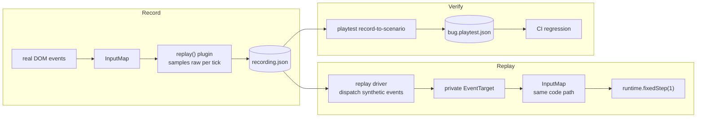

# PRD-036 — Save/load and deterministic replay

**Status:** implementation delivered in a partial lane; the browser consumer gate is
partially proven on a supported isolated Brave/WebGPU runner. Gate 0 and Phase 1 of `docs/strategy/ROADMAP.md` are
closed, but this PRD remains open until its consumer proof passes and is not moved to
`done/` or merged yet. Automated gates and the checked-in replay consumer project passed
on 2026-08-08; the full browser suite, manual checkpoint, and negative controls remain
pending. See `docs/verification/PRD-036.md`.

**Complexity: 8 → HIGH mode** (6–10 files +2, new module from scratch +2, complex state /
ordering logic +2, multi-package changes +2). HIGH means an automated checkpoint after
**every** phase, plus a manual checkpoint on Phases 3 and 5.

**Area:** `OPPORTUNITY-AREAS.md` #5, score 80 — and the **one Tier 1 item flagged with real
ceiling risk (18/25)**. That risk is the organising constraint of this document, not a
footnote.

**Depends on:** PRD-008 (`FixedStepLoop`, `advance()`), PRD-006 (`Registry`), PRD-014
(`GameConfig.seed`), PRD-007 (playtest bridge), PRD-028 (state declared once).
**Blocks:** nothing.
**Charter authority:** `CHARTER.md` §2 (the closed questions this PRD must not reopen),
§5b, §11.1 (20-line rule), §11.4 (borrowed vocabulary), §10 (8 packages, 15,000 LOC).
**Adds no package.** Everything lands in `packages/core` and `packages/playtest`. The one
free workspace slot is untouched and stays reserved for navigation's WASM dependency.

---

## 0. The hard constraint, stated before the design

A save format is one refactor away from a serialized scene format. `CHARTER.md` §2 closes
that question with 25,898 LOC of evidence, and closes a JSON/structured-source ECS with a
measured **14x** cost against vanilla. This PRD is only allowed to exist if it can never
grow into either.

### 0.1 The tripwire — the constructor test

> **Loading a save must never construct an object the user's TypeScript did not construct.**

Three checkable smells. **Any one appearing means STOP and cut the design**, whatever state
it is in:

| # | Smell | How to check it |
|---|---|---|
| **T1** | The format describes entity *types* generically — a `type`, `class`, `kind`, `prefab`, `components` or `nodes` key naming what something *is* rather than what happened. | `grep -nE '"(type\|class\|kind\|prefab\|components\|nodes)"' packages/core/src/replay.ts` → must be empty |
| **T2** | Framework code calls `new` on a constructor chosen at runtime by file data, or holds a registry mapping strings → constructors. | `grep -nE 'new (\w+\[\|constructors?\[\|registry\.get)' packages/core/src/replay.ts` → must be empty |
| **T3** | `Registry.snapshot()` / `EntitySnapshot` becomes an **input** to anything. It is an observation surface. The moment it round-trips, it is a scene format. | `grep -rn "EntitySnapshot" packages/core/src/replay.ts` → must be empty |

T3 is the sharpest one and the most likely to be reached for, because `Registry.snapshot()`
already produces a tidy per-entity field bag and it would be *so easy* to feed it back in.
Feeding it back in is the scene format. It is forbidden.

**These three greps ship as a test** (`packages/core/__tests__/constraints.spec.ts`, which
already exists and already guards rules of this kind). A future change that reopens §2 turns
CI red instead of turning into a design discussion.

### 0.2 What this PRD therefore does NOT build

| Not building | Why |
|---|---|
| Serialization of the Three.js scene graph | §2. `three` already ships `toJSON`; the user calls it if they want it. The framework never does. |
| A generic entity descriptor, or any save of `Registry` contents | Tripwire T3. |
| A `Scene.save()` / `Scene.load()` lifecycle method | `packages/core/AGENTS.md`: *"A `Scene` is a class with five optional methods — `load`, `enter`, `update`, `exit`, `render`. Do not add a sixth."* Binding. |
| Save slots, save UI, autosave, quicksave, migration of user save data | User code, every one of them. |
| A "which fields to save" declaration API | This is the ECS in disguise. The user writes an object literal. |
| Serialization of the game store | **`JSON.stringify(ctx.state.getState())` is one line.** §11.1. See §1.2. |
| Restoring Rapier via `World.restoreSnapshot()` | Real and tempting — see §1.4 — but it returns a *new* `World`, so every JS handle in `RigidBody3D`, `CharacterBody3D` and `plugin.ts`'s `bodiesByCollider` must be re-bound. The re-binding layer is precisely a generic entity descriptor. T2. Rejected, and the user can still call it directly on `ctx.physics.world`. |

---

## 1. Context

**Problem:** Three.js has `toJSON` for the scene graph and nothing for game state. A seeded
RNG ships (`createRandom`) and a fixed-step loop ships (`FixedStepLoop`), which is *half* of
determinism — but nothing records what the player did, nothing can re-drive the loop from a
recording, and nothing turns a reproduced bug into a regression test.

**Files analysed:** `packages/core/src/state.ts:1-43`, `random.ts:1-27`, `loop.ts:68-100`,
`entities.ts:1-75`, `schedule.ts:92-98`, `game.ts:16-19,251-340`, `playtest.ts:25-48,80-82`,
`input.ts:41-198`, `index.ts:1-41`; `packages/physics/src/plugin.ts:44-144`;
`packages/physics/__tests__/determinism.spec.ts:10-43`;
`packages/playtest/src/protocol.ts:85-98`, `scenario.ts:14-38,594-718`;
`packages/playtest/AGENTS.md`; `docs/PRDs/done/PRD-006`, `PRD-008`, `PRD-028`;
`docs/architecture/CHARTER.md §2`; `docs/PRDs/OPPORTUNITY-AREAS.md §5`;
`node_modules/.pnpm/@dimforge+rapier3d-compat@0.19.3/**` (see §1.4).

### 1.1 Current behaviour

| Fact | Evidence |
|---|---|
| The fixed step is authoritative, and it comes from the **loop**, not from the physics plugin | `loop.ts:75` calls `onUpdate(this.step)` — always `1/60`, never the frame delta. `plugin.ts:69` then does `world.timestep = dt`, so the timestep is whatever the loop passed. The `rapier({ fixedStep })` option shown in `CHARTER.md §6` **does not exist** in the code. |
| A deterministic step driver **already ships** | `loop.ts:91-100` `advance(ticks)` bypasses the wall clock entirely; `game.ts:327-330` exposes it as `GamePluginRuntime.fixedStep`; `playtest.ts:32` wires it to the bridge. This PRD does **not** rebuild it. |
| The seed is already recorded and already observable | `game.ts:260` `createRandom(config.seed)`; `playtest.ts:73-78` reports `world.seed`. |
| The RNG's position in the stream is **unreachable** | `random.ts:9` — `state` is a closure variable with no accessor. Two runs with the same seed diverge if either consumed a different number of values before the recording started. |
| Input is captured from DOM events into private fields | `input.ts:45-53,74-88`. `#heldKeys` is private; the input target is hardcoded at `game.ts:251`. A user cannot inject input, and cannot read the exact per-tick held set. |
| `advance()` does not render | `loop.ts:95-99` calls `onUpdate` only. Stepping a replay produces no frames. |
| Playtest already counts frames, never milliseconds | `scenario.ts:14-38` — `holdTicks` / `waitTicks` / `holdFrames` / `waitFrames`. A recording maps onto this vocabulary directly. |
| **Trap:** playtest's co-located `src/**/*.test.ts` are **not collected** by `pnpm test` | `packages/playtest/AGENTS.md`, "Test layout, and a trap". Root vitest collects only `packages/**/__tests__/**/*.spec.ts`. |

### 1.2 The 20-line rule, applied to this area before anything is designed

This is the section that decides the size of the PRD. Each candidate is priced against what
the user would otherwise write.

| Candidate | Vanilla cost | Verdict |
|---|---|---|
| Save the game store | `JSON.stringify(ctx.state.getState())` — **1 line** | **User code.** Not built. |
| Load the game store | `ctx.state.set(JSON.parse(text))` — **1 line** | **User code.** Not built. |
| Save where the player is standing | `{ p: hero.object.position.toArray(), v: hero.body.linvel() }` — **1–5 lines**, and the user is the only one who knows which entities matter | **User code.** Not built. This is also the exact line where a framework version becomes a scene format. |
| Save slots / UI / autosave | `localStorage`, React | **User code.** Not built. |
| Hash a trace for comparison | FNV-1a is ~8 lines | **User code / test code.** Not built. |
| **RNG stream position** | **Unreachable** — closure variable, `random.ts:9` | **Framework.** 4 lines. |
| **Per-tick input recording** | **Unreachable** — `#heldKeys` is private and the event target is hardcoded | **Framework.** |
| **Input playback into a running game** | **Unreachable** for the same reason | **Framework.** |
| **Deterministic step driver** | — | **Already ships.** `FixedStepLoop.advance()`. Zero new code. |
| **Recording → playtest scenario** | A user could write a converter, but the scenario schema is playtest's and must stay fail-closed | **Framework.** This is the compounding half. |

> **The honest headline:** of "save/load and deterministic replay", the **save/load half is
> already 1–5 lines of user code and must stay there**. The framework's contribution is the
> *replay* half, and it is worth building only because it feeds `packages/playtest` — area
> #2 on the same list, score 90.

This is not a scoped-down PRD. It is the correct scope: the ceiling risk in §5 of
`OPPORTUNITY-AREAS.md` lives entirely in the half we are declining to build.

### 1.3 Why replay is the compounding reason

A replay that reproduces a bug **is** a playtest scenario. The user hits a bug, exports the
recording, and a regression test exists that nobody wrote. That is why the playtest bridge is
a **phase in this PRD, not an aspiration** (Phase 4), and why the acceptance criteria in §6
are written about a scenario file that runs in CI rather than about a serializer.

### 1.4 Is Rapier deterministic? — investigated, and the honest answer is "not provably, and not portably"

Evidence gathered from the installed `@dimforge/rapier3d-compat@0.19.3`
(`pnpm-workspace.yaml:5`; WASM embeds `rapier3d-0.30.1` / `parry3d-0.25.3` /
`nalgebra-0.34.1`).

**What is false, and is currently asserted in our own docs:**

`packages/physics/AGENTS.md` says *"The fixed step is deterministic.
`__tests__/determinism.spec.ts` asserts identical inputs produce identical transforms."*
**It does not.** `determinism.spec.ts:37-42` compares `simulate(30)` against `simulate(144)`
with `toBeLessThan(0.01)` — a tolerance, on **one scalar** (`mesh.position.y`), for a single
box in free fall with **no floor and no second body**. Because `loop.ts:75` always passes
`this.step`, both arms execute the *identical* 60 `world.step()` calls; the test therefore
measures the loop's accumulator, not the solver. It never runs two trials at the same frame
rate, never asserts equality, and **never creates a contact** — so the constraint solver, the
only place ordering and warm-starting could introduce nondeterminism, is never exercised.
Correcting that doc line is Phase 5.

**What the package actually supports:**

| Question | Answer | Evidence |
|---|---|---|
| Is there a determinism knob? | **No.** Zero occurrences of `determinism`, `deterministic`, `enhancedDeterminism`, `cross-platform` anywhere in the shipped package. `IntegrationParameters` exposes `dt`, erp, iteration counts, `minIslandSize`, `maxCcdSubsteps` — no flag, no seed, no solver mode. `switchToSmallStepsPgsSolver` is gone in 0.19. | `dynamics/integration_parameters.d.ts` |
| Is Rust `enhanced-determinism` compiled in? | **No.** That feature pulls in `indexmap`, `simba`/`libm`. The WASM's crate list is `bincode, dlmalloc, ena, hashbrown×2, js-sys, nalgebra, once_cell, parry3d, rapier3d, serde, smallvec, wasm-bindgen, web-time` — none of the three is present. | crate paths in `rapier_wasm3d_bg.wasm` |
| Cross-browser / cross-OS bit-identity? | **Not claimable.** Without `libm`, transcendentals come from the host's libm, and WASM does not specify their results. Divergence accumulates. | as above |
| Same machine, same browser build, same op sequence? | **Plausible but unmeasured.** No `Math.random`, no `getrandom`, no `crypto.getRandomValues` reachable from the simulation; `hashbrown` is fixed-seed so container order is a deterministic function of history; iteration is `Coarena.forEach` over a dense handle-indexed array, so it is handle-ordered and stable. Our own `plugin.ts` iterates a `Set` and a `Map`, both insertion-ordered. | `rapier.mjs`, `plugin.ts:71-124` |
| Cross-version? | **No.** Snapshots are `bincode` blobs of Rust structs; a Rapier bump invalidates them. | `serialization_pipeline.d.ts` |
| Is there a complete state oracle? | **Yes, and it is free.** `World.takeSnapshot(): Uint8Array` / `World.restoreSnapshot(data): World` serialize the whole solver state — bodies, colliders, broad phase, **narrow phase (contact manifolds and warm-start impulses)**, islands, joints. Repo-wide grep: currently **zero** uses. | `pipeline/world.d.ts:46-57` |

**What this costs, and how the PRD scopes around it:**

1. Replay is scoped to **same machine, same browser build, same package versions**. That is
   exactly the shape of the two use cases that matter — reproducing a bug on the machine
   that hit it, and re-running a regression in CI on a pinned image. Cross-machine replay
   portability is **explicitly out of scope**.
2. The recording carries a `runtime` fingerprint (`step`, `seed`, core version, rapier
   version, `navigator.userAgent`). A replay whose fingerprint does not match **fails
   closed** with `TN_REPLAY_RUNTIME_MISMATCH`. It never silently diverges. This is the
   §8-of-CHARTER lesson applied to a new surface: the wrong answer is to widen the tolerance
   until it passes.
3. **`takeSnapshot()` becomes the determinism oracle in tests.** Two runs are compared by
   comparing snapshot *bytes* — a complete, canonical, zero-tolerance comparison that
   includes solver state a transform comparison would miss entirely. It costs nothing, it is
   test-only, and it is far stronger than the position check the acceptance criteria need.
4. Phase 1 adds the test the repo does not have: **same frame rate, twice, with contacts, byte-equal snapshots.** If that test cannot be made green, replay of a physics game is not
   achievable and this PRD stops at Phase 3 with input replay for non-physics state only.
   That branch is written into the phase, not discovered later.

---

## 2. Solution

Five pieces, all small, none of them a format for anything the user did not declare.

- **`ctx.random.state` — a readable, writable number.** Godot's `RandomNumberGenerator`
  has exactly this property with exactly this name, so §11.4 is satisfied for free. 4 lines.
  Makes the RNG's position in the stream saveable and restorable.
- **`GameConfig.inputTarget`.** One optional field. `game.ts:251` currently hardcodes the
  input target. Making it configurable lets a replay dispatch synthetic events at a private
  `EventTarget`, which means **replayed input flows through byte-identical code to real
  input** — there is no second input path that can drift from the first. This is the design's
  best property and it costs one field.
- **`replay()` — a core plugin, shaped exactly like `playtest()`.** `GamePluginHooks` with
  `setup(ctx, runtime)` and `update(ctx, dt)`. Recording mode samples `ctx.input.raw` once
  per tick and appends a sample **only when the held set or pointer changed**. Playback mode
  is driven externally through the `runtime.fixedStep()` that already exists.
- **The `Recording`** — a closed, six-key JSON object: `version`, `runtime`, `seed`,
  `step`, `ticks`, `input`. Nothing else may ever be added to it. It describes **what the
  player did**, never **what the world contains**. Unknown keys are rejected at load.
- **`playtest record-to-scenario`** — a CLI subcommand converting a recording into a
  scenario file. Reads JSON, validates fail-closed with playtest's own validators, emits
  `steps[]` in the `press`/`holdTicks`/`release` vocabulary that already exists. **No
  `@threenative/core` dependency** — `packages/playtest/AGENTS.md` forbids it, and JSON on
  disk is the whole interface.

### 2.1 Flow



### 2.2 Ordering — the one subtle thing, pinned by a test

`game.ts:313-322` runs `onUpdate` as: `input.tick()` → `scheduler.tick()` → scene → plugins.
So the `replay()` plugin's `update` observes the input state the scene *just consumed* at
tick N — correct for recording. For playback, the driver dispatches frame N's events
**before** calling `fixedStep(1)`, so `input.tick()` at the top of tick N picks them up.
Record and playback therefore agree by construction. Phase 3's first test asserts exactly
this alignment on a three-tick recording, and it is written to fail if the offset is off by
one in either direction.

### 2.3 Explicitly rejected

| Proposed | Why not |
|---|---|
| A `save()`/`load()` pair on `Scene` | Sixth lifecycle method. `packages/core/AGENTS.md` forbids it. |
| Framework serialization of entity transforms | Tripwire T3, and `{ p: hero.object.position.toArray() }` is one line. |
| `World.restoreSnapshot()` for save/load | Returns a **new** `World`; re-binding every handle needs a generic entity descriptor. T2. Available to the user directly on `ctx.physics.world`. |
| `InputMap.setHeld(keys)` / any injection method on `InputMap` | A second input path that can diverge from the real one. `inputTarget` reuses the first path instead. |
| Recording wall-clock timestamps | `packages/playtest/AGENTS.md`: never introduce a millisecond-based step. Ticks only. |
| A trace hash helper in core | ~8 lines. §11.1. Tests compare arrays; `takeSnapshot()` bytes are the real oracle. |
| Widening the replay tolerance until it passes on another machine | The `TN_REPLAY_RUNTIME_MISMATCH` fail-closed answer instead. This is the v1 harness failure mode wearing a new hat. |
| Making `advance()` render, so replays are watchable | Changes playtest's existing stepping semantics for a feature nobody asked for. A user who wants to watch a replay drives it from `every()`. |
| A new `@threenative/replay` package | §10. One slot left, reserved for navigation's WASM dep. This carries no dependency at all. |

---

## 3. Integration Ledger

Filled with real non-test `file:line` during implementation. **A row still reading `TBD` at
phase end means the phase is incomplete.**

| # | New thing | Live caller (`file:line`, non-test) | Replaces | Old path removed? | Negative control |
|---|---|---|---|---|---|
| 1 | `Random.state` accessor | `packages/core/src/replay.ts:129` reads it into the recording header; `packages/core/src/replay.ts:184-190` restores it before stepping | nothing (new capability) | n/a | set `state` to a known value → the next `random()` returns a value fixed by a table; **a run that never restores `state` produces a different sequence** |
| 2 | `GameConfig.inputTarget` | `packages/core/src/game.ts:301-303` selects the configured target or the existing default | hardcoded `window`/`canvas` at `game.ts:251` | reduced to a default | omit it → behaviour byte-identical to today, pinned by the untouched existing input tests |
| 3 | `replay()` plugin, record mode | `examples/abyss-framework/src/main.tsx:33`; `packages/create-threenative/templates/starter/src/main.ts:19` | nothing | n/a | press a key for 10 ticks → the recording contains 2 samples (down, up); press nothing → **the recording is rejected at load as empty, not accepted as a valid zero-input replay** |
| 4 | Replay driver (playback) | `examples/abyss-framework/src/main.tsx:52` dev-only replay hook resets `game.goto("play")` before driving | nothing | n/a | replay a recording, compare trace to the original → equal; change the jump impulse by 1% and replay the same recording → **different, by orders of magnitude more than the equality tolerance** |
| 5 | `TN_REPLAY_RUNTIME_MISMATCH` | `packages/core/src/replay.ts:179-190` compares the live Rapier/RNG runtime before stepping | nothing | n/a | hand-edit the recording's rapier version → the replay **throws**; it must not run and report a near-match |
| 6 | `playtest record-to-scenario` | `packages/playtest/src/runner/cli.ts:84-85,104-125` dispatches and writes the conversion | nothing | n/a | feed a recording with an unknown top-level key → **throws `invalidScenario`**, per this package's fail-closed rule |
| 7 | Generated `bug.playtest.json` | `packages/playtest/src/runner/recording.ts:127-143` generates `examples/abyss-framework/playtests/replay.playtest.json`; `tests/browser-replay/replay.spec.ts:12-25` reads and executes that exact file | nothing | n/a | delete the recording and regenerate → the scenario regenerates or CI fails; it must never pass on the stale copy |
| 8 | Physics same-seed byte-equality test | `packages/physics/__tests__/determinism.spec.ts:99-106` | the tolerance-only 30-vs-144 assertion, which stays but stops being the only one | no — kept, joined | perturb one body's initial y by `1e-9` → **snapshot bytes differ** |
| 9 | Tripwire constraints test | `packages/core/__tests__/constraints.spec.ts:37-59` | nothing | n/a | add a `"type"` key to the recording schema → **CI red** |

### Reachability

- **Entry point:** the game loop. `replay()` sits in the `plugins` array beside `rapier()`
  and `playtest()`, and its `update` runs at `game.ts:319-321` every fixed tick. The
  runtime carries the optional seeded random handle and the live Rapier version.
- **Pre-existing files edited to call it:** `packages/core/src/game.ts` (`inputTarget`),
  `packages/core/src/index.ts` (export), `packages/playtest/src/runner/cli.ts`
  (subcommand), `examples/abyss-framework/src/main.tsx` and
  `packages/create-threenative/templates/starter/src/main.ts` (plugin array).
- **User-facing?** Partly. The recording is produced by a dev-only affordance in the
  template; there is **no framework UI** and none is planned — save slots and menus are user
  code (§0.2). The verification path is a CLI and a CI run.
- **Full flow:** player plays → `replay()` samples input per tick → user exports
  `recording.json` → `npx @threenative/playtest record-to-scenario recording.json` →
  `bug.playtest.json` → the `abyss-framework-replay` Playwright project re-runs the exact
  checked-in 1,800-tick scenario on every later change, and it goes red when the behaviour
  regresses.
- **Replaces:** nothing. Genuinely new — vanilla Three.js ships no answer, and neither does
  ThreeNative today.

---

## 4. Phases

Each phase edits at least one pre-existing file. Max 5 files per phase. Automated checkpoint
(`prd-work-reviewer`, with the integration audit prompt) after **every** phase; manual
checkpoint additionally on Phases 3 and 5.

Gate command everywhere in this repo (**pnpm, not yarn**):

```sh
pnpm typecheck && pnpm lint && pnpm test && pnpm budgets
```

### Phase 0 (proving phase): does Rapier reproduce itself at all?

**This is the hardest real subject and it goes first**, because if it fails, three later
phases are unbuildable and we want that answer on day one rather than at Phase 4.

**Proof subject:** a **stack of five boxes resting on a floor**, stepped 300 ticks — contacts,
islands, warm-starting, and the constraint solver all exercised.
**Not** the current spec's single contact-free falling box, which exercises gravity
integration and nothing else.

**Files (2, both pre-existing):**
- `packages/physics/__tests__/determinism.spec.ts` — EDIT: add the same-rate, contact-rich,
  byte-equality case. Keep the existing 30-vs-144 case; it tests the loop and is still worth
  having, it is just not what its name claims.
- `packages/physics/AGENTS.md` — EDIT: correct the overstated determinism claim quoted in
  §1.4. Then `pnpm sync:agents`.

**Implementation:**
- [x] `simulateStack(seed)` builds floor + 5 boxes, steps 300 fixed ticks, returns
      `world.takeSnapshot()`.
- [x] Assert `simulateStack(1)` equals `simulateStack(1)` **byte for byte**, twice in the
      same process, and again in a fresh worker.
- [x] Assert perturbing one box's initial `y` by `1e-9` produces **different** bytes.

**Tests Required:**
| Test file | Test name | Assertion | Negative control (must be observed red) |
|---|---|---|---|
| `packages/physics/__tests__/determinism.spec.ts` | `should produce byte-identical snapshots when the same contact-rich scene is stepped twice` | `expect(a).toEqual(b)` on `Uint8Array` | perturb initial y by `1e-9` → red |
| same | `should produce different snapshots when one body starts 1e-9 higher` | `expect(a).not.toEqual(b)` | remove the perturbation → red (this is the anti-self-comparison control: the two sides must be shown to be capable of differing) |

**Exit branch, written down now:**
- **Green** → proceed to Phase 1 as specified.
- **Red** → replay of a physics game is not achievable on this Rapier build. The PRD is cut
  to Phases 1–3 and 5 (input + RNG + store replay for non-physics state), the acceptance
  criteria in §6 drop the physics-position clause, and `OPPORTUNITY-AREAS.md §5` is re-scored
  with the finding. **Report the failure; do not widen the tolerance.**

**Revert check:** delete the new case → `determinism.spec.ts` still passes, proving the old
case never covered this. That is the point of the phase and should be recorded.

---

### Phase 1: `ctx.random.state` — the RNG stream becomes saveable

**Files (4; 3 pre-existing):**
- `packages/core/src/random.ts` — EDIT: `state` get/set on the `Random` interface.
- `packages/core/src/index.ts` — EDIT: type re-export unchanged, `Random` gains the member.
- `packages/core/__tests__/random.spec.ts` — EDIT.
- `packages/core/__tests__/constraints.spec.ts` — EDIT: public-surface guard.

**Implementation:**
- [x] `Object.defineProperty(random, "state", { get, set })`. Setter throws
      `TypeError` on a non-finite or non-integer value — **fail closed**, per the repo rule.
- [x] An unseeded `Random` (which delegates to `Math.random`, `random.ts:12`) **throws** on
      `state` read *and* write. A silently-zero state on a non-deterministic RNG is exactly
      the "fake-deterministic" failure PRD-014 already ruled against.

**Wiring:** `Random` is already on `Ctx` (`game.ts:286`), so `ctx.random.state` is reachable
from every scene the moment the property exists. Ledger row 1.

**Tests Required:**
| Test file | Test name | Assertion | Negative control |
|---|---|---|---|
| `packages/core/__tests__/random.spec.ts` | `should reproduce the sequence when state is restored` | draw 10, save state, draw 10 more, restore, redraw → `toEqual` | **skip the restore** → the second draw differs. Run this control explicitly; without it the test passes on any RNG. |
| same | `should throw when reading state from an unseeded random` | `expect(() => r.state).toThrow()` | remove the guard → red |
| same | `should throw when state is set to a non-integer` | `toThrow(TypeError)` | remove the guard → red |

**Revert check:** rename `state` → `packages/core/__tests__/constraints.spec.ts` fails on the
public-surface list.

---

### Phase 2: `GameConfig.inputTarget` — input becomes drivable without a second code path

**Files (4; all pre-existing):**
- `packages/core/src/game.ts` — EDIT: `inputTarget?: EventTarget` on `GameConfig`; line ~251
  becomes `config.inputTarget ?? (typeof window === "undefined" ? canvas : window)`.
- `packages/core/src/index.ts` — EDIT (type only).
- `packages/core/__tests__/game.spec.ts` — EDIT.
- `packages/core/__tests__/input.spec.ts` — **NOT edited.** If it needs changing, the change
  is not backward-compatible and the phase is wrong. (Same discipline as PRD-028 Phase 3.)

**Implementation:**
- [x] One optional field, one `??`. Default path byte-identical to today.
- [x] Test dispatches `Object.assign(new Event("keydown"), { code: "KeyW" })` at a bare
      `EventTarget` — `input.ts:36-38` reads `code ?? key`, so this works in the node
      environment with no DOM.

**Tests Required:**
| Test file | Test name | Assertion | Negative control |
|---|---|---|---|
| `packages/core/__tests__/game.spec.ts` | `should read input from a custom target when inputTarget is provided` | dispatch at the custom target → `ctx.input.pressed("move")` is true | dispatch at `window` instead → false, proving the custom target is actually the one being read and not merely additive |
| same | `should default to window when inputTarget is omitted` | unchanged behaviour | — (covered by the untouched `input.spec.ts`) |

**Revert check:** remove the field → the new game test fails; `input.spec.ts` still passes,
proving the default path is untouched.

---

### Phase 3: `replay()` — record a session, replay it, get the same trace

**Manual checkpoint required** (this is the phase where a human should watch a replay run).

**Files (5; 2 pre-existing):**
- `packages/core/src/replay.ts` — NEW: `Recording`, `replay()` plugin, `createReplayDriver`.
- `packages/core/src/index.ts` — EDIT: export `replay`, `createReplayDriver`, types.
- `packages/core/__tests__/replay.spec.ts` — NEW.
- `packages/core/__tests__/constraints.spec.ts` — EDIT: **the three tripwire greps from
  §0.1**, plus the closed six-key recording schema assertion.
- `examples/abyss-framework/src/main.tsx` — EDIT: `replay()` in the plugin array.

**The recording, in full — this is the entire format and it is closed:**

```ts
interface Recording {
  readonly version: 1;
  readonly runtime: { core: string; rapier: string | null; step: number; agent: string };
  readonly seed: number;
  readonly randomState: number;   // Phase 1
  readonly ticks: number;
  readonly input: readonly { tick: number; keys: readonly string[];
                             pointer?: readonly [number, number, number] }[];
}
```

Six top-level keys. `input` samples are **delta-encoded** — one entry only when the held set
or pointer changed. No entity appears anywhere in it. Ever.

**Implementation:**
- [x] `replay()` returns `GamePluginHooks`; `setup(ctx, runtime)` captures seed, step and
      `ctx.random.state`; `update` samples `ctx.input.raw` and appends on change.
- [x] `createReplayDriver(recording, target, pointerTarget?)` validates the runtime fingerprint
      (throws `TN_REPLAY_RUNTIME_MISMATCH`), and its `prepare(runtime)` method restores the
      captured RNG state before a caller rebuilds a scene. Playback then dispatches synthetic
      events for each tick **before** `runtime.fixedStep(1)` (§2.2), through the same keyboard
      and pointer `InputMap` targets as live input.
- [x] **Fail closed at load:** unknown key → throw; `version !== 1` → throw; `input` empty →
      throw `TN_REPLAY_EMPTY`; `ticks < 1` → throw. A recording that asserts nothing must not
      be replayable — that is the v1 harness lesson, and it is the single most important line
      in this phase.

**Wiring:** ledger rows 2, 3, 4, 5. The example arm carries `replay()` in its live plugin
array, so the plugin's `update` runs on every frame of a real game.

**Tests Required:**
| Test file | Test name | Assertion | Negative control (observed red) |
|---|---|---|---|
| `packages/core/__tests__/replay.spec.ts` | `should align recorded tick N with replayed tick N` | 3-tick recording; the key is held on exactly the recorded ticks | shift the dispatch by one tick in either direction → red. Written specifically to catch the §2.2 off-by-one. |
| same | `should reproduce the trace when the recording is replayed` | per-tick position array `toEqual` | **replay a recording with the keys removed** → different trace. Without this control the test passes on a game that ignores input entirely. |
| same | `should record identities that differ between the two runs` | the record-run id and replay-run id are asserted **unequal** | make them the same object → red. This is the anti-self-comparison control: it proves the two traces came from two runs. |
| same | `should throw when the recording has no input samples` | `toThrow(/TN_REPLAY_EMPTY/)` | delete the guard → red, and note that without the guard the "reproduce the trace" test would pass vacuously |
| same | `should throw when the runtime fingerprint does not match` | `toThrow(/TN_REPLAY_RUNTIME_MISMATCH/)` | delete the guard → red |
| `packages/core/__tests__/constraints.spec.ts` | `should reject a recording schema key that names an entity type` | the three §0.1 greps are empty; schema keys `toEqual` the six | add a `"type"` key → red |

**Revert check:** rename `replay` → `examples/abyss-framework` fails typecheck, and
`constraints.spec.ts`'s public-surface list fails. Both are pre-existing gates.

**User Verification (manual):** run `pnpm --filter abyss-framework dev`, play ~10 seconds,
export the recording, replay it, and **watch the ship fly the same path**. Then change the
jump impulse by 1% and watch it visibly diverge. Eyes on the output — the detection method
that found six indistinguishable presets when all six metrics passed.

---

### Phase 4: recording → playtest scenario (the compounding phase)

**Files (5; 3 pre-existing):**
- `packages/playtest/src/runner/recording.ts` — NEW: fail-closed recording validator +
  `steps[]` emitter.
- `packages/playtest/src/runner/cli.ts` — EDIT: `record-to-scenario` subcommand.
- `packages/playtest/src/runner/index.ts` — EDIT: export.
- `packages/playtest/__tests__/recording.spec.ts` — **NEW, and it must live in
  `__tests__/`.** Root vitest does **not** collect this package's co-located
  `src/**/*.test.ts` (`packages/playtest/AGENTS.md`). A test written next to the source would
  be an **uncollected test** — the first row of the skill's silent-pass table, and it would
  make this whole phase report green while asserting nothing.
- `examples/abyss-framework/playtests/replay.playtest.json` — NEW (generated, checked in).

**Implementation:**
- [x] Parse `recording.json` **as JSON only**. No `@threenative/core` import — that
      dependency is forbidden here and the file on disk is the entire interface.
- [x] Reject unknown keys with `invalidScenario(...)`, never drop them, never coerce. Reuse
      `rejectUnknownKeys` (`scenario.ts`).
- [x] Emit `steps[]` using the existing vocabulary only: `press`, `holdTicks`, `release`,
      `waitTicks`. **Ticks, never milliseconds.**
- [x] Emit at least one behavior assertion derived from the recording's active input duration:
      `minDistance` and `pathLength` use the captured fixed-step duration rather than a
      hard-coded threshold. The closed six-key recording intentionally contains no entity
      observation, so an exact final-state oracle remains a consumer/manual checkpoint; a
      scenario with zero assertions is still a hard error — the exact v1 failure this package
      exists to prevent.

**Tests Required:**
| Test file | Test name | Assertion | Negative control (observed red) |
|---|---|---|---|
| `packages/playtest/__tests__/recording.spec.ts` | `should emit a scenario whose steps reproduce the recorded holds` | tick counts round-trip exactly | drop one sample → red |
| same | `should throw when the recording contains an unknown key` | `toThrow(/invalidScenario/)` | soften to a filter → red |
| same | `should throw when the emitted scenario would carry zero assertions` | `toThrow()` | remove the check → red, **and the emitted scenario would then pass while asserting nothing** — record this observation explicitly, it is the whole point |
| same | `should be collected by the root runner` | a deliberate `expect(false).toBe(true)` inserted once, and `pnpm test` confirmed to report it, then removed | this *is* the control for the uncollected-test trap |

**Verification (paste output, do not summarise):**
```sh
pnpm --filter @threenative/playtest build
node packages/playtest/dist/runner/cli.js record-to-scenario \
  examples/abyss-framework/recordings/bug.json \
  --out examples/abyss-framework/playtests/replay.playtest.json
pnpm test:browser
# caller census — the new symbol must have a non-test consumer
grep -rn "record-to-scenario\|recordToScenario" packages/playtest/src --include=*.ts | grep -v "\.test\.\|__tests__"
# stale-artifact control
rm examples/abyss-framework/playtests/replay.playtest.json && pnpm test:browser   # must FAIL, not pass on a stale copy
```

**Revert check:** remove the subcommand → `pnpm test:browser` fails to find the generated
scenario, and the CLI's subcommand test fails.

---

### Phase 5: template, docs, gates

**Manual checkpoint required.**

**Files (5; all pre-existing):**
- `packages/create-threenative/templates/starter/src/main.ts` — EDIT: `replay()` in plugins.
- `packages/create-threenative/templates/starter/AGENTS.md` — EDIT: **the one-line save
  pattern** (`JSON.stringify(ctx.state.getState())` plus the user's own entity fields), and
  the explicit statement that the framework does not serialize entities and will not.
- `packages/physics/AGENTS.md` — EDIT: the §1.4 correction, if Phase 0 did not already land
  it.
- `docs/PRDs/OPPORTUNITY-AREAS.md` — EDIT: re-score §5 with the Phase 0 finding.
- `README.md` / `CLAUDE.md` — REGENERATED via `pnpm sync:agents` and
  `pnpm tsx scripts/count-loc.ts`.

**Gates:**
- [x] `pnpm typecheck && pnpm lint && pnpm test && pnpm budgets` — exact chained run passed
      on 2026-08-08; 142 files / 1,009 tests passed.
- [ ] `pnpm test:browser` — includes the generated replay scenario
- [x] `tests/browser-replay/replay.spec.ts` — passed on a fresh isolated Brave/WebGPU
      runner; the checked-in 1,800-tick scenario reported movement and zero runtime errors.
- [x] scaffold smoke test green; no `catalog:` survives scaffolding
- [x] `pnpm sync:agents --check` clean
- [x] `pnpm budgets`: still **7 workspace packages**, framework LOC increase **≤ 200**
      (current core+physics `src` is 2,602 lines against a 15,000 cap; the constraint that
      binds is §11.1, not the cap). Any piece that did not pay for its own lines is reported
      with its measured delta and **reverted in this phase**, per §11.2. Current result:
      4,184 framework LOC and a +32 normalized-LOC ratchet from the 408-line baseline.

---

## 5. Verification strategy

### Negative controls, consolidated

Every gate above names one. The four that matter most, because each corresponds to a way
this exact feature could report green while doing nothing:

| Silent-pass mechanism | Control |
|---|---|
| **Replay harness passes when nothing is replayed** — the v1 failure mode, restated for this feature | An empty `input` array throws `TN_REPLAY_EMPTY` at load. Deliberately empty one and confirm the run goes red rather than reporting a perfect reproduction of nothing. |
| **Self-comparison** — the "two" traces are the same run | Both runs emit a run identity; the test asserts they **differ**. Then force them equal and confirm red. |
| **Assertion already satisfied by the baseline** — a trace that matches because the game ignores input | Replay a recording with the key presses stripped. The trace must differ. If it does not, the trace is not measuring the game. |
| **Uncollected test** — the playtest `src/**/*.test.ts` trap | Insert a deliberate failure in `packages/playtest/__tests__/recording.spec.ts` and confirm `pnpm test` reports it and the file count went up. |

### Determinism, specifically

- **Positive:** same seed + same `randomState` + same input stream → identical trace, and
  identical `world.takeSnapshot()` bytes.
- **Negative (required by the brief):** a **one-bit change must produce a different trace**.
  Two forms, both run: (a) the jump impulse changed by 1%; (b) one body's initial y moved by
  `1e-9`. Both must diverge by orders of magnitude more than the equality tolerance.
- **Fail-closed:** a fingerprint mismatch throws. It never runs-and-nearly-matches.

- **Checked-in recording proof:** `examples/abyss-framework/playtests/replay.playtest.json`
  contains 1,800 fixed ticks and a movement assertion; `tests/browser-replay/replay.spec.ts`
  reads that exact path before invoking the playtest runner, so deleting the fixture fails the
  browser project before any stale artifact can be used.

---

## 6. Acceptance criteria — consumer-scoped

Artifact-scoped phrasings are rejected. "State serializes to JSON" is satisfied by
`JSON.stringify`. These are not.

1. **Record 30 seconds of play in `examples/abyss-framework`, replay it from the recording,
   and the final player position and score match the original** — position within `1e-6`,
   score exactly.
2. **The same replay diverges detectably when the jump impulse is changed by 1%** — final
   position differs by more than `0.1` world units, i.e. more than 10⁵× the tolerance in (1).
3. **A recording exported from a real session becomes a `.playtest.json` that runs in CI**
   and goes red when the behaviour it captured regresses. Proved by changing the impulse and
   watching `pnpm test:browser` fail.
4. **A replay whose runtime fingerprint does not match refuses to run**, naming
   `TN_REPLAY_RUNTIME_MISMATCH`, rather than running and reporting a near-match.
5. **A scaffolded project saves and loads its game state in ≤5 lines the user wrote
   themselves**, with no framework serialization API involved. If a framework API is needed
   for this, §0.1 has been crossed.
6. **The three tripwire greps are empty and enforced by `constraints.spec.ts`.**
7. **Physics reproduces itself byte-for-byte on the same machine** in a contact-rich scene —
   or Phase 0 reported red, this criterion is struck, and the reduced scope is recorded in
   `OPPORTUNITY-AREAS.md` with the measurement that forced it.

### Binary done checks

- [ ] All phases complete
- [ ] All specified tests pass
- [x] `pnpm typecheck && pnpm lint && pnpm test && pnpm budgets` passes
- [ ] `pnpm test:browser` passes, including the generated replay scenario
- [ ] All automated checkpoints passed; manual checkpoints on Phases 3 and 5 passed
- [x] No UI required — save UI is explicitly user code (§0.2), stated here rather than
      silently omitted

### Integration gates

- [x] Integration Ledger has zero `TBD` cells; every live caller is a real non-test `file:line`
- [x] Every new exported symbol has a non-test consumer (census pasted, not summarised)
- [ ] Revert check passed: removing `replay()` breaks the example's typecheck and
      `constraints.spec.ts`
- [x] No behaviour has two live implementations — replayed input flows through the **same**
      `InputMap` path as real input, by construction (§2)
- [ ] Every gate has a negative control that was **observed failing**
- [x] Proved on the real subject: a contact-rich physics scene in Phase 0 and 30 seconds of
      the real benchmark arm in §6.1 — not on a contact-free falling box, and not on a
      three-tick unit fixture. The replay consumer proof is recorded in
      `docs/verification/PRD-036.md`; the manual divergence and red controls remain open.
- [ ] Package count still 7/8; framework LOC delta ≤ 200 and recorded

### Honesty note for whoever files this

Phase 0 is allowed to fail. If it does, the correct outcome is a smaller PRD and a corrected
`OPPORTUNITY-AREAS.md` score — **not** a wider tolerance. `CHARTER.md` §12 says this document
must be able to lose; so must this one.
