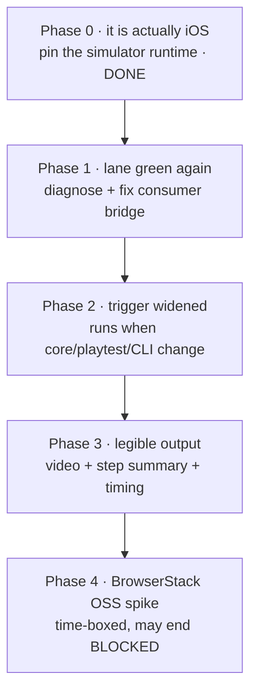

# PRD-065 — iOS evidence lane: repair the red consumer handoff, widen its trigger, and make its output legible

**Status: OPEN, filed 2026-08-10. Phase 0 landed the same day.** The iOS simulator lane exists,
is deeper than most proposals for one, and had two defects at once.

**The first is why this PRD's order changed: the lane was not running on iOS.**
`chooseSimulator()` flattened away the runtime key from `simctl list devices available --json`
and took the first device, which on `macos-15` is an **Apple Vision Pro**. Both the last green
run and the current red one recorded `"name": "Apple Vision Pro"` with a 2732×2048 screenshot
and no runtime field. Phase 0 fixes it, with the pre-fix selector observed red. **No macOS run
has executed since**, so the field evidence is UNVERIFIED, and **PRD-045 criterion 7 does not
close on the existing artifacts.**

The second is that the lane is **red on `main`**. Run
[`31434881982`](https://github.com/jonit-dev/threenative/actions/runs/31434881982) job
*iOS simulator runtime and no-Xcode consumer handoff*: step `Build and run the consumer app
without CMake, Xcodebuild, or Rust` exits `2` with `TN_PLAYTEST_BRIDGE_MISSING`, `frames: 0`,
scenario `native-physics-rest-collision`. The last green run of the job is
[`31313092745`](https://github.com/jonit-dev/threenative/actions/runs/31313092745),
2026-08-09.

**This PRD makes no mobile-readiness claim and does not attempt one.** Every phase runs on the
existing free GitHub-hosted `macos-15` runner. No Apple machine, no signing identity, no
provisioning profile, and no physical device is required by Phases 1–3. Phase 4 is a
time-boxed spike that is permitted to end in `BLOCKED`.

**Complexity: 6 → MEDIUM mode.**

**Blast radius: ~8 repository paths.** `.github/workflows/native-platforms.yml`,
`packages/runtime-native/scripts/verify-ios-simulator.mjs`,
`packages/runtime-native/tests/ios-contract.test.mjs`, `packages/create-threenative/src/build.ts`
or `packages/runtime-native/scripts/bundle.mjs` (whichever Phase 1 proves at fault),
`examples/native-smoke/`, `docs/verification/ios-<date>.md`,
`docs/PRDs/native/blocked/README.md`.

**Depends on:** PRD-045 (the iOS playtest transport, criteria 1–6 and 8 MET),
PRD-048 (`package-ios.mjs` distribution mechanics), PRD-054 (fail-closed parity),
PRD-064 (the Tier 1/Tier 2 split this PRD does not move). None is re-specified here.

**Never claim a platform you did not execute; the device matrix and performance parity rule apply.**
`docs/PRDs/native/blocked/README.md` owns what
counts as a physical-device unlock; **Phase 4 may propose a new unlock row but may not
declare one met.**

---

## 1. Why this exists

A proposal arrived recommending we build a `$0` iOS harness: GitHub Actions macOS runner →
Xcode `iphonesimulator` build → boot the real game on Apple's simulator → screenshots, video,
logs → artifacts → ✅/❌, with BrowserStack OSS later for real iPhones.

**We built that lane months ago, and it goes further than the proposal.** The gap is not
capability. It is that the lane is currently red, it does not run when the code that can break
it changes, and reading its result requires opening a 4,400-line log.

### What already exists (do not rebuild any of this)

| Proposed | Status in repo |
|---|---|
| Free macOS runner, public repo | ✅ `native-platforms.yml` job `ios-simulator`, `runs-on: macos-15`; repo is `PUBLIC` |
| Xcode → `iphonesimulator` build | ✅ CMake Xcode generator, `SIMULATORARM64`, `CODE_SIGNING_ALLOWED=NO`, `verify-ios-simulator.mjs:159` |
| Launch the actual TN game | ✅ `simctl install` + `simctl launch`, real `native-smoke` bundle inside the `.app` |
| Automated smoke sequence | ✅ far beyond a smoke: `TN_NATIVE_SMOKE_READY:webgpu` / `FIRST_FRAME` / `300_FRAMES:300`, **plus** 4 playtest scenarios with 3 negative controls, **plus** 5 native-physics controls including `wrong-gravity`, `masked` and `wrong-height` |
| Screenshot | ✅ `simulator-core.png`, **and** a blank-detector: `<320px` or luminance range `<12` throws (`verify-ios-simulator.mjs:124`) |
| Console / native logs | ✅ unified log capture; run fails on `GPUValidationError`, `TypeError`, `ReferenceError`, `FATAL` |
| `result.json` | ✅ `simulator-report.json` — sha256 of bundle and screenshot, simulator udid/runtime, every control's expected exit code |
| Artifacts | ✅ `native-ios-simulator` upload, `if-no-files-found: error` |
| Real-device path | ⚠️ implemented (`packages/playtest/src/runner/ios.ts:213`, `devicectl` transport) — **never executed**, PRD-056 |

### What is actually missing

| # | Gap | Evidence |
|---|---|---|
| 0 | **The lane was not testing iOS.** `chooseSimulator()` flattened `simctl list devices available --json`, discarding the runtime key, and took `devices[0]`. On `macos-15` that is an **Apple Vision Pro** (visionOS). Both the last green run and the current one recorded `"name": "Apple Vision Pro"`, a 2732×2048 screenshot, and **no `runtime` field at all** — simctl device objects carry no runtime, so nothing could catch it | `simulator-report.json` from runs `31313092745` (`e38439c`) and `31434881982` (`00cfad2`) |
| 1 | ~~**The lane is red.**~~ **RESOLVED, stale.** The consumer handoff failed `TN_PLAYTEST_BRIDGE_MISSING` at `frames: 0` at `00cfad2`, which predates `2e53c85`. The whole iOS job passes at current `main` | red: run `31434881982`; green: run `31446340434` |
| 2 | ~~**It does not run when it can break.**~~ **FIXED 2026-08-11.** Path filters removed; `ci.yml` now calls the lane on PRs into `main` and pushes to `main`. Also ends the duplicate push+pull_request double-run | was `.github/workflows/native-platforms.yml:4-14`; now `ci.yml` job `native-platforms` |
| 3 | **No video.** `grep -rn recordVideo` across `packages` and `scripts` → 0 hits | a still frame cannot show a hang, a flicker, or a one-frame-then-freeze |
| 4 | **No legible verdict.** `grep -rn GITHUB_STEP_SUMMARY .github/workflows/` → 0 hits | reading a result means opening the raw log |
| 5 | **No frame-timing diagnostic** | `300_FRAMES:300` proves the count, not that it took a plausible amount of time |
| 6 | **The blank-detector can pass on a blank app.** `validateScreenshot` measures luminance across the *whole frame*, including simulator chrome. The Vision Pro capture is a brightly-lit living room with the app as a small floating window — `luminanceRange: 251` came overwhelmingly from the room. A fully black app window inside it would still pass | `simulator-report.json` screenshot block; the capture itself, 2732×2048 |

Gap 2 is the one that costs the most: the lane's whole purpose is to catch a web-side change
breaking native, and a change to `packages/core`, `packages/playtest`,
`packages/create-threenative` or `examples/native-smoke` — every package the iOS app actually
bundles — skips it entirely. The current red is exactly that failure mode having already
happened.

### Explicitly out of scope

- **An fps *gate*.** The iOS simulator runs Metal on a virtualized host. A frame rate measured
  there is not a phone's frame rate, and publishing it as `fps.json` next to real gates would
  be the device-matrix rule exactly backwards. Phase 3 captures frame *timing* as a labelled
  diagnostic that cannot fail the build; `docs/product/PERFORMANCE-BUDGETS.md` and PRD-058
  keep sole ownership of performance numbers.
- **Any change to what PRD-056 counts as physical evidence.** Phase 4 investigates; it does
  not rule.

---

## 2. Solution



**Approach:**

- Phase 1 restores the lane before anything is added to it. A harness improvement layered on a
  red gate improves nothing.
- Phase 2 makes the gate reachable by the changes that break it.
- Phase 3 adds only output that fails closed: a video that must exist and be non-trivial, a
  summary derived from the report JSON rather than written as a literal.
- Phase 4 answers one question — can a real iPhone run this app for `$0` without an Apple
  identity — and is allowed to answer "no".

**Key decisions:**

- [ ] The step summary is **rendered from `simulator-report.json`**, never emitted as a
      hardcoded `✅`. A summary written by hand is the "manufactured evidence" anti-pattern.
- [ ] Video is captured with `xcrun simctl io <udid> recordVideo` (background process, `SIGINT`
      to finalize). No new dependency.
- [ ] Trigger widening uses `workflow_call` from `ci.yml` restricted to **PRs targeting `main`
      and pushes to `main`**, not every branch push. macOS runners are free on public repos,
      but a 24-minute job on every feature-branch push is still a bad trade.
- [ ] Frame timing is written to `simulator-report.json` under a key named
      `simulatorFrameTiming` with an inline `"notEvidenceOf": "device performance"` field. It
      never gates.

**Data changes:** `simulator-report.json` gains `video`, `simulatorFrameTiming`, and
`consumerHandoff` keys. `packages/runtime-native/tests/ios-contract.test.mjs` asserts the
shape.

---

## 3. Integration Ledger

| # | New thing | Live caller (`file:line`, non-test) | Replaces | Old path removed? | Negative control |
|---|-----------|-------------------------------------|----------|-------------------|------------------|
| 1 | Consumer-lane bridge fix | TBD — set in Phase 1 once the fault is located | the currently-broken consumer bundle path | n/a, repair | build the consumer with `THREENATIVE_PLAYTEST_BRIDGE=disabled` → must exit `2` with `TN_PLAYTEST_BRIDGE_MISSING` |
| 2 | `workflow_call` of `native-platforms.yml` | `.github/workflows/ci.yml:TBD` | path-only trigger | path filter kept for direct pushes | a commit touching only `packages/core/src` must schedule the iOS job; check `gh run list` for that SHA |
| 3 | `recordVideo` capture | `verify-ios-simulator.mjs:TBD`, before `simctl launch` | nothing | n/a, new | terminate the simulator mid-capture → the step must fail, not upload a 0-byte file |
| 4 | `writeStepSummary()` from the report | `.github/workflows/native-platforms.yml:TBD` | reading the raw log | n/a, new | force `verify-ios-simulator.mjs` to exit non-zero → summary must render ❌ and name the failed control |
| 5 | `simulatorFrameTiming` diagnostic | `verify-ios-simulator.mjs:TBD` | nothing | n/a, new | delete the frame markers from the bundle → the key must be absent or the run must fail, never `0` silently |
| 6 | BrowserStack spike record | `docs/verification/ios-browserstack-spike-<date>.md` | nothing | n/a, doc | n/a — a spike record states BLOCKED or PROVEN, never PASS |

**Rule for this PRD:** a row still reading `TBD` when its phase closes means the phase is
incomplete.

### Reachability

**How is this feature reached?** Entry point: GitHub Actions, both the path-filtered trigger
on `packages/runtime-native/**` and (new in Phase 2) `workflow_call` from `ci.yml`.
Pre-existing files edited: `.github/workflows/ci.yml`,
`.github/workflows/native-platforms.yml`, `packages/runtime-native/scripts/verify-ios-simulator.mjs`.

**User-facing?** No — this is a maintainer-facing gate. Its observable output is the PR checks
list and the run's step summary.

**Full flow:** a contributor opens a PR touching `packages/core` → `ci.yml` calls
`native-platforms.yml` → the iOS job builds the app and the scaffolded consumer, runs 12
scenarios and controls → writes `simulator-report.json`, a screenshot, a video and a log →
the summary step renders the verdict into the PR's checks view.

**What does this replace?** The path-only trigger, which is narrowed rather than deleted.

---

## 4. Execution phases

### Phase 0 — the lane actually runs on iOS — **DONE 2026-08-10, pending an executed run**

**Outcome:** the verifier can no longer record a non-iOS simulator as iOS evidence.

**Files:**

- `packages/runtime-native/scripts/select-ios-simulator.mjs` — NEW: runtime-keyed selection
- `packages/runtime-native/scripts/verify-ios-simulator.mjs:104` — EDIT: calls it, asserts the runtime
- `packages/runtime-native/tests/ios-contract.test.mjs` — EDIT: 5 new tests

**What was wrong:** `Object.values(parsed.devices).flat()[0]`. The map is keyed by runtime
identifier and the device objects carry no runtime of their own, so flattening both discarded
the only OS evidence and made `devices[0]` an arbitrary pick across visionOS, watchOS, tvOS and
iOS. `selected.runtime` was therefore `undefined` and `simulator-report.json` recorded no
runtime.

**Fix:** `selectIosSimulator()` keeps the runtime key, filters to `SimRuntime.iOS-*`, prefers a
booted device then an `iPhone`, then the newest iOS version, and **throws
`TN_IOS_SIMULATOR_ABSENT` when the host has no iOS runtime** rather than substituting one.
`assertIosRuntime()` rejects a non-iOS runtime at the point the report is built.

**Executed evidence (local, 2026-08-10):**

```text
vitest run --config vitest.config.ts tests/ios-contract.test.mjs   8 passed
pnpm lint                                                          394 files, no fixes
pnpm typecheck                                                     Done
```

**Negative control — observed red.** The pre-fix selector was restored in place and the suite
re-run:

```text
× the verifier selects through the pinned iOS selector, not a flattened device list
  AssertionError: The input did not match the regular expression /selectIosSimulator\(parsed\)/u
Test Files  1 failed (1)
```

The first test also pins the regression inline: it asserts that
`Object.values(devices).flat()[0].name === 'Apple Vision Pro'` on the real runner listing and
that the selector returns a different udid.

**Still open in this phase:** no macOS run has executed since the fix. **Until one does, the
report's `simulator.runtime` is unproven in the field**, and criterion 1 below is UNVERIFIED.

**Consequence for PRD-045 — do not close it.** Criterion 7 reads "the same scenario file passes
on the **iOS simulator**". Every control in `devicePlaytest` did produce its required exit code,
but on a **visionOS** simulator. That is not criterion 7, and the criterion's own instruction —
"do not soften the requirement to fit the hardware" — applies to this exactly. PRD-045 stays in
`native/blocked/`; the reason changes from "no Apple machine" to "the executed simulator was
not an iOS one". Re-evaluate after the first green post-fix run.

---

### Phase 1 — the iOS lane is green on `main` again

**Outcome:** the *iOS simulator runtime and no-Xcode consumer handoff* job passes on `main`.

**Files (max 5):**

- `.github/workflows/native-platforms.yml` — EDIT: whichever consumer step is at fault
- `packages/runtime-native/scripts/bundle.mjs` — EDIT (candidate): `configFile` /
  `define` merge for the consumer project at `bundle.mjs:227`
- `packages/create-threenative/src/build.ts` — EDIT (candidate): `bundleNative` at
  `build.ts:103`
- `examples/native-smoke/src/physics.ts` — EDIT (candidate): the `__TN_PLAYTEST_ENABLED__`
  gate at `physics.ts:360` and `gatedPlaytest` at `physics.ts:210`
- `packages/runtime-native/tests/ios-contract.test.mjs` — EDIT: pin the repaired contract

**Diagnosis first, and do not presume the cause.** Three candidates are consistent with
`TN_PLAYTEST_BRIDGE_MISSING` at `frames: 0`; the observed evidence does not yet distinguish
them:

1. The consumer's copied `vite.config.ts` `define` block (`__TN_PLAYTEST_ENABLED__`) is not
   reaching the bundle produced by `bundle.mjs`, so the bridge plugin is compiled out.
2. The define reaches it, `gatedPlaytest()` throws `TN_PHYSICS_PARITY_BRIDGE_MISSING` at
   startup, and the app dies before frame 0 — which would show as the runner seeing no bridge.
3. The app starts but the mailbox root the runner polls differs from the one the consumer app
   writes to.

**Implementation:**

- [ ] Re-run the job with the consumer app's unified log captured **and uploaded** even on the
      failing path — the current artifact set does not include it for this step
- [ ] Identify which of the three (or a fourth) is true, and record the distinguishing
      observation in `docs/verification/ios-<date>.md`
- [ ] Fix the located fault; do not add a workaround in the workflow if the fault is in a
      package

**Wiring:**

- [ ] Caller edited: the consumer step in `native-platforms.yml`, or the package file at fault
- [ ] Ledger row 1 filled with the real `file:line`

**Tests:**

| Test file | Test name | Assertion | Negative control (must be observed red) |
|---|---|---|---|
| `packages/runtime-native/tests/ios-contract.test.mjs` | `should require the playtest bridge in a scaffolded consumer bundle` | the consumer bundle contains the bridge install site | passes only after the fix; fails at the current `main` commit |
| workflow, in-lane | `consumer-physics-pass` | exit `0`, `"pass": true` | build with `THREENATIVE_PLAYTEST_BRIDGE=disabled` → exit `2`, `TN_PLAYTEST_BRIDGE_MISSING`. **This control does not exist in the consumer lane today** — `verify-ios-simulator.mjs:240` has it only for the in-repo app. Add it. |

**Revert check:** revert the Phase 1 fix → `consumer-physics-pass` returns to exit `2`.

**Estimate:** half a day. The iteration loop is a ~24-minute CI run on `macos-15`; budget 4–6
runs. This cannot be shortened locally — there is no Apple hardware on this machine
(`docs/PRDs/native/blocked/README.md`, standing block 2026-08-08).

---

### Phase 2 — the lane runs when the code it guards changes

**Outcome:** a PR touching only `packages/core/src` schedules the iOS job.

**Files:**

- `.github/workflows/ci.yml` — EDIT: add a job that `uses: ./.github/workflows/native-platforms.yml`
- `.github/workflows/native-platforms.yml` — EDIT: widen `paths` to include
  `packages/core/**`, `packages/playtest/**`, `packages/create-threenative/**`,
  `examples/native-smoke/**`

**Implementation — DONE 2026-08-11:**

- [x] `native-platforms.yml` triggers reduced to `workflow_dispatch` + `workflow_call`. The
      path filter is gone; ci.yml owns when the lane runs.
- [x] `ci.yml` gains a `native-platforms` job, `needs: test`, gated
      `(push && ref == refs/heads/main) || (pull_request && base_ref == main)`.
- [x] `needs: test` keeps 24 minutes of macOS from running behind a red unit suite.

**A second defect fixed in passing:** the old config listed both `push:` and `pull_request:`
with the same paths, so every PR ran the entire matrix **twice** — visible in runs
`31446318261` and `31446340434`, and again in `31447447040` and `31447449669`. One call site
means one run.

**Observable control.** `native-platforms.yml` no longer has `push` or `pull_request`
triggers, so it cannot start on its own. After this change the matrix appears as
`native-platforms / <job>` inside the CI run, and **no standalone "Native platform evidence"
workflow run exists** — that absence is the proof the path trigger is gone rather than merely
widened. A core-only change reaching the lane is criterion 4 and needs one such commit on
`main` to record; it is not claimed until then.

**Wiring:** `ci.yml` gains a real job entry. Ledger row 2 filled.

**Tests:**

| Test file | Test name | Assertion | Negative control |
|---|---|---|---|
| n/a — workflow behaviour | iOS job scheduled by a core-only change | `gh run list --workflow=native-platforms.yml` lists a run for a SHA touching only `packages/core/src` | before the change, the same one-file commit schedules **no** run. Record both `gh run list` outputs. |

**Revert check:** revert the trigger change → the core-only commit stops scheduling the job.

**Estimate:** 30 minutes plus one confirming run.

---

### Phase 3 — the result is readable without opening the log

**Outcome:** a maintainer sees ✅/❌ with the failing control named, and can watch the run.

**Files:**

- `packages/runtime-native/scripts/verify-ios-simulator.mjs` — EDIT: `recordVideo` around the
  launch, `simulatorFrameTiming` from the existing log markers, both into the report
- `.github/workflows/native-platforms.yml` — EDIT: render `$GITHUB_STEP_SUMMARY` from
  `simulator-report.json`, upload the video
- `packages/runtime-native/tests/ios-contract.test.mjs` — EDIT: assert the three new report keys

**Implementation:**

- [ ] `xcrun simctl io <udid> recordVideo --codec h264 <path>` as a background child; `SIGINT`
      to finalize; **fail the run if the file is missing or under a plausible byte floor**
- [ ] Derive `simulatorFrameTiming` from the timestamps of `TN_NATIVE_SMOKE_FIRST_FRAME` and
      `TN_NATIVE_SMOKE_300_FRAMES:300` in the unified log. Write it with
      `"notEvidenceOf": "device performance"` inline. **It never gates.**
- [ ] The summary step reads the report and prints one line per control with its observed exit
      code. It must render ❌ when `pass` is `false`, including when the report is absent.

**Wiring:** the summary step is a real workflow step; the video is a real artifact path.
Ledger rows 3, 4, 5 filled.

**Tests:**

| Test file | Test name | Assertion | Negative control (must be observed red) |
|---|---|---|---|
| `tests/ios-contract.test.mjs` | `should reject a report without video, timing, and consumer keys` | throws on a report missing any of the three | feed the pre-Phase-3 report shape → must throw |
| workflow, in-lane | video is non-trivial | file exists and exceeds the byte floor | kill the simulator mid-capture → step fails; a 0-byte upload must not pass |
| workflow, in-lane | summary reflects failure | with the report deleted, the summary renders ❌ | delete `simulator-report.json` before the summary step → ❌, never ✅ |

**Revert check:** delete the summary step → nothing in the checks view names the failing
control; the contract test for the report keys fails.

**Estimate:** 2 hours plus 2 confirming runs.

---

### Phase 4 — BrowserStack OSS real-device spike (time-boxed, may end BLOCKED)

**Outcome:** a written answer to one question, not a new gate.

> Can a ThreeNative iOS app run on a **physical iPhone** at `$0`, from this machine, with no
> Apple Developer Program membership, no signing identity, and no provisioning profile?

**Files:**

- `docs/verification/ios-browserstack-spike-<date>.md` — NEW
- `docs/PRDs/native/blocked/README.md` — EDIT: add or reject a cloud-device unlock row

**Implementation:**

- [ ] Establish whether a device (`aarch64-apple-ios`, not `-sim`) build is even producible by
      the current CMake toolchain. **The repo has only ever built the simulator arch** — this
      may be the real blocker, ahead of anything about BrowserStack.
- [ ] Determine whether BrowserStack App Automate accepts an **unsigned** `.ipa`. Their
      re-signing documentation confirms they re-sign uploads; it does not state that an
      entirely unsigned device build is accepted. **Treat this as unknown until observed.**
- [ ] Applying to the BrowserStack Open Source programme is an **owner action** — it needs an
      identity and an approval turnaround this lane does not control. Record it as a request,
      not a step.
- [ ] If either sub-question resolves negative, write `BLOCKED` with the exact prerequisite and
      stop. Do not soften PRD-056.

**Wiring:** the spike record is the deliverable. If it resolves positive, a follow-up PRD owns
the lane; **this PRD does not build it.**

**Revert check:** n/a — no code path is added by a negative spike.

**Estimate:** 2–3 hours of investigation, plus owner-controlled application latency measured in
days.

---

## 5. Checkpoint protocol

Automated checkpoint after every phase — spawn `prd-work-reviewer` with the standard
integration audit, plus these lane-specific items:

1. Was the gate observed red before it was recorded green? Paste the red run URL.
2. Does any new number in `simulator-report.json` read as a performance claim without its
   `notEvidenceOf` label?
3. Does any wording in the summary, the report or the docs claim iOS beyond "builds, installs,
   launches and passes its scenarios on the arm64 simulator"?

Manual checkpoint additionally required for Phase 3 (visual artifact) and Phase 4 (external
service).

---

## 6. Acceptance criteria

Consumer-scoped. Each is checkable only by a run that a maintainer could not confuse with the
previous state.

1. [ ] **`simulator-report.json` names an `iOS` runtime and an iPhone**, from an executed
       `macos-15` run. A report whose `simulator.runtime` is absent, or names `xrOS`, `watchOS`
       or `tvOS`, fails this criterion however green the scenarios were.
2. [ ] **The iOS job is green on `main`**, including `consumer-physics-pass`, with the run URL
       recorded. A green *in-repo* app with a red consumer lane does not satisfy this.
3. [ ] **A consumer built with the bridge disabled fails the lane** with exit `2` and
       `TN_PLAYTEST_BRIDGE_MISSING` — the control observed red, in the consumer lane, not only
       in the in-repo lane.
4. [ ] **A pull request whose only change is inside `packages/core/src` shows the iOS check in
       its checks list.** Two `gh run list` outputs recorded: before (absent) and after
       (present).
5. [ ] **A maintainer can watch the game run** — the artifact contains a video that plays and
       shows the scene animating, and the run fails if that file is missing or trivially small.
6. [ ] **A maintainer reading only the run's summary knows which control failed** — verified by
       forcing a failure and reading the rendered ❌ summary, not by reading the code that
       writes it.
7. [ ] **The frame-timing diagnostic cannot fail a build and is labelled as not device
       evidence**, verified by making it implausible and observing the run still pass.
8. [ ] **The BrowserStack question is answered in writing** as PROVEN or BLOCKED with the exact
       missing prerequisite. `docs/PRDs/native/blocked/README.md` reflects the answer.

**Integration gates:**

- [ ] Integration Ledger has zero `TBD` cells
- [ ] Every gate has an observed negative control, each with its red run URL
- [ ] Revert check passed for Phases 1–3
- [ ] No phase added a file without editing a pre-existing one

**Not claimed by this PRD, at any phase:** iOS device readiness, mobile readiness, iOS
performance, or any movement of PRD-056 out of `native/blocked/`.

---

## 7. Verification evidence

*(filled during implementation — a criterion above without a run URL here is UNVERIFIED, not
PASS)*

| Criterion | Run URL | Green | Control observed red |
|---|---|---|---|
| 1 | [31446340434](https://github.com/jonit-dev/threenative/actions/runs/31446340434) | **MET** — `iPhone 17 Pro`, `SimRuntime.iOS-26-2`, 1206×2622 | local: pre-fix selector restored → `× the verifier selects through the pinned iOS selector` |
| 2 | [31446340434](https://github.com/jonit-dev/threenative/actions/runs/31446340434) | **MET** — the whole iOS job succeeded, consumer handoff included | pending: the consumer lane still has no bridge-disabled control |
| 2 | | | |
| 3 | | | |
| 4 | | | |
| 5 | | | |
| 6 | | | |
| 7 | | | |
| 8 | | | |
