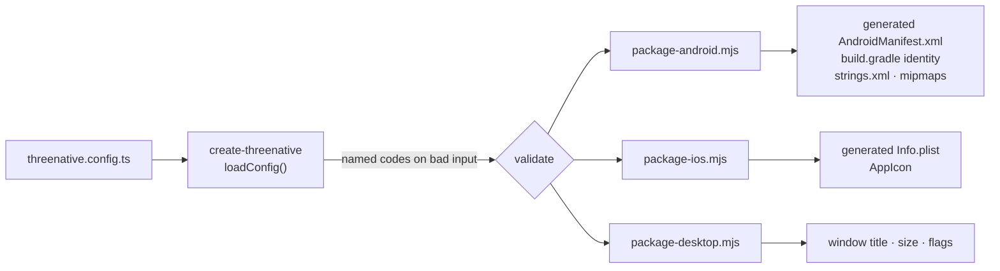

# PRD-067 — One config file: a game declares its app shape without touching native source

**Status: DEFECTS REPRODUCED, 2026-08-10. NOT STARTED.** The orientation half was observed on
a Pixel 8 (`shiba`, serial `37251FDJH0037Z`, arm64-v8a, Android 17, physical display
1080×2400). The identity half is readable straight out of the tracked native sources listed in
§1 and needs no device to confirm. Split out of PRD-066, which owns frame rate and explicitly
does not own this.

**Complexity: 7 → HIGH mode.** A config file that is shipped but never read, a loader that has
to exist before anything else can use it, two packagers that currently emit hand-authored
identity, an icon path, and a device proof.

**Blast radius: ~12 repository paths.**
`packages/create-threenative/src/build.ts`, `packages/create-threenative/src/config.ts` (new),
`packages/create-threenative/templates/*/threenative.config.ts`,
`packages/create-threenative/templates/*/AGENTS.md`,
`packages/runtime-native/scripts/package-android.mjs`,
`packages/runtime-native/scripts/package-ios.mjs`,
`packages/runtime-native/scripts/package-desktop.mjs`,
`packages/runtime-native/android/app/build.gradle.kts`,
`packages/runtime-native/android/app/src/main/AndroidManifest.xml`,
`packages/runtime-native/android/app/src/main/res/values/strings.xml`,
`packages/runtime-native/ios/Info.plist`,
`packages/runtime-native/docs/G3-mobile-bring-up.md`, `packages/runtime-native/tests/`.

## 1. Why this exists

Everything that makes a build *this game's app* rather than *the framework's demo* is
hard-coded inside `@threenative/runtime-native`. A game has no way to say any of it, and the
only workaround is editing framework source a consumer does not own and cannot keep across an
upgrade. That is exactly the plumbing the framework promised to ship so no game writes it.

Read straight off the tracked files:

| What a game cannot say | Where it is frozen today | Value every ThreeNative game gets |
|---|---|---|
| App identifier | `android/app/build.gradle.kts:157` | `com.mystral.engine` |
| App name on the launcher | `android/app/src/main/res/values/strings.xml` | `Mystral` |
| App name on iOS | `ios/Info.plist` `CFBundleDisplayName` | `ThreeNative` |
| Version and build number | `build.gradle.kts:160`, `Info.plist` | `0.1.0` / `1` |
| Orientation | `AndroidManifest.xml:35`, `Info.plist` `UISupportedInterfaceOrientations` | landscape |
| Icon | nowhere — no mipmap or asset catalog entry exists | the Android default |

**The identifier is the worst of these.** Every game built by every user shares
`applicationId = "com.mystral.engine"`. Two ThreeNative games cannot be installed on the same
device — the second replaces the first — and no build can ever be published, because the
identifier is not the publisher's. This is not a polish item; it is a shipped product that
cannot ship.

### What orientation does to a running game

On the Pixel 8 with auto-rotate off and the display physically portrait, the game was told the
wrong screen:

```
I MystralRuntime: ANativeWindow validated: (2400x1080)
I MystralJS: [log] TN_PROBE_VIEWPORT 2400x1080
```

The physical display is 1080×2400. Two consequences, both visible in the captured screenshot
`~/projects/fox-native/artifacts/probe/pixel8-baseline.png`:

1. **Camera aspect is inverted.** The perspective camera is built for 2.22:1 and presented at
   0.45:1, so the player character sits off in a corner instead of framed.
2. **Every pixel-space HUD coordinate is wrong.** Pointer coordinates arrive in the same
   2400×1080 space — an injected touch at screen (250, 2000) was delivered to the game as
   (556, 900), consistent with normalising by the swapped dimensions. Hit-testing is therefore
   self-consistent but the on-screen controls are drawn stretched: a circular stick renders as
   an ellipse and the buttons crowd the edges.

Touch delivery itself works. This is a framing defect, not an input defect.

### The config file that is shipped and never read

Every template ships `threenative.config.ts`:

```ts
export default {
  renderer: { preferWebGPU: true },
};
```

Each template's `AGENTS.md` draws it into the project diagram as "renderer + plugins". **No
loader for it exists anywhere in `packages/*/src`** — `grep -rn "threenative.config"` finds
only the scaffold test's path list and those four diagrams. `renderer.preferWebGPU` is
therefore a value a user can set that changes nothing, which is the same class of defect as an
option a backend accepts and discards.

Meanwhile the one native setting that *is* read lives somewhere else entirely — a `threenative`
block in `package.json`, parsed at `build.ts:86` for `nativeEntry`. So the project has two
config surfaces, one dead and one undocumented.

## 2. Solution

**`threenative.config.ts` becomes the one file a game edits to shape its app**, and the
packagers generate every native identity file from it instead of shipping hand-authored ones.

```ts
import type { ThreeNativeConfig } from "@threenative/core";

export default {
  app: {
    id: "com.studio.foxgame",
    name: "Fox",
    version: "1.0.0",
    build: 1,
    icon: "assets/icon.png",
  },
  display: {
    orientation: "landscape",   // "landscape" | "portrait" | "sensor"
    fullscreen: true,
    keepScreenOn: true,
  },
  window: {                     // desktop only
    title: "Fox",
    width: 1280,
    height: 720,
    resizable: true,
  },
  nativeEntry: "src/game.ts",
  renderer: { preferWebGPU: true },
} satisfies ThreeNativeConfig;
```

Five groups, chosen because each one is currently impossible to set without editing framework
source, and no more:

1. **`app`** — identity. Fixes the shared-identifier defect and the `Mystral` launcher label.
2. **`display.orientation`** — the reproduced framing defect.
3. **`display.fullscreen` / `keepScreenOn`** — a game that dims mid-play or loses the screen to
   a status bar is broken on mobile in a way no game code can repair.
4. **`window`** — the desktop equivalent, so the field set is not mobile-only.
5. **`icon`** — one source PNG. Without it every shipped game is the Android default robot.

**Everything else stays out.** Permissions, splash screens, signing, deep links, locales,
`minSdk`/`targetSdk` overrides: each is a real request and none is blocking a build today.
Adding them speculatively is the option-nobody-asked-for failure. §6 records them as deferred
so the next person does not re-derive the list.

### Loading a TypeScript config

`create-threenative` has no runtime dependencies, so reading a `.ts` file needs a transpiler.
Resolve `esbuild` **from the project**, the same way `packageRoot()` at `build.ts:21` already
resolves `@threenative/runtime-native`: transform to a temporary `.mjs`, dynamic-import it,
delete it. Every template depends on Vite, and Vite depends on esbuild, so it is present in
every scaffolded project.

That is a transitive dependency, and it is the one genuinely uncertain piece of this PRD. The
scaffold smoke job in `.github/workflows/ci.yml` already generates and installs a real project,
so it is the place that proves resolution works rather than assuming it. **If resolution proves
fragile, fall back to a JSON `threenative` block in `package.json`** — losing type-checking and
the import of `ThreeNativeConfig`, keeping everything else in this PRD unchanged. Do not ship
both.

### Precedence, and the surface that dies

`threenative.config.ts` is the source of truth. `package.json`'s `threenative.nativeEntry`
keeps working, because projects exist that use it, but declaring the entry in both files throws
`TN_CONFIG_CONFLICT` rather than silently picking one. `renderer.preferWebGPU` either gets
wired to something real in this PRD or is deleted from all seven templates — it does not stay
as a field that reads well and does nothing.

**Fail closed.** Every unrecognised value, malformed group, and missing icon file throws at
build time with a named code, in the shape of the existing `TN_NATIVE_ENTRY_MISSING`. Accepting
a value and discarding it becomes a platform-specific gameplay bug, which is the failure mode
the native rules exist to prevent.

**Defaults preserve today's behaviour.** Absent `display.orientation` is `landscape`; absent
`app.id` derives from the package name; absent `app.name` is the package name; absent icon
leaves the platform default. An existing project that adds nothing builds byte-comparably,
except for identity fields that were never legitimately shareable.

**iOS is not optional.** A field that means something on Android and nothing on iOS is a fork.
Every group routes through `package-ios.mjs` in the same phase it routes through
`package-android.mjs`. No Apple hardware is attached here; the iOS half is claimed only as far
as the hosted `macos-15` simulator lane executes it.

### How the value reaches each platform



**Icons carry no image dependency.** The user supplies one square PNG (1024×1024
recommended). Android gets it written to `mipmap-xxxhdpi` and downscales at runtime; iOS gets
it written to the asset catalog slot the simulator host already reads. If a later PRD wants
per-density crispness it can add resizing then — adding an image library now to save one
downscale is not worth the dependency.

## 3. Execution phases

### Phase 1 — the loader, and the dead surface resolved

- New `packages/create-threenative/src/config.ts` — `loadConfig(cwd)`: transpile
  `threenative.config.ts` via project-resolved esbuild, import it, validate, return a typed
  object with defaults applied. No file present is valid and yields all defaults.
- Export a `ThreeNativeConfig` type the template can `satisfies`.
- `build.ts` reads `nativeEntry` from the loaded config; `package.json`'s block remains a
  fallback and both-declared throws `TN_CONFIG_CONFLICT`.
- Decide `renderer.preferWebGPU`: wire it or delete it from all seven templates. Record which.
- Tests: each group parses; each invalid value throws its named code; absent file yields
  documented defaults; conflict throws.

### Phase 2 — Android generates what it currently hard-codes

- `package-android.mjs` writes `AndroidManifest.xml` (`screenOrientation`), `strings.xml`
  (`app_name`), gradle identity properties (`applicationId`, `versionName`, `versionCode`), and
  the mipmap icon, from the loaded config.
- `AndroidManifest.xml`, `strings.xml`, `build.gradle.kts` stop carrying game-specific values.
- Fullscreen and `keepScreenOn` reach the activity — via theme/manifest where possible, via an
  SDL hint in the runtime where not. Name which, in the PRD, before writing it.
- Tests assert on the **packaged** artifact, never on the template: unzip the APK, read the
  binary manifest and the resources, compare against the declared config.

### Phase 3 — iOS parity

- `package-ios.mjs` writes `Info.plist` (`CFBundleIdentifier`, `CFBundleDisplayName`,
  `CFBundleShortVersionString`, `CFBundleVersion`, `UISupportedInterfaceOrientations`) and the
  app icon from the same loaded config.
- Tests assert on the staged `.app`, matching the Android assertions field for field, so a
  group added to one platform and forgotten on the other fails.

### Phase 4 — desktop window

- `package-desktop.mjs` and the runtime honour `window.title`, `width`, `height`, `resizable`.
- `pnpm native:verify:desktop` asserts the created window matches the declared values.

### Phase 5 — prove it on the device

- Build `fox-native` at `portrait` and at `landscape`, install both on `37251FDJH0037Z`, and
  assert the reported viewport matches the declared orientation in each — the direct inverse of
  the `TN_PROBE_VIEWPORT 2400x1080` observation above. Screenshot per orientation.
- Install two builds that differ only in `app.id` and assert **both** appear in the launcher
  with their own names and icons. That single assertion is the whole identity half of this PRD.
- Run it on the local emulator first; use CI only for what cannot run locally.

### Phase 6 — the templates teach it, and the record closes

- All seven `threenative.config.ts` files ship the full shape with real values and a comment per
  group, because the scaffold is the documentation and a model learns the API from that file.
- Template `AGENTS.md`/`CLAUDE.md`: the diagram node stops saying "renderer + plugins" and says
  what the file actually controls. `pnpm sync:agents`.
- `packages/runtime-native/docs/G3-mobile-bring-up.md` — close the portrait/landscape framing
  row with the device result, and state plainly how far the iOS half executed.

## 4. Acceptance criteria

- [ ] A game sets identity, orientation, display and window without editing any file under
      `@threenative/*`.
- [ ] Two builds differing only in `app.id` install side by side on `37251FDJH0037Z`, each
      showing its own launcher name and icon; screenshot proves it.
- [ ] On `37251FDJH0037Z`, a `portrait` build reports a portrait viewport and a `landscape`
      build reports a landscape one, with a screenshot for each.
- [ ] No tracked file under `packages/runtime-native/` carries a game-specific identity value; a
      test greps for `com.mystral.engine` and the `Mystral` label and fails if either survives
      outside a default.
- [ ] Every invalid value fails the build with a named code, one test per code.
- [ ] A project that declares nothing builds with today's behaviour on all three targets.
- [ ] Every group asserted on the packaged Android artifact is asserted on the staged iOS one.
- [ ] `threenative.config.ts` has exactly one loader and `package.json` has no second config
      surface beyond the `nativeEntry` fallback; `renderer.preferWebGPU` is wired or gone.
- [ ] `pnpm typecheck && pnpm lint && pnpm test && pnpm budgets` passes.

## 5. Negative controls

| Control | Change | Expected |
|---|---|---|
| `bad-orientation` | `orientation: "sideways"` | build throws the named code |
| `bad-id` | `app.id: "Fox Game"` | throws; not a valid reverse-DNS identifier |
| `missing-icon` | `icon` points at a path that does not exist | throws, never silently skips |
| `no-config` | delete `threenative.config.ts` | today's behaviour, all defaults |
| `both-entries` | `nativeEntry` in config **and** `package.json` | `TN_CONFIG_CONFLICT` |
| `manifest-drift` | hand-edit the manifest or `strings.xml` in the runtime | packaged artifact still follows the config |
| `ios-forgot` | route a group to Android only | the paired iOS assertion fails |
| `device-mismatch` | declare portrait, assert landscape viewport | Phase 5 assertion fails |

## 6. Out of scope

- Frame rate — PRD-066.
- Runtime orientation changes mid-session. This declares orientation at build time only. A
  resize path that survives rotation is a separate question and must not be smuggled in.
- **Deferred config groups**, recorded so the list is not re-derived: Android permissions
  beyond `INTERNET`, splash screens, release signing and store metadata, deep links and URL
  schemes, localisation of the app name, `minSdk`/`targetSdk` overrides, per-density icon
  generation, adaptive-icon foreground/background layers.
- 16 KB page alignment of the shipped `.so` files — unowned, needs its own PRD.
- Anything a screenshot shows. Lighting, materials and post stay generated source in the user's
  `src/render/`; none of it becomes a config key here.
