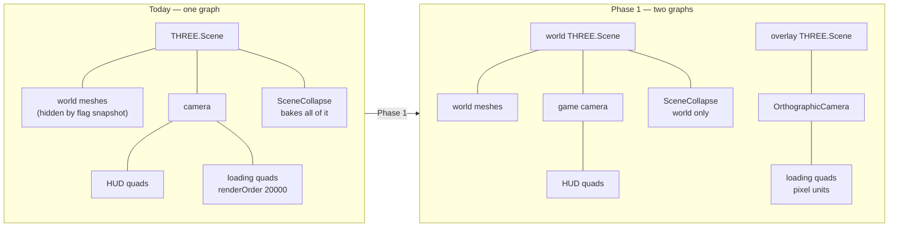

# PRD-075 — Separate the loading screen from the game scene

**Status: IN EXECUTION, 2026-08-11.** Phase 0 reproduced D5 on a physical Pixel 8 and committed
the per-frame detector. Phase 1 passes the unchanged scenario in Chromium and on the Android
emulator. Phase 2 closed RECOMMEND-AGAINST after emulator timings measured 0.508 ms for Boot's
texture and 2.738 ms for Play's texture plus GLB. Repository, scaffolded-template, desktop-native,
and Android-emulator gates are green. The exact physical Pixel performance comparison remains
open because the owner needed the phone. A completion audit also confirmed that D10 is a separate
browser-DOM concern outside the native framebuffer fix and outside this PRD's runnable success
criteria; no mobile-readiness or iOS claim is made here.

**The subject is a single-frame leak that no gate in this repository can see.** In `fox-native`,
the waterfalls draw through the dark loading backdrop for roughly one frame. `c63f5b3` attacked
it inside `SceneCollapse` and did not close it. Three things follow, and they set the order of
the phases:

1. **A one-frame event is invisible to a screenshot assertion**, which samples at a moment. That
   is why the harness has never failed on this and why the fix loop has been a human squinting at
   a recording.
2. **Nothing addresses it 100% because the patches are aimed at the wrong layer.** Every attempt
   so far has adjusted who is hidden, inside a design where the loading screen and the world are
   the same render pass over the same graph. That is an architecture question, not a flag.
3. **Phase 0 is therefore the detector, not the fix.** No fix in this document is authorised
   until a gate exists that fails on the current tree.

**Complexity: 7 → HIGH mode.** One addition to a package whose surface is declared closed; one
renderer contract that today silently ignores its own arguments; one framework pass (the scene
collapse) carrying special cases that only exist because of the overlap; and a scene lifecycle
that would have to become per-scene to finish the job. Getting the boundary wrong here means the
framework owns the look, which is the one thing it may not do.

**Blast radius (candidate, phase-gated).**
Phase 0: `packages/playtest/src/assertions.ts`, `packages/playtest/src/scenario.ts`,
`packages/playtest/src/three/observations.ts`, `packages/core/src/playtest.ts`,
`examples/abyss-framework/` (the in-tree repro), `docs/verification/` (NEW file).
Phase 1: `packages/core/src/renderer.ts`, `packages/core/src/game.ts`,
`packages/core/src/scene.ts`, `packages/core/src/index.ts`, `packages/core/src/collapse.ts`,
`packages/core/__tests__/`, `docs/architecture/CHARTER.md` (one line).
Phase 2: `packages/core/src/game.ts`, `packages/core/src/scene.ts`,
`packages/core/src/collapse.ts`, `packages/physics/src/` (scene lifecycle hooks),
`packages/core/src/hot.ts`.
Phase 3: `packages/create-threenative/templates/*/src/render/loading.ts`,
`packages/create-threenative/templates/*/src/scenes/`,
`packages/create-threenative/templates/*/src/game.ts`,
`packages/create-threenative/__tests__/`.
Phase 4: `packages/runtime-native/` (no source change expected; execution only).

**Depends on:** PRD-070 shipped `Ctx.startup` and the template loading screen this PRD is about,
and closed on the number that justifies covering startup at all (2,877 ms → 1,051 ms). This PRD
must not regress that number and must not re-litigate whether a loading screen is worth having.
PRD-073 owns the frame-cost instrument; this PRD consumes it and sets no threshold. PRD-058 owns
performance thresholds and stays untouched.

## 1. Why this exists

The loading screen and the game currently share one `THREE.Scene`, one camera, one render pass
and one collapse. Separation is achieved by bookkeeping: the screen walks the scene graph at
construction, records every child's `visible` flag, sets them false, parents three quads to the
game camera at `renderOrder` 20,000, and puts the flags back when it is done.

That works until anything else touches the same graph, and several things do. The result is a
class of defect that looks like a game bug and is not.

### Naming the layer

**This is an engine bug.** The repository rule is that when a game has to annotate its own scene
graph or hand-tune a framework pass to get a correct picture, that is an engine bug wearing a
game-code costume. Four lines of evidence, all from the current tree:

1. `templates/starter/src/scenes/Play.ts:146` — *"Built last on purpose: it hides what is in the
   scene when it is created, so the scene has to be populated first."* An ordering constraint on
   game code, enforced by nothing.
2. `templates/starter/src/render/loading.ts:52` — the backdrop is `transparent: true` at
   `opacity: 1` rather than opaque, because an opaque backdrop sorts before the HUD's transparent
   materials and the score floats over the loading screen.
3. `templates/starter/src/render/loading.ts:140` — *"Hidden, never removed... removing them from
   the camera leaves the merged copy on screen and the player stares at a full progress bar
   forever."* The template is working around the collapse having eaten its quads.
4. `packages/core/src/collapse.ts:1243` — the framework's own collapse pass carries an
   ancestor-visibility walk added because *"an animated waterfall drew through the loading
   backdrop"* on a Pixel 8. A framework pass has a loading-screen special case in it.

Every one of those is a line the user has to write, or a framework branch that exists, only
because the two things share a graph. The fix belongs in `packages/`, and the look stays in
`src/render/`.

## 2. What the code actually does

Proven by reading the tree at `8c5fc40`; each claim carries its location.

- **One `THREE.Scene` for the whole game.** Created in `Game#boot` (`game.ts:352`), handed to
  every scene as `ctx.scene`, and wiped by `clearScene` on every `goto` (`game.ts:280`). A
  ThreeNative `Scene` is a lifecycle object, not a render target — there is no second one to
  render.
- **One camera, and the game parents its HUD to it.** `ctx.add(ctx.camera)` is in every template.
  So hiding the world by hiding `scene.children` would hide the loading screen too, which is
  exactly why `loading.ts:84` skips the camera and hides children one at a time.
- **One collapse, created once, never reset.** `new SceneCollapse(threeScene)` at `game.ts:372`;
  no code path resets or disposes it on `goto`. `ctx.startup.progress` and `whenReady()` read
  that single instance (`game.ts:400`).
- **`renderer.render(scene, camera)` ignores both arguments once a game calls `setOutputNode`.**
  `renderer.ts:99` — with an output pipeline installed, the wrapper calls `outputPipeline.render()`
  and the scene and camera passed in are dropped. The pipeline was built from `pass(scene, camera)`
  captured when `setupPost` ran. **A second `renderer.render(overlayScene, overlayCamera)` call
  would therefore re-render the game scene.** This is the hard blocker for any two-scene design
  and Phase 1 must solve it first.
- **The loading screen does not exist while assets load.** `Scene.load()` is awaited before
  `enter()` (`game.ts:283–288`), and `createLoadingScreen(ctx)` is the last statement of
  `Play.enter()` (`Play.ts:149`). The loop has not started either — `gameLoop.start()` is at
  `game.ts:500`. Texture and `.glb` downloads happen with nothing on screen.

## 3. The defect list

Marked by evidence class. **D5 is the reported defect and drives the PRD.** Every `TO REPRODUCE`
row is settled before it authorises work, and a row that does not reproduce is struck from the
PRD rather than fixed quietly.

| # | Defect | Evidence |
|---|---|---|
| D1 | Anything added to the scene after the screen is built is never hidden — the `hidden` map is captured once at construction (`loading.ts:72–88`). Async completions, `ctx.after` spawns and particles draw over the backdrop. | PROVEN by code read |
| D2 | `finish()` writes the construction-time snapshot back (`loading.ts:139`), clobbering any `visible` a game set during startup. | PROVEN by code read |
| D3 | The backdrop must fake transparency to win the sort against a transparent HUD. | PROVEN — the workaround is in the shipped source |
| D4 | The collapse bakes the three quads, so the screen can only hide itself, never remove itself. | PROVEN — the workaround is in the shipped source |
| **D5** | **Merged geometry draws through the loading backdrop for about one frame.** `c63f5b3` added an ancestor-visibility walk inside the collapse for this and **did not close it** — `fox-native`'s waterfalls still flash over the dark backdrop. **This is the reported defect and the subject of the PRD.** | **CONFIRMED, RESOLVED.** The committed physical repro failed at frame 7 before Phase 1; the unchanged scenario passes after the world draw is skipped while `CanvasLayer.opaque` is true |
| D6 | Assets download with a blank canvas and a stopped loop; the screen appears only after `enter()` finishes. | MEASURED on Android emulator: Boot texture 0.508 ms; Play texture + GLB 2.738 ms. Not a meaningful player-visible asset-loading window; Phase 2 RECOMMEND-AGAINST |
| D7 | Bloom and ACES tonemapping run over the loading screen, because `setupPost` builds the pipeline from the one shared scene. | **PROVEN, RESOLVED.** `renderOverlay()` calls the raw renderer with clearing disabled and bypasses the captured output pipeline; the renderer unit asserts the exact scene, camera, and clear state |
| D8 | Restart (`goto`) rebuilds the screen against a collapse that is already settled, so `whenReady()` resolves immediately and the screen flashes. | **NOT REPRODUCED.** When readiness and compilation are already resolved, the screen is removed within the same microtask turn before another frame; a focused template test locks this down. If compilation is pending, remaining covered is intentional |
| D9 | `clearScene` removes the collapse's merged meshes while the collapse's `#update` closure still holds references to detached parts. | **CONFIRMED, RESOLVED.** `goto` now restores the settled collapse before clearing the old scene, and a 200-mesh moving-part integration test proves the old updater does not run on the destination frame |
| D10 | The React HUD in `src/ui/` is DOM and is not covered by an in-scene loading screen at all. | **CONFIRMED, NOT ADDRESSED.** DOM siblings paint above the canvas in the starter template. Native has no DOM, and this PRD's framebuffer detector cannot observe compositor content; web UI concealment needs its own DOM-level contract rather than weakening the native gate |
| D11 | ~40 lines of world-unit layout maths in `loading.ts` exist only because the bar lives in the game's perspective camera and has to survive its fov and aspect. | PROVEN by code read |

D1, D2, D5 and D8 are the ones that would read to a player as "glitching".

## 4. Why the harness cannot see it, and what to build

The reason this bug has survived several fixes is that **no gate in this repository can observe a
one-frame event.** That is a harness defect in its own right, and it is worth closing whatever
happens to the architecture.

Three reasons it slips through, each checked against the current tree:

1. **Screenshot and `visual` assertions sample at a step boundary.** They answer "what did the
   frame at this point look like", and a leak lasting one frame at 60 Hz falls between samples.
   Raising the sample rate does not fix it; it lowers the odds, which is worse than no gate
   because it makes the failure intermittent.
2. **Semantic assertions read the entity registry, not the picture.** `visibility` asks the game
   what it thinks is shown. The leaking geometry is a *merged* mesh the collapse created — it is
   not a registered entity, has no `debug()`, and the game does not know it exists. Every
   entity-level assertion is green while the leak is on screen.
3. **A draw-call invariant would not catch it today.** `collapse.ts:1246` hides a part by writing
   `1e9` into its transform, so the merged mesh still issues its draw and only its pixels change.
   Counting draws catches nothing until Phase 1 skips the world pass outright. **After Phase 1 it
   becomes the cheap permanent regression gate; before Phase 1 it is blind.** Do not ship it as
   the detector.

So the detector has to look at pixels, on every frame, across the startup window.

### Phase 0 — the leak detector

**Nothing else in this PRD is authorised until this fails on the current tree.**

- **A per-frame coverage probe.** While the game declares itself covered, sample a coarse grid
  from the framebuffer *every frame* — a 32×18 downscale is enough for a waterfall and cheap
  enough to run for the ~60 frames a startup lasts — and assert every sample sits within
  tolerance of the declared backdrop colour. The first violating frame is the result: record its
  index, its sample grid, and a full screenshot of that frame, so the failure is inspectable
  rather than a boolean.
- **Opt-in per scenario, never on by default.** A readback stalls the pipeline it is measuring. A
  probe that quietly changes frame timing can hide the very hitch it exists to find.
- **Fail closed, in the specific ways this harness has been burned before.** Zero observed
  startup frames is a failure, not a pass. A scenario that never reaches the loading window exits
  `2`, not `0`. A run that cannot read pixels — headless Chromium without WebGPU — fails loudly
  and names the capture wrapper in the message, rather than skipping the assertion.
- **An in-tree reproduction.** `fox-native` is not tracked by this repository and cannot be a
  gate. The repro needs a committed scene that reproduces the same shape: a mesh that keeps
  moving through startup, so the collapse classifies it as a moving part, behind a loading
  screen. `examples/abyss-framework` or a template playtest is the home.
- **A device lane that does not depend on readback.** On Android, reuse the existing screen
  recorder and analyse the recording offline for the first frame whose pixels leave the backdrop.
  Same assertion, different observation channel.
- **The deliverable is a failing run.** `docs/verification/loading-screen-leak-<date>.md` with the
  detector's output on the unfixed tree pasted into it — the violating frame index and its
  screenshot. A detector that has never fired is not evidence of anything.

## 5. The design

Two scenes, in the order the cost of each is justified. Phase 1 separates the **render surface**,
which is what kills the glitch class. Phase 2 separates the **lifecycle**, which is what puts a
screen in front of asset loading.

### Phase 1 — the overlay surface (engine)

- `IRendererLike` gains an explicit overlay draw that **bypasses the output pipeline** and does
  not clear the colour buffer. Without this, D7 is unfixable and the second scene renders the
  first one — see §2. The exact shape is Phase 1's first decision, and it must be one method, not
  a mode flag.
- `ICtx` gains the overlay scene and its camera. **The framework creates them empty and draws
  nothing into them, ever.** Sizing is pixel-space against the viewport, so `loading.ts` loses
  D11's fov maths.
- **The world pass is skipped entirely while the overlay declares itself opaque.** This is the
  clause that closes D5, and it closes it by construction rather than by bookkeeping: a draw that
  never issues cannot leak a frame, whatever the collapse did to the mesh's transform or its
  ancestors' `visible` flags. Every previous attempt tried to make the world *invisible*; this
  one stops rendering it. It is also where PRD-070's speed-up comes from — geometry never drawn
  is never compiled — and it moves concealment from the game to the framework, so D1 and D2 go
  with it: there is no visibility snapshot left to take.
- `SceneCollapse` never sees the overlay scene, so D3, D4 and D5 disappear and the ancestor-walk
  special case in `collapse.ts` becomes dead code to be deleted, not kept.
- **Vocabulary.** Godot's name for UI drawn independently of the world camera is `CanvasLayer`.
  Borrow it rather than inventing `overlay`, unless Phase 1 finds the semantics do not match — in
  which case say so in the PRD and take the Three.js word.
- **This is an addition to a surface `packages/core/AGENTS.md` declares closed.** It needs one
  line in `CHARTER.md` in the same commit. Do not add it quietly.

### Phase 2 — the preload scene lifecycle (engine), gated on D6

Only if Phase 0 measures D6 as a real, visible blank-canvas window.

**Decision: RECOMMEND-AGAINST, 2026-08-11.** A clean Android emulator build of the pre-Phase-3
starter template logged `TN_D6_BOOT_LOAD_MS:0.508` for `native-proof.png` and
`TN_D6_PLAY_LOAD_MS:2.738` for the cached texture plus `native-proof.glb`. The visibly longer
launch interval belongs to Android surface startup, JavaScript evaluation, shader compilation,
and scene collapse—not these local asset reads. A per-scene world, physics lifecycle hooks, hot
reload changes, and bridge changes are not justified by 3.246 ms of measured asset work. The
following candidate design remains intentionally unimplemented:

- A `Boot` scene ships in the templates and is the `start` scene. It draws into the overlay
  surface and calls `ctx.goto("play")`.
- The framework gains preparation of the next scene behind the current one: `load()` and the
  collapse run while `Boot` is still on screen and driving a bar. Godot's equivalent is threaded
  resource loading followed by a scene change, so the name comes from there.
- This is the change that forces `ctx.scene` to become per-scene rather than a game singleton,
  and it drags in the physics plugin's scene hooks, `hot.ts`, and the playtest bridge. **Do not
  start it on a hunch.** If D6 measures small, close Phase 2 RECOMMEND-AGAINST and say so.

### Phase 3 — the template rewrite

`loading.ts` becomes what it always claimed to be: colours, layout, and the shape of the bar,
drawing into a surface handed to it. Every workaround comment quoted in §1 is deleted, along with
the ordering constraint in `Play.ts`. `__tests__/loading-screen.spec.ts` is updated in the same
commit; the NaN clamp and the first-frame sizing assertions must survive the rewrite, because both
guard real device defects.

### Phase 4 — prove it on both halves

Desktop native and the Android emulator, locally, not by pushing to CI. The whole feature exists
because of a Pixel 8, so a web-only green is not a result.

## 6. Success criteria

Each is runnable. A phase is not done until its criterion has been executed and its output pasted
into the verification file.

1. **The detector fails on the unfixed tree**, naming the violating frame, and passes after
   Phase 1 — with the same scenario, unedited. Fail-closed: a missing observation is a failure.
   Weakening the assertion to get green is the one move this PRD forbids outright.
2. After Phase 1, the draw-call invariant from §4 holds every frame the screen is up: the only
   draws are the overlay's. This is the cheap gate that stays in CI once the pixel probe has done
   its job.
3. `grep` finds no visibility snapshot and no `renderOrder` above 1,000 in
   `templates/*/src/render/loading.ts`.
4. The loading-screen special cases in `collapse.ts` are deleted, not commented out, and
   `pnpm test` is green without them.
5. Launch to a complete picture does not regress against PRD-070's 1,051 ms on the same subject
   and the same device build.
6. `pnpm typecheck && pnpm lint && pnpm test`, plus `pnpm test:templates`, green.

## 7. Non-goals

- **The look.** No colour, layout, bar shape, spinner, logo or transition enters `packages/`. The
  framework ships an empty surface and a pass that draws it.
- **A loading-screen option in `defineGame`.** That is the v1 mistake this repository is named
  after avoiding.
- **A scene format, a scene graph editor, or a scene serialisation.** Closed with evidence
  elsewhere; a preload scene does not reopen them.
- **Any performance threshold.** PRD-058 owns those.
- **Streaming, level chunking, or progressive asset loading.** A separate subject.

## 8. Open questions, to be answered in Phase 0 or Phase 1

1. How coarse can the coverage grid be and still catch the `fox-native` waterfall? Too fine and
   the readback distorts the frame timing; too coarse and a thin leak slips between samples. The
   answer is measured against the in-tree repro, not guessed.
2. Can the overlay pass avoid a second full-screen clear on WebGPU, and what does it cost on the
   native host's Dawn binding?
3. Does the native host's renderer wrapper honour the same output-pipeline path, or does D7 exist
   on web only?
4. Is `CanvasLayer` the right borrowed name once the semantics are pinned, or does the Godot node
   imply layer ordering this surface will not have?

**Answers, 2026-08-11.**

1. The 32×18 grid caught both the physical `fox-native` waterfall and the committed physical
   repro, so it stays at 32×18; no finer readback is justified.
2. Yes. The overlay call sets the raw renderer's `autoClear` to false only for that draw and
   restores the exact prior property state in `finally`. Chromium and the Android emulator pass;
   the remaining same-Pixel launch measurement is the cost verdict.
3. The wrapper is shared JavaScript on web and native, and the emulator executed the same bypass.
   D7 is therefore not treated as a web-only branch.
4. `CanvasLayer` is retained: one independent pixel-space surface is the Godot-shaped semantic in
   use here. This PRD adds no ordering API or multiple-layer stack.

## 9. Kill criteria

- **If Phase 0's detector cannot be made to fail on the unfixed tree, stop.** Either the leak is
  not what this PRD says it is, or the probe is looking in the wrong place. Both are reasons to
  re-open §3 rather than start refactoring. Do not proceed on the strength of a bug you can see
  but cannot catch.
- If the detector fires and a ten-line change in `loading.ts` makes it stop firing, **close this
  PRD** and take the ten lines. A two-scene refactor has to earn itself against the gate, not
  against the argument in §1.
- If Phase 1 lands and the overlay pass costs more than it saves on the Pixel 8, revert it and
  record the number. PRD-070's measurement is the baseline that decides.
