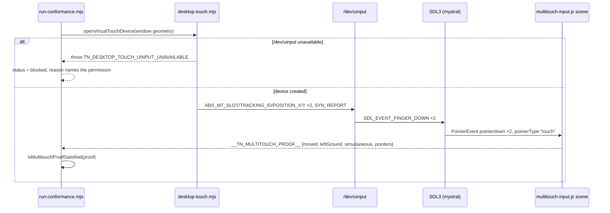

# PRD-077 — Desktop multitouch: the runtime already handles it, the harness cannot reach it

**Status: PROPOSED, 2026-08-11. Nothing here is executed.** §1 and §2 are a code read of the
tree at commit `8c5fc40`. No desktop touch injection has been attempted on this host, and
whether `/dev/uinput` is usable here is an open question that Phase 0 answers. No
mobile-readiness claim and no physical-device claim is made.

**The subject is the last registry exclusion standing between the parity matrix and an
unqualified aggregate**, and it is not a missing capability.

```json
{
  "id": "desktop-multitouch-input",
  "status": "excluded",
  "reason": "The desktop lane has no native multitouch injector; browser PointerEvents and Android sendevent cover the simultaneous-touch proof.",
  "owner": "PRD-064",
  "target": "desktop",
  "row": "90-multitouch-input"
}
```

`registry.json:42-51`. The reason is accurate and the exclusion is honest — it is declared,
owned, and enforced by a validator with an observed-red control. **What it is not is
permanent.** The desktop host already parses `SDL_EVENT_FINGER_DOWN` / `_MOTION` / `_UP` /
`_CANCELED` and dispatches them as DOM `PointerEvent`s with `pointerType: "touch"`,
multi-contact, with stable pointer ids and a primary-pointer rule:
`packages/runtime-native/src/platform/input.cpp:480` (`processTouchEvent`), backed by
`g_touchPointers` / `g_touchOrder` at `:59-60`.

**So a two-finger contact on a Linux desktop window would already reach the game.** Nothing
in the repository has ever delivered one.

**What that costs today:** the desktop lane can never exit `0`. `reportExitCode`
(`run-conformance.mjs:1258`) returns `2` whenever `blocked > 0`, and this exclusion
guarantees exactly one blocked row. Beta bar row 4 — *"the PRD-054 matrix passes
aggregate"* — is therefore unreachable by construction, not by defect.

**Complexity: 5 → MEDIUM mode.** One new injector module, one runner branch, one registry
deletion, one permission question that may end this PRD in `BLOCKED`, and a fail-closed
contract that must not turn a permission problem into a silent pass.

**Blast radius: ~6 repository paths.**
`packages/runtime-native/conformance/desktop-touch.mjs` (new),
`packages/runtime-native/conformance/run-conformance.mjs`,
`packages/runtime-native/conformance/registry.json`,
`packages/runtime-native/tests/`,
`packages/runtime-native/docs/` (one operator note on the udev rule),
`docs/verification/`.

**Depends on:** nothing. **Unblocks:** [PRD-076](PRD-076-tier-1-parity-reconciliation.md)
Phase 3's unqualified desktop aggregate, [PRD-054](native/blocked/PRD-054-write-once-run-anywhere.md)
criterion 1, and beta bar row 4.

---

## 1. Why this exists

Three lanes prove the same simultaneous-touch contract, and two of them exist.

| Lane | Injection | Where |
|---|---|---|
| Browser | `PointerEvent`s dispatched on the canvas | `run-conformance.mjs:475-485` |
| Android emulator | `sendevent` writing the Linux `ABS_MT_*` multitouch protocol, aimed at the letterboxed display read from `dumpsys input` | `run-conformance.mjs:834-853`, `conformance/android-touch.mjs` |
| Desktop Linux | **nothing** | — |

Both existing lanes already share the two things that make a third lane cheap:

- `MULTITOUCH_PROOF_POINTS` — the two contact points, `{id: 7, x: 0.2, y: 0.5}` and
  `{id: 3, x: 0.8, y: 0.5}` (`android-touch.mjs:16-19`), imported by the runner at `:14`.
- `isMultitouchProofSatisfied` — the proof contract shared by the runner and its tests
  precisely so neither can drift (`multitouch-proof.mjs:11`). It requires `moved`,
  `leftGround`, `simultaneous` **within one frame**, and `pointers >= 2` as a *current*
  observation. Two sequential one-finger touches go red against it. That is the assertion
  being right, and it is reused unchanged here.

And the scene is already shared: `conformance/scenes/shared/multitouch-input.js`, one file
for all three targets (`registry.json:917`).

**So this is not a new proof. It is the third injector for a proof that already has two.**

The Android injector is the relevant prior art in a stronger sense than "similar": Android's
`sendevent` writes the *same* Linux input event protocol that `/dev/uinput` accepts —
`ABS_MT_SLOT` (47), `ABS_MT_TRACKING_ID` (57), `ABS_MT_POSITION_X` (53), `ABS_MT_POSITION_Y`
(54), `BTN_TOUCH` (330), `SYN_REPORT` — all already named as constants in
`android-touch.mjs:1-15`. The desktop injector creates the virtual device that Android's
hardware already provides.

## 2. What the code says, before any run

- `processTouchEvent` (`platform/input.cpp:480`) allocates a pointer id per
  `{touchID, fingerID}` pair from `g_nextTouchPointerId` starting at `2` (`:61`), tracks
  arrival order in `g_touchOrder`, and marks only the first as primary (`:490`). Multi-contact
  is handled, not stubbed.
- Normalized SDL finger coordinates are scaled by `g_presentedTouchWidth` /
  `g_presentedTouchHeight` (`:67-68`), refreshed on resize (`:312-313`). The comment at `:65`
  says why: so contacts keep mapping to the presented canvas after a resize. **The desktop
  lane has the same viewport-aiming hazard the Android lane hit** — Android's fix reads the
  physical frame from `dumpsys input` (`android-touch.mjs:22-33`); the desktop equivalent must
  read the window's actual position and size, not assume it.
- Synthetic mouse events from touch are already filtered: `event.which != SDL_TOUCH_MOUSEID`
  guards the mouse path at `:380` and `:451`. An injected touch will not double-fire as a
  mouse click.
- `SDL_EVENT_FINGER_CANCELED` maps to `pointercancel` (`:527-528`), so an aborted injection
  is observable rather than silent.

**What the code does not tell us:** whether SDL3 on this host enumerates a `uinput` virtual
multitouch device as a touch device at all, and whether the process may open `/dev/uinput`.
Both are Phase 0 measurements.

## 3. Solution

- **Create a virtual multitouch device via `/dev/uinput`**, emitting the same `ABS_MT_*`
  protocol the Android lane already writes, from a new `conformance/desktop-touch.mjs`.
- **Aim it at the window under test**, reading the desktop window's real geometry rather than
  assuming full-screen — the failure the Android lane already paid for once.
- **Reuse both shared contracts unchanged.** `MULTITOUCH_PROOF_POINTS` and
  `isMultitouchProofSatisfied` are imported, not re-derived. A third copy of either is a fork.
- **Fail closed on permission.** If `/dev/uinput` cannot be opened, the row reports `blocked`
  with a runtime-detected reason naming the missing permission — **never a pass, and never a
  registry exclusion.** A permission gap is a host fact that changes between machines; an
  exclusion is a permanent hole in the matrix, and the two must not be confused.
- **Delete the registry exclusion in the same phase the injector proves out.** Two
  dispositions for one row means the exclusion keeps suppressing the row while the injector
  sits unused.



**Key decisions:**

- [ ] `/dev/uinput` over `XTEST` or a compositor protocol: `XTEST` has no multitouch, and a
      Wayland protocol would bind the lane to one compositor. `uinput` is kernel-level and
      matches the protocol the repo already writes.
- [ ] Node writes the `input_event` structs directly with a `Buffer`. No new dependency —
      the Android lane already hand-assembles the same events.
- [ ] Vocabulary borrowed: the event codes are Linux's, the proof contract is the
      repository's existing one. Nothing is invented.
- [ ] The udev rule needed to grant access is **documented for the operator, never applied by
      a script.** A conformance run does not modify the host's device permissions.

**Data changes:** one registry exclusion deleted. No schema change.

## 4. Integration Ledger

| # | New thing | Live caller (`file:line`, non-test) | Replaces | Old path removed? | Negative control |
|---|---|---|---|---|---|
| 1 | `conformance/desktop-touch.mjs` — `openVirtualTouchDevice`, `injectMultitouchProof` | `run-conformance.mjs` desktop branch, alongside the existing web branch (`:475`) and Android branch (`:834`) | the `desktop-multitouch-input` registry exclusion | exclusion deleted in Phase 1 | drop one of the two contacts → the proof's `simultaneous`/`pointers` conditions fail and the row goes red |
| 2 | `TN_DESKTOP_TOUCH_UINPUT_UNAVAILABLE` blocked path | same desktop branch | nothing — the lane currently has no honest way to say "cannot inject here" | n/a | run with `/dev/uinput` unreadable → row is `blocked` with the permission named, run exits `2`, and **no row reports pass** |
| 3 | Desktop `90-multitouch-input` row enabled | `registry.json:913` row, executed by every `pnpm parity -- --target desktop` | the excluded row | the exclusion object is deleted, not left with `status: "disabled"` | re-add the exclusion while the injector works → `validateReport` rejects the resulting pass (`run-conformance.mjs:163-167`), which is the existing `phase-2-excluded-pass` control still holding |

**A test is not a caller.** Row 1's caller is the runner's desktop branch, reached by
`pnpm parity -- --target desktop`, not `desktop-touch.spec.mjs`.

### Reachability

**How is this reached?** `pnpm parity -- --target desktop` (root `package.json:24`), on every
desktop conformance run and in PRD-076 Phase 3's aggregate run.
**Pre-existing files edited:** `run-conformance.mjs`, `registry.json`.
**User-facing?** No. It is a harness capability. The runtime capability it exercises is
already user-facing and already shipped.
**What does it replace?** The `desktop-multitouch-input` exclusion — deleted, not delegated.

## 5. Execution phases

### Phase 0 — Can this host inject at all?

**Outcome:** a recorded yes/no on whether a `uinput` virtual multitouch device reaches an SDL3
window on this host, before any runner code is written.

**This phase is permitted to end `BLOCKED`.** If `/dev/uinput` is unavailable and no udev rule
is acceptable to the operator, this PRD stops here with the finding recorded and the
exclusion's reason **rewritten to name the real blocker** — a host permission, not a missing
injector. That is a better exclusion than today's, and it is a legitimate outcome.

**Files (max 5):**

- `packages/runtime-native/conformance/desktop-touch.mjs` — NEW: minimal spike, device
  creation and two contacts
- `docs/verification/desktop-multitouch-2026-08-11.md` — NEW: the finding

**Implementation:**

- [ ] Open `/dev/uinput`, declare `EV_ABS` with `ABS_MT_SLOT`, `ABS_MT_TRACKING_ID`,
      `ABS_MT_POSITION_X/Y`, `EV_KEY` with `BTN_TOUCH`, and the `INPUT_PROP_DIRECT` property
      that marks the device a touchscreen rather than a touchpad.
- [ ] Confirm the kernel enumerates it: the device appears under `/proc/bus/input/devices`
      with the `ABS_MT_*` bits set.
- [ ] Launch the desktop runtime on the `multitouch-input` scene and place two contacts.
      **Read the resulting `PointerEvent`s out of the scene**, not out of the injector — an
      injector that writes bytes nobody receives is exactly the manufactured evidence this
      repository fails builds over.

**Phase 0 must publish these numbers before Phase 1:**

- Whether the process could open `/dev/uinput` unprivileged, and if not, the exact udev rule
  that would grant it.
- Whether SDL3 enumerated the virtual device, and how long after creation it became visible
  (the kernel's device-settle delay is real and a race here is a flake later).
- The window geometry the contacts had to be aimed at, and whether full-screen assumption
  would have worked.

### Phase 1 — Wire it into the runner and delete the exclusion

**Outcome:** `pnpm parity -- --target desktop` places two simultaneous contacts, the shared
proof contract passes, and the desktop matrix has no excluded rows.

**Files (max 5):**

- `packages/runtime-native/conformance/desktop-touch.mjs` — EDIT: viewport aiming, settle
  wait, cleanup on every exit path
- `packages/runtime-native/conformance/run-conformance.mjs` — EDIT: desktop branch beside
  `:834`'s Android branch, importing the same `MULTITOUCH_PROOF_POINTS`
- `packages/runtime-native/conformance/registry.json` — EDIT: delete the
  `desktop-multitouch-input` exclusion; set `90-multitouch-input` `desktopGate: true`
- `packages/runtime-native/tests/desktop-touch.test.mjs` — NEW
- `docs/verification/desktop-multitouch-2026-08-11.md` — EDIT: the executed result

**Wiring:**

- [ ] Caller edited: `run-conformance.mjs` desktop branch
- [ ] Registration: the registry row becomes runnable on desktop
- [ ] Old path: the exclusion object is **deleted**
- [ ] Ledger rows filled: #1, #2, #3

**Tests required:**

| Test file | Test name | Assertion | Negative control (must be observed red) |
|---|---|---|---|
| `tests/desktop-touch.test.mjs` | `should emit both contacts in one SYN_REPORT frame` | the encoded event stream carries two `ABS_MT_SLOT` groups before one `SYN_REPORT` | emit two `SYN_REPORT`s → the scene's `simultaneous` goes false and the row goes red |
| `tests/desktop-touch.test.mjs` | `should block rather than pass when /dev/uinput cannot be opened` | status `blocked`, message contains `TN_DESKTOP_TOUCH_UINPUT_UNAVAILABLE` | make the open succeed against a fake → confirm the blocked branch is what produced the earlier red, not an unrelated failure |
| `tests/desktop-touch.test.mjs` | `should release the virtual device on every exit path` | no `uinput` device survives a thrown injection | remove the cleanup → a second run finds a stale device |
| existing `run-conformance` contract tests | `should reject a pass on an excluded row` | unchanged | re-add the exclusion with the row passing → `validateReport` red (the existing `phase-2-excluded-pass` control) |

**Revert check:** delete the desktop branch from `run-conformance.mjs` → the desktop
`90-multitouch-input` row fails with no proof observation, because the registry no longer
excludes it. **That is the point of deleting the exclusion in the same phase:** the row's
absence becomes loud.

**User verification:**

- Action: `TN_RUNTIME=$PWD/packages/runtime-native/build/tn-linux/mystral pnpm parity -- --target desktop --only-tests 90-multitouch-input`
- Expected: `pass 1 / fail 0 / blocked 0`, exit `0`.

### Phase 2 — The aggregate the exclusion was blocking

**Outcome:** a full desktop lane with zero blocked rows, handed to PRD-076 Phase 3.

**Files (max 5):**

- `docs/verification/desktop-multitouch-2026-08-11.md` — EDIT: the full-lane result
- `packages/runtime-native/docs/` — EDIT: one operator note, the udev rule, if Phase 0
  needed one
- `docs/PRDs/native/blocked/PRD-054-write-once-run-anywhere.md` — EDIT: criterion 1's
  desktop blocker resolved or restated
- `docs/strategy/ROADMAP.md` — EDIT: beta row 4's desktop clause

**This phase does not claim beta row 4.** Row 4 needs the Android lane too, and that belongs
to PRD-076. This phase removes one of the two reasons row 4 is open and says so plainly.

## 6. Verification strategy

**Integration proof:**

```sh
# 1. Caller census — the injector is called by the runner, not only by its test
grep -rn "desktop-touch" packages/runtime-native/conformance/run-conformance.mjs
# Expected: an import and a call in the desktop branch

# 2. Incumbent check — the exclusion is gone, not disabled in place
grep -n "desktop-multitouch-input" packages/runtime-native/conformance/registry.json
# Expected: no output

# 3. Revert check — the row is now load-bearing
#    (comment out the desktop branch, re-run the single row)
# Expected: 90-multitouch-input FAILS on desktop. If it blocks or passes, the wiring is wrong.

# 4. Shared-contract check — no forked proof definition
grep -rn "MULTITOUCH_PROOF_POINTS\|isMultitouchProofSatisfied" packages/runtime-native/conformance/
# Expected: one definition of each, imported by three lanes
```

**Evidence required:**

- [ ] `pnpm typecheck && pnpm lint && pnpm test` green
- [ ] Every gate has an observed negative control, recorded red with its command
- [ ] The dropped-contact control observed red on **desktop**, mirroring the browser lane's
      existing `TN_MULTITOUCH_DROP_POINTER=1` control
- [ ] Full desktop lane output pasted, not summarized

## 7. Acceptance criteria

Consumer-scoped.

- [ ] **Two fingers on a desktop ThreeNative window move the stick and jump in the same
      frame** — proved by the same scene and the same contract the browser and Android lanes
      already use, with no third copy of either.
- [ ] **The desktop parity lane has zero excluded rows**, so `pnpm parity -- --target desktop`
      can exit `0` at all — which it cannot today.
- [ ] **A machine that cannot inject says so and blocks**, naming the permission, and no row
      reports pass on that machine.
- [ ] The `desktop-multitouch-input` exclusion is deleted from `registry.json`, not disabled.
- [ ] `PRD-054` criterion 1's desktop clause is resolved or restated with the real blocker.

**Permitted failure:** Phase 0 ends `BLOCKED` on host permissions. In that case the exclusion
stays, its reason is corrected to name the permission rather than a missing injector, the
owner moves from PRD-064 to this PRD, and beta row 4 records a host constraint instead of a
capability gap. **That outcome is recorded as BLOCKED, never as done.**

**What this PRD may not claim:** that desktop multitouch works on macOS or Windows. `uinput`
is a Linux kernel interface. The other two desktop platforms keep whatever disposition they
have, and this PRD does not silently widen its result to cover them.
