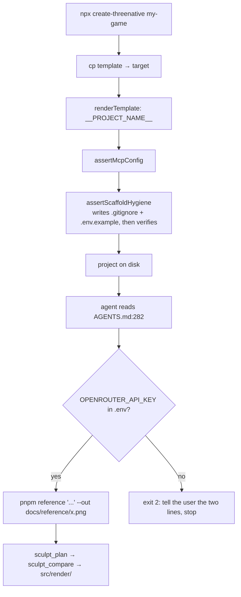

# PRD-106 — A scaffolded project can obtain the reference image its own docs demand

**Status: OPEN, written 2026-08-14.** Nothing below has been executed. Every gate in this file
is unrun; no phase may be recorded as passing without the negative control beside it going red
first.

**Complexity: 6 → MEDIUM mode.** 10+ files (+3), new module from scratch (+2), external API
integration (+1).

---

## 1. Context

**Problem.** `templates/starter/AGENTS.md:282` tells the agent that a bespoke asset with no
reference image means *"ask for one, or write it and accept that it will be generic"* — and the
project ships no way to obtain one. The entire sculpt pipeline downstream of it
(`sculpt_plan` → `sculpt_spec_gate` → `sculpt_compare` → `sculpt_pass_gate`) is starved without
that image, and neither pinned MCP can produce one.

**Files analyzed.**

- `packages/create-threenative/src/index.ts` — `createProject`, `renderTemplate`,
  `assertMcpConfig`, `TEXT_FILE_EXTENSIONS`
- `packages/create-threenative/templates/starter/AGENTS.md:271-305` — the sculpt-from-reference
  section
- `packages/create-threenative/templates/starter/package.json`, `.mcp.json`
- `packages/create-threenative/__tests__/scaffold.spec.ts` (`ALL_TEMPLATES` loop, line 402),
  `template.spec.ts`, `publication.spec.ts`
- `packages/create-threenative/asset-mcp-tools.json` — confirmed: no image-generation tool
- `hosting/gateway/server.ts:108` — the repo's existing `OPENROUTER_API_KEY` name
- root `.gitignore` — the existing secrets stanza
- `.github/workflows/ci.yml:67-100` — `scaffold-smoke` packs a real tarball and scaffolds from it

**Current behavior.**

- A scaffolded project has **no `.gitignore` at all.** Nothing in `src/index.ts` writes one and
  no template ships one. `git init && git add .` in a fresh project stages `node_modules/`.
- A scaffolded project has no `.env`, no `.env.example`, and no documented secret of any kind.
- Three templates (`starter`, `minimal`, `platformer`) carry the sculpt-from-reference section.
  Four kits (`action-rpg`, `defense`, `racing`, `shooter`) carry none — out of scope here, see §8.
- `createProject` already ends with one fail-closed check, `assertMcpConfig`. That is the
  pattern this PRD extends rather than inventing a second one.

**Incumbent census.** There is no incumbent. No code in this repo generates or fetches a
reference image; `hosting/gateway/server.ts` proxies text completions for hosted Studio sessions
and is a different process, a different key holder, and a different concern. No `Replaces` row
in the ledger is non-empty, and §7's "old path deleted" gate is therefore vacuous by
construction — stated here so nobody records it as evidence of anything.

---

## 2. Solution

**Approach.**

- The scaffolder writes `.gitignore` and `.env.example` itself. They are uniform boilerplate,
  not per-template content, so one source of truth cannot drift across seven templates.
- A new fail-closed `assertScaffoldHygiene(target)` runs beside `assertMcpConfig` inside
  `createProject`. A scaffold missing either file, or one that ignores nothing, or one carrying
  a real key, throws. This is the wiring anchor: every scaffold in the repo goes through this
  function, so disabling any part of it reddens pre-existing tests.
- `scripts/reference.mjs` ships in the three reference-carrying templates as **generated user
  source**. It is a pass-through: the agent's prompt goes to OpenRouter unmodified, with no
  style preamble. The framework must not pick the art direction.
- `AGENTS.md` line 282's dead-end bullet becomes a runnable instruction, and a test over
  `ALL_TEMPLATES` asserts the instruction is present — so it is a gate, not prose.

**Where each piece lives, and why it is not framework code.** `scripts/reference.mjs` is ~50
lines of `fetch`, which the 20-line rule keeps out of `packages/`. It is also a look decision in
disguise — the model, the prompt, and the resolution all shape what gets sculpted — so it ships
as source the user owns and edits. A `threenative reference` CLI subcommand was considered and
rejected for exactly that reason: changing the image model would become a framework release.

**Key decisions.**

- [ ] `OPENROUTER_API_KEY` — the name already used at `hosting/gateway/server.ts:108`. Do not
      introduce `OPENROUTER_KEY`.
- [ ] No dotenv dependency. The script reads `process.env` first, then parses `.env` itself
      (~8 lines). `node --env-file` is not used: it throws on a missing file under Node 20,
      which CI pins.
- [ ] Plain `.mjs`, not `.ts`. Precedent: `@threenative/runtime-native/scripts/verify-starter-desktop.mjs`.
      A `.ts` tooling script would need `tsx` or an esbuild step in the template's critical path
      for no benefit. Add `scripts/` to each template's `tsconfig.json` exclude.
- [ ] Errors are explicit exit codes, never a silent fallback: `0` wrote an image, `2` no key
      configured (with the two lines to add), `1` the API call failed (with the upstream status).
      **The script never writes a placeholder image.** A blank or stub reference is worse than
      none — it turns `sculpt_compare` into unguided iteration that reports evidence.
- [ ] The model ID is read from `THREENATIVE_REFERENCE_MODEL`, defaulting to one pinned
      constant. **Verify that ID against `https://openrouter.ai/models` before writing it** —
      the same discipline `asset-mcp-tools.json` follows, where the surface of record comes from
      running the server and never from reading docs. OpenRouter returns images through
      chat-completions with `modalities: ["image", "text"]`; the response shape must be read off
      a real call in Phase 3, not assumed.

**Data changes.** None.

---

## 3. Reachability

**How is this feature reached?**

- Entry point: the `create-threenative` CLI (`createProject`), then the `pnpm reference` npm
  script inside the generated project.
- Pre-existing file EDITED to call it: `packages/create-threenative/src/index.ts` —
  `createProject` gains one `await assertScaffoldHygiene(target)` line beside the existing
  `await assertMcpConfig(target)`.
- Registration: `"reference"` added to each template's `package.json` `scripts`, and the
  invocation named in each template's `AGENTS.md`.

**Is this user-facing?** YES, in the CLI sense — there is no GUI. The observable surfaces are a
`.gitignore` in the generated project, a `.env.example`, a `pnpm reference` script, and a PNG on
disk. No Studio or React UI is in scope.

**Full flow.**

1. User runs `npx create-threenative my-game`.
2. Triggers `createProject` in `src/index.ts`.
3. Reaches the new code via the `assertScaffoldHygiene(target)` call added after
   `assertMcpConfig(target)`.
4. Result observable in: `my-game/.gitignore`, `my-game/.env.example`,
   `my-game/scripts/reference.mjs`, `pnpm reference` in `package.json`.
5. Later, an agent building a bespoke asset reads `AGENTS.md`, runs `pnpm reference`, and a PNG
   appears at the `--out` path — or the command exits 2 and the agent asks the user for a key.

**What does this replace?** Nothing. See the incumbent census in §1.

---

## 4. Integration Ledger

Filled with real non-test `file:line` during implementation. A `TBD` at phase end means the
phase is incomplete.

| # | New thing | Live caller (`file:line`, non-test) | Replaces | Old path removed? | Negative control |
|---|-----------|-------------------------------------|----------|-------------------|------------------|
| 1 | `assertScaffoldHygiene` | `src/index.ts:TBD` in `createProject`, beside `assertMcpConfig` | nothing | n/a | delete the `.gitignore` write → every existing scaffold test throws |
| 2 | `SCAFFOLD_GITIGNORE` constant | `src/index.ts:TBD` (written by #1) | nothing | n/a | drop `node_modules/` from it → hygiene test goes red |
| 3 | `SCAFFOLD_ENV_EXAMPLE` constant | `src/index.ts:TBD` (written by #1) | nothing | n/a | set a non-empty key value → hygiene test goes red |
| 4 | `scripts/reference.mjs` ×3 templates | `templates/*/package.json` `scripts.reference`; named in `templates/*/AGENTS.md:TBD` | nothing | n/a | unset the key → exit 2, not exit 0 with a placeholder |
| 5 | `pnpm reference` instruction in AGENTS.md | `scaffold.spec.ts` gate over `ALL_TEMPLATES` asserts presence | the "ask for one" dead end at `starter/AGENTS.md:282` | rewritten in Phase 4 | remove the line from one template → the gate names that template |

Row 5 is the only row whose "live caller" is a test, and that is deliberate: the consumer of a
documentation line is the agent reading it, which no grep can assert. Its real proof is the
Phase 4 consumer gate, not the presence test.

---

## 5. Execution Phases

### Phase 1 — A scaffolded project ignores `node_modules`

**Outcome:** `npx create-threenative g && cd g && git init && git add . && git status` stages
neither `node_modules/` nor `.env`.

**Files (3, all pre-existing):**

- `packages/create-threenative/src/index.ts` — EDIT: add `SCAFFOLD_GITIGNORE`,
  `assertScaffoldHygiene`, and the call inside `createProject` (~line 322, after
  `await assertMcpConfig(target)`)
- `packages/create-threenative/__tests__/scaffold.spec.ts` — EDIT: hygiene assertions over
  `ALL_TEMPLATES`
- `packages/create-threenative/__tests__/publication.spec.ts` — EDIT: the packed-tarball gate

**Implementation:**

- [ ] `SCAFFOLD_GITIGNORE` reuses the root `.gitignore` secrets stanza verbatim, including
      `!.env.example`, plus `node_modules/`, `dist/`, `artifacts`, `test-results/`,
      `playwright-report/`, `*.log`, `.DS_Store`.
- [ ] `assertScaffoldHygiene` writes the file, reads it back, and throws
      `TN_SCAFFOLD_HYGIENE_*` on any missing rule. Fail closed like `assertMcpConfig`: read-back,
      not write-and-trust.
- [ ] Do **not** ship `.gitignore` as a template dotfile. npm rewrites a literal `.gitignore`
      inside a published tarball; writing it in the scaffolder sidesteps that entirely. Phase 1's
      tarball gate is what proves this claim rather than repeating it.

**Wiring:**

- [ ] Caller edited: `src/index.ts` `createProject` invokes `assertScaffoldHygiene`
- [ ] Registration: n/a — `createProject` is the entry point
- [ ] Old path: n/a, new behavior
- [ ] Ledger rows filled: #1, #2

**Tests required:**

| Test file | Test name | Assertion | Negative control (must be observed red) |
|---|---|---|---|
| `__tests__/scaffold.spec.ts` | `should write a .gitignore that ignores node_modules and .env in every template` | scaffold each of `ALL_TEMPLATES`, read `.gitignore`, expect both rules | drop `node_modules/` from `SCAFFOLD_GITIGNORE` → red |
| `__tests__/scaffold.spec.ts` | `should throw when the scaffold .gitignore is missing` | delete the file mid-scaffold via a stub, expect `TN_SCAFFOLD_HYGIENE_` | remove the read-back → green, proving the check was cosmetic |
| `__tests__/publication.spec.ts` | `should ship a scaffold that git-ignores node_modules when installed from the packed tarball` | `pnpm pack` create-threenative, extract, scaffold from the extracted CLI, assert `.gitignore` present and correct | ship it as a template dotfile instead → red, which is the actual npm behavior this phase claims |

**Proof subject:** the packed `.tgz`, which is what `scaffold-smoke` and every real user install
from. Testing only the in-repo template directory would pass while the published package ships
nothing — the exact toy-proof this repo's rules forbid.

**Revert check:** remove the `assertScaffoldHygiene` call from `createProject` → the two
`scaffold.spec.ts` tests and the `publication.spec.ts` tarball test go red.

**User verification:** `node packages/create-threenative/dist/index.js /tmp/g --no-install`,
then `cd /tmp/g && git init && git add . && git status --short | grep node_modules` returns
nothing.

---

### Phase 2 — A scaffolded project declares the key it can use

**Outcome:** every generated project contains `.env.example` naming `OPENROUTER_API_KEY` with an
empty value, and `.env` is already ignored by Phase 1's file.

**Files (2, both pre-existing):**

- `packages/create-threenative/src/index.ts` — EDIT: `SCAFFOLD_ENV_EXAMPLE`, extend
  `assertScaffoldHygiene`
- `packages/create-threenative/__tests__/scaffold.spec.ts` — EDIT

**Implementation:**

- [ ] `.env.example` content: a comment saying the key is optional and what it unlocks, a link
      to `https://openrouter.ai/keys`, an explicit note that image generation bills the user's
      own account, `OPENROUTER_API_KEY=`, and `THREENATIVE_REFERENCE_MODEL=`.
- [ ] `assertScaffoldHygiene` additionally throws if `.env.example` is absent, if
      `OPENROUTER_API_KEY` is absent from it, if that key has a **non-empty** value, or if a
      `.env` file exists in the scaffold output.
- [ ] Confirm `path.extname(".env.example") === ".example"` is outside `TEXT_FILE_EXTENSIONS`,
      so `renderTemplate` never rewrites it. Assert this rather than reasoning about it.

**Wiring:**

- [ ] Caller edited: the same `assertScaffoldHygiene` call from Phase 1 now covers `.env.example`
- [ ] Registration: n/a
- [ ] Old path: n/a
- [ ] Ledger rows filled: #3

**Tests required:**

| Test file | Test name | Assertion | Negative control (must be observed red) |
|---|---|---|---|
| `__tests__/scaffold.spec.ts` | `should declare an empty OPENROUTER_API_KEY in every scaffolded .env.example` | over `ALL_TEMPLATES`, `.env.example` matches `/^OPENROUTER_API_KEY=\s*$/m` | put a fake key value in the constant → red |
| `__tests__/scaffold.spec.ts` | `should throw when a scaffold ships a real .env` | write `.env` into the target before the check, expect `TN_SCAFFOLD_HYGIENE_ENV_PRESENT` | remove the branch → green, proving the check was absent |

**Revert check:** delete the `.env.example` write → both tests above and Phase 1's throw-test go
red.

**User verification:** `cat /tmp/g/.env.example` shows the key with no value; `cp .env.example
.env` then `git status --short` shows nothing.

---

### Phase 3 — `pnpm reference` writes a real image from a real API call

**Outcome:** in a scaffolded starter with a key in `.env`,
`pnpm reference "a weathered brass diving bell, side view, neutral grey background" --out docs/reference/bell.png`
writes a PNG that opens. Without a key it exits 2 and writes nothing.

**Files (4 logical; the `.mjs` is one file copied to 3 templates):**

- `templates/{starter,minimal,platformer}/scripts/reference.mjs` — NEW, byte-identical ×3
- `templates/{starter,minimal,platformer}/package.json` — EDIT: `"reference": "node scripts/reference.mjs"`
- `templates/{starter,minimal,platformer}/tsconfig.json` — EDIT: exclude `scripts`
- `packages/create-threenative/__tests__/template.spec.ts` — EDIT
- `packages/create-threenative/__tests__/reference.live.spec.ts` — NEW, opt-in

**Deviation declared:** this phase exceeds five files because one new file is copied to three
templates and two pre-existing files are edited in each. The copies are mechanical and gated
byte-identical by a test; the logical file count is 4.

**Implementation:**

- [ ] Argument parsing: positional prompt, `--out <path>` (required), `--model <id>` optional.
      A missing prompt or missing `--out` exits 2 with usage. Never default the output path —
      a silently-placed file is a file the agent will not find.
- [ ] Key resolution: `process.env.OPENROUTER_API_KEY`, else parse `.env` in the project root.
      Unset → exit 2, printing the two lines to add to `.env` and the `openrouter.ai/keys` URL.
- [ ] The prompt is forwarded **unmodified**. No style preamble, no quality boilerplate, no
      appended camera or lighting words. Assert this in a test over the request body.
- [ ] Non-2xx from OpenRouter → exit 1 with the status and the upstream message. No retry loop.
- [ ] A response carrying no image → exit 1. Never write a zero-byte or placeholder file.
- [ ] Print the model used and the output path on success, so cost is attributable.
- [ ] Read the real response shape off the live call before writing the parser.

**Wiring:**

- [ ] Caller edited: each template's `package.json` `scripts.reference`
- [ ] Registration: the npm script is the invocation surface
- [ ] Old path: n/a
- [ ] Ledger rows filled: #4

**Tests required:**

| Test file | Test name | Assertion | Negative control (must be observed red) |
|---|---|---|---|
| `__tests__/template.spec.ts` | `should ship a byte-identical reference script in every template that documents one` | hash `scripts/reference.mjs` across the 3 templates, expect one distinct hash | edit one copy by a byte → red |
| `__tests__/template.spec.ts` | `should expose reference as an npm script wherever the script ships` | template has `scripts/reference.mjs` ⟺ `package.json` declares `reference` | add the file to a 4th template without the script → red |
| `__tests__/template.spec.ts` | `should exit 2 without writing a file when no key is configured` | spawn the script with a scrubbed env, expect code 2 and no file at `--out` | make the key optional → exit 0, red |
| `__tests__/template.spec.ts` | `should forward the prompt to OpenRouter unmodified` | stub `fetch`, assert the request body's prompt equals the argv prompt exactly | prepend `"cinematic, 8k"` in the script → red |
| `__tests__/reference.live.spec.ts` | `should write a decodable PNG from a live OpenRouter call` | skipped unless `OPENROUTER_API_KEY` is set; asserts PNG magic bytes and non-trivial size | point at a bogus model → exit 1, red |

**Proof subject:** a live OpenRouter call, following the precedent of
`hosting/__tests__/openrouter.live.spec.ts`. A fetch-stub-only proof would pass against a
response shape that does not exist. **The live spec is skipped in CI and must be run by hand at
least once before this phase is recorded — a skipped test is not a pass.** Record the run.

**Revert check:** delete `scripts/reference.mjs` from one template → the byte-identity and
script-parity tests go red.

**User verification:** in a scaffolded project with a key, run the command from the Outcome line
and open the PNG.

---

### Phase 4 — The agent reaches for it instead of inventing a reference

**Outcome:** an agent told to build a bespoke identity-bearing asset in a fresh scaffold runs
`pnpm reference` (or stops and asks for a key) rather than writing generic geometry.

**Files (5):**

- `templates/{starter,minimal,platformer}/AGENTS.md` — EDIT
- `packages/create-threenative/__tests__/scaffold.spec.ts` — EDIT
- regenerated `templates/*/CLAUDE.md` via `pnpm sync:agents` (generated, not hand-edited)

**Implementation:**

- [ ] Rewrite the `**Bespoke, without a reference image**` bullet at `starter/AGENTS.md:282` and
      its siblings: generate one with `pnpm reference "<one-line art direction>" --out
      docs/reference/<name>.png`; on exit 2, tell the user the two lines to put in `.env` and
      stop. Keep the existing sentence *"Do not invent a reference: comparison without evidence
      is unguided iteration"* — it is the reason the rest exists.
- [ ] Extend the `CREDITS.md` instruction in the same section: a **generated** reference records
      the model, the exact prompt, and the date, in place of creator/license/source URL, and is
      marked as generated. The existing rule demands a creator and a licence that a generated
      image does not have, so leaving it unamended makes the rule unfollowable.
- [ ] Run `pnpm sync:agents`. Never hand-edit `CLAUDE.md`; CI reverts it.

**Wiring:**

- [ ] Caller edited: the three `AGENTS.md` files — the pre-existing dead-end bullet is replaced,
      not appended to
- [ ] Registration: the `ALL_TEMPLATES` gate below makes the instruction mandatory
- [ ] Old path: the "ask for one" dead end is gone from all three files
- [ ] Ledger rows filled: #5

**Tests required:**

| Test file | Test name | Assertion | Negative control (must be observed red) |
|---|---|---|---|
| `__tests__/scaffold.spec.ts` | `should name pnpm reference wherever a template documents the sculpt workflow` | for each of `ALL_TEMPLATES`, AGENTS.md mentions `sculpt_plan` ⟺ it mentions `pnpm reference` | remove the line from `minimal` → red, naming `minimal` |
| `__tests__/scaffold.spec.ts` | `should not leave the unactionable ask-for-one dead end in any template` | no template's AGENTS.md still ends the bespoke-without-reference branch without a command | restore the old sentence → red |
| — | `pnpm sync:agents --check` | CLAUDE.md mirrors match | edit a CLAUDE.md by hand → red |

**Consumer gate (this is the criterion that matters).** Run `build-on-sandbox` on a bespoke
subject — one identity-bearing creature or vehicle whose silhouette must match — in a fresh
scaffold with a key present. Record in `docs/verification/`:

- the `pnpm reference` invocation the agent chose, unprompted
- the generated reference and the final capture side by side
- the `sculpt_compare` evidence

Then repeat once with **no key** in `.env` and confirm the agent stops and asks rather than
inventing a reference. Both runs go in the verification note. A single green run with a key
proves only the happy path; the exit-2 branch is where the dead end used to be.

**Revert check:** revert one `AGENTS.md` bullet → the two `scaffold.spec.ts` gates go red.

---

## 6. Checkpoint Protocol

After each phase, spawn `prd-work-reviewer` with the PRD path and phase number, and include the
integration audit verbatim from the skill: ledger cells filled with real non-test `file:line`;
caller census per new symbol; at least one pre-existing file edited; revert check; incumbent
status; and every gate observed red before being recorded green. Report FAIL on any of these
even when `pnpm test` is green. Continue only on PASS.

Phase 3 and Phase 4 additionally need manual verification — Phase 3 because it calls an external
service, Phase 4 because its real subject is an agent's behavior, which no assertion captures.

Repo gates for every phase: `pnpm typecheck && pnpm lint && pnpm test`, plus
`pnpm sync:agents --check` for Phase 4.

---

## 7. Acceptance Criteria

Consumer-scoped. Each is checkable only by a build that behaves differently from today's.

- [ ] A user who scaffolds a project and runs `git init && git add .` does not stage
      `node_modules/` — proved from the packed tarball, not the repo tree
- [ ] A user who copies `.env.example` to `.env` and fills in one key can run `pnpm reference`
      and get a PNG that opens
- [ ] A user who fills in no key gets an exit-2 message naming the two lines to add, and no file
      is written
- [ ] An agent building a bespoke asset in a fresh scaffold reaches for `pnpm reference` without
      being told to in the prompt — recorded in `docs/verification/`
- [ ] The same agent, with no key configured, stops and asks instead of inventing a reference —
      recorded in the same note
- [ ] The prompt that reaches OpenRouter is the agent's, unmodified; the framework contributes no
      art direction

**Integration gates (unchecked = not done):**

- [ ] Integration Ledger has zero `TBD` cells
- [ ] Every new exported symbol has a non-test consumer (census pasted, not summarized)
- [ ] Revert check passed in every phase
- [ ] Every gate has a negative control that was observed failing, recorded as
      `<name> — PASS; goes red when <mutation>`
- [ ] The live OpenRouter spec was run by hand at least once, not left skipped
- [ ] `Replaces` rows: only row 5, and the old dead-end sentence is gone from all three templates

**Non-goals, stated so nobody claims them:**

- No onboarding wizard, no interactive prompt in the scaffolder. The CLI is non-interactive
  today (no prompt library in `src/`) and `scaffold-smoke` runs it unattended; a blocking
  question forks it into interactive and `--yes` paths for no gain. The key is not needed at
  scaffold time — it is needed the first time someone wants a reference, possibly never, and the
  agent already has a channel to ask.
- No preference system. If preferences ever land they belong in the `threenative.config.ts`
  that already ships.
- No framework package changes. Nothing in `packages/*/src` outside `create-threenative`.

---

## 8. Known gaps this PRD does not close

- **The four kit templates** (`action-rpg`, `defense`, `racing`, `shooter`) carry no
  sculpt-from-reference section at all — their AGENTS.md files are 36–60 lines against
  starter's 439. They get `.gitignore` and `.env.example` from Phases 1–2 but no `pnpm
  reference`, and the Phase 4 gate is written as an ⟺ so it stays green for them honestly
  rather than by exemption. Whether those kits should carry the sculpt workflow is a separate
  question and a separate PRD.
- **Cost control.** The script prints the model and path; it does not cap spend or count calls.
  The user's key, the user's account, stated plainly in `.env.example`.
- **Image model drift.** The pinned default will age. There is no gate that notices, the same
  way `asset-mcp-tools.json` needs a manual re-run against the pinned server.
