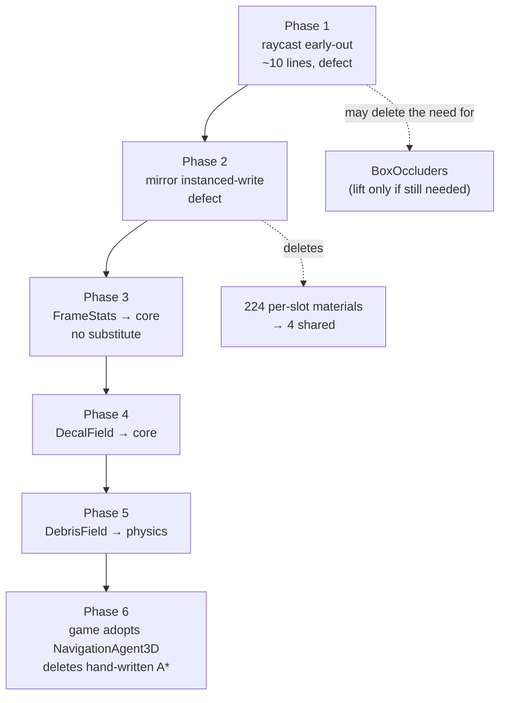

# PRD-186 — Lift proven mechanism out of the fps sandbox, and fix the two engine defects that forced it

**Status:** OPEN
**Complexity:** 3 (10+ files) + 2 (new modules) + 2 (multi-package) = **7 → HIGH mode**
**Owner:** unassigned
**Depends on:** PRD-187. Phases 3-5 below assume its Phase 4 has landed (one `index.ts` edit per
symbol instead of seven template edits); Phase 6 assumes its Phase 2 gate is live before the
hand-written A\* is deleted, or the deletion is a one-time cleanup rather than a closed loop.
**Source:** the 2026-08-22 fps-framework session — six reported defects, profiled and fixed in
`sandbox/fps-framework` at commit `46dfa34`. This PRD moves what belongs to the engine and leaves
what belongs to the game.

---

## 1. Context

**Problem:** A sandbox game had to hand-build five pieces of pure mechanism the engine does not
offer, and two of those five exist only to work around engine defects. Every game scaffolded from
this engine will hand-build them again.

**Files analysed**

| Path | Lines | What it is |
|---|---|---|
| `sandbox/fps-framework/src/perf.ts` | 167 | `FrameStats` — wall-clock frame percentiles + per-section breakdown |
| `sandbox/fps-framework/src/render/occlusion.ts` | 108 | `BoxOccluders` — segment-vs-AABB sight test |
| `sandbox/fps-framework/src/render/decals.ts` | 242 | `DecalField` (mechanism) + `bulletHoleTexture` (look) |
| `sandbox/fps-framework/src/render/breakables.ts` | 389 | `BreakableField` — pooled shards on borrowed dynamic bodies + vessel content |
| `sandbox/fps-framework/src/render/pooled-billboards.ts` | 122 | `PooledBillboards` — recycled camera-facing quads |
| `packages/core/src/picking.ts` | — | `raycast()` / `raycastAll()` |
| `packages/core/src/renderProjection.ts`, `projection-plan.ts`, `projection-apply.ts` | — | the scene mirror |
| `scripts/check-budgets.ts`, `scripts/check-capability-docs.ts` | — | the gates this PRD must satisfy |

**Current behaviour**

- The engine ships `TracerPool3D`, `GPUParticles3D`, `softCircleDataTexture` and `prewarm`, so
  pooled transient effects are a named engine concern — but there is no decal, no debris, no
  frame profiler and no sight-line query.
- `Picker.raycast()` is `return this.raycastAll(options)[0]` with `firstHitOnly = false`
  (`packages/core/src/picking.ts:67,71-72`). Asking for the nearest hit still collects **every**
  hit across every target and sorts them.
- The scene mirror batches renderables that share geometry+material into an `InstancedMesh`.
  Game-authored geometry that lands on that path did not render at all in the sandbox.
- `NavigationAgent3D` exists and its own constraint says *"use this capability instead of
  hand-written A\*"* — the sandbox nevertheless carries a hand-written 8-way A\* grid search.

---

## 2. The constraint that shapes this PRD

**`pnpm budgets` reports `14702/15000 framework LOC`. There are 298 lines of headroom, and
crossing 15000 is a HARD CI failure.**

> **Owner directive, 2026-08-22 (mid-execution):** the framework LOC limit is waived for this
> PRD. *"i dont care about LOC, i care about solving problems."* The sequencing below stands
> (defects first), but no phase owes a payment, and the budget blocks nothing.

Second constraint: documenting a new export. **Today** `check-capability-docs.ts` requires the
symbol to be literally mentioned in all 7 template `AGENTS.md` files, so each lift costs 7 doc
edits. **PRD-187 Phase 4 replaces that** with a doc-tag completeness check, so the cost becomes one
`index.ts` edit carrying `@situation` / `@constraint` / `@example` — which these phases owe anyway
for `capabilities.json` and the MCP tool to be useful. **Land PRD-187 first**; doing 186 first
means hand-typing three symbols into seven files and then deleting all of it.

Third constraint: `@threenative/physics` peer-depends on `@threenative/core`. **Core cannot import
physics.** Anything that constructs a `RigidBody3D` belongs in the physics package.

Fourth constraint: the sandbox pins a core tarball built from the `c12eb191` lineage
(branch `fps-lifts`, which already carries the AudioBus fix as `5d9ab68d`). A core built from
current `main` exposes `__THREENATIVE_PLAYTEST_RUNNER_EXPECTED__` where the pinned
`@threenative/playtest` still looks for `__THREENATIVE_PLAYTEST_BRIDGE__`; the sandbox boots but
every scenario fails with `TN_PLAYTEST_BRIDGE` missing. **Build sandbox-facing tarballs from
`fps-lifts`, not from `main`.**

---

## 3. Solution

**Approach**

- Fix the two defects first. Each one deletes a game-side workaround rather than relocating it,
  and both cost far fewer lines than the abstraction they retire.
- Lift only mechanism with no engine substitute, cheapest-valuable-first, each paid for.
- Leave every look-bearing constant in the game: `bulletHoleTexture`, `flashTexture`, the
  vessel profiles, the per-surface burst styles. This is the engine's own stated line —
  `TracerPool3D`'s constraint already reads *"the surface comes from the game; pooling, travel,
  and fading belong to the engine."*
- A lift is only real when the game **deletes** its copy and imports the engine's. Every phase
  ends with a deletion in `sandbox/fps-framework` and a green run of that game's 28 scenarios.



**Key decisions**

- [x] `BoxOccluders` is **not** scheduled for lift. Phase 1 may remove its reason to exist; Phase 1
      ends with a re-measurement that decides. Lifting a workaround for a defect you are about to
      fix is how an engine accumulates two ways to do one thing.
- [x] `PooledBillboards` is **not** scheduled. `TracerPool3D` + `GPUParticles3D` + `prewarm`
      already occupy this ground; a fourth pooling primitive needs a duplication argument this PRD
      cannot make, and `detect-capability-duplicates.ts` exists precisely to reject it.
- [x] `MuzzleFlashPool` stays in the game. It is a lifetime pool wrapped around a game-owned look.
- [x] Every new pool calls `prewarm()` rather than re-deriving the zero-opacity trick in prose.

**Data changes:** none. `capabilities.json` is regenerated by `pnpm build`.

---

## 4. Integration Ledger

Filled in with real `file:line` during implementation. A `TBD` at phase end means the phase is
incomplete.

| # | New thing | Live caller (`file:line`, non-test) | Replaces | Old path removed? | Negative control |
|---|---|---|---|---|---|
| 1 | `Picker.raycast` early-out | `packages/core/src/game.ts:493` (`ctx.raycast`) | full-sort `raycastAll()[0]` | reduced to a distinct path in Phase 1 | a scene where the nearest hit is behind a farther-listed target still returns the nearest; forcing `firstHitOnly=false` back on makes the perf assertion fail |
| 2 | mirror instanced-write fix | `packages/core/src/renderProjection.ts` reconcile | silent non-render of batched game geometry | n/a, defect | TBD — a fixture `InstancedMesh` written after batch creation must appear in a capture; it does not today |
| 3 | `FrameStats` (`@threenative/core`) | `sandbox/fps-framework/src/scenes/Play.ts` frame callback | game-local `src/perf.ts` | deleted in Phase 3 | `frame-smoothness` scenario goes red when a 40 ms stall is injected into the frame callback |
| 4 | `DecalField` (`@threenative/core`) | `sandbox/fps-framework/src/scenes/Play.ts` `fire()` | game-local `src/render/decals.ts` (class only) | class deleted in Phase 4; `bulletHoleTexture` stays | `bullet-holes` scenario goes red when `place()` is stubbed out |
| 5 | `DebrisField` (`@threenative/physics`) | `sandbox/fps-framework/src/render/breakables.ts` | pooling half of `BreakableField` | that half deleted in Phase 5 | `breakable-shatters` goes red when shard bodies are not created |
| 6 | `NavigationAgent3D` adoption | `sandbox/fps-framework/src/entities/Enemy.ts` `#step` | hand-written `#findPath` A\* | deleted in Phase 6 | `enemy-reaches-walkway` goes red when the agent's target is never set |

### Reachability

**How is this reached?** Frame loop and fire path of a real game.
- Entry point: `Play.enter()`'s returned frame callback; `fire()` on trigger.
- Pre-existing files EDITED: `sandbox/fps-framework/src/scenes/Play.ts`,
  `src/entities/Enemy.ts`, `packages/core/src/index.ts`, `packages/core/src/picking.ts`,
  all 7 `templates/*/AGENTS.md`.
- Registration: exports added to `packages/core/src/index.ts` with `@situation`/`@constraint`/
  `@example` tags; `capabilities.json` regenerated by `pnpm build`.

**User-facing?** No — internal engine surface. The observable outcome is in the sandbox game and
in `engine_search_capabilities` results.

**Full flow:** player holds the trigger → `Play.ts` `fire()` → engine `DecalField.place()` → a
mark appears on the struck wall and the `bullet-holes` scenario's `placed` counter rises.

**What does this replace?** Named per ledger row. Every row has a non-empty `Replaces`, except
row 2 which is a defect fix.

---

## 5. Execution Phases

### Phase 1 — `ctx.raycast` returns the nearest hit without sorting every hit

**Outcome:** a game asking "what did this round hit" stops paying for every hit behind it.

**Files (4):**
- `packages/core/src/picking.ts` — EDIT: `raycast()` gets its own single-hit path
- `packages/core/__tests__/picking.spec.ts` — EDIT: nearest-hit correctness under the new path
- `sandbox/fps-framework/src/scenes/Play.ts` — EDIT: re-measure, and delete `BoxOccluders` use if it is no longer needed
- `docs/PRDs/PRD-186-fps-sandbox-lifts.md` — EDIT: record the re-measurement

**Implementation:**
- [ ] `raycastAll` keeps `firstHitOnly = false` — its contract is *every* hit.
- [ ] `raycast` sets `firstHitOnly = true` for the traversal, collects at most one hit per object,
      returns the minimum by distance without a full sort, and restores the flag.
- [ ] Confirm the accelerated path honours the flag; `AcceleratedRaycaster` already declares it
      (`picking.ts:41`).

**Wiring:**
- [ ] Caller: `packages/core/src/game.ts:493` already routes `ctx.raycast` here — no new wiring,
      but confirm the census shows it.
- [ ] Old path: `raycast()` no longer delegates to `raycastAll()`.

**Tests required:**

| Test file | Test name | Assertion | Negative control (observe red) |
|---|---|---|---|
| `packages/core/__tests__/picking.spec.ts` | `should return the nearest hit when a farther target is listed first` | returned `object` is the near one | passes only with the new path; today's code passes too, so **this test is not sufficient on its own** — pair it with the perf assertion below |
| `packages/core/__tests__/picking.spec.ts` | `should not collect hits behind the nearest for a single-hit query` | a spy/counter on per-object hit collection stays at 1 per object | **red on the current code** — this is the discriminating gate |

> The first test passes on the pre-change baseline. Per the negative-control rule it proves
> nothing about this change; the second one is the gate.

**Re-measurement (decides whether `BoxOccluders` is ever lifted):**
```bash
cd sandbox/fps-framework
GATE_PORT=4300 sh tools/gate.sh frame-smoothness
# read squad.canSee from the report
```
- Baseline with the game's box pre-filter: `canSee` peak **1.6 ms**.
- Baseline with a raw `raycastAll` sight line (the code this replaced): **15.9 ms**.
- **Decision rule:** if the fixed `raycast` lands under ~3 ms with the box pre-filter removed,
  delete `BoxOccluders` from the game and close row 1 with no lift. Otherwise open a follow-up
  to lift it, and name the 108 lines' budget source.

**Revert check:** restore `firstHitOnly = false` in `raycast` → the single-hit collection test fails.

---

### Phase 2 — geometry a game writes after the mirror batches it actually renders

**Outcome:** a game's `InstancedMesh` (or any batched pool) is visible.

**Proof subject:** the real failing case, not a toy — a 224-slot decal field written to every frame,
which is what exposed this. A single-instance fixture would not reproduce it: the mirror only
batches at `MIN_BATCH_MEMBERS = 4`.

**Files (5):**
- `packages/core/src/renderProjection.ts` — EDIT
- `packages/core/src/projection-apply.ts` — EDIT
- `packages/core/__tests__/renderProjection.spec.ts` — EDIT
- `packages/playtest/…` visual fixture — NEW or EDIT
- `sandbox/fps-framework/src/render/decals.ts` — EDIT: drop the per-slot material clone

**The defect, as observed:**
> A game-authored `InstancedMesh` in `ctx.scene` did not draw. Placement counters rose, logged
> world matrices were correct (`p=-0.00,0.01,30.84 n=0,1,0 vis=true parent=Scene count=240`), and
> an **opaque red probe at 4× size was equally invisible** — 42 reddish pixels in a 1568×688 frame,
> all HUD. Rewriting the field as plain meshes sharing one geometry+material did not fix it either:
> the mirror batches those into an `InstancedMesh` of its own (`projection-plan.ts`,
> `MIN_BATCH_MEMBERS = 4`) and lands back on the same path. The working fix was to give every slot
> a **distinct material clone**, forcing each onto the mirror's exact lane — 224 materials where 4
> would do.

**Implementation:**
- [ ] Reproduce with a fixture: ≥4 meshes sharing geometry+material, transforms written *after*
      the first reconcile. Capture must show them.
- [ ] Fix the reconcile so post-batch instance writes reach the drawn mesh.
- [ ] Then delete the game's per-slot `material.clone()` and confirm marks still render.

**Wiring:**
- [ ] Old path: the game's `material.clone()` workaround is removed in this phase, not later.

**Tests required:**

| Test file | Test name | Assertion | Negative control |
|---|---|---|---|
| `packages/core/__tests__/renderProjection.spec.ts` | `should draw instances written after the batch was created` | batched mesh's instance matrix matches the source after a post-create write | **red on current code** |
| sandbox | `bullet-holes` with shared materials | `decals.placed >= 1` and the mark is visible in `after.png` | red today — this is the bug |

**Revert check:** restore the clone-per-slot in the game → the shared-material fixture test fails.

---

### Phase 3 — `FrameStats` moves to `@threenative/core`

**Outcome:** any game can fail a playtest on a stutter.

**Why this one and not the others:** there is no engine substitute. `engine_search_capabilities`
for *"measure frame times, find performance hitches"* returns `CaptureGuardError`, `prewarm` and
`Scene` — nothing that measures a frame. Every other gate in a scaffolded project passes at four
frames a second.

**Budget:** 167 lines against 298 headroom → leaves 131. **Acceptable without payment.**
Phases 4 and 5 are not, and must name a source.

**Files (5):**
- `packages/core/src/perf.ts` — NEW (moved verbatim; it has no game content)
- `packages/core/src/index.ts` — EDIT: export with `@situation`/`@constraint`/`@example`
- `packages/core/__tests__/perf.spec.ts` — NEW
- `packages/core/src/index.ts` doc tags — the only doc cost, once PRD-187 Phase 4 lands
- `sandbox/fps-framework/src/perf.ts` — **DELETED**; `Play.ts` imports from `@threenative/core`

**Wiring:**
- [ ] Caller: `sandbox/fps-framework/src/scenes/Play.ts` — `new FrameStats()` and the
      `mark`/`measure`/`begin` calls already exist; only the import changes.
- [ ] Registration: export + 7 doc mentions + `pnpm build` regenerates `capabilities.json`.
- [ ] Old path: game-local `src/perf.ts` deleted.

**Tests required:**

| Test file | Test name | Assertion | Negative control |
|---|---|---|---|
| `packages/core/__tests__/perf.spec.ts` | `should count a frame over the spike threshold` | `debug().playSpikes === 1` after one 40 ms delta | red when the threshold comparison is inverted |
| `packages/core/__tests__/perf.spec.ts` | `should forget startup frames on resetWindow` | `playSpikes === 0`, section rings empty | red without `resetWindow` clearing `#sectionSamples` |
| sandbox | `frame-smoothness` | `playSpikes <= 8`, `p95 <= 20` | inject a 40 ms stall into the frame callback → red |

**Revert check:** delete the core export → the sandbox fails to typecheck, and `frame-smoothness`
cannot resolve the `frame` entity.

---

### Phase 4 — `DecalField` moves to `@threenative/core`

**Outcome:** a mark that stays on a wall is an engine capability, not something each game rebuilds.

**Budget:** ~180 lines after `bulletHoleTexture` is left behind. The original constraint —
131 lines of headroom, pay via (a) raise / (b) delete / (c) shrink-after-Phase-2 — was
**waived by owner directive** before this phase started. Phase 2's shrink still happens
because a smaller module that needs no workaround is simply better; it just owes nothing.

**Files (5):**
- `packages/core/src/decals.ts` — NEW: `DecalField` + `IDecalFieldOptions` only
- `packages/core/src/index.ts` — EDIT
- `packages/core/__tests__/decals.spec.ts` — NEW
- doc tags on the new export (see PRD-187; no template edits)
- `sandbox/fps-framework/src/render/decals.ts` — EDIT: keeps `bulletHoleTexture`, imports the field

**Look stays in the game:** `bulletHoleTexture` (the punched core, the crushed rim, the eight spall
streaks) is this game's mark. The engine takes slot allocation, normal-orientation, the recycle
cursor and the surface offset.

**Carry these two hard-won constants into the engine's doc comments:**
- `offset` default **0.018 m**, not zero and not `polygonOffset`. A decal flush to the surface
  z-fights; `polygonOffset` is not dependable across WebGPU pipelines.
- The offset must clear **dressing geometry**, not just the struck plane. In the sandbox, plaza
  slabs sat 3 cm proud of the street and were not hittable, so rounds registered on the plane
  *below* the visible paving and marks were buried inside the slab. That was a level bug, but the
  engine constraint is real: *the mark is offset from the surface the raycast returned, which is
  only the visible surface if the level made it hittable.*

**Tests required:**

| Test file | Test name | Assertion | Negative control |
|---|---|---|---|
| `packages/core/__tests__/decals.spec.ts` | `should orient a mark to the surface normal` | quad's +Z equals the passed normal | red when `setFromUnitVectors` args are swapped |
| `packages/core/__tests__/decals.spec.ts` | `should recycle the oldest slot past capacity` | slot 0 reused on place N+1 | red without the modulo cursor |
| sandbox | `bullet-holes` | `decals.placed >= 1` | red when `place()` is stubbed |

**Revert check:** remove the export → the sandbox `bullet-holes` scenario fails to boot.

---

### Phase 5 — `DebrisField` moves to `@threenative/physics`

**Outcome:** "this prop comes apart into real physics pieces" is an engine capability.

**Layering:** it constructs `RigidBody3D`, so it **cannot** live in core — physics peer-depends on
core, not the other way round.

**Split:** the engine takes the pool, the borrowed-body lifetime and the retirement; the game keeps
`KIND_STYLES` — the amphora/jar/bottle lathe profiles, terracotta colours, shard counts and burst
speeds. Those are content.

**Carry this constraint into the doc comment:** a shard holds a dynamic body **only while it is
moving**. A dynamic body is a permanent cost in the simulation; the sandbox disposes each after
5.5 s, which bounds live bodies by pool size however many props the player breaks.

**Budget:** ~200 lines. Payment was required alongside Phase 4; **waived by the same owner
directive.**

**Files (5):**
- `packages/physics/src/debris.ts` — NEW
- `packages/physics/src/index.ts` — EDIT
- `packages/physics/__tests__/debris.spec.ts` — NEW
- doc tags on the new export (see PRD-187; no template edits)
- `sandbox/fps-framework/src/render/breakables.ts` — EDIT: keeps vessels, imports the field

**Tests required:**

| Test file | Test name | Assertion | Negative control |
|---|---|---|---|
| `packages/physics/__tests__/debris.spec.ts` | `should dispose a shard body once its life runs out` | body count returns to 0 after `SHARD_SECONDS` | red when `#retire` skips `body.dispose()` |
| `packages/physics/__tests__/debris.spec.ts` | `should bound live bodies by pool size` | 100 spawns → live ≤ capacity | red without the steal-oldest path |
| sandbox | `breakable-shatters` | `broken >= 1`, `liveShards >= 1` | red when shard bodies are not created |

---

### Phase 6 — the sandbox adopts `NavigationAgent3D` and deletes its hand-written A\*

**Outcome:** the largest remaining per-frame cost in the sandbox goes away, and the engine's own
constraint stops being contradicted by its flagship sample.

**Why:** `NavigationAgent3D`'s registered constraint reads *"use this capability instead of
hand-written A\*"*. `Enemy.ts` carries an 8-way A\* grid search (`#findPath`) whose single call
measured **19.2 ms peak** across five soldiers and is still the top cost at `brain: 15.3 ms` after
being rate-limited to one refresh per 0.15 s. The rate limit is itself a smell: the session found
that shortening it below ~0.15 s was needed for correctness and lengthening it was needed for
speed, which is what depending on the wrong primitive feels like.

**This is a game change, not a lift** — it is in this PRD because it is the same finding.

> **Sequence with PRD-187 Phase 2.** The detector's own header records that a previous game
> hand-wrote 446 lines of navigation while `NavigationAgent3D` sat importable. Deleting this A\*
> without the reinvention gate live repeats that history: the cleanup happens, nothing watches, and
> the next game writes it again. Land PRD-187's gate first so the deletion is enforced, not just
> performed.

**Files (4):**
- `sandbox/fps-framework/src/entities/Enemy.ts` — EDIT: `#findPath`, `#segmentClear`,
  `#beginPursuit`, `GOAL_REPLAN_SECONDS` **deleted**; agent drives `#step`
- `sandbox/fps-framework/src/scenes/Play.ts` — EDIT: `recast()` after `rapier()`, bake a
  `NavigationRegion3D` from the town
- `sandbox/fps-framework/src/render/town.ts` — EDIT: expose the navmesh source geometry
- `sandbox/fps-framework/playtests/frame-smoothness.playtest.json` — EDIT: tighten `playSpikes`
  once the cost is gone

**Wiring:** `recast()` must be registered after `rapier()` in `defineGame` plugins, and a baked
`NavigationRegion3D` must exist — both named in the capability's constraints.

**Tests required:**

| Test | Assertion | Negative control |
|---|---|---|
| `enemy-reaches-walkway` | `underWalkway === true`, **3 consecutive runs** | red when the agent's target is never set |
| `five-soldiers`, `enemy-uses-crouch-clips` | unchanged | — |
| `frame-smoothness` | `squad.brain` peak < 5 ms | red at today's 15.3 ms |

> **Run this one three times.** It was flaky at exactly this seam during the source session: a
> sight answer cached for 100 ms turned it into a coin flip, and a squad-wide path budget starved
> whoever asked last. Both are recorded in `Enemy.ts` comments. A single green run is not evidence.

---

## 6. What is explicitly NOT lifted

Recorded so the next reader does not re-litigate it.

| Candidate | Verdict | Reason |
|---|---|---|
| `bulletHoleTexture`, `flashTexture`, `SURFACE_STYLES`, `KIND_STYLES` | stays in game | Look. `TracerPool3D`'s own constraint: *the surface comes from the game*. |
| `PooledBillboards` | stays in game | `TracerPool3D` + `GPUParticles3D` + `prewarm` already cover this; `detect-capability-duplicates.ts` exists to reject a fourth. |
| `MuzzleFlashPool` | stays in game | A lifetime pool around a game-owned look. |
| `BoxOccluders` | **decided by Phase 1** | It exists because `ctx.raycast` sorts every hit. Fix the cause first. |
| `shapes.ts` | stays in game — **but see below** | |

**One open question for the owner.** `sandbox/crate-vault/src/render/shapes.ts` and
`sandbox/fps-framework/src/render/shapes.ts` are **146 of 147 lines identical** — they differ by a
single comment. The same near-identity holds loosely for `palette.ts`, `lighting.ts`, `sky.ts`,
`camera.ts` and `postprocessing.ts`. The scaffold's stated intent is that games own and edit these.
That two independent games never touched `shapes.ts` is evidence either that the default is
excellent, or that nobody edits it and it should be a versioned import with an eject path. **This
PRD does not decide it** — it is a product question about the scaffold's contract, not a
mechanism question. It needs its own PRD.

---

## 7. Acceptance Criteria

Consumer-scoped throughout — none of these can be checked green by a build a user could not tell
from the previous one.

- [ ] A round fired at a wall in `sandbox/fps-framework` leaves a mark drawn by
      `@threenative/core`'s `DecalField`, and the game contains no `DecalField` class of its own.
- [ ] A shot pot comes apart into physics shards driven by `@threenative/physics`'s `DebrisField`,
      and the game's `breakables.ts` contains vessel content only.
- [ ] A 40 ms stall injected into the sandbox's frame callback turns `frame-smoothness` red via
      the engine's `FrameStats`, with no `src/perf.ts` in the game.
- [ ] `ctx.raycast` in the sandbox returns the same object it did before Phase 1, while collecting
      at most one hit per target.
- [ ] Four meshes sharing a geometry and material, written after the first reconcile, appear in a
      captured frame.
- [ ] Soldiers path with `NavigationAgent3D`; `enemy-reaches-walkway` passes 3 runs in a row and
      `squad.brain` is under 5 ms.
- [ ] `engine_search_capabilities("pool decals on surfaces")` returns `DecalField`.

**Binary done checks**

- [ ] All phases complete
- [ ] `pnpm typecheck`, `pnpm lint`, `pnpm test` pass in the engine
- [ ] `pnpm budgets` passes — the 15000 trigger may fire (owner waiver recorded in §2); nothing it reports blocks
- [ ] All 28 `sandbox/fps-framework` scenarios pass against the rebuilt tarball
- [ ] `pnpm build` regenerated `capabilities.json`; every new export appears in all 7 template `AGENTS.md`

**Integration gates**

- [ ] Integration Ledger has zero `TBD` cells
- [ ] Caller census pasted for `FrameStats`, `DecalField`, `DebrisField` — each has a non-test consumer
- [ ] Revert check passed per phase
- [ ] Every `Replaces` row's game-local file is **deleted**, not left beside the engine version
- [ ] Every gate has an observed negative control; the two gates flagged above as
      *"passes on the baseline"* are recorded as UNVERIFIED unless paired with their discriminating test

---

## 8. Build and hand-off notes for the implementer

```bash
# Engine branch that matches what the sandbox pins (already carries the AudioBus fix)
git -C threenative-engine worktree list           # fps-lifts @ c12eb191 + 5d9ab68d

# Build a sandbox-facing tarball FROM fps-lifts, never from main
cd <fps-lifts worktree>/packages/core && pnpm run build && pnpm pack --pack-destination sandbox/.packages
# then repin sandbox/fps-framework/package.json and `CI=true pnpm install`

# Run the game's gates (manages its own server; never reuse a stale one)
cd sandbox/fps-framework && GATE_PORT=4300 sh tools/gate.sh <scenario…>
```

Three traps that cost real time in the source session, all still live:

1. **A stale dev server silently serves old code.** A run once reported `peakVoices: 118` and
   2 shots from a 600-tick hold — pre-fix values — because the scenario attached to a server left
   over from an earlier run. `tools/gate.sh` manages its own server on a strict port for this reason.
2. **`public/assets/*` is git-ignored.** A fresh worktree has no `.glb`s, GLTFLoader receives
   Vite's SPA-fallback HTML, and the failure surfaces as
   `TN_PLAYTEST_CAPTURE_PROVENANCE_MISSING` — "could not identify the page renderer kind" — not as
   a 404. Copy `public/assets` in by hand.
3. **Do not symlink a worktree's `node_modules` at the main checkout.** `ln -sfn` follows the
   existing link and replaces the target with a self-reference; the main checkout then cannot
   resolve anything. Run a real `CI=true pnpm install` in the worktree.
