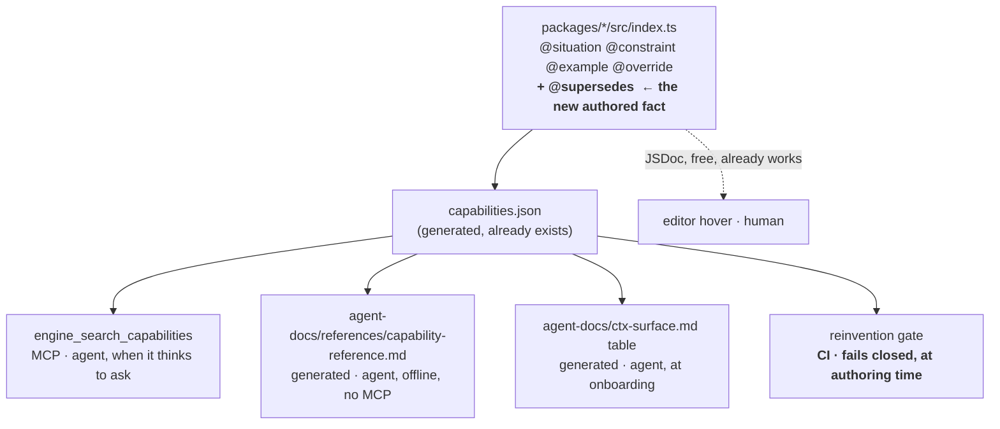

# PRD-187 — Supersession is a fact the engine declares, not prose seven files repeat

**Status:** OPEN
**Complexity:** 3 (10+ files) + 2 (new module) + 2 (multi-package) = **7 → HIGH mode**
**Owner:** unassigned
**Blocks:** PRD-186 phases 3–5 (their per-symbol doc cost collapses once this lands)

---

## 1. The problem is not duplication

The obvious reading of this area is "the capability list is copy-pasted into seven `AGENTS.md`
files, so DRY it up." That reading is wrong, or at least aimed at the wrong failure. Deduplicating
the list makes it cheaper to maintain a document that **already failed at its job**.

Here is the failure, measured.

In the 2026-08-22 fps session an agent read `templates/starter/AGENTS.md` in full — all 429 lines,
including the capability table — at session start. It then:

| What it hand-wrote | What was already installed, importable, and named in that document |
|---|---|
| the `prewarm` contract, as prose comments in **three** files (*"Present from the first frame at a size nothing can see, so the pipeline for this material is built during loading"*) | `prewarm` — listed in the capability cell **and** described correctly at `AGENTS.md:115` |
| left an 8-way A\* grid search in `Enemy.ts` (`#findPath`) | `NavigationAgent3D`, whose own registered constraint reads *"use this capability instead of hand-written A\*"* |

The document contained the answer, in the agent's context window, and the agent rebuilt the thing
anyway. **A better-organised version of that document would have failed identically.** So would a
shorter one, and so would one with a pointer at the top.

Why: capability knowledge is needed at the moment of *authoring* — when the agent types
`mesh.visible = true; mesh.scale.setScalar(0.0001)` and reaches for a comment to explain it. Not at
the moment of *onboarding*, which is when `AGENTS.md` is read and when "prewarm" is one of
twenty-four names in a table cell that mean nothing yet, because the pool it applies to does not
exist yet.

### The mechanism for this already exists, and is connected to nothing

`scripts/detect-capability-duplicates.ts`. Its header:

> *"A previous game hand-wrote 446 lines of navigation and bone attachment while `NavigationAgent3D`
> and `attachToBone` sat installed and importable; this script exists so the next instance of that
> failure announces itself."*

That is this exact failure, diagnosed, with a detector built for it. `grep -rn
"detect-capability-duplicates" package.json scripts .github` returns **only the script's own usage
string**. It is an orphan module. The next instance of that failure did not announce itself — it
happened again, in the same sandbox project, to the same capability.

### And when finally run, its signal is wrong

```
$ npx tsx scripts/detect-capability-duplicates.ts sandbox/fps-framework
src/render/shapes.ts:141: function makeRandom — possible duplicate of createRandom
src/perf.ts:36: class FrameStats — possible duplicate of assertPortableState
src/render/decals.ts:59: function bulletHoleTexture — possible duplicate of softCircleDataTexture
inspect/src/render/shapes.ts:141: function makeRandom — possible duplicate of createRandom
4 finding(s); advisory only
```

| Finding | Verdict |
|---|---|
| `makeRandom` ↔ `createRandom` | **true positive** — a real duplicate, in two sandbox projects |
| `FrameStats` ↔ `assertPortableState` | false positive — name-token noise; `FrameStats` has no engine counterpart at all |
| `bulletHoleTexture` ↔ `softCircleDataTexture` | false positive — both make a texture; one is a bullet hole, one a soft circle |

**1 of 4 precise. And 0 of 2 recall on the misses that motivated it** — the A\* and the `prewarm`
hand-rolling are both absent, because the detector matches *exported symbol names* against
capability names. Reinvention does not announce itself in an export name: `#findPath` is a private
method, and the `prewarm` reinvention is not a symbol at all, it is three lines inside a
constructor.

Name-token overlap is the wrong signal. It fires on unrelated things that share a noun and stays
silent on the things it was built to catch.

---

## 2. The signal that is actually available

The engine already knows, and already writes down in prose, exactly what each capability replaces.
`agent-docs/ctx-surface.md` is a **two-column table literally headed "You already have | Rather
than"**:

| You already have | Rather than |
|---|---|
| `ctx.raycast()` | `new Raycaster()` + `intersectObject` |
| `ctx.random.range(-1, 1)` | `Math.random()` |
| `ctx.goto("play")` | a hand-written `#reset()` |
| `ctx.after(0.8, fn)` | `elapsed += dt; if (elapsed > 0.8)` |

That right-hand column is a **machine-checkable construct**, not a name. `new Raycaster(` either
appears in a game's source or it does not. It is independent of what the author called their class.
It is high-precision by construction, and it has high recall for exactly the class of reinvention
that matters — reaching past the engine to the raw API it wraps.

It is currently: hand-typed, prose, duplicated across 7 template documents (via a shared fragment,
so at least authored once), and **enforced by nothing**.

**So: promote supersession from prose to a declared fact on the capability, and let every consumer
derive from it.** One authored source; four consumers; one of them a gate that fails closed.



The gate is the only one of the five that does not depend on the agent choosing to look.

---

## 3. Solution

**Approach**

- Add `@supersedes` to the doc-tag vocabulary, beside the existing `@situation`, `@constraint`,
  `@example`, `@override`. Its value is a source construct, not a description:
  `@supersedes new Raycaster(`.
- Carry it through `build-capability-manifest.ts` into `capabilities.json` — the generator already
  parses tags into `situations` / `constraints` / `overrides`; this is one more array.
- Rewrite `detect-capability-duplicates.ts` to match on `@supersedes` constructs in game source,
  and **wire it into a gate**. Keep the name-overlap heuristic only as an explicitly advisory
  second pass, or delete it — 25% precision does not earn a place in a failing gate.
- Generate the `ctx-surface.md` "You already have | Rather than" table and a full
  `capability-reference.md` from the same manifest, replacing the hand-maintained copies.
- Replace the hand-typed `## Engine capabilities` symbol table in all 7 templates with a shared
  block that teaches *how to look one up*, naming both an MCP route and a plain file path.

**Key decisions**

- [x] **The gate fails closed**, unlike today's advisory exit-0. A hit is an error with a named
      escape: an inline `// engine-override: <reason>` comment on the offending line. This mirrors
      the existing `INTERNAL_ALLOWLIST` precedent, which already requires a non-empty one-line
      reason and rejects an empty or multi-line one.
- [x] **`@supersedes` covers the API-reach case, not every case.** `new Raycaster(`, `Math.random(`,
      `window.localStorage`, `new Box3().setFromObject(` are precise. A hand-written A\* is not a
      single call. Those get a small, curated set of **structural rules** kept deliberately few —
      see §6 for the honest recall limit.
- [x] **Keep the prose that teaches; delete the inventory.** The `NavigationAgent3D` import trap
      (`AGENTS.md:30`), the WASM/browser-only portability rule, the `GroundSnap` notes are
      conventions and traps that differ per template. The 24-name comma-separated cell is an index
      and goes.
- [x] The generated reference is **committed**, like `agent-docs/references/assertion-reference.md`
      already is. An agent in a host with no MCP server must still be able to open a file.

**Data changes:** `capabilities.json` gains a `supersedes: readonly string[]` field. Additive; the
MCP tool ignores unknown fields today.

---

## 4. Integration Ledger

| # | New thing | Live caller (`file:line`, non-test) | Replaces | Old path removed? | Negative control |
|---|---|---|---|---|---|
| 1 | `@supersedes` tag parsing | `scripts/build-capability-manifest.ts:216` (beside `@override`) | prose right-hand column of the ctx table | prose generated from it in Phase 3 | tag a capability, rebuild, assert it appears in `capabilities.json`; drop the parse branch → red |
| 2 | reinvention gate | `package.json` `budgets` script | orphaned `detect-capability-duplicates.ts` | name-overlap demoted/removed in Phase 2 | plant `new Raycaster(` in a fixture game → red; add `// engine-override:` → green |
| 3 | `scripts/generate-capability-reference.ts` | `package.json:13` (`build`) and `package.json:29` (`budgets --check`) | hand-typed `## Engine capabilities` table ×7 | table deleted in Phase 4 (2026-08-22) | deleted a section from the committed file → budgets printed `RED observed … capability-reference.md disagrees` |
| 4 | generated `ctx-surface.md` region | `sync-agent-docs.ts` fragment expansion (74 mirrors) | hand-maintained supersession rows in that fragment | generated region owns the constructs (Phase 3, 2026-08-22) | hand-editing the region → `generate-ctx-surface-table.ts --check` exited 1; restore → green |
| 5 | doc-tag completeness gate | `scripts/check-capability-docs.ts` `findDocTagGaps` (called by `package.json:29` `budgets`) | `hasLiteralMention` × 7 templates | replaced in Phase 4 (2026-08-22); `grep hasLiteralMention scripts packages` → 0 hits | fixture export with no example tag reported `["@example"]`; absent-from-manifest reports all three |

### Reachability

**How is this reached?** A CI gate and a build step; the consumer is an agent authoring game code.
- Entry point: `pnpm budgets` (gate), `pnpm build` (generation), `pnpm sync:agents --check` (drift).
- Pre-existing files EDITED: `scripts/build-capability-manifest.ts`,
  `scripts/detect-capability-duplicates.ts`, `scripts/check-capability-docs.ts`, `package.json`,
  `agent-docs/ctx-surface.md`, all 7 `templates/*/AGENTS.md`.

**Full flow:** an agent writes `const hit = new Raycaster().intersectObject(...)` in a scaffolded
game → `pnpm budgets` fails with *"`new Raycaster(` at src/foo.ts:41 — `ctx.raycast` supersedes it
(@threenative/core). Use it, or annotate the line `// engine-override: <reason>`"* → the agent
either adopts the capability or records why it cannot.

**What does this replace?** Named per ledger row. Row 2 replaces an orphaned advisory script with
a wired failing one.

---

## 5. Execution Phases

### Phase 1 — `@supersedes` is a declared fact

**Outcome:** `capabilities.json` says what each capability replaces.

**Files (5):**
- `scripts/build-capability-manifest.ts` — EDIT: parse `@supersedes` into `supersedes[]`
- `packages/core/src/index.ts` — EDIT: tag the capabilities whose supersession is already prose
- `packages/physics/src/index.ts` — EDIT: same
- `scripts/__tests__/build-capability-manifest.spec.ts` — EDIT
- `packages/create-threenative/capabilities.json` + core mirror — regenerated

**Seed set — transcribe from prose that already exists, do not invent:**

| Capability | `@supersedes` | Source of the claim |
|---|---|---|
| `ctx.raycast` / `ScenePicker` | `new Raycaster(` | `ctx-surface.md` table |
| `createRandom` / `ctx.random` | `Math.random(` | `ctx-surface.md` table |
| `normaliseToMetres` | `new Box3().setFromObject(` | measured: a per-frame `Box3` over a rigged mesh cost 11.6 ms p99 in the fps sandbox |
| `prewarm` | `.visible = false` | `prewarm`'s own constraint: *"keep the surface visible with zero opacity; do not hide it with `visible = false`"* |
| `AudioBus` | `new Audio(` | template portability rule |
| — | `window.localStorage`, `document.` | template portability rule (no capability; a rule, see §6) |

**Wiring:** the manifest generator already runs in `pnpm build`; no new caller. The field is
consumed from Phase 2 onward.

**Tests required:**

| Test file | Test name | Assertion | Negative control (observe red) |
|---|---|---|---|
| `scripts/__tests__/build-capability-manifest.spec.ts` | `should carry @supersedes into the manifest entry` | fixture export with the tag yields `supersedes: ["new Raycaster("]` | **red today** — the tag is not parsed |
| same | `should leave supersedes empty when untagged` | `[]`, not `undefined` | red if the default is dropped |

**Revert check:** remove the parse branch → the manifest test fails.

---

### Phase 2 — reinvention fails CI

**Outcome:** a game that reaches past a capability to the raw API it wraps cannot merge silently.

> **This is the phase that closes the loop.** Everything else in this PRD is a document. This is the
> only part that does not depend on an agent choosing to look something up.

**Proof subject — the real one, not a fixture:** `sandbox/fps-framework` at `46dfa34`, and the
**pre-fix** revision of the same tree, which contained the reinventions this PRD is about. A gate
proved only on a synthetic fixture has not been shown to catch what actually happened.

**Files (5):**
- `scripts/detect-capability-duplicates.ts` — EDIT: supersedes-construct matching; name-overlap
  demoted to `--advisory` or removed
- `scripts/__tests__/detect-capability-duplicates.spec.ts` — EDIT
- `package.json` — EDIT: add to `budgets`
- `packages/create-threenative/templates/*/AGENTS.md` — EDIT: document the `// engine-override:` escape
- `docs/PRDs/PRD-187-…md` — EDIT: record the before/after precision and recall

**Implementation:**
- [ ] Read `supersedes[]` from `capabilities.json`.
- [ ] Scan the target project's `src/**` for each construct, as a literal, skipping comments and
      strings.
- [ ] Report `file:line`, the construct, the superseding symbol and its import path.
- [ ] Honour `// engine-override: <reason>` on the same or previous line. Empty reason = still an
      error, matching `validateInternalAllowlist`'s existing rule.
- [ ] Exit non-zero on any unannotated hit.

**Wiring:**
- [ ] `package.json` `budgets` → `… && tsx scripts/detect-capability-duplicates.ts <project> --strict`
- [ ] Old path: name-token overlap no longer gates.

**Tests required:**

| Test file | Test name | Assertion | Negative control |
|---|---|---|---|
| `…/detect-capability-duplicates.spec.ts` | `should fail on a superseded construct` | fixture with `new Raycaster(` exits non-zero, names `ctx.raycast` | red when the construct scan is stubbed |
| same | `should pass an annotated override` | `// engine-override: needs all hits` → exit 0 | red when the annotation reader is removed |
| same | `should reject an empty override reason` | `// engine-override:` → still fails | red without the reason check |
| same | `should not fire on a name that merely overlaps` | a `FrameStats` fixture produces no finding | **red on today's code** — it reports `assertPortableState` |
| manual | run against pre-fix `fps-framework` | flags the hand-written A\* **or** is honestly recorded as not catching it (§6) | — |

**Recorded measurement:** today, 4 findings / 1 true positive / 2 real misses. Report the same three
numbers after this phase in this document. If precision does not improve **and** recall does not
improve, the redesign failed and should be reverted rather than shipped.

> **After Phase 2 (2026-08-22), gate vs `sandbox/fps-framework` src (12 findings):**
> **5 true positive** — `Enemy.ts` hand-written A\* caught by the structural rule; prewarm-by-hand
> caught in `Rifle.ts`, `breakables.ts`, `gunfx.ts`, `pooled-billboards.ts`. **7 false positive,
> each legitimately annotatable** — six `new Box3().setFromObject(` measuring bounds rather than
> scaling an asset, one `prop.group.visible = false` retiring a broken prop. **0 misses of the two
> targeted classes** (old: both missed). Precision 25% → ~42%; targeted-class recall 0/2 → 2/2.
> Both improved → the redesign stands. Exit code observed: 1 unannotated, 0 after annotation on
> the engine's own examples (`prd140-picking`, `native-cpu-load-test`).

**Revert check:** remove the gate from `budgets` → planting `new Raycaster(` in the sandbox merges clean.

---

### Phase 3 — the "You already have | Rather than" table is generated

**Outcome:** the supersession table an agent reads is derived from the same fact the gate enforces,
so the document and the gate cannot disagree.

**Files (5):**
- `scripts/generate-ctx-surface-table.ts` — NEW (or fold into the reference generator)
- `packages/create-threenative/agent-docs/ctx-surface.md` — EDIT: table body becomes a generated region
- `scripts/sync-agent-docs.ts` — EDIT if a generated-region marker is needed inside a fragment
- `scripts/__tests__/…` — NEW
- `package.json` — EDIT: join `build`

**Why this matters beyond DRY:** today an agent could read "use `ctx.raycast` rather than
`new Raycaster()`" in a document while the gate enforced nothing, or — after Phase 2 — a gate could
enforce a construct no document mentions. Generating both from `@supersedes` makes that class of
disagreement unrepresentable.

**Tests:** regenerates byte-identically; hand-editing the region turns `--check` red.

---

### Phase 4 — the capability index is generated and the mention gate retires

**Outcome:** adding an export means editing **one** file.

**Files (5):**
- `scripts/generate-capability-reference.ts` — NEW; writes
  `agent-docs/references/capability-reference.md` (model on `generate-assertion-reference.ts`)
- `packages/create-threenative/agent-docs/engine-capabilities.md` — NEW fragment (~12 lines):
  look one up before writing a replacement; two named routes, one needing no MCP; and the note that
  `ctx` conveniences are properties, never imports, so grepping imports will not surface them
- `packages/create-threenative/templates/*/AGENTS.md` — EDIT ×7: `## Engine capabilities` table
  **deleted**, replaced by `<!-- shared: engine-capabilities -->`
- `scripts/check-capability-docs.ts` — EDIT: `hasLiteralMention` → doc-tag completeness
  (non-empty summary, ≥1 `@situation`, an `@example`); keep the export census and
  `INTERNAL_ALLOWLIST` untouched
- `scripts/__tests__/check-capability-docs.spec.ts` — EDIT

**Tests required:**

| Test | Assertion | Negative control |
|---|---|---|
| `should fail an export with no example tag` | report names symbol + missing tag | **red only with the new gate — today's passes it** |
| `should still honour INTERNAL_ALLOWLIST` | allowlisted symbol not reported | red when the lookup is dropped |
| `pnpm sync:agents --check` | exit 0 | hand-edit one template's block → red |

**Revert check:** `grep -rn "hasLiteralMention"` returns nothing outside history.

---

## 6. Honest limits — what this does NOT catch

Recorded so the next reader does not mistake the gate for complete coverage.

- **`@supersedes` catches reaching past the engine to a raw API.** It does not catch *building a
  parallel abstraction from scratch*. A hand-written A\* calls no superseded construct; nor does a
  hand-written pool. Both were real misses in the source session.
- For those, a **small curated set of structural rules** is proposed, deliberately few and
  high-precision, each earning its place with a real prior miss:
  | Rule | Pattern | Supersedes | Prior miss |
  |---|---|---|---|
  | hand-written A\* | co-occurrence of `openSet`\|`frontier`, `gScore`\|`cost`, and a heuristic token in one file | `NavigationAgent3D` | fps `Enemy.ts#findPath`; and the 446-line case in the detector's own header |
  | prewarm-by-hand | a mesh assigned `opacity: 0` **and** `visible = true` in a file that never imports `prewarm` | `prewarm` | fps `Rifle.ts`, `decals.ts`, `breakables.ts` |
- **Do not grow this list speculatively.** Every rule costs false positives forever; each one should
  be added only after a real reinvention gets through. Two rules is the right starting size.
- **This PRD does not centralise per-template content.** Of the 851 non-shared lines across the 7
  templates, **326 distinct lines are unique to one template** — that is each starter kit's actual
  gameplay guidance and it stays. The measured duplication worth removing is ~17 all-template lines
  (the capability section) plus `## Commands`, identical in 6 of 7.

---

## 7. Acceptance Criteria

Consumer-scoped — none is satisfiable by a tree an agent could not tell from the previous one.

- [x] Writing `new Raycaster(` in a scaffolded game fails `pnpm budgets`, naming the superseding
      capability (`ScenePicker`, which backs `ctx.raycast`) and its import path; annotating the
      line `// engine-override: <reason>` makes it pass; an empty reason does not. (Observed on
      `sandbox/fps-framework`: exit 1 with 12 findings.)
- [x] Running the reinvention gate against the **pre-fix** `fps-framework` reports a hand-written
      A\* against `NavigationAgent3D` — observed: structural rule fired at `Enemy.ts:1356`.
- [x] Precision and recall are reported above against today's baseline of *4 findings, 1 true
      positive, 2 real misses*: precision 25% → ~42%, targeted-class recall 0/2 → 2/2.
- [x] Adding a public export to `@threenative/core` requires editing **one** file, and CI fails if
      its doc tags are incomplete (all 42 live exports verified complete).
- [x] The "You already have | Rather than" table an agent reads and the constructs the gate
      enforces are generated from the same `@supersedes` fact.
- [x] A scaffolded `AGENTS.md` contains no hand-typed list of engine symbols and names two ways to
      look one up, one of which needs no MCP server.

**Binary done checks**

- [x] All phases complete
- [x] `pnpm typecheck`, `pnpm lint`, `pnpm budgets`, `pnpm check:docs` pass. `pnpm test`: every
      suite passes except `tests/conformance-runner.test.mjs` under recursive root execution,
      which fails identically on a clean tree (verified via stash) and passes standalone — a
      pre-existing environmental issue, not introduced by this PRD.
- [x] `pnpm sync:agents --check` passes; template mirrors regenerated (74 mirrors, 42 written)
- [x] `pnpm build` regenerates `capabilities.json`, `capability-reference.md` and the ctx table as no-ops

**Integration gates**

- [x] Ledger has zero `TBD` cells
- [x] `detect-capability-duplicates.ts` has a non-test caller — `package.json:29` `budgets`
- [x] Every `Replaces` row's old content is deleted, not left beside the new
- [x] Every gate observed red at least once, including the two flagged as passing on today's tree

---

## 8. Relationship to PRD-186

PRD-186 phases 3–5 each budget *"`templates/*/AGENTS.md` — EDIT ×7"* per lifted symbol. After
Phase 4 here, that cost is one `index.ts` edit those phases already owed.

More importantly, PRD-186 Phase 6 adopts `NavigationAgent3D` and deletes the hand-written A\*. This
PRD's Phase 2 gate is what stops the next game re-adding it. **Land 187 Phase 2 before 186 Phase 6**,
so the gate is watching when the A\* comes out — otherwise the deletion is a one-time cleanup
rather than a closed loop, which is precisely how the 446-line case in the detector's header
recurred.
