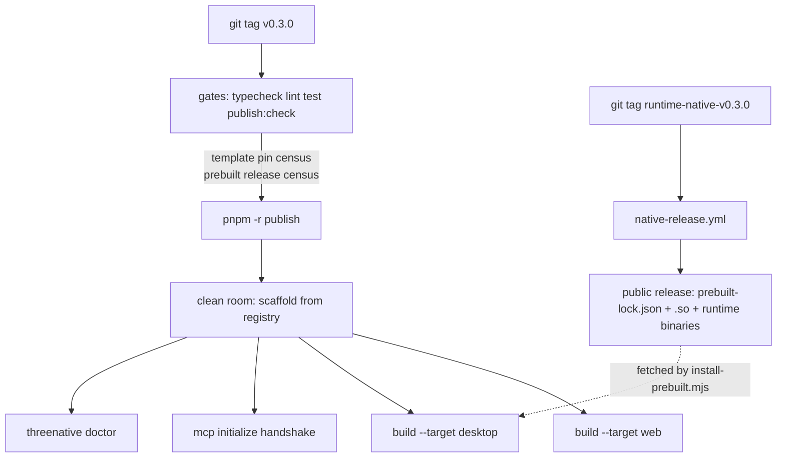

# PRD-196 — A stranger's install of ThreeNative is functional

**Status:** NOT STARTED

**Complexity:** +2 for 6–10 files, +2 for multi-package changes, +2 for a new system (release
plumbing + gate), +1 for external API integration (npm registry, GitHub releases) = **7 → HIGH
mode**.

## Context

**Problem:** On a machine with no engine source checkout, the published ThreeNative packages
build a web game and nothing else — every native target is dead, the capability manifest the
framework tells agents to consult does not exist, and the scaffolded project's own `pnpm test`
is red on first run.

This is an engine bug in the *shipping* layer, not in any game. The library decides what reaches
a user's disk; a game cannot fix any of it portably.

**Files analyzed:** `packages/runtime-native/scripts/install-prebuilt.mjs`,
`packages/runtime-native/scripts/package-android.mjs`, `packages/runtime-native/package.json`,
`packages/create-threenative/src/build.ts`, `packages/create-threenative/src/threenative.ts`,
`packages/create-threenative/package.json`,
`packages/create-threenative/templates/starter/package.json`, `packages/core/mcp/servers.mjs`,
`packages/core/mcp/launch.mjs`, `packages/core/mcp/engine.mjs`, `scripts/make-sandbox.ts`,
`scripts/check-publish-state.ts`, `scripts/verify-registry-install.ts`,
`.github/workflows/npm-release.yml`, `.github/workflows/native-release.yml`.

### Current behaviour, measured

Two arms were executed. **Arm A** is what a stranger gets today
(`npx create-threenative@0.2.2 mygame`, registry install, HOME isolated to a scratch dir).
**Arm B** is what HEAD would ship (`pnpm sandbox`, packed tarballs, no workspace above).

**Arm A — the scaffold succeeds, then:**

```
.../@threenative/runtime-native install$ node scripts/install-prebuilt.mjs
.../@threenative/runtime-native install: Prebuilt release manifest fetch failed for 'linux-x64': HTTP 404.
.../@threenative/runtime-native install: Failed
+ @threenative/runtime-native 0.2.0
```

The install continues and reports success. Nothing tells the user native support is absent.

```
$ threenative build --target web       # ✓ built in 596ms  → dist/ written
$ threenative build --target desktop
Missing prebuilt runtime for 'linux-x64': .../runtime-native/prebuilt/linux-x64/threenative-runtime
node exited with code 1.
$ threenative build --target android
Prebuilt release manifest fetch failed for 'android-sdl3-aar': HTTP 404.
node exited with code 1.
$ threenative build --target ios
iOS simulator packaging requires a darwin-arm64 host; received linux-x64.   # expected on Linux
$ threenative doctor --text
Usage: threenative build [--target web|desktop|android|ios]                 # doctor does not exist
$ pnpm test                                                                  # the committed gate
"message": "Visual capture could not read a renderer adapter description (kind=webgpu)."
EXIT=2                                                                       # 0 passed, 2 failed
$ find node_modules -name capabilities.json                                  # (no output)
```

`.mcp.json` in the scaffolded project wires two servers (assets, sculpt) — both launch and answer
`initialize` correctly. There is no capability server and no manifest for one to read.

**Arm B — HEAD, packed to tarballs, cannot even install:**

```
threenative-engine-mcp is not in the npm registry, or you have no permission to fetch it.
info: @threenative/runtime-native@0.3.0 is an optional dependency and failed compatibility check. Excluding it from installation.
pnpm install exited with code 1.
```

**Registry state versus this tree** (`dist-tags.latest`, fetched live):

| Package | Registry | This tree |
| --- | --- | --- |
| `@threenative/core` | 0.2.0 | 0.3.0 |
| `@threenative/physics` | 0.2.1 | 0.3.0 |
| `@threenative/ui` | 0.2.1 | 0.3.0 |
| `@threenative/playtest` | 0.2.0 | 0.3.0 |
| `@threenative/runtime-native` | 0.2.0 | 0.3.0 |
| `create-threenative` | 0.2.2 | 0.2.3 |
| `@threenative/assets` | **absent** | 0.3.0 |
| `threenative-engine-mcp` | **absent** | 0.2.0 |

**Release state:** `install-prebuilt.mjs:53` builds every prebuilt URL from
`https://github.com/jonit-dev/threenative` — `api.github.com` returns **404** for that repository.
The live remote is `ThreeNativeHQ/threenative`, which is public (**200**) and has **zero
releases**. So the prebuilt path is broken twice over: wrong host, and nothing published at the
right one.

`pnpm publish:check` already fails on one strand of this and no other:

```
FAIL  @threenative/assets: @threenative/assets is publishable but is not named in
      .github/workflows/npm-release.yml, so a release would silently skip it.
```

### Why no gate caught the rest

- `scripts/make-sandbox.ts:21` packs `assets, core, physics, ui, playtest` and the CLI. It never
  packs `runtime-native` or `engine-mcp`, so the local "user machine" simulation is structurally
  incapable of seeing a native or capability break.
- `scripts/verify-registry-install.ts` runs scaffold → install → lockfile → `npm run build` (web)
  → `npm test`. It never runs a native target, never runs `doctor`, and never launches an MCP
  server. It also only runs *after* a successful publish job on a `v*` tag.
- `check-publish-state.ts` compares workspace versions against the registry and checks the release
  workflow's package list. It never asks whether the versions the **templates pin** are resolvable,
  and never asks whether the prebuilt release for the runtime version exists.

## Solution

Five strands, each with its own gate, so that the next regression is caught by a red build rather
than by a user:

- **Point the prebuilt manifest at the repository that exists**, and make a failed prebuilt install
  loud instead of a silent optional-dependency exclusion.
- **Publish the missing packages** (`@threenative/assets`, `threenative-engine-mcp`) and cut a
  `runtime-native-v*` tag so the prebuilt assets exist at the URL the installer fetches.
- **Teach `publish:check` to census template pins and the prebuilt release**, so a tree whose
  templates name a package or a release that the world cannot fetch refuses to publish.
- **Extend the clean-room gate past the web build**: `doctor`, a native target, and an
  `initialize` handshake against every server `.mcp.json` wires.
- **Pack `runtime-native` and `engine-mcp` into `pnpm sandbox`**, so the local simulation covers
  the same surface as the clean room.



**Key decisions:**

- The release host moves to a **single owner constant** in `install-prebuilt.mjs`, exported so
  tests and gates read the same value instead of restating the URL.
- A failed prebuilt download stays non-fatal for the *web* user (the package is an
  `optionalDependency` on purpose) but must leave a **recorded reason on disk** that `doctor` and
  the native build read back, so the failure surfaces where the user is, not 200 lines up in an
  install log.
- No new package. No new CLI vocabulary. Everything lands in files that already exist.

**Data changes:** one new file written by the runtime install hook,
`<runtime-native>/prebuilt/install-status.json` (`{ key, ok, reason, url, version }`). It is
package-local, gitignored by virtue of living in `node_modules`, and read only by `doctor` and the
native build path.

## Integration Ledger

| # | New thing | Live caller (`file:line`, non-test) | Replaces | Old path removed? | Negative control |
|---|-----------|-------------------------------------|----------|-------------------|------------------|
| 1 | `RELEASE_REPOSITORY` constant + `releaseManifestUrl()` using it | `install-prebuilt.mjs` install hook (`package.json:scripts.install`); `package-android.mjs:556` via `prepareAndroidPrebuilts` | hardcoded `jonit-dev/threenative` string | deleted in Phase 1 | point the constant at a nonexistent repo → `writeInstallStatus` records `ok:false` and `doctor` reports it |
| 2 | `writeInstallStatus()` → `prebuilt/install-status.json` | `install-prebuilt.mjs` CLI branch | silent `process.exitCode = 1` | replaced in Phase 1 | delete the status file → `doctor` reports "prebuilt state unknown", not a pass |
| 3 | `nativeRuntimeCheck()` in `doctor.ts` | `packages/create-threenative/src/doctor.ts` check list, reached by `threenative.ts:41` | nothing (new check) | n/a | uninstall the prebuilt binary → `threenative doctor` exits 1 naming the target |
| 4 | `templatePinCensus()` in `check-publish-state.ts` | `scripts/check-publish-state.ts` main report | nothing | n/a | add a fake pin `"nonexistent-pkg": "9.9.9"` to a template → `publish:check` fails |
| 5 | `prebuiltReleaseCensus()` in `check-publish-state.ts` | same report | nothing | n/a | bump `runtime-native` version without a release → `publish:check` fails |
| 6 | `doctor` / native / MCP steps in `verify-registry-install.ts` | `.github/workflows/npm-release.yml` clean-room job | the 4-step web-only flow | extended in Phase 4 | run it against `create-threenative@0.2.2` → the new steps go red |
| 7 | `runtime-native` + `engine-mcp` in `PACKAGES` | `scripts/make-sandbox.ts:21` | 6-package list | replaced in Phase 5 | build a sandbox, run `threenative build --target desktop` in it → passes only with the tarballs present |

### Reachability

**How is this reached?** `npm create threenative@latest` → `npm install` (runtime install hook) →
`threenative build --target <native>` / `threenative doctor` → the project's `.mcp.json`. Every
entry point already exists; this PRD edits what they do, and adds gates that execute them.

**User-facing?** Yes — the user is an agent and a developer at a terminal. The surface is CLI
output and exit codes, not UI.

**Full flow:** user runs `npm create threenative@latest my-game` → install hook fetches the
prebuilt manifest from the live public release → `threenative build --target desktop` finds the
runtime binary and produces `dist-native/my-game` → `threenative doctor` reports every target as
available → the agent authoring the game calls `engine_search_capabilities` and gets the manifest.

**What does this replace?** The dead `jonit-dev` URL (row 1), the silent install failure (row 2),
and the web-only clean-room flow (row 6).

## Execution Phases

#### Phase 1: The prebuilt install tells the truth — a user knows native is missing before they build

**Files (max 5):**

- `packages/runtime-native/scripts/install-prebuilt.mjs` — EDIT: `RELEASE_REPOSITORY` constant
  replaces the `jonit-dev` literal at line 53; new `writeInstallStatus()`; the CLI branch records
  the outcome instead of only setting `exitCode`.
- `packages/runtime-native/__tests__/install-prebuilt.spec.ts` — EDIT: URL-owner and status-file
  cases.
- `packages/create-threenative/src/doctor.ts` — EDIT: new native-runtime check reading
  `install-status.json` through the resolved `@threenative/runtime-native` root.
- `packages/create-threenative/__tests__/doctor.spec.ts` — EDIT: red/green for the new check.
- `packages/runtime-native/scripts/package-android.mjs` — EDIT: the 404 message names the release
  the packager expected, not just the HTTP status.

**Implementation:**

- [ ] Export `RELEASE_REPOSITORY = "ThreeNativeHQ/threenative"` and build every release URL from it.
- [ ] On both success and failure, write `prebuilt/install-status.json` with `{ key, ok, reason,
      url, version }`; keep the non-zero exit for a source-checkout-less failure.
- [ ] `doctor` reports `native runtime: available (linux-x64)` / `unavailable — <reason>` /
      `unknown — no install status recorded`, and fails the report only on `unavailable`.
- [ ] `package-android.mjs` keeps its existing `THREENATIVE_RUNTIME_SOURCE` escape hatch and adds
      the release tag it looked for.

**Wiring:**

- [ ] Caller edited: `packages/create-threenative/src/doctor.ts` check list (reached by
      `threenative.ts:41`).
- [ ] Registration: none needed — `scripts.install` already runs the hook.
- [ ] Old path: the `jonit-dev` literal is deleted, not aliased.
- [ ] Ledger rows filled: #1, #2, #3.

**Tests Required:**

| Test File | Test Name | Assertion | Negative control (must be observed red) |
|---|---|---|---|
| `runtime-native/__tests__/install-prebuilt.spec.ts` | `should build every release URL from the live repository owner` | URL contains `ThreeNativeHQ/threenative` | grep for `jonit-dev` in `packages/` returns nothing; restoring the literal fails the test |
| `runtime-native/__tests__/install-prebuilt.spec.ts` | `should record ok:false with the fetch reason when the manifest 404s` | status file parsed, `ok === false`, reason names the URL | stub a 200 manifest → the same test fails |
| `create-threenative/__tests__/doctor.spec.ts` | `should fail the report when the native runtime install recorded a failure` | `report.pass === false`, message names the platform key | write `ok:true` into the fixture → the assertion fails |

**Revert check:** delete `writeInstallStatus` → `doctor.spec.ts`'s unavailable case fails, and
`threenative doctor --text` in a project with no prebuilt reports a pass it has not earned.

**User verification:** in a scaffolded project with no network, `npx threenative doctor --text`
names the missing runtime and exits 1 before any build is attempted.

---

#### Phase 2: The prebuilt assets exist at the URL the installer fetches — `build --target desktop` produces a binary

**Files (max 5):**

- `.github/workflows/native-release.yml` — EDIT: confirm the upload target is the public
  `ThreeNativeHQ` release and that `prebuilt-lock.json` lists every key
  `ANDROID_PREBUILT_ASSETS`, `ANDROID_PREBUILT_V8_ASSETS` and `platformKey()` can ask for.
- `packages/runtime-native/scripts/install-prebuilt.mjs` — EDIT: `supported` set and the manifest
  key list become one exported table the workflow asserts against.
- `packages/runtime-native/__tests__/install-prebuilt.spec.ts` — EDIT: key-table coverage test.
- `docs/verification/round-<n>-published-install.md` — NEW: the evidence record for the tag run.

**Implementation:**

- [ ] Reconcile the workflow's uploaded asset names against the exported key table; any key the
      installer can request and the workflow does not upload fails the build.
- [ ] Cut `runtime-native-v0.3.0` and record the run id, the release URL, and each asset's SHA-256.

**Wiring:**

- [ ] Caller edited: `.github/workflows/native-release.yml` reads the exported key table.
- [ ] Old path: n/a.
- [ ] Ledger rows filled: #1 (URL now resolves).

**Tests Required:**

| Test File | Test Name | Assertion | Negative control |
|---|---|---|---|
| `runtime-native/__tests__/install-prebuilt.spec.ts` | `should upload every prebuilt key the installer can request` | workflow asset list ⊇ key table | remove one key from the workflow list → red |

**Revert check:** delete an asset name from the workflow → the key-table test fails.

**Proof subject:** `linux-x64` desktop **and** `android-arm64-v8a` — the two the installer fetches
on the machines this project actually builds on. Not the smallest key.

**User verification:** in the Arm A project, `pnpm install` then `threenative build --target
desktop` writes `dist-native/mygame` and it starts.

---

#### Phase 3: A scaffolded project installs — every pin the templates name is resolvable

**Files (max 5):**

- `.github/workflows/npm-release.yml` — EDIT: add `@threenative/assets` to the publish-set comment
  block (the list `publish:check` asserts against).
- `scripts/check-publish-state.ts` — EDIT: `templatePinCensus()` and `prebuiltReleaseCensus()`.
- `scripts/__tests__/check-publish-state.spec.ts` — EDIT: red/green for both censuses.
- `packages/create-threenative/templates/*/package.json` — EDIT only if a pin must move.

**Implementation:**

- [ ] `templatePinCensus`: for every dependency in every shipped template manifest, resolve
      `name@version` against the registry; an unresolvable pin is a `fail` finding naming the
      template and the pin. Treat a registry it cannot reach as `blocked` (exit 2), matching the
      existing contract.
- [ ] `prebuiltReleaseCensus`: `HEAD` the `prebuilt-lock.json` for the current `runtime-native`
      version; absent → `fail`.
- [ ] Publish `@threenative/assets` and `threenative-engine-mcp`, then the rest of the set.

**Wiring:**

- [ ] Caller edited: `scripts/check-publish-state.ts` report assembly; the workflow already runs it.
- [ ] Ledger rows filled: #4, #5.

**Tests Required:**

| Test File | Test Name | Assertion | Negative control |
|---|---|---|---|
| `scripts/__tests__/check-publish-state.spec.ts` | `should fail when a template pins a package the registry does not have` | finding names template + pin | point the fixture at a real published pin → the assertion fails |
| `scripts/__tests__/check-publish-state.spec.ts` | `should fail when no prebuilt release exists for the runtime version` | finding names the expected tag | stub a 200 → fails |
| `scripts/__tests__/check-publish-state.spec.ts` | `should report blocked, not pass, when the registry is unreachable` | `exitCode === 2` | make the stub succeed → fails |

**Revert check:** restore `threenative-engine-mcp` to an unpublished state in the fixture → the
census test fails, and `pnpm publish:check` refuses the tree.

**User verification:** `npm create threenative@latest my-game` completes install with exit 0, and
`node_modules/threenative-engine-mcp` exists.

---

#### Phase 4: The clean room proves what a stranger actually does — native, doctor, capability tools

**Files (max 5):**

- `scripts/verify-registry-install.ts` — EDIT: steps `doctor`, `native`, `mcp` after `test`.
- `scripts/__tests__/verify-registry-install.spec.ts` — EDIT: step-list and fail-closed cases.
- `.github/workflows/npm-release.yml` — EDIT: the clean-room job installs whatever the native step
  needs on the runner.

**Implementation:**

- [ ] `doctor` step: `npx threenative doctor` in the scaffolded project; non-zero fails the gate.
- [ ] `native` step: `npm run build:desktop`; assert the output path exists and is executable.
- [ ] `mcp` step: for every server in the project's `.mcp.json`, spawn the command and assert a
      valid `initialize` result on stdout within a timeout — including
      `threenative-engine`, whose `engine_search_capabilities` must return at least one hit for a
      plain-words query.
- [ ] Fail closed: a step that did not run is a failure, matching the file's existing contract.

**Wiring:**

- [ ] Caller edited: `.github/workflows/npm-release.yml` clean-room job.
- [ ] Old path: the four-step flow is extended, not duplicated.
- [ ] Ledger rows filled: #6.

**Tests Required:**

| Test File | Test Name | Assertion | Negative control |
|---|---|---|---|
| `scripts/__tests__/verify-registry-install.spec.ts` | `should fail when the native build step produces no executable` | step `ok === false` | stub an existing executable → fails |
| `scripts/__tests__/verify-registry-install.spec.ts` | `should fail when an mcp server never answers initialize` | step names the server | stub a valid handshake → fails |
| `scripts/__tests__/verify-registry-install.spec.ts` | `should not report a pass for a step that did not run` | `exitCode === 1` | mark skipped steps `ok:true` → fails |

**Revert check:** remove the `native` step → `verify-registry-install.spec.ts`'s step-list test
fails.

**User verification:** run the gate locally against the published set:
`pnpm tsx scripts/verify-registry-install.ts` — every step green, and running it against
`create-threenative@0.2.2` reproduces today's failures.

---

#### Phase 5: The local sandbox covers the same surface as the clean room

**Files (max 5):**

- `scripts/make-sandbox.ts` — EDIT: `PACKAGES` gains `runtime-native` and `engine-mcp`; the
  scaffold call passes their tarballs.
- `packages/create-threenative/src/index.ts` — EDIT: accept `--runtime-package` and
  `--engine-mcp-package` overrides alongside the existing ones.
- `packages/create-threenative/__tests__/scaffold.spec.ts` — EDIT: override coverage.
- `scripts/__tests__/make-sandbox.spec.ts` — EDIT: package-list assertion.

**Implementation:**

- [ ] Pack and inject both packages so a sandbox can run `threenative build --target desktop` and
      launch the capability server without touching the workspace.
- [ ] Update the sandbox's closing report to name native and capability availability.

**Wiring:**

- [ ] Caller edited: `scripts/make-sandbox.ts:21` and the scaffold invocation below it.
- [ ] Old path: the six-package list is replaced.
- [ ] Ledger rows filled: #7.

**Tests Required:**

| Test File | Test Name | Assertion | Negative control |
|---|---|---|---|
| `scripts/__tests__/make-sandbox.spec.ts` | `should pack every package a user installs` | list includes runtime-native and engine-mcp | drop one → red |
| `create-threenative/__tests__/scaffold.spec.ts` | `should install the runtime from the supplied tarball when overridden` | manifest pin is the `file:` tarball | omit the flag → fails |

**Revert check:** remove the two packages from `PACKAGES` → the sandbox test fails and a sandbox
build of `--target desktop` returns to the registry, reproducing Arm B.

**User verification:** `pnpm sandbox --genre platformer`, then inside the sandbox game
`threenative build --target desktop` succeeds with no `THREENATIVE_RUNTIME_SOURCE` set.

## Verification Strategy

Every phase records its negative control as observed-red before its pass is written down. A pass
with no observed red is recorded **UNVERIFIED**.

**Integration proof (run at the final checkpoint, output pasted, not summarized):**

```bash
# 1. No live reference to the dead release host remains
grep -rn "jonit-dev" packages scripts .github --include='*.mjs' --include='*.ts' --include='*.yml'
# Expected: only test fixtures under packages/runtime-native/tests/fixtures/

# 2. Caller census for each new symbol
grep -rn "writeInstallStatus\|templatePinCensus\|prebuiltReleaseCensus\|RELEASE_REPOSITORY" \
  packages scripts --include='*.ts' --include='*.mjs' | grep -v "__tests__" | grep -v ".spec."
# Expected: at least one non-test consumer per symbol

# 3. The registry path, end to end, with no workspace above it
pnpm tsx scripts/verify-registry-install.ts
# Expected: scaffold, install, lockfile, build, test, doctor, native, mcp — all ok

# 4. Prebuilt release resolves for the shipped runtime version
curl -sI "https://github.com/ThreeNativeHQ/threenative/releases/download/runtime-native-v$(node -p \
  "require('./packages/runtime-native/package.json').version")/prebuilt-lock.json" | head -1
# Expected: HTTP 200 (after redirect)
```

## Acceptance Criteria

Consumer-scoped. Each is checked from a directory with no ThreeNative source and no workspace
above it.

- [ ] A stranger runs `npm create threenative@latest my-game` and the install exits 0 with no
      failed lifecycle script.
- [ ] In that project, `threenative build --target desktop` writes an executable that starts and
      renders 300 frames (`verify-starter-desktop.mjs`).
- [ ] In that project, `threenative build --target android` produces an APK on a machine with only
      an Android SDK and a JDK — no engine checkout, no `THREENATIVE_RUNTIME_SOURCE`.
- [ ] In that project, `threenative doctor --text` exits 0 and names every available target; with
      the prebuilt removed, it exits 1 and says which target is gone.
- [ ] In that project, an agent calling `engine_search_capabilities("enemy walks around a wall")`
      through the project's `.mcp.json` receives at least one capability.
- [ ] In that project, `pnpm test` is green on first run with no added flags.
- [ ] `pnpm publish:check` refuses a tree whose templates pin an unpublished package, and refuses a
      tree whose runtime version has no prebuilt release.
- [ ] `pnpm sandbox` produces a sandbox in which the desktop build succeeds without pointing at
      the engine source.

**Integration gates:**

- [ ] Integration Ledger has zero `TBD` cells; every live caller is a real non-test `file:line`.
- [ ] Every new exported symbol has a non-test consumer (census pasted).
- [ ] Revert check passed for each phase.
- [ ] The `jonit-dev` URL is deleted, not aliased — no behaviour has two live implementations.
- [ ] Every gate has a negative control observed failing.
- [ ] Proved on the real subjects: `linux-x64` desktop and `android-arm64-v8a`, not a stub key.

## Out of scope

- iOS device signing (`build --target ios` correctly refuses on non-darwin hosts; simulator-only
  packaging and signing remain OPEN elsewhere).
- Whether `@threenative/studio` — the paid editor referenced by the templates' `pnpm studio`
  script — belongs in the generated manifest. It resolves from the registry today; its licensing
  is a separate question.
- WebGPU adapter provenance on this measurement machine: the Arm A `pnpm test` failure reproduced
  as a missing adapter description with the published test script, which HEAD already fixes by
  passing `--browser-recipe webgpu`. A GPU-backed rerun after Phase 3 confirms it; a software
  adapter run does not.
