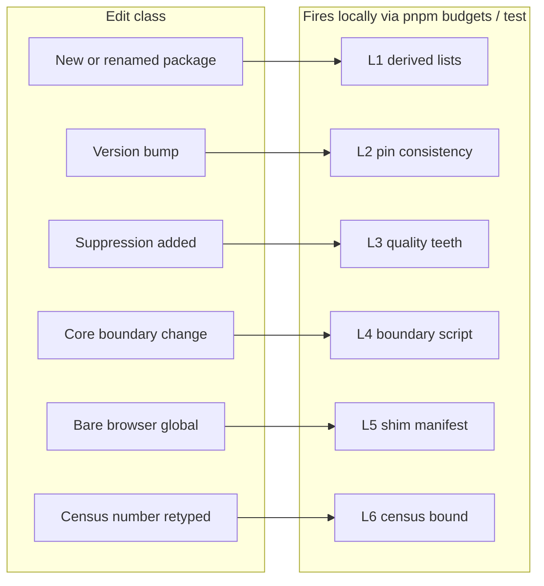

# PRD-215 — Every recurring debt class fails a gate before merge

**Status:** NOT STARTED (filed 2026-08-23 from `docs/audits/guardrail-gap-scan-2026-08-23.md`)
**Complexity:** +2 for multi-package (scripts, create-threenative, runtime-native, workflows), +2 investigation = 4 → MEDIUM mode

Twenty-one recorded incidents in this repository reduce to five debt classes
(`docs/audits/guardrail-gap-scan-2026-08-23.md` §3). Forty machine guards already exist, but
the classes that keep biting are the ones with no guard, a guard that cannot fire where the
edit happens, or a ratchet with no teeth — and one of those routes is diverging on main
today (`visual-gate.ts` vs `profile-starter.ts` package lists). This PRD closes six such
routes with gates that fail locally on `main`, before CI, using enforcement patterns the
repo already runs. It prevents debt classes; it does not pay down enumerated instances.

## Context

Measured evidence first; method and full citations live in the source scan (2026-08-23).

**Divergence observed on main the day of filing** — three hand-maintained package lists:

| Site | Entries | Drift |
| --- | --- | --- |
| `scripts/visual-gate.ts:35-44` | 8 (incl. assets, engine-mcp) | reference set |
| `scripts/profile-starter.ts:107-114` | 6 | missing assets, engine-mcp |
| `packages/runtime-native/scripts/profile-production.mjs:249-255` | 7 incl. studio | names a package this repo does not have |

**Debt classes vs existing coverage** (21 recorded incidents, scan §3):

| Class | Incidents | Guarded today? |
| --- | --- | --- |
| C1 one fact hand-maintained in many places | 7 | partially — capabilities/LOC/census verdicts are generated+gated; package lists, template pins, version constants are not |
| C2 evidence beyond what executed | 5 | yes for lanes with fail-closed records (conformance blocked≠passed, visual floors); no general mechanism proposed here — see Out of scope |
| C3 validation fails open | 2+ | mostly closed by doctrine + past fixes; the quality baseline still fails open |
| C4 guards built but unwired/blind | 4 | entity boundary is CI-inline-only; `parity:ledger` wired nowhere |
| C5 environment-sensitive measurement | 3 | closed by adapter naming, capture-guard, xvfb wrapper |

What remains unknown at filing: whether `profile-production.mjs`'s `studio` entry is
intentional cross-repo behaviour; the exact bare-global set framework TS relies on (L5's
first task); the census tolerance that will not fight legitimate regeneration.

## Solution

Six levers. Each states its invariant, where it fires, and which recorded class it closes.

- **L1 — Derive package enumerations.** A shared helper reads package names from
  `packages/*/package.json`; every enumeration call site consumes it. Cross-checkout extras
  (the `studio` case) become explicit overrides carrying an inline reason.
- **L2 — Pin consistency.** Every `@threenative/*` pin across all templates equals the
  workspace version; third-party pins are identical across templates; the runtime-native
  version appears once and is cross-checked. Checked on `main`, not only in the release lane.
- **L3 — Quality ratchet teeth.** `pnpm quality` exits nonzero when a suppression-class
  finding (`biome-ignore`, `ts-ignore/-expect-error`, lint-coverage hole) is new or grew,
  or appears without a waiver reason. File length stays report-only per the documented LOC
  decision.
- **L4 — De-inline the CI-only gates.** The entity-registry boundary (<80 lines, banned
  tokens) and scaffold-hygiene greps move into a script that `pnpm budgets` runs; ci.yml
  calls the script instead of duplicating it; the golden-path MCP probe keeps one
  implementation (`verify-golden-path.ts`) and ci.yml reuses it.
- **L5 — Machine-checked shim contract.** A manifest lists the browser globals native shims
  install; a checker walks framework TS for bare-global reads and fails naming any global
  that is neither shimmed nor allowlisted with a reason. The prose contract stays as
  documentation of the same fact.
- **L6 — Wire the orphaned verifiers.** `parity:ledger` joins `native-platforms.yml`; census
  Lines drift becomes fatal past a small tolerance, so regeneration cadence is enforced
  rather than remembered.



## Integration Ledger

| # | New thing | Live caller (file:line, non-test) | Replaces | Old path removed? | Negative control |
| --- | --- | --- | --- | --- | --- |
| L1 | Workspace-package derivation helper | `package.json:29` budgets chain (new step); call sites `scripts/visual-gate.ts`, `scripts/profile-starter.ts`, `packages/runtime-native/scripts/profile-production.mjs`, `scripts/check-capability-docs.ts` | three literal arrays above | yes, at call sites (overrides keep an inline reason) | revert one call site to its literal array → budgets reds on the no-literal-enumeration check |
| L2 | Version-pin consistency check | `package.json:29` budgets chain (new step) | release-time-only pin validation in `check-publish-state.ts` (stays; gains a daily-lane predecessor) | no | change one template's `@threenative/core` pin → budgets reds naming the template and expected version |
| L3 | Fatal quality semantics for suppression-class findings | `package.json:22` `pnpm quality`; budgets job stops printing and starts gating | report-only printout | no (report content unchanged) | add an unwaived `biome-ignore` → `pnpm quality` exits 1 |
| L4 | `scripts/check-core-boundary.ts` run from budgets | `.github/workflows/ci.yml:310-312` now invokes the script | inline shell blocks (entity registry, scaffold greps) and the duplicated MCP probe | yes, the inline duplicates | break the 80-line rule in `entities.ts` → local `pnpm budgets` reds without CI |
| L5 | Native shim manifest + checker | budgets chain or core test suite entry | prose-only contract in `packages/runtime-native/AGENTS.md` (kept as docs) | no | read `localStorage` in `packages/core/src` unregistered → failure names the global and the gap |
| L6 | Wired parity ledger + bounded census drift | `.github/workflows/native-platforms.yml` (new step); `scripts/check-budgets.ts` `nativeCensusDrift()` | warn-only drift; manual-only ledger run | no | transcribe a wrong census Lines value past tolerance → budgets reds |

### Reachability

- **How is this reached?** Every agent or human runs `pnpm typecheck && pnpm lint && pnpm test`
  and `pnpm budgets` before pushing (repo rule 4); levers L1-L3, L5, L6 fire inside those
  commands, L4 adds what only CI could see to the same local run.
- **User-facing?** No. These are contributor-facing gates; nothing ships in a generated
  project. The indirect user-facing effect is fewer silent breaks reaching published installs
  (class C1/C2 history).
- **Full flow:** edit tree → local gate run reds with a message naming the file and the
  expected fix → agent fixes or waives with a reason → same gates run in CI budgets/test jobs
  on the PR.
- **What does this replace?** Human-configured review catching these classes after the fact
  (five repair rounds across PRD-138..150 were spent on reds that were never red, scan §3),
  plus the two unwired verifiers and three literal lists named in the ledger.

## Execution Phases

#### Phase 0: Derive the package lists (L1)

Red first: write the spec asserting no literal multi-package `@threenative/*` arrays outside
the derived helper's allowlist; run it against today's tree and paste the red naming
`visual-gate.ts`/`profile-starter.ts`. Then derive, rewrite call sites, paste green.

**Files (max 5):**
- [ ] `scripts/workspace-packages.ts` (new helper; derives names from `packages/*/package.json`)
- [ ] `scripts/visual-gate.ts`
- [ ] `scripts/profile-starter.ts`
- [ ] `packages/runtime-native/scripts/profile-production.mjs` (override-with-reason for the studio case)
- [ ] `scripts/__tests__/workspace-packages.spec.ts`

#### Phase 1: Pin consistency (L2)

Investigate first whether any template pins already disagree; if red on day one, that is the
baseline finding, fixed in this phase.

**Files (max 5):**
- [ ] `scripts/check-version-pins.ts` (new)
- [ ] `scripts/__tests__/check-version-pins.spec.ts`
- [ ] `package.json` (budgets chain)
- [ ] `packages/create-threenative/templates/*/package.json` (only where the check finds drift)
- [ ] `packages/runtime-native/package.json` + `CMakeLists.txt` cross-check (read-side only unless drift found)

#### Phase 2: Quality teeth (L3)

**Files (max 5):**
- [ ] `scripts/check-quality.ts` (fatal semantics for suppression-class new/grew/unwaived; lengths stay advisory)
- [ ] `docs/verification/quality-baseline.json` (regenerated against the current tree so only future growth bites)
- [ ] `package.json` (budgets job wires the fatal mode)
- [ ] `.github/workflows/ci.yml` (budgets job fails on quality exit)
- [ ] `scripts/__tests__/check-quality.spec.ts`

#### Phase 3: De-inline the CI-only gates (L4)

**Files (max 5):**
- [ ] `scripts/check-core-boundary.ts` (new; port of ci.yml lines 310-312 + scaffold-hygiene greps)
- [ ] `scripts/__tests__/check-core-boundary.spec.ts`
- [ ] `.github/workflows/ci.yml` (invoke the script; drop duplicated MCP probe in favour of `verify-golden-path.ts`)
- [ ] `package.json` (budgets chain)

#### Phase 4: Shim contract manifest (L5) — investigation phase

First enumerate bare globals actually referenced by `packages/{core,ui,playtest}/src`; then
manifest what runtime.cpp installs; then enforce superset-or-allowlist.

**Files (max 5):**
- [ ] `packages/runtime-native/shim-manifest.json` (new; globals installed + allowlist entries with reasons)
- [ ] `scripts/check-native-shims.ts` (new)
- [ ] `scripts/__tests__/check-native-shims.spec.ts`
- [ ] `packages/runtime-native/AGENTS.md` (contract doc points at the manifest as machine truth)
- [ ] `package.json` (budgets chain)

#### Phase 5: Wire the orphaned verifiers (L6)

**Files (max 5):**
- [ ] `.github/workflows/native-platforms.yml` (run `pnpm parity:ledger` after conformance capture)
- [ ] `scripts/check-budgets.ts` (`nativeCensusDrift` fatal past tolerance; tolerance chosen in-phase and recorded)
- [ ] `docs/verification/native-runtime-census-2026-08-16.md` (regenerate if Phase 5's own bound finds drift)
- [ ] `scripts/__tests__/budgets.spec.ts`

## Verification Strategy

Per-phase red-green: each phase's spec or checker is written first, run against the
unguarded tree, and the red output is pasted into this PRD's record file before the fix
lands; both land in the same commit. Mutation statements per lever are the Negative control
column above — reverting any one must red its gate.

Whole-change gates, run and pasted:

```sh
pnpm typecheck && pnpm lint && pnpm test
pnpm budgets
```

No playtest scenario is required: none of these levers change game-visible runtime
behaviour; they are build-time gates over the tracked tree. Each execution session writes
its dated record at `docs/verification/prd-215-<date>.md` naming what ran and what did not;
a gate result that lives only in a commit message does not exist.

## Acceptance Criteria

Consumer = the working agent or reviewer on `main`.

- [ ] Adding or renaming a workspace package updates every enumeration by derivation:
      mutating `profile-starter.ts` back to its literal array fails the L1 spec (paste output).
- [ ] Changing any template's `@threenative/*` pin away from its workspace version fails
      `pnpm budgets` locally, naming the template and the expected version (paste output).
- [ ] Adding an unwaived `biome-ignore` anywhere under `packages/*/src` makes `pnpm quality`
      exit 1 (paste output), while adding it with a waiver reason passes.
- [ ] Violating the entity-registry rule locally (append a banned token in
      `packages/core/src/entities.ts`) fails local `pnpm budgets` without needing CI (paste output).
- [ ] Reading an unshimmed browser global in framework TS fails with a message naming the
      global and whether it needs a shim or an allowlist reason (paste output).
- [ ] Retyping a census Lines value past the recorded tolerance fails `pnpm budgets`
      (today it warns; paste the red).
- [ ] All six levers pass `pnpm typecheck && pnpm lint && pnpm test && pnpm budgets` and
      their record exists at `docs/verification/prd-215-<date>.md`.

## Out of scope

- **Framework/native LOC caps stay report-only.** That is a documented decision tied to the
  charter's scoring rules; this PRD does not relitigate it.
- **Instance-level fail-open fixes** (tech-debt-scan findings #1-#3, #16) belong to
  `batch-2026-08-23-tech-debt` (PRD-197…208); this PRD adds no duplicate instance work.
- **Relationship to PRD-074 (code-quality gates, SCOPING).** Where they overlap — suppression
  and lint-hole signals — this PRD adopts PRD-074's definitions and gives that subset fatal
  semantics; PRD-074's remaining report-only signals are untouched. If both proceed, close
  the overlapping items against this PRD's records rather than filing them twice.
- **Git pre-commit/pre-push hooks.** Rejected for now: they duplicate CI latency onto every
  commit, and the repo's proof norm is the explicit local gate run. Revisit only if local-run
  discipline measurably decays.
- **Completing the input/canvas TODO stubs.** Feature work on the native roadmap, not a
  guardrail; L5 only makes their absence loud instead of silent.
- **A general claim-provenance schema for prose documents (class C2).** Lane-specific
  fail-closed records already exist (conformance registry, visual floors); generalising them
  to all prose is a larger design than this PRD's scope and needs its own investigation.
