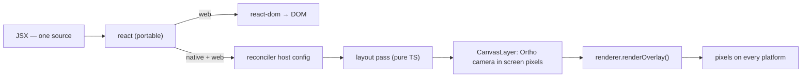

# PRD-216 — a React UI renders on every platform, natively, without a WebView

**Status:** SCOPING, 2026-08-23. Nothing below has been executed. Phase 0 is a spike whose
result may close this PRD.

**Complexity:** +2 new module from scratch (reconciler host config), +2 second new module
(layout), +1 multi-package (core + templates), +2 new capability with no incumbent = **7 → HIGH
mode**.

Owner's requirement, verbatim: *"I need a react UI working on all platforms"*, and *"react in all
platforms, including natively (web is fine already, skip)"*. This overrules PRD-051's candidate D
(`@threenative/ui` stays web-only) and answers PRD-055's *"G now, E next"* with **E now**.

## Context

A game scaffolded from `starter` renders its world on Android and shows **no HUD, no minimap, no
crosshair and no visible touch controls**. The whole UI is React — `src/ui/App.tsx`, `Hud.tsx`,
`Minimap.tsx`, `TouchOverlay.tsx` — mounted from `src/main.ts` through `react-dom`, and
`threenative.config.ts` sets `nativeEntry: "src/game.ts"`, so `main.ts` never executes on native.
`TN_NATIVE_WEB_ONLY_UI` (`packages/create-threenative/src/build.ts:67-72`) exists to make that
loud, and it works.

Bug 2 in `docs/bugs/mobile-stability-2026-08-23.md` has the full history, including that five
templates additionally lost their *geometry* HUD to a line-count reduction round on 2026-08-15.
That regression is a separate, smaller fix. **This PRD is about the React half.**

### Four facts established by investigation on 2026-08-23 — do not re-derive them

1. **`react` is already portable; only `react-dom` is not.** The `react` package is the component
   model — `createElement`, hooks, context, scheduling — with no DOM dependency. `react-dom` is one
   renderer among several: React Native maps to native views, `react-three-fiber` maps to Three.js
   objects, `ink` maps to a terminal. `react-reconciler` is the public, supported API for writing
   another. Templates already carry `react@19.2.0`.

2. **The host surface already exists and already draws on Android.** `packages/core/src/canvas-layer.ts`
   is an `OrthographicCamera` + `Scene` sized in literal screen pixels
   (`camera.left = -width/2`), drawn by `renderer.renderOverlay(canvasLayer.scene,
   canvasLayer.camera)` at `packages/core/src/game.ts:600-602`. No DOM on that path. The template
   loading screen renders through it on the device today.

3. **The native runtime has a DOM shim, and it cannot paint.** `packages/runtime-native/src/runtime.cpp`
   exposes `document`, `window`, `getElementById`, `addEventListener`, `dispatchEvent`,
   `createElement` and `createElementNS`. But `createElement('canvas')` returns an object whose
   `getContext()` is `null`, and `createElement('div')` returns `{ tagName, style, className, id }`
   — **no `appendChild`, no `insertBefore`, no child nodes, no text nodes**. It exists so three.js
   can call `document.createElement("canvas")` internally. Making `react-dom` work against it means
   implementing a DOM *and* a rasteriser, which is building a browser. There is no WebView in the
   Android host, current or historical.

4. **There is no WASM engine on native.** Android runs QuickJS, iOS runs JSC without a JIT. This is
   the same wall that killed the inlined `KTX2Loader`, `meshopt_decoder` and `DRACOLoader` imports
   (`docs/verification/core-ktx2-android-2026-08-23.md`). **Yoga is therefore unavailable**, so the
   layout engine React Native uses cannot be reused and layout must be pure TypeScript.

### Routes rejected, with the evidence

| Route | Why not |
| --- | --- |
| Extend the DOM shim until `react-dom` works | Requires a DOM *and* a rasteriser. That is a browser. Fact 3. |
| WebView | Explicitly excluded by the owner; none exists in the host. |
| React → canvas2d → texture, rasterised by Skia | Skia is in `desktopDeps` only; `androidDeps` has none (`download-deps.mjs:1050`). Dies on the platform that matters. |
| Yoga for flexbox layout | WASM. Fact 4. |
| Keep React on web, geometry on native, share state | The status quo (PRD-051 candidate D). Explicitly overruled. |

## Solution

A **custom `react-reconciler` host config** mapping React elements to Three.js objects inside
`CanvasLayer`, plus a small pure-TypeScript layout pass. Import `react`; never `react-dom`.

Text reuses the bitmap-glyph mechanism already in
`packages/create-threenative/templates/minimal/src/render/hud.ts`, measured `pixelMismatchRatio` 0
against the browser reference on Linux desktop native, the Android emulator and a physical Pixel 8
(`docs/verification/prd-209-2026-08-23.md`).

**Mechanism goes in `packages/core`; appearance does not.** The reconciler and the layout pass are
plumbing every game would otherwise repeat. Styling decides how things look, so it ships as
generated source in the templates. **Tailwind cannot cross — it is CSS.** Do not write a CSS engine.

## Integration Ledger

| # | New thing | Live caller (`file:line`, non-test) | Replaces | Old path removed? | Negative control |
|---|-----------|-------------------------------------|----------|-------------------|------------------|
| 1 | Reconciler host config | template `src/game.ts` mounting UI into `ctx.canvasLayer` | nothing on native; React was absent | no — `react-dom` keeps web | mount with a component that throws → named error, not a silent blank |
| 2 | Layout pass | the host config's commit phase | absolute placement by hand in `render/hud.ts` | no, geometry HUD stays valid | zero-size / cyclic constraint → refuse loudly |
| 3 | Glyph text host node | layout pass leaf nodes | `hud.ts`'s hand-built `InstancedMesh` | no, it is the same mechanism | unknown glyph → refuse rather than draw blank |
| 4 | `TN_NATIVE_WEB_ONLY_UI` stays intact | `build.ts:67-72` | n/a | n/a | plant a `react-dom` import in `game.ts` → build still refuses |

### Reachability

**How is this reached?** `threenative build --target android|desktop` → the portable
`nativeEntry` mounts its React tree into `ctx.canvasLayer` → the reconciler commits Three.js
objects → `renderer.renderOverlay` draws them.

**User-facing?** Yes. It is the difference between a phone showing the game's UI and showing none.

**What does this replace?** Nothing is deleted. Web keeps `react-dom`; the geometry HUD stays a
valid hand-written option; this adds the path that was missing.

## Execution Phases

#### Phase 0: the spike that may close this PRD

**Files (max 3):** a throwaway probe bundle, evidence record (NEW).

- [ ] Does `react@19.2.0` + `react-reconciler` **load and run under QuickJS on a physical Pixel 8**?
      Bundle, boot, render one element. **If it cannot, this PRD closes here** and the geometry HUD
      remains the answer. Report before building anything else.
- [ ] What does it cost? Bundle size, and cost of one state change. PRD-214 measured this device
      CPU-bound in JS at **16.89 fps** with `renderer.render()` p50 **46.15 ms**, roughly half of it
      material/node evaluation. Prove UI re-renders **on state change and not per frame** rather
      than assuming it.
- [ ] Price the smallest honest layout model: a flexbox subset in TS, against anchored/absolute.
      Run `pnpm tsx scripts/count-loc.ts` — **the kill switch applies.** If this costs a game more
      code than the 69-line geometry HUD it replaces, it is deleted however much work it took.

#### Phase 1: the reconciler renders one component natively

**Files (max 5):** `packages/core/src/react-host.ts` (NEW), its spec (NEW), `canvas-layer.ts`
(EDIT if it needs a mount point), export wiring, evidence record (NEW).

- [ ] Red first: a component that renders nothing on native, pasted.
- [ ] Host config with create/append/remove/commit mapping to Three.js objects in `CanvasLayer`.
- [ ] Fail closed: a component that throws names itself; it must not blank the screen silently.

#### Phase 2: layout

**Files (max 4):** `packages/core/src/react-layout.ts` (NEW), spec (NEW), integration, record.

- [ ] Pure TypeScript. No WASM, no Yoga, no CSS parser.
- [ ] Whatever subset ships is **named exhaustively** in the templates' `AGENTS.md`. A game must be
      able to read what is supported without discovering it by failure.

#### Phase 3: one template converted, both targets

**Files (max 5):** one template's `src/ui/` + its native mount, playtest scenario, record.

- [ ] The **same components** render on web and native. If web output changes, that is a defect.
- [ ] Device proof on a physical Pixel 8, lane named.
- [ ] The (template x platform) UI matrix from bug 2's convention covers the React cells.

## Verification Strategy

Record `docs/verification/prd-216-<date>.md`. Every device claim names its lane — physical Pixel 8
vs emulator vs desktop — and no claim is made for a platform that did not execute. **iOS is
unproven: there is no physical lane on this machine.** Gates: `pnpm typecheck && pnpm lint && pnpm
test && pnpm budgets`, plus `count-loc.ts`.

Two machine-specific traps: `packages/playtest/__tests__/orphan-cleanup.sh` matches **any**
Chromium on the box — including another project's — and reds under concurrent work; and
`TN_ANDROID_SETTLE_MS` defaults to 3000, which races this device and surfaces as
`TN_ANDROID_FOREGROUND_WINDOW: 'android' owns focus`, reading exactly like a locked phone.
`TN_ANDROID_SETTLE_MS=12000` passes.

## Acceptance Criteria

- [ ] A React component written once renders on web **and** on a physical Pixel 8, with the web
      output unchanged.
- [ ] `react-dom` is still refused in native bundles — `TN_NATIVE_WEB_ONLY_UI` observed firing on a
      planted import.
- [ ] The frame cost of a UI state change is measured on device and stated, not estimated.
- [ ] The supported layout subset is named in the templates' `AGENTS.md`; a convention missing from
      there does not exist.
- [ ] `count-loc.ts` shows the framework path costs a game no more than the geometry HUD it
      replaces.
- [ ] iOS is explicitly recorded as unproven rather than omitted.

## Out of scope

- Tailwind, CSS, or any stylesheet language on native.
- Making `react-dom` work natively, extending the DOM shim, or any WebView.
- Deleting the geometry HUD path — it stays valid and is what unbreaks templates today.
- iOS claims until a physical lane exists.
