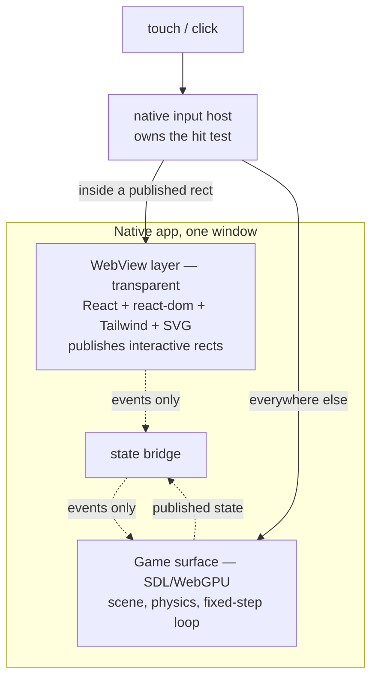
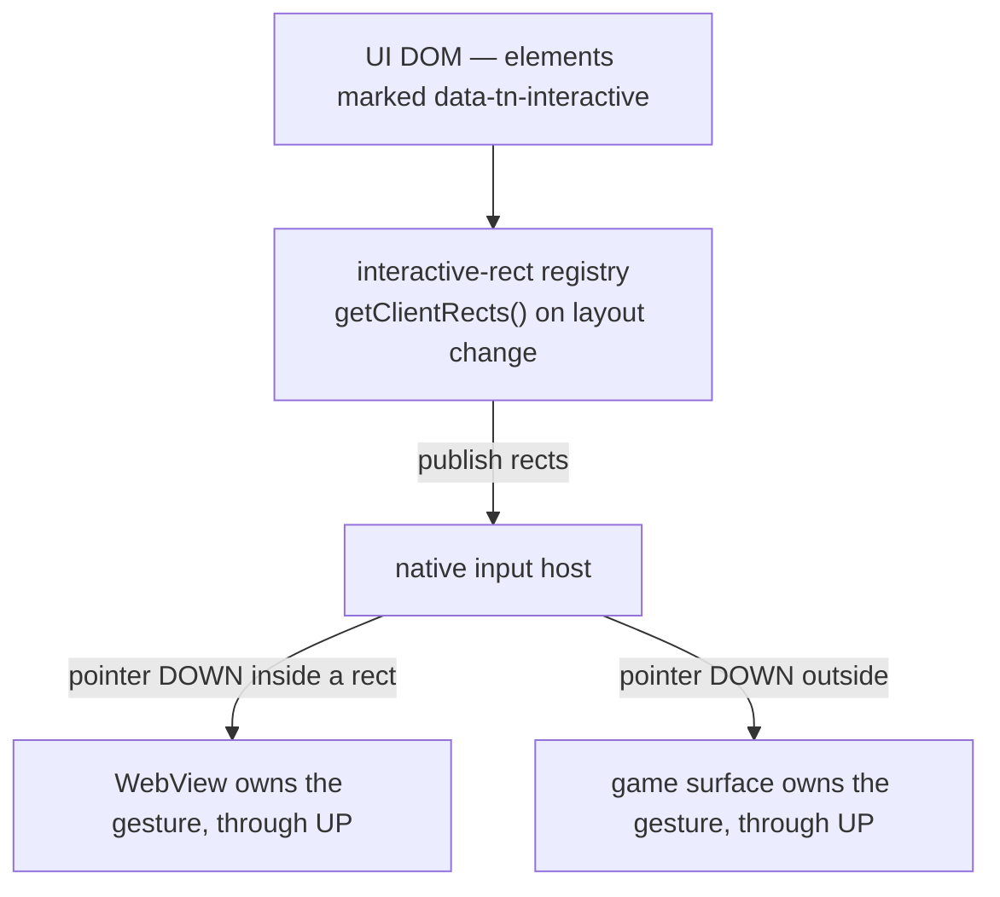

# PRD-217 — one UI layer that looks identical on every platform, via a WebView

**Status:** PROPOSED 2026-08-24. The load-bearing risk has been measured on a physical Pixel 8 and
came back clean; see "Spike" below. Nothing is implemented.

**Revised 2026-08-24** after external architecture review. Three things changed materially, and all
three make the PRD cheaper: desktop no longer assumes CEF (a native child WebView is tried first),
the input model is no longer `pointer-events: none` (it is an explicit hit-region protocol, which is
also what unifies the two mechanisms), and Android's bridge and asset loading come from
`androidx.webkit` rather than being hand-rolled. Unrevised: the Android spike, the charter
amendment's substance, and the scope line — this is still not the game in a WebView.

**Complexity:** +2 new platform surface (embedded WebView per target), +1 multi-package
(runtime-native + core + templates), +2 new capability with no incumbent, +1 charter amendment =
**6 → HIGH mode**.

Owner's requirements, verbatim: *"UI should look same everywhere"*, *"I cant loose
tailwing/css/svg"*, *"somehow ckicks go thorugh and we communcate throu events"*, and — scoping the
whole thing — *"btw this is not full game on wevbview"*.

## Context

PRD-216 shipped `@threenative/core/react`: a React reconciler that commits to `CanvasLayer` as
Three.js quads, so a HUD renders natively with no DOM and no WebView. It works. It is also, by
construction, a *different renderer* from the browser's, and the gap between the two is the whole
reason this PRD exists.

Measured divergence on one real game (`sandbox/fps-framework`, web capture versus Pixel 8 capture,
both recorded in `docs/verification/prd-216-2026-08-24.md`): the native HUD has no minimap, no
roster portraits, none of the four SVG glyphs, no touch-control art, no asset credits, and no way
to restart. Some of that is a game defect. The part that is not fixable in game code is the
vocabulary: the native overlay implements exactly twenty style keys and a 5x7 uppercase bitmap
font, against the browser's entire CSS, SVG and font stack.

Two ways to close a gap like that. Grow the native renderer until it can do what CSS does — which
is writing a browser, one ticket at a time, and is ruled out. Or move both platforms onto a single
restricted vocabulary — which was costed and rejected by the owner, because it means giving up
Tailwind, CSS and SVG in the HUD.

That leaves the third option: **use the browser that is already on the device.**

## What this is, and what it is not

A transparent, full-screen WebView composited **over** the game surface, rendering only the UI. The
game keeps its native GPU surface and its native loop. This is not the game in a WebView, and no
part of the scene, the simulation or the render path moves into it.



The UI is the same `src/ui/*.tsx` the web build already ships — same components, same Tailwind,
same SVG, same fonts. Identical appearance is not maintained; it is the same renderer.

## Spike — the risk that decides this, measured

The concern was compositing: a transparent WebView over a GL SurfaceView can fall back to GPU
composition, and this game is already GPU-bound at roughly 80 ms of render per frame. That would
have been fatal. It was measured before designing anything.

Method: a throwaway `WebView` added to `MystralActivity`, `Color.TRANSPARENT`,
`LAYER_TYPE_HARDWARE`, attached via `addContentView`, loading an inline HUD-shaped page —
absolutely positioned text, a semi-transparent rounded plate, an SVG circle with a stroke,
`pointer-events: none` throughout. Measured through `dumpsys SurfaceFlinger --timestats` over 20
seconds of steady state, against the same build without it. Physical Pixel 8, thermal status 0 in
both arms. The spike was reverted; nothing of it remains in the tree.

| Arm | Start temp | Frames in 20 s | averageFPS |
| --- | --- | --- | --- |
| Game only | 31.5 °C | 335 | 16.88 |
| Game + transparent WebView | 30.7 °C | 364 | **18.26** |

**No measurable compositing cost.** The WebView arm reads slightly faster, which is the 0.8 °C
temperature difference, not a speedup — the honest conclusion is that the extra layer costs less
than run-to-run variance. The system composited it as a hardware overlay.

Memory, same run: the WebView sandboxed process is **98 MB RSS**, plus a shared `webview_zygote` at
35 MB. The game process is 1.72 GB. So roughly 6%, in a separate process the OS can reclaim.

The capture is the proof, and it is unusually legible: with the spike attached, the screenshot
shows **both HUDs at once** — PRD-216's 5x7 quad HUD underneath, and the WebView's HUD on top with
a proportional antialiased font, a rounded translucent plate, and a stroked SVG circle. Every
feature in that second list is one the quad renderer cannot draw.

### What the spike did not establish

- **Touch pass-through was configured, not exercised.** `pointer-events: none` was set; no touch was
  actually delivered and traced to the SDL surface. This is the first thing Phase 1 must prove.
- The page was static. A HUD driven at 60 Hz from game state will cost more than zero; the spike
  bounds the *compositing* cost only.
- Android only. iOS `WKWebView` over a Metal layer is expected to behave the same and is unproven.
- Startup cost was not isolated (WebView init is typically 100–300 ms).

## Charter amendment — the exact replacement text

The owner's instruction: *"web and native should look the same by default with one code
controlling it all. There can still have the full native UI option if you want to control it
separately."* That is a default plus an escape hatch, and §6b should say so in those terms.

Proposed replacement for §6b's table and the paragraph under it:

> | Web | Desktop / Mobile |
> |---|---|
> | React 19 + react-dom | React 19 + react-dom, in a transparent WebView over the game surface |
> | Tailwind 4, CSS, SVG | The same Tailwind 4, CSS and SVG — the same renderer |
>
> **One UI, one web-standard rendering contract by default.** A game writes `src/ui/` once and the
> same React DOM, Tailwind, CSS, SVG, fonts and assets run unchanged on every target, through that
> platform's browser-class renderer. What is guaranteed is source parity and, to the bar in
> acceptance criterion 1, visual parity — not browser-binary parity, which no design using system
> engines can offer once iOS is in the set.
>
> **The native UI renderer remains, as an opt-in.** `@threenative/core/react` maps React to
> `CanvasLayer` quads with no WebView, no CSS and no second process. A game chooses it when it
> wants a UI that is part of the rendered frame, or a target with no WebView, or zero extra
> processes. Choosing it means owning the appearance difference — that is the trade the game is
> making, stated up front rather than discovered in a screenshot.
>
> Neither renderer touches `THREE.Scene`. The store rule below is host-independent and holds on
> every target, under both.

Two things the amendment must not quietly drop, because they are load-bearing and unrelated:
`react-dom` stays banned from the **portable entry** (`TN_NATIVE_WEB_ONLY_UI` guards the scene
graph, not the UI), and React still must never re-render on the game loop.

### What it says today, and why

`docs/architecture/CHARTER.md` §6b currently reads: *"Generated components share structure and
state across platform adapters; Tailwind remains web-only"*, and its table says *"no CSS or
WebView"*. `packages/core/src/react-layout.ts` carries the same reasoning in its header: *"a CSS
engine is a browser, which is the thing this whole path exists to avoid."*

This PRD contradicts that, deliberately and on the owner's explicit instruction. §6b must be
amended in the same commit as Phase 1, and the amendment should say what changed and why: the
charter assumed embedding a browser meant *shipping* one, and the measurement above shows the
platform already provides it for free at the composition layer.

**PRD-216's renderer is not deleted by this.** It stays as the no-WebView path — for desktop until
any target where a WebView is unavailable, and because a game that wants
zero extra processes should still have the option. What changes is which one a template defaults to.

## Two mechanisms, one UI

Desktop **ships to players** (owner, 2026-08-24), so it is not a dev target that can be left
behind. On Android the WebView is a sibling layer the system compositor blends for free — that is
precisely why it measured at zero.

An earlier draft of this PRD claimed desktop has no equivalent, and that SDL owning the window
rules out a transparent child surface. **That claim was wrong and is withdrawn.** `wry` — the
WebView library under Tauri, Apache-2.0/MIT — builds a WebView as a *child of an existing native
window* on Windows, macOS and Linux/X11, and its repository carries a `wgpu` example doing exactly
the thing this PRD needs: a transparent child WebView over GPU-rendered content. The mechanism the
Android row gets for free may be available on desktop too, at roughly zero bundle cost.

That reorders the desktop work. Offscreen rendering is still the fallback, and it is a good one,
but it is no longer the assumption.

| Target | Mechanism | Engine | Bundle cost | Why |
| --- | --- | --- | --- | --- |
| Android | Transparent `WebView` sibling layer | Chromium | ~0 (system) | Hardware overlay; measured free |
| iOS | Transparent `WKWebView` sibling layer | WebKit | ~0 (system) | Same shape as Android |
| Windows | `wry` child WebView on the SDL window | Chromium via WebView2 | ~0 (shared Evergreen runtime) | Chromium without shipping Chromium |
| macOS | `wry` child WebView on the SDL window | WebKit | ~0 (system) | Same engine family as iOS |
| Linux | `wry` child WebView on the SDL window | WebKitGTK | ~0 (system dep) | **The one real parity risk — see below** |
| Any desktop target that fails 3A | Offscreen render to texture | Chromium via CEF | ~150–250 MB | Accelerated OSR; the standard game answer |

**Why the Rust dependency is close to free here.** `packages/runtime-native/native/physics/` is
already a Rust crate — `rapier3d`, `crate-type = ["staticlib"]`, built by
`scripts/build-native-physics.mjs` and linked into the C++ host across every desktop target. A
`wry` module behind a C ABI is one more crate in a toolchain that is already required, not a new
class of dependency. This is the single biggest reason to spike `wry` before paying for CEF.

**Where the real desktop risk actually is.** It is not "wry versus CEF". Windows lands on Chromium
and macOS on WebKit — the same engine family as iOS, so a difference there is one the acceptance
bar already tolerates. **Linux is the outlier**: WebKitGTK is the weakest and most divergent of the
set, and it is where a blind observer is most likely to tell two captures apart. So the fallback
question is probably not "does desktop need CEF" but "does *Linux* need CEF", which is a much
smaller and much cheaper thing to be wrong about.

Known hazards, to be measured rather than assumed: on Linux, `build_as_child` is straightforward on
X11 but Wayland needs GTK embedding instead; on macOS, transparency in `wry` currently goes through
a private WebKit API, which is fine for Steam and direct distribution and disqualifying for a Mac
App Store build — if that bites, spike native `WKWebView` embedding directly before abandoning the
approach, since the fix is likely small and platform-local. Overlapping-WebView focus and cursor
bugs are real in the wild. 3A is a measurement, not an adoption.

### On "identical", honestly

Android and desktop-Windows are Chromium; iOS, macOS and Linux are WebKit-family. Strict pixel
identity across *all* targets is not achievable by any design that uses system engines — that
difference is the one every web app already ships with daily. The workable bar is acceptance
criterion 1: a blind observer cannot tell two captures apart. The escape hatch when a specific
platform fails that bar is CEF **on that platform**, not on all of them.

### The backend is never public API

The renderer choice a game makes is `web` or `native`. `wry`, CEF and the underlying system engine
are implementation details and must not appear in a game's config, its types, or its docs:

```ts
ui: { renderer: 'web' }      // default — platform picks the surface
ui: { renderer: 'native' }   // PRD-216's CanvasLayer quads, no WebView
```

That rule is adopted now, because it is free and because it is what lets 3B happen later without a
breaking change. The *abstraction* that eventually implements it is not specified here — a
`UiSurface` interface written before two backends exist is a guess, and §11.2's kill switch scores
it. It falls out of Phases 1–3; it does not precede them.

## Input — one hit-region protocol, not `pointer-events`

The earlier draft leaned on `pointer-events: none` for pass-through. **That does not work, and it
is the correction most likely to have cost a phase.** The WebView is a native view with a
rectangular hit-test region owned by the platform. CSS hit-testing happens *inside* that surface,
after the native view has already claimed the gesture; a transparent DOM region does not stop the
native view from being hit. `pointer-events: none` remains useful inside the page. It is not the
pass-through mechanism.

The mechanism is a small protocol, and the same one on every target:



A game marks its islands and nothing else:

```tsx
<button data-tn-interactive onClick={restart}>Restart</button>
```

Three rules make it correct. Ownership is decided **on pointer-down only** and held until
pointer-up, so a drag that starts on the game does not get stolen by a button it passes over. The
registry is **published on layout change**, never queried per-event — an async `elementFromPoint()`
per touch buys latency and races. And a moving island is the known failure mode: rects go stale
during CSS transitions and animations, so a transitioning root republishes per frame while its
transition is live, and Phase 0 asserts a button mid-slide.

This is what makes open question 3 answerable in advance rather than in Phase 3: the protocol is
identical whether the WebView is a sibling layer (Android, iOS, `wry`) or a texture (CEF OSR).
Under OSR the host already forwards input explicitly, so it is the same decision with a cheaper
hit test. One bridge, both mechanisms.

### Android gets this from `androidx.webkit`, not from hand-rolled glue

Adding `androidx.webkit:webkit` resolves two parts of this PRD that were open:

- **Assets** load through `WebViewAssetLoader`, which serves APK assets from an HTTPS-like origin
  (`https://appassets.androidplatform.net/…`) instead of `file://`. Same-origin, `fetch` and module
  imports then behave as they do on web — which is the entire point of open question 2.
- **IPC** uses `WebViewCompat.addWebMessageListener` and `WebMessagePortCompat`: origin-scoped
  listeners and browser-standard message channels, rather than `addJavascriptInterface` plus
  `evaluateJavascript` string-slinging. The contract is then a `MessagePort`-shaped one on every
  platform — `WKScriptMessageHandler` on iOS, `wry`'s IPC handler on desktop — instead of one
  bespoke shape per host.

Standardise the bridge on that message-port shape in Phase 0. Retrofitting it after three hosts
exist is the expensive version.

## Open questions

1. **Does a `wry` child WebView survive contact with the real SDL/WebGPU window?** The whole
   desktop cost profile hangs on this. Unmeasured: transparency, compositing over the GL surface,
   resize and fullscreen, focus, gamepad and keyboard routing, and the hit-region protocol above.
   Phase 3A is that measurement, per platform, and Linux/Wayland and macOS transparency are its
   two known-hazard rows.
2. ~~Asset loading inside the WebView.~~ **Answered for Android**: `WebViewAssetLoader` on an
   HTTPS-like origin. Remaining: the equivalent custom-scheme handler on iOS
   (`WKURLSchemeHandler`) and desktop (`wry` custom protocol / CEF scheme handler) — same shape,
   three implementations.
3. ~~Whether the two mechanisms can share one bridge.~~ **Answered by design**: the hit-region
   protocol and the message-port bridge are host-independent, so sibling-layer and texture modes
   differ only in who does the hit test. Phase 3 confirms rather than discovers.
4. **If a platform fails the parity bar, is CEF worth it for that platform alone?** Only Linux is
   a likely candidate. This is the one question that stays open for the owner, and it is now much
   smaller than "does desktop need CEF".

## Phases

**Phase 0 — prove the input model on Android.** Build the interactive-rect registry and the
message-port bridge, both host-independent from the first line. Touch on a non-interactive region
reaches the SDL surface and moves the player; touch on a published rect is consumed by the WebView
and does not; a drag starting on the game and crossing a button stays with the game; a button
mid-transition is hit where it is drawn, not where it was. The bridge carries UI intent to the game
(`restart`, `pause`) and published state back, over `addWebMessageListener`. Red: a scenario that
drives a pointer at the game surface through the overlay and asserts the player moved, failing
today because there is no overlay and no registry.

**Phase 1 — Android.** Ship the overlay behind a config flag and amend §6b. A generated game runs
its real `src/ui/` on a phone.

**Phase 2 — iOS.** Same contract on `WKWebView`.

**Phase 3A — desktop spike: native child WebView.** Attach a transparent `wry` child WebView to
the real SDL/WebGPU window, per platform, and run open question 1's acceptance list against it plus
the Phase 0 input tests unchanged. Cheap to attempt and it either eliminates CEF entirely or names
exactly which platforms cannot have it. Rust is already in this build, so the toolchain cost is
zero.

**Phase 3B — CEF fallback, only for platforms 3A fails.** Preferred path is **accelerated OSR**:
`OnAcceleratedPaint` hands back a GPU-backed resource — a D3D11 shared texture on Windows, an
`IOSurface` on macOS, native-buffer/DMA-BUF planes on Linux — which the host copies into a texture
it owns before the callback returns. That is GPU→GPU, not the "CPU paint then full-texture upload"
this PRD previously described, and it makes the fallback substantially better than it looked. CPU
`OnPaint` with dirty-rect upload is the fallback *to the fallback*. Accelerated OSR has live rough
edges — Linux/NVIDIA DMA-BUF in particular — which is one more reason it is not the default. Only
this phase is gated on the owner.

**Phase 4 — templates default to it**, and `NativeHud.tsx` leaves the starter.

## Acceptance criteria

1. The same `src/ui/Hud.tsx` renders on web and on a physical Pixel 8, and a blind observer cannot
   tell the two captures apart except for resolution. Evidence: paired screenshots.
2. A touch on empty HUD space moves the player; a touch on a published interactive rect does not; a
   drag beginning on empty space and crossing a button stays with the game; a button mid-transition
   is hit where it is drawn. All four asserted in a `--target android` playtest, each with its
   mutation named. The mutation for the first is *clearing the rect registry*, not *removing
   `pointer-events: none`* — that CSS property is not the mechanism and a red produced by touching
   it proves nothing.
3. Frame rate on the Pixel with the real HUD attached is within 5% of the same build with the HUD
   disabled, measured through `SurfaceFlinger --timestats`, both arms at thermal status 0.
4. `TN_NATIVE_WEB_ONLY_UI` still fires for a game that imports `react-dom` into the *portable*
   entry. The guard is about the scene graph and must not be weakened by this.
5. A game that does not opt in ships no WebView and no extra process.
6. iOS is either proven or stated unproven. No claim without a run.
7. Desktop carries its own frame-rate budget, same 5% shape as criterion 3, measured against
   `pnpm native:verify:desktop` on whichever surface 3A lands on — and named per platform, since
   Windows, macOS and Linux may not land on the same one.
8. No game-visible config, type or doc names `wry`, `cef`, `webview2` or `webkitgtk`. The public
   surface is `renderer: 'web' | 'native'`.

## Cost

Phase 0–1 is the bulk of the risk and is now small, because the compositing question is answered:
an Android `WebView` attached to the activity, the interactive-rect registry, and a message-port
bridge over `androidx.webkit`. The registry is the real work in Phase 0 and it is the piece every
later phase reuses unchanged.

Phase 3 is no longer the expensive unknown it was. 3A is a spike against a toolchain this repo
already builds, and its outcome is a per-platform answer rather than a single yes/no. Only 3B —
shipping 150–250 MB of Chromium, plausibly for Linux alone — needs the owner, and the question
reaching them is now much narrower than the one this PRD originally posed.
