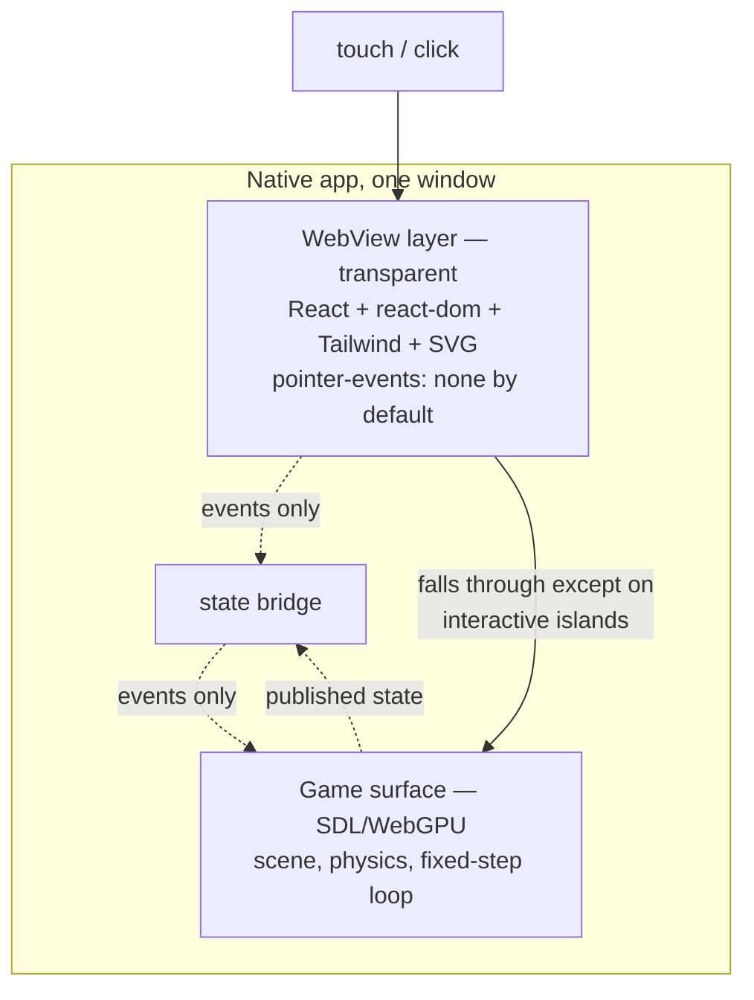

# PRD-217 — one UI layer that looks identical on every platform, via a WebView

**Status:** PROPOSED 2026-08-24. The load-bearing risk has been measured on a physical Pixel 8 and
came back clean; see "Spike" below. Nothing is implemented.

**Complexity:** +2 new platform surface (embedded WebView per target), +1 multi-package
(runtime-native + core + templates), +2 new capability with no incumbent, +1 charter amendment =
**6 → HIGH mode**.

Owner's requirements, verbatim: *"UI should look same everywhere"*, *"I cant loose
tailwing/css/svg"*, *"somehow ckicks go thorugh and we communcate throu events"*, and — scoping the
whole thing — *"btw this is not full game on wevbview"*.

## Context

PRD-216 shipped `@threenative/core/react`: a React reconciler that commits to `CanvasLayer` as
Three.js quads, so a HUD renders natively with no DOM and no WebView. It works. It is also, by
construction, a *different renderer* from the browser's, and the gap between the two is the whole
reason this PRD exists.

Measured divergence on one real game (`sandbox/fps-framework`, web capture versus Pixel 8 capture,
both recorded in `docs/verification/prd-216-2026-08-24.md`): the native HUD has no minimap, no
roster portraits, none of the four SVG glyphs, no touch-control art, no asset credits, and no way
to restart. Some of that is a game defect. The part that is not fixable in game code is the
vocabulary: the native overlay implements exactly twenty style keys and a 5x7 uppercase bitmap
font, against the browser's entire CSS, SVG and font stack.

Two ways to close a gap like that. Grow the native renderer until it can do what CSS does — which
is writing a browser, one ticket at a time, and is ruled out. Or move both platforms onto a single
restricted vocabulary — which was costed and rejected by the owner, because it means giving up
Tailwind, CSS and SVG in the HUD.

That leaves the third option: **use the browser that is already on the device.**

## What this is, and what it is not

A transparent, full-screen WebView composited **over** the game surface, rendering only the UI. The
game keeps its native GPU surface and its native loop. This is not the game in a WebView, and no
part of the scene, the simulation or the render path moves into it.

The UI is the same `src/ui/*.tsx` the web build already ships — same components, same Tailwind,
same SVG, same fonts. Identical appearance is not maintained; it is the same renderer.

## Spike — the risk that decides this, measured

The concern was compositing: a transparent WebView over a GL SurfaceView can fall back to GPU
composition, and this game is already GPU-bound at roughly 80 ms of render per frame. That would
have been fatal. It was measured before designing anything.

Method: a throwaway `WebView` added to `MystralActivity`, `Color.TRANSPARENT`,
`LAYER_TYPE_HARDWARE`, attached via `addContentView`, loading an inline HUD-shaped page —
absolutely positioned text, a semi-transparent rounded plate, an SVG circle with a stroke,
`pointer-events: none` throughout. Measured through `dumpsys SurfaceFlinger --timestats` over 20
seconds of steady state, against the same build without it. Physical Pixel 8, thermal status 0 in
both arms. The spike was reverted; nothing of it remains in the tree.

| Arm | Start temp | Frames in 20 s | averageFPS |
| --- | --- | --- | --- |
| Game only | 31.5 °C | 335 | 16.88 |
| Game + transparent WebView | 30.7 °C | 364 | **18.26** |

**No measurable compositing cost.** The WebView arm reads slightly faster, which is the 0.8 °C
temperature difference, not a speedup — the honest conclusion is that the extra layer costs less
than run-to-run variance. The system composited it as a hardware overlay.

Memory, same run: the WebView sandboxed process is **98 MB RSS**, plus a shared `webview_zygote` at
35 MB. The game process is 1.72 GB. So roughly 6%, in a separate process the OS can reclaim.

The capture is the proof, and it is unusually legible: with the spike attached, the screenshot
shows **both HUDs at once** — PRD-216's 5x7 quad HUD underneath, and the WebView's HUD on top with
a proportional antialiased font, a rounded translucent plate, and a stroked SVG circle. Every
feature in that second list is one the quad renderer cannot draw.

### What the spike did not establish

- **Touch pass-through was configured, not exercised.** `pointer-events: none` was set; no touch was
  actually delivered and traced to the SDL surface. This is the first thing Phase 1 must prove.
- The page was static. A HUD driven at 60 Hz from game state will cost more than zero; the spike
  bounds the *compositing* cost only.
- Android only. iOS `WKWebView` over a Metal layer is expected to behave the same and is unproven.
- Startup cost was not isolated (WebView init is typically 100–300 ms).

## Charter amendment — the exact replacement text

The owner's instruction: *"web and native should look the same by default with one code
controlling it all. There can still have the full native UI option if you want to control it
separately."* That is a default plus an escape hatch, and §6b should say so in those terms.

Proposed replacement for §6b's table and the paragraph under it:

> | Web | Desktop / Mobile |
> |---|---|
> | React 19 + react-dom | React 19 + react-dom, in a transparent WebView over the game surface |
> | Tailwind 4, CSS, SVG | The same Tailwind 4, CSS and SVG — the same renderer |
>
> **One UI, identical by default.** A game writes `src/ui/` once and it looks the same on every
> platform, because every platform runs it through the same browser engine. Parity is not
> maintained, reviewed or tested for; it is the consequence of there being one renderer.
>
> **The native UI renderer remains, as an opt-in.** `@threenative/core/react` maps React to
> `CanvasLayer` quads with no WebView, no CSS and no second process. A game chooses it when it
> wants a UI that is part of the rendered frame, or a target with no WebView, or zero extra
> processes. Choosing it means owning the appearance difference — that is the trade the game is
> making, stated up front rather than discovered in a screenshot.
>
> Neither renderer touches `THREE.Scene`. The store rule below is host-independent and holds on
> every target, under both.

Two things the amendment must not quietly drop, because they are load-bearing and unrelated:
`react-dom` stays banned from the **portable entry** (`TN_NATIVE_WEB_ONLY_UI` guards the scene
graph, not the UI), and React still must never re-render on the game loop.

### What it says today, and why

`docs/architecture/CHARTER.md` §6b currently reads: *"Generated components share structure and
state across platform adapters; Tailwind remains web-only"*, and its table says *"no CSS or
WebView"*. `packages/core/src/react-layout.ts` carries the same reasoning in its header: *"a CSS
engine is a browser, which is the thing this whole path exists to avoid."*

This PRD contradicts that, deliberately and on the owner's explicit instruction. §6b must be
amended in the same commit as Phase 1, and the amendment should say what changed and why: the
charter assumed embedding a browser meant *shipping* one, and the measurement above shows the
platform already provides it for free at the composition layer.

**PRD-216's renderer is not deleted by this.** It stays as the no-WebView path — for desktop until
that story is settled, for any target where a WebView is unavailable, and because a game that wants
zero extra processes should still have the option. What changes is which one a template defaults to.

## Open questions that must be answered before Phase 2

1. **Desktop.** Android has `WebView`, iOS has `WKWebView`. Desktop is SDL and has neither; the
   options are CEF (large), a system webview binding (`webview_deno`-style, small but thin), or
   leaving desktop on the PRD-216 renderer and accepting that desktop looks different. Desktop is
   currently the *cheapest* native target and this would make it the most expensive. **Unresolved,
   and it is the reason this PRD is not simply "replace the quad renderer".**
2. **Does desktop native ship to players, or is it a dev/test target?** The answer changes (1) from
   blocking to cosmetic. Asked, not yet answered.
3. Asset loading inside the WebView — bundled `file://`, or served from an in-process origin so
   `fetch` and module imports behave as on web.

## Phases

**Phase 0 — prove the input model.** Touch on a non-interactive region reaches the SDL surface and
moves the player; touch on an interactive island is consumed by the WebView and does not. An event
bridge carries UI intent to the game (`restart`, `pause`) and published state back. Red: a scenario
that drives a pointer at the game surface through the overlay and asserts the player moved, failing
today because there is no overlay to pass through.

**Phase 1 — Android.** Ship the overlay behind a config flag, amend §6b, keep the quad renderer as
the default until Phase 3. A generated game runs its real `src/ui/` on a phone.

**Phase 2 — iOS.** Same contract on `WKWebView`.

**Phase 3 — desktop, or an explicit decision not to.** Resolve open question 1 with the answer to 2.

**Phase 4 — templates default to it**, and `NativeHud.tsx` leaves the starter.

## Acceptance criteria

1. The same `src/ui/Hud.tsx` renders on web and on a physical Pixel 8, and a blind observer cannot
   tell the two captures apart except for resolution. Evidence: paired screenshots.
2. A touch on empty HUD space moves the player; a touch on a HUD button does not. Both asserted in
   a `--target android` playtest, each with its mutation named.
3. Frame rate on the Pixel with the real HUD attached is within 5% of the same build with the HUD
   disabled, measured through `SurfaceFlinger --timestats`, both arms at thermal status 0.
4. `TN_NATIVE_WEB_ONLY_UI` still fires for a game that imports `react-dom` into the *portable*
   entry. The guard is about the scene graph and must not be weakened by this.
5. A game that does not opt in ships no WebView and no extra process.
6. iOS is either proven or stated unproven. No claim without a run.

## Cost

Phase 0–1 is the bulk of the risk and is now small, because the compositing question is answered:
an Android `WebView` attached to the activity, an input hit-test, and a JSON event bridge over
`addJavascriptInterface`/`evaluateJavascript`. Phase 3 is the expensive unknown and is gated on a
question only the owner can answer.
