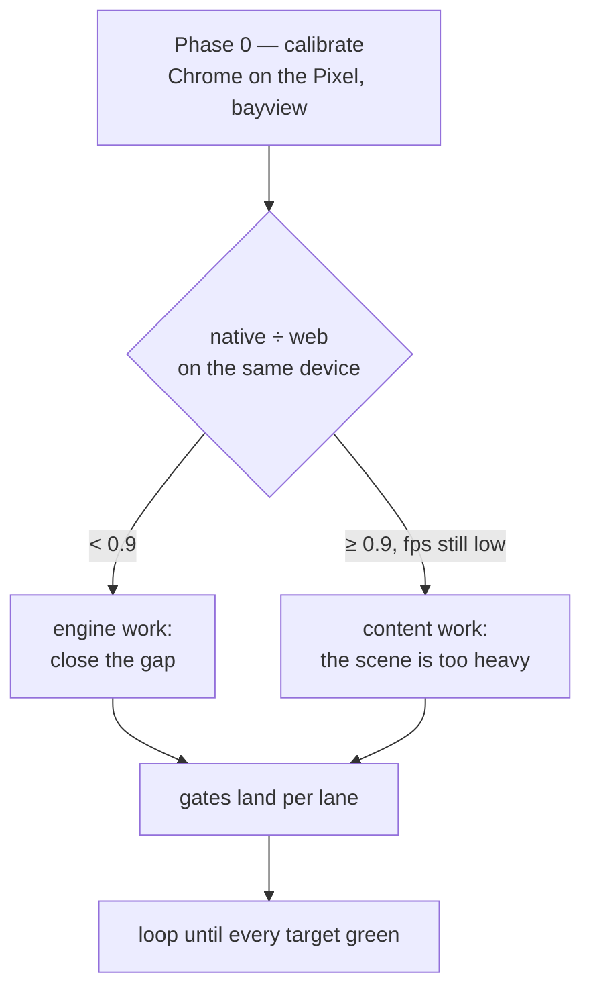

# PRD-222 — every platform has a frame-rate target, and a gate that fails when it is missed

**Status:** NOT STARTED — filed 2026-08-25 as a standing benchmark contract. This PRD is written
to be executed by an agent looping until the bar is met, so every target below names the command
that decides it and the evidence that closes it.
**Complexity:** +3 measurement across five platform lanes, +2 complex performance work,
+1 device seam = **6 → HIGH mode**, checkpoint after every phase.

**Depends on:** `packages/core/src/frame-budget.ts` (`TN_FRAME_BUDGET`, landed by PRD-214 Phase 3),
`assert.performance` in `packages/playtest` (`minFps`, `maxFrameMsP95`, `maxPhaseMsP95`),
`observations.deviceMetrics` and `packages/runtime-native/scripts/device-preflight.mjs`.

## Context

The owner's bar, stated 2026-08-25: **"we should run with the same performance as web."** That is
the right target and it is not yet a gate. Today the only fps floor in the repo is a single
`minFps: 24` on one example scenario; no platform has a stated ceiling, no lane compares native
against web, and the phone number nobody can beat has been re-derived by hand three times in three
sessions.

### What is measured today, and what it is worth

Every row is from a physical Pixel 8 (`shiba`, Mali-G715, 60 Hz) or a desktop Chromium WebGPU run.
Rows marked **pre-fix** were taken before the material-keyed batch lane landed (`385fd50e`,
2026-08-25) and are therefore a baseline, not a current state.

| lane | scene | fps | frame p50/mean | render | notes |
| --- | --- | --- | --- | --- | --- |
| native Android, 2400×1080 | bayview | **17.3** | 51.8 ms | 41.7 ms | pre-fix, cool: 31 °C, thermal 0 |
| native Android, 1200×540 | bayview | **23.1** | 41.5 ms | 35.2 ms | pre-fix; ¼ the pixels buys 15% of render |
| native Android, 2400×1080 | starter | **59.99** | 8.47 ms | 7.88 ms | light scene, same host, same phone |
| browser desktop (Vulkan) | bayview | ~69 | 14.5 ms p95 | — | `frame-smoothness.playtest.json`, 1302 frames, 0 spikes |
| browser Android (Chrome 151) | bayview | **unmeasured** | — | — | **the missing number this PRD exists to get** |

Three things follow, and they shape every target below.

1. **The host is not the ceiling.** The same native runtime on the same phone renders the starter
   template at 59.99 fps. Whatever costs bayview 42 ms of render is content and draw submission,
   not the C++ host.
2. **It is draw-bound, not fill-bound.** Quartering the pixel count cut render time 15%. Recorded
   refuted twice; do not re-test it.
3. **"Same performance as web" is only meaningful on the same device.** Desktop Chromium runs on a
   discrete GPU; the Pixel does not. Comparing 69 fps there against 17 fps here measures the
   hardware, not the framework. The honest comparison is Chrome-on-the-Pixel against
   native-on-the-Pixel, and that number has never been taken.

## Solution

**Two axes, because they fail for different reasons and have different owners.**

- **Overhead** — what the framework costs on a scene that is nearly empty. Owned by the engine.
  Measured on the starter template, which every platform can run.
- **Parity** — what the framework costs *relative to the browser on the same device*, on a real
  scene. Owned jointly: a gap is engine work; no gap on a slow number means the scene is too heavy
  and the fix is content.

A parity ratio is the load-bearing idea here. It cancels the hardware out, so one number means the
same thing on a Pixel 8, a laptop and whatever ships next year.



## The targets

Three tiers. A lane is **red** below Floor, **amber** between Floor and Target, **green** at or
above Target. The loop's job is to take every lane to green and keep it there.

### Tier 1 — overhead, on the starter template

The framework's own cost, on a scene with nothing interesting in it. No excuse applies here: a
miss is engine work.

| platform | Floor | **Target** | measured today |
| --- | --- | --- | --- |
| browser, desktop Linux (WebGPU/Vulkan) | 60 fps | **matches display refresh** | unmeasured |
| browser, Android Chrome | 30 fps | **58 fps** | unmeasured |
| native, desktop Linux | 60 fps | **matches display refresh** | unmeasured |
| native, Android (Pixel 8) | 55 fps | **58 fps** | **59.99** ✅ |
| native, iOS | — | — | no lane; named unverified |

Phase ceilings at p95, all platforms, starter template:
`hostGap ≤ 4 ms`, `update ≤ 2 ms`, `residual ≤ 0.5 ms`, `overlay ≤ 1 ms`.

### Tier 2 — parity, on a real scene

Run the **same scene** twice on the **same device**: once in that platform's browser, once on the
native host. `parity = nativeFps ÷ webFps`.

| measure | Floor | **Target** |
| --- | --- | --- |
| `parity` (fps) | 0.85 | **0.95** |
| `parity` (render phase p95, inverted) | 0.80 | **0.95** |

**0.95, not 1.0, and not higher.** The native host and the browser do not schedule identically —
the browser owns its own compositor and vsync, the host owns a present tick — so demanding exact
equality would make the gate fail on noise rather than on regressions. Ratios above 1.0 are
allowed and interesting; record them, never clamp them.

A parity run whose two halves were not taken on the same device, within the same thermal window,
against the same build of the scene is **not a parity run** and must be discarded.

### Tier 3 — shippability, on the game a player holds

The absolute floor a real game must clear on the reference phone before it is called finished.

| scene class | Floor | **Target** |
| --- | --- | --- |
| light — the starter, a menu, a title | 55 fps | **58 fps** |
| medium — one arena, a few characters | 30 fps | **58 fps** |
| heavy — bayview: a town, 5v5, ~800 renderables | **30 fps** | **58 fps** |

**bayview is the hard case on purpose.** It is 17.3 fps pre-fix. Getting it to 30 is this PRD's
headline, and to 58 is the stretch.

### Thermal and power, on every device run

Frame rate measured on a hot phone is not a measurement. These bound the run, not the game:

| measure | limit |
| --- | --- |
| battery temperature at start | ≤ 35 °C |
| thermal status at start | 0 (NONE) |
| thermal status at any sample | ≤ 1 (LIGHT) |
| temperature rise across the run | ≤ 6 °C |
| charging | **not charging** — use Wi-Fi ADB |
| battery level | ≥ 50% (`device-preflight.mjs`) |

A run flagged `thermallyConfounded` reports its numbers in full and **withdraws the comparison**,
never the measurement.

## How each target is measured

The loop must use these exact commands. A number produced any other way does not close a row.

**Preflight, before any device run:**

```sh
node packages/playtest/dist/runner/cli.js doctor --device <serial> --text
node packages/runtime-native/scripts/device-preflight.mjs <serial>
```

**Browser, desktop:**

```sh
node packages/playtest/dist/runner/cli.js <scene>.playtest.json \
  --url http://127.0.0.1:<port> --server-command "<dev command>" \
  --browser-recipe webgpu --headed
```

`--browser-recipe webgpu` is mandatory and `--headed` is mandatory for any pixel-producing run:
headless Chromium serves WebGPU from SwiftShader, and the runner fails such a run
`TN_PLAYTEST_SOFTWARE_ADAPTER`. A run that does not name its adapter is not evidence.

**Browser, Android** — Chrome on the phone against the host's dev server, reached by reverse
tunnel. This lane does not exist yet and Phase 0 builds it:

```sh
adb -s <serial> reverse tcp:<port> tcp:<port>
adb -s <serial> shell am start -a android.intent.action.VIEW \
  -n com.android.chrome/com.google.android.apps.chrome.Main \
  -d "http://127.0.0.1:<port>"
```

**Native, Android:**

```sh
node packages/playtest/dist/runner/cli.js <scene>.playtest.json \
  --target android --package <id> --activity com.threenative.runtime.MystralActivity \
  --device <serial>
```

**The number itself** comes from `TN_FRAME_BUDGET`, which the loop owns and prints on every
platform. Read `fps`, `frame.p50`, `frame.p95` and `phases.*.p95` from a **steady-state window** —
never window 1, which contains the launch stall. Discard the first window, take the median of the
next three.

## Integration Ledger

| # | New thing | Live caller | Replaces | Old path removed? | Negative control |
|---|-----------|-------------|----------|-------------------|------------------|
| 1 | Android browser lane in the playtest runner (`--target browser --device <serial>`) | `packages/playtest/src/runner/` | hand-driven Chrome, which nobody has run | n/a — new | point it at a dead port → named failure, never a skip or a silent desktop fallback |
| 2 | `assert.parity` — two runs, one ratio, one verdict | scenario `assert` block; evaluated in `packages/playtest/src/evaluators/` | eyeballing two reports | n/a — new | feed it two runs from different devices → refuses with a named diagnostic |
| 3 | Per-platform performance gates in the shipped scenarios | `templates/*/playtests/*.playtest.json`, `sandbox/fps-framework/playtests/` | one `minFps: 24` on one example | replaced in place | raise a floor to `minFps: 1000` → runner exits 1, observed |
| 4 | This target table, generated into the templates' AGENTS.md | `packages/create-threenative/templates/*/AGENTS.md` | nothing — no game is told what to hit | n/a — new | a convention missing from the templates' AGENTS.md does not exist |

### Reachability

**How is this reached?** Every game built with the framework presents frames; the budget marker
already prints beside them on every platform. **User-facing?** A player feels 17 fps as broken and
58 fps as a game. **What does this replace?** Three sessions of re-deriving the same phone number
by hand, and a bar that lived in one person's head.

## Execution Phases

#### Phase 0 — calibrate: what does the browser do on this phone?

**This phase decides every target that follows. Do it first and do not skip it.**

- [ ] Build the Android browser lane (ledger row 1), or drive Chrome by hand once and record it as
      a hand-driven run.
- [ ] Same scene, same phone, same thermal window, twice: Chrome 151 on the Pixel 8, then the
      native APK. Both with `TN_FRAME_BUDGET` and `deviceMetrics`.
- [ ] Compute `parity`. Write the answer into `docs/verification/prd-222-<date>.md` **before**
      touching any engine code.

The result splits the work and must be stated plainly:

- **parity < 0.85** → the host is behind the browser on identical hardware. Engine work, and
  Phase 0's own numbers name which phase (`render`, `hostGap`, `update`) owns the gap.
- **parity ≥ 0.85 with both numbers low** → the browser is no faster; bayview is simply too heavy
  for the phone. The work is content and draw-count, and "match web" is already true.
- **parity > 1.0** → native is ahead. Record it; it is the outcome the framework is for.

#### Phase 1 — the gates exist and are observed red

- [ ] `assert.parity` (ledger row 2), red-first: two runs from different devices refuse by name.
- [ ] Tier 1 and Tier 3 floors land in the shipped scenarios; each observed red once by moving the
      floor above the measured value, and the failure pasted.
- [ ] No lane is allowed to skip. A platform with no observer fails
      `TN_PLAYTEST_UNSUPPORTED_ON_TARGET` naming the working target.

#### Phase 2 — take the lanes to Floor

Ordered by what Phase 0 names. Absent a Phase-0 surprise, the standing order is:

- [ ] bayview native Android to **30 fps** — the headline. Levers already ranked in PRD-214 and
      re-measured 2026-08-25: material/node evaluation first, shadow pass second, draw submission
      third (the batch lane landed `385fd50e`; its device number is still owed and is the first
      thing to take).
- [ ] Every Tier 1 row to Floor.
- [ ] Every Tier 3 row to Floor.

#### Phase 3 — take the lanes to Target, and hold them

- [ ] Each lane to its Target column.
- [ ] The gates run in the lane every later change re-runs, so a regression is red rather than
      anecdotal.
- [ ] The table lands in the templates' AGENTS.md (ledger row 4).

## Acceptance criteria

1. **Every platform has a number.** Each row of Tiers 1–3 is measured or explicitly named
   unverified with the reason. No row is blank.
2. **Parity is measured on the same device, not across devices.** Each parity claim names its
   serial, both builds, and its thermal verdict; a `thermallyConfounded` run is re-taken.
3. **Each gate was observed red before it was trusted green**, with the mutation named and both
   reports pasted.
4. **bayview clears 30 fps on the physical Pixel 8** in a thermally clean run — the Tier 3 heavy
   Floor.
5. **No result claims a platform it did not execute.** Emulator numbers are never a device claim;
   the emulator's software GL claims no performance at all and is functional-only.
6. **House gates stay green:** `pnpm typecheck && pnpm lint && pnpm test`, `pnpm budgets`,
   `pnpm sync:agents --check`.

## For the agent looping on this

- **Take Phase 0 first.** Every target after it is conditional on the calibration number, and
  optimizing before it is how three sessions got spent re-deriving the same 17 fps.
- **One lever at a time, measured before and after, on a cool phone.** Two levers in one run means
  neither is attributed.
- **Record refutations.** A lever that does nothing is a result and belongs in the verification
  file — resolution and fill rate are already refuted twice; do not spend a fourth run on them.
- **The phone is the bottleneck of the loop, not the code.** It needs to cool between runs, and it
  has a battery floor. Batch the questions you ask it: instrument on the host, then take one
  capture that answers several rows.
- **Never claim a gate you did not run.** "Unverified" is an acceptable answer and the only honest
  one for a row nobody measured.

**Named unverified at proposal time:** every Tier 1 row except native Android; every Tier 2 row
(no parity run has ever been taken); iOS entirely (no lane, excluded by standing rule); Windows and
macOS desktop (no host); and bayview's post-batch-fix device number, which is owed by
`docs/bugs/render-projection-cannot-batch-differing-geometries-2026-08-25.md` and is the first
measurement this PRD should collect.
