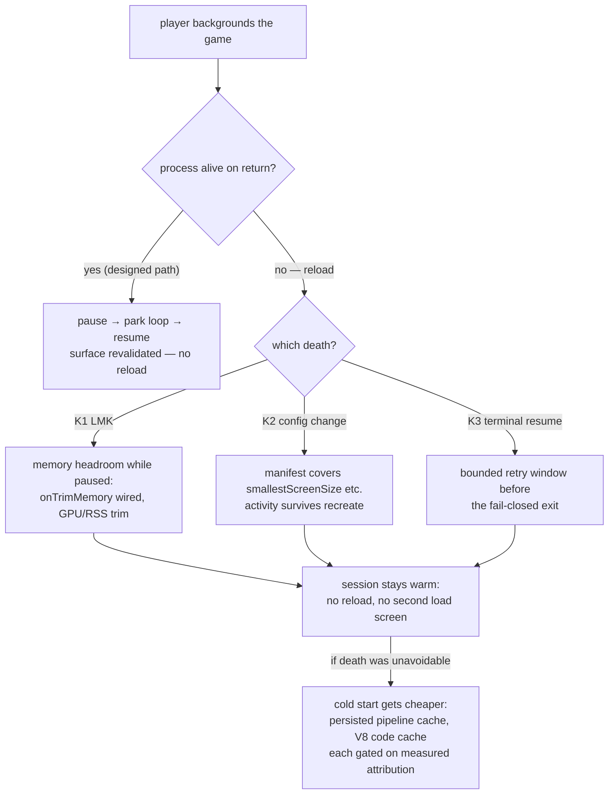

# PRD-222 — returning from the background resumes play instead of reloading the game

**Status:** PARTIAL — Phase 0 attributed K2 on a physical Pixel 8 and emulator; Phase 1's
13-axis manifest fix is implemented and emulator-proven. Physical green confirmation, K1/K3,
10-minute survival, trim headroom and cache investigations remain open. Two player-visible
complaints share one root system: (a) backgrounding a game and coming back replays the whole
loading sequence; (b) the loading screen shows a static "PREPARING" for seconds before anything
moves, and the ask is whether results can be cached so loads stop repeating.

**Complexity:** +3 for 10+ files across runtime-native/core/templates, +2 for complex state logic
(lifecycle and memory policy), +2 multi-package = **7 → HIGH mode**, checkpoint after every phase.

## Context — what exploration established

Everything below was read out of the current tree and prior device records on 2026-08-25; each
claim carries its location. The reported game is `sandbox/fps-framework` ("bayview",
`com.threenative.bayview`).

### How Android hosting actually works here

Native surface + embedded V8 in one process — **not a WebView**. `MystralActivity extends
SDLActivity`
(`packages/runtime-native/android/app/src/main/java/com/mystral/engine/MystralActivity.java:25`),
SDL3 calls `SDL_main`, which builds the V8+wgpu runtime and evals the bundled game
(`packages/runtime-native/src/platform/android_main.cpp:119,250,261`). The WebView exists only as
the optional UI overlay (PRD-217).

Plain short backgrounding does **not** destroy the activity or the JS realm:
`AndroidManifest.xml:33` covers
`keyboard|keyboardHidden|orientation|screenSize|screenLayout|navigation|uiMode|density`, and a
Pixel 8 run proved pid-stable survival across a 12 s background/resume with the surface rebuilt
against a new `ANativeWindow`
(`docs/bugs/resume-presents-nothing-2026-08-23.md`, fixed 2026-08-23; PRD-210 phases 1–4 landed).
The pause/resume machinery works: loop parks, audio suspends, surface revalidates
(`packages/runtime-native/src/platform/lifecycle.cpp:57-165`,
`runtime.cpp:884-1031`).

**So when a player reports "it reloads everything", the process died while backgrounded and
Android cold-restarted it from recents.** Three named paths can kill it today:

| # | Death path | Evidence |
| --- | --- | --- |
| K1 | **LMK kills the cached process.** Footprint ~1.5–1.6 GiB RSS with a ~500 MiB GPU floor plus ~64 MiB leaked *per resize* permanently (mobile-stability bug 12); GPU memory is not freed on pause (`lifecycle.cpp` has no trim path; `SDL_EVENT_LOW_MEMORY` maps to `RecordOnly` at `lifecycle.cpp:81-82`; no `onTrimMemory` anywhere under `android/`). | `docs/bugs/mobile-stability-2026-08-23.md` bugs 4/8/12 |
| K2 | **An uncovered config change recreates the activity in-process**, and SDL then exits the whole process: `nativeAllowRecreateActivity()` defaults false and is hinted nowhere in this repo → `System.exit(0)` (`third_party/sdl3/.../SDL_android.c:1545`, `SDLActivity.java:357-370`). The manifest list omits `smallestScreenSize` — entering split-screen/freeform, or a font-scale/locale/color-mode change, hits exactly this. | `AndroidManifest.xml:33`; SDL sources above |
| K3 | **Terminal resume failure.** If surface revalidation exhausts its bounded 5 s wait (returning onto a locked/dozing screen — same family as the recorded `ERROR_SURFACE_LOST_KHR` startup death), the loop stops with exit code 1 and SDL finishes the activity → next entry is a cold start. Fail-closed by design (PRD-210), but currently one bad resume costs the whole session. | `docs/bugs/resume-presents-nothing-2026-08-23.md` third finding; `runtime.cpp:966-975,1021-1030` |

These are ranked hypotheses, not verdicts — **Phase 0 settles which of them the player actually
hit**, in one device session (`dumpsys activity exit-info`, logcat `AmKill`/`lowmemorykiller`/
`TN_LIFECYCLE_SURFACE_FAILED`, and whether `TN_PRESENTS_TICK` frames restart near zero).

### What "PREPARING" is, and what caching can and cannot buy

- The static label is game HUD fallback: `sandbox/fps-framework/src/ui/Hud.tsx:301-303` renders
  "PREPARING" whenever its asset counter is still zero. On native the counter never populates
  because publications are dropped while the UI bridge has no peer
  (`packages/core/src/ui-state.ts:107` flush gate, `:120` initial publish) — web populates it.
  **That seam is already owned**: PRD-218 criterion 2 ("live overlay progress") and its Phase 0
  ("engine progress callback vs game manifest count"). This PRD does not re-own it; it depends on
  it.
- Asset IO is not the cost. Measured twice: 3.2 ms of asset reads on an Android emulator
  (PRD-075 Phase 2, RECOMMEND-AGAINST), 1.0–2.4 s of real load against a 12–14 s synchronous
  stall that is first-use pipeline compilation (~8 s / 105 calls) plus 346 MB texture upload
  (PRD-218 context §1). **Caching files therefore buys almost nothing.**
- Everything warm dies with the process: decoded GLBs live in a per-session loader Map
  (`packages/core/src/assets.ts:280-325`), uploaded textures and compiled pipelines live in the
  V8 realm and GPU. No service worker, Cache API, IndexedDB or OPFS anywhere in packages or
  templates. A persisted pipeline cache is confirmed unreachable through the API this host binds
  (PRD-070 header note). Native reads assets fresh from APK/disk per fetch
  (`packages/runtime-native/src/runtime-scripts/fetch-polyfill.js`;
  `runtime.cpp:1739-1790` read order: embedded bundle → APK asset → libuv disk).

**The honest answer to "can we cache this":** the only cache that pays is *the session itself*.
Keeping the process alive keeps every decoded model, uploaded texture and compiled pipeline warm,
and return-from-background becomes free — which is why K1/K2/K3 are this PRD's subject. Making an
unavoidable cold start cheaper needs new host APIs and is gated on measurement, not assumed.

## Solution

Three tracks, strictly ordered:

1. **Track A — name the death before fixing anything.** One instrumented device run reproduces
   the reload and attributes it via exit-info/logcat/markers. Nothing else in this PRD is
   authorised until this produces a cause table.
2. **Track B — close the preventable deaths.** Manifest coverage (K2), a bounded retry window on
   the terminal resume path (K3), and measurable memory headroom while paused (K1). Each is a
   small vertical slice with its own negative control.
3. **Track C — make unavoidable cold starts cheaper.** Investigations only, each gated on
   Phase 0's attribution and closed RECOMMEND-AGAINST if the measurement does not justify it
   (precedent: PRD-075's D6 decision).

**Key decisions**

- Fail-closed semantics stay. The retry window (Track B, K3) bounds *when* we give up and keeps
  every failure named; it does not reintroduce silent black-screen frames.
- Memory relief is mechanism, never appearance: the framework may release what it owns
  (swapchain-adjacent GPU allocations, caches it controls); decisions about dropping game assets
  belong to game code behind a callback, mirroring the convention/override pattern.
- No re-owning of PRD-218's stall attribution or overlay-progress work; where the two PRDs touch,
  PRD-218 owns the loading screen's truthfulness, this PRD owns how often the player sees it at
  all.
- Cold-start budget numbers stay with PRD-218's criterion 2; Track C must show a measured delta
  against that baseline or be killed.

## Integration Ledger

Rows written at plan time as intent; caller cells are filled with real non-test `file:line` during
implementation. A row still `TBD` at phase end fails the checkpoint.

| # | New thing | Live caller (target site) | Replaces | Old path removed? | Negative control |
|---|-----------|--------------------------|----------|-------------------|------------------|
| 1 | Widened `android:configChanges` (+ `smallestScreenSize`, `fontScale`, `locale`, `colorMode`, `layoutDirection`) | `packages/runtime-native/android/app/src/main/AndroidManifest.xml:33` (+ packager-written manifest if one exists — verify during implementation) | uncovered-change → `System.exit(0)` path | n/a (behaviour gap) | revert the line on-device → split-screen entry logs activity recreate + process death; restored line → pid stable |
| 2 | Bounded retry window on failed resume revalidation | `packages/runtime-native/src/runtime.cpp:1021-1031` revalidation call site | immediate terminal quit on first failure | old single-shot path deleted, not kept beside | forced-fail harness: HEAD exits ≤5 s; patched build retries N× over M s, names each attempt, terminates after window |
| 3 | `onTrimMemory` → lifecycle watch wiring (LOW_MEMORY levels actionable) | `lifecycle.cpp:81-82` case upgrade + `MystralActivity` override → existing event-watch send path | `RecordOnly` LOW_MEMORY | RecordOnly branch removed for levels acted upon | force a trim level via `am send-trim-memory` → markers show level received + action taken; reverting leaves only "observed" |
| 4 | Host-side pause-time trim + optional JS trim callback | pause arm of the lifecycle watch (`lifecycle.cpp:134-144`) → JS global installed per shim-manifest contract | nothing (new) | n/a | trim during playtest → RSS/GPU deltas logged per `TN_LIFECYCLE` marker; no-op when heap already tight |
| 5 | Persisted pipeline-cache binding (investigation → spike) | wgpu-native/Dawn device creation in `android_main.cpp`/bindings, if the API exists | nothing | n/a | spike with cache file deleted vs present → second launch compile time must differ measurably, else kill row |
| 6 | V8 per-game code cache (investigation) | snapshot/code-cache setup beside `android_main.cpp:135-160` | nothing | n/a | eval-time marker with cache primed vs cleared → delta or kill row |

### Reachability

- **Entry points:** all changes sit inside flows that already execute — the lifecycle event watch,
  the resume path, the Android activity lifecycle, device creation at startup. No new entry point.
- **User-facing?** Yes, without UI: the player backgrounds and returns mid-session and either
  resumes instantly or, at worst, reloads faster. Observable via markers and screencaps.
- **Full flow:** player presses home → (B) host trims what it owns, audio parked, loop parked →
  OS pressure arrives → trim levels answered instead of silent eviction → player returns →
  surface revalidated (with bounded retries) → play continues from the same scene. If the process
  still died: relaunch runs the (PRD-218-fixed, honest) loading screen once, with any Track C
  cache cutting its cost.
- **What does this replace?** Nothing wholesale — it closes three specific death paths and two
  absent caches. The replaced incumbents are named per ledger row.

## Execution Phases

#### Phase 0: name why the process dies — the reload reproduced and attributed

**Files (max 5):** `docs/verification/prd-222-<date>.md` (NEW), small probe additions to the
existing lifecycle markers if needed (`lifecycle.cpp`, EDIT), probe script (NEW, scripts/).

- [ ] On the Pixel 8 lane, reproduce the player report: background fps-framework mid-play for
      30 s / 2 min / 10 min arms, foreground again, each cycle recording pid continuity,
      `dumpsys activity exit-info com.threenative.bayview`, logcat (`AmKill`, `lowmemorykiller`,
      `TN_LIFECYCLE*`), and whether `TN_PRESENTS_TICK` frames continue or restart near zero.
- [ ] Same protocol once through split-screen entry and once onto a locked screen, covering K2
      and K3 deliberately rather than hoping ambient pressure picks.
- [ ] Deliverable: a cause table attributing each observed reload to K1/K2/K3 or naming a fourth.

**Nothing below is authorised until this table exists.** Negative control: the protocol run at
HEAD must show at least one reload; a protocol that reproduces nothing measures nothing.

#### Phase 1: split-screen and font-scale stop killing the process (K2)

**Files (max 5):** `AndroidManifest.xml` (EDIT), packager manifest source if separate (verify +
EDIT), scaffolded-template manifest test (EDIT/NEW), verification record (EDIT).

- [ ] Add the missing config-change axes; decide explicitly whether SDL's recreate-activity hint
      stays off (manifest-only fix) or turns on — document which and why in the record.
- [ ] Emulator proof: enter split-screen mid-play → pid unchanged, scene intact, resize markers
      flow. Pixel 8 confirmation owed to the physical lane.
- [ ] Red first: with `smallestScreenSize` reverted, split-screen entry shows recreate + process
      exit in logcat — paste both runs.

**Revert check:** removing the added axes re-exposes the kill; the emulator scenario goes red.

#### Phase 2: a failed resume retries before it quits (K3)

**Files (max 5):** `runtime.cpp` (EDIT), `lifecycle.cpp` (EDIT), bindings-level test executable
or spec (EDIT), verification record (EDIT).

- [ ] Bounded retry window (e.g. N attempts over M seconds, values from Phase 0 evidence, not
      invented) around surface revalidation; every attempt emits its named marker; exhaustion
      keeps today's fail-closed exit unchanged.
- [ ] Red-green via forced-fail harness: HEAD = single attempt then exit; patched = observed
      retries then identical terminal behaviour. Locked-screen device rung confirms the family.
- [ ] Assert no frame presents into an unvalidated surface during the window (the invariant
      PRD-210 bought stays intact).

#### Phase 3: a backgrounded game holds enough headroom to survive LMK (K1)

**Files (max 5):** `lifecycle.cpp` (EDIT: LOW_MEMORY levels actionable), JNI bridge in
`MystralActivity`/SDL override (EDIT), host trim path (EDIT), measurement script + record
(NEW/EDIT).

- [ ] Wire `onTrimMemory` levels into the existing event-watch send path; act on moderate+
      levels: host frees what it owns; optional JS-side trim callback invoked with the level
      (shim-manifest row included).
- [ ] Measure RSS/GPU before pause, after trim, after 10 min backgrounded — deltas land in the
      record per marker.
- [ ] **Kill criterion:** if achievable headroom is < ~15 % of footprint, close this phase
      RECOMMEND-AGAINST with the numbers, like PRD-075's D6 — a trim that cannot move LMK odds
      is cost without benefit.

#### Phase 4: unavoidable cold starts get measurably cheaper (Track C)

**Files (max 5 per investigation; run as separate slices):** spike branches touching device
creation (`android_main.cpp`, `bindings.cpp`) and eval setup, plus verification records.

- [ ] 4a — persisted pipeline cache: survey whether the bound wgpu-native/Dawn exposes a
      persistent pipeline/cache API at the pinned versions; if yes, spike it and measure
      second-launch compile time against PRD-218's 8 s figure; if no, close the row with the API
      citation. Kill rule: no measurable delta → delete the spike.
- [ ] 4b — V8 code cache/snapshot for the game bundle: measure JS-eval time cold first (marker),
      prime, measure again; keep only if the delta justifies a staged artifact per ABI (the
      existing snapshot precedent).
- [ ] Both investigations report against the cold-start segment table from PRD-218 Phase 0;
      neither may regress first-launch time.

## Verification Strategy

Record `docs/verification/prd-222-<date>.md`: the Phase 0 cause table with pasted exit-info and
logcat lines; per-phase red/green pairs; the split-screen emulator proof and physical-lane
confirmation; retry-window forced-fail traces; trim-delta tables. Gates: `pnpm typecheck && pnpm
lint && pnpm test` after every phase; `pnpm test:playtest` where core/native JS surfaces changed;
device claims separated per lane (emulator vs Pixel 8) per `packages/runtime-native/AGENTS.md`.
Caller census pasted for any new export/global (ledger rows #3/#4 especially). Thermal rules
honoured on the phone lane (cool to ≤31.5 °C between rungs).

## Acceptance Criteria

Consumer-scoped; every box checked with pasted evidence or the PRD stays open.

- [ ] A player backgrounds the game mid-play for 30 s and returns: same scene, HUD state intact,
      no loading sequence — `TN_PRESENTS_TICK` continuity plus a non-blank screencap prove it on
      the Pixel 8 lane.
- [ ] Entering split-screen (and a font-scale change) mid-play does not restart the game; pid is
      unchanged and the scene survives.
- [ ] When resume genuinely cannot recover, the failure is named, retried within a bounded
      window, and only then terminal — a player never meets an unexplained black screen or a
      silent exit.
- [ ] A backgrounded game remains alive after 10 minutes in background on the Pixel 8 lane
      (Phase 3 passes its headroom gate), or the phase is closed RECOMMEND-AGAINST with numbers.
- [ ] Any kept Track C cache shows a measured cold-start improvement against PRD-218's segment
      table without regressing first launch; killed rows carry their kill evidence.
- [ ] The loading experience itself (honest stages, live counter) is not claimed by this PRD —
      it cites PRD-218's open criterion 2 and lands no duplicate implementation.

## Out of scope

- The 12–14 s startup stall's internals and overlay progress — PRD-218 (PARTIAL, owns both).
- Bug 12's 64 MiB-per-resize leak fix — filed in mobile-stability; this PRD consumes its fix but
  does not own it (noting the interplay: closing it directly improves K1 odds).
- iOS lifecycle behaviour — no hardware lane; no claim.
- Game-state save/restore across cold starts (resume into the same match) — a larger product
  question, proposed separately if Phase 0 shows cold starts dominate.
- APK size, Web-lane caching (browser HTTP cache already covers prod repeats).
